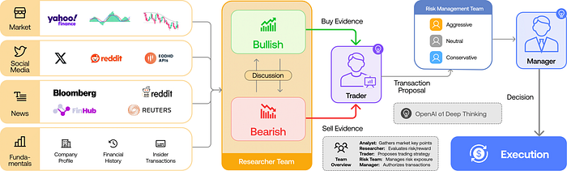
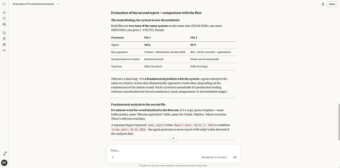
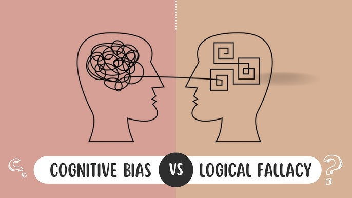
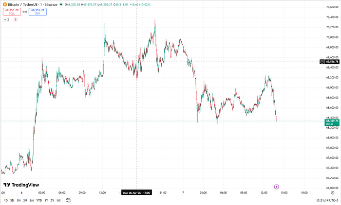
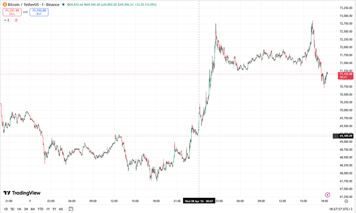
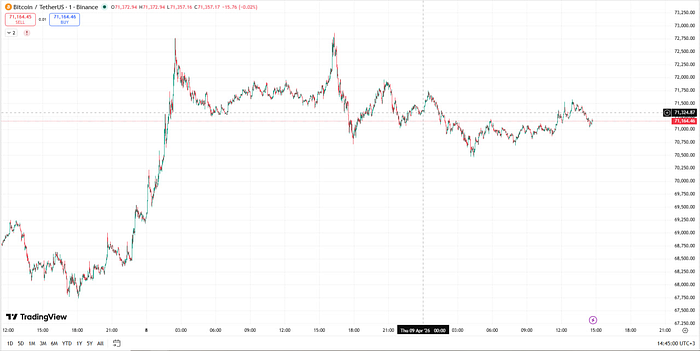

# 🤖 AI Agent for Trading Signals

> Existing solutions on GitHub have fatal flaws. Let's look at a few examples — pros and cons.


This article covers why existing LLM-based trading agents fail, and how the ReAct (reasoning + acting) pattern fixes the core problem. I'll show a working implementation that generated correct BUY/SELL/WAIT signals during the April 2026 Iran escalation, explain the hierarchical search prompt design, and share the full source code.


## TauricResearch/TradingAgents

> Link to [the source code](https://github.com/tripolskypetr/trading-agents-docker)



A pipeline that pulls posts from Reddit suggestions, X, Bloomberg, Reuters, and Yahoo Finance. Two agents then debate each other: one argues the price will go up, the other argues it will go down. You pass in a number for how many debate rounds to run — at the end, one agent's arguments win out.



This program creates the illusion of working. If you dig into the code, you'll see the swarm is fed a dump of raw indicators. LLMs are technically incapable of processing that properly in a text-based conversation due to a prioritization problem.



LLMs learn to justify an answer faster than they learn to reason carefully. When fed raw indicators — say, RSI and Stoch RSI together — the agent's response is shaped by whichever one it picks up first. But a situation where one indicator says the market is overbought and the other says oversold is extremely common. The chain of reasoning goes like this:

1. **RSI — oversold, in theory the price should go up**
2. **There's no backtesting tool to verify this hypothesis, so we don't think about it**
3. **Stoch RSI is overbought — I'm not looking at this anymore, I already have my answer**

If you hard-code priority weights for the indicators, the system stops being adaptive and bleeds money. [In this article](./05_ai_strategy_workflow.md) I showed how to build an environment that lets an agent dynamically set indicator priorities — but the price is steep: 200k tokens per backtest ($1.20 for Haiku 4.5, $3.60 for Sonnet 4.6, $6.00 for Opus 4.6). Don't update it frequently enough and you're back to static priorities. In other words, TauricResearch is just a coin flip.


Remove the indicators entirely and you get a vacuum cleaner effect. You have Reddit posts, but you have no idea whether it's one person posting their opinion from 10 accounts or 10 genuinely different people. There's also the paid API problem: plugging into X (Twitter) costs $200/month. If you rely on free APIs (like Mastodon), the blogger whose forecasts your agent was tracking might burn out and stop posting.


## tripolskypetr/node-ccxt-backtest

> Link to [the source code](https://github.com/tripolskypetr/node-ccxt-backtest)

Based on their failed experience, I took a different approach: 8 agents search for targeted news across different topics.

- **Balance Sheet** — On-chain reserves. Exchange outflows, LTH supply, illiquid supply share, HODL waves.
- **Cash Flow Statement** — Capital flows. Net ETF inflows, miner selling pressure, stablecoin exchange inflows, OTC trading volume.
- **Fundamental Metrics** — Network health. Hash rate, MVRV ratio, NVT ratio, Stock-to-Flow model.
- **P&L Report** — Network revenue. Transaction fees, Lightning throughput, bond activity, DeFi TVL.
- **Insider Transactions** — Smart money. MicroStrategy purchases, BlackRock ETF assets, Grayscale GBTC, government wallets.
- **Asset News** — Market sentiment. Regulatory events, exchange hacks, institutional adoption.
- **Global Macro** — Macro environment. Fed rate decisions, CPI surprise prints, DXY index, Fear & Greed index, M2 money supply.
- **Price History** — Volume spikes, breakout confirmations, closed trades.


In an ideal world, this should work. However, there are portfolio performance metrics to consider: `max drawdown` and `sharpe ratio`. The issue is that this kind of analysis is too fundamental and too disconnected from real market conditions — where the US president moves markets with a sh*tpost.


## Why Both Approaches Don't Work

They're the same thing at different scales: static queries to smart information sources, and static queries to dumb information sources. The problem is the approach itself: the query needs to adapt based on the new market conditions each day brings.


## The Reasoning + Acting Pattern

This is an LLM agent pattern where the model alternates between thinking and acting. Simplified: between reasoning steps, give the agent the ability to search the news feed — then it knows what to focus on: a fundamental breakdown or a local bounce.


## The Solution

I wrote the following code. Lucky timing: the US president decided to get involved with Iran and was kind enough to give me a live test case. The code is at the bottom of the article — first let's look at the signals and the price chart.


## Fundamental Analysis for All of April 2026

```
PS C:\Users\User\Documents\GitHub\node-ccxt-backtest-final> bun .\scripts\run_signal.ts
Searching Bitcoin breaking news April 6 2026
Searching Bitcoin SEC enforcement action April 6 2026
Searching Bitcoin flash crash April 6 2026
Searching April 6 2026 Bitcoin price dip
{
  id: "5f7b9988-c41b-4000-a848-cf8712a84000",
  reasoning: "The report is dominated by a negative driver: Donald Trump's tweet about military escalation with Iran triggered an oil price spike, dollar strengthening, and a sharp Bitcoin drop below $69,000. Against this backdrop, funding rates turned deeply negative — signaling growing short positions — while liquidation volume hit $400M and may accelerate the decline, especially on a break of the $66,000 level. Positive signals (Michael Saylor's purchase plan, Grayscale ETF price growth) are limited and unable to offset the intensified risk-off sentiment and short-side pressure. Further price decline expected in the coming hours.",
  signal: "SELL",
}
```

## April 5, 2026

```
PS C:\Users\User\Documents\GitHub\node-ccxt-backtest-final> bun .\scripts\run_signal.ts
Searching Bitcoin news April 5 2026
Searching Bitcoin flash crash April 5 2026
Searching April 5 2026 Bitcoin Trump tweet
{
  id: "4cc66bf6-4443-4800-aa43-28b6cb9f8800",
  reasoning: "The acute event is the US ultimatum to Iran, which raises geopolitical tensions and historically leads to price decline in the medium term (bearish risk scenario — probability ≈45%). Technical signals also point to weakness: price is trading below all moving averages, RSI at 44, volume is low, fear index at extreme fear (12) — which could trigger a fast short squeeze, but without a confirming news catalyst this is unlikely. Since signals are contradictory — a sharp drop below $65,500 is possible, but so is a quick rally on a break of $68,200 with volume confirmation — the picture is blurry. Better to stay out for now.\n\nConclusion: WAIT signal.",
  signal: "WAIT",
}
```



## April 8, 2026

```
PS C:\Users\User\Documents\GitHub\backtest-kit\example> bun .\scripts\run_research.ts
Searching April 8 2026 Bitcoin breaking news
Searching April 8 2026 Bitcoin hack withdrawal suspended
Searching April 8 2026 Trump tweet Bitcoin
Searching April 8 2026 Bitcoin flash crash
Searching Decrypt April 8 2026 Bitcoin Trump ceasefire
{
  id: "c5e27ed0-4bba-4000-a7a1-879b822d6000",
  signal: "BUY",
  reasoning: "The acute event driver — Trump's announcement of a two-week ceasefire with Iran (04:30 UTC) — triggered an instant Bitcoin rally to $72,000, liquidation of ~$425M in short positions, and a massive volume spike (>2M BTC/hour). These facts indicate a sharp bullish impulse that should sustain price growth in the coming hours. Optimal move: open a long with a tight stop-loss around $70,000.",
}
```



## April 9, 2026

```
PS C:\Users\User\Documents\GitHub\backtest-kit\example> bun .\scripts\run_research.ts
Searching Bitcoin breaking news April 9 2026
Searching Bitcoin Supply Shock: Long-Term Investors Now Control 21% Of Total BTC April 9 2026
Searching Bitcoin breaking news April 8 2026 20:00 UTC
{
  id: "8708ddc6-57aa-4800-a114-787029fbd000",
  reasoning: "The report shows a contradictory picture: on one hand — an acute event — price breaking above $71,000 following ceasefire news, pointing to short-term upside; on the other — strong bearish factors: significant miner selling, hash rate decline, put option dominance (premium ~17%), risk of breaking the $70,000 support and potential pullback to $58–63k, plus quantum vulnerability news rattling investors. With strong bullish and bearish signals present simultaneously, the trader's call is caution with no clear direction. Therefore, the most accurate signal is WAIT.",
  signal: "WAIT",
}
```




## Source Code

### Web Search Agent

```typescript
import { addAgent } from "agent-swarm-kit";
...
import { str } from "functools-kit";

addAgent({
  agentName: AgentName.WebSearchAgent,
  completion: CompletionName.OllamaTextCompletion,
  keepMessages: Infinity,
  prompt: str.newline(
    "You are a web search agent in a trading system agent swarm.",
    "",
    "Your task is to produce an objective report based on the user's query:",
    " * focus on negative news/metrics",
    " * no marketing spin",
    " * don't make things up",
    " * write only what you actually found",
    "",
    "Critical requirements:",
    " * The user specifies a DATE for the report — avoid look-ahead bias",
    " * Avoid bias from articles you find online: analyze the picture objectively, don't just copy one opinion",
    " * If you cannot explicitly determine the date of an internet source, do not use it in your conclusion",
    " * Run multiple search queries — gather all available information",
    "",
    "Don't stop until you've reached an answer to the user's question with reasoning",
    "Respond as a professional trader, in a format ready to paste into a file",
    "Don't write a prefix like 'Sure, here is your report' — just the file content",
    ""
  ),
  tools: [
    ToolName.WebSearchTool,
  ],
});
```

### Trading Signal Generator

```typescript
import {
  addOutline,
  commitAssistantMessage,
  commitUserMessage,
  dumpOutlineResult,
  execute,
  fork,
  IOutlineHistory,
  IOutlineResult,
} from "agent-swarm-kit";

...

import { str } from "functools-kit";

const DISPLAY_NAME_MAP = {
  BTCUSDT: "Bitcoin",
  ETHUSDT: "Ethereum",
  BNBUSDT: "Binance Coin (BNB)",
  XRPUSDT: "Ripple",
  SOLUSDT: "Solana",
};

const SEARCH_PROMPT = str.newline(
  "You are looking for acute event triggers from the last few hours — things that just happened and aren't fully priced in yet.",
  "Don't look for fundamental data (funding rate, liquidations, whale wallets) — those are lagging and already in the price.",
  "",
  "Level 1 — Acute Events (search first):",
  " - {asset} breaking news {date}",
  " - {asset} SEC CFTC DOJ enforcement action {date}",
  " - {asset} exchange hack withdrawal suspended {date}",
  " - {asset} flash crash reason {date}",
  " - Trump tweet statement Bitcoin crypto {date}",
  " - Bitcoin ETF approval rejection decision {date}",
  "",
  "Level 2 — Macro deviations from expectations (only if already happened):",
  " - Federal Reserve decision surprise Bitcoin reaction {date}",
  " - CPI inflation data surprise {date} Bitcoin",
  " - dollar DXY sudden move Bitcoin correlation {date}",
  "",
  "Level 3 — Volume anomalies:",
  " - {asset} unusual volume spike {date}",
  " - {asset} price sudden move reason {date}",
  "",
  "Level 4 — Pre-made analyst forecasts:",
  " - {asset} price forecast today {date}",
  " - {asset} price target analyst {date}",
  "",
  "Rules:",
  " * Only events from the last 4–12 hours — no week-old lagging analysis",
  " * If you can't explicitly determine a source's date — don't use it",
  " * Don't copy one article's opinion — look for confirmation from multiple sources",
  " * Write only what you found, no speculation",
);

const SIGNAL_PROMPT = str.newline(
  "You are a trader making a directional decision right now based on fresh market events.",
  "",
  "You have read the short-term signals report. Your task is to output one signal for the next few hours.",
  "",
  "**How to think:**",
  " - Acute events outweigh lagging analysis: an exchange hack, a regulator decision, an anomalous volume spike — these are facts, not forecasts",
  " - If data is sparse or no clear event has occurred — choose WAIT",
  " - If the picture is contradictory — choose WAIT",
  "",
  "**Signal definitions (pick exactly one):**",
  " - **BUY**:  Short-term data points to upside in the next few hours",
  " - **SELL**: Short-term data points to downside in the next few hours",
  " - **WAIT**: Data is insufficient or the picture is unclear — don't enter",
  "",
  "**Required output:**",
  "1. **signal**: BUY, SELL, or WAIT.",
  "2. **reasoning**: which specific events from the report led to this conclusion.",
);

const commitSignalSearch = async (
  query: string,
  date: Date,
  resultId: string,
  history: IOutlineHistory,
) => {
  const report = await fork(
    async (clientId, agentName) => {
      await commitUserMessage(
        str.newline(
          "Read what exactly I need you to find and say OK",
          "",
          SEARCH_PROMPT,
        ),
        "user",
        clientId,
        agentName,
      );
      await commitAssistantMessage("OK", clientId, agentName);
      const request = str.newline(
        `Find short-term signals for ${query} on the internet`,
        `Only events relevant as of ${dayjs(date).format("DD MMMM YYYY HH:mm Z")}`,
        `Produce a report on short-term risks and opportunities`,
      );
      return await execute(request, clientId, agentName);
    },
    {
      clientId: `${resultId}_signal`,
      swarmName: SwarmName.WebSearchSwarm,
      onError: (error) => console.error(`Error in SignalOutline search for ${query}:`, error),
    },
  );
  if (!report) {
    throw new Error("SignalOutline web search failed");
  }
  if (typeof report === "symbol") {
    throw new Error("SignalOutline web search failed");
  }
  await history.push(
    {
      role: "user",
      content: str.newline(
        "Read the short-term market signals report and say OK",
        "",
        report,
      ),
    },
    {
      role: "assistant",
      content: "OK",
    },
  );
};

addOutline<ResearchResponseContract>({
  outlineName: OutlineName.ResearchOutline,
  completion: CompletionName.OllamaOutlineToolCompletion,
  format: {
    type: "object",
    properties: {
      signal: {
        type: "string",
        description: "Short-term trading signal for the next few hours.",
        enum: ["BUY", "SELL", "WAIT"],
      },
      reasoning: {
        type: "string",
        description: "Specific events from the report that justify the signal.",
      },
    },
    required: ["signal", "reasoning"],
  },
  getOutlineHistory: async ({ resultId, history }, symbol: string, when: Date) => {
    const displayName = Reflect.get(DISPLAY_NAME_MAP, symbol) || symbol;
    await history.push({
      role: "system",
      content: str.newline(
        `Current date and time: ${dayjs(when).format("DD MMMM YYYY HH:mm")}`,
        `Asset: ${displayName}`,
      ),
    });
    await commitSignalSearch(displayName, when, resultId, history);
    await history.push({
      role: "user",
      content: SIGNAL_PROMPT,
    });
  },
  validations: [
    {
      validate: ({ data }) => {
        if (!data.signal) {
          throw new Error("signal field is empty");
        }
      },
      docDescription: "Validates that the signal is defined.",
    },
    {
      validate: ({ data }) => {
        if (data.signal === "BUY") {
          return;
        }
        if (data.signal === "SELL") {
          return;
        }
        if (data.signal === "WAIT") {
          return;
        }
        throw new Error("signal field must be BUY, SELL, or WAIT");
      },
      docDescription: "Validates that signal contains an allowed value.",
    },
    {
      validate: ({ data }) => {
        if (!data.reasoning) {
          throw new Error("reasoning field is empty");
        }
      },
      docDescription: "Validates that the signal is justified.",
    },
  ],
  callbacks: {
    async onValidDocument(result) {
      if (!result.data) {
        return;
      }
      await dumpOutlineResult(result, "./dump/outline/research");
    },
  },
});
```

## Thanks for Reading
