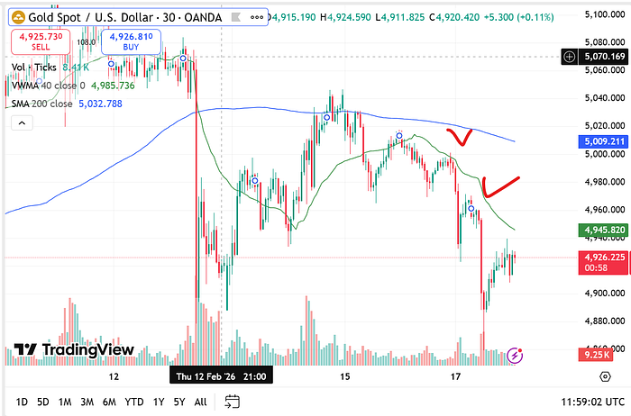
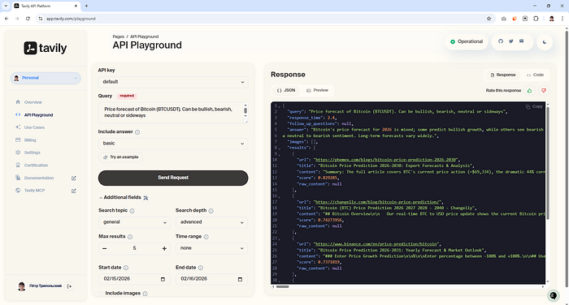
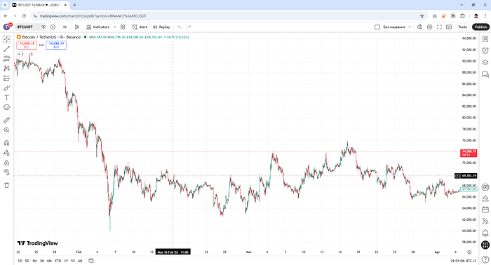
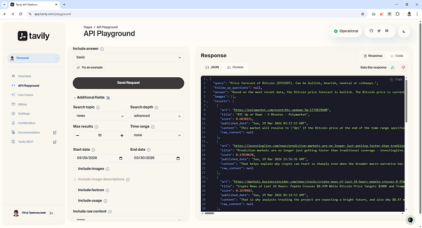
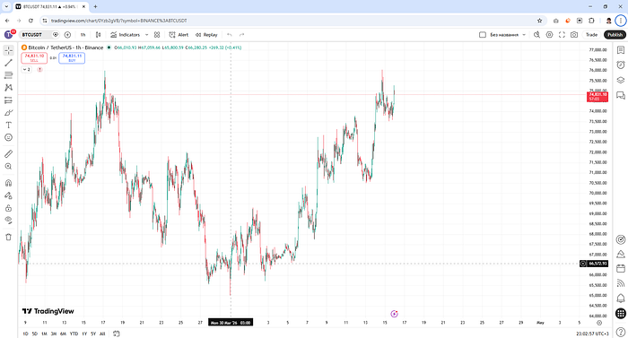
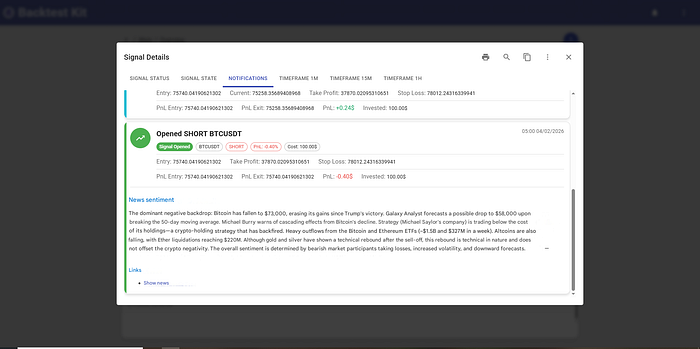
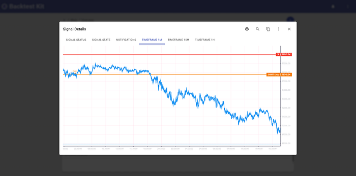
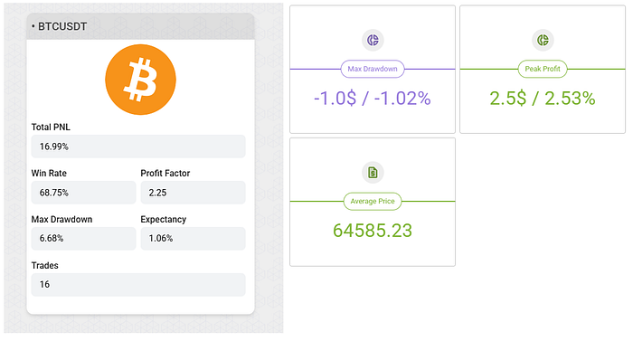

# 🧠 AI News Sentiment Analysis as a Trading Signal 🐻🔄🐂

> The source code discussed in this article is published [in this GitHub repository.](https://github.com/tripolskypetr/backtest-kit/tree/master/example)


When trading the market, you can observe situations where moving averages sharply reverse direction. An indicator is calibrated on historical data and assumes a stable regime. Technical analysis recommends using different sets of indicators when the market regime changes — but this doesn't work.



But wait — how did they ever work in the first place? Is this a scam of planetary scale, and what's actually going on?

## What Changed?

News sentiment defines the regime. The indicator works inside the regime. Sentiment being changed every 24 hours or shorter.


*https://cn.wsj.com/articles/在萬物皆可下注的時代-我們都在-監控局勢-1abd25ab*

## A Practical Guide to Identifying Sentiment

You need vector search over news. It's easy to implement using Scrapy + PostgreSQL + PgVector or Scrapy + MongoDB Atlas Vector Search. See VectorEmbeddings + Cosine Distance. I personally use a SaaS solution that fits within the free tier — tavily.com. Perplexity Search API also works. Below is a guide on how to structure your search queries to extract news sentiment.

### 1. Score as a Sorting Criterion, Not a Filter

The word "Trump" doesn't equal "Bitcoin" — but the implication is that he's speculating in the market. Maximum-score results will be flagged as direct advertising. Zero-score results don't mention Bitcoin at all. You want the **near-zero score** — that's exactly what shapes market sentiment.

Think of it like product placement: Corona beer in Fast & Furious, or a Sony smartphone in a James Bond film.

### 2. Domain Takes Priority Over Search Query

Searching for "SEC crypto enforcement action lawsuit" is a mistake. Market sentiment is created by specific domains and blogs — the market pioneers. If they don't repost a new SEC filing, nobody sees it. The SEC can show up at a blogger's door with a subpoena, but it's the blogger's post that moves the crowd.

### 3. Time Takes Priority Over Publication Meaning

Averaging kills directionality — morning optimism cancels out evening pessimism. Sentiment collapses into noise. A news item both **precedes** an impulse and **sustains** the continuation of price movement through a cascade. The criterion for the presence of a cascade is a statistically significant increase in the number of publications per unit of time. Each individual publication does not reflect the future in isolation — the future is the synergistic effect of publications combined.

### 4. Find the Fundamental Narrative Being Priced In — Don't Invent Your Own

It is critically important to use **VectorEmbeddings + Cosine Distance** rather than an LLM for sentiment search. An LLM will see the keyword "Overbought RSI" and hallucinate a market move from its own knowledge. The task is not to interpret meaning — it's to find the **sentiment that authoritative participants are embedding into the market**. See RAG Embedding Models.

### 5. Volume of Publications Increases Noise

You can build a well-crafted system for detecting market sentiment in publications — but the sources themselves may have no audience. What needs calibration is not the prompt, but the **set of authorities whose recommendations actually influence retail traders**.

## Important

LLM and vector news search must be **physically separated**. Vector search should be performed against the concept of "forecast/outlook," while the LLM should analyze market sentiment. Otherwise, the output will not reflect the fundamental trend being priced in — preceded by a shift in market participant sentiment — but rather an interpretation of technical analysis indicators.

## Testing the Hypothesis

### Case 1. Neutral-Bearish Trend

Using the recommendations above, I constructed a search query. Tavily has a built-in LLM that produces a short summary across results.

- Search query result: **neutral-bearish sentiment**



- Market reaction:



### Case 2. Bullish Sentiment

Repeating the experiment on a different date:

- Search query result: **bullish sentiment**



- Market reaction:



## Recommendations on Search Time Window

**1. Not all news agencies include a publication time.** To avoid [look-ahead bias](./01_look_ahead_bias.md), those sources must be excluded from the dataset. Among them:

- coindesk.com
- reuters.com
- bloomberg.com
- wsj.com

In Tavily's database, these are assigned a timestamp of `Thu, ?? Jan ???? 00:00:00 GMT`. To filter them out, cast to UTC — otherwise your local timezone will be used as an offset:

```js
const hour = dayjs(publishedDate).utc().get("hour");
const minute = dayjs(publishedDate).utc().get("minute");
if (hour === 0 && minute === 0) {
    console.warn(`fetchNews search invalid publishedDate query=${query} url=${url} from=${from} to=${to}`)
    return false;
}
```

**2. Query data from -2 days back and filter the last 24 hours on your side.**

Tavily uses a date without a time component when searching, so on the boundary between 23:59 and 00:00 you will lose publications. Even with a perfect site parser, distributed CDN databases are a problem: the same news article reaches readers at different times as server capacity becomes available.

**3. Don't try to outrun the market.**

Averaging kills directionality: morning optimism cancels out evening pessimism, and sentiment drifts toward noise. But if you take a window shorter than 24 hours, it becomes unclear how to interpret sentiment: Trump is bombing Iran — but it's unclear whether Bitcoin will drop to zero or rally. A **24-hour window is optimal** for understanding context and cutting through noise.

## Backtest

All of the above recommendations were successfully automated. The AI agent identifies a news signal:



And holds the position until the news sentiment is exhausted:



For risk management, a statistically unreachable hard stop is set alongside a trailing take-profit.

## Why Indicators Don't Work

Traders try to tune a trading regime over a month — but sentiment alternates every day: bearish, bullish, bullish, bearish. As a result, both the bullish and bearish strategies each land at 50/50.

## What Can Be Improved

If you exit on a sentiment change, some profit is lost due to the news parser's latency. My solution: exit on a **3% pullback from the position's maximum PnL**.



This means a shortfall of 3% PnL multiplied across 10 positions — that's +30% additional profit on top of the existing 16%. Given that the news sentiment is predictable at the time the position is open: do you think it's worth trying to use an indicator for the exit signal?

## Thank you for your attention
