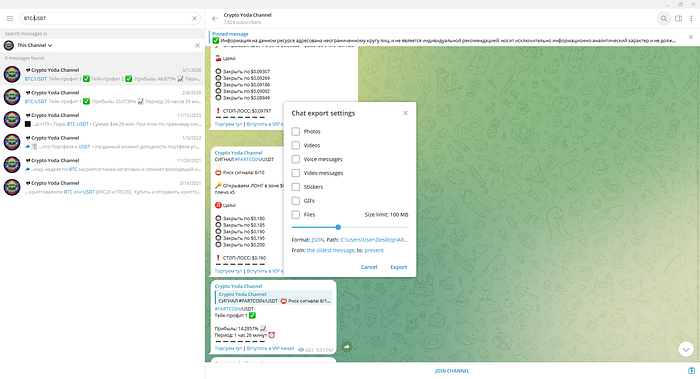
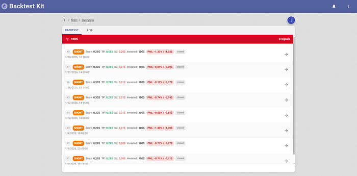
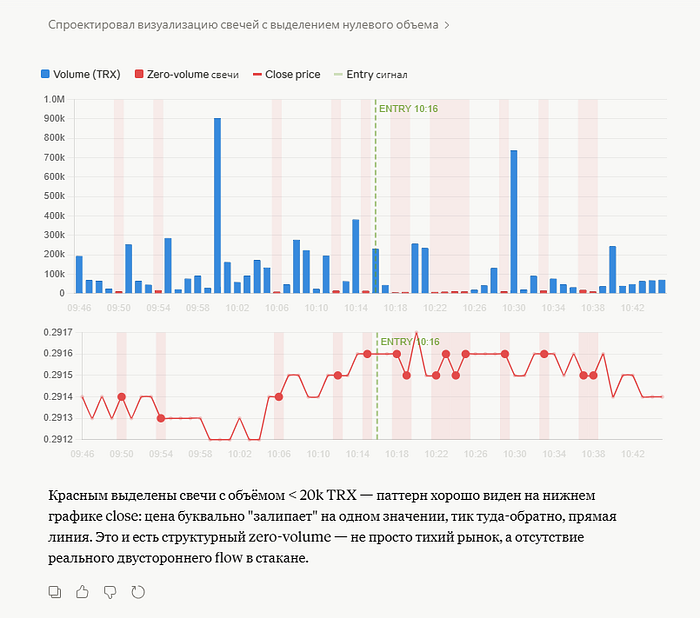
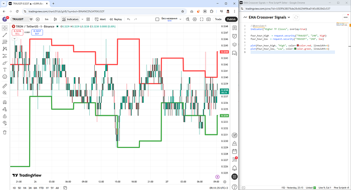
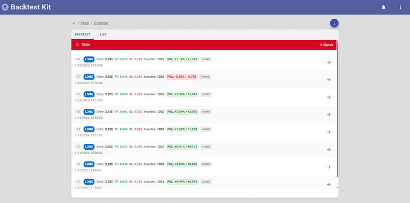
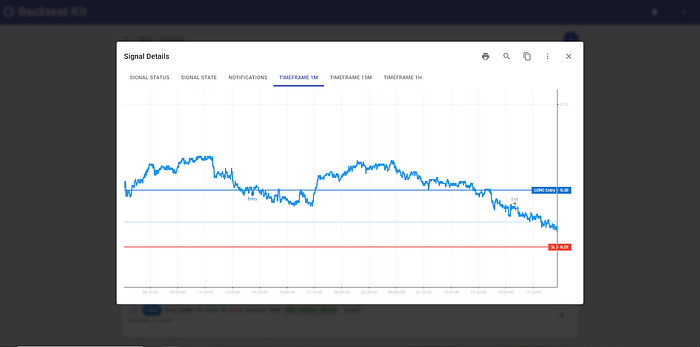

# 🔪 AI Liquidity Harvesting Machine

> The source code discussed in this article is published [in this GitHub repository.](https://github.com/tripolskypetr/backtest-kit/tree/master/example)


Telegram is full of signal channels — services that publish trading recommendations telling you at what price to buy or sell an asset. Before following any of them, it makes sense to backtest their historical signals.



After exporting the signals to a file and running analysis, a pattern becomes visible: repeated sequences where opening a position in the *opposite* direction would have been correct.



The channel author is a craftsman — in January 2026, all 8 out of 8 SHORT signals on TRXUSDT moved sharply in the opposite direction within 45 minutes of publication. But is this actually the author's doing?

## Cracking Open the Tamagotchi

The step multipliers between take-profit targets are always ×1.52 → ×1.74 → ×1.47 → ×1.50. The T5/SL ratio is always 1.34. This recommendation was generated by a trading algorithm. But that's not the most interesting part.



Fifteen minutes before each post, a volume anomaly appears on the chart: a large blue candle at 10:00. The post publishes at 10:15. Then another candle at exactly 10:30.



The SHORT recommendation with x25 leverage is placed precisely at the low of the 4H candle (green line).

## Inverting the Signal and Trading the Counter-Trend

Using the criteria above, we invert the recommendation and enter against the suggested direction. For signal #7, the move occurred but was insufficient to move the position to breakeven.



Here is the price chart showing what happened after each SHORT recommendation with x25 leverage:



## Performance

**Portfolio PNL:** 8.54%  
**Portfolio Sharpe:** 1.08  
**Avg Peak PNL:** 1.44%  
**Avg Max Drawdown PNL:** −0.48%

## Source Code

```javascript
addStrategySchema({
  strategyName: "jan_2026_strategy",
  getSignal: async (symbol, when, currentPrice) => {

    const signal = getActiveSignal(symbol, when);

    if (!signal) {
      return null;
    }

    const close_1m = await getClosePrice(symbol, "1m");

    if (close_1m < signal.entry.from || close_1m > signal.entry.to) {
      return null;
    }

    const [close_4h_prev, close_4h_cur] = await getCandles(symbol, "4h", 2);

    const range_high = Math.max(close_4h_prev.high, close_4h_cur.high);
    const range_low = Math.min(close_4h_prev.low, close_4h_cur.low); 
    const range_middle = (range_high + range_low) / 2; 

    const position = close_1m > range_middle ? "short" : "long";

    return {
      position,
      ...Position.moonbag({
        position,
        currentPrice,
        percentStopLoss: HARD_STOP,
      }),
      minuteEstimatedTime: 24 * 60,
      note: signal.note,
    };
  },
});

listenActivePing(async ({ symbol, data }) => {
  const peakProfitDistance = await getPositionHighestProfitDistancePnlPercentage(symbol);
  const currentProfit = await getPositionPnlPercent(symbol);
  if (currentProfit < 0) {
    return;
  }
  if (peakProfitDistance < TRAILING_TAKE) {
    return;
  }
  Log.info("position closed due to the trailing take", {
    symbol,
    data,
  });
  await commitClosePending(symbol, {
    id: "unknown",
    note: str.newline(
      "# Позиция закрыта по trailing take",
    ),
  });
});

listenActivePing(async ({ symbol, data }) => {
  const peakProfitCost = await getPositionHighestPnlPercentage(symbol);
  const peakProfitMinutes = await getPositionHighestProfitMinutes(symbol);
  if (peakProfitCost < PEAK_STALENESS_SINCE_PROFIT) {
    return;
  }
  if (peakProfitMinutes < PEAK_STALENESS_SINCE_MINUTES) {
    return;
  }
  Log.info("position closed due to the peak staleness", {
    symbol,
    data,
  });
  await commitClosePending(symbol, {
    id: "unknown",
    note: str.newline(
      "# Позиция закрыта по peak staleness",
    ),
  });
});
```

## Thanks for reading!