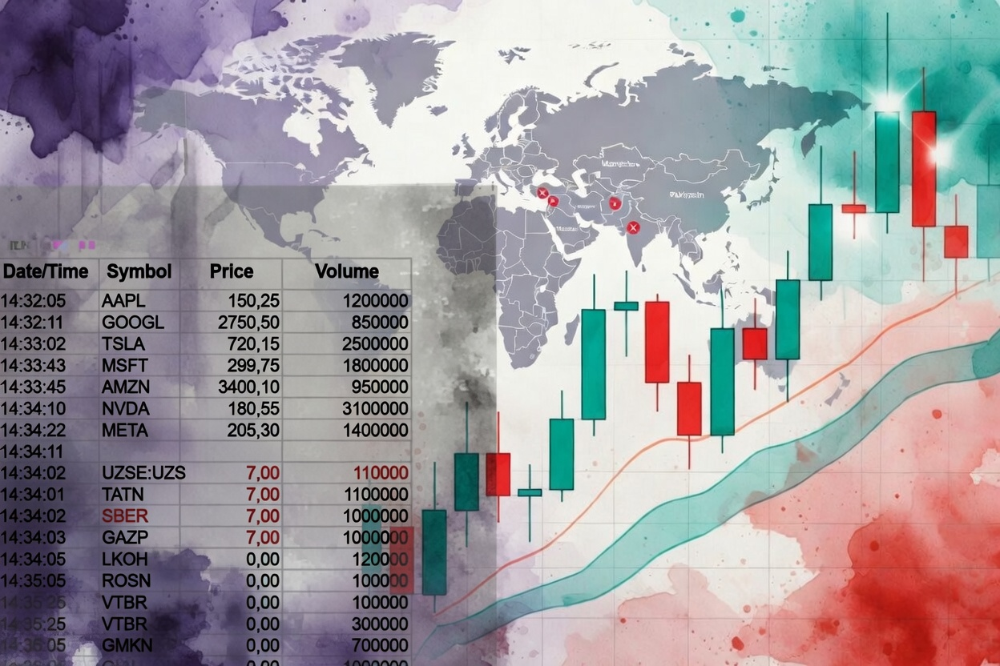
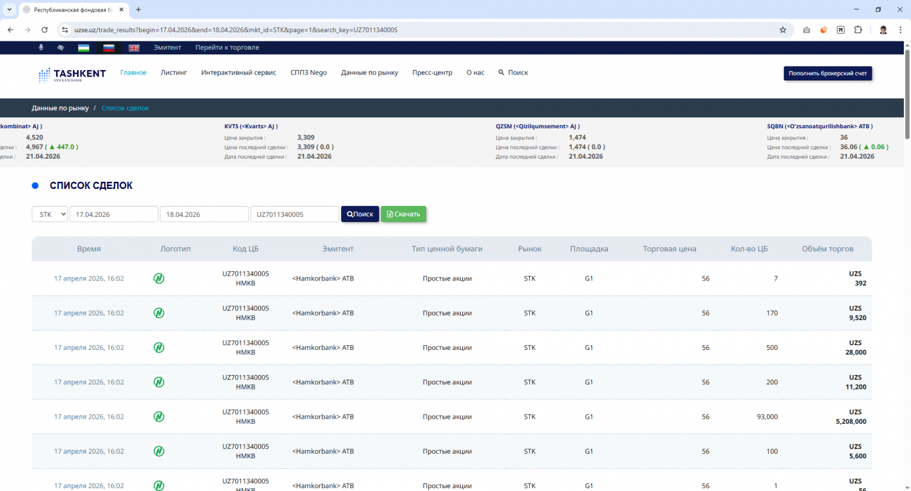
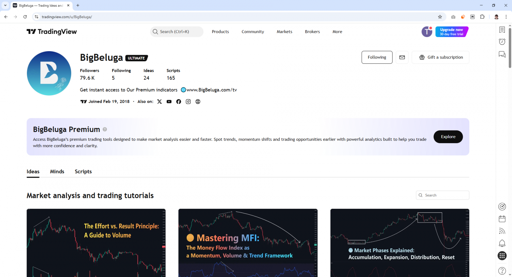

# Running Pine Script on Exchanges Without TradingView

> The source code discussed in this article is [published in this repository](https://github.com/backtest-kit/uzse-backtest-app)



The Pine Script ecosystem contains a huge number of technical analysis tools. However, TradingView itself is not available everywhere. For example, regional stock exchanges of emerging markets that are simply not on TradingView at all — no data, no trading.

- MSE (Mongolia) — not available
- UZSE (Uzbekistan) — not available
- DSE (Dhaka, Bangladesh) — not available
- GSE (Ghana) — not available
- SGBV (Algeria) — not available
- BSE (Botswana) — not available
- ESE (Eswatini) — not available
- MERJ (Seychelles) — not available

## Why Not Just Use Their Websites?

When instead of a clear price chart I see raw aggregate trades with the ability to download only one month in Excel (given a 6-hour trading day and constant holidays), I feel blind. The registration button leads nowhere.



Beyond the price chart, to avoid being limited to standard Excel, I wanted to apply the full range of Open Source tools rather than reinventing the wheel.



## Building Candles from Executed Trades

The first script downloads pages with trades. Excel could have been used, but it doesn't include minutes:

```typescript
async function main() {
  const buildUrl = (p: number) =>
    `https://uzse.uz/trade_results?begin=${begin}&end=${end}&mkt_id=${mktId}&page=${p}&search_key=${symbol}`;

  const browser = await chromium.launch({ headless: true });
  const page = await browser.newPage();

  const firstHtml = await fetchPage(page, buildUrl(1));
  fs.writeFileSync(path.join(TMP_DIR, "trades_page_1.html"), firstHtml, "utf8");

  const totalPages = getLastPage(firstHtml);
  console.log(`Total pages: ${totalPages}`);

  for (let p = 2; p <= totalPages; p++) {
    const html = await fetchPage(page, buildUrl(p));
    fs.writeFileSync(path.join(TMP_DIR, `trades_page_${p}.html`), html, "utf8");
    console.log(`Downloaded page ${p}/${totalPages}`);
  }

  await browser.close();
  console.log(`Done. HTML saved to ${TMP_DIR}`);
}
```

The second script imports into MongoDB:

```typescript
function parseHtmlTable(html: string, pageIndex: number) {
  const rows: object[] = [];
  const trRegex = /<tr[\s\S]*?<\/tr>/gi;
  const tdRegex = /<td[^>]*>([\s\S]*?)<\/td>/gi;
  const tagRegex = /<[^>]+>/g;
  let rowIndex = 0;
  const urlKey = extractUrlKey(html);

  let trMatch: RegExpExecArray | null;
  while ((trMatch = trRegex.exec(html)) !== null) {
    const rowHtml = trMatch[0];
    const cells: string[] = [];
    let tdMatch: RegExpExecArray | null;
    while ((tdMatch = tdRegex.exec(rowHtml)) !== null) {
      cells.push(tdMatch[1].replace(tagRegex, " ").replace(/\s+/g, " ").trim());
    }
    if (cells.length < 10) continue;

    const symbolParts = cells[2].split(/\s+/).filter(Boolean);
    const volumeParts = cells[9].split(/\s+/).filter(Boolean);

    const time = parseRuDate(cells[0]);
    const symbol = symbolParts[0] ?? "";
    const tradePrice = parseNumber(cells[7]);
    const quantity = parseNumber(cells[8]);
    const volume = parseNumber(volumeParts[volumeParts.length - 1] ?? "");
    const hash = crypto
      .createHash("sha1")
      .update(`${symbol}|${time?.toISOString()}|${tradePrice}|${quantity}|${volume}|${pageIndex}|${rowIndex}|${urlKey}`)
      .digest("hex");

    rowIndex++;
    rows.push({ time, symbol, issuer: cells[3], securityType: cells[4], market: cells[5], platform: cells[6], tradePrice, quantity, volume, hash });
  }
  return rows.filter((r: any) => r.time !== null);
}
```

## Seeing the Chart


**Trading was halted for a week from 12.08.2023 to 21.08.2023**. It looks alarming, so we ask Claude what happened during that period. We get a reasoned answer with references.

**Reason for the crash:** an additional share issuance that tripled the authorized capital.

At the annual general meeting of shareholders on May 26, 2023, a decision was made to increase the bank's authorized capital from 107.77 billion soums to 323.32 billion soums — **i.e. approximately 3x** — through retained earnings. The new share issue was registered by the regulator on August 7, 2023.

The shares were placed through a private subscription among existing shareholders included in the register, formed on the 10th day from the date of state registration of the issue — meaning the register was fixed approximately **on August 17, 2023**.

The profit is not paid out in cash but is converted into shares.

## Looking at Technical Analysis


I picked the first indicator I came across. **It seems we sell at the red bearish line price and buy at the green bullish one**. The important thing is that the complex visualization worked.


You can also view the history. It is visible that the price moved far above `SMA(20)` several times. **The same pattern: several days without trading before it.** Looks like a `single-price auction day`.

## How to Connect Candles

File `./modules/editor.module.ts`:

```typescript
import { addExchangeSchema } from "backtest-kit";
import { CandleModel } from "../schema/Candle.schema";

import "../config/setup";

addExchangeSchema({
  exchangeName: "mongo-exchange",
  getCandles: async (symbol, interval, since, limit) => {
    const candles = await CandleModel.find(
      { symbol, interval, timestamp: { $gte: since.getTime() } },
      { timestamp: 1, open: 1, high: 1, low: 1, close: 1, volume: 1, _id: 0 }
    )
      .sort({ timestamp: 1 })
      .limit(limit)
      .lean();

    return candles.map(({ timestamp, open, high, low, close, volume }) => ({
      timestamp,
      open,
      high,
      low,
      close,
      volume,
    }));
  },
});
```

## How to Run

Via `npm start`:

```json
{
  "name": "backtest-kit-project",
  "version": "1.0.0",
  "description": "Backtest Kit trading bot project",
  "main": "index.js",
  "homepage": "https://backtest-kit.github.io/documents/article_07_ai_news_trading_signals.html",
  "scripts": {
    "start": "node ./node_modules/@backtest-kit/cli/build/index.mjs --editor"
  },
  "keywords": [],
  "author": "",
  "license": "ISC",
  "type": "commonjs",
  "dependencies": {
    "@backtest-kit/cli": "^7.1.0",
    "@backtest-kit/graph": "^7.1.0",
    "@backtest-kit/pinets": "^7.1.0",
    "@backtest-kit/ui": "^7.1.0",
    "agent-swarm-kit": "^2.5.1",
    "backtest-kit": "^7.1.0",
    "functools-kit": "^2.2.0",
    "garch": "^1.2.3",
    "get-moment-stamp": "^1.1.2",
    "mongoose": "^8.23.0",
    "ollama": "^0.6.3",
    "playwright": "^1.59.1",
    "volume-anomaly": "^1.2.3"
  }
}
```

## What's Interesting

1. **Market participants cannot hire a Pine Script developer**

   They are hard to find on the market and there is nowhere to place them: there is no TradingView infrastructure. Writing indicator visualizations is a technically complex task that AI will not solve — a human is needed.

2. **News sentiment does not affect stock prices**

   An indicator is calibrated on historical data. Historical data becomes invalid if market sentiment has changed. [Uzbekistan news is not media-prominent](https://www.gazeta.uz/ru/2026/04/17/ravshan-muhitdinov/).

3. **Party policy is investment**

   The only news source that affects sentiment is the president of the republic. He [called it a shared responsibility](https://www.gazeta.uz/ru/2026/04/20/drugs/) of the entire international community to help such regions through investment in their economies and development.

---

You can read more [about the influence of news sentiment on the market](https://habr.com/ru/articles/1025238/).

**This is exactly the reason why indicators stopped working on major markets: the new value of an indicator itself has become news.**