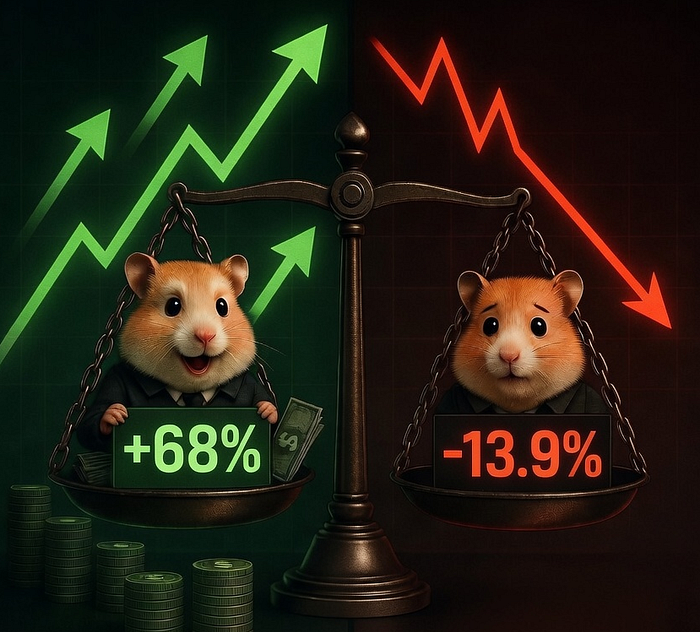
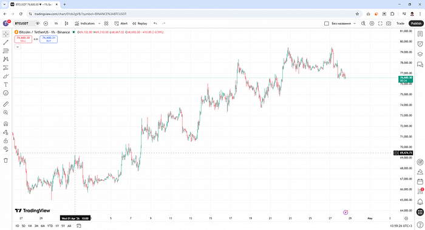
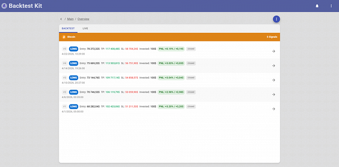
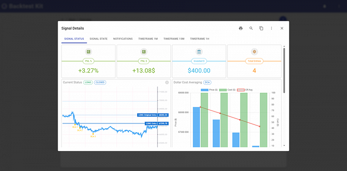
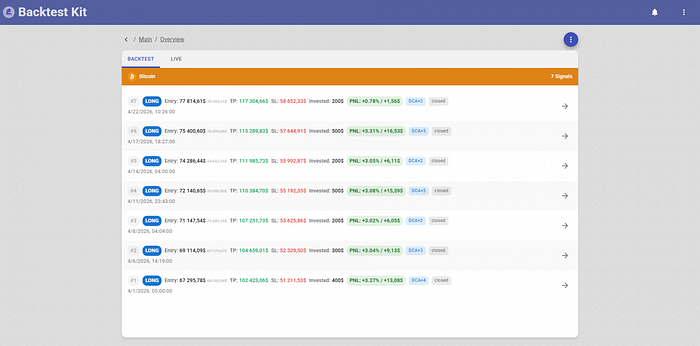
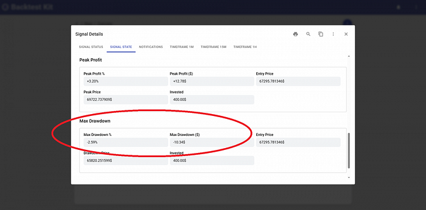
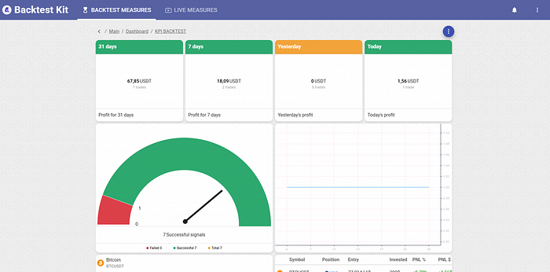
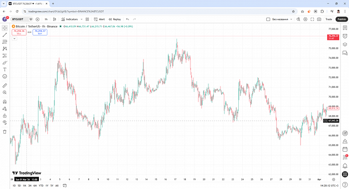

# 🥶 Why Your Broker Froze Your Deposit or Where Does +20% Per Month Come From

> The source code discussed in this article is published [in this repository.](https://github.com/tripolskypetr/backtest-kit/tree/master/example)



## Asset Price Averaging

There's a trading technique called asset price averaging. Let's say we have insider knowledge that Trump is about to post some good news about Iran. So we buy Bitcoin in advance on the rumor, planning to sell it to retail investors once the news breaks.



However, we'd only capture the raw market move. The market went from $65,820 to $79,382 — that's +15.3%. If we take profit in portions, it comes out to about 12%. We put in $100 at the start and pulled out $112.45 at the end. Not a lot for a whole month of waiting.



Here's a trick. The market doesn't rise linearly — there are pullbacks along the way. If the price starts to fall, instead of selling we buy again.



Let me briefly explain the math. A coin was worth 100 rubles, then 75, then 50, then 25. If you buy the coin on each of those days, your average cost per coin is 62.5 rubles — simple arithmetic mean. That's exactly halfway between 50 and 75 rubles.



Looks a lot more attractive already. 12% turns into 19%, and we earned $67.85 instead of $12.45. On top of that, our capital is actually working — we deployed not $100 but $500 total.

## But there's a catch.



Even at a -2.5% price dip — which is perfectly normal volatility for Bitcoin — your account balance in fiat will show -$10 at that moment. Your broker will tell you that your funds are frozen.

## Everything Is Going According to Plan

Over the course of a month, the worst drawdown on a single trade was 13.92% (−$50.41). In reality, these funds aren't frozen — they're simply gone. The broker is just lying to you, telling you everything is fine. That's because their dashboard only shows closed positions: displaying real-time portfolio drawdowns would cause panic and trigger a mass withdrawal of funds from their scheme.



## But what happens if the news forecast doesn't play out?



## Source code

```javascript
/**
 * Averaging
 */
listenActivePing(async ({ symbol, currentPrice }) => {
  const { length: steps } = await getPositionEntries(symbol);
  if (steps >= LADDER_MAX_STEPS) {
    return;
  }
  const hasOverlap = await getPositionEntryOverlap(symbol, currentPrice, {
    upperPercent: LADDER_UPPER_STEP,
    lowerPercent: LADDER_LOWER_STEP,
  });
  if (hasOverlap) {
    return;
  }
  await commitAverageBuy(symbol, LADDER_STEP_COST);
});

/**
 * Closing
 */
listenActivePing(async ({ symbol, data, timestamp }) => {
  console.log(new Date(timestamp));
  const currentProfit = await getPositionPnlPercent(symbol);
  if (currentProfit < TARGET_PROFIT) {
    return;
  }
  Log.info("position closed due to the target pnl reached", {
    symbol,
    data,
  });
  await commitClosePending(symbol, {
    id: "unknown",
    note: str.newline(
      "# Position closed on target PnL",
    ),
  });
});
```
