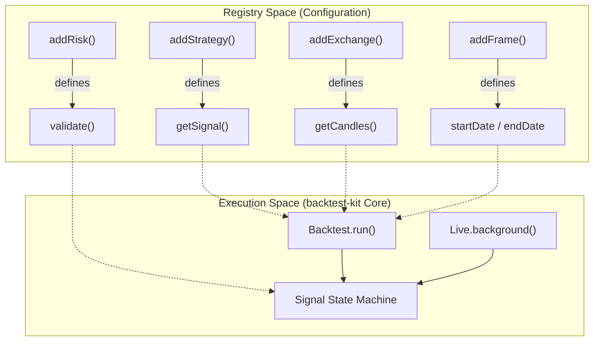
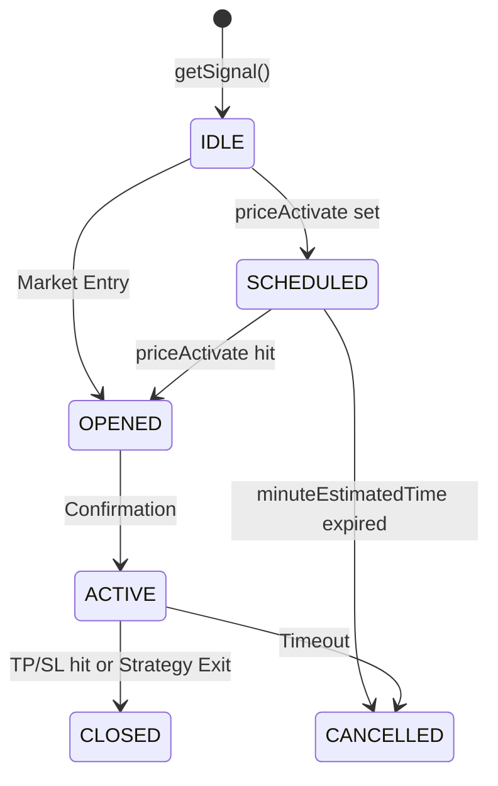

# backtest-kit Framework

Relevant source files

The following files were used as context for generating this wiki page:

- [docs/01-getting-started.md](docs/01-getting-started.md)
- [docs/02-first-backtest.md](docs/02-first-backtest.md)

The `backtest-kit` framework is the core execution engine of the **news-sentiment-ai-trader**. It provides a standardized, modular environment for developing, testing, and deploying trading strategies. The framework is built on a registry pattern, allowing developers to decouple trading logic (Strategies) from data sources (Exchanges) and execution environments (Backtest vs. Live).

### Core Philosophy
- **Registry Pattern**: All components (Strategies, Exchanges, Risk Profiles) are registered via `add*` functions before execution.
- **Context Awareness**: The framework uses `di-kit` and `di-scoped` to manage service lifetimes, ensuring that logic like `getCandles` automatically fetches the correct data depending on whether it's running in a historical backtest or a live market [docs/01-getting-started.md:196-202]().
- **State Machine Execution**: Every trade follows a strict state transition model to prevent logical errors and ensure accurate PNL calculation [docs/02-first-backtest.md:10-14]().

### System Architecture Overview

The following diagram illustrates how the framework bridges high-level strategy definitions with low-level code entities and the execution loop.

**Framework Entity Mapping**

**Sources:** [docs/02-first-backtest.md:10-14](), [docs/01-getting-started.md:226-235]()

---

### Backtesting & Performance Reporting
The backtesting engine simulates market conditions by iterating through timeframes defined in a `Frame`. It uses an asynchronous generator `Backtest.run()` to stream results in real-time or `Backtest.background()` for event-driven processing. A critical feature is the prevention of look-ahead bias; the framework ensures that `getSignal` only has access to data available at the simulated timestamp.

For details, see [Backtesting: Execution & Reporting](#4.1).

**Sources:** [docs/02-first-backtest.md:237-248](), [docs/01-getting-started.md:14-14]()

---

### Signal State Machine
Every signal generated by a strategy enters a state machine that governs its lifecycle. This system handles the transition from a "scheduled" pending order to an "active" position, and finally to a "closed" state. It calculates PNL by factoring in slippage (`CC_PERCENT_SLIPPAGE`) and exchange fees (`CC_PERCENT_FEE`).

For details, see [Signal State Machine](#4.2).

**State Transition Flow**

**Sources:** [docs/02-first-backtest.md:83-96](), [docs/01-getting-started.md:179-186]()

---

### Live Trading Mode
In live mode, the framework switches from iterating over historical frames to a real-time `while(true)` loop. It includes robust crash recovery mechanisms using persistence adapters (e.g., `PersistSignalAdapter`) to ensure that if the process restarts, it can resume tracking active positions and pending schedules without data loss.

For details, see [Live Trading Mode](#4.3).

**Sources:** [docs/01-getting-started.md:15-15](), [docs/01-getting-started.md:250-260]()

---

### Risk Management
The risk subsystem acts as a gatekeeper between signal generation and execution. Registered via `addRisk()`, these validators check the `IRiskValidationPayload` (portfolio state) to enforce constraints such as maximum concurrent positions, symbol-specific restrictions, or time-based trading halts.

For details, see [Risk Management](#4.4).

**Sources:** [docs/01-getting-started.md:79-79](), [docs/01-getting-started.md:257-257]()

---

### AI Strategy Optimization & Walker
The `Walker` and `Optimizer` modules represent the meta-layer of the framework. The `Optimizer` uses LLMs (via Ollama) to generate strategy code, while the `Walker` executes multi-strategy comparisons over the same timeframe to identify the most profitable logic.

For details, see [AI Strategy Optimization & Walker](#4.5).

**Sources:** [docs/01-getting-started.md:16-17](), [docs/01-getting-started.md:35-35]()

---

### Global Configuration Parameters
The framework behavior is tuned via `GLOBAL_CONFIG`. These parameters define the economic environment of the simulation and the safety bounds of live execution.

| Parameter | Default | Purpose |
| :--- | :--- | :--- |
| `CC_PERCENT_SLIPPAGE` | 0.1 | Simulated slippage per trade (%) [docs/01-getting-started.md:181-181]() |
| `CC_PERCENT_FEE` | 0.1 | Trading fee per transaction (%) [docs/01-getting-started.md:182-182]() |
| `CC_SCHEDULE_AWAIT_MINUTES` | - | Max wait for pending signal activation [docs/01-getting-started.md:179-179]() |
| `CC_MAX_SIGNAL_LIFETIME_MINUTES` | 1440 | Hard timeout for any open position [docs/01-getting-started.md:186-186]() |

**Sources:** [docs/01-getting-started.md:175-193]()