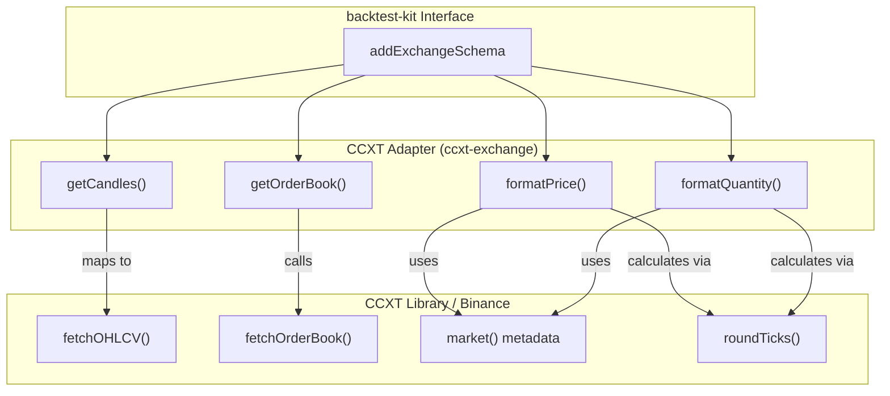
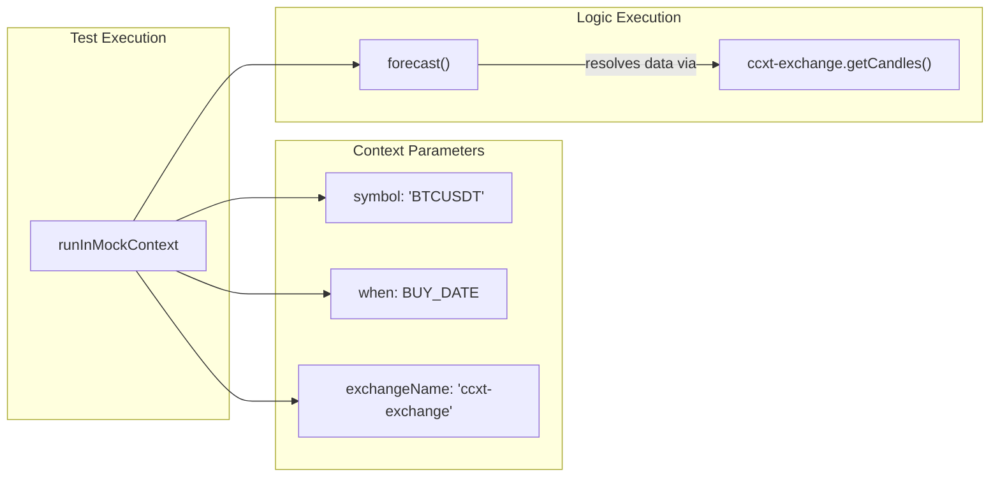

# CCXT Exchange Adapter

Relevant source files

The following files were used as context for generating this wiki page:

- [modules/dump.module.ts](modules/dump.module.ts)
- [modules/pine.module.ts](modules/pine.module.ts)
- [modules/walker.module.ts](modules/walker.module.ts)
- [scripts/run_forecast.ts](scripts/run_forecast.ts)

The CCXT Exchange Adapter provides a standardized interface between the `backtest-kit` framework and the CCXT library, specifically configured for Binance. It implements a reusable `ccxt-exchange` schema that handles market data retrieval, order book fetching, and precision formatting for prices and quantities. This adapter is shared across data dumping, strategy optimization, and forecast testing modules.

### Singleton Exchange Initialization

To prevent redundant network connections and repeated market loading, the adapter utilizes a `singleshot` singleton pattern to initialize the Binance exchange instance.

| Feature | Configuration | File Reference |
| :--- | :--- | :--- |
| **Exchange** | `ccxt.binance` | [modules/walker.module.ts:6-6]() |
| **Market Type** | `spot` | [modules/walker.module.ts:8-8]() |
| **Time Sync** | `adjustForTimeDifference: true` | [modules/walker.module.ts:9-9]() |
| **Rate Limiting** | `enableRateLimit: true` | [modules/walker.module.ts:12-12]() |

The `getExchange` function ensures that `exchange.loadMarkets()` is called exactly once before any trading or data fetching operations occur [modules/walker.module.ts:5-16]().

**Sources:** [modules/walker.module.ts:5-16](), [modules/dump.module.ts:5-16](), [scripts/run_forecast.ts:9-20]()

### Exchange Schema Implementation

The adapter is registered using `addExchangeSchema`, defining how the system interacts with the physical exchange.

#### OHLCV Data Mapping
The `getCandles` function maps CCXT's `fetchOHLCV` output (an array of arrays) into the structured object format required by the `backtest-kit` engine [modules/dump.module.ts:20-36]().

#### Order Book with Backtest Guard
The `getOrderBook` implementation includes a safety check to prevent execution during backtests, as historical order book data is not supported in the default schema [modules/walker.module.ts:37-42](). In live contexts, it fetches and formats asks and bids as string-based price/quantity pairs [modules/walker.module.ts:44-55]().

#### Precision and Tick Formatting
To ensure orders are accepted by the exchange, the adapter provides `formatPrice` and `formatQuantity`. These functions retrieve `tickSize` and `stepSize` from the market metadata [modules/walker.module.ts:57-74]().
- **Priority 1:** Uses `market.limits` or `market.precision` to find the minimum increment.
- **Priority 2:** Applies `roundTicks` to align the value with the exchange's required increments [modules/walker.module.ts:62-71]().
- **Fallback:** Uses CCXT's built-in `priceToPrecision` or `amountToPrecision` methods [modules/walker.module.ts:64-73]().

**Sources:** [modules/walker.module.ts:18-75](), [modules/dump.module.ts:18-37](), [scripts/run_forecast.ts:24-61]()

### Code Entity Mapping: Exchange Integration

This diagram maps the natural language requirements of exchange interaction to the specific code entities and CCXT methods used in the implementation.

**Exchange Data Flow**

**Sources:** [modules/walker.module.ts:18-75](), [scripts/run_forecast.ts:24-61]()

### Usage in Forecast Testing

The `run_forecast.ts` script utilizes the `ccxt-exchange` schema within a `runInMockContext` wrapper. This allows developers to test the LLM's forecasting logic against real-world historical data by mocking the execution environment (symbol and timestamp) while providing the actual exchange adapter for data resolution.

**Forecast Mock Context Flow**

**Sources:** [scripts/run_forecast.ts:63-75]()

### Implementation Summary Table

| Module | Schema Role | Key Functions |
| :--- | :--- | :--- |
| `dump.module.ts` | Data Extraction | `getCandles` |
| `walker.module.ts` | Strategy Optimization | `getCandles`, `getOrderBook`, `formatPrice`, `formatQuantity` |
| `pine.module.ts` | Signal Generation | `getCandles` |
| `run_forecast.ts` | Logic Validation | `getCandles`, `formatPrice`, `formatQuantity` |

**Sources:** [modules/dump.module.ts:1-37](), [modules/pine.module.ts:1-37](), [modules/walker.module.ts:1-75](), [scripts/run_forecast.ts:1-61]()