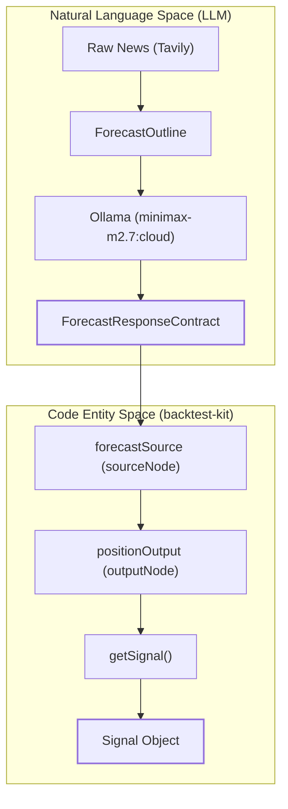
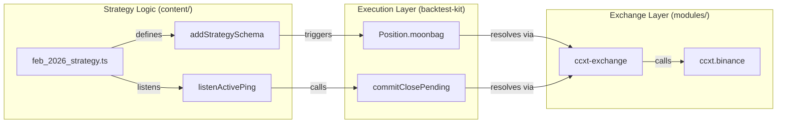

# Glossary

Relevant source files

The following files were used as context for generating this wiki page:

- [README.md](README.md)
- [config/symbol.config.cjs](config/symbol.config.cjs)
- [content/feb_2026.strategy/feb_2026.strategy.ts](content/feb_2026.strategy/feb_2026.strategy.ts)
- [content/feb_2026.strategy/modules/backtest.module.ts](content/feb_2026.strategy/modules/backtest.module.ts)
- [docs/01-getting-started.md](docs/01-getting-started.md)
- [docs/03-understanding-signals.md](docs/03-understanding-signals.md)
- [logic/api/fetchNews.ts](logic/api/fetchNews.ts)
- [logic/core/completion/ollama_outline_tool.completion.ts](logic/core/completion/ollama_outline_tool.completion.ts)
- [logic/core/outline/forecast.outline.ts](logic/core/outline/forecast.outline.ts)

This page provides definitions for codebase-specific terminology, domain concepts, and implementation details used within the `news-sentiment-ai-trader` system.

## 1. Core Domain Concepts

### Forecast (Sentiment)
The primary output of the LLM logic, representing the predicted market direction based on news analysis.
*   **bullish**: News background is positive; participants expect growth [logic/core/outline/forecast.outline.ts:35-35]().
*   **bearish**: News background is negative; participants expect a drop [logic/core/outline/forecast.outline.ts:36-36]().
*   **neutral**: Balanced or absent news background [logic/core/outline/forecast.outline.ts:37-37]().
*   **sideways**: Contradictory news causing uncertainty [logic/core/outline/forecast.outline.ts:38-38]().

### Signal
A structured instruction generated by a strategy to enter or exit a market position.
*   **Implementation**: Defined in `getSignal` within `addStrategySchema` [content/feb_2026.strategy/feb_2026.strategy.ts:50-52]().
*   **State Machine**: Progresses through states: `idle`, `scheduled`, `opened`, `active`, `closed`, or `cancelled` [docs/03-understanding-signals.md:22-26]().

### Backtest Frame
A temporal configuration defining the window and interval for historical simulation.
*   **Implementation**: `addFrameSchema` defines the `startDate`, `endDate`, and `interval` (e.g., `1m`) [content/feb_2026.strategy/modules/backtest.module.ts:81-87]().

### Moonbag
A specific position configuration provided by `backtest-kit` that typically involves a fixed stop-loss and trailing logic.
*   **Implementation**: Used in `feb_2026_strategy` via `Position.moonbag()` [content/feb_2026.strategy/feb_2026.strategy.ts:96-100]().

**Sources:**
- [logic/core/outline/forecast.outline.ts]()
- [content/feb_2026.strategy/feb_2026.strategy.ts]()
- [content/feb_2026.strategy/modules/backtest.module.ts]()
- [docs/03-understanding-signals.md]()

---

## 2. Technical Infrastructure Terms

### Advisor
A component within the `agent-swarm-kit` ecosystem that provides specific data to the LLM.
*   **TavilyNewsAdvisor**: Fetches and formats news data from the Tavily API [logic/core/outline/forecast.outline.ts:54-54]().

### Outline
A template for LLM interaction that defines the prompt, expected JSON schema, and validation rules.
*   **ForecastOutline**: The specific outline used to generate market sentiment [logic/core/outline/forecast.outline.ts:69-69]().

### Completion
The specific LLM execution mode.
*   **OllamaOutlineToolCompletion**: Uses Ollama with tool-calling capabilities (specifically the `provide_answer` function) to ensure structured JSON output [logic/core/completion/ollama_outline_tool.completion.ts:137-144]().

### News Window
A temporal filter applied to news fetching to prevent look-ahead bias and focus on recent events.
*   **Implementation**: Set to 24 hours in the strategy [content/feb_2026.strategy/feb_2026.strategy.ts:23-23]() and enforced in the fetcher [logic/api/fetchNews.ts:14-14]().

**Sources:**
- [logic/core/outline/forecast.outline.ts]()
- [logic/core/completion/ollama_outline_tool.completion.ts]()
- [logic/api/fetchNews.ts]()
- [content/feb_2026.strategy/feb_2026.strategy.ts]()

---

## 3. Implementation Mapping Diagrams

### Forecast Data Flow: From News to Signal
This diagram maps the logical transition from raw external news to a code-level `Signal`.

**Forecast Pipeline Architecture**

**Sources:**
- [logic/core/outline/forecast.outline.ts:68-90]()
- [logic/core/completion/ollama_outline_tool.completion.ts:19-19]()
- [content/feb_2026.strategy/feb_2026.strategy.ts:32-52]()

### Execution Mapping: Strategy to Exchange
This diagram shows how strategy logic interacts with the framework-level exchange adapters.

**Execution Logic Mapping**

**Sources:**
- [content/feb_2026.strategy/feb_2026.strategy.ts:50-52]()
- [content/feb_2026.strategy/feb_2026.strategy.ts:107-107]()
- [content/feb_2026.strategy/modules/backtest.module.ts:22-23]()
- [content/feb_2026.strategy/modules/backtest.module.ts:9-19]()

---

## 4. Key Abbreviations & Variables

| Term | Definition | Code Reference |
| :--- | :--- | :--- |
| **PNL** | Profit and Loss. Calculated as a percentage including slippage and fees. | [docs/03-understanding-signals.md:170-181]() |
| **SL** | Stop-Loss. The price level at which a losing position is automatically closed. | [content/feb_2026.strategy/feb_2026.strategy.ts:21-21]() |
| **TP** | Take-Profit. The price level at which a winning position is closed. | [docs/03-understanding-signals.md:126-126]() |
| **OHLCV** | Open, High, Low, Close, Volume. Standard candle data format. | [content/feb_2026.strategy/modules/backtest.module.ts:26-31]() |
| **Trailing Take** | A dynamic exit strategy that closes a position if profit drops by a certain amount from its peak. | [content/feb_2026.strategy/feb_2026.strategy.ts:20-20]() |
| **Sentiment Flip** | Closing a position because the LLM forecast changed to the opposite direction. | [content/feb_2026.strategy/feb_2026.strategy.ts:107-136]() |

**Sources:**
- [content/feb_2026.strategy/feb_2026.strategy.ts]()
- [content/feb_2026.strategy/modules/backtest.module.ts]()
- [docs/03-understanding-signals.md]()