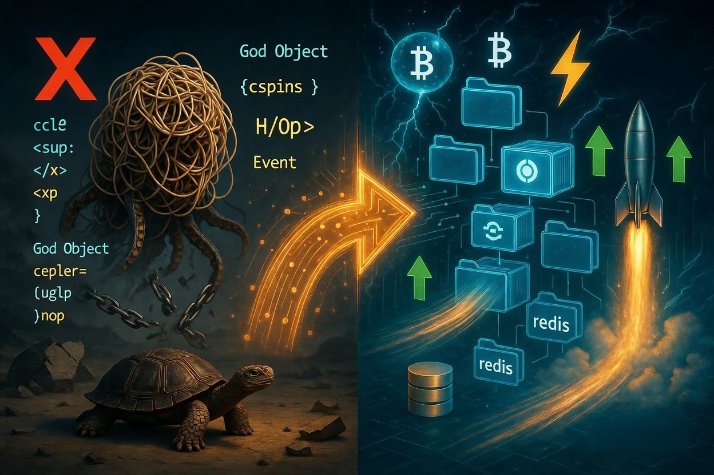

# ⚡ Monorepo architecture for parallel execution of trading strategies

> The source code discussed in the article is published in [this GitHub repository](https://github.com/backtest-kit/backtest-monorepo-parallel)



The imperative approach does not work in the AI world. If you build a codebase on a God Object, out of three employees only one will be able to write code, the rest will be blocked by merge conflicts. If you split the repositories, no knowledge base will accumulate: the only information about how a trading strategy works lives in the code itself. The synergistic effect is lost: the Coding Agent will not be able to read code from prior iterations of development. Each next strategy is a random shot, not a continuation of the thought from the previous one

## The problem

Open-source software for programming automated trading strategies is all in Python. In Python it is uncomfortable to write declarative code - all examples are imperative classes bloated to thousands of lines, the God Object antipattern

```python
class AwesomeStrategy(IStrategy):
    position_adjustment_enable = True   # global switch, without it DCA does not work

    # 1. Ladder parameters - class attributes
    max_entry_position_adjustment = 9   # max 9 averaging steps + 1 initial entry = 10 steps
    max_dca_multiplier = 5.5            # reserve 5.5x of the stake for future averaging
    stoploss = -0.30                    # a high hard stop is needed, otherwise DCA blows up

    # 2. Initial entry - trim the stake so there is enough left for the ladder
    def custom_stake_amount(self, pair: str, current_time: datetime, current_rate: float,
                            proposed_stake: float, min_stake: float, max_stake: float,
                            entry_tag: Optional[str], side: str, **kwargs) -> float:
        # Reserve the larger part for possible DCA averaging
        return proposed_stake / self.max_dca_multiplier

    # 3. The ladder itself - a separate callback that Freqtrade calls on every tick
    def adjust_trade_position(self, trade: Trade, current_time: datetime,
                              current_rate: float, current_profit: float,
                              min_stake: float, max_stake: float,
                              current_entry_rate: float, current_exit_rate: float,
                              current_entry_profit: float, current_exit_profit: float,
                              **kwargs) -> Optional[float]:
        # Current drawdown is not deep enough - do not average
        if current_profit > -0.05 and trade.nr_of_successful_entries == 1:
            return None
        if current_profit > -0.10 and trade.nr_of_successful_entries == 2:
            return None
        # ... repeat this ladder of conditions for each subsequent step

        # Pull the list of already filled entries from the trade state
        filled_entries = trade.select_filled_orders(trade.entry_side)
        count_of_entries = trade.nr_of_successful_entries
        try:
            # Stake of the first purchase x (count_of_entries - for ladder geometry)
            stake_amount = filled_entries[0].stake_amount
            stake_amount = stake_amount * (1 + (count_of_entries * 0.25))
            return stake_amount
        except Exception:
            return None

    # 4. populate_indicators / populate_entry_trend / populate_exit_trend are still needed,
    #    because without an entry signal the initial entry will never happen.
    def populate_indicators(self, dataframe, metadata): ...
    def populate_entry_trend(self, dataframe, metadata): ...
    def populate_exit_trend(self, dataframe, metadata): ...
```

This boilerplate only serves laddered averaging: price fell - we bought more. To figure out when to start buying in the first place, in order not to go bankrupt, you will have to add database integration methods into the same class. A direct violation of SOLID

```python
class TelegramSignalStrategy(IStrategy):
    custom_signals = {}  # nested dict: pair -> list of signals

    def bot_start(self) -> None:
        # starts a cron task in a separate thread that goes to Telegram
        # and writes the results into self.custom_signals
        threading.Thread(target=self._poll_telegram_loop, daemon=True).start()

    def _poll_telegram_loop(self):
        while True:
            try:
                messages = telegram_client.iter_messages("crypto_yoda_channel")
                for msg in messages:
                    parsed = self._parse_signal(msg.text)  # regex inline
                    if parsed:
                        self.custom_signals.setdefault(parsed['pair'], []).append(parsed)
            except Exception:
                pass
            time.sleep(60)

    def _parse_signal(self, text: str) -> Optional[dict]:
        m = re.search(r"#([A-Z0-9]+)/USDT.*?(LONG|SHORT).*?zone\s+\$?([\d.,]+)\s*[-–-]\s*\$?([\d.,]+)", text)
        if not m:
            return None
        return {
            "pair": m.group(1) + "/USDT",
            "direction": "long" if m.group(2) == "LONG" else "short",
            "entry_from": float(m.group(3).replace(",", ".")),
            "entry_to":   float(m.group(4).replace(",", ".")),
        }

    def populate_entry_trend(self, dataframe: DataFrame, metadata: dict) -> DataFrame:
        signals = self.custom_signals.get(metadata['pair'], [])
        # ... somehow apply signals to the dataframe here
```

The entry point deserves separate attention: in freqtrade it is a json file. API keys and magic constants like `dry_run` are stuffed in together. It is unclear whether to commit these changes or not: if you do commit them, you will always have a merge conflict when working in a team

```json
{
  "dry_run": true,
  "timeframe": "3m",
  "stake_currency": "USDT",
  "stake_amount": 200,
  "max_open_trades": 5,
  "exchange": {
    "name": "binance",
    "key": "af8ddd35195e9dc500b9a6f799f6f5c93d89193b",
    "secret": "08a9dc6db3d7b53e1acebd9275677f4b0a04f1a5",
    "pair_whitelist": ["BTC/USDT", "ETH/USDT"]
  },
  "timerange": "20260401-20260427",
  "datadir": "user_data/data/binance"
}
```

With this kind of architecture, look-ahead bias cannot be avoided: to build a frontend integration you need to write data into an intermediate database and delete it through crontab. This imperative code is mathematically unprovable, because it does not even come close to looking like a pure function

## Solving the problem

Before hiring employees, design a pipeline that will convert the cumulative effect of time spent into the next turn of the dialectical spiral. For that you need to build the following folder structure for the code

```bash
monorepo/
├── content/
│   ├── apr_2026.strategy/ 
|       ├──modules
│       │   ├──backtest.module.ts  # testnet paper
│       ├── apr_2026.strategy.ts   # strategy production code
│       ├── apr_2026.test.ts       # developer playground
├── modules/
│       ├── backtest.module.ts     # mainnet paper
│       ├── live.module.ts         # mainnet live
├── packages/
│   ├── core/                      # database layer
│   ├── main/                      # cli arguments parser
```

### N entry points instead of one: gated by a CLI flag

The root import in `packages/main/src/index.ts` pulls in four files

```typescript
import "./main/session";
import "./main/backtest";
import "./main/live";
import "./main/paper";
```

Each of which is a standalone entry point

```typescript
const main = async () => {
  const { values } = getArgs();

  if (!values.entry) return;
  if (!values.backtest) return;

  await waitForReady(true);

  const [strategySchema] = await listStrategySchema();
  const [exchangeSchema] = await listExchangeSchema();
  const [frameSchema]    = await listFrameSchema();

  if (values.cache) {
    await CACHE_CANDLES_FN();
  }

  for (const symbol of CC_SYMBOL_LIST) {
    Backtest.background(symbol, {
      exchangeName: exchangeSchema.exchangeName,
      strategyName: strategySchema.strategyName,
      frameName:    frameSchema.frameName,
    });
  }
};

main();
```

### Shared event-driven strategy code

The entry, averaging, stop loss and early exit have to be written in a functionally pure way, in a declarative style, so that they can be split across different files and reused

```typescript
import {
  addStrategySchema, listenActivePing, listenError,
  Log, Position,
  commitClosePending, commitAverageBuy,
  getPositionPnlPercent, getPositionEntryOverlap, getPositionEntries,
} from "backtest-kit";

const HARD_STOP        = 10.0;
const TARGET_PROFIT    = 3;
const LADDER_STEP_COST = 100;
const LADDER_UPPER_STEP = 5;
const LADDER_LOWER_STEP = 1;
const LADDER_MAX_STEPS  = 10;

addStrategySchema({
  strategyName: "apr_2026_strategy",
  getSignal: async (symbol, when, currentPrice) => ({
    ...Position.moonbag({ 
        position: "long", 
        currentPrice, 
        percentStopLoss: HARD_STOP
    }),
    minuteEstimatedTime: Infinity,
    cost: LADDER_STEP_COST,
  }),
});

listenActivePing(async ({ symbol, currentPrice }) => {
  const { length: steps } = await getPositionEntries(symbol);
  if (steps >= LADDER_MAX_STEPS) return;

  const hasOverlap = await getPositionEntryOverlap(symbol, currentPrice, {
    upperPercent: LADDER_UPPER_STEP,
    lowerPercent: LADDER_LOWER_STEP,
  });
  if (hasOverlap) return;

  await commitAverageBuy(symbol, LADDER_STEP_COST);
});

listenActivePing(async ({ symbol }) => {
  const currentProfit = await getPositionPnlPercent(symbol);
  if (currentProfit < TARGET_PROFIT) {
    return;
  }
  await commitClosePending(symbol, { id: "unknown", note: "# closed by target pnl" });
});
```

This way you can incrementally bolt a trailing take onto any strategy without changing the code. Any code change is a side effect, because it grows the table of possible inputs and outputs of the function, even if the nature of the mutation comes from a shit-coding neural net and not from runtime circumstances.

```typescript
if (GLOBAL_CONFIG.ATTACH_TRAILING_TAKE) {
    listenActivePing(async ({ symbol, data }) => {
        const peakProfitDistance = await getPositionHighestProfitDistancePnlPercentage(symbol);
        const currentProfit = await getPositionPnlPercent(symbol);
        if (currentProfit < 0) {
            return;
        }
        if (peakProfitDistance < TRAILING_TAKE) {
            return;
        }
        Log.info("position closed due to the trailing take", {
            symbol,
            data,
        });
        await commitClosePending(symbol, {
            id: "unknown",
            note: str.newline(
                "# closed by trailing take",
            ),
        });
    });
}
```

In Freqtrade, deleting `custom_stoploss` means "you have to remember what was important in there". We do not lose information, we only accumulate it

### Modular plug-and-play configuration per mode

Next to the strategy lies `modules/backtest.module.ts`. This is a neighbour file that the CLI loads together with the strategy and that describes "everything that is not the strategy itself" - the exchange, the historical frame, the global parameters

```typescript
addExchangeSchema({
  exchangeName: "ccxt-exchange",
  getCandles: async (symbol, interval, since, limit) => {
    const exchange = await getExchange();
    const candles  = await exchange.fetchOHLCV(symbol, interval, since.getTime(), limit);
    return candles.map(([timestamp, open, high, low, close, volume]) => ({
      timestamp, open, high, low, close, volume,
    }));
  },
  getOrderBook: async (symbol, depth, _from, _to, backtest) => {
    if (backtest) throw new Error("Order book not supported in backtest");
    const exchange = await getExchange();
    const bookData = await exchange.fetchOrderBook(symbol, depth);
    return {
      symbol,
      asks: bookData.asks.map(([price, quantity]) => ({ price: String(price), quantity: String(quantity) })),
      bids: bookData.bids.map(([price, quantity]) => ({ price: String(price), quantity: String(quantity) })),
    };
  },
  // ...formatPrice, formatQuantity, getAggregatedTrades
});

addFrameSchema({
  frameName:  "apr_2026_frame",
  interval:   "1m",
  startDate:  new Date("2026-04-01T00:00:00Z"),
  endDate:    new Date("2026-04-27T00:00:00Z"),
});
```

A new strategy is a folder under the content directory. This way several strategies can be running in different terminal tabs without changing the root json

```bash
content/apr_2026.strategy/
├── apr_2026.strategy.ts        # strategy entry file
├── apr_2026.test.ts            # developer playground
└── modules/
    └── backtest.module.ts      # exchange + timeframe
```

It is notable that the timeframe the strategy was run against is not lost and gets committed as code. You can figure out why something stopped working, relative to a known point in time when it definitely did work

### MVC for the data layer

The trigger of any significant market move is the news background. As of 2026 indicators do not work, because a price increase is not news. If the news parser code is kept in the same class as the strategy, the system cannot be debugged. The parser code has to be kept separately so that it can be developed via TDD

```typescript
export class ScraperService {
  private readonly loggerService = inject<LoggerService>(TYPES.loggerService);

  public scrapeDay = async (channel: string, date: Date): Promise<ScraperMessage[]> => {
    const client   = await getTelegram();
    const dayStart = new Date(date); dayStart.setUTCHours(0, 0, 0, 0);
    const dayEnd   = new Date(date); dayEnd.setUTCHours(23, 59, 59, 999);

    const rows: ScraperMessage[] = [];
    for await (const message of client.iterMessages(channel, {
      offsetDate: Math.floor(dayEnd.getTime() / 1000) + 1,
      reverse: false,
    })) {
      if (!message.message) continue;
      const ts = message.date * 1000;
      if (ts < dayStart.getTime()) break;
      rows.push({ id: message.id, content: message.message, channel, date: new Date(ts) });
    }
    return rows;
  }
}
```

The same applies to the database integration. It is not enough to just write an SQL query - before executing it in backtest you need to check that there was no time-travel into the future, in order to avoid look-ahead bias. To implement this you need a class with methods

```typescript
class CandleDbService extends BaseCRUD(CandleModel) {
  readonly loggerService = inject<LoggerService>(TYPES.loggerService);

  public create = async (dto: ICandleDto): Promise<ICandleRow> => {
    this.loggerService.log("candleDbService create", { dto });
    const filter = {
      symbol: dto.symbol,
      interval: dto.interval,
      timestamp: dto.timestamp,
    };
    const insertOnly = {
      exchangeName: EXCHANGE_NAME,
      open: dto.open,
      high: dto.high,
      low: dto.low,
      close: dto.close,
      volume: dto.volume,
    };
    const document = await CandleModel.findOneAndUpdate(
      filter,
      { $setOnInsert: insertOnly },
      { upsert: true, new: true, setDefaultsOnInsert: true },
    );
    const result = readTransform(document.toJSON()) as unknown as ICandleRow;
    return result;
  };

  public hasCandle = async (symbol: string, interval: CandleInterval, timestamp: number): Promise<boolean> => {
    this.loggerService.log("candleDbService hasCandle", { 
      symbol,
      interval,
      timestamp,
    });
    const candle = await this.findBySymbolIntervalTimestamp(symbol, interval, timestamp);
    return !!candle;
  };

  public findBySymbolIntervalTimestamp = 
    async (symbol: string, interval: CandleInterval, timestamp: number): Promise<ICandleRow | null> => {
      this.loggerService.log("candleDbService findBySymbolIntervalTimestamp", { symbol, interval, timestamp });
      return await await super.findByFilter({ symbol, interval, exchangeName: EXCHANGE_NAME, timestamp });
    };

}
```

## Performance

After rolling out the software, it turned out that the modular approach not only creates jobs and speeds up development, but also delivers significantly higher performance.

```typescript
class CandleCacheService extends BaseMap(REDIS_KEY, -1) {
  readonly loggerService = inject<LoggerService>(TYPES.loggerService);

  private _cacheKey(symbol: string, interval: CandleInterval, exchangeName: string, timestamp: number): string {
    return `${exchangeName}:${symbol}:${interval}:${timestamp}`;
  }

  public async hasCandleId(symbol: string, interval: CandleInterval, exchangeName: string, timestamp: number) {
    this.loggerService.log("candleCacheService getCandleId", { 
        symbol, 
        interval, 
        exchangeName, 
        timestamp,
    });
    const key = this._cacheKey(symbol, interval, exchangeName, timestamp);
    return await this.has(key);
  }

  public async getCandleId(symbol: string, interval: CandleInterval, exchangeName: string, timestamp: number): Promise<string | null> {
    this.loggerService.log("candleCacheService getCandleId", { 
        symbol, 
        interval, 
        exchangeName, 
        timestamp,
    });
    const key = this._cacheKey(symbol, interval, exchangeName, timestamp);
    const id = <string>await super.get(key);
    return id ?? null;
  }

  public async setCandleId(row: ICandleRow): Promise<string> {
    this.loggerService.log(`candleCacheService setCandleId`, { 
        symbol: row.symbol, 
        interval: row.interval, 
        timestamp: row.timestamp
    });
    const key = this._cacheKey(row.symbol, row.interval, row.exchangeName, row.timestamp);
    await super.set(key, row.id);
    return row.id;
  }
}
```

All of the most commonly used databases - `Postgres`, `MongoDB`, `MariaDB`, `MySQL` - use a `B-Tree` for row lookup, which is `O(log n)` complexity, where `n` is the number of rows in the table. A Redis cache lets you reduce the complexity to `O(1)` by looking up the row id by a composite key, however with the imperative syntax of freqtrade there is simply nowhere to apply it. If you store in redis not just a key-id dictionary but the data itself, performance will be lost on json serialization/deserialization. Below is the table with the measured performance metrics

| Metric | Value |
|---|---|
| Wall-clock span (first → last event) | `1779292952202 − 1779292949309` = **2 893 ms** (~2.9 s) |
| Total events captured | **297** |
| Symbols running in parallel | **9** (BTC, POL, ZEC, HYPE, XAUT, DOGE, SOL, PENGU, HBAR) |
| Historical time advanced per symbol | `1775003640000 − 1775001600000` = **2 040 000 ms** = **34 minutes** |
| **Per-symbol replay speed** | 34 min historical ÷ 2.9 s wall = **≈ 703×** real-time |
| **Aggregate replay speed (9 symbols)** | 9 × 703 = **≈ 6 326×** real-time |
| Event throughput | 297 ev / 2.893 s = **≈ 103 events/sec** (one Node process) |
| Frame coverage | `2026-04-01 → 2026-04-27` = 27 days × 1m candles = **38 880 candles/symbol × 9** = **~350 000 candle ticks** |

**Speed: ~700x acceleration of historical time relative to real time**, with 9 parallel contexts - an effective **~6300x** relative to a check that waits for candles in real time

## Thank you for your attention
