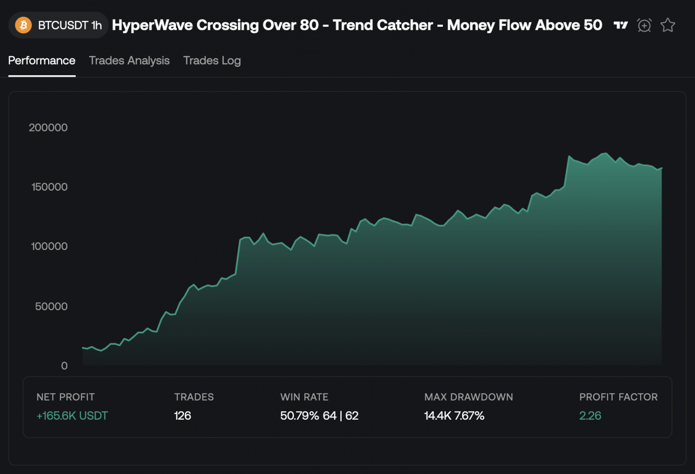

# 💸 Escaping zero expectation: from a fixed-sum game to a growing-sum game

> The source code discussed in the article is published [in this repository](https://github.com/backtest-kit/backtest-ollama-crontab).


Any trading strategy, on an infinite time horizon, tends toward zero expected value per trade: you earned nothing, you paid the exchange a commission. One might assume this is due to information leakage, that the strategy is being used by other market participants and they take the liquidity. But the reason is different: it is the fundamental law of large numbers. Market volume is forecastable, which means it is a finite sum. In a game with a finite sum the capital on the market is constant and only migrates between participants: your earnings are someone's losses.



Look at the chart: portfolio return growth first increases, then runs into a plateau without any pronounced upward or downward movement. The nearest analogy: an object thrown upward, when acceleration and gravity balance out, stops at a point and then falls back down.

## A game with a finite sum

Any effective quant strategy is an exploit of a market inefficiency. As soon as everyone uses the exploit — the inefficiency disappears, because what created it in the first place was precisely the fact that **nobody was arbitraging it**. The market comes into equilibrium. And equilibrium for a participant means a simple thing: the mathematical expectation of a trade becomes **zero minus exchange commission**. Not "a small profit", but a strictly negative number.

## Escape into a game with a growing sum

There is only one way out of this trap: look at what brings money into the system from the outside, rather than redistributing what is already there. One might think this is the accounting reports of companies or funds, but no: the publication of accounting data does not guarantee deterministic behavior of market participants. Mathematically, the guarantee of a growing-sum game is a direct recommendation to the public, if its size tends to infinity.

## Piggybacking to paradise

Earlier I covered [the stop hunting pattern for liquidity harvesting](../article/08_ai_liquidity_harvesting.md): market participants get a post with panic sentiment published to them to trigger mass selling, and as a consequence the asset can be bought up all at once for cheaper. But you can also make money on euphoria.

| Metric | Value |
|---|---|
| Total trades | 22 |
| Wins / Losses | 15 / 7 |
| Winrate | **68%** |
| Mean trade PNL | **+2.374%** |
| Std dev per trade | 7.676% |
| Sharpe Ratio (per-trade) | **+0.302** |

A Telegram channel publishes signals, they are successful in 68% of cases. The average retail investor will not look any further. And this is a trap: risk management does not insure against the black swan scenario at all.

Risks:

1. **High volatility relative to average profit**

   The average trade is +2.37%, but the standard deviation is **±7.86%**. One or two strong losses easily eat up the profit of ten small wins, while the winrate still looks "pretty".

2. **Low Sharpe = weak risk compensation**

   Sharpe 0.3 indicates that the profit is not large enough compared to the risk being taken. Good trading aims for Sharpe > 1.0.

This is a different pattern of crowd liquidity usage: `pump and dump`. Let us verify the hypothesis by picking only those signals where the asset's price had already been rising over the previous N hours.

| Metric | Value |
|---|---|
| Total trades | 11 |
| Wins / Losses | 11 / 0 |
| Winrate | 100% |
| Mean trade PNL | +6.972% |
| Std dev per trade | 8.642% |
| Sharpe Ratio (per-trade) | +0.807 |

What improved:

1. **Sharpe Ratio grew 2.67x** (0.302 → 0.807)

   Profit now compensates the assumed risk much better.

2. **The average trade became almost 3x more profitable** (+2.37% → +6.97%)

   Portfolio drawdowns went away: fewer losing trades.

The price growth over the last N hours is an empirical criterion. I knew where to look in advance, but I did not perform an analysis of the matrix of recommendation posts. **If you take the top 100 channels, using publication time and recommendation direction you can identify a single author** behind several anonymous accounts. Further, with the link to a single author, you can find out how many more channels he is potentially capable of using to continue the pump.

## How to make money on this

Using a [self enforcement runtime](../article/05_ai_strategy_workflow.md), a parser and a [high-performance backtest](./01_monorepo_parallel_execution.md) one can update the empirical entry criteria automatically. The channel parser extracts the direction, entry zone, targets and stop from the text with simple regex rules:

```typescript
const SIGNAL_FORMAT: ParseFormat<SignalFields> = {
    symbol: {
        pattern: /#([A-Z0-9]+)\/USDT/,
        group: 1,
    },
    direction: {
        pattern: /(ШОРТ|ЛОНГ)/i,
        transform: (raw) => (raw.toUpperCase() === "ШОРТ" ? "short" : "long"),
    },
    entry: {
        pattern: /зоне\s+\$?([\d.,]+)\s*[-–—]\s*(?:\$?[\d.,]+\s*[-–—]\s*)?\$?([\d.,]+)(?=\s)/i,
        transform: (_, m) => ({ from: num(m[1]), to: num(m[2]) }),
    },
    targets: {
        pattern: /Закрыть(?:\s+ордер)?\s+по(?:\s+цене)?\s+\$?([\d.,]+)/gi,
        transform: (_, m) => num(m[1]),
        multi: true,
    },
    stoploss: {
        pattern: /СТОП-?ЛОСС:\s*\$?([\d.,]+)/i,
        transform: (_, m) => num(m[1]),
    },
};
```

A high-performance backtest computes metrics on pre-publication data:

```typescript
const PRE_CANDLES_LIMIT = 1440; // 24h of 1m candles for baseline

// the getCandles(.., 1440) window covers exactly the 24h BEFORE the signal publication
const preCandles = await getCandles(symbol, "1m", PRE_CANDLES_LIMIT);

// momentum24h — total price change over the 24h before publication.
// Positive = a pump is already in progress; negative = the market is falling.
const momentum24hPct =
  ((preCandles[preCandles.length - 1].close - preCandles[0].open) /
    preCandles[0].open) * 100;

Logger.log("pre-publication data", { momentum24hPct })
```

The AI agent programs the filters, changing them as code on each update:

```typescript
const SHORT_MIN_AVG_RANGE_PCT = 0.07;
const LONG_MIN_MOMENTUM_24H_PCT = -1;

// Filter 1: SHORT on a "sleeping" asset (avgRange < 0.07% over the day, like TRX) —
// thin liquidity, an ideal target for a stop-hunt. This is the case of liquidity
// harvesting: the signal must not be followed.
if (signal.direction === "short" && avgRangePct < SHORT_MIN_AVG_RANGE_PCT) {
  return null;
}

// Filter 2: LONG when the price has fallen more than 1% over the day — "catching knives".
// There is no capital inflow, there is a decline; subscribers are being led against the trend.
if (signal.direction === "long" && momentum24hPct < LONG_MIN_MOMENTUM_24H_PCT) {
  return null;
}
```

Filter 1 catches the scam mode of liquidity harvesting (zero inflow, stop manipulation) and says "do not enter". Filter 2 catches the absence of fundamental inflow (the market is falling, there is no pump) and also says "do not enter". What remains is exactly what the whole thing was started for: signals under which there is **real capital inflow**.

## Conclusion

A Telegram pump is not a market bug that will be arbitraged away and disappear. It is crowd behavior that reproduces every time the author has an audience. As long as there are subscribers — there is inflow. And that means there is a fundamental factor to which the arithmetic of equilibrium does not apply: it is a game with a growing sum.

---

*Thank you for your attention*
