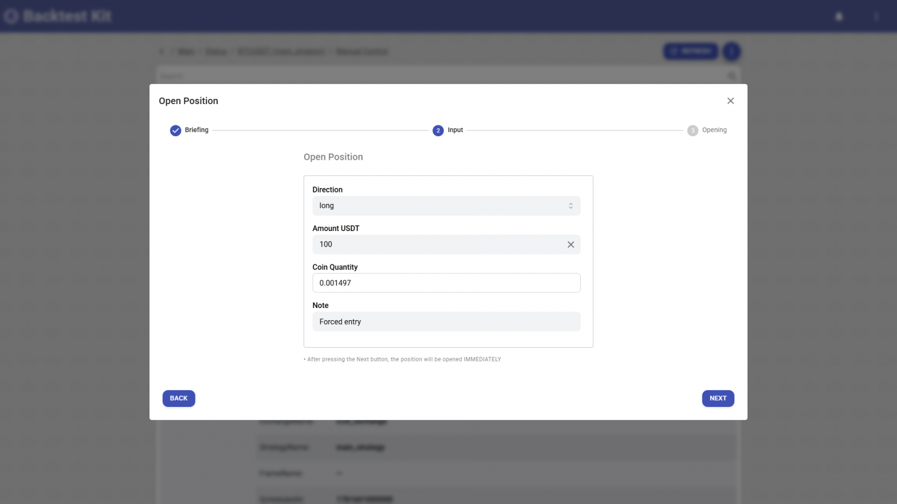
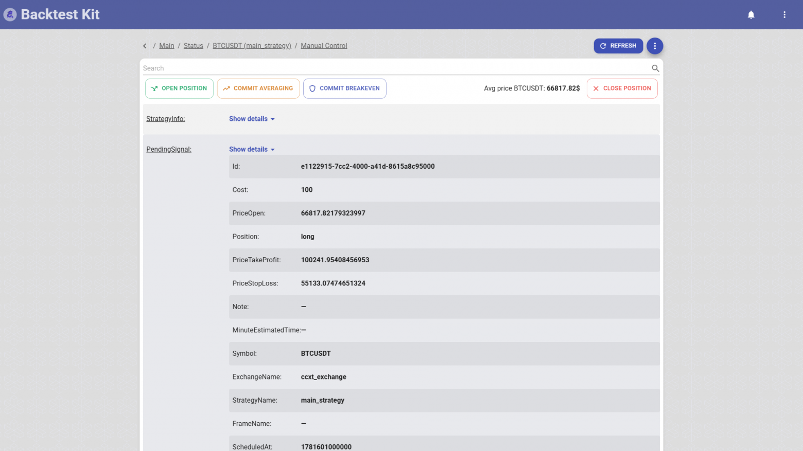
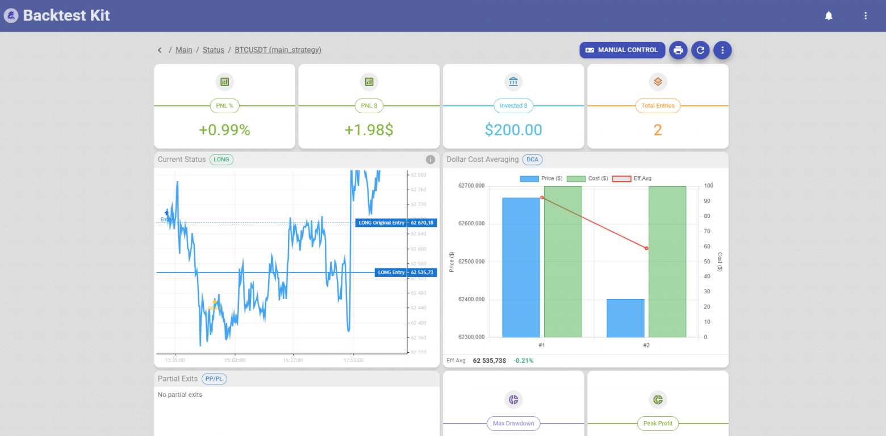
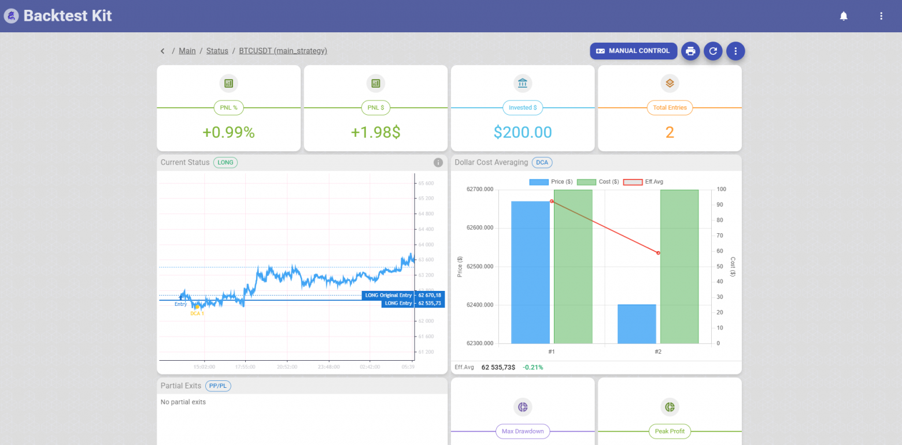

# 🕹️ How to Debug Your Bot's Exchange Connection in an Hour, Not Three Days

> The source code discussed in this article is published [in this repository](https://github.com/tripolskypetr/backtest-kit)


A surgeon isn't allowed into the operating room until they've practiced a suture a hundred times on a trainer. A pilot sits in a full-scale cockpit simulator — same switches, same inertia, same engine failure on takeoff — long before their first live flight. No one would think to teach a pilot to fly by sending them on an actual flight and waiting for something to break.

But in algotrading, that's exactly what we do.

## The Pain Nobody Writes About in Tutorials

The backtest is green. Paper trading is green. The strategy is mathematically sound, look-ahead bias is scrubbed out, the metrics are honest. You write an exchange adapter — the very layer that turns a signal `{ position: 'long', priceOpen: 66817 }` into a real order on the exchange. And you launch the bot in live.

And then begins what nobody writes about in competitors' READMEs.

To verify that the adapter even **works** — that the order goes through, leverage gets set, `positionSide` in hedge mode isn't mixed up, quantity rounding passes the exchange's filters, TP/SL land on the correct side — you need to wait for a **trading signal**.

And the signal may not come. A day. Two. Three days.

By its very nature, a strategy stays silent most of the time: it waits for conditions, waits for a breakout, waits for news. You sit and stare at a log where nothing is happening. The bot is alive, the bot is healthy, the bot is waiting. And then the moment comes. At 03:47 in the morning the conditions align, the bot forms a signal, pulls the adapter and... catches a bug.

```yaml
ExchangeAPIException: -4061 Order's position side does not match user's setting.
```

Congratulations. You spent three days of waiting to learn that in hedge mode you need to send `positionSide` as `LONG`, not `BOTH`. You fix one line. And you wait another three days until the next signal to check that **this time** the quantity rounding under `stepSize` won't fall apart.

The integration debugging cycle is **three days per iteration**. And the fix itself is a single line.

## Why You Can't Catch This by "Staring Hard"

The obvious counterargument: "read the adapter code by eye, find the bug before launch."

Doesn't work. Exchange integration isn't about logic, it's about **a hundred micro-mismatches with reality** that are impossible to see in code:

- `stepSize` and `tickSize` differ for every pair, and the exchange will reject an order with one extra decimal place;
- minimum notional (`minNotional`) — an order for $4 goes through, but $3.90 doesn't;
- in hedge mode you need `positionSide`, in one-way mode you can't send it at all;
- `reduceOnly` on close, otherwise you'll open a counter-position instead of exiting;
- `stop_loss_limit` on spot vs `STOP_MARKET` on futures — different order types, different fields;
- ghost position: the exchange shows a remainder of 0.0000001 coins, and `closePosition` goes into an infinite loop.

Each of these points is a separate trip to the exchange's documentation, which is **verified only by a live call**. You won't catch it by eye, because the bug isn't in your logic — the bug is in how your logic meets the specific settings of a specific account on a specific exchange.

The standard debugging path looks like this:

1. Write the adapter from the exchange docs
2. Launch live
3. Wait for a signal (hours — days)
4. Signal arrives -> catch -4061 / -1111 / -2010
5. Fix one line
6. GOTO 2

This isn't debugging. It's roulette with a spin interval of a day.

## A Control Button for the Human

[backtest-kit](https://www.npmjs.com/package/backtest-kit) has a web dashboard ([@backtest-kit/ui](https://www.npmjs.com/package/@backtest-kit/ui)), and in it — a **Manual Control** section. This isn't "view the position state." These are **physical buttons that pull the very same broker-adapter hooks as the real strategy**:



- `OPEN POSITION` — open a position by hand, right now;
- `COMMIT AVERAGING` — average in (the same `onAverageBuyCommit`);
- `COMMIT BREAKEVEN` — move the stop to breakeven;
- `CLOSE POSITION` — close.



You're not verifying a line of code — you're verifying **how the system works as a whole**: adapter -> engine -> persistence -> opening a position -> protective orders. It's the difference between "read the function's code" and "watched the function run inside a living organism."



## Not Just for Debugging

A button that pulls a real hook on a real account is a full-fledged trading instrument. And here's where it suddenly solves problems for which writing a dedicated strategy is impossible, since the conditions can't be reproduced in a backtest.



**1. A manual hedge against insider info the strategy doesn't see.**

Your strategy trades LONG on minute candles — it catches microstructure, local impulses, but by construction it's blind to the macro picture. And then you learn something before the market does: in an hour there's a rate decision / a delisting court ruling / a major exchange hack — something after which the market will collapse in panic. Rewriting the minute strategy for this is pointless: it's about something else. But you have an open LONG position, and it'll catch the whole crash.

You manually open a **global SHORT** on top — with the same `OPEN POSITION`, with `minuteEstimatedTime: Infinity`, like an umbrella over the entire portfolio. The minute strategy keeps doing its job as if nothing happened, while the manual short neutralizes the systemic risk exactly for the window until the news plays out. The dashboard meanwhile honestly shows both positions and the total PNL — you see net exposure rather than guessing. After the news, you close the short with a button and return to normal mode.

**2. A way out when the strategy has lost its edge, but the bot is obligated to act.**

The reality of a production deployment at a hedge fund or on a managed account: the bot has to **show activity for reporting**. And the strategy may go weeks without seeing an effective entry point — the market is ranging, conditions don't align, the edge has temporarily evaporated. Formally everything is correct: better not to trade than to trade garbage. But to an investor/compliance, "the bot did nothing for two weeks" looks like "the bot broke."

Manual control bridges this gap. You can manually open/close a controlled position for the reporting period, record a meaningful action in the JSONL logs (with a `note` explaining the reason), and not cripple the automated logic in the process. The strategy stays clean, and the reporting stays alive. This isn't a crutch in the code you'll have to clean up later — it's an operator's decision on top of an unchanged engine.

**3. Grab a local pump by hand, one the strategy isn't built for.**

A strategy is always a specialization. If it's tuned to catch reversions to the mean, by construction it **doesn't enter a vertical pump** — to it that's "too far from the entry point, the risk/reward doesn't add up." And it's right 95% of the time. But right now, specifically, you can see with your own eyes a coin flying on volume, and you understand the move is real.

Writing a dedicated pump detector for this (Hawkes, CUSUM, volume z-scores — I have a [separate library](https://www.npmjs.com/package/pump-anomaly) for that) is overkill for a one-off case. It's easier to hit `OPEN POSITION`, enter by hand, and then hand the position over to the engine: the same `commitBreakeven` will drag the stop to breakeven, `commitAveraging` will average in on a pullback, the trailing will take the profit. You gave the system an entry point the strategy missed — but all position management after entry remained automated and battle-tested.

In all three cases the same property is at work: **the manual action goes through the same engine as the automated one**. A position opened by hand isn't an "external trade outside the system" — it's a full-fledged signal in persistent storage, with the same lifecycle, the same rendering, the same protective orders, and the same DCA/breakeven/trailing hooks. The operator and the algorithm work in a single circuit, not in two parallel universes that won't reconcile in the report later.

## Bottom Line: What Replaces Three Days of Waiting

|  | **Standard path** | **backtest-kit** |
|---|---|---|
| *How to launch an adapter check* | Wait for a trading signal | Press a button |
| *Time to first error* | Hours — days | Seconds |
| *What gets verified* | A single call | The whole chain: adapter, engine, persistence, UI, protective orders |
| *Fidelity* | The real path, but you wait | The real path, right now |

## Thanks for reading!
