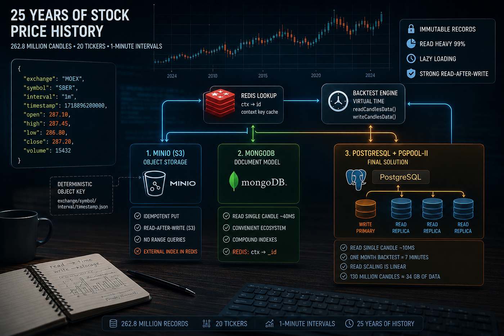
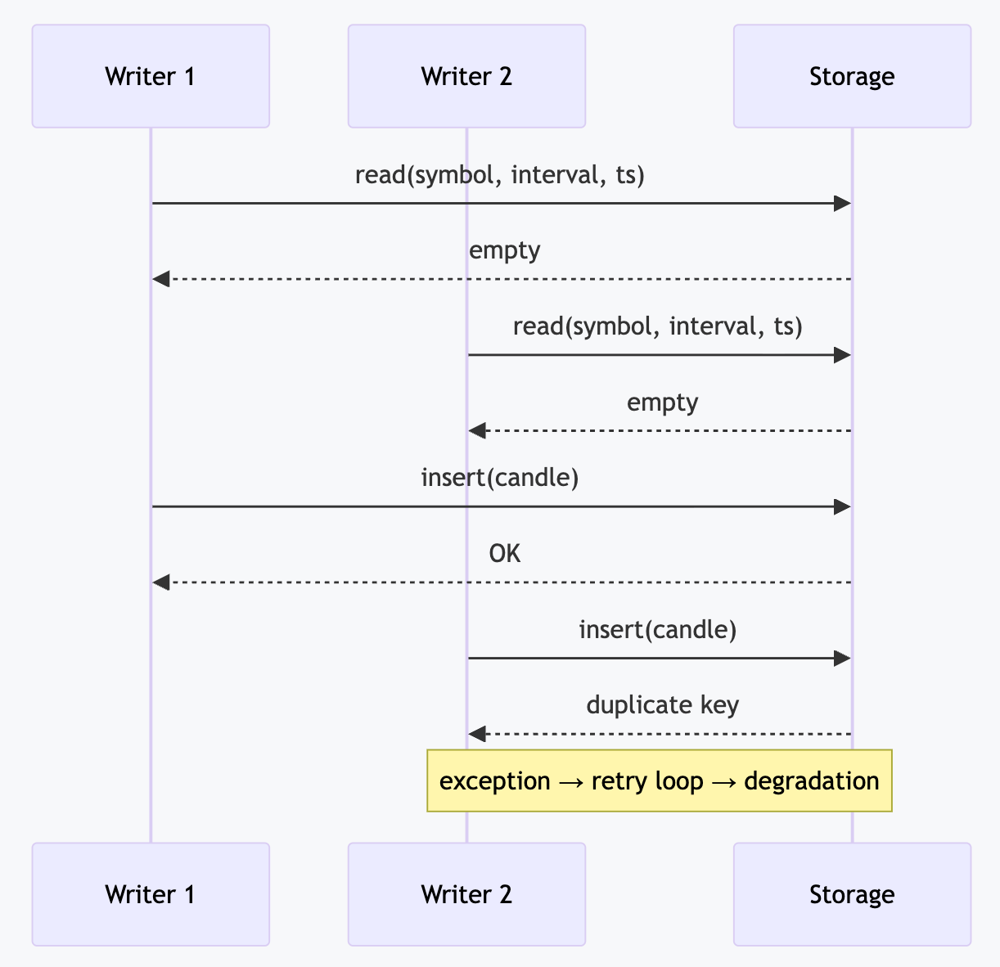
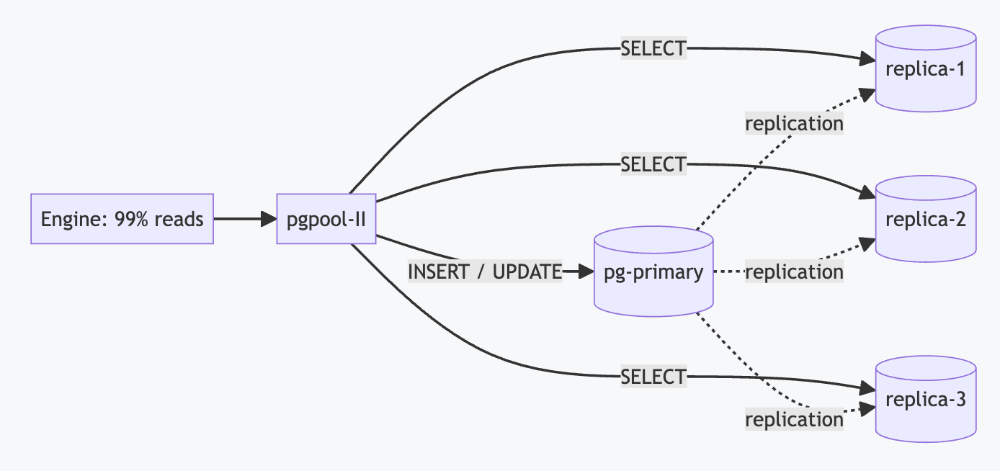

# 💾 MinIO, MongoDB, PostgreSQL for storing 25 years of stock price history

> The MinIO binding source code is [available at this link](https://github.com/backtest-kit/backtest-kit-minio-s3-docker)



A stock has no exact price, because for every buyer there must be a seller. Exchanges store stock prices as one-minute Japanese candles: the highest price of the minute, the lowest price of the minute, the opening price at the first moment the trading period opens, and the closing price at the last moment of the trading period. In total: 25 years of history × 20 tickers × 525,600 minutes per year ≈ **262.8 million records**

```json
[
  {
    "time": 1720958400,
    "open": 450.25,
    "high": 455.50,
    "low": 448.10,
    "close": 453.80,
    "volume": 12500.5
  },
  ...
]
```

To test an automated trading strategy, you need to create virtual time that iterates through this entire array of data one candle at a time. If you average it out and use hourly candles, you get close-to-close, an imprecise backtest. I tried several database options and want to tell you about it.

## Load profile

```typescript
class CandleAdapter implements IPersistCandleInstance {
  constructor(
    readonly symbol: string,
    readonly interval: CandleInterval,
    readonly exchangeName: string,
  ) {}
  async waitForInit(initial: boolean) { /* spin up infrastructure */ }
  async readCandlesData(limit: number, sinceTimestamp: number) { /* ... */ }
  async writeCandlesData(candles: CandleData[]) { /* ... */ }
}
```

- **Records are immutable.** A candle for a specific minute never changes. That means we only need an idempotent upsert that applies only the missing records.
- **Reads dominate.** Running a strategy is 99% reads: point lookups of a single candle by the key `(exchange, symbol, interval, timestamp)`, many of them, in parallel.
- **A strict visibility contract is required** (more on this below) — otherwise concurrent writes fall apart. We don't want to download all 525 million records at once; we need lazy loading.

## Write visibility contract

The engine has a hard durability requirement for writes: once *writeCandlesData* returns control, the very next *readCandlesData* **must** see what was written. The file adapter satisfies this trivially (*fs.writeFile* → *fs.readFile* will see each other). But a naive implementation on top of any database — "read, and if it's not there, insert" — **violates** the contract under concurrent writes.



Both writers see "no record," both insert, the second one catches a duplicate key, and the engine goes into a retry. Exactly **how** each database closes this race without breaking the contract is what determines its place in this review.

## Attempt 1. MinIO: object storage, moving away from files

> The attempt didn't pay off: MinIO creates a new separate file on disk with metadata for every candle object.

The baseline implementation was saving files to disk. It's slow. I hypothesized that the data model wouldn't have to change at all: a JSON document stays a JSON document, it just moves from local disk to S3-compatible object storage. One bucket, the object key being a pure function of context:

```
backtest-kit/candle-items/ccxt_binance/TRXUSDT/1m/1767251220000  →  { open, high, low, close, volume, ... }
```

A deterministic key solves the durability contract for free: an upsert is a single idempotent `PUT`, there are no races by construction, and S3 guarantees read-after-write for individual objects. Candles are immutable, so a write is `stat` + `PUT` without downloading the body:

```typescript
export class CandleDataService extends BaseMinioStorage("backtest-kit/candle-items") {

  readonly loggerService = inject<LoggerService>(TYPES.loggerService);

  public create = async (dto: ICandleDto): Promise<ICandleRow> => {
    this.loggerService.log("candleDataService create", { dto });
    const key = GET_STORAGE_KEY_FN(dto.symbol, dto.interval, dto.timestamp);
    const now = new Date();
    const row: ICandleRow = {
      id: key,
      exchangeName: EXCHANGE_NAME,
      symbol: dto.symbol,
      interval: dto.interval,
      timestamp: dto.timestamp,
      open: dto.open,
      high: dto.high,
      low: dto.low,
      close: dto.close,
      volume: dto.volume,
      createDate: now,
      updatedDate: now,
    };
```

S3 storage can't do *range queries by key* (there's no BETWEEN on timestamp). For that, an external index in Redis was used:

```typescript
export class LogConnectionService extends BaseRedisMap(REDIS_KEY, -1) {

  readonly loggerService = inject<LoggerService>(TYPES.loggerService);

  public register = async (objectName: string): Promise<void> => {
    this.loggerService.log("logConnectionService register", { objectName });
    const redis = await getRedis();
    // One Redis SET per minute: SADD deduplicates repeated names, the floor
    // marker (first-ever minute) bounds the backwards walk in listNewest
    const minute = alignToInterval(new Date(), "1m").getTime();
    await redis
      .pipeline()
      .sadd(GET_MINUTE_KEY_FN(this.connectionKey, minute), objectName)
      .setnx(GET_FLOOR_KEY_FN(this.connectionKey), String(minute))
      .exec();
  };
  public listNewest = async (limit: number, prefix = ""): Promise<string[]> => {
    this.loggerService.log("logConnectionService listNewest", { limit, prefix });
    const redis = await getRedis();
    const floorRaw = await redis.get(GET_FLOOR_KEY_FN(this.connectionKey));
    if (!floorRaw) {
      return [];
    }
  ...
```

## Attempt 2. MongoDB: document model without changing the schema

> It works, but reading a single candle takes 40ms. In total: 31 days × 1440 minutes per day × 40ms per virtual minute ≈ 30 minutes. The business process breaks because people go off for a smoke break and come back an hour later.

I know that MongoDB is vendor lock-in on their Atlas cloud database, since there are few specialists for scaling it in the CIS. But the vendor Mongo Inc has an ecosystem: whereas for Postgres you need to install the pgAdmin 4 Docker image, which is basically a website ~~(and some people are on Mac),~~ here you can just download the MongoDB Compass application.

```typescript
export class CandleDbService extends BaseMongoCRUD(CandleModel) {

  readonly loggerService = inject<LoggerService>(TYPES.loggerService);

  readonly candleCacheService = inject<CandleCacheService>(TYPES.candleCacheService);

  public upsert = async (dto: ICandleDto): Promise<ICandleRow> => {
    this.loggerService.log("candleDbService upsert", { dto });
    const filter = {
      exchangeName: dto.exchangeName,
      symbol: dto.symbol,
      interval: dto.interval,
      timestamp: dto.timestamp,
    };
    const insertOnly = {
      open: dto.open,
      high: dto.high,
      low: dto.low,
      close: dto.close,
      volume: dto.volume,
    };
    const document = await CandleModel.findOneAndUpdate(
      filter,
      { $setOnInsert: insertOnly },
      { upsert: true, new: true, setDefaultsOnInsert: true },
    );
    ...
```

To reduce the complexity from logarithmic to O(1), you can add a Redis Lookup; it costs 6GB of RAM and reduces CPU load because there's no memory traffic across the bus from pagination.

```typescript
export class CandleCacheService extends BaseRedisMap(REDIS_KEY, -1) {

  readonly loggerService = inject<LoggerService>(TYPES.loggerService);

  private _cacheKey(symbol: string, interval: CandleInterval, exchangeName: string, timestamp: number): string {
    return `${exchangeName}:${symbol}:${interval}:${timestamp}`;
  }

  public async getCandleId(symbol: string, interval: CandleInterval, exchangeName: string, timestamp: number): Promise<string | null> {
    this.loggerService.log("candleCacheService getCandleId", {
        symbol,
        interval,
        exchangeName,
        timestamp,
    });
    const key = this._cacheKey(symbol, interval, exchangeName, timestamp);
    const id = <string>await super.get(key);
    return id ?? null;
  }

  public async setCandleId(row: ICandleRow): Promise<string> {
    this.loggerService.log(`candleCacheService setCandleId`, {
        symbol: row.symbol,
        interval: row.interval,
        timestamp: row.timestamp
    });
    const key = this._cacheKey(row.symbol, row.interval, row.exchangeName, row.timestamp);
    await super.set(key, row.id);
    return row.id;
  }
}
```

## Attempt 3. PostgreSQL + Pgpool-II: the finale

> In the end, I managed to build a PostgreSQL + Pgpool-II setup with four read replicas and one write node. Read speed grew from 40ms to 10ms; a month of virtual-time backtest costs 7 minutes of real time. The business process doesn't break — you can wait without leaving your desk.

**What this article was written for — the cluster topology.** The load is 99% reads, so pgpool-II sits in front of the database: one write node and three read replicas. pgpool distributes the stream of point `SELECT`s across the replicas, while transparently routing all DML to the primary.



In terms of capacity, a single table with such indexes holds billions of rows: 130 million candles is ~260 bytes per candle with all indexes, about **34 GB** — not even a reason for partitioning. The maximum capacity of Postgres for a single table is **32 TB**.

```typescript
export class CandleDbService extends BasePostgresCRUD(CandleModel) {

  readonly loggerService = inject<LoggerService>(TYPES.loggerService);
  readonly candleCacheService = inject<CandleCacheService>(TYPES.candleCacheService);

  public create = async (dto: ICandleDto): Promise<ICandleRow> => {
    this.loggerService.log("candleDbService create", { dto });
    const repo = await super.repo<ICandleRow>();
    const { raw } = await repo
      .createQueryBuilder()
      .insert()
      .values({
        symbol: dto.symbol,
        interval: dto.interval,
        timestamp: dto.timestamp,
        exchangeName: dto.exchangeName,
        open: dto.open,
        high: dto.high,
        low: dto.low,
        close: dto.close,
        volume: dto.volume,
      })
      .orUpdate(["symbol"], ["exchangeName", "symbol", "interval", "timestamp"])
      .returning("*")
      .execute();
    const result = raw[0] as ICandleRow;
    await this.candleCacheService.setCandleId(result);
    return result;
  };
```

In all three variants, Redis sits in front of the storage. The popular explanation "O(1) instead of O(log n)" **doesn't hold** in practice: a b-tree traversal over a billion rows is 4–5 pages that have long been sitting in cache, i.e. microseconds. A network round-trip is an order of magnitude more expensive than the traversal itself. If it were about asymptotics, the cache could be thrown away.

## A few words about Redis Lookup

The real win from Redis is in **reducing memory traffic per lookup, i.e. offloading the database CPU**. The scheme is two-step: Redis returns the `id` by the context key, and the database fetches the row by PK — the cheapest possible traversal; on a miss we go into the index and populate the cache.

Why this offloads the CPU for each database:

- **PostgreSQL.** A point `SELECT` is a parser, planner, executor, buffer pins, a traversal of 4–5 pages of 8 KB each with random accesses within each: dozens of L1/L2 misses and noticeable memory bandwidth per query. A Redis `GET` by a short key is a hash bucket and a short string, one or two cache lines. On the same hardware Redis delivers 100–200k `GET`/s per core versus 20–50k point `SELECT`/s. The cache doesn't speed up an individual query — it **triples to sextuples throughput** and leaves the primary's and replicas' CPU for real work.
- **MongoDB.** The pattern is twice as valuable: a miss on a composite index drags along decompression of a WiredTiger block — pure CPU, multiplied by memory bandwidth. A Redis cache of `ctx → _id` turns the hot path into `GET` + `findById`, removing both the decompression and the index traversal.
- **MinIO.** Here a per-object cache isn't needed: the deterministic key is itself "O(1) addressing." Redis works differently — a minute-level index substitutes for the S3 `LIST` (which on the server reads meta-catalogs from disk), and the dedup set of written keys eliminates the avalanche of `stat` requests.
