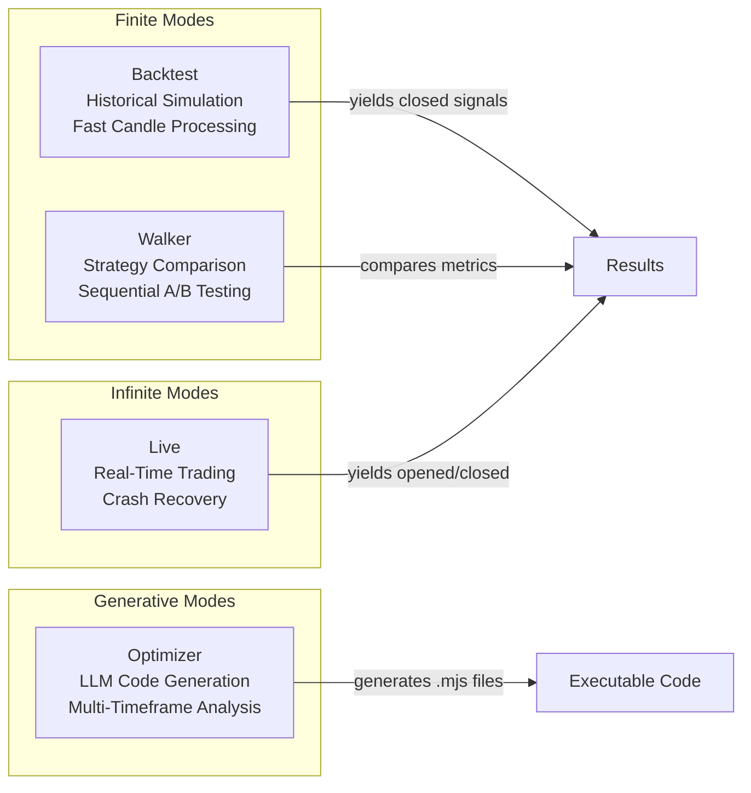
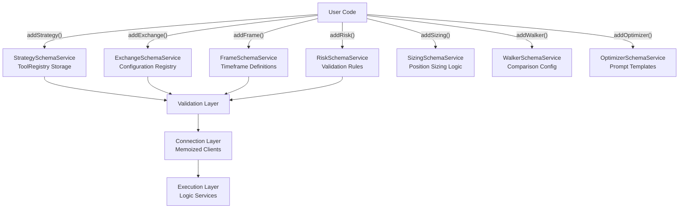
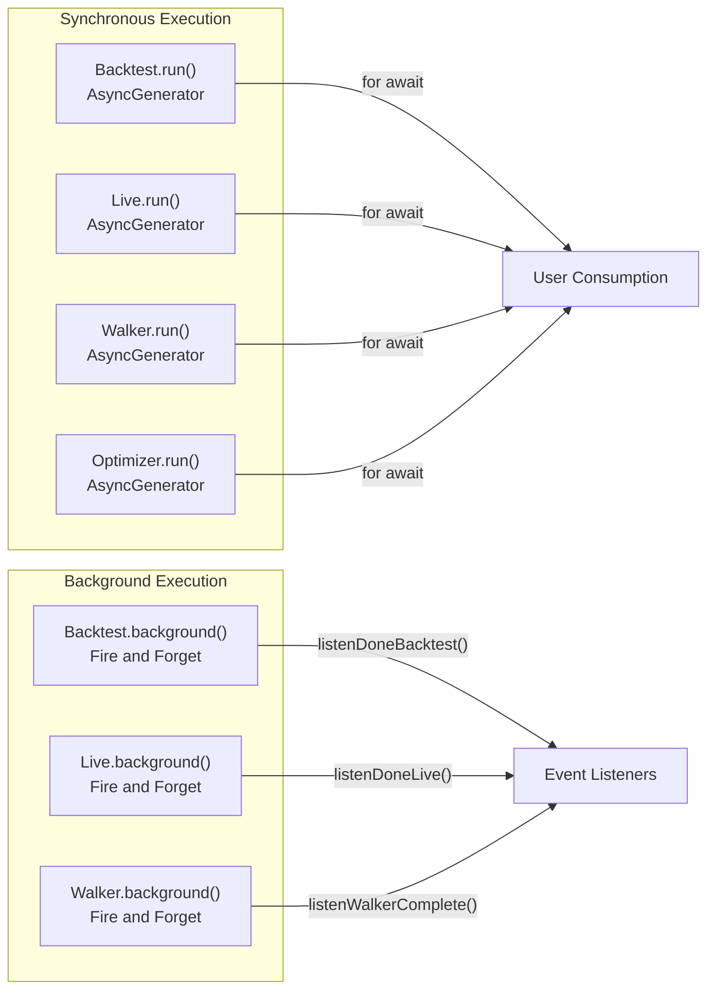
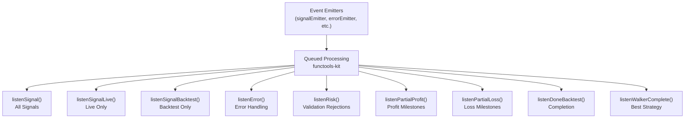
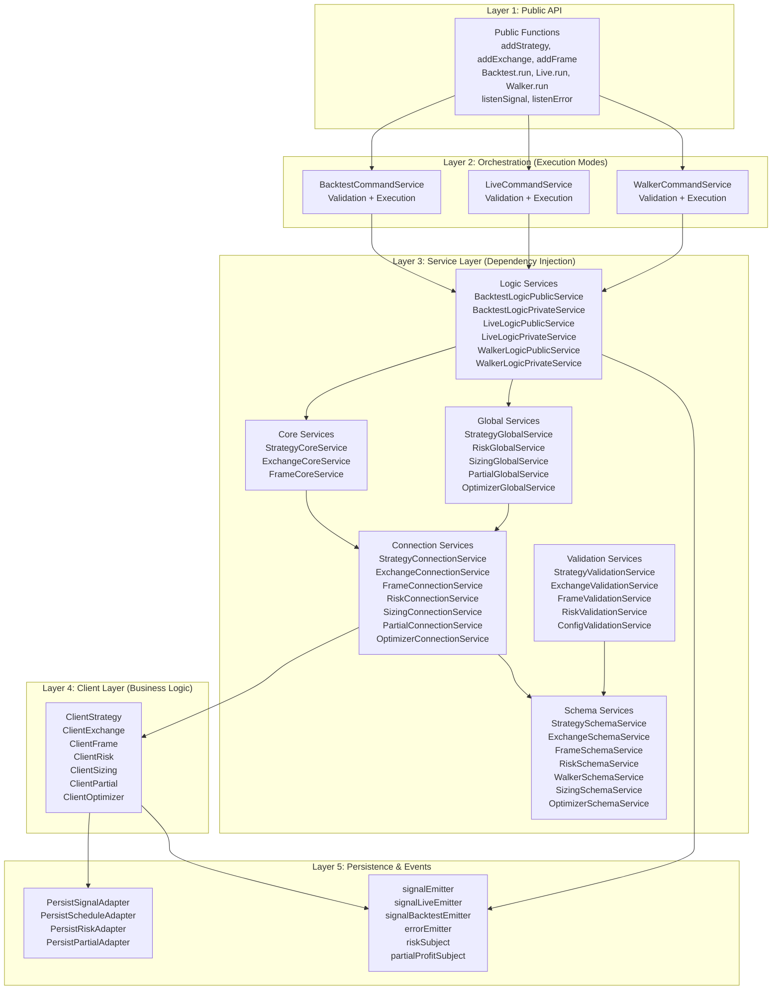
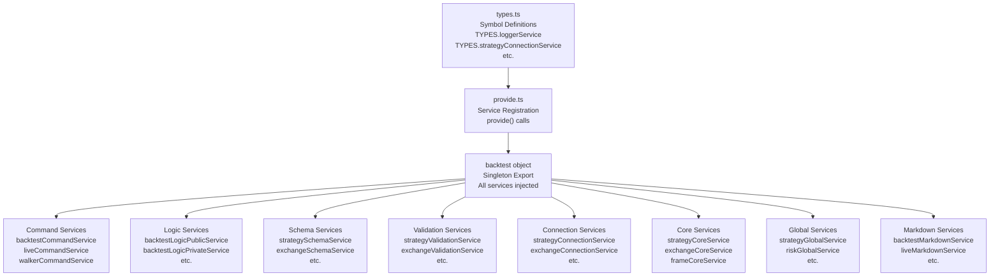
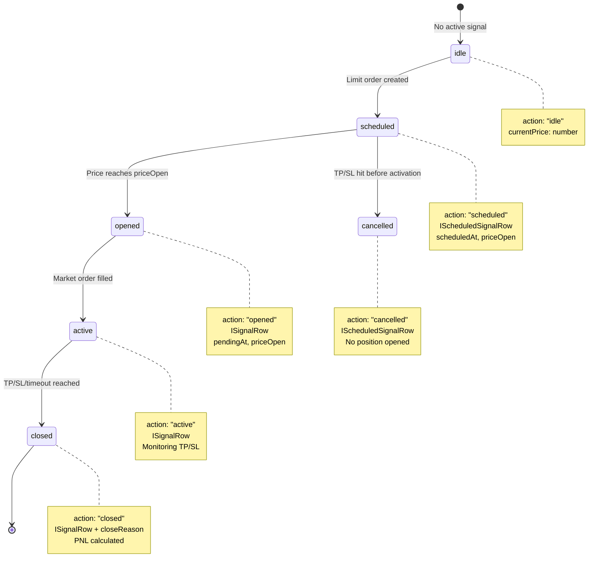
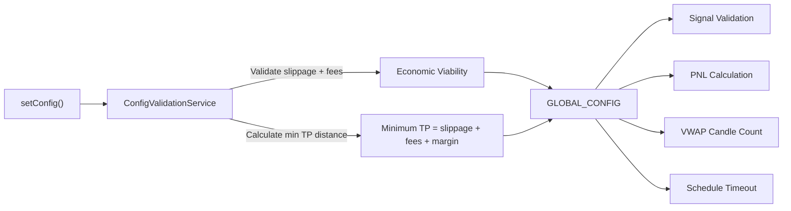

# Overview

# Overview

Relevant source files

The following files were used as context for generating this wiki page:

- [README.md](README.md)
- [assets/uml.svg](assets/uml.svg)
- [demo/backtest/package-lock.json](demo/backtest/package-lock.json)
- [demo/backtest/package.json](demo/backtest/package.json)
- [demo/live/package-lock.json](demo/live/package-lock.json)
- [demo/live/package.json](demo/live/package.json)
- [demo/optimization/package-lock.json](demo/optimization/package-lock.json)
- [demo/optimization/package.json](demo/optimization/package.json)
- [docs/classes/WalkerCommandService.md](docs/classes/WalkerCommandService.md)
- [docs/interfaces/BacktestStatistics.md](docs/interfaces/BacktestStatistics.md)
- [docs/interfaces/IStrategyCallbacks.md](docs/interfaces/IStrategyCallbacks.md)
- [docs/interfaces/LiveStatistics.md](docs/interfaces/LiveStatistics.md)
- [docs/internals.md](docs/internals.md)
- [docs/types/IStrategyTickResult.md](docs/types/IStrategyTickResult.md)
- [docs/uml.puml](docs/uml.puml)
- [package-lock.json](package-lock.json)
- [package.json](package.json)
- [scripts/uml.mjs](scripts/uml.mjs)
- [src/interfaces/Heatmap.interface.ts](src/interfaces/Heatmap.interface.ts)
- [test/e2e/defend.test.mjs](test/e2e/defend.test.mjs)
- [test/e2e/risk.test.mjs](test/e2e/risk.test.mjs)
- [test/index.mjs](test/index.mjs)
- [test/mock/getMockCandles.mjs](test/mock/getMockCandles.mjs)
- [test/spec/heat.test.mjs](test/spec/heat.test.mjs)
- [test/spec/list.test.mjs](test/spec/list.test.mjs)

## Purpose and Scope

This document provides a high-level introduction to the **backtest-kit** framework, a production-ready TypeScript system for backtesting and live trading cryptocurrency strategies. The framework is designed to enable seamless transition between historical simulation and real-time execution with identical code, while providing crash-safe persistence, comprehensive validation, and AI-powered strategy optimization.

This overview covers the framework's purpose, core capabilities, architectural layers, and execution modes. For detailed information on specific subsystems:
- Core concepts (signals, execution contexts, events) - see [Core Concepts](./02-core-concepts.md)
- Detailed architecture (DI, services, clients) - see [System Architecture](./06-system-architecture.md)
- Strategy development - see [Strategy System](./11-strategy-system.md)
- Execution mode implementations - see [Execution Modes (Detailed)](./16-execution-modes-detailed.md)
- Data integration - see [Data and Exchanges](./21-data-and-exchanges.md)
- Configuration - see [Configuration System](./25-configuration-system.md)
- Reporting - see [Reporting and Analytics](./29-reporting-and-analytics.md)

**Sources**: [README.md:1-26](), [docs/internals.md:1-13](), [package.json:1-26]()

---

## Core Features

The framework provides seven major feature categories:

| Feature Category | Description | Key Components |
|-----------------|-------------|----------------|
| **Production-Ready Execution** | Seamless switch between backtest/live modes with identical strategy code | `Backtest`, `Live` classes |
| **Crash-Safe Persistence** | Atomic JSON file writes with automatic state recovery | `PersistSignalAdapter`, `waitForInit()` |
| **Validation System** | Checks signals for TP/SL logic, risk/reward ratios, portfolio limits | `addRisk()`, validation services |
| **Memory-Efficient Streaming** | Async generator architecture for processing large datasets | `BacktestLogicPrivateService`, `LiveLogicPrivateService` |
| **AI Integration** | LLM-powered strategy generation via Ollama API | `Optimizer` class, `OptimizerTemplateService` |
| **Event-Driven Monitoring** | Pub/sub system for signals, errors, progress, completion | `listenSignal*()`, emitter subjects |
| **Risk Management** | Custom rules for position limits, time windows, multi-strategy coordination | `IRiskSchema`, `ClientRisk` |

**Sources**: [README.md:15-26](), [docs/internals.md:14-26]()

---

## Execution Modes

The framework implements four distinct execution modes, each optimized for specific use cases:

**Backtest Mode** (`Backtest.run()`, `Backtest.background()`):
- Iterates through pre-generated timeframes sequentially
- Fast candle processing with skip-to-close optimization
- Generator yields closed signals for memory efficiency
- Use case: Historical validation, strategy research

**Live Mode** (`Live.run()`, `Live.background()`):
- Infinite loop with `sleep(61 seconds)` between ticks
- Atomic persistence via `PersistSignalAdapter` after each operation
- `waitForInit()` recovers state from disk on restart
- Use case: Real-time trading with crash safety

**Walker Mode** (`Walker.run()`, `Walker.background()`):
- Sequential execution of multiple backtests
- Compares strategies by metrics (Sharpe ratio, max drawdown, etc.)
- Tracks best strategy and best metric value
- Use case: Strategy comparison, A/B testing

**Optimizer Mode** (`Optimizer.run()`, `Optimizer.dump()`):
- Fetches multi-timeframe historical data (1h, 30m, 15m, 1m)
- Formats data for LLM consumption (Ollama API)
- Generates complete executable `.mjs` files
- Use case: AI-driven strategy development

For detailed implementation details, see [Execution Modes (Detailed)](./16-execution-modes-detailed.md).

**Sources**: [README.md:33-167](), [docs/internals.md:54-82](), [src/classes/Backtest.ts](), [src/classes/Live.ts](), [src/classes/Walker.ts](), [src/classes/Optimizer.ts]()

---

## Key Components and Public API

### Component Registration API

The framework uses a registration pattern for defining strategies, exchanges, data sources, and risk profiles:

**Registration Functions** (exported from [src/lib/index.ts]()):
- `addStrategy(IStrategySchema)` - Define signal generation logic and lifecycle callbacks
- `addExchange(IExchangeSchema)` - Configure data source (CCXT integration, custom APIs)
- `addFrame(IFrameSchema)` - Specify date range and interval for backtests
- `addRisk(IRiskSchema)` - Set portfolio limits and validation rules
- `addSizing(ISizingSchema)` - Configure position sizing methods (fixed, Kelly, ATR)
- `addWalker(IWalkerSchema)` - Define strategy comparison configuration
- `addOptimizer(IOptimizerSchema)` - Configure LLM prompt templates and data sources

### Execution API

**Execution Methods**:
- `Backtest.run(symbol, context)` - Synchronous backtest with generator iteration
- `Backtest.background(symbol, context)` - Fire-and-forget backtest with event listeners
- `Live.run(symbol, context)` - Synchronous live execution
- `Live.background(symbol, context)` - Background live execution
- `Walker.run(symbol, context)` - Strategy comparison
- `Optimizer.run(symbol, optimizerName)` - LLM strategy generation

### Event Listener API

**Event Listeners** (all use queued async processing):
- `listenSignal(fn)` - All signal events (idle, opened, active, closed)
- `listenSignalBacktest(fn)` - Backtest signals only
- `listenSignalLive(fn)` - Live signals only
- `listenSignalOnce(filter, fn)` - Single-execution with predicate filter
- `listenError(fn)` - Background execution errors
- `listenRisk(fn)` - Risk validation rejections
- `listenPartialProfit(fn)` - Profit milestone tracking (10%, 20%, 30%, etc.)
- `listenDoneBacktest(fn)` - Backtest completion
- `listenWalkerComplete(fn)` - Walker final results

**Sources**: [src/lib/index.ts](), [docs/internals.md:84-89](), [README.md:140-167]()

---

## Architectural Layers

The framework implements a five-layer architecture with clear separation of concerns:

### Layer Responsibilities

**Layer 1 - Public API**:
- User-facing functions exported from [src/lib/index.ts]()
- Configuration registration (`addStrategy`, `addExchange`, etc.)
- Execution triggers (`Backtest.run`, `Live.background`, etc.)
- Event subscription (`listenSignal`, `listenError`, etc.)

**Layer 2 - Orchestration**:
- Command services: `BacktestCommandService`, `LiveCommandService`, `WalkerCommandService`
- Validation coordination (ensures all required components are registered)
- Delegates to Logic services for actual execution

**Layer 3 - Service Layer**:
- **Logic Services**: Public/private split for execution flow
  - Public: Context setup and validation wrapper
  - Private: Generator implementation with business logic
- **Core Services**: Domain operations (strategy tick, exchange candles, frame timeframes)
- **Connection Services**: Memoized client factory pattern (cache by `symbol:strategyName`)
- **Schema Services**: ToolRegistry pattern for immutable configuration storage
- **Validation Services**: Runtime existence checks with memoization
- **Global Services**: Portfolio-level state management (risk tracking, partial tracking)

**Layer 4 - Client Layer**:
- Pure business logic implementations without DI
- Prototype methods (not arrow functions) for memory efficiency
- Classes: `ClientStrategy`, `ClientExchange`, `ClientFrame`, `ClientRisk`, `ClientSizing`, `ClientPartial`, `ClientOptimizer`

**Layer 5 - Persistence & Events**:
- Atomic JSON file writes via `PersistSignalAdapter` and related adapters
- Pub/sub event system using `functools-kit` Subject
- Queued async processing to prevent race conditions

For detailed architecture documentation, see [System Architecture](./06-system-architecture.md).

**Sources**: [docs/internals.md:28-52](), [src/lib/index.ts](), [src/lib/services/](), [src/lib/clients/]()

---

## Dependency Injection System

The framework uses a custom DI container with Symbol-based keys and a centralized `backtest` aggregation object:

**Key DI Components**:
- `types.ts` - Symbol-based service identifiers (e.g., `TYPES.strategyCoreService = Symbol.for("strategyCoreService")`)
- `provide.ts` - Service registration with factory functions
- `backtest` object - Central service locator providing access to all services
- Scoped contexts - `ExecutionContextService` and `MethodContextService` for nested context propagation

For detailed DI documentation, see [Dependency Injection System](./08-dependency-injection-system.md).

**Sources**: [src/lib/index.ts](), [src/lib/types.ts](), [src/lib/provide.ts](), [docs/internals.md:46-52]()

---

## Signal Lifecycle

The framework uses a type-safe discriminated union for signal states:

**Signal States**:
- `idle` - No active signal, waiting for next signal generation
- `scheduled` - Limit order created, waiting for price to reach `priceOpen`
- `cancelled` - Scheduled signal cancelled (TP/SL hit before activation)
- `opened` - Market order filled OR limit order activated, position now open
- `active` - Position being monitored for TP/SL/timeout
- `closed` - Position closed with `closeReason` (`take_profit`, `stop_loss`, `time_expired`)

Each state is a discriminated union type with an `action` discriminator property, enabling TypeScript type narrowing. For detailed signal lifecycle documentation, see [Signal Lifecycle and State Machine](./03-signal-lifecycle-and-state-machine.md).

**Sources**: [docs/internals.md:14-19](), [types.d.ts](), [src/lib/clients/ClientStrategy.ts]()

---

## Configuration System

The framework uses a global configuration object with economic viability validation:

**Key Configuration Parameters**:
- `CC_PERCENT_SLIPPAGE` - Slippage percentage (default: 0.1%)
- `CC_PERCENT_FEE` - Trading fee percentage (default: 0.1%)
- `CC_AVG_PRICE_CANDLES_COUNT` - VWAP calculation window (default: 5 candles)
- `CC_SCHEDULE_AWAIT_MINUTES` - Pending signal timeout (default: 120 minutes)
- `CC_MIN_TAKE_PROFIT_DISTANCE` - Minimum TP distance (calculated from slippage + fees)
- `CC_MIN_STOP_LOSS_DISTANCE` - Minimum SL distance
- `CC_TICK_TTL` - Time between live ticks (default: 61 seconds)

The `ConfigValidationService` ensures that the combination of slippage and fees doesn't make trading economically unviable. For detailed configuration documentation, see [Configuration System](./25-configuration-system.md).

**Sources**: [README.md:173-179](), [docs/internals.md:141-143](), [src/lib/services/validation/ConfigValidationService.ts]()

---

## Testing and Reliability

The framework includes 280+ tests covering validation, recovery, reports, and events:

| Test Category | Coverage | Key Test Files |
|--------------|----------|----------------|
| **Signal Lifecycle** | Idle → opened → active → closed state transitions | [test/spec/backtest.test.mjs]() |
| **Validation** | TP/SL logic, negative prices, timestamp checks | [test/spec/validation.test.mjs]() |
| **PNL Calculation** | Fees (0.1%), slippage (0.1%), realistic simulations | [test/spec/pnl.test.mjs]() |
| **Event System** | Listener coordination, Once variants with filters | [test/spec/event.test.mjs]() |
| **Crash Recovery** | Atomic writes, waitForInit recovery | [test/e2e/restore.test.mjs]() |
| **Risk Management** | Portfolio limits, symbol filters, price-based logic | [test/e2e/risk.test.mjs]() |
| **Edge Cases** | Concurrent positions, same-candle activation/close | [test/e2e/defend.test.mjs]() |

**Sources**: [README.md:180-182](), [test/index.mjs:1-45](), [docs/internals.md:115-132]()

---

## Use Cases

The framework is designed for:

1. **Algorithmic Trading Development**
   - Backtest validation on historical data
   - Live deployment with identical code
   - Real-time signal generation with ML models or technical indicators

2. **Strategy Research**
   - Multi-strategy comparison via Walker mode
   - Statistical analysis (Sharpe ratio, max drawdown, win rate)
   - Portfolio heatmaps for symbol-level performance

3. **AI-Driven Optimization**
   - LLM-powered strategy generation via Optimizer mode
   - Multi-timeframe data analysis
   - Automated code export

4. **Risk Management**
   - Portfolio-level position limits
   - Multi-strategy coordination
   - Custom validation rules (symbol filters, time windows, price ranges)

5. **Educational Projects**
   - Learning trading system architecture
   - Understanding signal lifecycle
   - Event-driven system design

6. **Production Trading Bots**
   - Crash-safe persistence
   - Graceful shutdown (waits for position close)
   - Real-time notifications via event listeners

**Sources**: [docs/internals.md:104-113](), [README.md:1-26]()

---

## Technology Stack

The framework is built on:

| Technology | Purpose | Version |
|-----------|---------|---------|
| **TypeScript** | Type-safe development | 5.0+ |
| **di-kit** | Dependency injection container | 1.0.18 |
| **di-scoped** | Scoped context propagation | 1.0.20 |
| **functools-kit** | Subject pattern, queued async, memoization | 1.0.94 |
| **get-moment-stamp** | Timestamp utilities | 1.1.1 |
| **CCXT** | Exchange data integration (peer dependency) | - |
| **Ollama** | LLM API integration (peer dependency) | - |

**Sources**: [package.json:74-79](), [demo/optimization/package.json:8-13]()