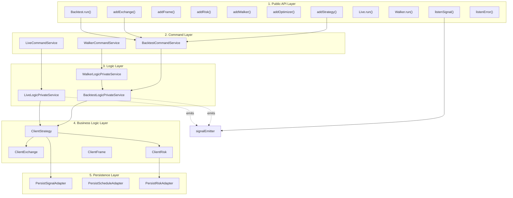
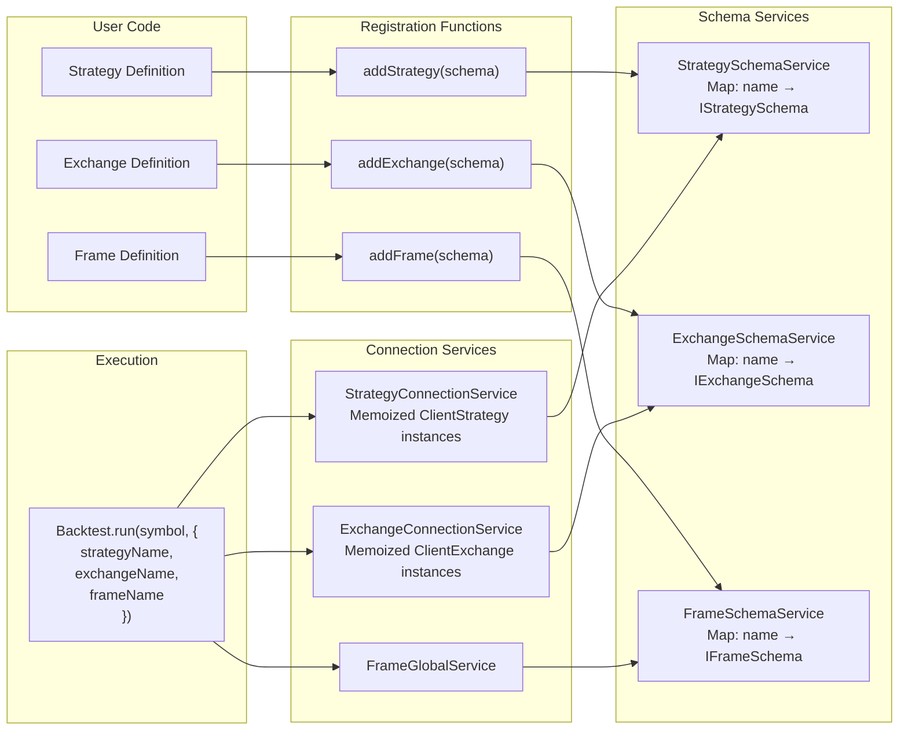
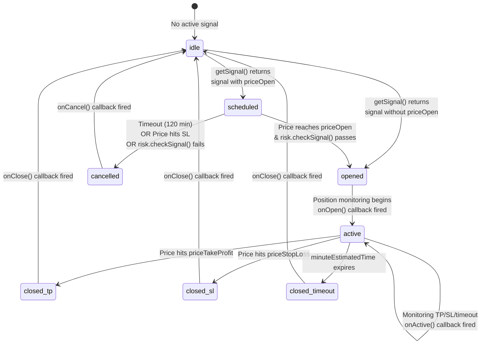
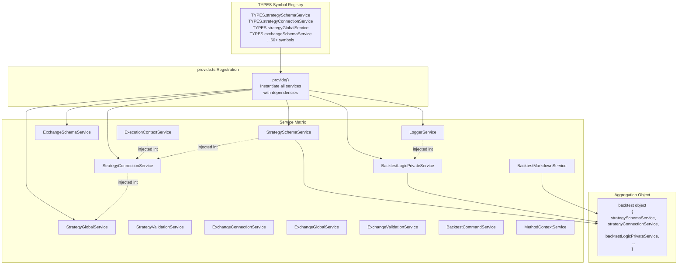
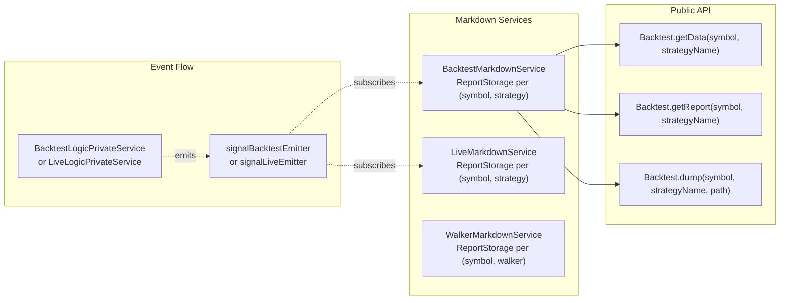

# Overview

**backtest-kit** is a production-ready TypeScript framework for developing, backtesting, and deploying algorithmic trading strategies with enterprise-grade reliability. The framework provides three execution modes (historical simulation, live trading, crash-safe state recovery), comprehensive signal validation, and event-driven observability. This document introduces the framework's purpose, architecture, and core concepts at a high level.

For detailed information about specific subsystems, see:
- Execution modes: [Backtest Mode](#9), [Live Trading](#10), [Walker Comparison](#11)
- Strategy development: [Strategy Schemas](#5.1), [Signal Lifecycle](#8)
- System architecture: [Architecture](#3), [Service Layer](#7)
- Advanced features: [Risk Management](#12), [AI Optimization](#16.5)

## Purpose and Design Goals

The framework solves a critical problem in algorithmic trading: **bridging the gap between backtesting and production deployment**. Traditional backtesting tools often fail when strategies move to live trading due to state management issues, unrealistic execution assumptions, or missing crash recovery. backtest-kit addresses these challenges through:

1. **Unified Strategy Code**: Identical strategy logic runs in backtest and live modes without modifications
2. **Crash-Safe Persistence**: Atomic file writes ensure state recovery after process crashes with no duplicate signals
3. **Realistic Execution Simulation**: VWAP pricing, fee/slippage modeling, and time-aware context propagation
4. **Portfolio-Level Risk Controls**: Cross-strategy validation and position tracking
5. **Memory-Efficient Streaming**: AsyncGenerator-based execution processes years of historical data without loading everything into memory

The framework is structured as a **dependency injection container** that orchestrates ~60 services across 8 major subsystems, with a public API layer that hides internal complexity behind intuitive registration functions.

**Sources**: [README.md:1-55](), [types.d.ts:1-100](), Diagram 1 from high-level architecture

## Core Architecture Layers

The system implements a **layered architecture** with clear separation of concerns across five tiers, from user-facing API to persistence layer.



**Layer Responsibilities**:

| Layer | Purpose | Key Components |
|-------|---------|----------------|
| **Public API** | User-facing functions for registration and execution | `addStrategy()`, `Backtest`, `Live`, `Walker`, event listeners |
| **Command** | Validation and orchestration entry points | `BacktestCommandService`, `LiveCommandService`, `WalkerCommandService` |
| **Logic** | Execution orchestration and AsyncGenerator streaming | `BacktestLogicPrivateService`, `LiveLogicPrivateService`, `WalkerLogicPrivateService` |
| **Business Logic** | Core trading logic and state management | `ClientStrategy`, `ClientExchange`, `ClientRisk`, `ClientFrame` |
| **Persistence** | Crash-safe state storage with atomic writes | `PersistSignalAdapter`, `PersistScheduleAdapter`, `PersistRiskAdapter` |

Each layer depends only on layers below it, creating a **unidirectional dependency graph** that simplifies testing and maintenance. The Command layer validates inputs and delegates to Logic services, which orchestrate Business Logic components through dependency injection.

**Sources**: [src/index.ts:1-184](), [src/function/add.ts](), [src/classes/Backtest.ts](), [src/classes/Live.ts](), [src/client/ClientStrategy.ts:1-50](), Diagram 1 and 4 from high-level architecture

## Component Registration Pattern

The framework uses a **registry-based dependency injection pattern** where components are registered by name before execution. Registration functions (`addStrategy`, `addExchange`, `addFrame`, etc.) store schemas in registry services, which are later instantiated by Connection services during execution.



This pattern enables **dependency inversion**: strategies reference exchanges by name (`exchangeName: "binance"`), not by direct import. Components can be registered in separate modules and assembled at runtime through string identifiers. The memoization layer in Connection services ensures each symbol-strategy-exchange combination gets exactly one instance, preventing duplicate state.

**Registration Flow**:
1. User calls `addStrategy({ strategyName: "my-strategy", ... })`
2. Function stores schema in `StrategySchemaService.schemas` Map
3. During execution, `StrategyConnectionService.getStrategy("my-strategy")` retrieves schema
4. Schema is instantiated into `ClientStrategy` instance with dependencies injected
5. Instance is memoized by `(symbol, strategyName)` key for reuse

**Sources**: [src/function/add.ts](), [src/lib/services/schema/StrategySchemaService.ts](), [src/lib/services/connection/StrategyConnectionService.ts](), [types.d.ts:816-833](), Diagram 4 from high-level architecture

## Execution Modes

The framework provides three execution modes with distinct temporal semantics and completion behavior, but all share the same strategy logic and signal lifecycle.

```mermaid
graph TB
    subgraph "Backtest Mode"
        BT_Input["Input:<br/>- strategyName<br/>- exchangeName<br/>- frameName"]
        BT_Frame["FrameGlobalService<br/>getTimeframes()"]
        BT_Loop["For each timeframe Date"]
        BT_Tick["ClientStrategy.tick(when)"]
        BT_Signal["Signal opened?"]
        BT_Candles["getNextCandles()<br/>fetch future data"]
        BT_Fast["ClientStrategy.backtest()<br/>fast VWAP simulation"]
        BT_Output["Output:<br/>IStrategyTickResultClosed<br/>via AsyncGenerator"]
        
        BT_Input --> BT_Frame
        BT_Frame --> BT_Loop
        BT_Loop --> BT_Tick
        BT_Tick --> BT_Signal
        BT_Signal -->|Yes| BT_Candles
        BT_Candles --> BT_Fast
        BT_Fast --> BT_Output
        BT_Output --> BT_Loop
        BT_Signal -->|No| BT_Loop
    end
    
    subgraph "Live Mode"
        L_Input["Input:<br/>- strategyName<br/>- exchangeName<br/>- no frameName"]
        L_Loop["Infinite loop<br/>while(true)"]
        L_Time["when = new Date()"]
        L_Tick["ClientStrategy.tick(when)"]
        L_Sleep["sleep(TICK_TTL=61s)"]
        L_Output["Output:<br/>IStrategyTickResult<br/>via AsyncGenerator"]
        
        L_Input --> L_Loop
        L_Loop --> L_Time
        L_Time --> L_Tick
        L_Tick --> L_Output
        L_Output --> L_Sleep
        L_Sleep --> L_Loop
    end
    
    subgraph "Walker Mode"
        W_Input["Input:<br/>- walkerName<br/>- strategies[]<br/>- metric"]
        W_Loop["For each strategy"]
        W_Backtest["Run Backtest.run()<br/>get all signals"]
        W_Stats["Calculate metric<br/>sharpeRatio, winRate, etc"]
        W_Compare["Compare to best"]
        W_Output["Output:<br/>IWalkerResults<br/>bestStrategy, bestMetric"]
        
        W_Input --> W_Loop
        W_Loop --> W_Backtest
        W_Backtest --> W_Stats
        W_Stats --> W_Compare
        W_Compare --> W_Loop
        W_Loop --> W_Output
    end
```



**Mode Characteristics**:

| Mode | Temporal Progression | Completion | State Persistence | Use Case |
|------|---------------------|------------|-------------------|----------|
| **Backtest** | Historical, sequential through timeframes | Finite, when all frames processed | Optional, for testing only | Historical strategy validation |
| **Live** | Real-time, `new Date()` | Infinite, manual stop required | Required, crash-safe | Production trading |
| **Walker** | Historical, parallel strategy iteration | Finite, when all strategies tested | Optional | Strategy comparison and optimization |

All three modes use the same `ClientStrategy.tick()` method for signal generation and monitoring, ensuring consistent behavior across environments. The key difference is **temporal context**: Backtest iterates through fixed dates, Live uses current time, and Walker orchestrates multiple Backtest runs.

**Sources**: [src/classes/Backtest.ts](), [src/classes/Live.ts](), [src/classes/Walker.ts](), [src/lib/services/logic/BacktestLogicPrivateService.ts](), [src/lib/services/logic/LiveLogicPrivateService.ts](), [src/lib/services/logic/WalkerLogicPrivateService.ts](), Diagram 3 from high-level architecture

## Signal Lifecycle

Signals (trading positions) progress through a **state machine** with six possible states and multiple terminal outcomes. The lifecycle is identical in backtest and live modes, with different timing mechanisms.



**State Descriptions**:

| State | Description | Persistence | Validation |
|-------|-------------|-------------|------------|
| **idle** | No active signal, waiting for entry conditions | None | N/A |
| **scheduled** | Limit order waiting for price to reach `priceOpen` | `PersistScheduleAdapter` (live mode) | Risk check on activation |
| **opened** | Signal just created, position about to activate | `PersistSignalAdapter` (live mode) | Already validated |
| **active** | Position monitoring TP/SL/time expiration | `PersistSignalAdapter` (live mode) | N/A |
| **closed** | Position closed via TP/SL/timeout | Removed from persistence | N/A |
| **cancelled** | Scheduled signal cancelled before activation | Removed from persistence | N/A |

The **scheduled state** is unique: it represents a limit order waiting for `priceOpen` to be reached. If the price moves against the position and hits the stop loss before activation, the signal is cancelled without ever opening a position. This prevents entering positions after conditions have deteriorated.

**Validation Pipeline** (during `getSignal()`):
1. **Interval throttling**: Enforce minimum time between signal generation (e.g., "5m" = max one signal per 5 minutes)
2. **Risk gates**: `ClientRisk.checkSignal()` validates portfolio-level constraints
3. **Signal validation**: 30+ rules check TP/SL logic, price sanity, time limits, etc.

**Sources**: [src/client/ClientStrategy.ts:41-261](), [src/interfaces/Strategy.interface.ts:1-376](), [types.d.ts:738-966](), Diagram 2 from high-level architecture

## Event System

The framework implements a **pub-sub event architecture** with 16 emitters organized into 5 functional categories. All event callbacks use queued processing to ensure sequential execution even with async handlers.

```mermaid
flowchart TB
    subgraph "Event Producers"
        BacktestLogic["BacktestLogicPrivateService"]
        LiveLogic["LiveLogicPrivateService"]
        WalkerLogic["WalkerLogicPrivateService"]
        ClientStrategy["ClientStrategy"]
    end
    
    subgraph "Event Bus (16 Emitters)"
        direction TB
        
        signalEmitter["signalEmitter<br/>All signals"]
        signalLiveEmitter["signalLiveEmitter<br/>Live only"]
        signalBacktestEmitter["signalBacktestEmitter<br/>Backtest only"]
        
        progressBacktestEmitter["progressBacktestEmitter<br/>Backtest progress"]
        progressWalkerEmitter["progressWalkerEmitter<br/>Walker progress"]
        
        doneBacktestSubject["doneBacktestSubject<br/>Backtest complete"]
        doneLiveSubject["doneLiveSubject<br/>Live complete"]
        doneWalkerSubject["doneWalkerSubject<br/>Walker complete"]
        
        errorEmitter["errorEmitter<br/>Recoverable errors"]
        exitEmitter["exitEmitter<br/>Fatal errors"]
        
        partialProfitSubject["partialProfitSubject<br/>Profit milestones"]
        partialLossSubject["partialLossSubject<br/>Loss milestones"]
    end
    
    subgraph "Event Consumers"
        listenSignal["listenSignal()"]
        listenSignalLive["listenSignalLive()"]
        listenSignalBacktest["listenSignalBacktest()"]
        listenDone["listenDoneBacktest()"]
        listenError["listenError()"]
        listenPartial["listenPartialProfit()"]
    end
    
    BacktestLogic --> signalEmitter
    BacktestLogic --> signalBacktestEmitter
    BacktestLogic --> progressBacktestEmitter
    BacktestLogic --> doneBacktestSubject
    
    LiveLogic --> signalEmitter
    LiveLogic --> signalLiveEmitter
    LiveLogic --> doneLiveSubject
    
    WalkerLogic --> progressWalkerEmitter
    WalkerLogic --> doneWalkerSubject
    
    ClientStrategy --> partialProfitSubject
    ClientStrategy --> partialLossSubject
    ClientStrategy --> errorEmitter
    
    signalEmitter -.-> listenSignal
    signalLiveEmitter -.-> listenSignalLive
    signalBacktestEmitter -.-> listenSignalBacktest
    doneBacktestSubject -.-> listenDone
    errorEmitter -.-> listenError
    partialProfitSubject -.-> listenPartial
```



**Event Categories**:

1. **Signal Events**: `signalEmitter`, `signalLiveEmitter`, `signalBacktestEmitter` - Emit `IStrategyTickResult` with action discriminator
2. **Progress Events**: `progressBacktestEmitter`, `progressWalkerEmitter`, `progressOptimizerEmitter` - Emit completion percentages
3. **Completion Events**: `doneLiveSubject`, `doneBacktestSubject`, `doneWalkerSubject` - Emit `DoneContract` with metadata
4. **Error Events**: `errorEmitter`, `exitEmitter` - Emit `Error` objects (recoverable vs fatal)
5. **Analysis Events**: `partialProfitSubject`, `partialLossSubject` - Emit profit/loss milestone data

All listeners use the `queued()` wrapper from `functools-kit` to serialize async callback execution. This prevents race conditions when multiple events arrive rapidly and callbacks perform stateful operations.

**Sources**: [src/config/emitters.ts:1-122](), [src/function/event.ts:1-500](), [types.d.ts:16-28](), Diagram 6 from high-level architecture

## Context Propagation

The framework uses **async context propagation** via `di-scoped` to implicitly pass runtime parameters through the call stack without explicit function arguments. This enables the same strategy code to work in both backtest (historical time) and live (real-time) modes.

Two context services provide implicit parameters:

**1. ExecutionContextService** - Runtime execution parameters:
```typescript
interface IExecutionContext {
  symbol: string;      // Trading pair (e.g., "BTCUSDT")
  when: Date;          // Current timestamp (historical or real-time)
  backtest: boolean;   // Execution mode flag
}
```

**2. MethodContextService** - Component routing parameters:
```typescript
interface IMethodContext {
  strategyName: string;   // Which strategy to use
  exchangeName: string;   // Which exchange to use
  frameName: string;      // Which frame to use (empty in live mode)
}
```

These contexts are injected at the execution entry point and automatically propagated through all service calls:

```
Backtest.run(symbol, { strategyName, exchangeName, frameName })
  → BacktestLogicPrivateService.execute() [sets contexts]
    → StrategyGlobalService.tick() [reads contexts]
      → ClientStrategy.tick() [uses execution.context.when]
        → ClientExchange.getCandles() [uses execution.context.when, execution.context.symbol]
```

This architecture eliminates the need to pass `symbol`, `when`, `strategyName`, etc. as function parameters through every layer of the call stack. Strategy code can call `getAveragePrice(symbol)` and it automatically uses the correct timestamp from context.

**Sources**: [types.d.ts:138-182](), [types.d.ts:400-441](), [src/lib/services/context/ExecutionContextService.ts](), [src/lib/services/context/MethodContextService.ts](), Diagram 4 from high-level architecture

## Dependency Injection

The framework uses a **symbol-based dependency injection container** with ~60 services registered at startup. Services are organized into a matrix pattern by component type (Strategy, Exchange, Frame, etc.) and function category (Connection, Schema, Global, Validation, etc.).



**Service Organization Pattern**:

Each component type (Strategy, Exchange, Frame, Risk, Sizing) has four service types:
1. **Schema Service**: Registry of user-registered schemas (`Map<name, schema>`)
2. **Connection Service**: Instantiation and memoization of client instances
3. **Global Service**: Context injection wrapper around connection service
4. **Validation Service**: Schema validation logic

Example for Strategy component:
- `StrategySchemaService` - Stores `IStrategySchema` objects in Map
- `StrategyConnectionService` - Creates and memoizes `ClientStrategy` instances
- `StrategyGlobalService` - Wraps connection service with `ExecutionContextService.runInContext()`
- `StrategyValidationService` - Validates strategy schemas on registration

The `backtest` aggregation object (exported as `lib`) provides a flat namespace for accessing all services, used internally by public API functions.

**Sources**: [src/lib/core/types.ts](), [src/lib/core/provide.ts](), [src/lib/index.ts](), [types.d.ts:5-20](), Diagram 4 from high-level architecture

## Crash Recovery and Persistence

In live mode, the framework uses **atomic file-based persistence** to enable crash recovery with exactly-once execution guarantees. Four persistence adapters manage different state types:

| Adapter | State Type | File Location | Purpose |
|---------|-----------|---------------|---------|
| `PersistSignalAdapter` | Active signals | `.backtest-kit/signals/{symbol}/{strategyName}.json` | Resume monitoring after crash |
| `PersistScheduleAdapter` | Scheduled signals | `.backtest-kit/schedule/{symbol}/{strategyName}.json` | Resume waiting for activation |
| `PersistRiskAdapter` | Active positions | `.backtest-kit/risk/{symbol}.json` | Track portfolio-level risk |
| `PersistPartialAdapter` | Partial P&L | `.backtest-kit/partial/{symbol}/{strategyName}.json` | Track milestone progress |

**Persistence Flow**:
1. Signal state changes (opened → active → closed)
2. `ClientStrategy.setPendingSignal()` calls `PersistSignalAdapter.writeValue()`
3. Adapter writes JSON to temporary file: `{path}.tmp`
4. Atomic rename: `{path}.tmp` → `{path}`
5. On crash and restart, `waitForInit()` reads persisted state
6. Strategy resumes from last persisted state

**Custom Persistence Backends**: Users can replace the default file-based adapters with custom implementations (Redis, MongoDB, PostgreSQL) by implementing `PersistBase` interface and registering via `use*Adapter()` methods:

```typescript
PersistSignalAdapter.usePersistSignalAdapter(RedisAdapter);
PersistRiskAdapter.usePersistRiskAdapter(MongoAdapter);
```

The atomic write pattern (write to `.tmp`, then rename) ensures that crashes during write operations leave either the old valid state or the new valid state, never corrupted partial data.

**Sources**: [src/classes/Persist.ts](), [src/client/ClientStrategy.ts:411-472](), [types.d.ts:155-178](), [README.md:19-20](), Diagram 2 from high-level architecture

## Reporting and Analytics

The framework generates **markdown reports** with statistical analysis for each execution mode. Reports are accumulated via event subscription and calculated on-demand or saved to disk.



**Report Types**:

| Report | Service | Tracked Data | Key Metrics |
|--------|---------|--------------|-------------|
| **Backtest** | `BacktestMarkdownService` | Closed signals only | Sharpe Ratio, Win Rate, Total PNL, Expected Yearly Returns |
| **Live** | `LiveMarkdownService` | All events (idle, opened, active, closed) | Same as Backtest, plus event counts |
| **Schedule** | `ScheduleMarkdownService` | Scheduled/cancelled signals | Cancellation rate, Average wait time |
| **Walker** | `WalkerMarkdownService` | Strategy comparison results | Best strategy, Best metric value |
| **Partial** | `PartialMarkdownService` | Profit/loss milestones | Milestone distribution (10%, 20%, 30%...) |
| **Performance** | `PerformanceMarkdownService` | Execution timing metrics | P95/P99 latencies, Bottleneck detection |

**Statistics Calculation** (Safe Math):

All numeric calculations use `isUnsafe()` checks to detect NaN/Infinity:
```typescript
function isUnsafe(value: number | null): boolean {
  return typeof value !== "number" || isNaN(value) || !isFinite(value);
}
```

Metrics return `null` instead of invalid numbers, preventing downstream errors from propagating. Report generation uses null-safe formatting to display "N/A" for invalid values.

**Key Metrics**:
- **Sharpe Ratio**: `avgPnl / stdDev` (risk-adjusted return)
- **Annualized Sharpe**: `sharpeRatio × √365`
- **Certainty Ratio**: `avgWin / |avgLoss|` (win quality metric)
- **Expected Yearly Returns**: `avgPnl × (365 / avgDurationDays)` (annualized return)

**Sources**: [src/lib/services/markdown/BacktestMarkdownService.ts:1-100](), [src/lib/services/markdown/LiveMarkdownService.ts:1-100](), [src/lib/services/markdown/WalkerMarkdownService.ts](), [types.d.ts:999-1102](), [src/classes/Backtest.ts]()