# Overview

**Purpose**: This page introduces backtest-kit, a TypeScript framework for backtesting and live trading algorithmic strategies. It covers the framework's architecture, execution modes, and core components.

**Scope**: This overview provides a high-level understanding of the system's structure. For detailed API documentation, see [Public API Reference](./15_Public_API_Reference.md). For signal lifecycle details, see [Signal Lifecycle](./48_Signal_Lifecycle.md). For execution mode specifics, see [Backtest](./54_Backtesting.md), [Live Trading](./58_Live_Trading.md), and [Walker Mode](./63_Walker_Mode.md).

---

## What is backtest-kit?

backtest-kit is a TypeScript framework for backtesting and live trading strategies on crypto markets or forex. The framework enables identical code execution across environments with production-grade reliability.

**Key Features**:

| Feature | Implementation | Benefit |
|---------|---------------|---------|
| **Signal Lifecycle** | Type-safe state machine with 6 states (`idle`, `scheduled`, `opened`, `active`, `closed`, `cancelled`) | Compile-time guarantees prevent invalid state transitions |
| **VWAP Pricing** | Volume-weighted average from last 5 1-minute candles via `ExchangeCoreService.getAveragePrice()` | Realistic execution pricing vs simple close prices |
| **Crash Recovery** | Atomic file writes via `PersistSignalAdapter`, `PersistRiskAdapter`, `PersistScheduleAdapter` | Zero signal loss on process restart |
| **Validation** | Multi-layer checks: type validation, price logic, distance checks, risk limits, time constraints | Invalid signals rejected before execution |
| **Event System** | RxJS `Subject`-based pub-sub with `queued()` wrapper | Sequential callback execution prevents race conditions |
| **Async Generators** | `BacktestLogicPrivateService.run()` and `LiveLogicPrivateService.run()` yield results | Memory-efficient streaming for large datasets |
| **AI Integration** | `ClientOptimizer` with Ollama `deepseek-v3.1:671b` model | LLM-powered strategy generation from market data |

**Sources**: [README.md:1-29](), [package.json:1-6](), [src/client/ClientStrategy.ts:1-100]()

---

## System Architecture

backtest-kit implements a layered architecture with 50+ services organized into distinct categories. The system uses dependency injection (`di-kit`) and async context propagation (`di-scoped`) for service coordination.

**System Architecture Diagram**:



**Layer Responsibilities**:

| Layer | Purpose | Key Classes |
|-------|---------|-------------|
| **Public API** | User-facing functions exported from `src/index.ts` | `addExchange`, `addStrategy`, `BacktestUtils`, `LiveUtils`, `listenSignal` |
| **Command Services** | Orchestrate execution workflows | `BacktestCommandService.run()`, `LiveCommandService.run()`, `WalkerCommandService.run()` |
| **Logic Services** | Implement execution algorithms (private/public separation) | `BacktestLogicPrivateService.execute()`, `LiveLogicPrivateService.loop()` |
| **Connection Services** | Factory pattern with memoization by composite keys | `StrategyConnectionService.getStrategy()`, `ExchangeConnectionService.getExchange()` |
| **Core Services** | Domain logic without DI dependencies | `StrategyCoreService.execute()`, `ExchangeCoreService.getAveragePrice()` |
| **Schema Services** | Store registered configurations using `ToolRegistry` | `StrategySchemaService.add()`, `ExchangeSchemaService.add()` |
| **Client Implementations** | Business logic for strategies, exchanges, risk | `ClientStrategy.tick()`, `ClientExchange.getCandles()`, `ClientRisk.checkSignal()` |
| **Persistence Layer** | Atomic file writes for crash recovery | `PersistSignalAdapter.writeSignalData()`, `PersistRiskAdapter.writePositionData()` |

**Sources**: [src/client/ClientStrategy.ts:1-50](), [src/lib/services/connection/StrategyConnectionService.ts:1-100](), [docs/classes/BacktestUtils.md:1-92](), [docs/classes/LiveUtils.md:1-101]()

---

## Execution Modes

backtest-kit provides three execution modes with distinct data flow and persistence characteristics:

**Execution Mode Comparison**:



**Mode Characteristics**:

| Mode | Entry Point | Data Source | Output Type | Persistence |
|------|-------------|-------------|-------------|-------------|
| **Backtest** | `BacktestUtils.run()` or `.background()` | `FrameCoreService.getTimeframes()` with `IFrameSchema.startDate`/`endDate` | `IStrategyBacktestResult` (closed/cancelled only) | In-memory only, no disk writes |
| **Live** | `LiveUtils.run()` or `.background()` | `new Date()` every `TICK_TTL` (60 seconds) | `IStrategyTickResult` (all 6 states) | Atomic writes to `./dump/data/signal/{strategy}/{symbol}.json` |
| **Walker** | `WalkerUtils.run()` or `.background()` | Sequential calls to `BacktestLogicPrivateService` per strategy | `WalkerCompleteContract` with ranked results | Markdown reports via `WalkerMarkdownService` |

**Execution Context**:

All modes use `ExecutionContextService` with `AsyncLocalStorage` to propagate:
- `symbol: string` - Trading pair (e.g., "BTCUSDT")
- `when: Date` - Current timestamp for temporal isolation
- `backtest: boolean` - Mode flag determining persistence behavior

**Sources**: [docs/classes/BacktestUtils.md:1-92](), [docs/classes/LiveUtils.md:1-101](), [docs/classes/WalkerUtils.md:1-99](), [src/client/ClientStrategy.ts:490-552]()

---

## Core Component Registration

The framework uses dependency inversion for component registration. Components are defined separately and wired together at runtime using string identifiers:



**Registration Example** (from codebase pattern):

```typescript
// Register exchange
addExchange({
  exchangeName: "binance",
  getCandles: async (symbol, interval, since, limit) => { /* ... */ }
});

// Register strategy
addStrategy({
  strategyName: "sma-crossover",
  interval: "5m",
  getSignal: async (symbol) => { /* ... */ }
});

// Wire components at execution time
Backtest.background("BTCUSDT", {
  strategyName: "sma-crossover",  // String identifier
  exchangeName: "binance",        // String identifier
  frameName: "1d-backtest"
});
```

**Sources**: [README.md:100-223](), [test/e2e/defend.test.mjs:32-57]()

---

## Signal Lifecycle States

Signals progress through a type-safe state machine implemented as TypeScript discriminated unions. Each state has a distinct interface (`IStrategyTickResult*`) with the `action` property as the discriminator.

**Signal State Machine**:



**TypeScript Interfaces**:

| State | Interface | Key Properties | Persistence File |
|-------|-----------|----------------|------------------|
| `idle` | `IStrategyTickResultIdle` | `action: "idle"`, `signal: null` | None |
| `scheduled` | `IStrategyTickResultScheduled` | `action: "scheduled"`, `signal: IScheduledSignalRow` | `./dump/data/schedule/{strategy}/{symbol}.json` |
| `opened` | `IStrategyTickResultOpened` | `action: "opened"`, `signal: ISignalRow` | `./dump/data/signal/{strategy}/{symbol}.json` (created) |
| `active` | `IStrategyTickResultActive` | `action: "active"`, `signal: ISignalRow`, `percentTp`, `percentSl` | `./dump/data/signal/{strategy}/{symbol}.json` (updated) |
| `closed` | `IStrategyTickResultClosed` | `action: "closed"`, `signal: ISignalRow`, `closeReason`, `pnl: IStrategyPnL` | `./dump/data/signal/{strategy}/{symbol}.json` (deleted) |
| `cancelled` | `IStrategyTickResultCancelled` | `action: "cancelled"`, `signal: IScheduledSignalRow` | `./dump/data/schedule/{strategy}/{symbol}.json` (deleted) |

**State Transition Functions** (in `ClientStrategy`):

- `GET_SIGNAL_FN()` - Generates new signals, returns `ISignalRow` or `IScheduledSignalRow`
- `CHECK_SCHEDULED_SIGNAL_PRICE_ACTIVATION_FN()` - Checks if scheduled signal should activate or cancel
- `ACTIVATE_SCHEDULED_SIGNAL_FN()` - Converts `IScheduledSignalRow` to `ISignalRow` and persists
- `CHECK_PENDING_SIGNAL_COMPLETION_FN()` - Monitors active signal for TP/SL/time exit
- `CLOSE_PENDING_SIGNAL_FN()` - Calculates PNL and closes signal

**Sources**: [src/interfaces/Strategy.interface.ts:173-312](), [src/client/ClientStrategy.ts:332-476](), [src/client/ClientStrategy.ts:554-608](), [src/client/ClientStrategy.ts:610-644]()

---

## Event System Architecture

backtest-kit implements an event-driven architecture using RxJS `Subject` instances for type-safe pub-sub. All event listeners use the `queued()` wrapper from `functools-kit` to ensure sequential callback execution.

**Event Flow Diagram**:


**Queued Processing**:

All listener functions wrap callbacks with `queued()` to ensure sequential execution:

```typescript
// Example from src/function/event.ts
export const listenSignal = (handler: (signal: IStrategyTickResult) => void) => {
  return signalEmitter.subscribe(queued(handler));
};
```

This prevents race conditions when multiple events fire rapidly (e.g., signal opened, partial profit hit, signal closed in quick succession).

**Event Hierarchies**:

| Base Emitter | Specialized Emitters | Listener Functions |
|--------------|---------------------|-------------------|
| `signalEmitter` (all signals) | `signalBacktestEmitter`, `signalLiveEmitter` | `listenSignal()`, `listenSignalBacktest()`, `listenSignalLive()` |
| `partialProfitSubject` | None | `listenPartialProfit()`, `listenPartialProfitOnce()` |
| `partialLossSubject` | None | `listenPartialLoss()`, `listenPartialLossOnce()` |
| `riskSubject` | None | `listenRisk()`, `listenRiskOnce()` |
| `walkerCompleteSubject` | None | `listenWalkerComplete()` |

**Event Contracts**:

Each event emitter has a corresponding TypeScript interface:
- `IStrategyTickResult` - Signal state changes (6 discriminated union types)
- `RiskEvent` - Risk validation failures with rejection reason
- `PartialEvent` - Partial profit/loss milestone reached
- `WalkerCompleteContract` - Walker comparison results with rankings
- `PerformanceContract` - Operation timing metrics

**Sources**: [src/config/emitters.ts:1-50](), [README.md:173-177](), [demo/live/src/index.mjs:111-162](), [demo/backtest/src/index.mjs:115-144]()

---

## Technology Stack

The framework is built on the following core dependencies:



**Key Dependencies**:

| Package | Version | Purpose |
|---------|---------|---------|
| `di-kit` | ^1.0.18 | Symbol-based dependency injection registry |
| `di-scoped` | ^1.0.20 | Async context propagation (ExecutionContext, MethodContext) |
| `functools-kit` | ^1.0.94 | Reactive primitives (Subject), async utilities (queued, singleshot) |
| `get-moment-stamp` | ^1.1.1 | Timestamp formatting for candles and reports |
| `ollama` | ^0.6.3 | LLM integration for AI-driven strategy generation |

**Sources**: [package.json:74-80](), [package-lock.json:1-37]()

---

## Repository Structure

The codebase follows a modular structure with clear separation of concerns:

```
backtest-kit/
├── src/                    # Framework source code
│   ├── interfaces/        # TypeScript interfaces (IStrategySchema, etc.)
│   ├── services/          # Service layer implementations
│   ├── client/            # Client implementations (ClientStrategy, etc.)
│   └── index.ts           # Public API exports
├── test/                  # Comprehensive test suite
│   ├── e2e/              # End-to-end integration tests
│   ├── spec/             # Unit tests for specific features
│   └── mock/             # Mock data generators
├── build/                 # Compiled output (CJS + ESM)
├── types.d.ts            # TypeScript type definitions
└── package.json          # Package metadata and dependencies
```

**Export Strategy**: The framework exposes a single entry point (`src/index.ts`) with selective exports for:
- Configuration functions (`addExchange`, `addStrategy`, etc.)
- Execution engines (`Backtest`, `Live`, `Walker`)
- Event listeners (`listenSignal`, `listenError`, etc.)
- Utility functions (`getCandles`, `formatPrice`, etc.)

**Sources**: [package.json:27-58](), [test/index.mjs:1-46]()

---

## Test Coverage

The framework includes comprehensive test coverage across multiple categories:



**Test Categories**:

| Category | Files | Coverage |
|----------|-------|----------|
| **E2E Integration** | `defend.test.mjs`, `risk.test.mjs`, `scheduled.test.mjs`, `persist.test.mjs` | Edge cases, crash recovery, risk limits |
| **Spec Tests** | `backtest.test.mjs`, `live.test.mjs`, `walker.test.mjs`, `heat.test.mjs` | Feature validation, PNL accuracy |
| **Mock Infrastructure** | `getMockCandles.mjs` | Deterministic candle generation for reproducible tests |

**Sources**: [test/index.mjs:1-46](), [test/e2e/defend.test.mjs:1-278](), [test/spec/heat.test.mjs:1-474](), [test/mock/getMockCandles.mjs:1-42]()

---

## Next Steps

- For detailed API reference, see [Public API Reference](./15_Public_API_Reference.md)
- For signal lifecycle deep dive, see [Signal Lifecycle](./48_Signal_Lifecycle.md)
- For execution mode details, see [Execution Modes](./06_Execution_Modes.md)
- For risk management, see [Risk Management](./67_Risk_Management.md)
- For AI optimization, see [AI-Powered Strategy Optimization](./90_AI-Powered_Strategy_Optimization.md)