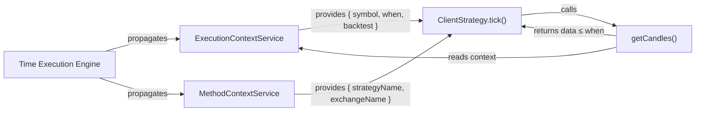
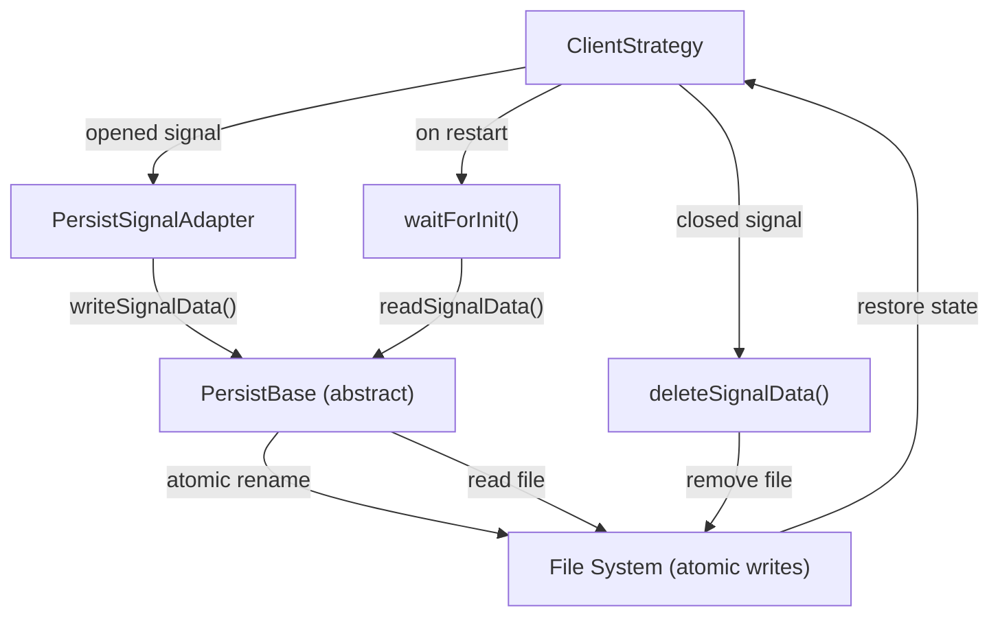
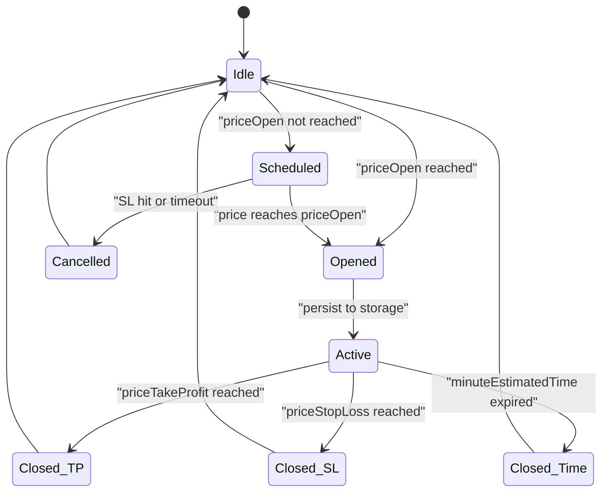
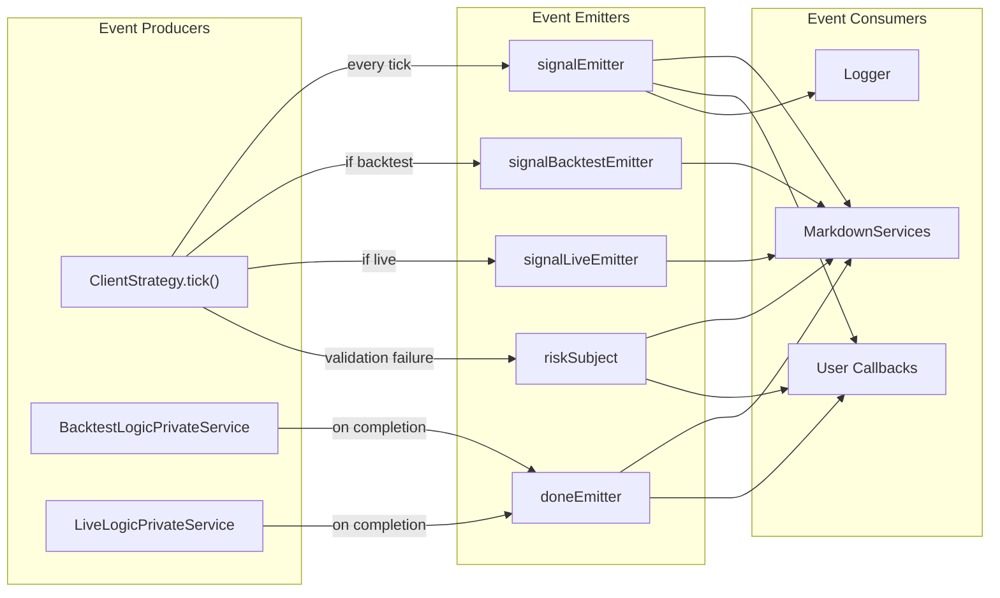
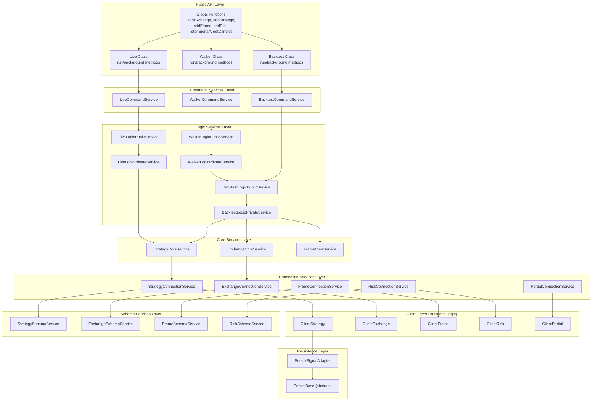
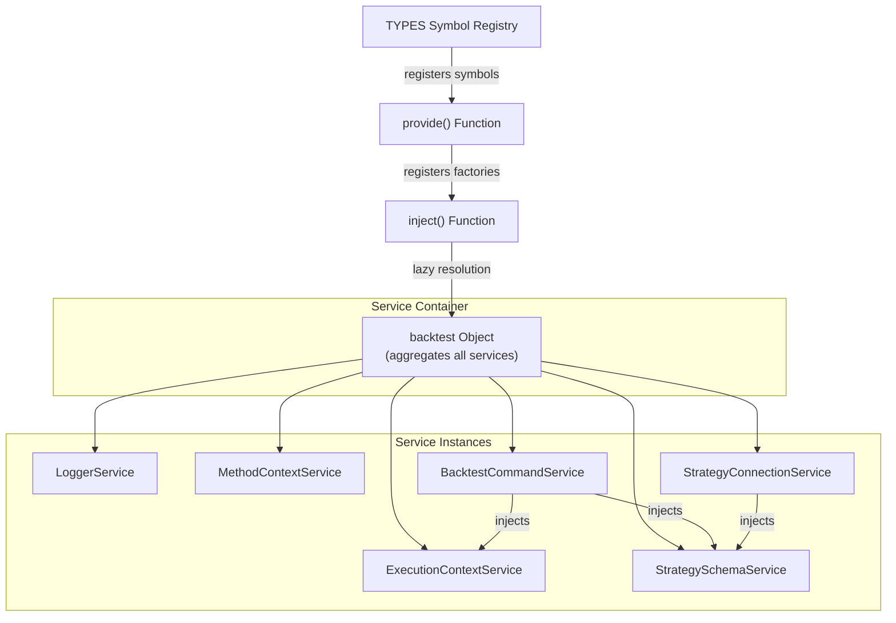

# Overview

This document provides a high-level introduction to Backtest Kit, a production-ready TypeScript framework for building and testing trading strategies. It covers the framework's purpose, key architectural principles, and system organization. For practical usage examples, see [Getting Started](./04_getting-started.md). For detailed architectural patterns, see [Architecture Deep Dive](./14_architecture-deep-dive.md).

**Sources:** [README.md:1-29](), [docs/internals.md:1-27]()

## What is Backtest Kit?

Backtest Kit is a TypeScript framework for backtesting and live trading strategies on crypto markets and forex. It enables developers to write trading strategies once and run them identically in historical simulation (backtest) and real-time trading (live) environments without code changes.

The framework treats market data as an **async stream of time**, processing each timestamp sequentially to architecturally prevent look-ahead bias. Strategies receive temporal context automatically through Node.js `AsyncLocalStorage`, ensuring they can only access historical data up to the current execution timestamp.

**Key Characteristics:**

| Aspect | Implementation |
|--------|----------------|
| **Language** | TypeScript 5.0+ |
| **Runtime** | Node.js with async generators |
| **Architecture** | Clean architecture with dependency injection |
| **State Management** | Crash-safe atomic persistence |
| **Execution Model** | Event-driven with streaming results |
| **Data Access** | Context-aware temporal queries |

**Sources:** [README.md:3-15](), [README.md:185-199](), [docs/internals.md:10-26]()

## Core Problems Solved

### 1. Look-Ahead Bias Prevention

Traditional backtesting frameworks allow strategies to accidentally access future data, invalidating test results. Backtest Kit makes look-ahead bias **architecturally impossible** by using `ExecutionContextService` to propagate temporal context through all data access operations.

When `getCandles()` is called, it automatically retrieves only data up to the current backtest timestamp using `async_hooks` context propagation. The same code runs identically in live mode, where "current time" is `new Date()`.

**Sources:** [README.md:185-199]()

### 2. Crash-Safe Live Trading

Live trading systems must recover state after crashes without data loss or duplicate trades. Backtest Kit implements atomic persistence through `PersistSignalAdapter`, which writes signal state to disk synchronously only for opened positions. If the process crashes, `waitForInit()` restores the active signal on restart.

**Sources:** [README.md:19-20](), [docs/internals.md:23]()

### 3. Production-Code Validation

Strategies require rigorous validation before risking capital. Backtest Kit enforces multi-stage validation through `GLOBAL_CONFIG` parameters that check take-profit/stop-loss logic, price sanity, risk/reward ratios, and portfolio limits. Invalid signals are rejected before execution.

**Sources:** [README.md:21](), [docs/internals.md:19]()

### 4. Mode-Agnostic Strategy Development

Developers should write strategy logic once, not maintain separate codebases for backtest and live environments. Backtest Kit achieves this through:
- Shared `ClientStrategy` implementation for both modes
- Context-aware `getCandles()` that works in any execution mode
- Identical signal validation and lifecycle management
- Same event system for monitoring

**Sources:** [README.md:19](), [docs/internals.md:30-38]()

## Key Architectural Principles

### Time Execution Engine

Backtest Kit is fundamentally a **time execution engine**, not a data processing library. The framework processes market data as an **async stream of time**, advancing through historical or real-time timestamps sequentially.



**Temporal Context Propagation:**

The framework uses `di-scoped` library to propagate two context objects through the execution stack:

| Context Service | Properties | Purpose |
|----------------|------------|---------|
| `ExecutionContextService` | `symbol`, `when`, `backtest` | Temporal boundaries for data access |
| `MethodContextService` | `strategyName`, `exchangeName`, `frameName` | Schema identifiers for configuration |

When `BacktestLogicPrivateService` or `LiveLogicPrivateService` executes, they wrap each tick in context:

```typescript
ExecutionContextService.runInContext(() => {
  MethodContextService.runInContext(() => {
    // Strategy code executes here with ambient context
    strategyCoreService.tick();
  }, { strategyName, exchangeName, frameName });
}, { symbol, when, backtest: true });
```

**Sources:** [README.md:185-199](), [docs/internals.md:47-50](), [docs/internals.md:54-67]()

### Crash-Safe Persistence

Live trading requires atomic state persistence to recover from crashes without data corruption or duplicate trades. Backtest Kit implements this through several layers:



**Persistence Strategy:**

| State | Action | Rationale |
|-------|--------|-----------|
| **Scheduled** | Not persisted | Ephemeral, can be regenerated |
| **Opened** | Written atomically | Must survive crashes |
| **Active** | Updated on changes | Track TP/SL modifications |
| **Closed** | Deleted immediately | No longer needed |

The `PersistBase` abstract class can be extended for custom storage backends (Redis, MongoDB) by implementing `readSignalData()`, `writeSignalData()`, and `deleteSignalData()` methods.

**Sources:** [docs/internals.md:23](), [docs/internals.md:38](), [docs/internals.md:50-51]()

### Signal Lifecycle State Machine

All trading signals follow a deterministic state machine with discriminated union types for type safety:



**Type-Safe State Representation:**

The `IStrategyTickResult` discriminated union ensures compile-time correctness:

```typescript
type IStrategyTickResult = 
  | { action: "idle", currentPrice: number }
  | { action: "scheduled", signal: IScheduledSignalRow, currentPrice: number }
  | { action: "opened", signal: ISignalRow, currentPrice: number }
  | { action: "active", signal: ISignalRow, currentPrice: number }
  | { action: "closed", signal: ISignalRow, closeReason: CloseReason, ... }
  | { action: "cancelled", signal: IScheduledSignalRow, ... };
```

This eliminates optional field bugs and enables exhaustive pattern matching in TypeScript.

**Sources:** [docs/internals.md:16](), [docs/types/IStrategyTickResult.md:1-14](), [docs/internals.md:44-45]()

### Event-Driven Architecture

All execution modes emit events through RxJS `Subject` instances, enabling real-time monitoring, logging, and report generation without blocking strategy execution:



**Event Processing Guarantees:**

All event listeners use `functools-kit` `queued` wrapper to ensure sequential processing even when callback functions contain async operations. This prevents race conditions during high-frequency event emission.

**Sources:** [docs/internals.md:24](), [docs/internals.md:39](), [docs/internals.md:52-53](), [docs/internals.md:83-89]()

## System Architecture Layers

Backtest Kit follows clean architecture principles with clear separation between business logic, orchestration, and infrastructure concerns:



**Layer Responsibilities:**

| Layer | Components | Responsibility |
|-------|-----------|----------------|
| **Public API** | `addStrategy()`, `Backtest`, `Live`, `Walker` classes | User-facing interface, parameter validation |
| **Command Services** | `BacktestCommandService`, `LiveCommandService`, `WalkerCommandService` | DI wrappers, validation orchestration |
| **Logic Services** | `BacktestLogicPrivateService`, `LiveLogicPrivateService` | Async generator orchestration, timeframe iteration |
| **Core Services** | `StrategyCoreService`, `ExchangeCoreService`, `FrameCoreService` | Business logic coordination, context management |
| **Connection Services** | `StrategyConnectionService`, `ExchangeConnectionService` | Memoized client factories, routing operations |
| **Client Layer** | `ClientStrategy`, `ClientExchange`, `ClientFrame` | Pure business logic, prototype methods for memory efficiency |
| **Schema Services** | `StrategySchemaService`, `ExchangeSchemaService` | Configuration storage using ToolRegistry pattern |
| **Persistence** | `PersistSignalAdapter`, `PersistBase` | Crash-safe atomic file writes, pluggable storage backends |

**Sources:** [docs/internals.md:28-39](), [docs/uml.puml:1-484](), [docs/classes/WalkerCommandService.md:1-79]()

## Dependency Injection Architecture

Backtest Kit uses a custom dependency injection system built on `di-kit` with Symbol-based tokens. All services are instantiated through a central container and accessed via the `backtest` object:



**Service Categories:**

The framework organizes services into 11 categories:

1. **Base Services**: `LoggerService` for centralized logging
2. **Context Services**: `ExecutionContextService`, `MethodContextService` for ambient context
3. **Schema Services**: Registry pattern for immutable configuration storage
4. **Validation Services**: Memoized existence checks for schema names
5. **Connection Services**: Memoized factory pattern for client instances
6. **Core Services**: Business logic orchestration
7. **Global Services**: Shared state management
8. **Logic Services**: Async generator implementation (Public/Private split)
9. **Command Services**: Top-level public API wrappers
10. **Markdown Services**: Event-driven report generation
11. **Template Services**: Code generation for LLM integration

**Sources:** [docs/internals.md:31-38]()

## Execution Modes Overview

Backtest Kit provides three execution modes that share the same core strategy logic but differ in orchestration:

| Mode | File | Purpose | Duration | State Persistence |
|------|------|---------|----------|------------------|
| **Backtest** | `BacktestLogicPrivateService` | Historical simulation | Finite (startDate → endDate) | None (in-memory only) |
| **Live** | `LiveLogicPrivateService` | Real-time trading | Infinite (until stopped) | Atomic file writes for crash recovery |
| **Walker** | `WalkerLogicPrivateService` | Strategy comparison | Finite (sequential backtests) | None (collects results in-memory) |

**Execution Flow Comparison:**

```mermaid
graph TB
    subgraph "Backtest Mode"
        BT_START["Backtest.run(symbol, config)"]
        BT_FRAME["Generate timeframes<br/>startDate → endDate"]
        BT_LOOP["For each timeframe"]
        BT_TICK["tick(when, backtest=true)"]
        BT_DONE["Emit doneBacktestSubject"]
    end
    
    subgraph "Live Mode"
        LIVE_START["Live.run(symbol, config)"]
        LIVE_INIT["Load persisted signal<br/>waitForInit()"]
        LIVE_LOOP["while (true)"]
        LIVE_TICK["tick(new Date(), backtest=false)"]
        LIVE_PERSIST["Persist opened signals"]
        LIVE_SLEEP["sleep(TICK_TTL)"]
        LIVE_DONE["Check stop flag"]
    end
    
    subgraph "Walker Mode"
        WALK_START["Walker.run(symbol, config)"]
        WALK_LOAD["Load walker schema"]
        WALK_LOOP["For each strategy"]
        WALK_BT["Run Backtest.run()"]
        WALK_STATS["Collect statistics"]
        WALK_DONE["Compare & emit results"]
    end
    
    BT_START --> BT_FRAME
    BT_FRAME --> BT_LOOP
    BT_LOOP --> BT_TICK
    BT_TICK --> BT_LOOP
    BT_LOOP --> BT_DONE
    
    LIVE_START --> LIVE_INIT
    LIVE_INIT --> LIVE_LOOP
    LIVE_LOOP --> LIVE_TICK
    LIVE_TICK --> LIVE_PERSIST
    LIVE_PERSIST --> LIVE_SLEEP
    LIVE_SLEEP --> LIVE_DONE
    LIVE_DONE --> LIVE_LOOP
    
    WALK_START --> WALK_LOAD
    WALK_LOAD --> WALK_LOOP
    WALK_LOOP --> WALK_BT
    WALK_BT --> WALK_STATS
    WALK_STATS --> WALK_LOOP
    WALK_LOOP --> WALK_DONE
```



All three modes call the same `StrategyCoreService.tick()` method, ensuring identical signal generation and validation logic across environments.

**Sources:** [docs/internals.md:54-82]()

## Technology Stack

Backtest Kit relies on a minimal set of production dependencies to maintain stability and reduce external risks:

| Dependency | Version | Purpose |
|------------|---------|---------|
| **di-kit** | ^1.0.18 | Dependency injection container with Symbol tokens |
| **di-scoped** | ^1.0.20 | Async context propagation using AsyncLocalStorage |
| **functools-kit** | ^1.0.94 | Functional utilities (memoization, queued processing, singleshot) |
| **get-moment-stamp** | ^1.1.1 | Timestamp formatting utilities |

**Peer Dependencies:**

The framework requires TypeScript 5.0+ as a peer dependency. Users must also install:
- **ccxt** (or custom exchange adapter) for market data
- **ollama** (optional) for LLM-powered strategy generation
- **uuid** for signal ID generation

**Zero Vendor Lock-In:**

Unlike cloud-based platforms (QuantConnect, etc.), Backtest Kit is fully self-hosted with no external API dependencies. All execution, data processing, and persistence occur in your environment.

**Sources:** [package.json:74-79](), [README.md:228-236]()

## Data Flow Summary

The framework follows a consistent data flow pattern regardless of execution mode:

1. **Configuration Phase**: User calls `addExchange()`, `addStrategy()`, `addFrame()`, `addRisk()` to register schemas
2. **Validation Phase**: `ValidationServices` check schema name existence and perform shallow validation
3. **Execution Initiation**: User calls `Backtest.run()`, `Live.run()`, or `Walker.run()` with symbol and context
4. **Context Setup**: `ExecutionContextService` and `MethodContextService` wrap the execution
5. **Client Instantiation**: `ConnectionServices` create memoized `ClientStrategy`, `ClientExchange`, `ClientRisk` instances
6. **Signal Generation**: `ClientStrategy.tick()` calls user-defined `getSignal()` function
7. **Validation Pipeline**: Multi-stage validation checks TP/SL logic, prices, risk limits
8. **Signal Processing**: State machine transitions (idle → scheduled → opened → active → closed)
9. **Event Emission**: Emit to `signalEmitter`, `signalBacktestEmitter`, `signalLiveEmitter`
10. **Report Generation**: `MarkdownServices` accumulate events and calculate statistics

**Sources:** [docs/internals.md:54-82]()

## Key Interfaces Overview

The framework exposes several critical interfaces for user interaction:

| Interface | Purpose | Example Properties |
|-----------|---------|-------------------|
| `IStrategySchema` | Strategy definition | `strategyName`, `interval`, `getSignal`, `callbacks`, `riskName` |
| `IExchangeSchema` | Exchange adapter | `exchangeName`, `getCandles`, `formatPrice`, `formatQuantity` |
| `IFrameSchema` | Timeframe specification | `frameName`, `interval`, `startDate`, `endDate` |
| `IRiskSchema` | Risk validation rules | `riskName`, `validations[]` |
| `ISignalDto` | Signal specification | `position`, `priceOpen`, `priceTakeProfit`, `priceStopLoss` |
| `IStrategyTickResult` | Tick result union | `action: "idle" \| "opened" \| "active" \| "closed" \| ...` |

The discriminated union pattern for `IStrategyTickResult` ensures type-safe pattern matching:

```typescript
const result = await strategy.tick();
if (result.action === "closed") {
  // TypeScript knows result.signal, result.closeReason exist
  console.log(result.signal.pnl, result.closeReason);
}
```

**Sources:** [docs/interfaces/IStrategyCallbacks.md:1-92](), [docs/types/IStrategyTickResult.md:1-14](), [docs/interfaces/BacktestStatistics.md:1-110](), [docs/interfaces/LiveStatistics.md:1-118]()