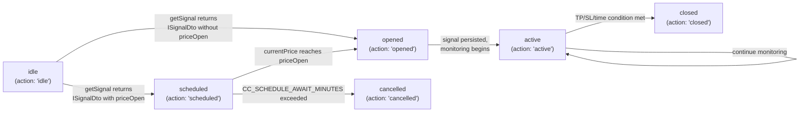
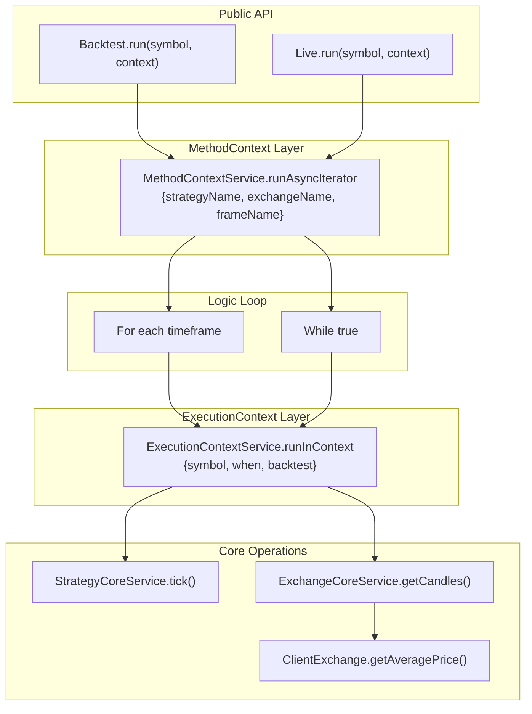
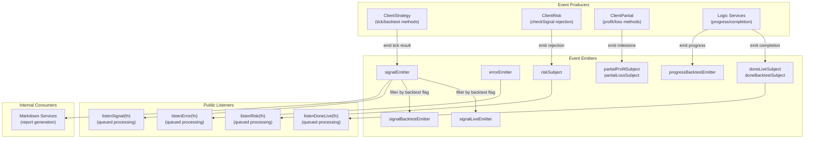
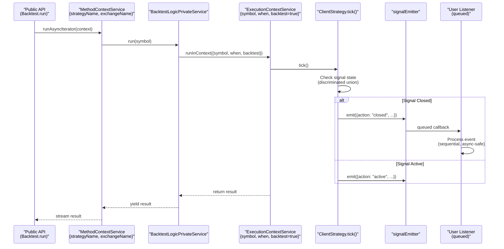

# Core Concepts

This document explains the three fundamental abstractions that underpin the entire backtest-kit framework: **signals**, **execution contexts**, and **event-driven communication**. Understanding these concepts is essential for working with any part of the system, as they form the foundation for all execution modes, strategy definitions, and data flows.

For detailed information about specific signal states and transitions, see [Signal Lifecycle and State Machine](./03-signal-lifecycle-and-state-machine.md). For information about how execution modes utilize these concepts, see [Execution Modes Overview](./04-execution-modes-overview.md). For comprehensive coverage of the event system's capabilities, see [Event-Driven Architecture](./05-event-driven-architecture.md).

---

## Signal Lifecycle and State Machine

The framework uses a **discriminated union type system** to represent trading signals as they progress through their lifecycle. All signal states are captured in the `IStrategyTickResult` type, which is a union of six distinct result types, each identified by an `action` discriminator field.

### Signal State Types

| State | Type | Description |
|-------|------|-------------|
| `idle` | `IStrategyTickResultIdle` | No active signal, strategy is monitoring for entry opportunities |
| `scheduled` | `IStrategyTickResultScheduled` | Signal created with `priceOpen` specified, waiting for price to reach entry point |
| `opened` | `IStrategyTickResultOpened` | Signal just activated at `priceOpen`, position is now open |
| `active` | `IStrategyTickResultActive` | Position is being monitored against TP/SL/time conditions |
| `closed` | `IStrategyTickResultClosed` | Position closed with final PnL calculation |
| `cancelled` | `IStrategyTickResultCancelled` | Scheduled signal cancelled without opening position |

The discriminated union pattern enables **type-safe state handling** throughout the codebase. TypeScript's type narrowing automatically provides the correct type when checking `result.action === "closed"`, ensuring that only valid fields for that state are accessible.



**Diagram: Signal State Transition Flow**

### Core Signal Interfaces

The `ISignalDto` interface represents the **data transfer object** returned from strategy's `getSignal` callback:

- **`position`**: `"long"` or `"short"` direction
- **`priceOpen`** (optional): If specified, creates scheduled signal; if omitted, opens immediately at current VWAP
- **`priceTakeProfit`**: Exit price for profitable close
- **`priceStopLoss`**: Exit price for loss-limiting close
- **`minuteEstimatedTime`**: Expected duration before `time_expired` close reason

After validation, the signal becomes an `ISignalRow` with auto-generated fields:

- **`id`**: UUID v4 identifier (auto-generated if not provided)
- **`exchangeName`**, **`strategyName`**: Routing information
- **`scheduledAt`**, **`pendingAt`**: Timing metadata
- **`symbol`**: Trading pair (e.g., `"BTCUSDT"`)

---

## Execution Contexts

The framework uses **two scoped context services** to propagate execution parameters implicitly throughout the call stack, eliminating the need for explicit parameter passing. Both services are implemented using `di-scoped` for async-safe context isolation.

### ExecutionContextService

`ExecutionContextService` provides **runtime execution parameters** for operations that need to know *when* and *where* they're executing:

| Field | Type | Purpose |
|-------|------|---------|
| `symbol` | `string` | Trading pair (e.g., `"BTCUSDT"`) |
| `when` | `Date` | Current timestamp for operation |
| `backtest` | `boolean` | `true` for historical simulation, `false` for live trading |

This context is set at the **innermost execution level** (within each tick) and is used by:
- `ClientExchange.getCandles()` and `getNextCandles()` to determine time boundaries
- `ClientStrategy` to calculate VWAP and compare against TP/SL conditions
- Persistence adapters to generate filenames (includes `backtest` flag)

```typescript
// Context propagation pattern
ExecutionContextService.runInContext(
  async () => {
    // Inside this callback, context is automatically available
    const candles = await exchange.getCandles(symbol, "1m", 5);
    // getCandles internally reads: ExecutionContextService.context.when
  },
  { symbol: "BTCUSDT", when: new Date(), backtest: true }
);
```

### MethodContextService

`MethodContextService` provides **schema routing information** for operations that need to retrieve registered configurations:

| Field | Type | Purpose |
|-------|------|---------|
| `strategyName` | `string` | Which strategy schema to use |
| `exchangeName` | `string` | Which exchange schema to use |
| `frameName` | `string` | Which frame schema to use (empty for live mode) |

This context is set at the **outermost execution level** (around entire run calls) and is used by:
- Connection services to retrieve memoized client instances by schema name
- Schema services to look up registered configurations
- Validation services to check existence of referenced schemas



**Diagram: Context Propagation Through Execution Stack**

The two contexts are **nested** to achieve separation of concerns:
- **MethodContext** (outer): Determines *which* strategy/exchange/frame to use (immutable per run)
- **ExecutionContext** (inner): Determines *when* and *where* to execute (changes per tick)

---

## Event-Driven Architecture

The framework implements a **comprehensive pub/sub event system** using `functools-kit`'s `Subject` class. All events flow through typed emitters that provide decoupled communication between system components.

### Core Event Emitters

The framework exposes 18 specialized event emitters organized by domain:

| Emitter | Type | Purpose |
|---------|------|---------|
| `signalEmitter` | `Subject<IStrategyTickResult>` | All signals (backtest + live) |
| `signalLiveEmitter` | `Subject<IStrategyTickResult>` | Live trading signals only |
| `signalBacktestEmitter` | `Subject<IStrategyTickResult>` | Backtest signals only |
| `errorEmitter` | `Subject<Error>` | Recoverable errors during execution |
| `exitEmitter` | `Subject<Error>` | Fatal errors requiring process termination |
| `doneLiveSubject` | `Subject<DoneContract>` | Live execution completion |
| `doneBacktestSubject` | `Subject<DoneContract>` | Backtest execution completion |
| `doneWalkerSubject` | `Subject<DoneContract>` | Walker execution completion |
| `progressBacktestEmitter` | `Subject<ProgressBacktestContract>` | Backtest progress updates (frames processed) |
| `progressWalkerEmitter` | `Subject<ProgressWalkerContract>` | Walker progress updates (strategies tested) |
| `progressOptimizerEmitter` | `Subject<ProgressOptimizerContract>` | Optimizer progress updates (sources fetched) |
| `performanceEmitter` | `Subject<PerformanceContract>` | Execution timing metrics for profiling |
| `walkerEmitter` | `Subject<WalkerContract>` | Walker strategy results (intermediate) |
| `walkerCompleteSubject` | `Subject<IWalkerResults>` | Walker final results with best strategy |
| `walkerStopSubject` | `Subject<WalkerStopContract>` | Walker cancellation requests |
| `validationSubject` | `Subject<Error>` | Risk validation errors |
| `partialProfitSubject` | `Subject<PartialProfitContract>` | Profit milestone events (10%, 20%, ...) |
| `partialLossSubject` | `Subject<PartialLossContract>` | Loss milestone events (-10%, -20%, ...) |
| `riskSubject` | `Subject<RiskContract>` | Risk rejection events |

### Queued Async Processing

All public listener functions wrap callbacks with `queued()` from `functools-kit` to ensure **sequential event processing**. Even when callbacks involve asynchronous operations, events are processed one at a time in the order they were emitted, preventing race conditions and maintaining deterministic behavior.

```typescript
// Internal implementation pattern
export function listenSignal(fn: (event: IStrategyTickResult) => void) {
  return signalEmitter.subscribe(queued(async (event) => fn(event)));
}
```

This guarantees that even if `fn` performs async work (database writes, API calls), the next event won't start processing until the current one completes.

### Event Flow Pattern



**Diagram: Event System Data Flow with Queued Processing**

### Filter and Once Patterns

Listener functions come in **three variants**:

1. **Standard listeners**: Subscribe indefinitely until manually unsubscribed
   ```typescript
   const unsub = listenSignal((event) => { /* handle */ });
   unsub(); // stop listening
   ```

2. **Once listeners with filter**: Execute callback once when predicate matches, then auto-unsubscribe
   ```typescript
   listenSignalOnce(
     (event) => event.action === "closed" && event.closeReason === "take_profit",
     (event) => { /* handle first TP hit */ }
   );
   ```

3. **Mode-specific listeners**: Pre-filtered streams for backtest-only or live-only events
   ```typescript
   listenSignalBacktest((event) => { /* only backtest signals */ });
   listenSignalLive((event) => { /* only live signals */ });
   ```

---

## How Core Concepts Interact

The three core concepts work together to enable **type-safe, context-aware, event-driven execution**:



**Diagram: Sequence Showing Integration of Signals, Contexts, and Events**

1. **MethodContext** is set once at the start of a run, determining which schemas to use
2. **ExecutionContext** is set per-tick within the loop, providing runtime parameters
3. **ClientStrategy.tick()** accesses both contexts implicitly to execute strategy logic
4. **Discriminated union** ensures type-safe handling of signal states
5. **Event emission** decouples signal generation from consumption
6. **Queued processing** guarantees sequential, deterministic event handling

This architecture enables the framework to support multiple execution modes (Backtest, Live, Walker) using the same core abstractions with different context configurations and event filtering.

