# Key Features

This page provides an overview of the core features that make backtest-kit a production-ready framework for algorithmic trading. Each feature is explained with its implementation details and integration points.

Related pages: [Core Concepts (2)](./05_Core_Concepts.md), [Architecture (3)](./09_Architecture.md), [Public API Reference (4)](./14_Public_API_Reference.md)

---

## Multi-Mode Execution

The framework provides three execution modes that share core business logic but implement distinct orchestration patterns: `Backtest` for historical simulation, `Live` for real-time trading, and `Walker` for strategy comparison.

### Diagram: Execution Mode Architecture


**Sources:**
- [src/lib/services/logic/private/BacktestLogicPrivateService.ts]()
- [src/lib/services/logic/private/LiveLogicPrivateService.ts]()
- [src/lib/services/logic/private/WalkerLogicPrivateService.ts]()
- [src/client/ClientStrategy.ts]()

### Backtest Mode

Historical simulation processes timeframes sequentially using `BacktestLogicPrivateService`:


**Backtest Flow Characteristics:**

| Feature | Implementation |
|---------|----------------|
| **Timeframe Generation** | `ClientFrame.getTimeframe()` creates timestamp array with configured interval |
| **Context Injection** | `ExecutionContextService` sets `when` to historical timestamp, `backtest=true` |
| **Fast-Forward Simulation** | `ClientStrategy.backtest()` processes future candles without tick iteration |
| **Memory Efficiency** | Generator yields only closed signals, no accumulation |
| **Early Termination** | User can `break` from async iterator at any time |

### Live Mode

Real-time trading operates an infinite loop with crash recovery:


**Live Trading Characteristics:**

| Feature | Implementation |
|---------|----------------|
| **Infinite Generator** | `LiveLogicPrivateService.execute()` loops with `while (true)` |
| **Real-Time Context** | `ExecutionContextService` sets `when=Date.now()`, `backtest=false` |
| **State Persistence** | `PersistSignalAdapter.writeSignalData()` before every state change |
| **Crash Recovery** | `ClientStrategy.waitForInit()` loads last known state on restart |
| **Interval Control** | `sleep(TICK_TTL)` ensures 61-second tick rate |
| **Filtered Output** | Only `opened` and `closed` yielded, `active` filtered |

**Sources:**
- [src/lib/services/logic/private/LiveLogicPrivateService.ts]()
- [src/client/ClientStrategy.ts:411-472]() (waitForInit)
- [src/classes/Persist.ts]() (PersistSignalAdapter)
- [src/config/params.ts]() (TICK_TTL)

### Walker Mode

Strategy comparison mode runs multiple backtests sequentially and ranks results by a metric:


**Walker Characteristics:**

| Feature | Implementation |
|---------|----------------|
| **Sequential Execution** | `WalkerLogicPrivateService.execute()` iterates strategies |
| **Metric Selection** | `sharpeRatio` (default), `winRate`, `avgPnl`, `totalPnl`, `certaintyRatio` |
| **Progress Tracking** | Emits `WalkerContract` after each strategy completion |
| **Best Strategy Tracking** | Maintains `bestStrategy` and `bestMetric` state |
| **Shared Timeframe** | All strategies use same `frameName` for fair comparison |

**Sources:**
- [src/lib/services/logic/private/WalkerLogicPrivateService.ts]()
- [src/lib/services/schema/WalkerSchemaService.ts]()
- [src/contract/Walker.contract.ts]()
- [src/classes/Walker.ts]() (public API)

---

## Crash-Safe Persistence

Live trading uses atomic file writes to persist signal state before every state transition, enabling crash recovery without signal duplication or data loss.

### Persistence Architecture


### Atomic Write Implementation

The `PersistSignalAdapter` ensures atomicity through temporary file writes:

| Step | Operation | Purpose |
|------|-----------|---------|
| 1 | Write to `.tmp` file | Prevent corruption if crash during write |
| 2 | Sync to disk | Ensure OS flushes write buffer |
| 3 | Rename `.tmp` to final | Atomic filesystem operation (all-or-nothing) |
| 4 | Sync directory | Ensure directory entry is persisted |

**Key Code Locations:**

- **Atomic Write Logic**: [src/classes/Persist.ts]() (`FilePersist.writeValue`)
- **Signal Persistence**: [src/client/ClientStrategy.ts:220-233]() (`setPendingSignal`)
- **State Recovery**: [src/client/ClientStrategy.ts:146-165]() (`waitForInit`)
- **File Naming**: `{strategyName}_{symbol}.json` convention in `PersistSignalAdapter.getEntityId()`

**Sources:**
- [src/classes/Persist.ts]()
- [src/client/ClientStrategy.ts:220-233]()
- [src/client/ClientStrategy.ts:146-165]()

---

---

## Signal Validation and Sanitization

Every signal from `getSignal()` passes through 30+ validation rules before execution. Validation failures throw descriptive errors with exact violations. The framework protects against common trading mistakes through configurable constraints.

### Diagram: Validation Pipeline


**Sources:**
- [src/client/ClientStrategy.ts:41-261]() (VALIDATE_SIGNAL_FN)
- [src/client/ClientStrategy.ts:263-396]() (GET_SIGNAL_FN)

### Validation Rules

The `VALIDATE_SIGNAL_FN` at [src/client/ClientStrategy.ts:41-261]() enforces these constraints:


### Global Validation Parameters

Configurable via `setConfig()` from [src/config/params.ts:1-35]():

| Parameter | Default | Purpose |
|-----------|---------|---------|
| `CC_MIN_TAKEPROFIT_DISTANCE_PERCENT` | 0.1% | Ensures TP covers trading fees (prevents micro-profits eaten by costs) |
| `CC_MAX_STOPLOSS_DISTANCE_PERCENT` | 20% | Prevents catastrophic losses from extreme SL values |
| `CC_MAX_SIGNAL_LIFETIME_MINUTES` | 1440 (1 day) | Prevents eternal signals blocking risk limits |
| `CC_SCHEDULE_AWAIT_MINUTES` | 120 (2 hours) | Maximum wait time for scheduled signal activation |

**Validation Error Examples:**

| Invalid Signal | Error Message |
|----------------|---------------|
| Long with TP below open | `Long: priceTakeProfit (49000) must be > priceOpen (50000)` |
| Long with SL above open | `Long: priceStopLoss (51000) must be < priceOpen (50000)` |
| Short with TP above open | `Short: priceTakeProfit (51000) must be < priceOpen (50000)` |
| Short with SL below open | `Short: priceStopLoss (49000) must be > priceOpen (50000)` |
| Negative price | `priceOpen must be positive, got -50000` |
| Zero time | `minuteEstimatedTime must be positive, got 0` |
| TP too close | `TakeProfit distance (0.05%) below minimum (0.1%)` |
| SL too far | `StopLoss distance (25%) exceeds maximum (20%)` |
| Excessive lifetime | `Signal lifetime (2000min) exceeds maximum (1440min)` |

### Validation Flow


**Sources:**
- [src/client/ClientStrategy.ts:41-261]() (VALIDATE_SIGNAL_FN)
- [src/client/ClientStrategy.ts:263-396]() (GET_SIGNAL_FN)
- [src/interfaces/Strategy.interface.ts:24-39]() (ISignalDto)
- [src/config/params.ts:5-72]() (GLOBAL_CONFIG)
- [test/e2e/sanitize.test.mjs]() (validation test coverage)

---

## Signal Lifecycle and Order Types

Signals follow a deterministic state machine supporting both market orders (immediate execution) and limit orders (scheduled execution at specific price).

### Diagram: Signal State Machine


**Sources:**
- [src/client/ClientStrategy.ts:474-596]() (scheduled signal logic)
- [src/client/ClientStrategy.ts:598-718]() (scheduled signal activation)
- [src/interfaces/Strategy.interface.ts:45-306]() (ISignalRow, state types)

### Scheduled Signals (Limit Orders)

Scheduled signals wait for price activation with timeout and pre-activation cancellation:

| Parameter | Default | Purpose |
|-----------|---------|---------|
| `CC_SCHEDULE_AWAIT_MINUTES` | 120 | Maximum wait time before timeout cancellation |
| Pre-Activation SL Check | Enabled | Cancel if SL hit before entry (prevents bad entries) |
| Risk Re-Validation | Required | Re-check risk limits at activation time |

**Sources:**
- [src/client/ClientStrategy.ts:474-528]() (timeout check)
- [src/client/ClientStrategy.ts:530-564]() (price activation check)
- [src/client/ClientStrategy.ts:601-693]() (activation with risk re-check)

### Discriminated Union Types

Type-safe state handling via `IStrategyTickResult`:

```typescript
// Example type narrowing (not actual code)
if (result.action === "scheduled") {
  // TypeScript knows: result.signal is IScheduledSignalRow
  console.log(result.signal.priceOpen);
}

if (result.action === "cancelled") {
  // TypeScript knows: result has closeReason, closeTimestamp
  console.log(result.closeReason); // "timeout" | "stop_loss"
}

if (result.action === "closed") {
  // TypeScript knows: result has pnl, closeReason
  console.log(result.pnl.pnlPercentage);
  console.log(result.closeReason); // "take_profit" | "stop_loss" | "time_expired"
}
```

**Sources:**
- [src/interfaces/Strategy.interface.ts:173-289]() (discriminated union types)

---

## Risk Management System

Portfolio-level risk controls with custom validation logic, concurrent position limits, and cross-strategy coordination via `ClientRisk` and `IRiskSchema`.

### Diagram: Risk Validation Flow


**Sources:**
- [src/client/ClientRisk.ts]()
- [src/client/ClientStrategy.ts:288-300]() (pre-check)
- [src/client/ClientStrategy.ts:769-781]() (post-check and addSignal)

### Risk Schema Configuration

`IRiskSchema` defines custom validation functions with portfolio state access:

| Field | Type | Purpose |
|-------|------|---------|
| `riskName` | `string` | Unique risk profile identifier |
| `validations` | `IRiskValidation[]` | Array of validation functions |
| `callbacks` | `Partial<IRiskCallbacks>` | Optional `onRejected`, `onAllowed` |

**Validation Payload:**

```typescript
// From IRiskValidationPayload interface
{
  symbol: string;
  strategyName: string;
  exchangeName: string;
  currentPrice: number;
  timestamp: number;
  activePositionCount: number; // Portfolio-wide
  activePositions: IRiskActivePosition[]; // All active signals
}
```

**Example Risk Validations:**

```typescript
// Concurrent position limit (not actual code)
validations: [
  ({ activePositionCount }) => {
    if (activePositionCount >= 3) {
      throw new Error("Maximum 3 concurrent positions");
    }
  }
]

// Symbol filtering (not actual code)
validations: [
  ({ symbol }) => {
    if (memeCoins.includes(symbol)) {
      throw new Error(`Meme coin ${symbol} blocked`);
    }
  }
]

// Time-based trading windows (not actual code)
validations: [
  ({ timestamp }) => {
    const hour = new Date(timestamp).getUTCHours();
    if (hour < 9 || hour > 17) {
      throw new Error("Outside trading hours");
    }
  }
]
```

**Sources:**
- [src/interfaces/Risk.interface.ts:443-526]() (IRiskSchema, IRiskValidation)
- [src/client/ClientRisk.ts]() (ClientRisk implementation)
- [README.md:646-695]() (risk management examples)

---

## Strategy Comparison (Walker)

Walker mode executes multiple strategies on the same timeframe and ranks them by a configurable metric. Results include statistical comparison and best strategy identification.

### Diagram: Walker Execution Flow


**Sources:**
- [src/lib/services/logic/private/WalkerLogicPrivateService.ts]()
- [src/lib/services/markdown/WalkerMarkdownService.ts]()

### Walker Schema Configuration

`IWalkerSchema` defines strategy comparison parameters:

| Field | Type | Purpose |
|-------|------|---------|
| `walkerName` | `string` | Unique walker identifier |
| `strategies` | `string[]` | Array of strategy names to compare |
| `exchangeName` | `string` | Exchange to use for all backtests |
| `frameName` | `string` | Timeframe for fair comparison |
| `metric` | `WalkerMetric` | Comparison metric (default: `sharpeRatio`) |

**Available Metrics:**

| Metric | Formula | Purpose |
|--------|---------|---------|
| `sharpeRatio` | `avgPnl / stdDev` | Risk-adjusted return (default) |
| `winRate` | `(winCount / totalSignals) × 100` | Win percentage |
| `avgPnl` | `Σ(pnl) / totalSignals` | Average profit per trade |
| `totalPnl` | `Σ(pnl)` | Cumulative profit |
| `certaintyRatio` | `avgWin / |avgLoss|` | Win/loss ratio |

**Walker Output:**

```typescript
// WalkerContract structure (not actual code)
{
  strategyName: string;
  stats: BacktestStatistics;
  metric: number; // Extracted metric value
  bestStrategy: string; // Current best
  bestMetric: number; // Current best metric value
  progress: number; // 0-1 completion
}
```

**Sources:**
- [src/interfaces/Walker.interface.ts]() (IWalkerSchema)
- [src/contract/Walker.contract.ts]() (WalkerContract)
- [src/classes/Walker.ts]() (public API)
- [README.md:413-467]() (Walker examples)

---

## AI-Powered Strategy Optimization

LLM-driven strategy generation from historical data with multi-timeframe analysis, automatic code generation, and walk-forward validation via `ClientOptimizer` and `IOptimizerSchema`.

### Diagram: Optimizer Pipeline



**Sources:**
- [src/client/ClientOptimizer.ts]()
- [src/lib/services/template/OptimizerTemplateService.ts]()
- [src/interfaces/Optimizer.interface.ts]()

### Optimizer Schema Configuration

`IOptimizerSchema` defines AI strategy generation parameters:

| Field | Type | Purpose |
|-------|------|---------|
| `optimizerName` | `string` | Unique optimizer identifier |
| `rangeTrain` | `IOptimizerRange[]` | Training date ranges for data collection |
| `rangeTest` | `IOptimizerRange` | Testing date range for validation |
| `source` | `Source[]` | Data sources (functions or configs) |
| `getPrompt` | Function | LLM prompt generator from message history |
| `template` | `Partial<IOptimizerTemplate>` | Optional code generation overrides |

**Data Source Types:**

```typescript
// Simple function (not actual code)
source: [
  async ({ symbol, startDate, endDate, limit, offset }) => {
    return await fetchCandleData(symbol, startDate, endDate, limit, offset);
  }
]

// Full configuration (not actual code)
source: [
  {
    name: "1h-candles",
    fetch: async (args) => { /* ... */ },
    user: (symbol, data) => formatUserMessage(data),
    assistant: (symbol, data) => "Data analyzed"
  }
]
```

**Code Generation Templates:**

The `OptimizerTemplateService` provides 11 template methods:

| Method | Purpose |
|--------|---------|
| `getTopBanner` | Imports and initialization |
| `getJsonDumpTemplate` | Debug logging helper |
| `getTextTemplate` | LLM text helper function |
| `getJsonTemplate` | LLM JSON helper function |
| `getExchangeTemplate` | CCXT exchange configuration |
| `getFrameTemplate` | Timeframe definitions (train + test) |
| `getStrategyTemplate` | Strategy with LLM integration |
| `getWalkerTemplate` | Strategy comparison setup |
| `getLauncherTemplate` | Execution code with listeners |
| `getUserMessage` | Default user message format |
| `getAssistantMessage` | Default assistant message format |

**Sources:**
- [src/lib/services/template/OptimizerTemplateService.ts:26-583]() (template methods)
- [src/client/ClientOptimizer.ts:99-215]() (data collection)
- [src/client/ClientOptimizer.ts:224-350]() (code assembly)
- [README.md:1000-1100]() (optimizer examples)

---

## Position Sizing

Position size calculation with multiple methods: fixed percentage, Kelly Criterion, and ATR-based sizing via `ClientSizing` and `ISizingSchema`.

### Diagram: Position Sizing Methods


**Sources:**
- [src/client/ClientSizing.ts]()
- [src/interfaces/Sizing.interface.ts]()

### Sizing Schema Configuration

`ISizingSchema` defines position sizing parameters:

| Field | Type | Purpose |
|-------|------|---------|
| `sizingName` | `string` | Unique sizing profile identifier |
| `method` | `SizingMethod` | `"fixed-percentage"`, `"kelly-criterion"`, or `"atr-based"` |
| `riskPercentage` | `number` | Risk per trade (e.g., 2 for 2%) |
| `kellyMultiplier` | `number?` | Kelly fraction multiplier (0.25 recommended) |
| `atrMultiplier` | `number?` | ATR multiplier for stop distance |
| `maxPositionPercentage` | `number?` | Maximum position as % of balance |
| `minPositionSize` | `number?` | Minimum position size |
| `maxPositionSize` | `number?` | Maximum position size |

**Position Sizing API:**

```typescript
// Example usage (not actual code)
import { PositionSize } from "backtest-kit";

// Fixed percentage
const qty1 = await PositionSize.fixedPercentage(
  "BTCUSDT",
  10000,  // balance
  50000,  // entry price
  49000,  // stop loss
  { sizingName: "conservative" }
);

// Kelly Criterion
const qty2 = await PositionSize.kellyCriterion(
  "BTCUSDT",
  10000,  // balance
  50000,  // entry price
  0.55,   // win rate
  1.5,    // win/loss ratio
  { sizingName: "kelly-quarter" }
);

// ATR-based
const qty3 = await PositionSize.atrBased(
  "BTCUSDT",
  10000,  // balance
  50000,  // entry price
  500,    // ATR value
  { sizingName: "atr-dynamic" }
);
```

**Sources:**
- [src/classes/PositionSize.ts]() (public API)
- [src/client/ClientSizing.ts]() (calculation logic)
- [README.md:560-643]() (sizing examples)

---

## Memory-Efficient Async Generators

All execution modes use async generators (`AsyncIterableIterator`) to stream results without memory accumulation:

### Generator Architecture



### Generator Comparison

| Aspect | Backtest Generator | Live Generator |
|--------|-------------------|----------------|
| **Termination** | Finite (timeframe exhausted) | Infinite (`while (true)`) |
| **Yield Condition** | Only `closed` results | `opened` and `closed` (filters `active`) |
| **Context Setting** | Historical timestamp from timeframe | `Date.now()` on each iteration |
| **Sleep Interval** | None (fast iteration) | 60000ms + 1ms between ticks |
| **Fast-Forward** | Yes (`backtest()` method) | No (real-time only) |
| **Cancellation** | `break` from iterator | `cancel()` function returned by `background()` |

### Memory Optimization Techniques

1. **Prototype Methods**: All client classes use prototype functions instead of arrow functions
   - **Location**: [src/client/ClientStrategy.ts]() (all methods use `public methodName = async () => {}` pattern)
   - **Benefit**: Single function instance shared across all instances

2. **Memoization**: Connection services cache client instances
   - **Location**: [src/lib/services/connection/]()
   - **Pattern**: `memoize()` from `functools-kit` on `getStrategy()`, `getExchange()`, `getFrame()`

3. **Streaming Accumulation**: Markdown services accumulate passively
   - **Location**: [src/lib/services/markdown/]()
   - **Pattern**: Listen to events, build report only when requested via `getReport()`

4. **Lazy Initialization**: Services created only when needed
   - **Pattern**: DI container resolves dependencies on first access

**Sources:**
- [src/lib/services/logic/private/BacktestLogicPrivateService.ts]()
- [src/lib/services/logic/private/LiveLogicPrivateService.ts]()
- [src/client/ClientStrategy.ts:194-464]() (prototype methods)

---

## Signal Lifecycle State Machine

Signals follow a deterministic state machine with discriminated union types for type-safe handling. The framework supports both market orders (immediate execution) and limit orders (scheduled execution).

### Type-Safe State Handling

The discriminated union `IStrategyTickResult` enables type narrowing:

```typescript
// Example usage (not actual code, just illustration)
const result = await strategy.tick();

if (result.action === "idle") {
  // TypeScript knows: result.signal === null
  console.log(result.currentPrice);
}

if (result.action === "scheduled") {
  // TypeScript knows: result.signal is ISignalRow with scheduledAt
  console.log(result.signal.priceOpen);
  console.log(result.signal.scheduledAt);
}

if (result.action === "cancelled") {
  // TypeScript knows: result has closeReason, closeTimestamp
  console.log(result.closeReason); // "timeout" | "stop_loss"
  console.log(result.closeTimestamp);
}

if (result.action === "opened") {
  // TypeScript knows: result.signal is ISignalRow with pendingAt
  console.log(result.signal.priceOpen);
  console.log(result.signal.pendingAt);
}

if (result.action === "active") {
  // TypeScript knows: result.signal is ISignalRow
  // result.currentPrice is available
}

if (result.action === "closed") {
  // TypeScript knows: result has pnl, closeReason, closeTimestamp
  console.log(result.pnl.pnlPercentage);
  console.log(result.closeReason); // "take_profit" | "stop_loss" | "time_expired"
}
```

### State Transition Code Locations

| State | Entry Point | Exit Point | Notes |
|-------|-------------|------------|-------|
| **idle** | [src/client/ClientStrategy.ts:306-322]() | `getSignal()` returns non-null | No active signal |
| **scheduled** | Signal generation with future `priceOpen` | Price activation or timeout | Limit order waiting |
| **cancelled** | Timeout or SL before activation | Return to idle | Scheduled signal not filled |
| **opened** | [src/client/ClientStrategy.ts:275-291]() | Next tick iteration | Position activated |
| **active** | [src/client/ClientStrategy.ts:447-463]() | TP/SL/time condition met | Position monitoring |
| **closed** | [src/client/ClientStrategy.ts:416-435]() | `setPendingSignal(null)` | Final state with PNL |

**Sources:**
- [src/lib/services/logic/private/BacktestLogicPrivateService.ts]()
- [src/lib/services/logic/private/LiveLogicPrivateService.ts]()

---

## Accurate PNL Calculation

Profit and loss includes realistic trading costs via `toProfitLossDto()`:

### Cost Constants

| Cost Type | Value | Application |
|-----------|-------|-------------|
| **Fee** | 0.1% (0.001) | Applied to both entry and exit |
| **Slippage** | 0.1% (0.001) | Simulates market impact |
| **Total Cost** | 0.2% per side | 0.4% round-trip (0.2% entry + 0.2% exit) |

### PNL Formulas

**Long Position:**
```
priceOpenWithCosts  = priceOpen  × (1 + slippage + fee)
priceCloseWithCosts = priceClose × (1 - slippage - fee)
pnl% = (priceCloseWithCosts - priceOpenWithCosts) / priceOpenWithCosts × 100
```

**Short Position:**
```
priceOpenWithCosts  = priceOpen  × (1 - slippage + fee)
priceCloseWithCosts = priceClose × (1 + slippage + fee)
pnl% = (priceOpenWithCosts - priceCloseWithCosts) / priceOpenWithCosts × 100
```

### PNL Calculation Implementation


**Example Calculation (Long Position):**

| Parameter | Value |
|-----------|-------|
| Entry Price | $50,000 |
| Exit Price | $51,000 |
| **Adjusted Entry** | $50,000 × 1.002 = $50,100 |
| **Adjusted Exit** | $51,000 × 0.998 = $50,898 |
| **PNL %** | ($50,898 - $50,100) / $50,100 × 100 = **+1.59%** |

Without costs, this would be +2.0%. The 0.41% difference represents realistic trading costs.

**Sources:**
- [src/helpers/toProfitLossDto.ts]() (PNL calculation)
- [src/client/ClientStrategy.ts:883]() (usage in CLOSE_PENDING_SIGNAL_FN)

---

## Reporting and Analytics

Comprehensive performance analysis with markdown reports, statistics calculation, and specialized tracking systems.

### Diagram: Reporting Architecture



**Sources:**
- [src/lib/services/markdown/BacktestMarkdownService.ts]()
- [src/lib/services/markdown/LiveMarkdownService.ts]()
- [src/lib/services/markdown/WalkerMarkdownService.ts]()
- [src/lib/services/markdown/ScheduleMarkdownService.ts]()
- [src/lib/services/markdown/PartialMarkdownService.ts]()
- [src/lib/services/markdown/HeatMarkdownService.ts]()

### Performance Metrics

All markdown services calculate comprehensive statistics:

| Metric | Formula | Purpose |
|--------|---------|---------|
| **Win Rate** | `(winCount / totalSignals) × 100` | Percentage of profitable trades |
| **Average PNL** | `Σ(pnl) / totalSignals` | Average profit per trade |
| **Total PNL** | `Σ(pnl)` | Cumulative profit/loss |
| **Standard Deviation** | `√(Σ(pnl - avgPnl)² / n)` | Volatility metric |
| **Sharpe Ratio** | `avgPnl / stdDev` | Risk-adjusted return |
| **Annualized Sharpe** | `sharpeRatio × √365` | Yearly risk-adjusted return |
| **Certainty Ratio** | `avgWin / |avgLoss|` | Win/loss magnitude ratio |
| **Expected Yearly Returns** | `avgPnl × (365 / avgDurationDays)` | Projected annual return |

**Sources:**
- [src/lib/services/markdown/BacktestMarkdownService.ts:202-269]() (statistics calculation)

### Partial Profit/Loss Tracking

`ClientPartial` tracks milestone levels (10%, 20%, 30%, ..., 100%) for active signals:


**Partial API:**

```typescript
// Example usage (not actual code)
import { listenPartialProfit, listenPartialLoss } from "backtest-kit";

listenPartialProfit((event) => {
  console.log(`Signal ${event.data.id} reached ${event.level}% profit`);
  // event.level: 10 | 20 | 30 | 40 | 50 | 60 | 70 | 80 | 90 | 100
});

listenPartialLoss((event) => {
  console.log(`Signal ${event.data.id} reached ${event.level}% loss`);
});
```

**Sources:**
- [src/client/ClientPartial.ts]()
- [src/interfaces/Partial.interface.ts:585-727]() (IPartial interface)

### Portfolio Heatmap

`HeatMarkdownService` aggregates backtest results across multiple symbols:

| Column | Description |
|--------|-------------|
| **Total PNL** | Cumulative profit/loss for symbol |
| **Sharpe Ratio** | Risk-adjusted return (used for sorting) |
| **Profit Factor** | Sum of wins / sum of losses |
| **Expectancy** | Expected value per trade |
| **Win Rate** | Percentage of winning trades |
| **Avg Win / Avg Loss** | Average profit and loss magnitudes |
| **Max Drawdown** | Largest peak-to-trough decline |
| **Win Streak / Loss Streak** | Maximum consecutive wins/losses |
| **Total Trades** | Number of closed signals |

**Heatmap API:**

```typescript
// Example usage (not actual code)
import { Heat, Backtest } from "backtest-kit";

// Run backtests for multiple symbols
for (const symbol of ["BTCUSDT", "ETHUSDT", "SOLUSDT"]) {
  for await (const _ of Backtest.run(symbol, { /* config */ })) {}
}

// Generate portfolio heatmap
const stats = await Heat.getData("my-strategy");
const report = await Heat.getReport("my-strategy");
await Heat.dump("my-strategy"); // Save to ./logs/heatmap/
```

**Sources:**
- [src/lib/services/markdown/HeatMarkdownService.ts]()
- [src/classes/Heat.ts]() (public API)
- [README.md:476-558]() (heatmap examples)

---

## Additional Production Features

### VWAP-Based Pricing

All price monitoring uses Volume-Weighted Average Price from last 5 one-minute candles:

### Throttling Mechanism


### Supported Intervals

| Interval | Minutes | Use Case |
|----------|---------|----------|
| `"1m"` | 1 | High-frequency strategies |
| `"3m"` | 3 | Short-term signals |
| `"5m"` | 5 | Medium-frequency trading |
| `"15m"` | 15 | Moderate signals |
| `"30m"` | 30 | Low-frequency strategies |
| `"1h"` | 60 | Hourly signals |

### Throttling Logic Location

The throttling check occurs at [src/client/ClientStrategy.ts:94-106]():

```typescript
// Pseudocode representation (not actual code)
const intervalMinutes = INTERVAL_MINUTES[interval]; // e.g., "5m" → 5
const intervalMs = intervalMinutes × 60 × 1000;

if (lastSignalTimestamp !== null && 
    currentTime - lastSignalTimestamp < intervalMs) {
  return null; // Too soon, throttle
}

lastSignalTimestamp = currentTime; // Update for next check
```

**Sources:**
- [src/client/ClientStrategy.ts:19-26]() (INTERVAL_MINUTES mapping)
- [src/client/ClientStrategy.ts:90-131]() (GET_SIGNAL_FN with throttling)
- [src/interfaces/Strategy.interface.ts:10-16]() (SignalInterval type)

---

## VWAP-Based Pricing

All price monitoring uses Volume-Weighted Average Price (VWAP) calculated from the last `CC_AVG_PRICE_CANDLES_COUNT` (default: 5) one-minute candles, providing more accurate price discovery than simple close prices:

### VWAP Calculation



### VWAP Usage Points

| Context | Method | Purpose |
|---------|--------|---------|
| **Live Tick** | `ClientStrategy.tick()` | Check TP/SL against current VWAP |
| **Live Idle** | `ClientStrategy.tick()` (no signal) | Report current market price |
| **Backtest** | `ClientStrategy.backtest()` | Check TP/SL on each candle's VWAP |
| **Public API** | `getAveragePrice(symbol)` | Expose VWAP to user strategies |

### VWAP Implementation Flow


**Edge Case**: If total volume is zero, fallback to simple average of close prices:
```typescript
// Pseudocode (not actual code)
if (totalVolume === 0) {
  return candles.reduce((sum, c) => sum + c.close, 0) / candles.length;
}
```

**Sources:**
- [src/client/ClientStrategy.ts:398-409]() (GET_AVG_PRICE_FN)
- [src/client/ClientExchange.ts]() (getAveragePrice implementation)
- [src/config/params.ts:14-15]() (CC_AVG_PRICE_CANDLES_COUNT)

### Interval Throttling

Signal generation throttling prevents spam:

| Interval | Minutes | Use Case |
|----------|---------|----------|
| `"1m"` | 1 | High-frequency strategies |
| `"5m"` | 5 | Medium-frequency trading |
| `"15m"` | 15 | Moderate signals |
| `"30m"` | 30 | Low-frequency strategies |
| `"1h"` | 60 | Hourly signals |

**Sources:**
- [src/client/ClientStrategy.ts:32-39]() (INTERVAL_MINUTES mapping)
- [src/client/ClientStrategy.ts:263-396]() (throttling in GET_SIGNAL_FN)

### Plugin Architecture

The framework uses a registry pattern with dependency injection to support custom implementations of exchanges, strategies, and timeframes:

### Registration System


### Schema Interfaces

| Schema | Required Methods | Purpose |
|--------|------------------|---------|
| **IStrategySchema** | `getSignal(symbol)` | Define signal generation logic |
| **IExchangeSchema** | `getCandles(symbol, interval, since, limit)` | Provide market data |
| **IFrameSchema** | `startDate`, `endDate`, `interval` | Define backtest period |

### Instance Caching

Connection services use memoization to ensure single instance per schema name:


### Custom Implementation Example

Users can implement custom exchanges by providing a schema:

```typescript
// Example pattern (not actual code)
addExchange({
  exchangeName: "custom-db",
  getCandles: async (symbol, interval, since, limit) => {
    // Fetch from PostgreSQL, MongoDB, etc.
    const rows = await db.query(`SELECT * FROM candles WHERE ...`);
    return rows.map(row => ({
      timestamp: row.time,
      open: row.open,
      high: row.high,
      low: row.low,
      close: row.close,
      volume: row.volume
    }));
  },
  formatPrice: async (symbol, price) => price.toFixed(8),
  formatQuantity: async (symbol, qty) => qty.toFixed(8)
});
```

**Sources:**
- [src/function/add.ts]() (addStrategy, addExchange, addFrame)
- [src/lib/services/schema/]() (registry services)
- [src/lib/services/connection/]() (memoized factories)
- [src/interfaces/Strategy.interface.ts:96-106]() (IStrategySchema)
- [src/interfaces/Exchange.interface.ts]() (IExchangeSchema)
- [src/interfaces/Frame.interface.ts:75-86]() (IFrameSchema)

---

## Feature Summary Table

| Feature | Key Components | Primary Benefit |
|---------|----------------|-----------------|
| **Multi-Mode Execution** | `BacktestLogicPrivateService`, `LiveLogicPrivateService` | Single codebase for research and production |
| **Crash-Safe Persistence** | `PersistSignalAdapter`, `FilePersist` | Zero data loss in production crashes |
| **Signal Validation** | `VALIDATE_SIGNAL_FN`, `GET_SIGNAL_FN` | Prevents invalid trades at source |
| **Async Generators** | `execute()` generator methods | Constant memory usage, early termination |
| **Signal Lifecycle** | `IStrategyTickResult` discriminated union | Type-safe state handling |
| **Accurate PNL** | `toProfitLossDto()` | Realistic performance metrics |
| **Interval Throttling** | `_lastSignalTimestamp` check | Controlled signal frequency |
| **VWAP Pricing** | `GET_AVG_PRICE_FN`, `getAveragePrice()` | Better price discovery |
| **Markdown Reports** | `BacktestMarkdownService`, `LiveMarkdownService` | Performance analysis and auditing |
| **Plugin Architecture** | Schema services, connection services | Easy integration with custom data sources |