# Key Features

<details>
<summary>Relevant source files</summary>

The following files were used as context for generating this wiki page:

- [README.md](README.md)
- [src/client/ClientStrategy.ts](src/client/ClientStrategy.ts)
- [src/config/emitters.ts](src/config/emitters.ts)
- [src/function/event.ts](src/function/event.ts)
- [src/index.ts](src/index.ts)
- [src/interfaces/Strategy.interface.ts](src/interfaces/Strategy.interface.ts)
- [test/e2e/defend.test.mjs](test/e2e/defend.test.mjs)
- [test/index.mjs](test/index.mjs)
- [types.d.ts](types.d.ts)

</details>


This page provides a comprehensive technical reference of backtest-kit's core capabilities. These features enable production-grade backtesting and live trading with enterprise-level reliability, performance, and extensibility.

For installation and setup instructions, see [Installation and Setup](#1.2). For hands-on examples, see [Quick Start Guide](#1.3). For detailed architecture documentation, see [Architecture](#3).

---

## Execution System Features

### Multi-Mode Execution Architecture

The framework supports three distinct execution modes that share identical strategy code through context propagation:

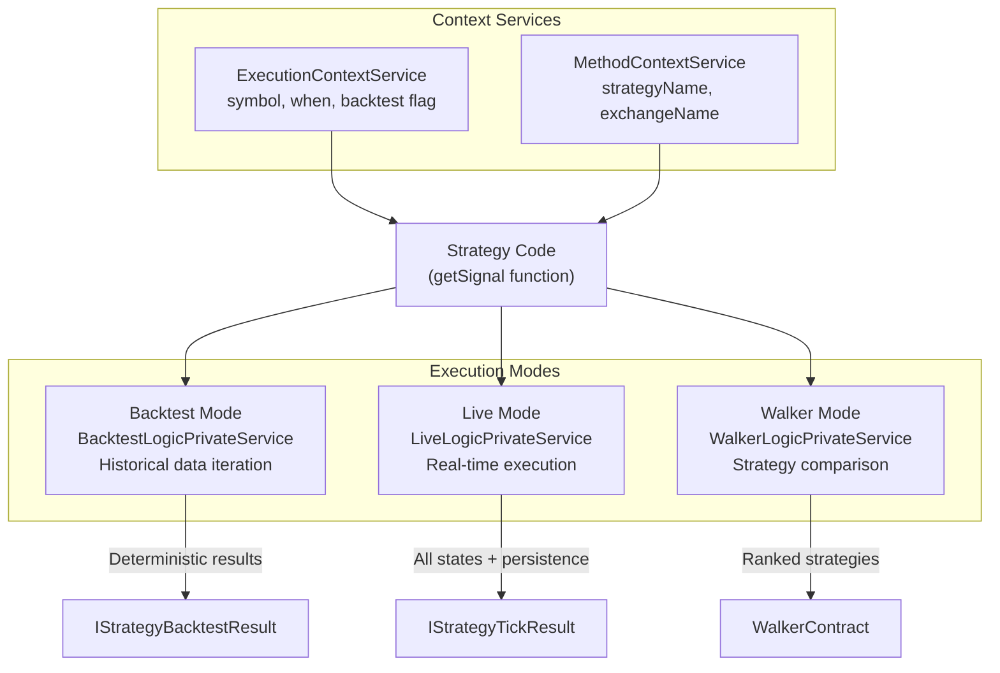

**Sources:** [README.md:17-18](), [docs/internals.md:54-81](), [High-Level System Architecture Diagram 2]()

**Backtest Mode** processes historical data deterministically using async generators. It fast-forwards through active signals for performance optimization, yielding only closed/cancelled results.

**Live Mode** operates in real-time with crash recovery, polling at 1-minute intervals (`TICK_TTL`). It persists state atomically to disk after every signal change.

**Walker Mode** orchestrates sequential backtests for multiple strategies, enabling A/B testing and metric-based ranking.

Implementation:
- [src/services/logic/BacktestLogicPrivateService.ts]()
- [src/services/logic/LiveLogicPrivateService.ts]()
- [src/services/logic/WalkerLogicPrivateService.ts]()

### Async Generator Streaming

All execution modes use async generators (`async function*`) to stream results without memory accumulation:

| Mode | Generator Type | Memory Profile |
|------|---------------|----------------|
| Backtest | `AsyncGenerator<IStrategyBacktestResult>` | O(1) per timeframe |
| Live | `AsyncGenerator<IStrategyTickResult>` | O(1) per tick |
| Walker | `AsyncGenerator<WalkerContract>` | O(n) where n = strategies |

This architecture enables processing years of historical data without loading everything into memory, and allows early termination via `break` statements in consumer code.

**Sources:** [README.md:23-24](), [docs/internals.md:22](), [docs/internals.md:92-98]()

### Graceful Shutdown

All execution modes support programmatic stopping with graceful cleanup:

```typescript
// Stop methods wait for active signals to complete
await Backtest.stop("BTCUSDT", "strategy-name");
await Live.stop("BTCUSDT", "strategy-name");
await Walker.stop("BTCUSDT", "walker-name");
```

**Shutdown behavior:**
- Current signal completes execution (callbacks fire normally)
- No new signals generated after stop
- Completion events (`listenDoneBacktest`, `listenDoneLive`) fire when complete
- Persisted state remains intact for resume on restart

**Sources:** [README.md:230](), [README.md:372-376](), [README.md:416-420](), [README.md:470-475]()

---

## Data Integrity & Persistence

### Crash-Safe State Persistence

Live trading mode uses atomic file writes with automatic recovery to ensure no duplicate signals or lost state after process crashes:

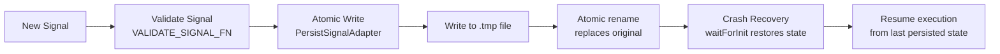

**Sources:** [README.md:19](), [README.md:426](), [docs/internals.md:25]()

The persistence layer uses a base class (`PersistBase`) that can be extended for custom backends:

| Default | Custom Options |
|---------|----------------|
| File-based atomic writes | Redis (high-performance distributed) |
| JSON serialization | MongoDB (complex queries, analytics) |
| `./logs/data/` directory | PostgreSQL (relational, ACID) |
| No external dependencies | Any storage implementing `PersistBase` interface |

Implementation details:
- [src/base/Persist.base.ts]() - Base class for persistence operations
- [src/adapters/PersistSignalAdapter.ts]() - Signal state persistence
- [src/adapters/PersistRiskAdapter.ts]() - Risk management persistence
- [src/adapters/PersistScheduleAdapter.ts]() - Scheduled signal persistence

**Sources:** [README.md:47](), [README.md:771-906]()

### Pluggable Persistence Adapters

The framework allows replacing default file-based persistence with custom backends:

```typescript
// Register custom adapter BEFORE running strategies
PersistSignalAdapter.usePersistSignalAdapter(RedisPersist);
PersistRiskAdapter.usePersistRiskAdapter(RedisPersist);
```

Custom adapters must implement the `PersistBase` interface:

| Method | Purpose |
|--------|---------|
| `waitForInit(initial: boolean)` | Initialize connection/storage |
| `readValue<T>(entityId)` | Read entity by ID |
| `hasValue(entityId)` | Check entity existence |
| `writeValue<T>(entityId, entity)` | Write/update entity |
| `removeValue(entityId)` | Delete entity |
| `removeAll()` | Clear all entities |
| `values<T>()` | Async iterator over all values |
| `keys()` | Async iterator over all IDs |

**Sources:** [README.md:771-1058]()

### Comprehensive Signal Validation

Signals are validated before execution to prevent invalid trades:

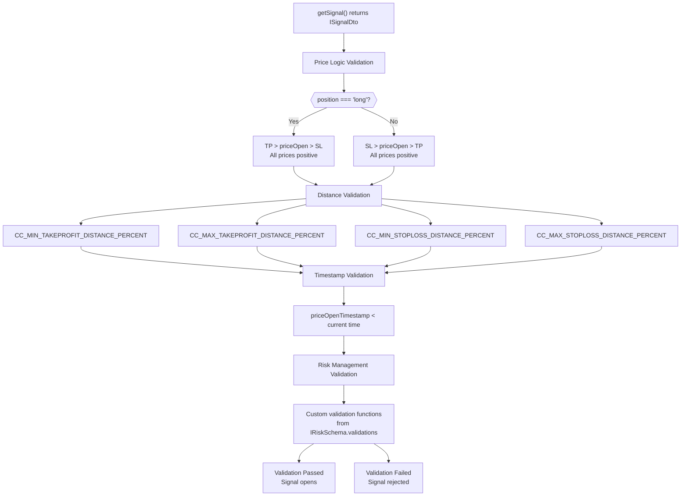

**Sources:** [README.md:21-22](), [README.md:236](), [docs/internals.md:19](), [test/e2e/defend.test.mjs:545-642]()

Validation implementation in [src/client/Strategy.client.ts]() uses the `VALIDATE_SIGNAL_FN` constant with configurable parameters from `GLOBAL_CONFIG`.

---

## Signal Lifecycle Management

### Type-Safe State Machine

The signal lifecycle is implemented as a discriminated union with compile-time type safety:

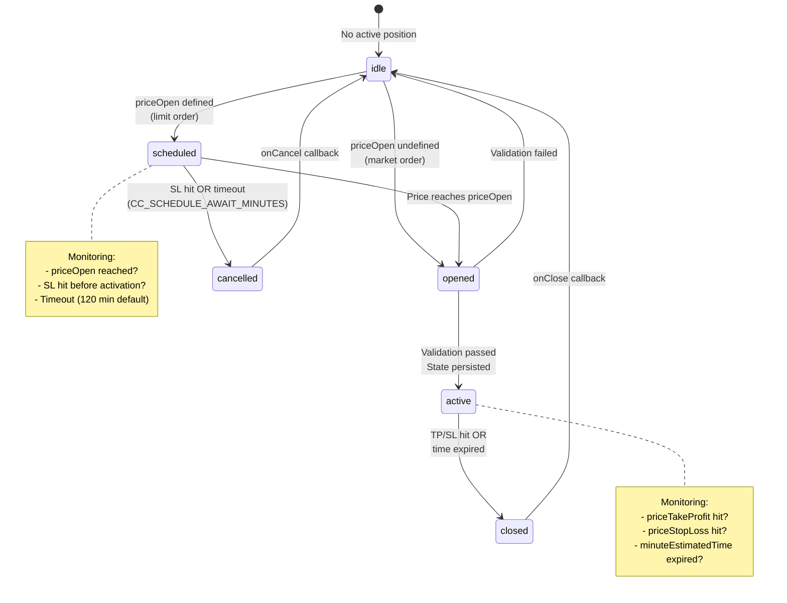

**Sources:** [README.md:27](), [Signal Lifecycle State Machine Diagram](), [docs/internals.md:16]()

TypeScript discriminated union types ensure type safety at compile time:

```typescript
type IStrategyTickResult = 
  | IStrategyTickResultIdle
  | IStrategyTickResultScheduled
  | IStrategyTickResultOpened
  | IStrategyTickResultActive
  | IStrategyTickResultClosed
  | IStrategyTickResultCancelled;
```

Each variant has a unique `action` field used for type narrowing in consumer code.

Implementation: [src/interfaces/StrategyTickResult.interface.ts]()

**Sources:** [docs/types/IStrategyTickResult.md]()

### Interval Throttling

Strategies define a minimum interval between `getSignal()` calls to prevent signal spam:

| Interval | Minutes | Use Case |
|----------|---------|----------|
| `"1m"` | 1 | High-frequency scalping |
| `"3m"` | 3 | Short-term signals |
| `"5m"` | 5 | Standard intraday |
| `"15m"` | 15 | Medium-term swing |
| `"30m"` | 30 | Position trading |
| `"1h"` | 60 | Long-term strategies |

The throttling is enforced by comparing the last signal timestamp with the configured interval. Implementation in [src/client/Strategy.client.ts]().

**Sources:** [README.md:20](), [docs/internals.md:20](), [docs/interfaces/IStrategySchema.md:29-35]()

### Scheduled Signal Activation

Signals with `priceOpen` defined become scheduled (limit orders) waiting for price activation:

**Scheduled signal behavior:**
- Monitors market price every tick/candle
- Activates when price reaches `priceOpen`
- Cancels if `priceStopLoss` hit before activation
- Cancels after timeout (`CC_SCHEDULE_AWAIT_MINUTES`, default 120 minutes)

**Edge case handling:**
- If price passes through both `priceOpen` and `priceStopLoss` on same candle, activation takes priority (signal opens then immediately closes by SL)
- Backtest mode checks candle high/low for intra-candle price movements
- Live mode uses VWAP at configured intervals

**Sources:** [test/e2e/defend.test.mjs:16-146](), [test/e2e/defend.test.mjs:148-278](), [test/e2e/scheduled.test.mjs]()

---

## Performance & Memory Optimization

### VWAP Pricing Model

All entry/exit decisions use Volume-Weighted Average Price from the last 5 one-minute candles for realistic simulation:

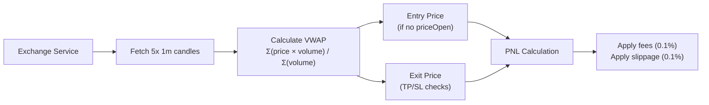

**Sources:** [README.md:25](), [docs/internals.md:18]()

The VWAP calculation ensures backtest results match live execution behavior. Configured via:
- `CC_AVERAGE_PRICE_CANDLE_COUNT` - Number of candles (default: 5)
- `CC_AVERAGE_PRICE_CANDLE_INTERVAL` - Candle interval (default: "1m")

Implementation: [src/helpers/getAveragePrice.ts]()

### Memory-Efficient Streaming

The async generator architecture processes data without accumulation:

| Operation | Memory Usage | Scaling |
|-----------|--------------|---------|
| Backtest 1 year of 1m data | O(1) | Constant per timeframe |
| Live trading 24/7 | O(1) | Constant per tick |
| Walker with 100 strategies | O(n) | Linear in strategy count |
| Heatmap across 50 symbols | O(n) | Linear in symbol count |

**Backtest fast-forward optimization:**
When a signal opens, the backtest skips ahead to the estimated close time rather than processing every timeframe. This reduces execution time by ~10-100x for strategies with long signal durations.

**Sources:** [docs/internals.md:92-98]()

### Memoized Service Instances

The dependency injection system memoizes service instances by configuration key:

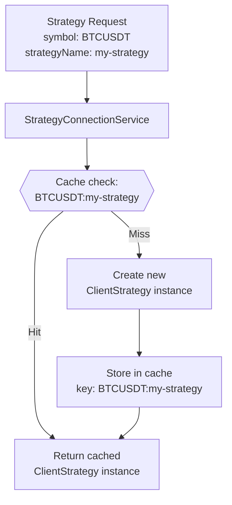

**Sources:** [docs/internals.md:46](), [Service Architecture & Dependency Injection Diagram]()

This ensures one instance per unique combination of:
- Symbol + Strategy name
- Symbol + Exchange name
- Symbol + Frame name

Implementation: [src/services/connection/]()

### Bounded Event Queue

The `LiveMarkdownService` uses a bounded queue (`MAX_EVENTS = 25`) to prevent memory leaks during long-running live sessions:

**Queue behavior:**
- Stores last 25 events maximum
- Drops oldest events when full
- Preserves recent history for reporting
- Prevents unbounded growth

**Sources:** [docs/internals.md:101]()

---

## Analytics & Reporting

### Comprehensive Statistics

The framework calculates extensive performance metrics for backtests and live trading:

| Metric | Formula | Interpretation |
|--------|---------|----------------|
| **Win Rate** | `(wins / total) × 100` | Percentage of profitable trades |
| **Average PNL** | `Σ(pnl) / count` | Expected return per trade |
| **Total PNL** | `Σ(pnl)` | Cumulative return |
| **Standard Deviation** | `√(Σ(pnl - avg)² / (n-1))` | Volatility measure |
| **Sharpe Ratio** | `avgPnl / stdDev` | Risk-adjusted return |
| **Annualized Sharpe** | `sharpe × √365` | Yearly risk-adjusted return |
| **Certainty Ratio** | `avgWin / |avgLoss|` | Win/loss magnitude ratio |
| **Expected Yearly Returns** | Based on avg duration & PNL | Projected annual performance |

**Safe math:** All calculations return `null` for invalid results (NaN, Infinity) rather than propagating unsafe values.

**Sources:** [README.md:33](), [README.md:49](), [docs/interfaces/BacktestStatistics.md](), [docs/interfaces/LiveStatistics.md]()

Implementation: [src/services/markdown/]()

### Auto-Generated Markdown Reports

Nine types of markdown reports are automatically generated:

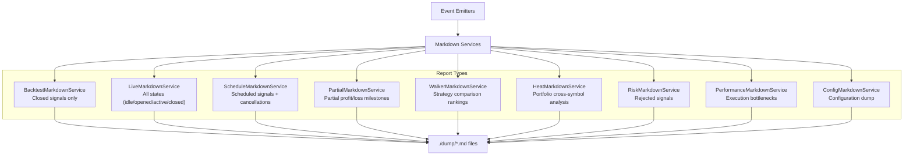

**Sources:** [Event System & Reporting Architecture Diagram](), [docs/internals.md:37]()

Reports include:
- Summary statistics tables
- Detailed signal logs
- Trade-by-trade breakdown
- Performance metrics
- Configuration snapshots

Access via:
- `Backtest.dump(strategyName)` - [README.md:188]()
- `Live.dump(strategyName)` - [README.md:413]()
- `Walker.dump(symbol, walkerName)` - [README.md:467]()
- `Heat.dump(strategyName)` - [README.md:559]()

### Portfolio Heatmap Analytics

Multi-symbol performance analysis with extended metrics:

```typescript
interface IHeatmapRow {
  symbol: string;
  totalPnl: number | null;
  sharpeRatio: number | null;
  profitFactor: number | null;    // wins / losses ratio
  expectancy: number | null;       // (winRate × avgWin) - (lossRate × avgLoss)
  winRate: number | null;
  avgWin: number | null;
  avgLoss: number | null;
  maxDrawdown: number | null;
  maxWinStreak: number;           // consecutive wins
  maxLossStreak: number;          // consecutive losses
  totalTrades: number;
}
```

**Sorting:** Symbols sorted by Sharpe Ratio descending (best performers first)

**Portfolio metrics:** Aggregated statistics across all symbols

**Sources:** [README.md:39](), [README.md:507-588](), [src/interfaces/Heatmap.interface.ts]()

### Partial Profit/Loss Tracking

The framework tracks milestone events as price moves toward TP or SL:

| Milestone Type | Thresholds |
|----------------|------------|
| **Partial Profit** | 10%, 20%, 30%, 40%, 50%, 60%, 70%, 80%, 90% toward TP |
| **Partial Loss** | -40%, -80% toward SL |

These events fire callbacks and emit to listeners, enabling:
- Risk management alerts
- Position adjustment
- Performance analysis
- Real-time monitoring

**Sources:** [README.md:258](), [docs/interfaces/IStrategyCallbacks.md:77-91]()

### Performance Profiling

Built-in execution time tracking with aggregated statistics:

| Statistic | Description |
|-----------|-------------|
| **Average** | Mean execution time |
| **Minimum** | Fastest execution |
| **Maximum** | Slowest execution |
| **StdDev** | Execution time variance |
| **P95** | 95th percentile |
| **P99** | 99th percentile |

Helps identify bottlenecks in:
- Exchange API calls
- Signal generation logic
- Validation functions
- Persistence operations

**Sources:** [README.md:35]()

---

## Risk & Position Management

### Portfolio-Level Risk Controls

The risk management system coordinates across strategies and symbols:

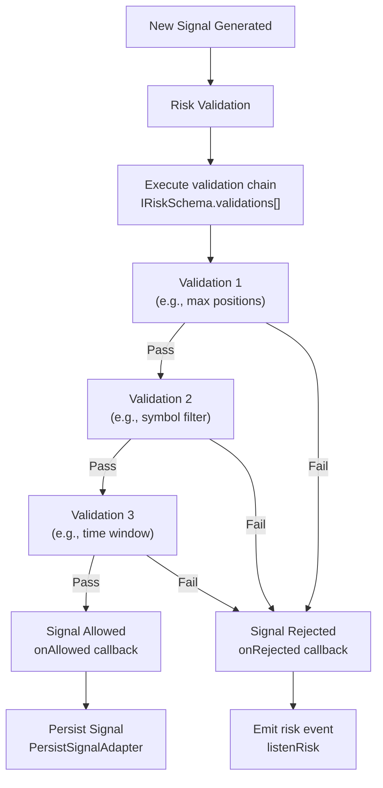

**Sources:** [README.md:43](), [README.md:674-768]()

**Validation context provided to each function:**

| Field | Type | Description |
|-------|------|-------------|
| `symbol` | string | Trading pair |
| `strategyName` | string | Strategy identifier |
| `exchangeName` | string | Exchange identifier |
| `currentPrice` | number | Current market price |
| `timestamp` | number | Current timestamp |
| `activePositionCount` | number | Total open positions |
| `activePositions` | IActivePosition[] | Array of all active positions |

**Fail-fast pattern:** Validations execute sequentially; first failure stops execution and rejects signal.

Implementation: [src/client/Risk.client.ts]()

**Sources:** [test/e2e/risk.test.mjs:615-688]()

### Position Sizing Calculator

Three position sizing methods with configurable constraints:

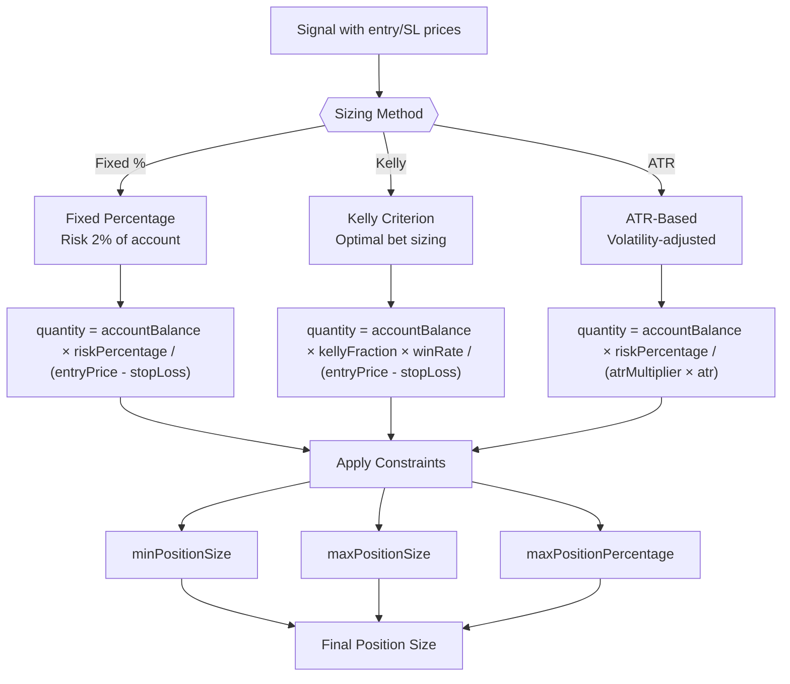

**Sources:** [README.md:41](), [README.md:589-673]()

**When to use each method:**

1. **Fixed Percentage** - Simple, consistent risk per trade. Best for beginners and conservative strategies.

2. **Kelly Criterion** - Optimal sizing based on edge (win rate × win/loss ratio). Best for strategies with proven statistical advantage. Use fractional Kelly (0.25-0.5) to reduce volatility.

3. **ATR-Based** - Volatility-adjusted sizing. Position size scales inversely with market volatility. Best for swing trading and volatile markets.

Implementation: [src/utils/PositionSize.utils.ts]()

### Active Position Tracking

Risk profiles can inspect all active positions for cross-strategy coordination:

```typescript
addRisk({
  riskName: "coordinator",
  validations: [
    ({ activePositions, strategyName, symbol }) => {
      // Count positions for specific strategy
      const strategyPositions = activePositions.filter(
        pos => pos.strategyName === strategyName
      );
      
      // Check for symbol conflicts
      const symbolPositions = activePositions.filter(
        pos => pos.symbol === symbol
      );
      
      // Custom validation logic
      if (strategyPositions.length >= 2) {
        throw new Error("Max 2 positions per strategy");
      }
    }
  ]
});
```

**Sources:** [README.md:733-757](), [test/e2e/risk.test.mjs:319-385]()

---

## Extensibility & Integration

### Pluggable Exchange Integration

Exchange adapters provide market data without requiring pre-downloaded datasets:

| Method | Purpose | Return Type |
|--------|---------|-------------|
| `getCandles()` | Fetch OHLCV data | `Promise<ICandle[]>` |
| `formatPrice()` | Format price for exchange | `Promise<string>` |
| `formatQuantity()` | Format quantity for exchange | `Promise<string>` |

**Zero data download:** Unlike Freqtrade and similar frameworks, backtest-kit doesn't require downloading gigabytes of historical data. You can plug any data source: CCXT for live data, databases for fast backtesting, or custom APIs.

**Sources:** [README.md:45](), [README.md:274-313]()

Example integrations:
- CCXT for real-time exchange data
- PostgreSQL for pre-loaded historical data
- Custom REST APIs
- CSV file readers
- Mock data generators for testing

Implementation: [src/client/Exchange.client.ts]()

### Dependency Inversion & Lazy Loading

Components are registered by name and lazily instantiated at runtime:

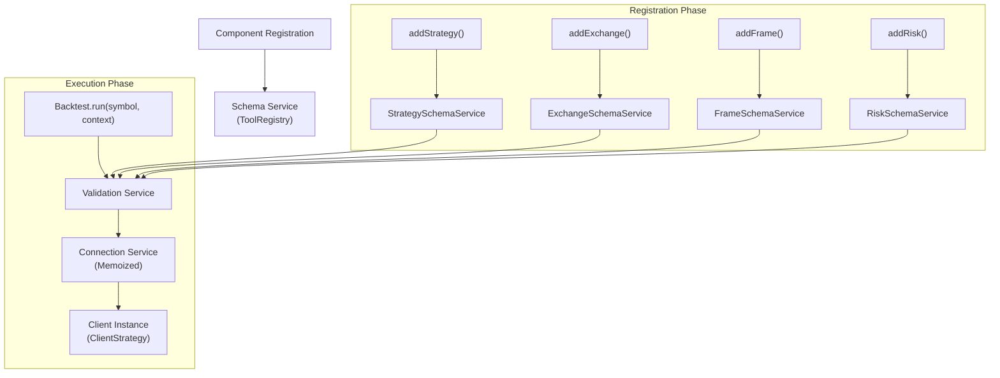

**Sources:** [README.md:191-222](), [README.md:234](), [docs/internals.md:32-36]()

**Benefits:**
- Modular design: Components in separate modules
- String-based coupling: Type-safe enums for names
- Runtime flexibility: Register/unregister dynamically
- Testability: Mock components easily
- Memory efficiency: Only instantiate what's used

**Schema reflection:** Use `listExchanges()`, `listStrategies()`, `listFrames()` for runtime introspection.

**Sources:** [README.md:235](), [test/spec/list.test.mjs]()

### Context Propagation

Async context propagation eliminates need for explicit parameter passing:

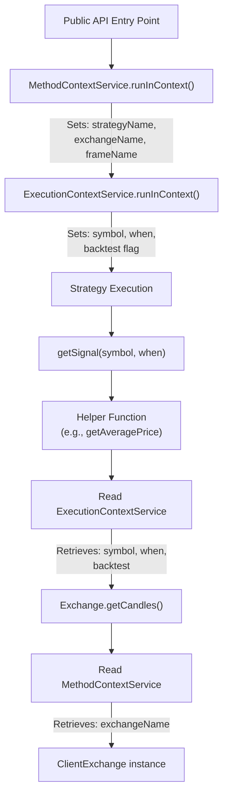

**Sources:** [README.md:31](), [docs/internals.md:47-50]()

This "time-travel context" enables the same strategy code to:
- Run in backtest with historical `when` timestamp
- Run in live with `new Date()` timestamp
- Access correct exchange/frame without explicit passing

Implementation:
- [src/services/context/ExecutionContextService.ts]()
- [src/services/context/MethodContextService.ts]()

Based on `di-scoped` package with async_hooks-style scoping.

---

## Testing & Reliability

### Comprehensive Test Suite

The framework includes extensive test coverage across multiple dimensions:

| Test Category | File | Coverage |
|---------------|------|----------|
| **Exchange Functions** | [test/spec/exchange.test.mjs]() | VWAP calculation, candle fetching, price formatting |
| **Event System** | [test/spec/event.test.mjs]() | Listener coordination, async event handling |
| **Signal Validation** | [test/spec/validation.test.mjs]() | Price logic, timestamp validation, position validation |
| **PNL Calculation** | [test/spec/pnl.test.mjs]() | Fees, slippage, realistic simulations |
| **Backtest Mode** | [test/spec/backtest.test.mjs]() | Lifecycle, early termination, close reasons |
| **Callbacks** | [test/spec/callbacks.test.mjs]() | Parameter passing, backtest flag verification |
| **Reports** | [test/spec/report.test.mjs]() | Statistics, markdown formatting |
| **Live Mode** | [test/spec/live.test.mjs]() | Real-time execution, crash recovery |
| **Scheduled Signals** | [test/spec/scheduled.test.mjs]() | Activation, cancellation, timeout |
| **Risk Management** | [test/spec/risk.test.mjs]() | Validation chain, position tracking |
| **Position Sizing** | [test/spec/sizing.test.mjs]() | Fixed %, Kelly, ATR methods |
| **Walker Mode** | [test/spec/walker.test.mjs]() | Strategy comparison, ranking |
| **Heatmap** | [test/spec/heat.test.mjs]() | Portfolio metrics, cross-symbol analysis |
| **Performance** | [test/spec/performance.test.mjs]() | Execution timing, bottleneck detection |
| **Optimizer** | [test/spec/optimizer.test.mjs]() | AI strategy generation, LLM integration |

**Sources:** [README.md:53](), [docs/internals.md:114-130](), [test/index.mjs]()

### Edge Case Defense Tests

Critical defensive tests ensure correct behavior in complex scenarios:

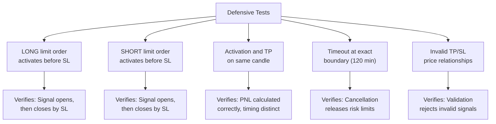

**Sources:** [test/e2e/defend.test.mjs:16-146](), [test/e2e/defend.test.mjs:148-278](), [test/e2e/defend.test.mjs:281-439](), [test/e2e/defend.test.mjs:446-537](), [test/e2e/defend.test.mjs:545-642]()

These tests prove that the framework handles edge cases correctly and prevents financial loss from logic bugs.

### Safe Math & Robustness

All statistical calculations are protected against unsafe numeric values:

**Unsafe value detection:**
- `NaN` (invalid calculations)
- `Infinity` / `-Infinity` (division by zero)
- Invalid inputs (negative counts, empty arrays)

**Handling:** Return `null` instead of propagating unsafe values through calculations.

**Benefits:**
- Reports show "N/A" for invalid metrics instead of crashing
- Partial data still useful (e.g., total PNL valid even if Sharpe ratio invalid)
- No silent errors from mathematical edge cases

**Sources:** [README.md:49]()

Implementation in statistics calculation functions: [src/services/markdown/]()

---

## AI-Powered Features

### Strategy Optimizer

LLM-powered strategy generation from historical data:

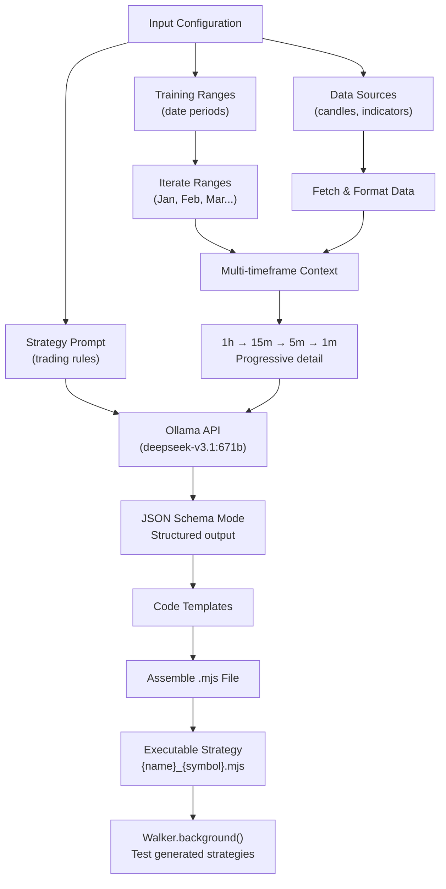

**Sources:** [README.md:51](), [AI-Driven Strategy Generation Diagram]()

**Optimizer workflow:**
1. Configure training date ranges and data sources
2. Iterate through ranges, fetching multi-timeframe data
3. Format data as conversation history for LLM
4. Generate strategy logic using JSON schema constraints
5. Assemble complete executable code from templates
6. Test via Walker for automatic comparison

**Output structure:**
- Imports and helper functions
- Exchange configuration
- Frame definitions
- Generated strategy logic
- Walker configuration for testing

**Debug artifacts:** JSON conversation history saved to `./dump/strategy/` for analysis.

Implementation: [src/client/Optimizer.client.ts](), [src/services/template/OptimizerTemplateService.ts]()

---

## Summary Table

| Feature | Key Component | Wiki Reference |
|---------|---------------|----------------|
| Multi-mode execution | BacktestLogicPrivateService, LiveLogicPrivateService, WalkerLogicPrivateService | [Execution Modes](#2.1) |
| Crash-safe persistence | PersistSignalAdapter, PersistBase | [Signal Persistence](#8.4) |
| Signal validation | VALIDATE_SIGNAL_FN, Risk validation chain | [Signal Generation and Validation](#8.2) |
| State machine | IStrategyTickResult discriminated union | [Signal States](#8.1) |
| VWAP pricing | getAveragePrice(), CC_AVERAGE_PRICE_* config | [Backtesting](#9) |
| Interval throttling | Strategy.interval, last signal timestamp check | [Signal Lifecycle Overview](#2.2) |
| PNL calculation | calculatePnl(), CC_TRADE_FEE, CC_SLIPPAGE | [PnL Calculation](#8.5) |
| Context propagation | ExecutionContextService, MethodContextService | [Context Propagation](#3.3) |
| Markdown reports | BacktestMarkdownService, LiveMarkdownService, etc. | [Markdown Report Generation](#13.1) |
| Performance profiling | PerformanceMarkdownService, PerformanceEmitter | [Performance Metrics](#13.2) |
| Strategy comparison | WalkerLogicPrivateService | [Walker Mode](#11) |
| Portfolio heatmap | HeatMarkdownService | [Heatmap Analytics](#13.5) |
| Position sizing | PositionSize utils (fixed/kelly/atr) | [Component Types](#5) |
| Risk management | ClientRisk, IRiskSchema validations | [Risk Management](#12) |
| Pluggable exchanges | ClientExchange, IExchangeSchema | [Exchange Schemas](#5.2) |
| Pluggable persistence | PersistBase, custom adapters | [Custom Persistence Backends](#16.2) |
| AI optimizer | ClientOptimizer, Ollama integration | [AI-Powered Strategy Optimization](#16.5) |

**Sources:** [README.md:15-53](), [README.md:226-237](), [docs/internals.md:10-26]()