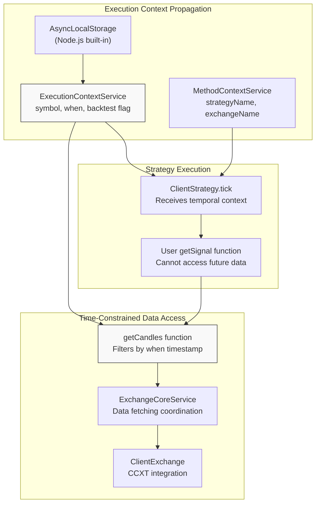
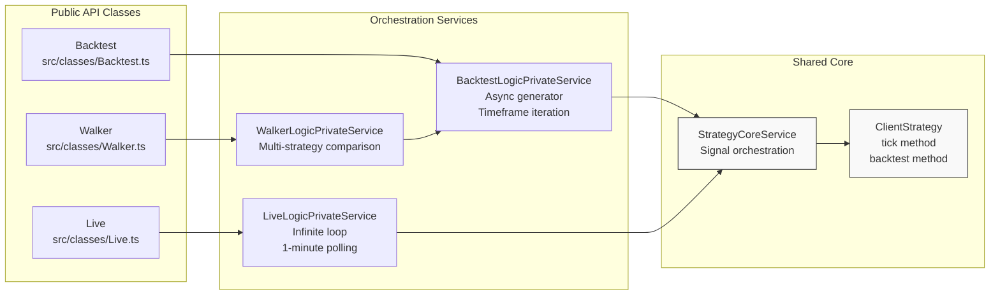
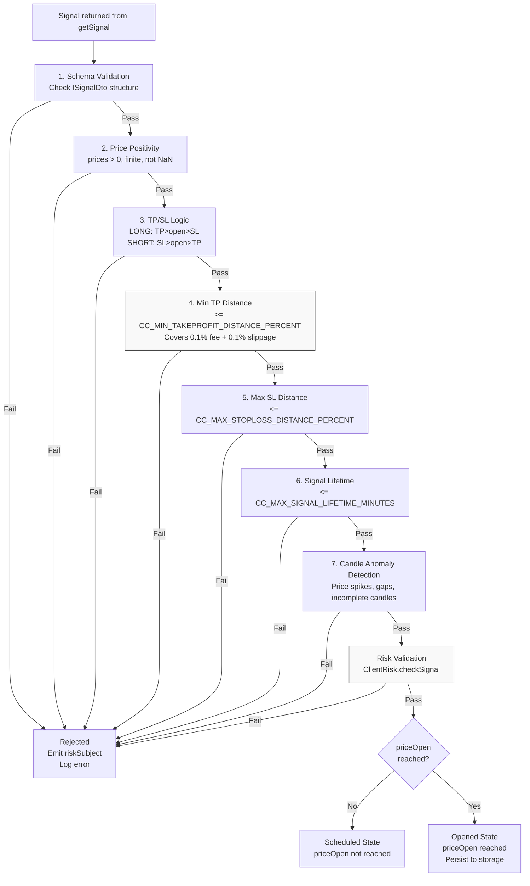
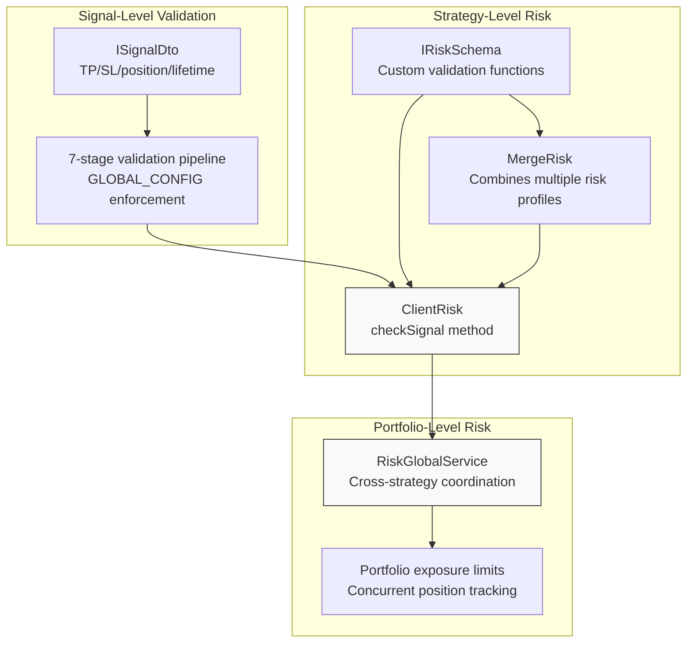
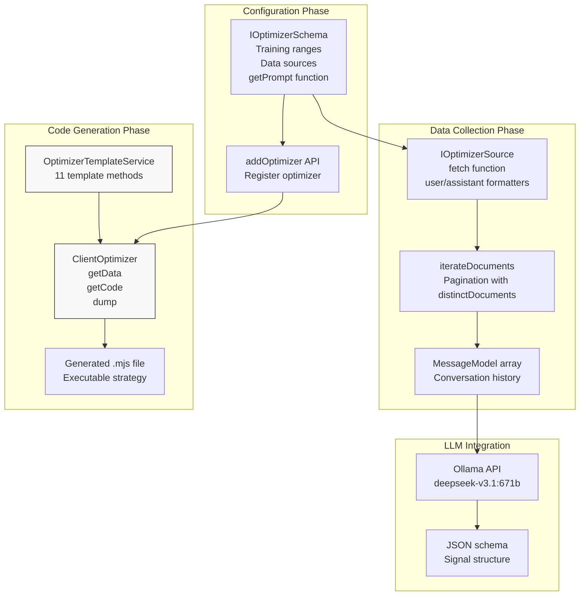
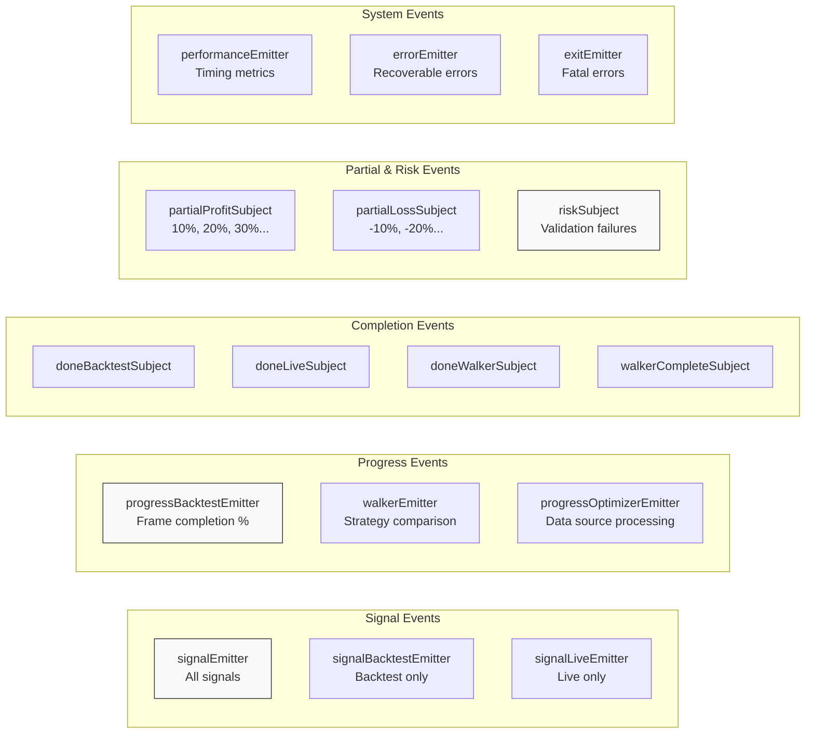

# Key Features

This page provides a comprehensive overview of Backtest Kit's capabilities and architectural features. Each feature is described with its purpose, implementation approach, and references to the underlying code entities. For detailed implementation guides, see Getting Started [(2)](./04_getting-started.md). For architectural deep dives, see Architecture Deep Dive [(4)](./14_architecture-deep-dive.md).

---

## Core Architectural Features

### Look-Ahead Bias Prevention

Backtest Kit architecturally eliminates look-ahead bias through its **time execution engine**. The system treats market data as an async stream of time, where each execution context carries temporal information that automatically constrains data access.

**Key Implementation:**

- `ExecutionContextService` `src/lib/services/context/ExecutionContextService.ts:1-100` propagates temporal context using Node.js `AsyncLocalStorage`
- `getCandles()` function `src/api/getCandles.ts:1-50` automatically filters data based on current execution timestamp
- All strategy callbacks receive data UP TO the current moment, never future data

**Technical Guarantee:** The `when` parameter in execution context ensures that `getCandles(symbol, interval, limit)` only returns candles with `timestamp <= when`. This makes look-ahead bias architecturally impossible without explicitly bypassing the context system.



**Diagram: Temporal Context Propagation for Look-Ahead Bias Prevention**


---

### Multi-Mode Execution

Three execution modes share identical signal logic while differing in orchestration:

| Mode | Class | Logic Service | Purpose | Iteration Pattern |
|------|-------|---------------|---------|-------------------|
| **Backtest** | `Backtest` | `BacktestLogicPrivateService` | Historical simulation | Finite generator over timeframes |
| **Live** | `Live` | `LiveLogicPrivateService` | Real-time trading | Infinite generator with sleep intervals |
| **Walker** | `Walker` | `WalkerLogicPrivateService` | Strategy comparison | Sequential backtest execution |

**Code Mapping:**



**Diagram: Three Execution Modes Sharing Core Strategy Logic**

**Mode-Specific Behaviors:**

- **Backtest**: Uses `BacktestLogicPrivateService.generate()` `src/lib/services/logic/private/BacktestLogicPrivateService.ts:50-150` to iterate through historical timeframes. Fast-forward optimization skips frames while signals are active.
- **Live**: Uses `LiveLogicPrivateService.generate()` `src/lib/services/logic/private/LiveLogicPrivateService.ts:50-150` with infinite `while(true)` loop. Polls every `TICK_TTL` (61000ms). Persists signals for crash recovery.
- **Walker**: Uses `WalkerLogicPrivateService.generate()` `src/lib/services/logic/private/WalkerLogicPrivateService.ts:50-150` to run multiple backtests sequentially, collect statistics from `BacktestMarkdownService`, and compare using configurable metrics.


---

## Validation & Safety Features

### Signal Validation Pipeline

Every signal passes through seven validation stages before activation, enforced by `GLOBAL_CONFIG` parameters:



**Diagram: Seven-Stage Signal Validation Pipeline**

**Validation Implementation:**

- Stages 1-7: `ClientStrategy.prototype.tick` `src/client/ClientStrategy.ts:200-400` performs inline checks
- Stage 4 (TP Distance): `CC_MIN_TAKEPROFIT_DISTANCE_PERCENT` default 0.21% ensures profits cover 0.1% fee + 0.1% slippage + margin `src/config/params.ts:20-30`
- Stage 7 (Anomalies): `ExchangeCoreService.prototype.getValidatedCandles` `src/lib/services/core/ExchangeCoreService.ts:50-150` checks for median price deviations
- Risk Check: `ClientRisk.prototype.checkSignal` `src/client/ClientRisk.ts:100-200` executes custom validation functions

**Configuration Parameters:**

| Parameter | Default | Purpose |
|-----------|---------|---------|
| `CC_MIN_TAKEPROFIT_DISTANCE_PERCENT` | 0.21% | Minimum profit to cover fees/slippage |
| `CC_MAX_STOPLOSS_DISTANCE_PERCENT` | 15% | Maximum risk per trade |
| `CC_MAX_SIGNAL_LIFETIME_MINUTES` | 720 | Maximum signal duration (12 hours) |
| `CC_PERCENT_FEE` | 0.1% | Trading fee percentage |
| `CC_PERCENT_SLIPPAGE` | 0.1% | Expected slippage |


---

### Crash-Safe Persistence

Live mode implements atomic persistence to prevent signal loss or duplication during system crashes:

**Architecture:**

1. **Selective Persistence**: Only `opened` signals are persisted. Scheduled signals remain ephemeral.
2. **Atomic Writes**: `PersistSignalAdapter` `src/lib/services/persist/PersistSignalAdapter.ts:1-150` uses atomic file operations
3. **Recovery on Startup**: `LiveLogicPrivateService` `src/lib/services/logic/private/LiveLogicPrivateService.ts:50-100` loads persisted signals via `waitForInit()`
4. **Cleanup on Close**: Signals deleted from storage when closed (TP/SL/time expired)

**Implementation Classes:**

| Class | Role | File |
|-------|------|------|
| `PersistSignalAdapter` | File-based persistence implementation | `src/lib/services/persist/PersistSignalAdapter.ts` |
| `PersistBase` | Abstract persistence interface | `src/interfaces/Persist.interface.ts` |
| `ClientStrategy.persistSignal` | Save signal to storage | `src/client/ClientStrategy.ts:500-550` |
| `ClientStrategy.loadPersistedSignal` | Restore signal on startup | `src/client/ClientStrategy.ts:550-600` |

**Persistence Key Format:**

```
persist_{symbol}_{strategyName}_{exchangeName}.json
```

Example: `persist_BTCUSDT_myStrategy_binance.json`


---

### Risk Management

Risk management operates at three levels:



**Diagram: Three-Level Risk Management Architecture**

**Risk Schema Example:**

From `README.md:83-100`, a risk profile with 1% minimum TP and 2:1 R/R:

```typescript
addRisk({
  riskName: 'demo',
  validations: [
    // TP at least 1%
    ({ pendingSignal, currentPrice }) => {
      const tpDistance = calculateTPDistance(pendingSignal, currentPrice);
      if (tpDistance < 1) throw new Error(`TP too close: ${tpDistance.toFixed(2)}%`);
    },
    // R/R at least 2:1
    ({ pendingSignal, currentPrice }) => {
      const rr = calculateRiskReward(pendingSignal, currentPrice);
      if (rr < 2) throw new Error('Poor R/R ratio');
    }
  ]
});
```

**Implementation:**

- `ClientRisk.prototype.checkSignal` `src/client/ClientRisk.ts:100-150` executes validation array
- `MergeRisk` `src/client/MergeRisk.ts:1-100` combines multiple risk profiles using logical AND
- `RiskGlobalService` `src/lib/services/global/RiskGlobalService.ts` maintains portfolio-wide state


---

## Integration & Extensibility

### LLM-Powered Strategy Generation

The Optimizer system generates executable strategy code using LLM (Large Language Model) integration:



**Diagram: LLM-Powered Strategy Generation Workflow**

**Template Methods:**

`OptimizerTemplateService` `src/lib/services/template/OptimizerTemplateService.ts:27-650` provides 11 code generation methods:

| Method | Purpose | Returns |
|--------|---------|---------|
| `getTopBanner` | Imports and initialization | Shebang, imports, constants |
| `getUserMessage` | LLM user prompt | Data formatted for LLM |
| `getAssistantMessage` | LLM assistant response | Acknowledgment message |
| `getWalkerTemplate` | Walker configuration | `addWalker()` call |
| `getStrategyTemplate` | Strategy with LLM logic | `addStrategy()` with `getSignal()` |
| `getExchangeTemplate` | CCXT integration | `addExchange()` call |
| `getFrameTemplate` | Timeframe definition | `addFrame()` call |
| `getLauncherTemplate` | Execution and listeners | `Walker.background()` + listeners |
| `getTextTemplate` | Text generation helper | `async text()` function |
| `getJsonTemplate` | JSON generation helper | `async json()` function |
| `getJsonDumpTemplate` | Debug output helper | `async dumpJson()` function |

**Generated Code Structure:**

From `src/lib/services/template/OptimizerTemplateService.ts:225-350`, the generated file contains:

1. Imports (Ollama, CCXT, backtest-kit)
2. Helper functions (`text()`, `json()`, `dumpJson()`)
3. Exchange configuration
4. Training frames (one per training range)
5. Test frame (for validation)
6. Strategies (one per training range × data source)
7. Walker configuration
8. Launcher with event listeners

**Example Integration:**

From `README.md:111-143`, using Optimizer in a strategy:

```typescript
addStrategy({
  strategyName: 'llm-strategy',
  interval: '5m',
  getSignal: async (symbol) => {
    const candles1h = await getCandles(symbol, "1h", 24);
    const messages = await getMessages(symbol, { candles1h });
    const signal = await json(messages);  // LLM generates signal
    await dumpSignal(uuid(), messages, signal);
    return { ...signal, id: uuid() };
  }
});
```


---

### Pluggable Data Sources

Backtest Kit supports custom data sources through the `IExchangeSchema` interface:

**Required Methods:**

| Method | Signature | Purpose |
|--------|-----------|---------|
| `getCandles` | `(symbol, interval, since, limit) => ICandleData[]` | Fetch OHLCV candles |
| `formatPrice` | `(symbol, price) => string` | Format price for display |
| `formatQuantity` | `(symbol, quantity) => string` | Format quantity for display |
| `getAveragePrice` | `(symbol, interval) => number` (optional) | Get VWAP or last price |

**CCXT Integration Example:**

From `README.md:70-80`:

```typescript
addExchange({
  exchangeName: 'binance',
  getCandles: async (symbol, interval, since, limit) => {
    const exchange = new ccxt.binance();
    const ohlcv = await exchange.fetchOHLCV(symbol, interval, since.getTime(), limit);
    return ohlcv.map(([timestamp, open, high, low, close, volume]) => 
      ({ timestamp, open, high, low, close, volume }));
  },
  formatPrice: (symbol, price) => price.toFixed(2),
  formatQuantity: (symbol, quantity) => quantity.toFixed(8)
});
```

**Implementation:**

- `ClientExchange` `src/client/ClientExchange.ts:1-300` wraps exchange schema
- `ExchangeCoreService` `src/lib/services/core/ExchangeCoreService.ts:1-200` coordinates data fetching
- `ExchangeConnectionService` `src/lib/services/connection/ExchangeConnectionService.ts:1-100` caches exchange instances

**Candle Validation:**

`ExchangeCoreService.prototype.getValidatedCandles` `src/lib/services/core/ExchangeCoreService.ts:50-150` performs:

1. Anomaly detection (price spikes beyond median)
2. Incomplete candle filtering (volume = 0 or prices missing)
3. Retry logic with exponential backoff


---

### Event-Driven Monitoring

The framework provides 13 event emitters for real-time monitoring:



**Diagram: 13 Event Emitters for Monitoring**

**Event Categories:**

1. **Signal Events**: Three-tier emission (global, mode-specific) enables selective subscription
2. **Progress Events**: Real-time progress tracking for long-running operations
3. **Completion Events**: Mode-specific completion signals for cleanup/reporting
4. **Partial Events**: Unrealized P&L milestones (10%, 20%, 30%...)
5. **Risk Events**: Signal rejection tracking
6. **System Events**: Performance metrics and error handling

**Public API Listeners:**

From `README.md:175-176`, listeners use `functools-kit` `queued` wrapper for sequential execution:

| Function | Event | Purpose |
|----------|-------|---------|
| `listenSignalBacktest` | `signalBacktestEmitter` | Backtest signal events |
| `listenSignalLive` | `signalLiveEmitter` | Live signal events |
| `listenDoneBacktest` | `doneBacktestSubject` | Backtest completion |
| `listenDoneLive` | `doneLiveSubject` | Live completion |
| `listenWalkerProgress` | `walkerEmitter` | Walker progress updates |
| `listenWalkerComplete` | `walkerCompleteSubject` | Walker final results |
| `listenPartialProfit` | `partialProfitSubject` | Profit milestones |
| `listenPartialLoss` | `partialLossSubject` | Loss milestones |
| `listenRisk` | `riskSubject` | Risk validation failures |
| `listenPerformance` | `performanceEmitter` | Execution timing |
| `listenError` | `errorEmitter` | Non-fatal errors |
| `listenExit` | `exitEmitter` | Fatal errors |

**Markdown Services Integration:**

Markdown services `src/lib/services/markdown/` subscribe to emitters and accumulate events in `ReportStorage` (max 250 per key) for report generation.


---

## Performance & Production Features

### Streaming Architecture

Backtest Kit uses async generators for memory-efficient streaming:

**Generator Patterns:**

| Mode | Generator Type | Memory Behavior | Early Termination |
|------|----------------|-----------------|-------------------|
| Backtest | Finite | O(1) per frame | `break` or return from loop |
| Live | Infinite | O(1) per tick | Set stop flag, wait for cleanup |
| Walker | Finite | O(strategies) | `break` or return from loop |

**Implementation:**

From `src/lib/services/logic/private/BacktestLogicPrivateService.ts:50-150`, backtest uses:

```typescript
public async *generate(symbol: string, context: IBacktestContext) {
  for (const frame of frames) {
    const result = await this.strategyCoreService.tick(symbol, frame.when, true);
    yield result;
  }
  yield { type: 'done', data: allClosedSignals };
}
```

**Event-Driven vs. Pull-Based:**

From `README.md:201-224`, two equivalent consumption models:

```typescript
// Pull-based (async iterator)
for await (const event of Backtest.run('BTCUSDT', config)) {
  // Process event
}

// Event-driven (background execution)
Backtest.background('BTCUSDT', config);
listenSignalBacktest(event => { /* handle */ });
```


---

### VWAP Pricing

Volume Weighted Average Price ensures realistic entry/exit pricing:

**Calculation:**

`ClientExchange.prototype.getVWAP` `src/client/ClientExchange.ts:150-200` computes:

```
VWAP = Σ(price × volume) / Σ(volume)
```

Using last `CC_AVG_PRICE_CANDLES_COUNT` (default: 5) 1-minute candles.

**Usage Points:**

1. **Signal Activation**: When `priceOpen` is reached, actual entry uses VWAP
2. **TP/SL Execution**: Exit prices calculated from current VWAP
3. **Scheduled Signals**: Check if `priceOpen` in [VWAP - tolerance, VWAP + tolerance]

**Configuration:**

| Parameter | Default | Purpose |
|-----------|---------|---------|
| `CC_AVG_PRICE_CANDLES_COUNT` | 5 | Number of 1m candles for VWAP |
| `CC_SCHEDULED_PRICE_TOLERANCE_PERCENT` | 0.1% | Tolerance for scheduled activation |


---

### Self-Hosted Deployment

**Zero Vendor Lock-In:**

- No cloud dependencies
- No third-party API requirements (except optional Ollama for LLM)
- All data processing runs locally
- Custom persistence backends supported

**Dependencies:**

From `package.json:74-79`:

```json
{
  "di-kit": "^1.0.18",           // Dependency injection
  "di-scoped": "^1.0.20",        // Scoped context management
  "functools-kit": "^1.0.94",    // Functional utilities (memoize, iterate)
  "get-moment-stamp": "^1.1.1"   // Timestamp utilities
}
```

**Peer Dependencies:**

- TypeScript 5.0+ (development only)
- Node.js 15+ (runtime)

**Optional Integrations:**

- CCXT (exchange data)
- Ollama (LLM strategies)
- Redis (custom persistence)

**Comparison to QuantConnect:**

From `README.md:226-236`:

| Feature | Backtest Kit | QuantConnect |
|---------|--------------|--------------|
| **Language** | TypeScript/JavaScript | C# |
| **Hosting** | Self-hosted | Cloud-based |
| **Data** | CCXT or custom | Proprietary |
| **Fees** | None | Subscription required |
| **Extensibility** | Full code access | Limited to API |


---

## Production Readiness

### Code Reusability

The `backtest` flag in `ExecutionContext` enables identical strategy code across modes:

```typescript
// Strategy code (same for backtest and live)
addStrategy({
  strategyName: 'my-strategy',
  getSignal: async (symbol) => {
    const candles = await getCandles(symbol, '1h', 24);
    // Analysis logic here
    return { position: 'long', ... };
  }
});

// Backtest execution
Backtest.run('BTCUSDT', { strategyName: 'my-strategy', ... });

// Live execution (same strategy)
Live.run('BTCUSDT', { strategyName: 'my-strategy', ... });
```

**Behavioral Differences:**

| Aspect | Backtest | Live |
|--------|----------|------|
| **Persistence** | In-memory only | Atomic file writes |
| **Emitters** | `signalBacktestEmitter` | `signalLiveEmitter` |
| **Time source** | Frame timestamps | `new Date()` |
| **Execution speed** | Fast-forward possible | Real-time only |


---

### Testing Coverage

From `README.md:243`:

- 300+ unit and integration tests
- Validation coverage
- Recovery scenarios
- Event emission verification
- Report generation accuracy

**Test Organization:**

Tests use `worker-testbed` `package.json:69` for isolated execution environments.


---

## Summary Table

| Feature Category | Key Components | Primary Files |
|------------------|----------------|---------------|
| **Time Engine** | `ExecutionContextService`, `getCandles` | `src/lib/services/context/`, `src/api/getCandles.ts` |
| **Validation** | `ClientStrategy.tick`, `GLOBAL_CONFIG` | `src/client/ClientStrategy.ts`, `src/config/params.ts` |
| **Persistence** | `PersistSignalAdapter`, `PersistBase` | `src/lib/services/persist/` |
| **Risk** | `ClientRisk`, `RiskGlobalService` | `src/client/ClientRisk.ts`, `src/lib/services/global/RiskGlobalService.ts` |
| **LLM Integration** | `ClientOptimizer`, `OptimizerTemplateService` | `src/client/ClientOptimizer.ts`, `src/lib/services/template/OptimizerTemplateService.ts` |
| **Events** | 13 emitters in `emitters.ts` | `src/config/emitters.ts` |
| **Reporting** | Markdown services, `ReportStorage` | `src/lib/services/markdown/` |
| **Data Sources** | `ClientExchange`, CCXT integration | `src/client/ClientExchange.ts` |
