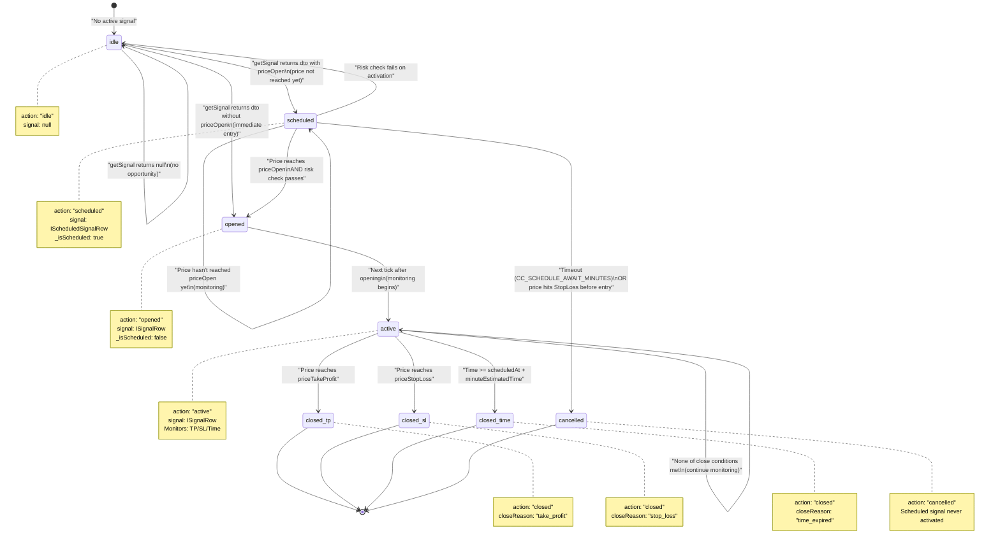
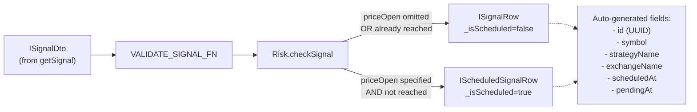
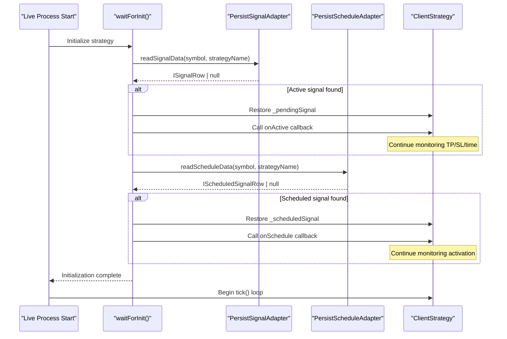
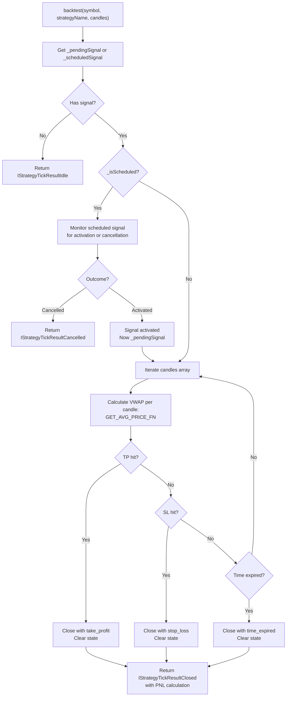

# Signal Lifecycle and State Machine

# Signal Lifecycle and State Machine

<details>
<summary>Relevant source files</summary>

The following files were used as context for generating this wiki page:

- [assets/uml.svg](assets/uml.svg)
- [docs/classes/WalkerCommandService.md](docs/classes/WalkerCommandService.md)
- [docs/interfaces/BacktestStatistics.md](docs/interfaces/BacktestStatistics.md)
- [docs/interfaces/IStrategyCallbacks.md](docs/interfaces/IStrategyCallbacks.md)
- [docs/interfaces/LiveStatistics.md](docs/interfaces/LiveStatistics.md)
- [docs/internals.md](docs/internals.md)
- [docs/types/IStrategyTickResult.md](docs/types/IStrategyTickResult.md)
- [docs/uml.puml](docs/uml.puml)
- [scripts/uml.mjs](scripts/uml.mjs)
- [src/client/ClientStrategy.ts](src/client/ClientStrategy.ts)
- [src/config/emitters.ts](src/config/emitters.ts)
- [src/function/event.ts](src/function/event.ts)
- [src/index.ts](src/index.ts)
- [src/interfaces/Strategy.interface.ts](src/interfaces/Strategy.interface.ts)
- [src/lib/services/connection/StrategyConnectionService.ts](src/lib/services/connection/StrategyConnectionService.ts)
- [types.d.ts](types.d.ts)

</details>


## Purpose and Scope

This document describes the complete lifecycle of trading signals in backtest-kit, including the state machine that governs signal progression from creation through closure. It covers the discriminated union type system used for type-safe state handling, state transition conditions, scheduled vs immediate signal flows, and crash-safe persistence mechanisms.

For information about how signals are generated by strategies, see the Strategy System documentation. For details on execution modes (Backtest vs Live), see [Execution Modes Overview](./04-execution-modes-overview.md). For event-driven monitoring of signal state changes, see [Event-Driven Architecture](./05-event-driven-architecture.md).

**Sources**: [types.d.ts:858-1018](), [src/interfaces/Strategy.interface.ts:1-394](), [docs/internals.md:14-20]()

---

## Signal State Machine Overview

The signal lifecycle is implemented as a type-safe state machine using TypeScript discriminated unions. Every signal progresses through distinct states, with transitions triggered by price conditions, time expiration, or risk validation failures.



**Sources**: [src/client/ClientStrategy.ts:876-1078](), [src/interfaces/Strategy.interface.ts:172-312](), [types.d.ts:976-1018]()

---

## Discriminated Union Type System

The framework uses TypeScript discriminated unions for type-safe state handling. The `action` property serves as the discriminator, enabling exhaustive type checking at compile time.

| State Type | `action` Value | Signal Property | Description |
|------------|----------------|-----------------|-------------|
| `IStrategyTickResultIdle` | `"idle"` | `null` | No active signal exists |
| `IStrategyTickResultScheduled` | `"scheduled"` | `IScheduledSignalRow` | Signal created, waiting for price activation |
| `IStrategyTickResultOpened` | `"opened"` | `ISignalRow` | Signal just opened (first tick after creation) |
| `IStrategyTickResultActive` | `"active"` | `ISignalRow` | Signal being monitored for TP/SL/time |
| `IStrategyTickResultClosed` | `"closed"` | `ISignalRow` | Signal completed with PNL calculation |
| `IStrategyTickResultCancelled` | `"cancelled"` | `IScheduledSignalRow` | Scheduled signal cancelled before activation |

**Union Type Definition**:

```typescript
type IStrategyTickResult = 
  | IStrategyTickResultIdle
  | IStrategyTickResultScheduled
  | IStrategyTickResultOpened
  | IStrategyTickResultActive
  | IStrategyTickResultClosed
  | IStrategyTickResultCancelled;
```

**Type Guard Pattern**:

```typescript
if (result.action === "closed") {
  // TypeScript knows result is IStrategyTickResultClosed
  console.log(result.closeReason); // "take_profit" | "stop_loss" | "time_expired"
  console.log(result.pnl.pnlPercentage); // Safe access
}
```

**Sources**: [src/interfaces/Strategy.interface.ts:172-312](), [types.d.ts:976-1018](), [docs/types/IStrategyTickResult.md:1-14]()

---

## Signal Data Structures

### Signal Creation Flow



### ISignalDto (Input)

Data transfer object returned by `getSignal()` callback. Minimal structure provided by strategy developer.

| Field | Type | Required | Description |
|-------|------|----------|-------------|
| `id` | `string` | Optional | Auto-generated UUID if omitted |
| `position` | `"long" \| "short"` | Yes | Trade direction |
| `priceOpen` | `number` | Optional | Entry price (if specified, becomes scheduled signal) |
| `priceTakeProfit` | `number` | Yes | Target exit price for profit |
| `priceStopLoss` | `number` | Yes | Exit price for loss protection |
| `minuteEstimatedTime` | `number` | Yes | Expected duration before time_expired |
| `note` | `string` | Optional | Human-readable signal description |

**Sources**: [src/interfaces/Strategy.interface.ts:20-39](), [types.d.ts:858-873]()

### ISignalRow (Active Signal)

Complete signal structure after validation and augmentation. Used for immediate signals and activated scheduled signals.

| Field | Type | Description |
|-------|------|-------------|
| `id` | `string` | Unique UUID identifier |
| `position` | `"long" \| "short"` | Trade direction |
| `priceOpen` | `number` | Actual entry price (required) |
| `priceTakeProfit` | `number` | Target profit exit |
| `priceStopLoss` | `number` | Stop loss exit |
| `minuteEstimatedTime` | `number` | Signal lifetime in minutes |
| `symbol` | `string` | Trading pair (e.g., "BTCUSDT") |
| `exchangeName` | `string` | Exchange identifier |
| `strategyName` | `string` | Strategy identifier |
| `scheduledAt` | `number` | Creation timestamp (milliseconds) |
| `pendingAt` | `number` | Activation timestamp (milliseconds) |
| `_isScheduled` | `boolean` | Runtime marker (always `false` for active signals) |
| `note` | `string` | Optional description |

**Critical Timestamps**:
- `scheduledAt`: When signal was first created (never changes)
- `pendingAt`: When signal became active at `priceOpen` (may differ from `scheduledAt` for scheduled signals)

**Sources**: [src/interfaces/Strategy.interface.ts:41-73](), [types.d.ts:878-895]()

### IScheduledSignalRow (Waiting for Activation)

Extends `ISignalRow` for signals waiting for price to reach entry point. Identical structure but `_isScheduled` is `true`.

**Key Behaviors**:
- Monitored for price activation conditions every tick
- Subject to timeout via `CC_SCHEDULE_AWAIT_MINUTES` configuration
- Can be cancelled if price hits `priceStopLoss` before `priceOpen` is reached
- `pendingAt` initially equals `scheduledAt`, updated upon activation

**Sources**: [src/interfaces/Strategy.interface.ts:64-73](), [types.d.ts:897-905]()

---

## State Transition Conditions

### Idle → Scheduled

**Trigger**: `getSignal()` returns `ISignalDto` with `priceOpen` specified, and current price hasn't reached entry point yet.

**Conditions**:
- For LONG: `currentPrice > priceOpen` (price needs to drop to enter)
- For SHORT: `currentPrice < priceOpen` (price needs to rise to enter)

**Code Location**: [src/client/ClientStrategy.ts:388-442]()

**Validation Steps**:
1. Check `priceOpen` is specified in DTO
2. Calculate activation condition based on position type
3. If not immediately activatable, create `IScheduledSignalRow`
4. Call `VALIDATE_SIGNAL_FN` with `isScheduled=true`

**Sources**: [src/client/ClientStrategy.ts:388-442]()

---

### Idle → Opened (Immediate Entry)

**Trigger**: `getSignal()` returns `ISignalDto` without `priceOpen`, OR with `priceOpen` already reached.

**Conditions**:
- `priceOpen` is undefined, OR
- For LONG: `currentPrice <= priceOpen`
- For SHORT: `currentPrice >= priceOpen`

**Code Location**: [src/client/ClientStrategy.ts:389-420](), [src/client/ClientStrategy.ts:444-461]()

**Risk Check**: Must pass `Risk.checkSignal()` before opening ([src/client/ClientStrategy.ts:374-387]())

**Auto-Generated Values**:
- `priceOpen`: Set to `currentPrice` if omitted
- `scheduledAt`: Current timestamp
- `pendingAt`: Same as `scheduledAt` (immediate entry)
- `_isScheduled`: `false`

**Sources**: [src/client/ClientStrategy.ts:444-461](), [src/client/ClientStrategy.ts:848-886]()

---

### Scheduled → Opened (Activation)

**Trigger**: Price reaches entry point while scheduled signal is active.

**Conditions**:
- For LONG: `currentPrice <= scheduledSignal.priceOpen`
- For SHORT: `currentPrice >= scheduledSignal.priceOpen`
- Must NOT have hit `priceStopLoss` first (checked with priority)

**Code Location**: [src/client/ClientStrategy.ts:610-644](), [src/client/ClientStrategy.ts:681-774]()

**Activation Flow**:

```mermaid
sequenceDiagram
    participant Tick as "tick()"
    participant Check as "CHECK_SCHEDULED_SIGNAL_PRICE_ACTIVATION_FN"
    participant Activate as "ACTIVATE_SCHEDULED_SIGNAL_FN"
    participant Risk as "Risk.checkSignal"
    participant Persist as "PersistSignalAdapter"
    
    Tick->>Check: Check price vs priceOpen
    
    alt Price hit StopLoss first
        Check-->>Tick: shouldCancel=true
        Note over Tick: Cancel signal, return to idle
    else Price reached priceOpen
        Check-->>Tick: shouldActivate=true
        Tick->>Activate: Activate signal
        Activate->>Risk: Re-check risk limits
        alt Risk fails
            Risk-->>Activate: Rejected
            Activate->>Persist: Clear scheduled signal
            Activate-->>Tick: Return null
        else Risk passes
            Risk-->>Activate: Allowed
            Activate->>Persist: Clear scheduled signal
            Activate->>Persist: Write pending signal
            Note over Activate: Update pendingAt to current time
            Activate-->>Tick: Return IStrategyTickResultOpened
        end
    else Still waiting
        Check-->>Tick: shouldActivate=false, shouldCancel=false
        Note over Tick: Return IStrategyTickResultActive (monitoring)
    end
```

**Critical**: `pendingAt` is updated to the actual activation timestamp, not kept at `scheduledAt`.

**Sources**: [src/client/ClientStrategy.ts:610-644](), [src/client/ClientStrategy.ts:681-774]()

---

### Scheduled → Cancelled (Timeout or StopLoss)

**Trigger**: Scheduled signal expires or price hits stop loss before entry.

**Timeout Condition**:
- `currentTime - scheduledAt >= CC_SCHEDULE_AWAIT_MINUTES * 60 * 1000`
- Default: 90 minutes ([types.d.ts:10]())

**Code Location**: [src/client/ClientStrategy.ts:554-608]()

**StopLoss Cancellation**:
- For LONG: `currentPrice <= priceStopLoss`
- For SHORT: `currentPrice >= priceStopLoss`
- Checked BEFORE activation check to prevent invalid entry

**Code Location**: [src/client/ClientStrategy.ts:610-644](), [src/client/ClientStrategy.ts:646-679]()

**Result**: `IStrategyTickResultCancelled` emitted, signal removed from persistence.

**Sources**: [src/client/ClientStrategy.ts:554-608](), [src/client/ClientStrategy.ts:646-679]()

---

### Opened → Active

**Trigger**: Next tick after signal opening. Automatic transition.

**Purpose**: Separates "signal just created" event from "signal monitoring" state for callback clarity.

**Code Location**: Implicit in state machine - `opened` is only emitted once, subsequent ticks emit `active`.

**Sources**: [src/client/ClientStrategy.ts:887-965]()

---

### Active → Closed

**Three Close Conditions** (checked in priority order):

#### 1. Take Profit Hit

**Condition**:
- For LONG: `currentPrice >= priceTakeProfit`
- For SHORT: `currentPrice <= priceTakeProfit`

**Code Location**: [src/client/ClientStrategy.ts:1141-1180](), [src/client/ClientStrategy.ts:1182-1221]()

**Close Reason**: `"take_profit"`

#### 2. Stop Loss Hit

**Condition**:
- For LONG: `currentPrice <= priceStopLoss`
- For SHORT: `currentPrice >= priceStopLoss`

**Code Location**: [src/client/ClientStrategy.ts:1223-1262](), [src/client/ClientStrategy.ts:1264-1303]()

**Close Reason**: `"stop_loss"`

#### 3. Time Expiration

**Condition**:
- `currentTime - pendingAt >= minuteEstimatedTime * 60 * 1000`

**Code Location**: [src/client/ClientStrategy.ts:1305-1342]()

**Close Reason**: `"time_expired"`

**Max Lifetime Protection**: Signals cannot exceed `CC_MAX_SIGNAL_LIFETIME_MINUTES` (default: 1440 minutes = 1 day) to prevent risk limit deadlock ([types.d.ts:55-59]()).

**Sources**: [src/client/ClientStrategy.ts:1141-1342](), [types.d.ts:55-59]()

---

## Signal Validation Rules

Validation occurs via `VALIDATE_SIGNAL_FN` before signal creation or activation. Throws error if any check fails.

### Price Relationship Validation

| Position | Condition | Error if Violated |
|----------|-----------|-------------------|
| LONG | `priceTakeProfit > priceOpen` | TP must be above entry |
| LONG | `priceStopLoss < priceOpen` | SL must be below entry |
| SHORT | `priceTakeProfit < priceOpen` | TP must be below entry |
| SHORT | `priceStopLoss > priceOpen` | SL must be above entry |

**Code Location**: [src/client/ClientStrategy.ts:111-214]()

### Economic Viability Checks

| Check | Configuration | Default | Purpose |
|-------|---------------|---------|---------|
| Min TP Distance | `CC_MIN_TAKEPROFIT_DISTANCE_PERCENT` | 0.5% | Ensure TP covers fees + slippage |
| Min SL Distance | `CC_MIN_STOPLOSS_DISTANCE_PERCENT` | 0.5% | Prevent instant stop-out on volatility |
| Max SL Distance | `CC_MAX_STOPLOSS_DISTANCE_PERCENT` | 20% | Limit catastrophic losses |
| Max Lifetime | `CC_MAX_SIGNAL_LIFETIME_MINUTES` | 1440 min | Prevent eternal signals blocking risk limits |

**Code Location**: [src/client/ClientStrategy.ts:163-316]()

**TP Distance Calculation** (LONG example):
```
tpDistancePercent = ((priceTakeProfit - priceOpen) / priceOpen) * 100
```

Must be >= 0.5% to cover:
- Entry slippage: ~0.1%
- Entry fee: 0.1%
- Exit slippage: ~0.1%
- Exit fee: 0.1%
- Minimum profit buffer: 0.1%

**Sources**: [src/client/ClientStrategy.ts:45-330](), [types.d.ts:29-59]()

### Immediate Close Prevention

Prevents signals that would close instantly upon creation.

| Scenario | Check | Error Message |
|----------|-------|---------------|
| LONG Immediate | `currentPrice <= priceStopLoss` | "Signal would be immediately closed by stop loss" |
| LONG Immediate | `currentPrice >= priceTakeProfit` | "Signal would be immediately closed by take profit" |
| SHORT Immediate | `currentPrice >= priceStopLoss` | "Signal would be immediately closed by stop loss" |
| SHORT Immediate | `currentPrice <= priceTakeProfit` | "Signal would be immediately closed by take profit" |
| LONG Scheduled | `priceOpen <= priceStopLoss` | "Signal would be immediately cancelled on activation" |
| LONG Scheduled | `priceOpen >= priceTakeProfit` | "This is logically impossible for LONG position" |
| SHORT Scheduled | `priceOpen >= priceStopLoss` | "Signal would be immediately cancelled on activation" |
| SHORT Scheduled | `priceOpen <= priceTakeProfit` | "This is logically impossible for SHORT position" |

**Code Location**: [src/client/ClientStrategy.ts:124-251]()

**Sources**: [src/client/ClientStrategy.ts:124-251]()

---

## PNL Calculation

Profit and loss calculation includes realistic trading costs via `toProfitLossDto` helper.

### Cost Modeling

| Cost Component | Configuration | Default | Applied When |
|----------------|---------------|---------|--------------|
| Slippage | `CC_PERCENT_SLIPPAGE` | 0.1% | Entry and Exit (2x) |
| Fees | `CC_PERCENT_FEE` | 0.1% | Entry and Exit (2x) |

**Total Trading Costs**: ~0.4% per round trip

**Adjusted Price Calculation**:

```typescript
// LONG Position
priceOpenAdjusted = priceOpen * (1 + slippage + fee)  // Pay more to enter
priceCloseAdjusted = priceClose * (1 - slippage - fee) // Receive less on exit

// SHORT Position  
priceOpenAdjusted = priceOpen * (1 - slippage - fee)  // Receive less to enter
priceCloseAdjusted = priceClose * (1 + slippage + fee) // Pay more on exit
```

**PNL Percentage Formula**:

```typescript
// LONG
pnlPercentage = ((priceCloseAdjusted - priceOpenAdjusted) / priceOpenAdjusted) * 100

// SHORT
pnlPercentage = ((priceOpenAdjusted - priceCloseAdjusted) / priceOpenAdjusted) * 100
```

**Code Location**: [src/helpers/toProfitLossDto.ts]()

**Sources**: [src/client/ClientStrategy.ts:26](), [types.d.ts:22-28](), [src/interfaces/Strategy.interface.ts:159-170]()

---

## Persistence and Crash Recovery

The framework implements crash-safe state persistence via atomic file writes, enabling live trading processes to recover from crashes without position loss.

### Persistence Adapters

| Adapter | File Location | Stored Data | Purpose |
|---------|---------------|-------------|---------|
| `PersistSignalAdapter` | `./dump/signal/{symbol}_{strategyName}.json` | Active `ISignalRow` | Restore active positions |
| `PersistScheduleAdapter` | `./dump/schedule/{symbol}_{strategyName}.json` | Scheduled `IScheduledSignalRow` | Restore waiting signals |

**Atomic Write Pattern**:
1. Write to temporary file (`{filename}.tmp`)
2. Rename to target file (atomic operation)
3. Prevents partial writes on crash

**Code Location**: [src/classes/Persist.ts]()

### Recovery Flow (Live Mode)



**Code Location**: [src/client/ClientStrategy.ts:491-552]()

**Key Points**:
- Only runs in live mode (`backtest=false`)
- Restores both active and scheduled signals
- Validates `exchangeName` and `strategyName` match
- Calls appropriate lifecycle callbacks (`onActive`, `onSchedule`) after restoration

**Sources**: [src/client/ClientStrategy.ts:491-552](), [src/classes/Persist.ts](), [docs/internals.md:26-27]()

---

## Lifecycle Callbacks

Strategies can register optional callbacks to observe state transitions. All callbacks receive `backtest` flag to distinguish execution mode.

### Callback Invocation Points

| Callback | When Invoked | Parameters | State |
|----------|--------------|------------|-------|
| `onTick` | Every tick (all states) | `symbol`, `result`, `backtest` | All |
| `onIdle` | No active signal | `symbol`, `currentPrice`, `backtest` | Idle |
| `onSchedule` | Scheduled signal created | `symbol`, `data: IScheduledSignalRow`, `currentPrice`, `backtest` | Scheduled |
| `onOpen` | Signal opened/activated | `symbol`, `data: ISignalRow`, `currentPrice`, `backtest` | Opened |
| `onActive` | Signal being monitored | `symbol`, `data: ISignalRow`, `currentPrice`, `backtest` | Active |
| `onPartialProfit` | Profit milestone reached | `symbol`, `data: ISignalRow`, `currentPrice`, `revenuePercent`, `backtest` | Active |
| `onPartialLoss` | Loss milestone reached | `symbol`, `data: ISignalRow`, `currentPrice`, `lossPercent`, `backtest` | Active |
| `onClose` | Signal closed | `symbol`, `data: ISignalRow`, `priceClose`, `backtest` | Closed |
| `onCancel` | Scheduled signal cancelled | `symbol`, `data: IScheduledSignalRow`, `currentPrice`, `backtest` | Cancelled |
| `onWrite` | State persisted (testing) | `symbol`, `data: ISignalRow \| null`, `backtest` | Any |

**Code Locations**:
- Callback interface: [src/interfaces/Strategy.interface.ts:96-126]()
- Invocation points: [src/client/ClientStrategy.ts]() (various locations)

**onTick Universality**: `onTick` is called for EVERY state transition, receiving the full `IStrategyTickResult`. Other callbacks are supplementary and state-specific.

**Sources**: [src/interfaces/Strategy.interface.ts:96-126](), [docs/interfaces/IStrategyCallbacks.md]()

---

## Event Emissions

Beyond callbacks, the framework emits events via global `Subject` instances for cross-cutting concerns like reporting and monitoring.

### Signal Event Emitters

| Emitter | Emits | Scope | Listener Functions |
|---------|-------|-------|-------------------|
| `signalEmitter` | All `IStrategyTickResult` | Both backtest and live | `listenSignal()`, `listenSignalOnce()` |
| `signalBacktestEmitter` | Backtest results only | Backtest mode | `listenSignalBacktest()`, `listenSignalBacktestOnce()` |
| `signalLiveEmitter` | Live results only | Live mode | `listenSignalLive()`, `listenSignalLiveOnce()` |

**Emission Points**:
- After every `tick()` call: [src/lib/services/connection/StrategyConnectionService.ts:218-227]()
- After every `backtest()` call: [src/lib/services/connection/StrategyConnectionService.ts:254-259]()

**Queued Processing**: All listener functions use `queued()` wrapper from functools-kit to ensure sequential async execution, preventing race conditions.

**Code Location**: [src/config/emitters.ts:15-31](), [src/function/event.ts:70-221]()

**Sources**: [src/config/emitters.ts:15-31](), [src/function/event.ts:70-221](), [src/lib/services/connection/StrategyConnectionService.ts:207-261]()

---

## Backtest Fast-Path Optimization

In backtest mode, signals use a fast-path through historical candles to avoid tick-by-tick processing.

### backtest() Method Flow



**Key Optimizations**:
1. **Skip Individual Ticks**: Processes array of candles directly instead of tick-by-tick
2. **VWAP Per Candle**: Calculates typical price `(high + low + close) / 3` weighted by volume
3. **Early Exit**: Stops iterating once close condition met
4. **No Persistence**: Backtest mode doesn't write to disk (stateless)

**Code Location**: [src/client/ClientStrategy.ts:1008-1139]()

**VWAP Calculation**: [src/client/ClientStrategy.ts:478-489]()

**Sources**: [src/client/ClientStrategy.ts:1008-1139](), [src/client/ClientStrategy.ts:478-489](), [docs/internals.md:54-68]()

---

## Runtime State Management

The `ClientStrategy` class maintains internal state via private properties.

### State Properties

| Property | Type | Purpose |
|----------|------|---------|
| `_pendingSignal` | `ISignalRow \| null` | Currently active signal being monitored |
| `_scheduledSignal` | `IScheduledSignalRow \| null` | Scheduled signal waiting for activation |
| `_lastSignalTimestamp` | `number \| null` | Last `getSignal()` invocation time (for throttling) |
| `_isStopped` | `boolean` | Stop flag for graceful shutdown |

**Mutual Exclusivity**: A strategy can have EITHER `_pendingSignal` OR `_scheduledSignal` active, never both simultaneously.

**Code Location**: [src/client/ClientStrategy.ts]() (class properties)

### State Setter Methods

| Method | Purpose | Side Effects |
|--------|---------|--------------|
| `setPendingSignal(signal)` | Set active signal | Writes to `PersistSignalAdapter` (live mode only) |
| `setScheduledSignal(signal)` | Set scheduled signal | Writes to `PersistScheduleAdapter` (live mode only) |
| `waitForInit()` | Load persisted state | Reads from both adapters, restores state, calls callbacks |
| `stop()` | Set stop flag | Sets `_isStopped = true` |

**Persistence Conditional**: State writes only occur in live mode (`backtest=false`). Backtest mode keeps state in memory only.

**Code Location**: [src/client/ClientStrategy.ts]() (various methods)

**Sources**: [src/client/ClientStrategy.ts]()

---

## Summary Table: State Transitions

| From State | To State | Trigger | Validation | Result Type |
|------------|----------|---------|------------|-------------|
| `idle` | `idle` | `getSignal()` returns `null` | N/A | `IStrategyTickResultIdle` |
| `idle` | `scheduled` | `getSignal()` returns DTO with `priceOpen` not reached | Signal + Risk | `IStrategyTickResultScheduled` |
| `idle` | `opened` | `getSignal()` returns DTO, immediate entry | Signal + Risk | `IStrategyTickResultOpened` |
| `scheduled` | `scheduled` | Price hasn't reached `priceOpen` | N/A | `IStrategyTickResultActive` (monitoring) |
| `scheduled` | `opened` | Price reaches `priceOpen` | Risk re-check | `IStrategyTickResultOpened` |
| `scheduled` | `cancelled` | Timeout OR StopLoss before entry | N/A | `IStrategyTickResultCancelled` |
| `scheduled` | `idle` | Risk check fails on activation | N/A | `IStrategyTickResultIdle` |
| `opened` | `active` | Next tick | N/A | `IStrategyTickResultActive` |
| `active` | `active` | No close condition met | N/A | `IStrategyTickResultActive` |
| `active` | `closed` | TP hit | N/A | `IStrategyTickResultClosed` (`take_profit`) |
| `active` | `closed` | SL hit | N/A | `IStrategyTickResultClosed` (`stop_loss`) |
| `active` | `closed` | Time expired | N/A | `IStrategyTickResultClosed` (`time_expired`) |

**Sources**: [src/client/ClientStrategy.ts:876-1078](), [src/interfaces/Strategy.interface.ts:172-312]()