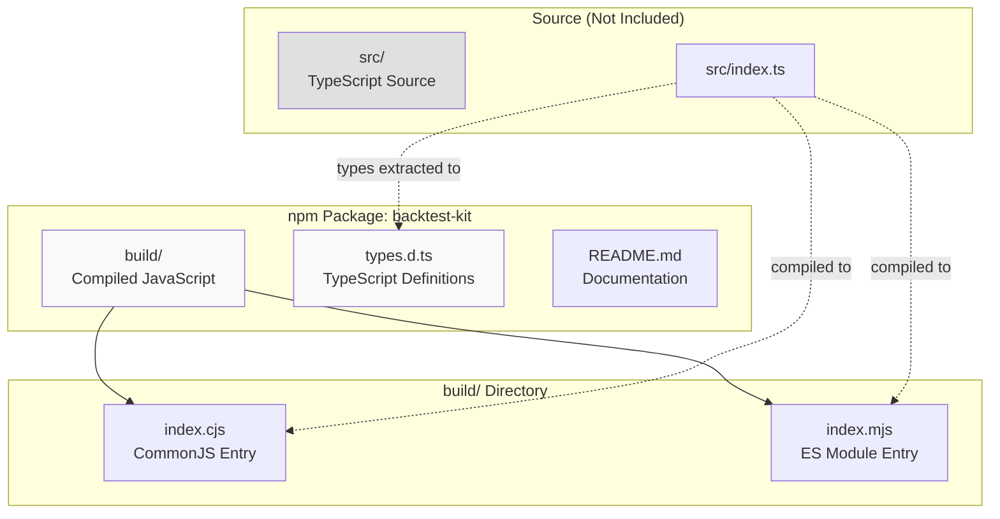
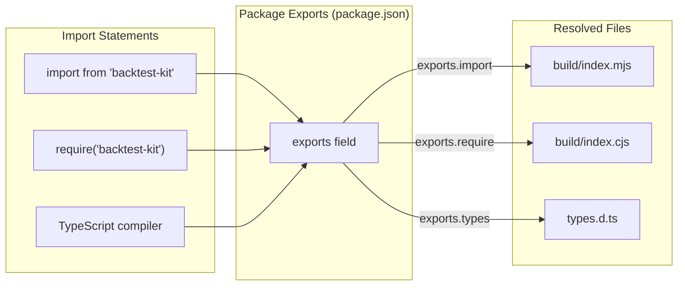
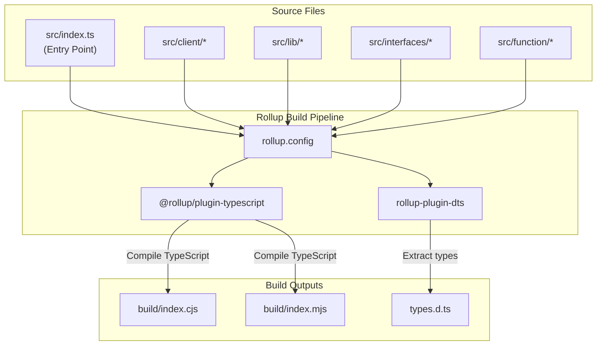
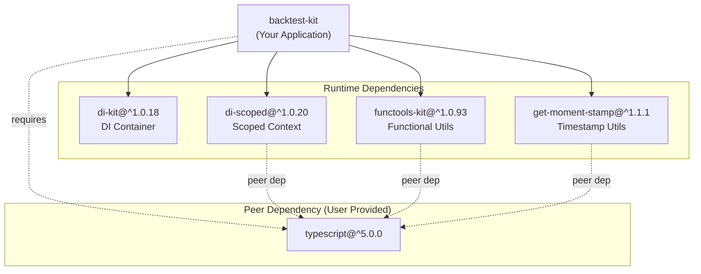
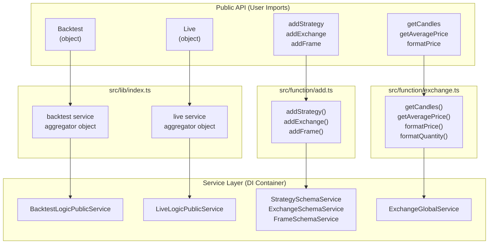

# Installation and Setup

**Purpose and Scope:** This page covers the installation process, package structure, module entry points, and build system configuration for the backtest-kit framework. For information about configuring strategies, exchanges, and frames after installation, see [Configuration Functions](#3.1). For architecture details and service layer setup, see [Architecture](#2) and [Dependency Injection System](#2.2).

---

## Prerequisites

The backtest-kit framework requires **TypeScript 5.0 or higher** as a peer dependency. Ensure your project meets this requirement before installation.

**Required peer dependency:**
- `typescript`: `^5.0.0`

**Supported Node.js versions:** Node.js 14.18.0 or higher (inferred from build tool requirements)

Sources: [package.json:70-72]()

---

## Installing the Package

Install backtest-kit from npm:

```bash
npm install backtest-kit
```

This installs the framework along with its runtime dependencies:
- `di-kit` (^1.0.18) - Dependency injection container
- `di-scoped` (^1.0.20) - Scoped context management
- `functools-kit` (^1.0.93) - Functional programming utilities
- `get-moment-stamp` (^1.1.1) - Timestamp utilities

Sources: [README.md:22-26](), [package.json:73-78]()

---

## Package Structure and Distribution

The distributed npm package contains three primary artifacts:



**Package contents:**

| File/Directory | Purpose | Referenced By |
|----------------|---------|---------------|
| `build/index.cjs` | CommonJS entry point | `main`, `exports.require` |
| `build/index.mjs` | ES Module entry point | `module`, `exports.import` |
| `types.d.ts` | TypeScript type definitions | `types`, `exports.types` |
| `README.md` | Documentation | Package metadata |

Sources: [package.json:27-31](), [package.json:48-57]()

---

## Module System and Entry Points

The package supports both CommonJS and ES Modules through conditional exports:

### ES Module Import (Recommended)

```typescript
import { 
  Backtest, 
  Live, 
  addStrategy, 
  addExchange, 
  addFrame 
} from "backtest-kit";
```

Resolves to: `build/index.mjs`

### CommonJS Require

```javascript
const { 
  Backtest, 
  Live, 
  addStrategy, 
  addExchange, 
  addFrame 
} = require("backtest-kit");
```

Resolves to: `build/index.cjs`

### TypeScript Type Definitions

TypeScript automatically resolves types from `types.d.ts` for both import styles.



Sources: [package.json:52-57](), [README.md:32-34]()

---

## Build System Architecture

The package uses **Rollup** to compile TypeScript source into distributable JavaScript and type definitions.

### Build Process Overview



### Build Scripts

The following npm scripts manage the build process:

| Script | Command | Purpose |
|--------|---------|---------|
| `build` | `rollup -c` | Compile source to `build/` and generate `types.d.ts` |
| `build:docs` | `rimraf docs && mkdir docs && node ./scripts/dts-docs.cjs ./types.d.ts ./docs` | Generate documentation from types |
| `docs:www` | `rimraf docs/wwwroot && typedoc` | Generate TypeDoc HTML documentation |

Sources: [package.json:41-46](), [package.json:58-66]()

### Rollup Plugins Configuration

The build system uses these plugins:

1. **@rollup/plugin-typescript** - Compiles TypeScript to JavaScript
2. **rollup-plugin-dts** - Bundles TypeScript declarations into single `types.d.ts`
3. **rollup-plugin-peer-deps-external** - Externalizes peer dependencies

Sources: [package.json:58-67]()

---

## Dependency Tree

The framework's runtime dependencies form a lightweight tree:



**Key Dependencies:**

- **di-kit**: Provides symbol-based dependency injection container (see [Dependency Injection System](#2.2))
- **di-scoped**: Enables implicit context propagation for services (see [Context Propagation](#2.3))
- **functools-kit**: Functional programming utilities for memoization and queuing
- **get-moment-stamp**: Timestamp calculation and interval utilities

Sources: [package.json:73-78](), [package-lock.json:650-668]()

---

## Verifying Installation

### Quick Verification Script

Create a file `verify-install.ts`:

```typescript
import { Backtest, Live, addExchange, addStrategy, addFrame } from "backtest-kit";

console.log("✓ Import successful");
console.log("Backtest:", typeof Backtest.run);
console.log("Live:", typeof Live.run);
console.log("addExchange:", typeof addExchange);
console.log("addStrategy:", typeof addStrategy);
console.log("addFrame:", typeof addFrame);
```

Run with:
```bash
npx ts-node verify-install.ts
```

Expected output:
```
✓ Import successful
Backtest: function
Live: function
addExchange: function
addStrategy: function
addFrame: function
```

### Checking Package Version

```bash
npm list backtest-kit
```

Expected output:
```
your-project@1.0.0
└── backtest-kit@1.0.4
```

Sources: [README.md:28-103]()

---

## Module Resolution and Code Entity Mapping

Understanding how public API functions map to internal implementation:



**Key Export Mappings:**

| Public Export | Source File | Internal Implementation |
|---------------|-------------|-------------------------|
| `Backtest` | `src/lib/index.ts` | Service aggregator exposing `BacktestLogicPublicService` |
| `Live` | `src/lib/index.ts` | Service aggregator exposing `LiveLogicPublicService` |
| `addStrategy` | `src/function/add.ts` | Registers schema in `StrategySchemaService` |
| `addExchange` | `src/function/add.ts` | Registers schema in `ExchangeSchemaService` |
| `addFrame` | `src/function/add.ts` | Registers schema in `FrameSchemaService` |
| `getCandles` | `src/function/exchange.ts` | Proxies to `ExchangeGlobalService.getCandles` |
| `getAveragePrice` | `src/function/exchange.ts` | Proxies to `ExchangeGlobalService.getAveragePrice` |

Sources: [README.md:640-671](), Package structure inferred from file organization

---

## Troubleshooting Common Issues

### TypeScript Version Mismatch

**Error:**
```
npm ERR! peer typescript@"^5.0.0" from backtest-kit@1.0.4
```

**Solution:** Upgrade TypeScript to version 5.0 or higher:
```bash
npm install --save-dev typescript@^5.0.0
```

### Module Resolution Errors

**Error:**
```
Cannot find module 'backtest-kit'
```

**Solutions:**
1. Ensure `node_modules` is not corrupted:
   ```bash
   rm -rf node_modules package-lock.json
   npm install
   ```

2. Check `tsconfig.json` has proper module resolution:
   ```json
   {
     "compilerOptions": {
       "moduleResolution": "node",
       "esModuleInterop": true
     }
   }
   ```

### Missing Type Definitions

**Error:**
```
Could not find a declaration file for module 'backtest-kit'
```

**Solution:** Verify `types.d.ts` exists in `node_modules/backtest-kit/`:
```bash
ls node_modules/backtest-kit/types.d.ts
```

If missing, reinstall:
```bash
npm install backtest-kit --force
```

Sources: [package.json:70-72](), [package.json:51]()

---

## Development Setup (For Contributors)

If you're contributing to backtest-kit or need to build from source:

### Cloning the Repository

```bash
git clone https://github.com/tripolskypetr/backtest-kit
cd backtest-kit
npm install
```

### Building from Source

```bash
npm run build
```

This generates:
- `build/index.cjs` - CommonJS bundle
- `build/index.mjs` - ES Module bundle  
- `types.d.ts` - TypeScript definitions

### Development Scripts

| Script | Purpose |
|--------|---------|
| `npm run build` | Compile TypeScript to distributable format |
| `npm run build:docs` | Generate markdown documentation from types |
| `npm run docs:www` | Generate TypeDoc HTML documentation |
| `npm run repl` | Start interactive REPL for testing |

Sources: [package.json:32-36](), [package.json:41-46]()

---

## Next Steps

After successful installation:

1. **Register your exchange data source** - See [Configuration Functions](#3.1) for `addExchange`
2. **Define your trading strategy** - See [Configuration Functions](#3.1) for `addStrategy`  
3. **Set up timeframe generators** - See [Configuration Functions](#3.1) for `addFrame`
4. **Run your first backtest** - See [Backtest API](#3.2)
5. **Deploy to live trading** - See [Live Trading API](#3.3)

Sources: [README.md:28-137]()