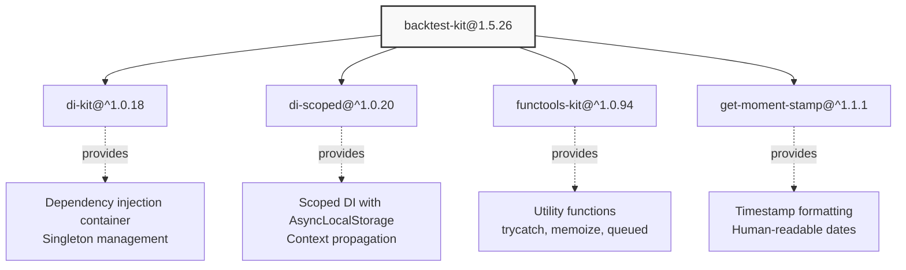
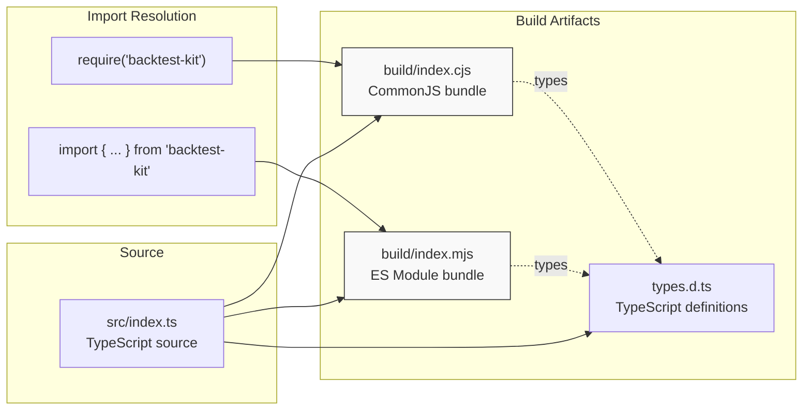
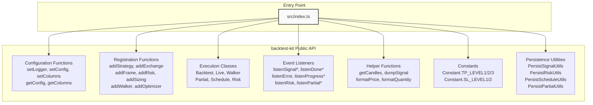

# Installation and Setup

<details>
<summary>Relevant source files</summary>

The following files were used as context for generating this wiki page:

- [README.md](README.md)
- [demo/backtest/package-lock.json](demo/backtest/package-lock.json)
- [demo/backtest/package.json](demo/backtest/package.json)
- [demo/backtest/src/index.mjs](demo/backtest/src/index.mjs)
- [demo/live/package-lock.json](demo/live/package-lock.json)
- [demo/live/package.json](demo/live/package.json)
- [demo/live/src/index.mjs](demo/live/src/index.mjs)
- [demo/optimization/package-lock.json](demo/optimization/package-lock.json)
- [demo/optimization/package.json](demo/optimization/package.json)
- [package-lock.json](package-lock.json)
- [package.json](package.json)
- [src/client/ClientStrategy.ts](src/client/ClientStrategy.ts)
- [src/interfaces/Strategy.interface.ts](src/interfaces/Strategy.interface.ts)
- [test/e2e/defend.test.mjs](test/e2e/defend.test.mjs)
- [test/index.mjs](test/index.mjs)

</details>


This document provides instructions for installing `backtest-kit` and configuring a new project. It covers package installation, peer dependencies, module formats, TypeScript configuration, and project structure recommendations.

For usage examples and running your first backtest, see [Quick Start Guide](#1.3). For advanced configuration of global parameters, see [Global Configuration](#14.1).

---

## Package Installation

### NPM Installation

Install `backtest-kit` from the npm registry:

```bash
npm install backtest-kit
```

The package is distributed in both CommonJS and ES Module formats, with TypeScript type definitions included at [types.d.ts]().

**Sources:** [package.json:1-80](), [README.md:40-43]()

---

## System Requirements

### Required Peer Dependencies

`backtest-kit` requires **TypeScript 5.0 or higher** as a peer dependency. This is enforced at the package level for type safety guarantees.

```bash
npm install typescript@^5.0.0
```

The peer dependency requirement is declared in [package.json:71-73]() and inherited by transitive dependencies:

| Package | Peer Dependency |
|---------|----------------|
| `backtest-kit` | `typescript: ^5.0.0` |
| `di-scoped` | `typescript: ^5.0.0` |
| `functools-kit` | `typescript: ^5.0.0` |
| `get-moment-stamp` | `typescript: ^5.0.0` |

**Node.js Version:** The build tooling requires Node.js 14+ (specified in rollup configuration), but runtime execution supports any LTS version.

**Sources:** [package.json:71-73](), [package-lock.json:1-2879]()

---

## Core Dependencies

The following packages are automatically installed as dependencies:



| Package | Purpose | Used By |
|---------|---------|---------|
| `di-kit` | Dependency injection container with `provide()`/`inject()` pattern | [src/lib/core/provide.ts]() |
| `di-scoped` | AsyncLocalStorage-based scoped DI for context isolation | [ExecutionContextService](), [MethodContextService]() |
| `functools-kit` | Utility functions: `trycatch()`, `memoize()`, `queued()`, `singleshot()` | Used throughout codebase |
| `get-moment-stamp` | Timestamp formatting for human-readable output | Markdown report generation |

**Sources:** [package.json:74-79](), [src/lib/core/provide.ts:1-20]()

---

## Optional Dependencies for Typical Use Cases

While not required by `backtest-kit` itself, most trading strategies require additional packages:

### Exchange Integration

```bash
npm install ccxt
```

**CCXT** (CryptoCurrency eXchange Trading Library) provides unified API access to 100+ cryptocurrency exchanges. Used in `IExchangeSchema.getCandles` implementations for fetching historical OHLCV data.

**Usage Example:** [demo/backtest/src/index.mjs:24-35](), [demo/live/src/index.mjs:24-35]()

### AI/LLM Integration

```bash
npm install ollama
```

**Ollama** client library for local LLM inference. Required for:
- AI-powered strategy generation via `addOptimizer()` (see [Optimizer Schemas](#5.7))
- Signal generation with LLM-based decision making
- Multi-timeframe analysis patterns

**Usage Example:** [demo/backtest/src/utils/json.mjs](), [demo/optimization/src/index.mjs]()

### Utility Libraries

```bash
npm install uuid
```

**UUID** for generating unique signal identifiers. Recommended when `ISignalDto.id` is not provided by strategy, as the system auto-generates IDs using `randomString()` from `functools-kit`, but UUID v4 provides stronger uniqueness guarantees for production systems.

**Usage Example:** [demo/backtest/src/index.mjs:19](), [demo/live/src/index.mjs:19]()

### Environment Variables

```bash
npm install dotenv-cli
```

**dotenv-cli** for loading environment variables from `.env` files. Useful for managing:
- `OLLAMA_API_KEY` for LLM integration
- Exchange API keys for live trading
- Configuration parameters

**Usage Example:** [demo/backtest/package.json:6](), [demo/live/package.json:6]()

**Sources:** [demo/backtest/package.json:8-17](), [demo/live/package.json:8-17](), [demo/optimization/package.json:8-17]()

---

## Module Format Selection

`backtest-kit` supports both CommonJS and ES Modules:



### CommonJS (require)

```javascript
const { addStrategy, Backtest } = require('backtest-kit');
```

Entry point: [build/index.cjs]() specified in [package.json:49]()

### ES Modules (import)

```javascript
import { addStrategy, Backtest } from 'backtest-kit';
```

Entry point: [build/index.mjs]() specified in [package.json:50]()

### Package.json Exports Field

The [package.json:53-58]() defines explicit export mappings:

```json
{
  "exports": {
    "require": "./build/index.cjs",
    "types": "./types.d.ts",
    "import": "./build/index.mjs",
    "default": "./build/index.cjs"
  }
}
```

**Recommendation:** Use ES Modules (`"type": "module"` in package.json) for new projects, as all demo examples use this format and it provides better tree-shaking support.

**Sources:** [package.json:49-58](), [demo/backtest/package.json:4](), [demo/live/package.json:4]()

---

## Project Structure

### Minimal Project Structure

```
my-trading-bot/
├── package.json          # Project metadata and dependencies
├── .env                  # Environment variables (API keys, config)
├── src/
│   ├── index.mjs        # Main entry point
│   └── utils/
│       ├── json.mjs     # LLM helper (optional)
│       └── messages.mjs # Market data formatter (optional)
└── dump/                # Auto-generated reports and persistence
    ├── data/            # Crash recovery state (live mode only)
    │   ├── signal/      # PersistSignalAdapter storage
    │   ├── risk/        # PersistRiskAdapter storage
    │   ├── schedule/    # PersistScheduleAdapter storage
    │   └── partial/     # PersistPartialAdapter storage
    └── report/          # Markdown reports
        ├── backtest/    # BacktestMarkdownService output
        ├── live/        # LiveMarkdownService output
        └── walker/      # WalkerMarkdownService output
```

**Directory Behavior:**

| Directory | Auto-Created | Purpose | Persistence |
|-----------|--------------|---------|-------------|
| `dump/data/` | Yes (live mode) | Atomic state persistence for crash recovery | Survives restarts |
| `dump/report/` | Yes (on demand) | Markdown reports generated by `*.dump()` calls | Manual cleanup |
| `dump/strategy/` | Yes (optimizer) | LLM conversation audit trails and generated code | Manual cleanup |

**Sources:** [demo/backtest/](), [demo/live/](), [src/classes/Persist.ts:1-200]()

---

## TypeScript Configuration

### tsconfig.json Recommendations

While `backtest-kit` is distributed as compiled JavaScript with type definitions, TypeScript configuration is required for:

1. **Type checking** consumer code that uses the library
2. **IDE intellisense** for autocomplete and inline documentation
3. **Compilation** of custom strategies written in TypeScript

**Minimal Configuration:**

```json
{
  "compilerOptions": {
    "target": "ES2020",
    "module": "ES2020",
    "moduleResolution": "node",
    "esModuleInterop": true,
    "skipLibCheck": true,
    "strict": true,
    "resolveJsonModule": true,
    "types": ["node"]
  },
  "include": ["src/**/*"],
  "exclude": ["node_modules", "dist"]
}
```

**Key Settings:**

- `"module": "ES2020"` - Required for async/await and top-level await (used in strategy execution)
- `"moduleResolution": "node"` - Standard Node.js module resolution for npm packages
- `"esModuleInterop": true` - Required for importing CCXT and other CommonJS libraries
- `"skipLibCheck": true` - Recommended for faster builds (skips type checking of declaration files)
- `"strict": true` - Enables all strict type checking for safety

**AsyncLocalStorage Support:** The codebase uses Node.js `async_hooks` for temporal isolation (see [Temporal Isolation and Look-Ahead Prevention](#2.4)). No special TypeScript configuration is needed beyond `"types": ["node"]`.

**Sources:** [src/client/ClientStrategy.ts:1-10](), [src/lib/services/context/ExecutionContextService.ts]()

---

## Environment Variables

### Configuration via .env

Create a `.env` file in project root for sensitive configuration:

```bash
# LLM Configuration (for AI strategies)
OLLAMA_API_KEY=your_api_key_here
OLLAMA_BASE_URL=http://localhost:11434

# Exchange API Keys (for live trading)
BINANCE_API_KEY=your_binance_key
BINANCE_API_SECRET=your_binance_secret

# Custom Configuration (optional)
CC_PERCENT_SLIPPAGE=0.1
CC_PERCENT_FEE=0.1
```

### Loading Environment Variables

**Using dotenv-cli (Recommended):**

```json
{
  "scripts": {
    "start": "dotenv -e .env -- node ./src/index.mjs"
  }
}
```

**Usage Example:** [demo/backtest/package.json:5-7](), [demo/live/package.json:5-7]()

**Direct programmatic loading:**

```javascript
import 'dotenv/config';
import { setConfig } from 'backtest-kit';
```

**Sources:** [demo/backtest/package.json:5-7](), [demo/optimization/package.json:5-7]()

---

## Basic Configuration

### Logger Setup

Configure logging output using `setLogger()` before registering components:

```javascript
import { setLogger } from 'backtest-kit';

setLogger({
  log: console.log,
  debug: console.debug,
  info: console.info,
  warn: console.warn,
});
```

The `ILogger` interface (defined in [src/interfaces/Logger.interface.ts]()) is injected into all services via dependency injection. Without configuration, logging is silently disabled.

**Sources:** [README.md:49-55](), [src/interfaces/Logger.interface.ts]()

### Global Configuration

Set global trading parameters using `setConfig()`:

```javascript
import { setConfig } from 'backtest-kit';

setConfig({
  CC_PERCENT_SLIPPAGE: 0.1,           // 0.1% slippage per trade
  CC_PERCENT_FEE: 0.1,                 // 0.1% exchange fee per trade
  CC_SCHEDULE_AWAIT_MINUTES: 120,      // Scheduled signal timeout
  CC_AVG_PRICE_CANDLES_COUNT: 5,       // VWAP candle window
  CC_MIN_TAKEPROFIT_DISTANCE_PERCENT: 0.5,  // Minimum TP distance
  CC_MIN_STOPLOSS_DISTANCE_PERCENT: 0.1,    // Minimum SL distance
  CC_MAX_STOPLOSS_DISTANCE_PERCENT: 10,     // Maximum SL distance
  CC_MAX_SIGNAL_LIFETIME_MINUTES: 10080,    // Max signal duration (7 days)
  CC_MAX_SIGNAL_GENERATION_SECONDS: 60,     // Timeout for getSignal()
});
```

**Default values** are defined in [src/config/params.ts:1-50](). All configuration parameters are optional; omitted values use framework defaults.

**Purpose of Configuration:**

| Parameter | Validation | Impact |
|-----------|-----------|--------|
| `CC_PERCENT_SLIPPAGE` | PNL calculation | Realistic profit/loss modeling |
| `CC_PERCENT_FEE` | PNL calculation | Exchange trading fees |
| `CC_SCHEDULE_AWAIT_MINUTES` | Scheduled signal timeout | Prevents stale limit orders |
| `CC_AVG_PRICE_CANDLES_COUNT` | VWAP calculation | Price smoothing window |
| `CC_MIN_TAKEPROFIT_DISTANCE_PERCENT` | Signal validation | Prevents micro-profit trades |
| `CC_MIN_STOPLOSS_DISTANCE_PERCENT` | Signal validation | Prevents instant stop-outs |
| `CC_MAX_STOPLOSS_DISTANCE_PERCENT` | Signal validation | Limits maximum loss per trade |
| `CC_MAX_SIGNAL_LIFETIME_MINUTES` | Signal validation | Prevents eternal positions blocking risk limits |
| `CC_MAX_SIGNAL_GENERATION_SECONDS` | Timeout protection | Prevents hanging getSignal() calls |

**Sources:** [README.md:57-63](), [src/config/params.ts:1-50](), [src/client/ClientStrategy.ts:163-316]()

---

## Verification

### Test Import

Create a minimal test file to verify installation:

```javascript
import { 
  setLogger, 
  setConfig, 
  addExchange, 
  addStrategy, 
  addFrame 
} from 'backtest-kit';

console.log('backtest-kit imported successfully');
```

Run with:

```bash
node test.mjs
```

Expected output: `backtest-kit imported successfully`

### Type Checking

Verify TypeScript types are available:

```bash
npx tsc --noEmit
```

This validates that [types.d.ts]() is correctly resolved by the TypeScript compiler.

**Sources:** [package.json:52](), [types.d.ts]()

---

## Import Reference

### Complete Public API Import Map



**Typical Import Statement:**

```javascript
import {
  // Configuration
  setLogger,
  setConfig,
  
  // Component Registration
  addExchange,
  addStrategy,
  addFrame,
  addRisk,
  
  // Execution
  Backtest,
  Live,
  
  // Event Monitoring
  listenSignalBacktest,
  listenDoneBacktest,
  listenError,
  
  // Utilities
  getCandles,
  dumpSignal
} from 'backtest-kit';
```

**Sources:** [src/index.ts](), [README.md:46-176]()

---

## Next Steps

After installation and basic configuration:

1. **[Quick Start Guide](#1.3)** - Walk through a minimal backtest example
2. **[Component Registration](#2.3)** - Learn the `add*` function pattern
3. **[Exchange Integration](#16.1)** - Implement custom data sources
4. **[Public API Reference](#4)** - Complete API documentation

**Sources:** [README.md:36-177](), [demo/backtest/src/index.mjs:1-145](), [demo/live/src/index.mjs:1-163]()