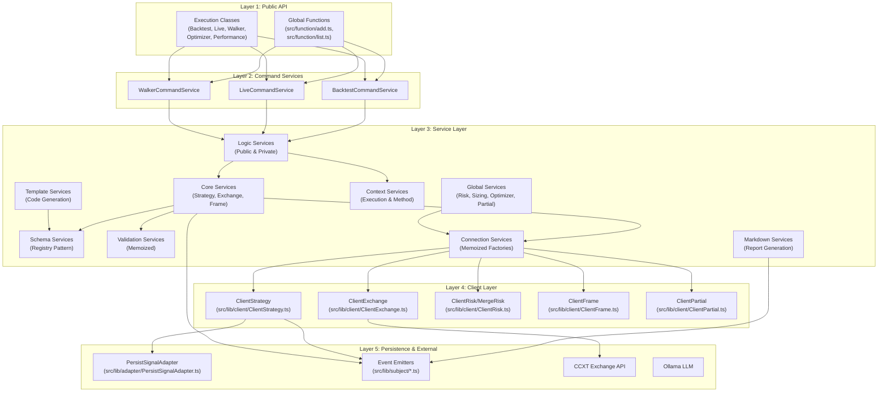
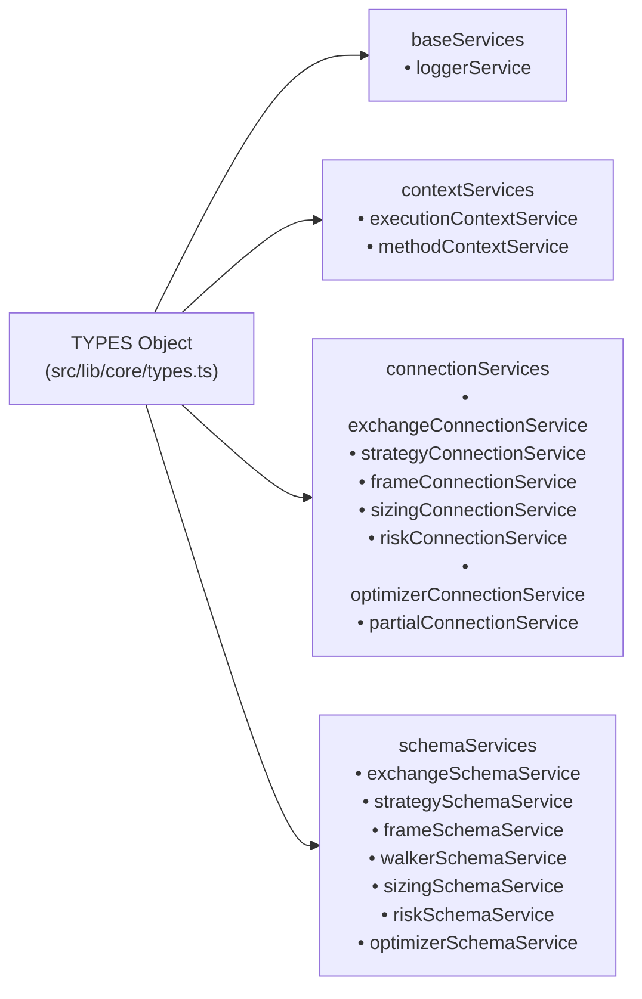
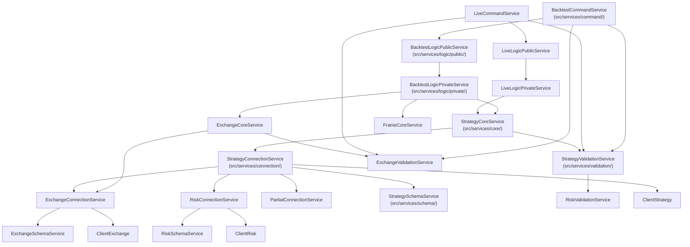
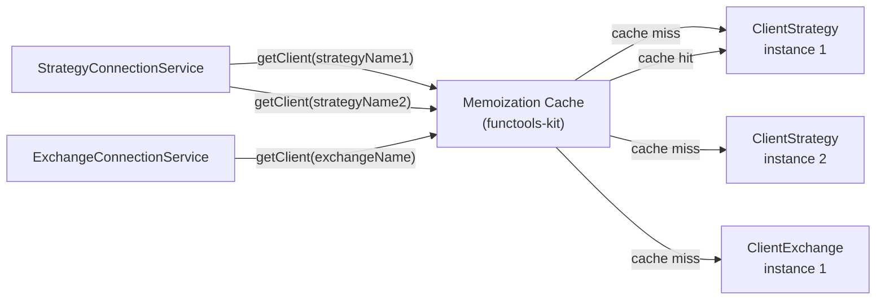
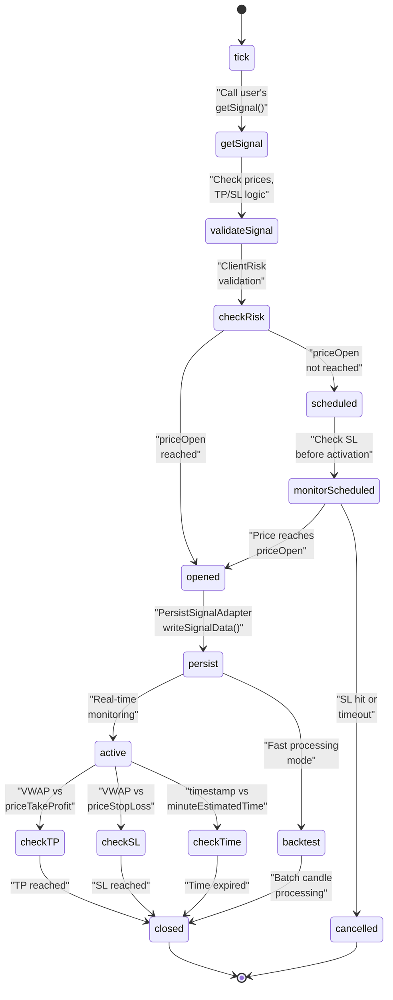
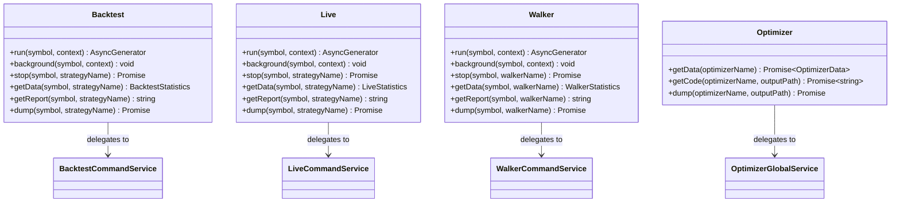
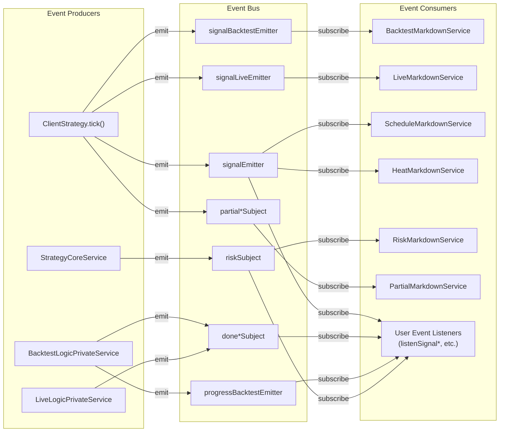
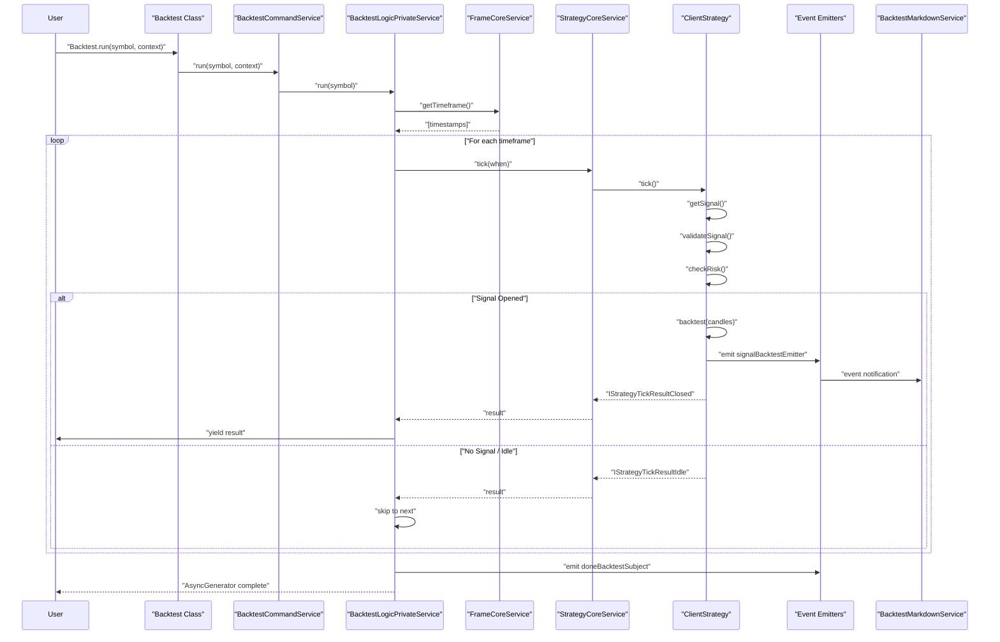
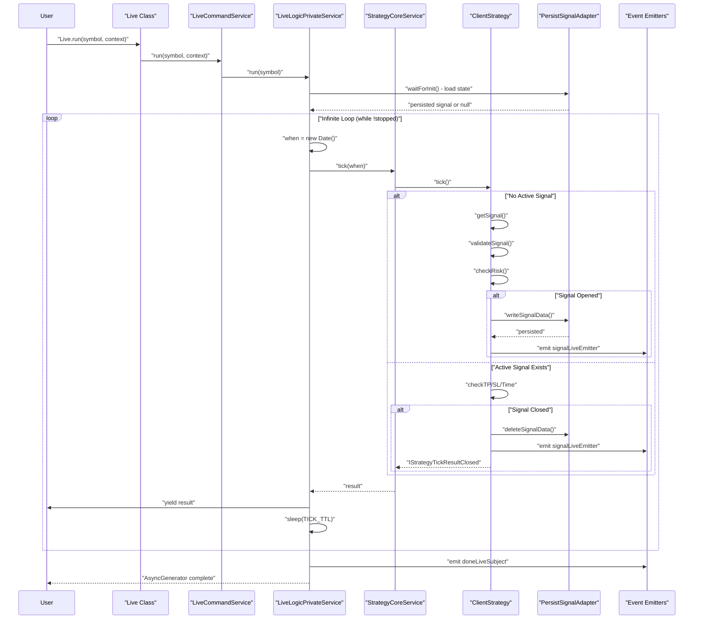
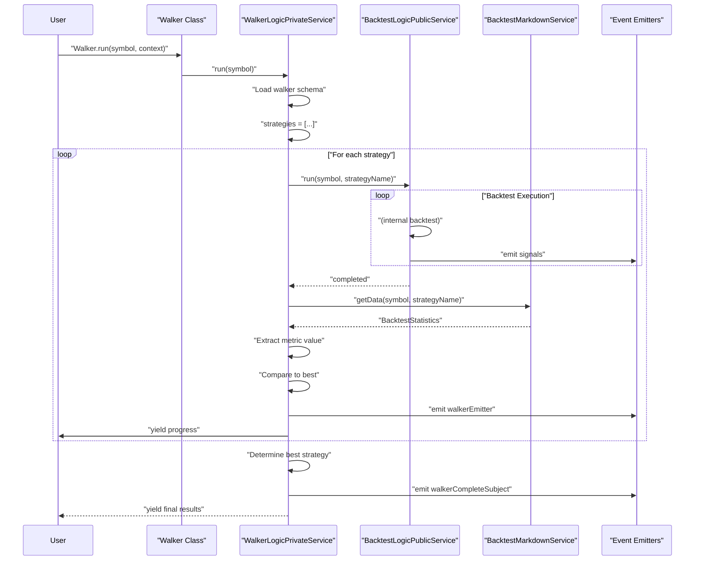

# Architecture Overview

This page describes the high-level system architecture of Backtest Kit, focusing on the layered design and how components interact. It covers the dependency injection system, service organization, client layer structure, and data flow patterns.

For details on execution modes (Backtest, Live, Walker), see [Execution Modes](./20_execution-modes.md). For the signal lifecycle state machine, see [Signals & Signal Lifecycle](./08_core-concepts.md). For the event system details, see [Event System Architecture](./14_architecture-deep-dive.md).

## System Layers

Backtest Kit follows a clean architecture pattern with five distinct layers that separate concerns and enable testability. The layers enforce unidirectional dependencies from top to bottom.




## Dependency Injection System

The framework uses a custom dependency injection container built on `di-kit` that manages service instantiation and lifecycle. All services are registered via Symbol tokens defined in `TYPES`.

### TYPES Symbol Registry



| Service Category | Symbol Examples | Lifecycle | Purpose |
|-----------------|----------------|-----------|---------|
| **Base Services** | `loggerService` | Singleton | Centralized logging with context propagation |
| **Context Services** | `executionContextService`, `methodContextService` | Singleton | Ambient context using `di-scoped` AsyncLocalStorage |
| **Schema Services** | `strategySchemaService`, `exchangeSchemaService` | Singleton | Immutable configuration storage via `ToolRegistry` |
| **Validation Services** | `strategyValidationService`, `exchangeValidationService` | Singleton | Memoized existence checks |
| **Connection Services** | `strategyConnectionService`, `exchangeConnectionService` | Singleton | Memoized client instance factories |
| **Core Services** | `strategyCoreService`, `exchangeCoreService` | Singleton | Business logic orchestration |
| **Global Services** | `riskGlobalService`, `sizingGlobalService` | Singleton | Shared state across strategies |
| **Logic Services** | `backtestLogicPrivateService`, `liveLogicPrivateService` | Singleton | Async generator execution loops |
| **Command Services** | `backtestCommandService`, `liveCommandService` | Singleton | Public API wrappers |
| **Markdown Services** | `backtestMarkdownService`, `liveMarkdownService` | Singleton | Event subscribers for reporting |
| **Template Services** | `optimizerTemplateService` | Singleton | Code generation for optimizer |


### Service Registration Pattern

Services are registered in `src/lib/core/provide.ts:1-143` using the `provide()` function with lazy factory patterns. The `backtest` object aggregates all service references via `inject()`:

```typescript
// From src/lib/core/provide.ts
provide(TYPES.strategyConnectionService, () => new StrategyConnectionService());

// From src/lib/index.ts
const connectionServices = {
  strategyConnectionService: inject<StrategyConnectionService>(
    TYPES.strategyConnectionService
  ),
};

export const backtest = {
  ...baseServices,
  ...connectionServices,
  // ... other categories
};
```

The `init()` function is called at module load to trigger service initialization: `src/lib/index.ts:240`.


## Service Layer Architecture

The service layer consists of 11 categories organized by responsibility. Services never directly instantiate dependencies; instead they use dependency injection.

### Service Dependency Graph




### Context Propagation Services

Two context services use `di-scoped` library to propagate ambient information through the call stack without explicit parameter passing:

**ExecutionContextService** (`src/services/context/ExecutionContextService.ts`) provides:
- `symbol: string` - Trading pair symbol
- `when: Date` - Current execution timestamp
- `backtest: boolean` - Execution mode flag

**MethodContextService** (`src/services/context/MethodContextService.ts`) provides:
- `strategyName: string` - Active strategy identifier
- `exchangeName: string` - Active exchange identifier  
- `frameName?: string` - Active frame identifier (backtest only)

Both services wrap execution blocks using `runInContext()` method that leverages Node.js `AsyncLocalStorage` for context isolation.


### Connection Services (Memoized Factories)

Connection services create and cache client instances using `functools-kit` memoization. The cache key is typically the schema name:



This pattern ensures:
- Only one client instance per unique schema name
- Efficient memory usage
- State preservation across multiple strategy executions
- Fast lookup for repeated access


## Client Layer (Pure Business Logic)

The client layer contains pure TypeScript classes with no dependency injection. All methods are prototype methods (not arrow functions) for memory efficiency. Clients receive dependencies via constructor parameters.

### Client Class Hierarchy

| Client Class | File Path | Responsibility | Key Methods |
|--------------|-----------|----------------|-------------|
| `ClientStrategy` | `src/lib/client/ClientStrategy.ts` | Signal lifecycle, validation, persistence | `tick()`, `backtest()`, `getSignal()` |
| `ClientExchange` | `src/lib/client/ClientExchange.ts` | Candle data, VWAP calculation, price formatting | `getCandles()`, `getAveragePrice()` |
| `ClientFrame` | `src/lib/client/ClientFrame.ts` | Timeframe generation for backtesting | `getTimeframe()` |
| `ClientRisk` | `src/lib/client/ClientRisk.ts` | Risk validation, position tracking | `checkSignal()`, `addSignal()`, `removeSignal()` |
| `MergeRisk` | `src/lib/client/ClientRisk.ts` | Combines multiple risk profiles | `checkSignal()` |
| `ClientPartial` | `src/lib/client/ClientPartial.ts` | Profit/loss milestone tracking | `checkPartials()` |
| `ClientOptimizer` | `src/lib/client/ClientOptimizer.ts` | LLM-powered strategy generation | `getData()`, `getCode()` |


### ClientStrategy Signal Processing Flow



The `tick()` method at `src/lib/client/ClientStrategy.ts` orchestrates the entire signal lifecycle with interval throttling to prevent spam.


## Public API Layer

The public API consists of global functions and execution classes that provide the primary interface for users. All functions are exported from `src/index.ts`.

### Configuration Functions

| Function | File | Purpose |
|----------|------|---------|
| `addStrategy()` | `src/function/add.ts:52-64` | Register `IStrategySchema` with validation |
| `addExchange()` | `src/function/add.ts:101-113` | Register `IExchangeSchema` for data source |
| `addFrame()` | `src/function/add.ts:145-151` | Register `IFrameSchema` for backtest period |
| `addRisk()` | `src/function/add.ts:270-282` | Register `IRiskSchema` with custom validations |
| `addWalker()` | `src/function/add.ts:190-202` | Register `IWalkerSchema` for strategy comparison |
| `addSizing()` | `src/function/add.ts:256-268` | Register `ISizingSchema` for position sizing |
| `addOptimizer()` | `src/function/add.ts:294-306` | Register `IOptimizerSchema` for LLM strategy generation |
| `setConfig()` | `src/function/config.ts` | Modify `GLOBAL_CONFIG` parameters |
| `setLogger()` | `src/function/logger.ts` | Plug in custom `ILogger` implementation |

### Execution Classes



Each execution class provides three consumption patterns:
1. **Async Iterator**: `for await (const event of Backtest.run(...))`
2. **Background Execution**: `Backtest.background(...)` with event listeners
3. **Statistics/Reports**: `getData()`, `getReport()`, `dump()` methods


## Event-Driven Architecture

The event system uses RxJS Subject pattern for decoupled communication between producers (strategy execution) and consumers (markdown services, user listeners).

### Event Emitters

| Emitter | File Path | Emits When | Payload Type |
|---------|-----------|------------|--------------|
| `signalEmitter` | `src/lib/subject/signalEmitter.ts` | Every tick (all modes) | `IStrategyTickResult` |
| `signalBacktestEmitter` | `src/lib/subject/signalBacktestEmitter.ts` | Backtest mode only | `IStrategyTickResult` |
| `signalLiveEmitter` | `src/lib/subject/signalLiveEmitter.ts` | Live mode only | `IStrategyTickResult` |
| `progressBacktestEmitter` | `src/lib/subject/progressBacktestEmitter.ts` | Frame completion | `number` (percentage) |
| `walkerEmitter` | `src/lib/subject/walkerEmitter.ts` | Strategy completion in walker | `WalkerContract` |
| `walkerCompleteSubject` | `src/lib/subject/walkerCompleteSubject.ts` | Walker finishes all strategies | `WalkerCompleteContract` |
| `doneBacktestSubject` | `src/lib/subject/doneBacktestSubject.ts` | Backtest completes | `DoneContract` |
| `doneLiveSubject` | `src/lib/subject/doneLiveSubject.ts` | Live execution stops | `DoneContract` |
| `doneWalkerSubject` | `src/lib/subject/doneWalkerSubject.ts` | Walker completes | `DoneContract` |
| `riskSubject` | `src/lib/subject/riskSubject.ts` | Signal fails risk validation | `RiskContract` |
| `performanceEmitter` | `src/lib/subject/performanceEmitter.ts` | Execution timing metrics | `PerformanceContract` |
| `partialProfitSubject` | `src/lib/subject/partialProfitSubject.ts` | Profit milestone reached | `PartialContract` |
| `partialLossSubject` | `src/lib/subject/partialLossSubject.ts` | Loss milestone reached | `PartialContract` |
| `errorEmitter` | `src/lib/subject/errorEmitter.ts` | Recoverable error occurs | `Error` |
| `exitEmitter` | `src/lib/subject/exitEmitter.ts` | Fatal error (terminate) | `Error` |

### Event Flow Architecture



All user event listeners use `functools-kit` `queued` wrapper (`src/function/listen.ts`) to ensure sequential async processing, preventing race conditions during high-frequency event emission.


## Data Flow Patterns

The framework implements three primary data flow patterns corresponding to the three execution modes.

### Backtest Data Flow



Key characteristics:
- Deterministic timeframe iteration via `src/services/logic/private/BacktestLogicPrivateService.ts`
- Fast-forward optimization: skip timeframes while signal is active
- Bulk candle processing via `backtest()` method
- All events buffered in markdown services (max 250 per key)


### Live Trading Data Flow



Key characteristics:
- Infinite loop with sleep intervals via `src/services/logic/private/LiveLogicPrivateService.ts`
- Crash-safe persistence: only opened signals are saved
- Graceful shutdown: waits for `IStrategyTickResultClosed` before exiting
- Real-time VWAP pricing from last 5 1-minute candles


### Walker Strategy Comparison Flow



Key characteristics:
- Sequential backtest execution per strategy
- Metric-based ranking (Sharpe ratio, win rate, etc.)
- Progress events via `walkerEmitter` after each strategy
- Final comparison results via `walkerCompleteSubject`


## Summary

The Backtest Kit architecture achieves production-readiness through:

1. **Separation of Concerns**: Five distinct layers with unidirectional dependencies
2. **Dependency Injection**: Custom DI container with Symbol-based tokens and lazy initialization
3. **Context Propagation**: AsyncLocalStorage-based ambient context eliminates parameter passing
4. **Memoization**: Cached client instances prevent redundant instantiation
5. **Event-Driven Design**: Decoupled producers and consumers via RxJS Subject pattern
6. **Type Safety**: Discriminated unions for state machines and execution results
7. **Memory Efficiency**: Prototype methods, bounded event queues, async generators
8. **Crash Recovery**: Atomic file writes with state restoration on startup

The architecture enables identical code to run in backtest and live modes while maintaining determinism, testability, and extensibility.
