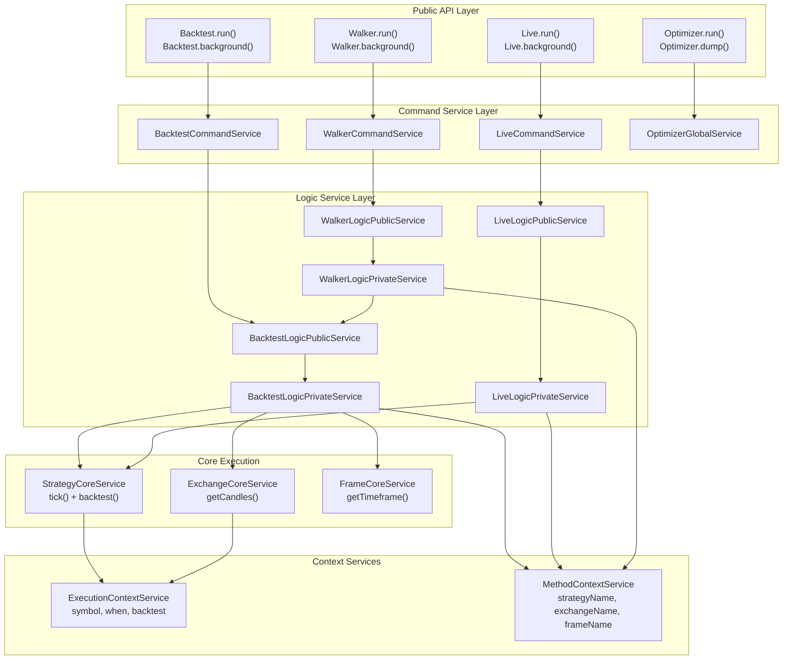
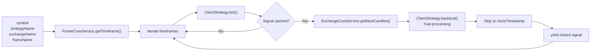
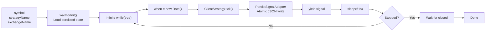
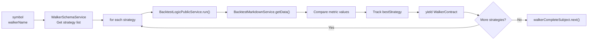
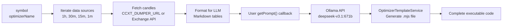
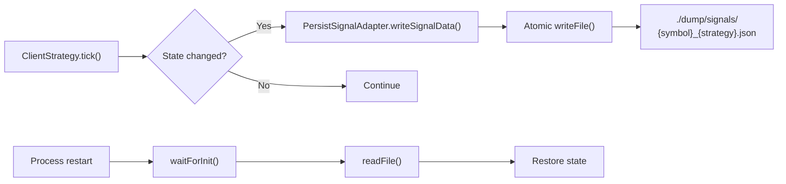

# Execution Modes Overview

# Execution Modes Overview

<details>
<summary>Relevant source files</summary>

The following files were used as context for generating this wiki page:

- [assets/uml.svg](assets/uml.svg)
- [docs/classes/WalkerCommandService.md](docs/classes/WalkerCommandService.md)
- [docs/interfaces/BacktestStatistics.md](docs/interfaces/BacktestStatistics.md)
- [docs/interfaces/IStrategyCallbacks.md](docs/interfaces/IStrategyCallbacks.md)
- [docs/interfaces/LiveStatistics.md](docs/interfaces/LiveStatistics.md)
- [docs/internals.md](docs/internals.md)
- [docs/types/IStrategyTickResult.md](docs/types/IStrategyTickResult.md)
- [docs/uml.puml](docs/uml.puml)
- [scripts/uml.mjs](scripts/uml.mjs)
- [src/classes/Backtest.ts](src/classes/Backtest.ts)
- [src/classes/Live.ts](src/classes/Live.ts)
- [src/classes/Walker.ts](src/classes/Walker.ts)
- [src/config/emitters.ts](src/config/emitters.ts)
- [src/function/event.ts](src/function/event.ts)
- [src/index.ts](src/index.ts)
- [types.d.ts](types.d.ts)

</details>


## Purpose and Scope

This document provides a comparative overview of the four execution modes available in backtest-kit: **Backtest**, **Live**, **Walker**, and **Optimizer**. Each mode serves a distinct purpose in the strategy development and deployment lifecycle, from historical simulation to real-time trading to strategy comparison to LLM-based code generation.

For detailed implementation specifics of each mode, see: Backtest Mode ([5.1](./17-backtest-mode.md)), Live Trading Mode ([5.2](./18-live-trading-mode.md)), Walker Mode ([5.3](./19-walker-mode.md)), and Optimizer Mode ([5.4](./20-optimizer-mode.md)).

For information about the signal lifecycle that underpins all execution modes, see Signal Lifecycle and State Machine ([2.1](./03-signal-lifecycle-and-state-machine.md)).

## Execution Modes

The framework implements four distinct execution modes, each with different characteristics and use cases:

| Mode | Purpose | Data Source | Execution Pattern | Output | Persistence |
|------|---------|-------------|-------------------|--------|-------------|
| **Backtest** | Historical simulation | Frame timeframes | Finite generator | Closed signals only | None (stateless) |
| **Live** | Real-time trading | Current time | Infinite generator | All tick types | Crash-safe JSON files |
| **Walker** | Strategy comparison | Sequential backtests | Finite generator | Comparative statistics | None (delegates to Backtest) |
| **Optimizer** | LLM code generation | Multi-timeframe data | Single execution | Generated .mjs file | File system output |

**Sources:** [src/classes/Backtest.ts:1-594](), [src/classes/Live.ts:1-607](), [src/classes/Walker.ts:1-643](), [types.d.ts:1-365609]()

## Mode Architecture Overview



**Sources:** [src/classes/Backtest.ts:355-593](), [src/classes/Live.ts:372-606](), [src/classes/Walker.ts:418-643](), [src/lib/index.ts:1-195]()

## Backtest Mode

### Purpose
Executes a strategy against historical data to evaluate performance. Optimized for speed with timeframe skipping and fast candle processing.

### Key Characteristics



**Entry Point:** `Backtest.run(symbol, context)` where context contains `{ strategyName, exchangeName, frameName }`

**Execution Context:**
- `when` = timeframe timestamp (Date from array)
- `backtest` = `true`
- Finite loop (ends when timeframes exhausted)

**Performance Optimizations:**
- Timeframe array pre-generated by `FrameCoreService`
- Fast candle processing via `ClientStrategy.backtest()` instead of individual ticks
- Skip-to-close optimization: jumps directly to `closeTimestamp` after signal opens
- No persistence overhead (stateless execution)

**Output:** Async generator yielding `IStrategyTickResultClosed` only. Filters out idle/active states.

**Sources:** [src/classes/Backtest.ts:355-593](), [src/lib/services/logic/private/BacktestLogicPrivateService.ts:1-199](), [types.d.ts:974-1095]()

## Live Mode

### Purpose
Executes a strategy in real-time with crash-safe state persistence. Designed for production trading environments.

### Key Characteristics



**Entry Point:** `Live.run(symbol, context)` where context contains `{ strategyName, exchangeName }`

**Execution Context:**
- `when` = `new Date()` (current timestamp)
- `backtest` = `false`
- Infinite loop (runs until manually stopped)

**Crash Recovery:**
- `PersistSignalAdapter` writes state to `./dump/signals/{symbol}_{strategyName}.json`
- Atomic writes via `writeFile()` ensure consistency
- `waitForInit()` loads persisted state on startup
- Process can crash and restart - state recovered from disk

**Graceful Shutdown:**
- `stop()` sets internal flag to prevent new signals
- Background mode waits for `signal.action === "closed"` before breaking loop
- Ensures open positions complete normally before exit

**Output:** Async generator yielding all tick types: `idle`, `opened`, `active`, `closed`, `scheduled`, `cancelled`

**Sources:** [src/classes/Live.ts:372-606](), [src/lib/services/logic/private/LiveLogicPrivateService.ts:1-134](), [types.d.ts:974-1095]()

## Walker Mode

### Purpose
Compares multiple strategies against the same historical data to identify the best performer based on a chosen metric (e.g., Sharpe ratio, win rate).

### Key Characteristics



**Entry Point:** `Walker.run(symbol, { walkerName })` where `walkerName` references a walker schema

**Walker Schema Structure:**
```typescript
interface IWalkerSchema {
  walkerName: string;
  strategies: StrategyName[];  // List of strategies to compare
  exchangeName: string;         // Shared exchange
  frameName: string;            // Shared timeframe
  metric?: WalkerMetric;        // Comparison metric (default: sharpeRatio)
}
```

**Execution Flow:**
1. Iterate through `strategies[]` array sequentially
2. Run full backtest for each strategy via `BacktestLogicPublicService`
3. Retrieve statistics via `BacktestMarkdownService.getData()`
4. Compare metric value with current best
5. Yield progress update with `bestStrategy` and `bestMetric`
6. Emit final results via `walkerCompleteSubject`

**Stop Mechanism:**
- Uses `walkerStopSubject` for inter-strategy communication
- Filtered by `walkerName` to support multiple concurrent walkers
- Stops current running strategy and prevents subsequent strategies from executing

**Output:** Async generator yielding `WalkerContract` after each strategy completion

**Sources:** [src/classes/Walker.ts:418-643](), [src/lib/services/logic/private/WalkerLogicPrivateService.ts:1-204](), [types.d.ts:2175-2257]()

## Optimizer Mode

### Purpose
Generates complete strategy code using LLM (Ollama API) based on historical market data and user-provided prompts. Outputs executable .mjs files.

### Key Characteristics



**Entry Point:** `Optimizer.run(symbol, { optimizerName })` where `optimizerName` references an optimizer schema

**Optimizer Schema Structure:**
```typescript
interface IOptimizerSchema {
  optimizerName: string;
  sources: IOptimizerSource[];       // Data sources (intervals + ranges)
  getPrompt: (data: IOptimizerData) => Promise<string>;  // LLM prompt generator
  callbacks?: {
    onProgress?: (source: IOptimizerSource, data: ICandleData[]) => void;
  };
}
```

**Data Source Iteration:**
- Each source specifies: `interval` (e.g., "1h"), `since`, `until`, `limit`
- Framework fetches historical candles for each source
- Progress tracked via `progressOptimizerEmitter`

**LLM Integration:**
- Formats candle data as markdown tables in user/assistant message pairs
- User provides custom `getPrompt()` callback for strategy logic
- Calls Ollama API with `deepseek-v3.1:671b` model
- Receives generated strategy code as response

**Template System:**
- `OptimizerTemplateService.generate()` wraps LLM output in complete executable
- Generated file includes: imports, `addExchange()`, `addStrategy()`, `addFrame()`, `addWalker()`, `Walker.background()`
- Output is a fully functional backtest-kit script

**File Output:** `Optimizer.dump()` writes to `./{optimizerName}_{symbol}.mjs`

**Output:** Returns generated code string, no async generator pattern

**Sources:** [types.d.ts:2507-2647](), [src/lib/services/template/OptimizerTemplateService.ts:1-203](), [demo/optimization/src/index.mjs:1-154]()

## Mode Comparison by Data Flow

### Time Progression

| Mode | Time Source | Pattern | Range |
|------|-------------|---------|-------|
| Backtest | `FrameCoreService.getTimeframe()` | Pre-generated array | `startDate` to `endDate` at fixed intervals |
| Live | `new Date()` | Real-time clock | Open-ended (infinite) |
| Walker | Delegates to Backtest | Sequential backtests | Same as configured Frame |
| Optimizer | Specified in sources | Historical fetch | Per-source date ranges |

### Signal Output Filtering

```mermaid
graph TB
    subgraph Backtest["Backtest Mode"]
        B_All["All tick types"] --> B_Filter["Filter: closed only"]
        B_Filter --> B_Yield["yield closed signals"]
    end
    
    subgraph Live["Live Mode"]
        L_All["All tick types"] --> L_Filter["Filter: opened + closed"]
        L_Filter --> L_Yield["yield opened/closed<br/>No idle/active"]
    end
    
    subgraph Walker["Walker Mode"]
        W_All["Backtest signals"] --> W_Stats["Aggregate to stats"]
        W_Stats --> W_Yield["yield progress after each strategy"]
    end
    
    subgraph Optimizer["Optimizer Mode"]
        O_Candles["Historical candles"] --> O_LLM["LLM processing"]
        O_LLM --> O_Code["return code string"]
    end
```



**Backtest Filtering Logic:** [src/lib/services/logic/private/BacktestLogicPrivateService.ts:80-95]()
```typescript
if (result.action === "closed") {
  yield result;  // Only yield closed signals
}
// idle, opened, active, scheduled, cancelled are not yielded
```

**Live Filtering Logic:** [src/lib/services/logic/private/LiveLogicPrivateService.ts:95-115]()
```typescript
if (result.action === "opened" || result.action === "closed") {
  yield result;  // Only yield opened and closed
}
// idle and active are filtered out to reduce noise
```

**Sources:** [src/lib/services/logic/private/BacktestLogicPrivateService.ts:1-199](), [src/lib/services/logic/private/LiveLogicPrivateService.ts:1-134]()

## Persistence Patterns

### Backtest: Stateless

- No persistence layer
- All state in memory during execution
- Cleared on completion via `clear()` methods
- Markdown reports generated on-demand via `getData()`/`getReport()`

### Live: Crash-Safe



**Persistence Implementation:** [src/classes/Persist.ts:1-372]()

**Atomic Write Pattern:**
- `PersistSignalAdapter.writeSignalData()` writes entire state object
- Uses `await writeFile()` for atomic operation (no partial writes)
- Crash during write leaves previous valid state intact

**State Recovery:**
- `ClientStrategy.waitForInit()` calls `PersistSignalAdapter.readSignalData()`
- Returns `null` if no persisted state exists (first run)
- Returns `ISignalRow` if previous state exists (recovery)

**Sources:** [src/classes/Persist.ts:1-372](), [src/client/ClientStrategy.ts:1-874]()

## When to Use Each Mode

### Use Backtest When:
- Validating strategy logic against historical data
- Measuring performance metrics (Sharpe ratio, win rate, etc.)
- Speed is critical (need fast iteration)
- No persistence required
- Testing parameter sensitivity
- Generating performance reports

### Use Live When:
- Deploying to production trading
- Need crash-safe state persistence
- Real-time market data required
- Long-running process (days/weeks)
- Monitoring open positions
- Graceful shutdown critical

### Use Walker When:
- Comparing multiple strategies on same data
- A/B testing different parameters
- Finding optimal strategy for a symbol
- Need automated metric-based selection
- Batch processing multiple strategies
- Building strategy leaderboards

### Use Optimizer When:
- Generating strategy code via LLM
- Need multi-timeframe data analysis
- Automating strategy creation
- Exploring new trading ideas with AI
- Exporting complete executable code
- Iterative prompt engineering

**Sources:** [docs/internals.md:104-113](), [types.d.ts:1-365609]()

## Code Entry Points

### Backtest Execution

**Singleton API:**
```typescript
import { Backtest } from "backtest-kit";

// Run and consume results
for await (const signal of Backtest.run("BTCUSDT", {
  strategyName: "my-strategy",
  exchangeName: "binance",
  frameName: "1d-backtest"
})) {
  console.log("Closed signal PNL:", signal.pnl.pnlPercentage);
}

// Background execution
const cancel = Backtest.background("BTCUSDT", { /*...*/ });
```

**Instance API:**
```typescript
import { BacktestInstance } from "backtest-kit";

const instance = new BacktestInstance("BTCUSDT", "my-strategy");
for await (const signal of instance.run("BTCUSDT", { /*...*/ })) {
  // Process signal
}
```

**Location:** [src/classes/Backtest.ts:355-593]()

### Live Execution

**Singleton API:**
```typescript
import { Live } from "backtest-kit";

// Run and consume results
for await (const signal of Live.run("BTCUSDT", {
  strategyName: "my-strategy",
  exchangeName: "binance"
})) {
  if (signal.action === "opened") {
    console.log("Position opened");
  } else if (signal.action === "closed") {
    console.log("Position closed:", signal.pnl.pnlPercentage);
  }
}

// Background execution
const cancel = Live.background("BTCUSDT", { /*...*/ });
```

**Instance API:**
```typescript
import { LiveInstance } from "backtest-kit";

const instance = new LiveInstance("BTCUSDT", "my-strategy");
for await (const signal of instance.run("BTCUSDT", { /*...*/ })) {
  // Process signal
}
```

**Location:** [src/classes/Live.ts:372-606]()

### Walker Execution

**Singleton API:**
```typescript
import { Walker } from "backtest-kit";

// Run and consume results
for await (const progress of Walker.run("BTCUSDT", {
  walkerName: "my-walker"
})) {
  console.log("Progress:", progress.strategiesTested, "/", progress.totalStrategies);
  console.log("Best strategy:", progress.bestStrategy, progress.bestMetric);
}

// Background execution
const cancel = Walker.background("BTCUSDT", { walkerName: "my-walker" });
```

**Instance API:**
```typescript
import { WalkerInstance } from "backtest-kit";

const instance = new WalkerInstance("BTCUSDT", "my-walker");
for await (const progress of instance.run("BTCUSDT", { /*...*/ })) {
  // Process progress
}
```

**Location:** [src/classes/Walker.ts:418-643]()

### Optimizer Execution

**Singleton API:**
```typescript
import { Optimizer } from "backtest-kit";

// Generate strategy code
const code = await Optimizer.run("BTCUSDT", {
  optimizerName: "my-optimizer"
});

// Save to file
await Optimizer.dump("BTCUSDT", "my-optimizer");
// Creates: ./my-optimizer_BTCUSDT.mjs
```

**Location:** [types.d.ts:2507-2647](), [demo/optimization/src/index.mjs:1-154]()

## Event Emitters by Mode

Each execution mode emits to specific event subjects for monitoring:

| Mode | Signal Emitter | Progress Emitter | Completion Emitter |
|------|----------------|------------------|-------------------|
| Backtest | `signalBacktestEmitter` | `progressBacktestEmitter` | `doneBacktestSubject` |
| Live | `signalLiveEmitter` | N/A | `doneLiveSubject` |
| Walker | N/A (uses `walkerEmitter`) | `progressWalkerEmitter` | `doneWalkerSubject`, `walkerCompleteSubject` |
| Optimizer | N/A | `progressOptimizerEmitter` | N/A |

**Common Emitters:**
- `signalEmitter` - Receives all signals from both Backtest and Live
- `errorEmitter` - Recoverable errors during background execution
- `exitEmitter` - Fatal errors requiring process termination
- `performanceEmitter` - Execution metrics across all modes

**Sources:** [src/config/emitters.ts:1-133](), [src/function/event.ts:1-610]()