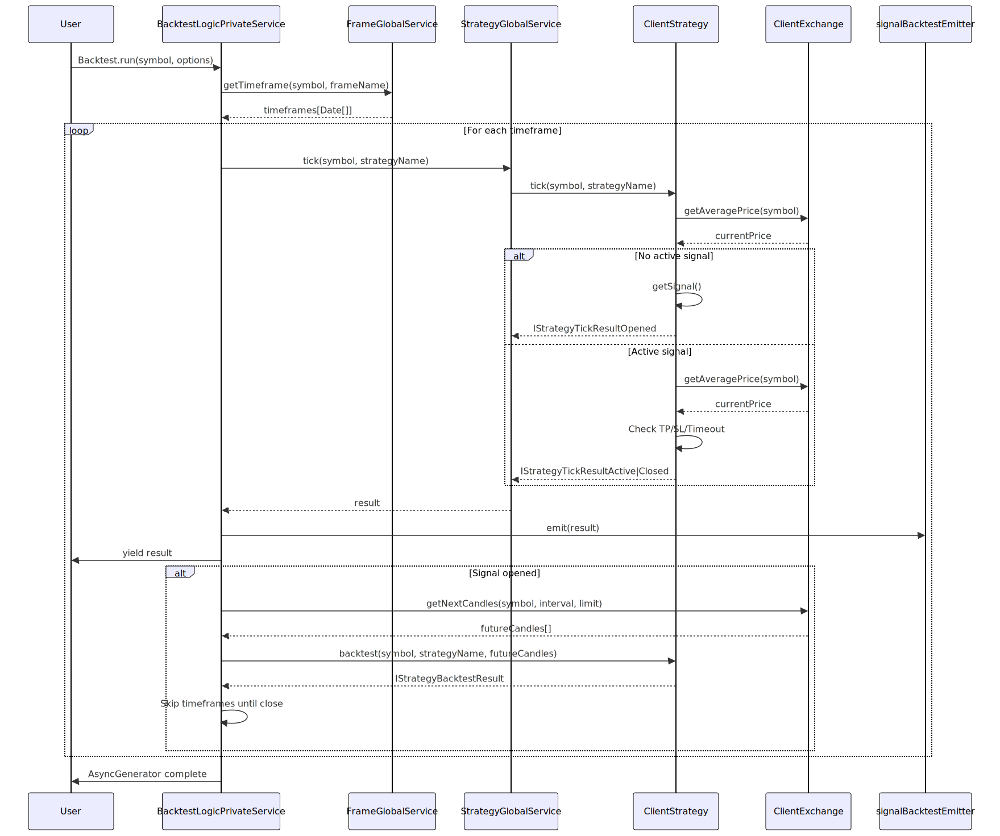

# Quick Start Guide

This guide demonstrates a minimal working example of the backtest-kit framework. You'll learn how to register a strategy, configure an exchange data source, set up a timeframe, and execute a backtest. For installation instructions, see [Installation and Setup](./03_Installation_and_Setup.md). For deeper understanding of execution modes and lifecycle concepts, see [Core Concepts](./05_Core_Concepts.md) and [Component Registration](./08_Component_Registration.md).

## Overview: The Basic Flow

A minimal backtest workflow consists of four registration steps followed by execution:




## Step 1: Exchange Configuration

The exchange provides historical candle data for backtesting. You must implement the `IExchangeSchema` interface with three required methods:

- `getCandles`: Fetch OHLCV data
- `formatPrice`: Format price to exchange precision
- `formatQuantity`: Format quantity to exchange precision

```typescript
import { addExchange, ICandleData, CandleInterval } from 'backtest-kit';

addExchange({
  exchangeName: "binance",
  
  async getCandles(
    symbol: string,
    interval: CandleInterval,
    since: Date,
    limit: number
  ): Promise<ICandleData[]> {
    // Return historical candles from your data source
    // This example returns mock data
    const candles: ICandleData[] = [];
    const intervalMs = 60000; // 1 minute
    
    for (let i = 0; i < limit; i++) {
      const timestamp = since.getTime() + i * intervalMs;
      candles.push({
        timestamp,
        open: 50000 + Math.random() * 100,
        high: 50100 + Math.random() * 100,
        low: 49900 + Math.random() * 100,
        close: 50000 + Math.random() * 100,
        volume: 100
      });
    }
    
    return candles;
  },
  
  async formatPrice(symbol: string, price: number): Promise<string> {
    return price.toFixed(2); // 2 decimal places for BTC
  },
  
  async formatQuantity(symbol: string, quantity: number): Promise<string> {
    return quantity.toFixed(8); // 8 decimal places
  }
});
```

**Key Points:**
- `exchangeName` must be unique across all registered exchanges
- `getCandles` is called automatically during backtest execution
- The framework uses `getCandles` to fetch data backwards from execution time
- `ICandleData` requires: `timestamp`, `open`, `high`, `low`, `close`, `volume`


## Step 2: Frame Configuration

The frame defines the backtest period and iteration interval:

```typescript
import { addFrame, FrameInterval } from 'backtest-kit';

addFrame({
  frameName: "1d-test",
  interval: "1m",  // Tick every 1 minute
  startDate: new Date("2024-01-01T00:00:00Z"),
  endDate: new Date("2024-01-02T00:00:00Z") // 1 day backtest
});
```

**Available Intervals:** `"1m"`, `"3m"`, `"5m"`, `"15m"`, `"30m"`, `"1h"`, `"2h"`, `"4h"`, `"6h"`, `"8h"`, `"12h"`, `"1d"`, `"3d"`

The framework generates timestamps at the specified interval between `startDate` and `endDate`. Each timestamp triggers a `tick()` call on your strategy.


## Step 3: Strategy Definition

The strategy implements your trading logic. At minimum, you must provide:

- `strategyName`: Unique identifier
- `interval`: Signal generation throttle (minimum time between `getSignal` calls)
- `getSignal`: Function that returns trading signals or `null`

```typescript
import { addStrategy, ISignalDto, SignalInterval } from 'backtest-kit';

addStrategy({
  strategyName: "simple-long",
  interval: "5m" as SignalInterval, // Check for signals every 5 minutes
  
  async getSignal(symbol: string, when: Date): Promise<ISignalDto | null> {
    // Your strategy logic here
    // Return null when no signal, or return a signal object
    
    // Example: Always long when price is available
    return {
      position: "long",
      note: "Simple long strategy",
      // priceOpen: undefined means open immediately at current price
      priceTakeProfit: 51000,  // Exit at +2% profit
      priceStopLoss: 49000,     // Exit at -2% loss
      minuteEstimatedTime: 60   // Close after 60 minutes if not hit
    };
  }
});
```

**Signal Fields:**
- `position`: `"long"` (buy) or `"short"` (sell)
- `priceOpen` (optional): Entry price for scheduled signals (limit orders). If omitted, opens immediately at current VWAP
- `priceTakeProfit`: Target profit exit price
- `priceStopLoss`: Risk management exit price
- `minuteEstimatedTime`: Maximum signal lifetime in minutes

**Validation Rules:**
- **LONG**: `priceStopLoss < priceOpen < priceTakeProfit`
- **SHORT**: `priceTakeProfit < priceOpen < priceStopLoss`
- All prices must be positive and finite
- `minuteEstimatedTime` must be positive integer


## Step 4: Running the Backtest

Execute the backtest with `Backtest.run()`:

```typescript
import { Backtest } from 'backtest-kit';

// Synchronous execution - waits for completion
for await (const result of Backtest.run("BTCUSDT", {
  strategyName: "simple-long",
  exchangeName: "binance",
  frameName: "1d-test"
})) {
  console.log(`Action: ${result.action}`);
  
  if (result.action === "closed") {
    console.log(`PNL: ${result.pnl.pnlPercentage.toFixed(2)}%`);
    console.log(`Reason: ${result.closeReason}`);
  }
}

console.log("Backtest completed!");
```

**Return Type:** `AsyncGenerator<IStrategyTickResult>`

Each iteration yields a tick result with discriminated union type:

| Action | Description | Available Fields |
|--------|-------------|------------------|
| `"idle"` | No active signal | `currentPrice`, `signal: null` |
| `"scheduled"` | Limit order created | `signal: IScheduledSignalRow`, `currentPrice` |
| `"opened"` | Position opened | `signal: ISignalRow`, `currentPrice` |
| `"active"` | Monitoring TP/SL | `signal: ISignalRow`, `currentPrice` |
| `"closed"` | Position closed | `signal`, `pnl`, `closeReason`, `currentPrice` |
| `"cancelled"` | Scheduled signal expired | `signal: IScheduledSignalRow`, `currentPrice` |


## Step 5: Listening to Events

Instead of iterating results, you can listen to events asynchronously:

```typescript
import { listenSignalBacktest, listenDoneBacktest, Backtest } from 'backtest-kit';

// Subscribe to signal events
const unsubscribe = listenSignalBacktest((result) => {
  if (result.action === "closed") {
    console.log(`Signal closed: ${result.signal.id}`);
    console.log(`PNL: ${result.pnl.pnlPercentage.toFixed(2)}%`);
    console.log(`Close reason: ${result.closeReason}`);
  }
});

// Subscribe to completion
listenDoneBacktest((event) => {
  console.log(`Backtest done: ${event.symbol} ${event.strategyName}`);
  unsubscribe(); // Stop listening
});

// Run in background (non-blocking)
Backtest.background("BTCUSDT", {
  strategyName: "simple-long",
  exchangeName: "binance",
  frameName: "1d-test"
});
```

**Available Listeners:**
- `listenSignalBacktest`: All backtest signal events
- `listenSignalLive`: Live trading signal events only
- `listenSignal`: All signal events (both modes)
- `listenDoneBacktest`: Backtest completion
- `listenBacktestProgress`: Progress updates during execution
- `listenError`: Recoverable errors
- `listenExit`: Fatal errors


## Step 6: Getting Results

After execution completes, retrieve statistics:

```typescript
import { Backtest } from 'backtest-kit';

// Get structured data
const stats = await Backtest.getData("BTCUSDT");

console.log(`Total Signals: ${stats.totalSignals}`);
console.log(`Win Rate: ${stats.winRate}%`);
console.log(`Sharpe Ratio: ${stats.sharpeRatio}`);
console.log(`Average PNL: ${stats.avgPnl}%`);
console.log(`Total PNL: ${stats.totalPnl}%`);

// Generate markdown report
const markdown = await Backtest.getReport("BTCUSDT");
console.log(markdown);

// Export to file
await Backtest.dump("BTCUSDT", "./results/backtest-report.md");
```

**Statistics Structure (`BacktestStatistics`):**

| Field | Type | Description |
|-------|------|-------------|
| `totalSignals` | `number` | Count of closed signals |
| `winRate` | `number \| null` | Percentage of profitable trades |
| `avgPnl` | `number \| null` | Average profit/loss per trade |
| `totalPnl` | `number \| null` | Cumulative profit/loss |
| `sharpeRatio` | `number \| null` | Risk-adjusted return metric |
| `certaintyRatio` | `number \| null` | Win probability metric |
| `signalList` | `IStrategyTickResultClosed[]` | All closed signal details |


## Complete Example

```typescript
import {
  addExchange,
  addFrame,
  addStrategy,
  Backtest,
  listenSignalBacktest,
  listenDoneBacktest,
  ICandleData,
  ISignalDto
} from 'backtest-kit';

// 1. Register exchange
addExchange({
  exchangeName: "binance",
  async getCandles(symbol, interval, since, limit): Promise<ICandleData[]> {
    const candles: ICandleData[] = [];
    const intervalMs = 60000;
    
    for (let i = 0; i < limit; i++) {
      const timestamp = since.getTime() + i * intervalMs;
      candles.push({
        timestamp,
        open: 50000 + Math.random() * 1000,
        high: 50500 + Math.random() * 1000,
        low: 49500 + Math.random() * 1000,
        close: 50000 + Math.random() * 1000,
        volume: 100
      });
    }
    return candles;
  },
  async formatPrice(symbol, price) { return price.toFixed(2); },
  async formatQuantity(symbol, quantity) { return quantity.toFixed(8); }
});

// 2. Configure backtest period
addFrame({
  frameName: "1d-test",
  interval: "1m",
  startDate: new Date("2024-01-01T00:00:00Z"),
  endDate: new Date("2024-01-02T00:00:00Z")
});

// 3. Define strategy
let signalGenerated = false;

addStrategy({
  strategyName: "simple-long",
  interval: "5m",
  async getSignal(symbol, when): Promise<ISignalDto | null> {
    if (signalGenerated) return null;
    signalGenerated = true;
    
    return {
      position: "long",
      note: "Test signal",
      priceTakeProfit: 51000,
      priceStopLoss: 49000,
      minuteEstimatedTime: 60
    };
  }
});

// 4. Listen to events
listenSignalBacktest((result) => {
  console.log(`[${result.action}] ${result.symbol}`);
  if (result.action === "closed") {
    console.log(`  PNL: ${result.pnl.pnlPercentage.toFixed(2)}%`);
  }
});

listenDoneBacktest(async (event) => {
  console.log("Backtest completed!");
  
  // 5. Get results
  const stats = await Backtest.getData("BTCUSDT");
  console.log(`Win Rate: ${stats.winRate}%`);
  console.log(`Sharpe Ratio: ${stats.sharpeRatio}`);
  
  // Export report
  await Backtest.dump("BTCUSDT", "./backtest-report.md");
});

// 6. Execute
Backtest.background("BTCUSDT", {
  strategyName: "simple-long",
  exchangeName: "binance",
  frameName: "1d-test"
});
```


## Execution Flow Diagram




## Next Steps

**Essential Reading:**
- [Core Concepts](./05_Core_Concepts.md) - Understanding execution modes and signal lifecycle
- [Component Registration](./08_Component_Registration.md) - Deep dive into registration patterns
- [Signal Lifecycle Overview](./07_Signal_Lifecycle_Overview.md) - State transitions and validation

**Advanced Topics:**
- [Live Trading API](./18_Live_Trading_API.md) - Real-time execution with crash recovery
- [Walker API](./19_Walker_API.md) - Strategy comparison and optimization
- [Risk Management](./65_Risk_Management.md) - Portfolio-level risk controls
- [Custom Exchange Integration](./83_Custom_Exchange_Integration.md) - Implement CCXT or database sources

**Additional Examples:**
- [Backtest API](./17_Backtest_API.md) - Full method reference
- [Event Listeners](./22_Event_Listeners.md) - Complete event API
- [Reporting and Analytics](./69_Reporting_and_Analytics.md) - Performance metrics and statistics

