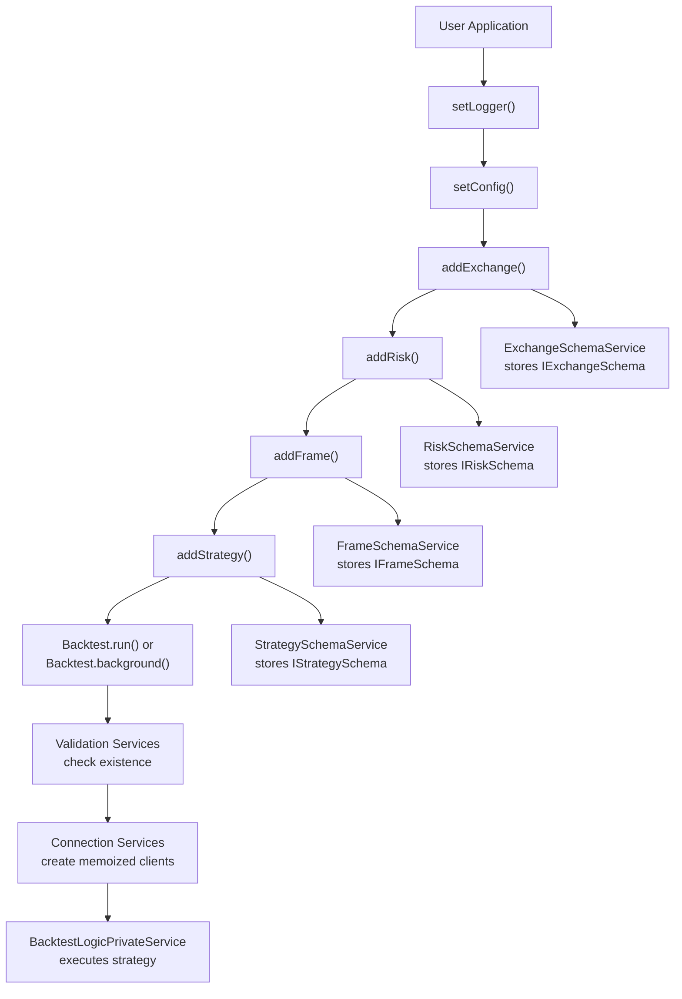
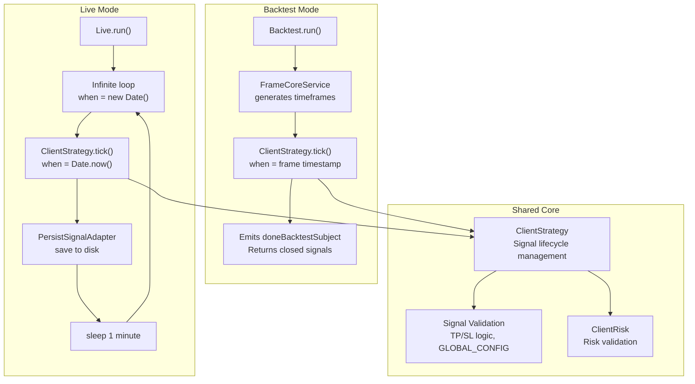
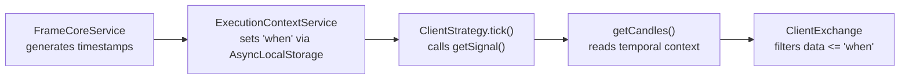

# Getting Started

This page provides a practical guide to installing Backtest Kit and running your first backtest. It covers installation, project setup, component registration, and execution patterns. For advanced topics like strategy development or risk management, see [Strategy Development](./25_strategy-development.md) and [Risk Management](./31_risk-management.md). For architectural details about how the system works internally, see [Architecture Deep Dive](./14_architecture-deep-dive.md).

---

## Installation & Setup

### Dependencies

Backtest Kit requires **TypeScript 5.0 or higher** as a peer dependency. The framework has four core dependencies:

| Package | Purpose |
|---------|---------|
| `di-kit` | Dependency injection container |
| `di-scoped` | Scoped context propagation (AsyncLocalStorage) |
| `functools-kit` | Utility functions (memoize, singlerun, queued) |
| `get-moment-stamp` | Timestamp formatting |

Sources: [package.json:71-79]()

### Installation Command

```bash
npm install backtest-kit ccxt ollama uuid
```

- `backtest-kit` - The framework itself
- `ccxt` - Cryptocurrency exchange data provider (optional, for exchange integration)
- `ollama` - LLM integration for AI-powered strategies (optional)
- `uuid` - Signal ID generation (recommended)

Sources: [README.md:41-43](), [demo/backtest/package.json:8-13]()

### TypeScript Configuration

Ensure your `tsconfig.json` targets ES2020 or higher and enables `esModuleInterop`:

```json
{
  "compilerOptions": {
    "target": "ES2020",
    "module": "ES2020",
    "esModuleInterop": true,
    "skipLibCheck": true
  }
}
```

Sources: [package.json:71-73]()

### Project Structure

```
my-trading-bot/
├── package.json
├── tsconfig.json
├── src/
│   └── index.mjs
└── .env (optional, for API keys)
```

Use `.mjs` extension for ES modules or set `"type": "module"` in `package.json`.

Sources: [demo/backtest/package.json:4](), [demo/live/package.json:4]()

---

## Your First Backtest

### Step 1: Initialize Logging and Configuration

```typescript
import { setLogger, setConfig } from 'backtest-kit';

// Enable console logging
setLogger({
  log: console.log,
  debug: console.debug,
  info: console.info,
  warn: console.warn,
});

// Configure global parameters
setConfig({
  CC_PERCENT_SLIPPAGE: 0.1,    // 0.1% slippage
  CC_PERCENT_FEE: 0.1,          // 0.1% trading fee
  CC_SCHEDULE_AWAIT_MINUTES: 120, // Pending signal timeout
});
```

The `setLogger` function allows custom logger injection. The `setConfig` function sets global validation thresholds and fee parameters that apply to all strategies.

Sources: [README.md:46-63]()

### Step 2: Register an Exchange

An exchange provides market data via the `getCandles` method:

```typescript
import ccxt from 'ccxt';
import { addExchange } from 'backtest-kit';

addExchange({
  exchangeName: 'binance',
  getCandles: async (symbol, interval, since, limit) => {
    const exchange = new ccxt.binance();
    const ohlcv = await exchange.fetchOHLCV(symbol, interval, since.getTime(), limit);
    return ohlcv.map(([timestamp, open, high, low, close, volume]) => 
      ({ timestamp, open, high, low, close, volume })
    );
  },
  formatPrice: (symbol, price) => price.toFixed(2),
  formatQuantity: (symbol, quantity) => quantity.toFixed(8),
});
```

The framework calls `getCandles` with temporal context automatically managed via `AsyncLocalStorage`. This prevents look-ahead bias.

Sources: [README.md:66-80]()

### Step 3: Register a Risk Profile

Risk profiles validate signals before execution:

```typescript
import { addRisk } from 'backtest-kit';

addRisk({
  riskName: 'demo',
  validations: [
    // Ensure take profit is at least 1% away
    ({ pendingSignal, currentPrice }) => {
      const { priceOpen = currentPrice, priceTakeProfit, position } = pendingSignal;
      const tpDistance = position === 'long' 
        ? ((priceTakeProfit - priceOpen) / priceOpen) * 100
        : ((priceOpen - priceTakeProfit) / priceOpen) * 100;
      if (tpDistance < 1) throw new Error(`TP too close: ${tpDistance.toFixed(2)}%`);
    },
    // Ensure risk/reward ratio is at least 2:1
    ({ pendingSignal, currentPrice }) => {
      const { priceOpen = currentPrice, priceTakeProfit, priceStopLoss, position } = pendingSignal;
      const reward = position === 'long' ? priceTakeProfit - priceOpen : priceOpen - priceTakeProfit;
      const risk = position === 'long' ? priceOpen - priceStopLoss : priceStopLoss - priceOpen;
      if (reward / risk < 2) throw new Error('Poor R/R ratio');
    },
  ],
});
```

Each validation function throws an error to reject a signal or returns normally to approve it.

Sources: [README.md:82-101]()

### Step 4: Register a Timeframe

Timeframes define the date range and resolution for backtesting:

```typescript
import { addFrame } from 'backtest-kit';

addFrame({
  frameName: '1d-test',
  interval: '1m',  // Process every minute
  startDate: new Date('2025-12-01'),
  endDate: new Date('2025-12-02'),
});
```

The `interval` determines how frequently the strategy's `getSignal` function is called (after throttling).

Sources: [README.md:102-109]()

### Step 5: Create a Strategy

Strategies generate trading signals:

```typescript
import { addStrategy, getCandles, getAveragePrice } from 'backtest-kit';

addStrategy({
  strategyName: 'simple-strategy',
  interval: '5m',  // Throttle to every 5 minutes
  riskName: 'demo',
  getSignal: async (symbol) => {
    // Fetch multi-timeframe data
    const candles1h = await getCandles(symbol, "1h", 24);
    const candles15m = await getCandles(symbol, "15m", 48);
    
    // Get current VWAP price
    const currentPrice = await getAveragePrice(symbol);
    
    // Simple moving average crossover logic
    const sma1h = candles1h.reduce((sum, c) => sum + c.close, 0) / candles1h.length;
    const sma15m = candles15m.reduce((sum, c) => sum + c.close, 0) / candles15m.length;
    
    if (sma15m > sma1h) {
      return {
        position: 'long',
        priceOpen: currentPrice,
        priceTakeProfit: currentPrice * 1.02,  // +2%
        priceStopLoss: currentPrice * 0.99,    // -1%
        minuteEstimatedTime: 60,
      };
    }
    
    return null; // No signal
  },
});
```

The `getSignal` function has access to `getCandles` and `getAveragePrice` helper functions that automatically use the current temporal context.

Sources: [README.md:111-143]()

### Step 6: Run the Backtest

There are two execution patterns:

**Pattern 1: Event-Driven (Background Execution)**

```typescript
import { Backtest, listenSignalBacktest, listenDoneBacktest } from 'backtest-kit';

Backtest.background('BTCUSDT', {
  strategyName: 'simple-strategy',
  exchangeName: 'binance',
  frameName: '1d-test',
});

listenSignalBacktest((event) => {
  console.log('Signal closed:', event.signal.id, 'PNL:', event.pnl.pnlPercentage);
});

listenDoneBacktest(async (event) => {
  console.log('Backtest completed for', event.symbol, event.strategyName);
  await Backtest.dump(event.symbol, event.strategyName);  // Save report
});
```

**Pattern 2: Async Iterator (Pull-Based Execution)**

```typescript
import { Backtest } from 'backtest-kit';

for await (const event of Backtest.run('BTCUSDT', {
  strategyName: 'simple-strategy',
  exchangeName: 'binance',
  frameName: '1d-test',
})) {
  if (event.action === 'closed') {
    console.log('PNL:', event.pnl.pnlPercentage);
  }
}

// Generate report after completion
await Backtest.dump('BTCUSDT', 'simple-strategy');
```

Sources: [README.md:145-177](), [src/classes/Backtest.ts:378-400]()

### Component Registration Flow



Sources: [README.md:46-177](), [src/classes/Backtest.ts:378-400]()

---

## Quick Start Examples

### Minimal Backtest Example

This example demonstrates the absolute minimum code required to run a backtest:

```typescript
import { 
  addExchange, addStrategy, addFrame, 
  Backtest, listenDoneBacktest 
} from 'backtest-kit';

// Exchange with mock data
addExchange({
  exchangeName: 'mock',
  getCandles: async (symbol, interval, since, limit) => {
    const candles = [];
    let timestamp = since.getTime();
    for (let i = 0; i < limit; i++) {
      const price = 50000 + Math.random() * 1000;
      candles.push({ 
        timestamp, 
        open: price, 
        high: price * 1.01, 
        low: price * 0.99, 
        close: price, 
        volume: 100 
      });
      timestamp += 60000; // +1 minute
    }
    return candles;
  },
  formatPrice: (symbol, price) => price.toFixed(2),
  formatQuantity: (symbol, quantity) => quantity.toFixed(8),
});

// Simple buy-and-hold strategy
addStrategy({
  strategyName: 'buy-hold',
  interval: '1h',
  getSignal: async (symbol) => {
    const price = 50000;
    return {
      position: 'long',
      priceOpen: price,
      priceTakeProfit: price * 1.10,
      priceStopLoss: price * 0.95,
      minuteEstimatedTime: 1440, // 1 day
    };
  },
});

// 1-day timeframe
addFrame({
  frameName: 'test-frame',
  interval: '1m',
  startDate: new Date('2024-01-01'),
  endDate: new Date('2024-01-02'),
});

// Run and generate report
listenDoneBacktest(async (event) => {
  const stats = await Backtest.getData(event.symbol, event.strategyName);
  console.log('Win Rate:', stats.winRate);
  console.log('Sharpe Ratio:', stats.sharpeRatio);
  console.log('Total PNL:', stats.totalPnl);
});

Backtest.background('BTCUSDT', {
  strategyName: 'buy-hold',
  exchangeName: 'mock',
  frameName: 'test-frame',
});
```

Sources: [README.md:36-159](), [test/spec/columns.test.mjs:15-112]()

### Live Trading Setup

Live trading uses the same strategy code but with real-time execution:

```typescript
import { Live, listenSignalLive } from 'backtest-kit';

// Use same addExchange, addStrategy from above

Live.background('BTCUSDT', {
  strategyName: 'buy-hold',
  exchangeName: 'binance',  // Exchange must support real-time API
});

listenSignalLive((event) => {
  if (event.action === 'opened') {
    console.log('Position opened:', event.signal.position, event.signal.priceOpen);
  } else if (event.action === 'closed') {
    console.log('Position closed:', event.closeAction, 'PNL:', event.pnl.pnlPercentage);
  }
});
```

The `Live` class automatically persists signals to disk for crash recovery. The system polls every minute using `Date.now()` for temporal context.

Sources: [README.md:161-171](), [src/classes/Live.ts:398-418]()

### Execution Mode Comparison



Sources: [src/classes/Backtest.ts:378-400](), [src/classes/Live.ts:398-418]()

### Walker (Strategy Comparison)

Walker runs multiple strategies on the same timeframe and compares results:

```typescript
import { addWalker, Walker, listenDoneWalker } from 'backtest-kit';

// Register multiple strategies with addStrategy()...

addWalker({
  walkerName: 'strategy-comparison',
  exchangeName: 'binance',
  frameName: '1d-test',
  strategies: ['strategy-a', 'strategy-b', 'strategy-c'],
  metric: 'sharpeRatio',  // Compare by Sharpe ratio
});

listenDoneWalker(async (event) => {
  const results = await Walker.getData(event.symbol, event.strategyName);
  console.log('Best strategy:', results.bestStrategy);
  console.log('Best metric:', results.bestMetric);
  await Walker.dump(event.symbol, event.strategyName);
});

Walker.background('BTCUSDT', {
  walkerName: 'strategy-comparison',
});
```

Walker runs each strategy sequentially and emits progress updates after each completion.

Sources: [src/classes/Walker.ts:145-194]()

---

## API Surface: Core Functions

| Function | Purpose | Module |
|----------|---------|--------|
| `addExchange()` | Register exchange data source | [src/index.ts]() |
| `addStrategy()` | Register trading strategy | [src/index.ts]() |
| `addFrame()` | Register backtest timeframe | [src/index.ts]() |
| `addRisk()` | Register risk profile | [src/index.ts]() |
| `addWalker()` | Register strategy comparison | [src/index.ts]() |
| `setConfig()` | Set global configuration | [src/index.ts]() |
| `setLogger()` | Set custom logger | [src/index.ts]() |
| `Backtest.run()` | Run backtest (async iterator) | [src/classes/Backtest.ts:378-400]() |
| `Backtest.background()` | Run backtest (event-driven) | [src/classes/Backtest.ts:423-443]() |
| `Live.run()` | Run live trading (async iterator) | [src/classes/Live.ts:398-418]() |
| `Live.background()` | Run live trading (event-driven) | [src/classes/Live.ts:441-459]() |
| `Walker.run()` | Run strategy comparison (async iterator) | [src/classes/Walker.ts:145-194]() |
| `listenSignalBacktest()` | Listen to backtest signals | [src/index.ts]() |
| `listenSignalLive()` | Listen to live signals | [src/index.ts]() |
| `listenDoneBacktest()` | Listen to backtest completion | [src/index.ts]() |
| `listenDoneLive()` | Listen to live completion | [src/index.ts]() |
| `getCandles()` | Get candles with temporal context | [src/index.ts]() |
| `getAveragePrice()` | Get VWAP price | [src/index.ts]() |

Sources: [README.md:36-177](), [src/classes/Backtest.ts](), [src/classes/Live.ts](), [src/classes/Walker.ts]()

---

## Key Architectural Concepts

### Time Execution Engine

Backtest Kit is fundamentally a **time execution engine**. The system processes market data as an async stream of time, where each `tick` call represents a moment in time. The temporal context is propagated via Node.js `AsyncLocalStorage`, making look-ahead bias architecturally impossible.



When `getCandles` is called inside `getSignal`, it automatically reads the current `when` timestamp from `AsyncLocalStorage` and only returns data up to that point. This prevents future data leakage.

Sources: [README.md:186-199]()

### Event-Driven vs Async Iterator

The framework exposes two consumption models:

**Event-Driven (Production):**
- `Backtest.background()` starts execution in background
- Events emitted to `signalBacktestEmitter`, `doneBacktestSubject`
- Suitable for long-running processes, monitoring, bots

**Async Iterator (Research):**
- `Backtest.run()` returns async generator
- Pull-based consumption with `for await...of`
- Suitable for scripting, testing, LLM agents

Both use the same underlying `BacktestLogicPrivateService` implementation.

Sources: [README.md:201-224]()

### Crash Recovery

Only **opened** signals are persisted to disk via `PersistSignalAdapter`. Scheduled signals remain in memory. On restart, `Live.run()` calls `waitForInit()` to restore persisted signals before starting the execution loop.

Sources: [README.md:19-20]()

---

## Next Steps

- **Strategy Development:** See [Strategy Development](./25_strategy-development.md) for detailed guide on writing `getSignal` functions, callbacks, and multi-timeframe analysis
- **Risk Management:** See [Risk Management](./31_risk-management.md) for custom validation rules and portfolio limits
- **Live Trading:** See [Live Trading Mode](./20_execution-modes.md) for production deployment, persistence, and monitoring
- **Architecture:** See [Architecture Deep Dive](./14_architecture-deep-dive.md) for service layer, dependency injection, and internal systems

Sources: [README.md](), [src/classes/Backtest.ts](), [src/classes/Live.ts]()