# Event-Driven Architecture

## Purpose and Scope

This document explains the pub/sub event system in backtest-kit, including event emitters, listener functions, queued async processing, and how events flow through the system. It covers the complete event architecture from producers to consumers.

For information about the signal lifecycle state machine that produces signal events, see [Signal Lifecycle and State Machine](./03-signal-lifecycle-and-state-machine.md). For details on how different execution modes use events, see [Execution Modes Overview](./04-execution-modes-overview.md). For comprehensive documentation on using event listeners in your code, see [Event Listeners and Monitoring](./35-event-listeners-and-monitoring.md).

## Overview

The backtest-kit framework implements a comprehensive event-driven architecture using the pub/sub pattern via `functools-kit` Subject. This architecture decouples event producers (strategies, execution logic, risk managers) from event consumers (markdown reports, user callbacks, monitoring systems) through a central event bus.

All event communication flows through typed Subject instances exported from [src/config/emitters.ts](). The framework provides 18 distinct event emitters organized by domain: signals, errors, completion, progress, risk, and performance. User code subscribes to events via listener functions exported from [src/function/event.ts](), which wrap Subject subscriptions with queued async processing to maintain event ordering.

**Key Architecture Principles:**

| Principle | Implementation | Benefit |
|-----------|---------------|---------|
| **Decoupling** | Producers emit to Subject, consumers subscribe | Producers don't know about consumers |
| **Type Safety** | Typed payloads (contracts) | Compile-time validation |
| **Ordering** | `queued()` wrapper on all listeners | Sequential async execution |
| **Filtering** | Separate emitters for live/backtest | Targeted subscriptions |
| **Once Semantics** | `Once` listener variants | Single-shot reactions |

## Event Emitter Taxonomy

The framework organizes 18 event emitters into six functional categories. Each emitter is a `functools-kit` Subject instance that implements the Observable pattern.

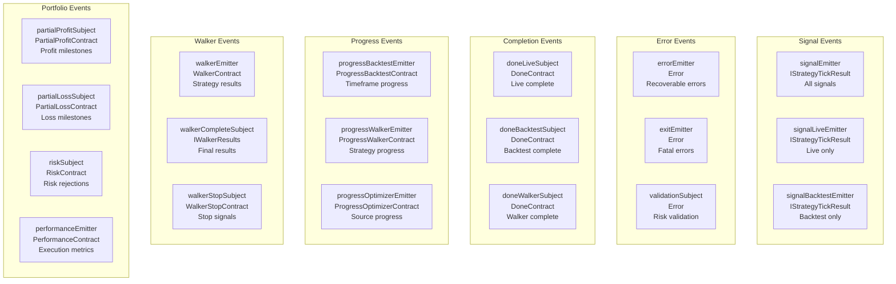

**Event Emitter Reference:**

| Emitter | Payload Type | Purpose | Producers |
|---------|-------------|---------|-----------|
| `signalEmitter` | `IStrategyTickResult` | All signal events (live + backtest) | ClientStrategy |
| `signalLiveEmitter` | `IStrategyTickResult` | Live trading signals only | LiveLogicPrivateService |
| `signalBacktestEmitter` | `IStrategyTickResult` | Backtest signals only | BacktestLogicPrivateService |
| `errorEmitter` | `Error` | Recoverable execution errors | Logic services |
| `exitEmitter` | `Error` | Fatal errors requiring termination | Logic services |
| `validationSubject` | `Error` | Risk validation failures | ClientRisk |
| `doneLiveSubject` | `DoneContract` | Live execution completion | LiveLogicPrivateService |
| `doneBacktestSubject` | `DoneContract` | Backtest completion | BacktestLogicPrivateService |
| `doneWalkerSubject` | `DoneContract` | Walker completion | WalkerLogicPrivateService |
| `progressBacktestEmitter` | `ProgressBacktestContract` | Backtest timeframe progress | BacktestLogicPrivateService |
| `progressWalkerEmitter` | `ProgressWalkerContract` | Walker strategy progress | WalkerLogicPrivateService |
| `progressOptimizerEmitter` | `ProgressOptimizerContract` | Optimizer source progress | OptimizerGlobalService |
| `performanceEmitter` | `PerformanceContract` | Performance metrics | Logic services |
| `walkerEmitter` | `WalkerContract` | Walker strategy results | WalkerLogicPrivateService |
| `walkerCompleteSubject` | `IWalkerResults` | Walker final results | WalkerLogicPrivateService |
| `walkerStopSubject` | `WalkerStopContract` | Walker stop signals (bidirectional) | User code / Logic |
| `partialProfitSubject` | `PartialProfitContract` | Profit level milestones | ClientPartial |
| `partialLossSubject` | `PartialLossContract` | Loss level milestones | ClientPartial |
| `riskSubject` | `RiskContract` | Risk rejection events (rejections only) | ClientRisk |

## Event Producers

Event producers are internal framework components that emit events during strategy execution, risk validation, and progress tracking. Understanding producers helps debug event flow and build custom event-driven logic.

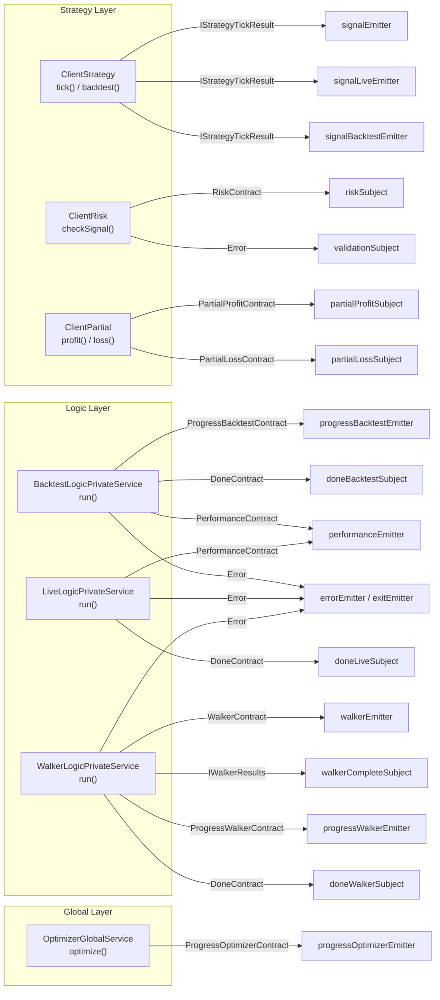

**Producer Emission Points:**

| Producer | Method | Emitter | When | Line Reference |
|----------|--------|---------|------|----------------|
| ClientStrategy | `tick()` | `signalEmitter` | Every tick (idle/opened/active/closed/scheduled/cancelled) | Implementation in Client layer |
| ClientStrategy | `tick()` | `signalLiveEmitter` | Only during Live.run() | Filtered by Logic service |
| ClientStrategy | `tick()` | `signalBacktestEmitter` | Only during Backtest.run() | Filtered by Logic service |
| ClientRisk | `checkSignal()` | `riskSubject` | When signal rejected by validation | Via onRejected callback |
| ClientRisk | `checkSignal()` | `validationSubject` | When validation throws error | Exception handling |
| ClientPartial | `profit()` | `partialProfitSubject` | When reaching 10%, 20%, 30%... profit | Set-based deduplication |
| ClientPartial | `loss()` | `partialLossSubject` | When reaching 10%, 20%, 30%... loss | Set-based deduplication |
| BacktestLogicPrivateService | `run()` | `progressBacktestEmitter` | After each timeframe | Loop iteration |
| BacktestLogicPrivateService | `run()` | `doneBacktestSubject` | After all timeframes | Generator completion |
| LiveLogicPrivateService | `run()` | `doneLiveSubject` | After stop() called | Graceful shutdown |
| WalkerLogicPrivateService | `run()` | `walkerEmitter` | After each strategy backtest | Sequential execution |
| WalkerLogicPrivateService | `run()` | `walkerCompleteSubject` | After all strategies | Final results |
| WalkerLogicPrivateService | `run()` | `progressWalkerEmitter` | After each strategy | Progress tracking |
| WalkerLogicPrivateService | `run()` | `doneWalkerSubject` | After completion | Generator done |

**Signal Event Flow Example:**

The most common event flow is signal events from strategy execution:

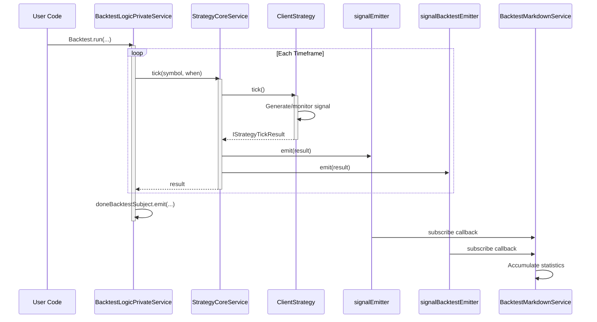

## Event Listeners and Public API

User code subscribes to events via listener functions exported from [src/function/event.ts](). Each listener function wraps a Subject subscription with queued async processing to ensure sequential execution even when callbacks are async.

```mermaid
graph TB
    subgraph "User Code"
        UC["User Callbacks<br/>async functions"]
    end
    
    subgraph "Public API - src/function/event.ts"
        LS["listenSignal(fn)"]
        LSO["listenSignalOnce(filter, fn)"]
        LSL["listenSignalLive(fn)"]
        LSLO["listenSignalLiveOnce(filter, fn)"]
        LSB["listenSignalBacktest(fn)"]
        LSBO["listenSignalBacktestOnce(filter, fn)"]
        LE["listenError(fn)"]
        LEX["listenExit(fn)"]
        LDL["listenDoneLive(fn)"]
        LDLO["listenDoneLiveOnce(filter, fn)"]
        LDB["listenDoneBacktest(fn)"]
        LDBO["listenDoneBacktestOnce(filter, fn)"]
        LDW["listenDoneWalker(fn)"]
        LDWO["listenDoneWalkerOnce(filter, fn)"]
        LBP["listenBacktestProgress(fn)"]
        LWP["listenWalkerProgress(fn)"]
        LOP["listenOptimizerProgress(fn)"]
        LPF["listenPerformance(fn)"]
        LW["listenWalker(fn)"]
        LWO["listenWalkerOnce(filter, fn)"]
        LWC["listenWalkerComplete(fn)"]
        LV["listenValidation(fn)"]
        LPP["listenPartialProfit(fn)"]
        LPPO["listenPartialProfitOnce(filter, fn)"]
        LPL["listenPartialLoss(fn)"]
        LPLO["listenPartialLossOnce(filter, fn)"]
        LR["listenRisk(fn)"]
        LRO["listenRiskOnce(filter, fn)"]
    end
    
    subgraph "Queued Wrapper - functools-kit"
        Q["queued(async fn)<br/>Sequential execution<br/>Order preservation"]
    end
    
    subgraph "Event Emitters"
        SE["signalEmitter"]
        SLE["signalLiveEmitter"]
        SBE["signalBacktestEmitter"]
        ERR["errorEmitter"]
        EXIT["exitEmitter"]
        DL["doneLiveSubject"]
        DB["doneBacktestSubject"]
        DW["doneWalkerSubject"]
        PB["progressBacktestEmitter"]
        PW["progressWalkerEmitter"]
        PO["progressOptimizerEmitter"]
        PERF["performanceEmitter"]
        WE["walkerEmitter"]
        WC["walkerCompleteSubject"]
        VAL["validationSubject"]
        PP["partialProfitSubject"]
        PL["partialLossSubject"]
        RS["riskSubject"]
    end
    
    UC --> LS
    UC --> LSO
    UC --> LSL
    UC --> LSLO
    
    LS --> Q
    LSO --> Q
    LSL --> Q
    LSLO --> Q
    
    Q --> SE
    Q --> SLE
    Q --> SBE
    Q --> ERR
    
    SE --> LS
    SE --> LSO
    SLE --> LSL
    SLE --> LSLO
    SBE --> LSB
    SBE --> LSBO
```

**Listener Function Patterns:**

| Pattern | Functions | Purpose | Example |
|---------|-----------|---------|---------|
| **Standard** | `listenSignal`, `listenError`, etc. | Subscribe to all events, runs on each | Monitor all signals |
| **Once** | `listenSignalOnce`, `listenDoneLiveOnce`, etc. | Subscribe with filter, runs once, auto-unsubscribe | Wait for specific signal |
| **Filtered** | `listenSignalLive`, `listenSignalBacktest` | Subscribe to subset of events | Separate live/backtest handling |
| **Once + Filtered** | `listenSignalLiveOnce`, `listenSignalBacktestOnce` | Filtered subset, runs once | Wait for first live take profit |

**Complete Listener API:**

```typescript
// Signal listeners - src/function/event.ts:70-221
listenSignal(fn: (event: IStrategyTickResult) => void) // All signals
listenSignalOnce(filter, fn) // Filtered, once
listenSignalLive(fn) // Live only
listenSignalLiveOnce(filter, fn) // Live only, once
listenSignalBacktest(fn) // Backtest only
listenSignalBacktestOnce(filter, fn) // Backtest only, once

// Error listeners - src/function/event.ts:247-278
listenError(fn: (error: Error) => void) // Recoverable errors
listenExit(fn: (error: Error) => void) // Fatal errors

// Completion listeners - src/function/event.ts:308-405
listenDoneLive(fn: (event: DoneContract) => void)
listenDoneLiveOnce(filter, fn)
listenDoneBacktest(fn: (event: DoneContract) => void)
listenDoneBacktestOnce(filter, fn)
listenDoneWalker(fn: (event: DoneContract) => void)
listenDoneWalkerOnce(filter, fn)

// Progress listeners - src/function/event.ts:423-476
listenBacktestProgress(fn: (event: ProgressBacktestContract) => void)
listenWalkerProgress(fn: (event: ProgressWalkerContract) => void)
listenOptimizerProgress(fn: (event: ProgressOptimizerContract) => void)

// Performance listeners - src/function/event.ts:491-500
listenPerformance(fn: (event: PerformanceContract) => void)

// Walker listeners - src/function/event.ts:515-548
listenWalker(fn: (event: WalkerContract) => void)
listenWalkerOnce(filter, fn)
listenWalkerComplete(fn: (event: IWalkerResults) => void)

// Validation listeners - src/function/event.ts
listenValidation(fn: (error: Error) => void)

// Partial tracking listeners - src/function/event.ts
listenPartialProfit(fn: (event: PartialProfitContract) => void)
listenPartialProfitOnce(filter, fn)
listenPartialLoss(fn: (event: PartialLossContract) => void)
listenPartialLossOnce(filter, fn)

// Risk listeners - src/function/event.ts
listenRisk(fn: (event: RiskContract) => void)
listenRiskOnce(filter, fn)
```

All listener functions return an unsubscribe function to stop listening:

```typescript
const unsubscribe = listenSignal((event) => {
  console.log('Signal event:', event.action);
});

// Later: stop listening
unsubscribe();
```

## Queued Async Processing

All listener functions wrap user callbacks with `queued()` from `functools-kit` to ensure sequential async execution. This prevents race conditions and maintains event ordering even when callbacks perform async operations like database writes or API calls.

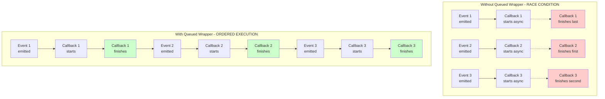

**Implementation Pattern:**

Every listener function in [src/function/event.ts]() follows this pattern:

```typescript
// Example from listenSignal - src/function/event.ts:70-73
export function listenSignal(fn: (event: IStrategyTickResult) => void) {
  backtest.loggerService.log(LISTEN_SIGNAL_METHOD_NAME);
  return signalEmitter.subscribe(queued(async (event) => fn(event)));
  //                              ^^^^^^ Wraps callback for sequential execution
}

// Example from listenError - src/function/event.ts:247-250
export function listenError(fn: (error: Error) => void) {
  backtest.loggerService.log(LISTEN_ERROR_METHOD_NAME);
  return errorEmitter.subscribe(queued(async (error) => fn(error)));
}
```

**Queued Processing Guarantees:**

| Guarantee | Mechanism | Benefit |
|-----------|-----------|---------|
| **Sequential Execution** | Callbacks wait for previous to complete | No concurrent execution |
| **Order Preservation** | Events processed in emission order | Predictable state transitions |
| **Async Support** | Handles Promise-returning callbacks | Database writes, API calls |
| **Error Isolation** | Errors in one callback don't block queue | Resilient processing |

**Example Use Case - Database Persistence:**

```typescript
// Without queued: race condition on writes
listenSignal(async (event) => {
  await database.write(event); // These writes can overlap and conflict!
});

// With queued (built-in): sequential writes
listenSignal(async (event) => {
  await database.write(event); // Waits for previous write to complete
});
```

The `queued()` wrapper is critical for internal framework consumers like markdown services that accumulate events:

```typescript
// BacktestMarkdownService.init() - src/lib/services/markdown/BacktestMarkdownService.ts:564-567
protected init = singleshot(async () => {
  this.loggerService.log("backtestMarkdownService init");
  signalBacktestEmitter.subscribe(this.tick);
  //                                ^^^^^^^^^ Already uses queued internally
});
```

## Event Payload Contracts

Event payloads are strongly typed interfaces (contracts) that define the data structure emitted by each event. All contracts are defined in [types.d.ts]() and exported contract files in [src/contract/]().

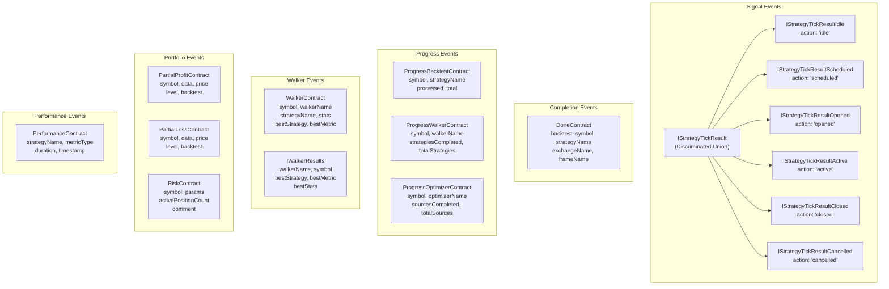

**Contract Definitions:**

| Contract | File | Key Fields | Purpose |
|----------|------|-----------|---------|
| `IStrategyTickResult` | types.d.ts:974-1007 | `action`, `signal`, `strategyName`, `symbol` | Discriminated union for all signal states |
| `DoneContract` | src/contract/Done.contract.ts | `backtest`, `symbol`, `strategyName`, `exchangeName`, `frameName` | Execution completion notification |
| `ProgressBacktestContract` | src/contract/ProgressBacktest.contract.ts | `symbol`, `strategyName`, `exchangeName`, `frameName`, `processed`, `total` | Backtest timeframe progress |
| `ProgressWalkerContract` | src/contract/ProgressWalker.contract.ts | `symbol`, `walkerName`, `strategiesCompleted`, `totalStrategies` | Walker strategy progress |
| `ProgressOptimizerContract` | src/contract/ProgressOptimizer.contract.ts | `symbol`, `optimizerName`, `sourcesCompleted`, `totalSources` | Optimizer source progress |
| `PerformanceContract` | src/contract/Performance.contract.ts | `strategyName`, `metricType`, `duration`, `timestamp`, `previousTimestamp` | Performance profiling |
| `WalkerContract` | src/contract/Walker.contract.ts | `symbol`, `walkerName`, `strategyName`, `stats`, `metricValue`, `bestStrategy`, `bestMetric` | Walker strategy result |
| `IWalkerResults` | types.d.ts:1326-1356 | `walkerName`, `symbol`, `bestStrategy`, `bestMetric`, `bestStats` | Walker final results |
| `PartialProfitContract` | src/contract/PartialProfit.contract.ts | `symbol`, `data`, `currentPrice`, `level`, `backtest`, `timestamp` | Profit milestone reached |
| `PartialLossContract` | src/contract/PartialLoss.contract.ts | `symbol`, `data`, `currentPrice`, `level`, `backtest`, `timestamp` | Loss milestone reached |
| `RiskContract` | src/contract/Risk.contract.ts | `symbol`, `params`, `activePositionCount`, `comment`, `timestamp` | Risk validation rejection |

**Signal Event Discriminated Union:**

The most complex contract is `IStrategyTickResult`, which uses TypeScript discriminated unions for type-safe signal state handling:

```typescript
// Type guard example
if (event.action === 'closed') {
  // TypeScript knows event is IStrategyTickResultClosed
  console.log(event.pnl.pnlPercentage); // Type-safe access
  console.log(event.closeReason); // 'take_profit' | 'stop_loss' | 'time_expired'
} else if (event.action === 'opened') {
  // TypeScript knows event is IStrategyTickResultOpened
  console.log(event.signal.priceOpen);
}
```

## Internal Event Consumers

Internal framework components subscribe to events for automated report generation and statistics collection. These consumers run transparently without user configuration.

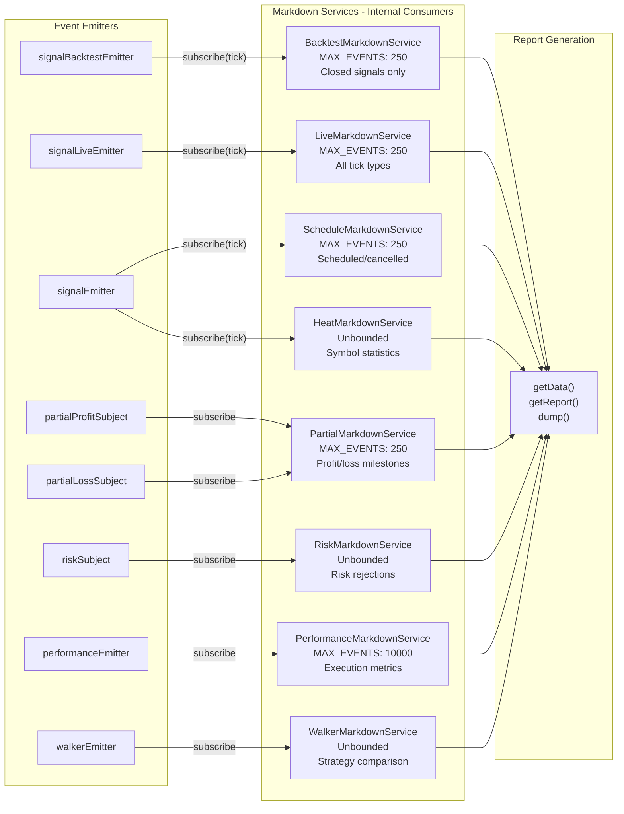

**Markdown Service Subscriptions:**

| Service | Subscribed Emitters | Event Filter | Storage Limit | Purpose |
|---------|-------------------|--------------|---------------|---------|
| BacktestMarkdownService | `signalBacktestEmitter` | `action === 'closed'` | 250 events | Closed signal statistics |
| LiveMarkdownService | `signalLiveEmitter` | All actions | 250 events | Live trading log |
| ScheduleMarkdownService | `signalEmitter` | `action === 'scheduled' \| 'opened' \| 'cancelled'` | 250 events | Scheduled signal tracking |
| HeatMarkdownService | `signalEmitter` | `action === 'closed'` | Unbounded (per symbol) | Portfolio heatmap |
| PartialMarkdownService | `partialProfitSubject`, `partialLossSubject` | All | 250 events | Partial profit/loss log |
| RiskMarkdownService | `riskSubject` | All | Unbounded | Risk rejection log |
| PerformanceMarkdownService | `performanceEmitter` | All | 10000 events | Performance profiling |
| WalkerMarkdownService | `walkerEmitter` | All | Unbounded | Strategy comparison |

**Initialization Pattern:**

All markdown services use the `singleshot` pattern to subscribe on first use:

```typescript
// BacktestMarkdownService - src/lib/services/markdown/BacktestMarkdownService.ts:564-567
protected init = singleshot(async () => {
  this.loggerService.log("backtestMarkdownService init");
  signalBacktestEmitter.subscribe(this.tick);
});

// LiveMarkdownService - src/lib/services/markdown/LiveMarkdownService.ts:771-774
protected init = singleshot(async () => {
  this.loggerService.log("liveMarkdownService init");
  signalLiveEmitter.subscribe(this.tick);
});
```

**Bounded Queue Pattern:**

Services with `MAX_EVENTS` limits use a bounded queue to prevent memory leaks:

```typescript
// LiveMarkdownService - src/lib/services/markdown/LiveMarkdownService.ts:296-300
this._eventList.unshift(newEvent);
if (this._eventList.length > MAX_EVENTS) {
  this._eventList.pop(); // Remove oldest event
}
```

This ensures long-running live trading sessions don't accumulate unbounded event history.

**Report Access:**

User code accesses accumulated statistics via public classes:

```typescript
import { Backtest, Live, Schedule, Heat, Partial, Risk, Performance, Walker } from 'backtest-kit';

// Get statistics
const backtestStats = await Backtest.getData("BTCUSDT", "my-strategy");
const liveStats = await Live.getData("BTCUSDT", "my-strategy");

// Generate markdown report
const report = await Backtest.getReport("BTCUSDT", "my-strategy");

// Save to disk
await Backtest.dump("BTCUSDT", "my-strategy", "./reports");
```

## Common Event Flow Patterns

This section demonstrates common event flow patterns for typical use cases.

### Pattern 1: Monitoring All Signals

Subscribe to all signals regardless of execution mode:

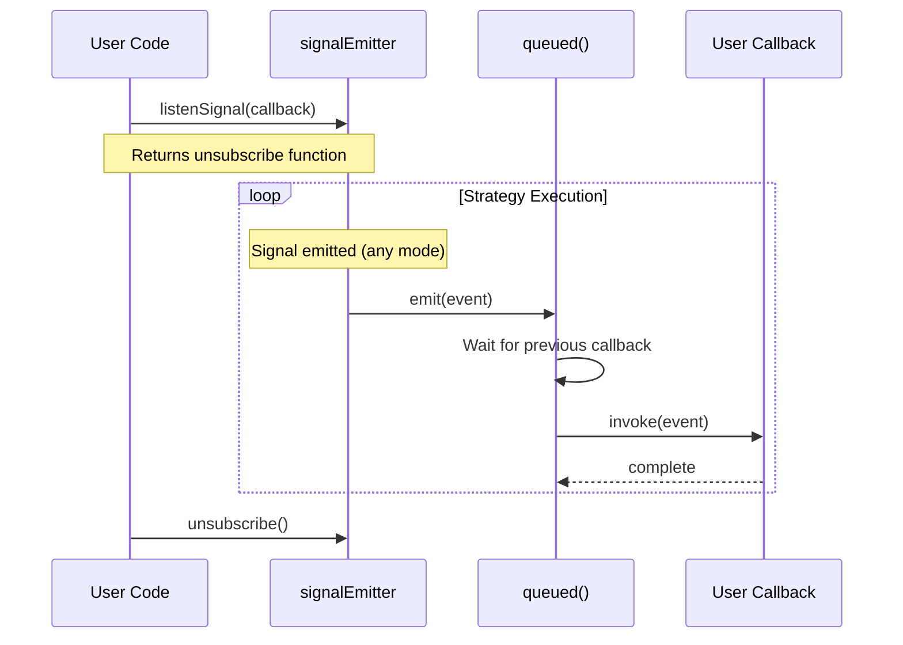

### Pattern 2: Waiting for Specific Event

Use `listenSignalOnce` to wait for a specific condition:

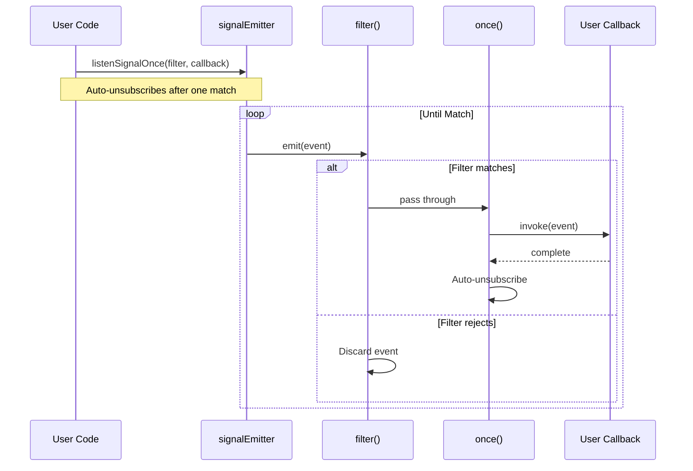

### Pattern 3: Background Execution with Completion

Start background task and wait for completion:

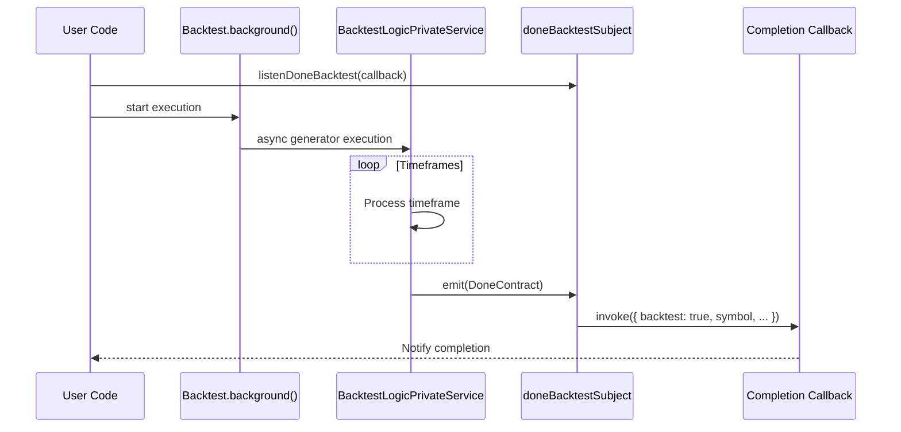

### Pattern 4: Progress Tracking

Monitor backtest or walker progress:

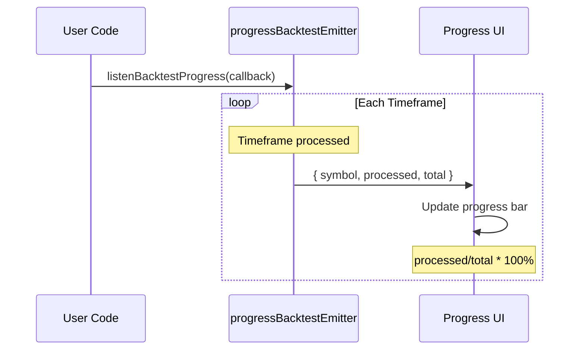

### Pattern 5: Risk Rejection Monitoring

Track signals rejected by risk management:

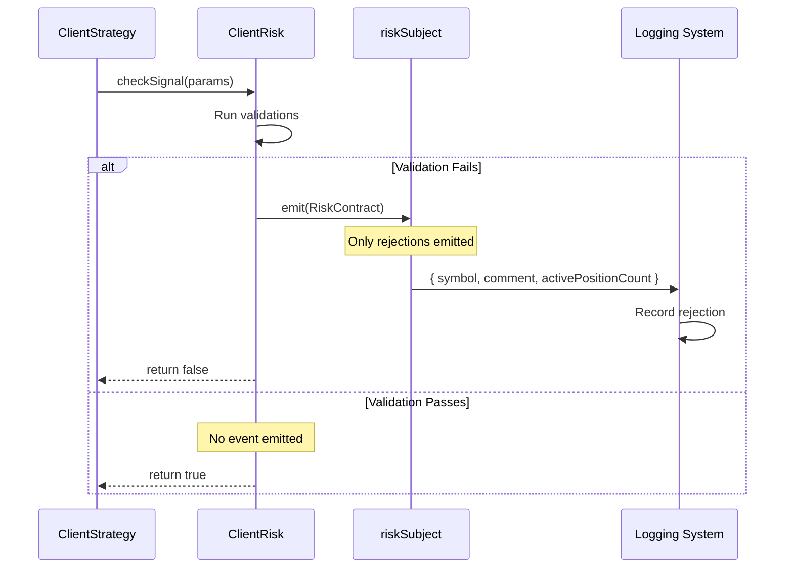

The `riskSubject` only emits rejection events to prevent spam from allowed signals.

### Pattern 6: Partial Profit/Loss Tracking

Monitor profit/loss milestones:

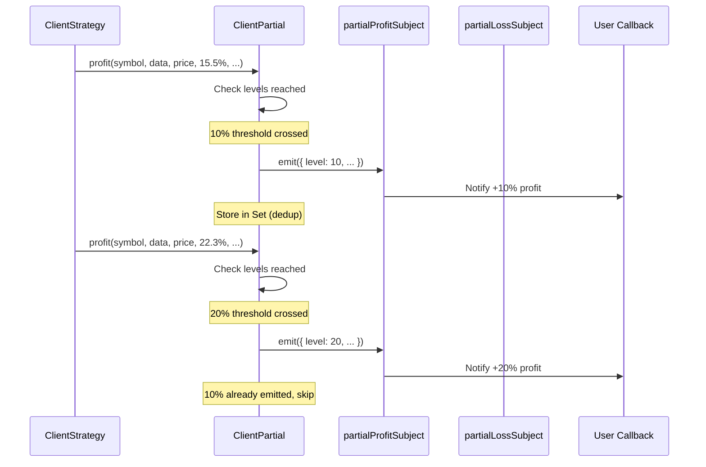

## Bidirectional Event: Walker Stop

The `walkerStopSubject` is unique—it's bidirectional, allowing both user code and internal logic to communicate stop signals.

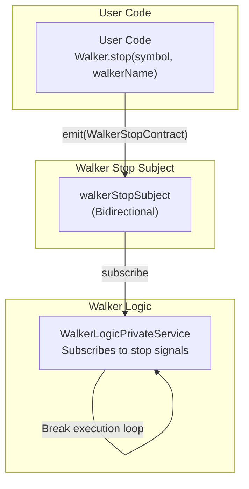

**Stop Signal Flow:**

```typescript
// User initiates stop - src/classes/Walker.ts
Walker.stop("BTCUSDT", "my-walker");
// Emits: { symbol: "BTCUSDT", walkerName: "my-walker" }

// WalkerLogicPrivateService subscribes
walkerStopSubject.subscribe((stop) => {
  if (stop.symbol === symbol && stop.walkerName === walkerName) {
    // Break execution loop
    return;
  }
});
```

This enables graceful cancellation of long-running walker comparisons without process termination.

## Summary

The event-driven architecture in backtest-kit provides:

| Feature | Implementation | Benefit |
|---------|---------------|---------|
| **Decoupling** | Subject-based pub/sub | Producers independent of consumers |
| **Type Safety** | Strongly typed contracts | Compile-time validation |
| **Ordering** | Queued async processing | Sequential event handling |
| **Filtering** | Separate emitters + filter predicates | Targeted subscriptions |
| **Once Semantics** | `Once` listener variants | Single-shot reactions |
| **Bounded Queues** | MAX_EVENTS limits | Memory leak prevention |
| **Automated Reports** | Internal markdown consumers | Zero-config statistics |
| **Bidirectional** | walkerStopSubject | Graceful cancellation |

The architecture supports both internal framework operations (markdown reports, statistics) and user-defined event-driven logic (monitoring, alerting, custom analytics) through a consistent API.

