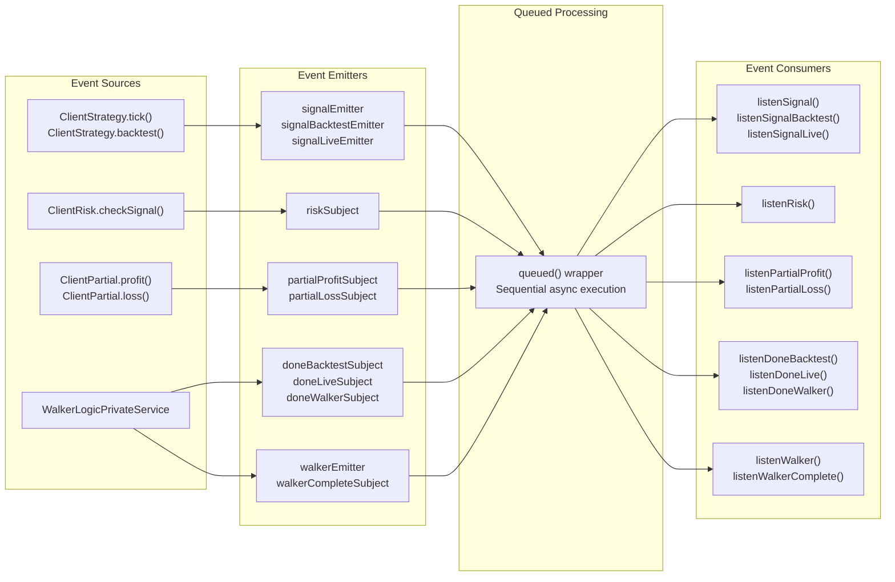
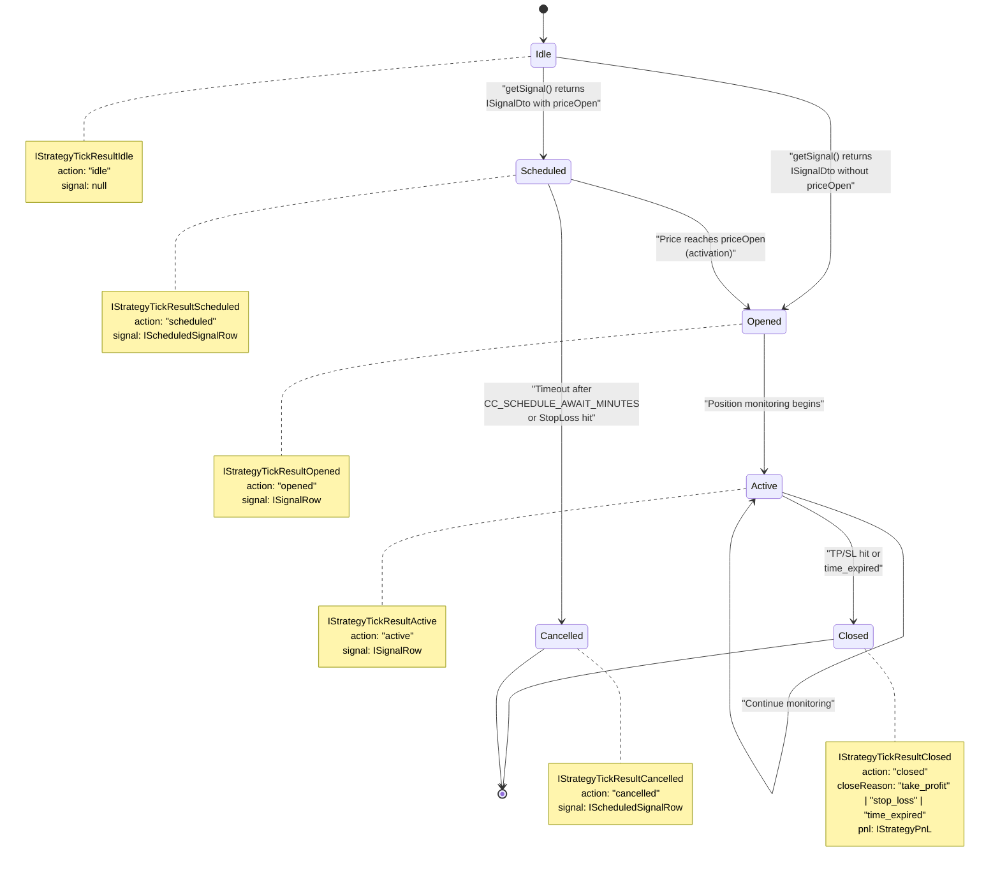
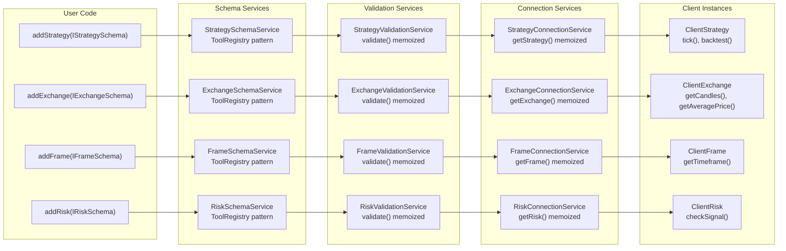
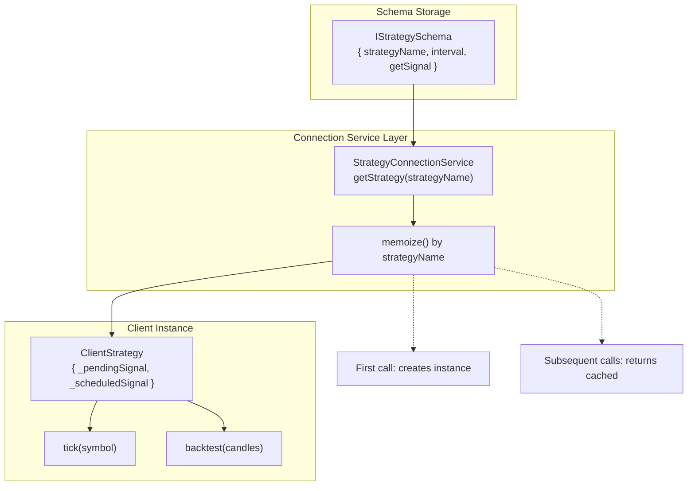
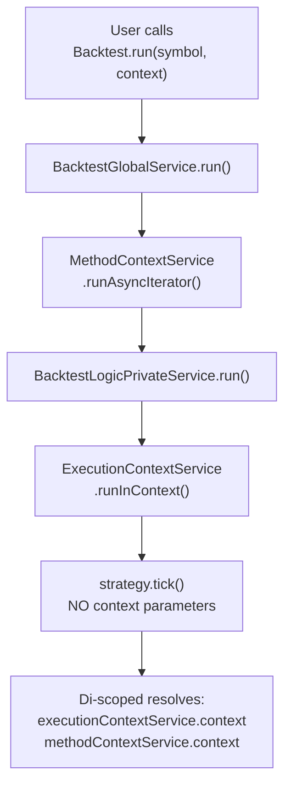

# Core Concepts

<details>
<summary>Relevant source files</summary>

The following files were used as context for generating this wiki page:

- [README.md](README.md)
- [src/client/ClientStrategy.ts](src/client/ClientStrategy.ts)
- [src/config/emitters.ts](src/config/emitters.ts)
- [src/function/event.ts](src/function/event.ts)
- [src/index.ts](src/index.ts)
- [src/interfaces/Strategy.interface.ts](src/interfaces/Strategy.interface.ts)
- [test/e2e/defend.test.mjs](test/e2e/defend.test.mjs)
- [test/index.mjs](test/index.mjs)
- [types.d.ts](types.d.ts)

</details>


This page introduces the fundamental architectural patterns and execution models of backtest-kit. Understanding these core concepts is essential before using the framework:

- **Execution Modes**: Three distinct modes (Backtest, Live, Walker) that share components but differ in timing and data models
- **Signal Lifecycle**: Type-safe state machine governing position entry, monitoring, and exit
- **Component Registration**: Schema-based architecture with lazy instantiation and memoization
- **Context Propagation**: Implicit parameter passing via `di-scoped` for clean API design
- **Event System**: Pub-sub architecture for observability and real-time monitoring

For detailed API documentation, see [Public API Reference](#4). For implementation details of specific components, see [Component Types](#5). For service layer architecture, see [Architecture](#3).

## Execution Modes

backtest-kit provides three execution modes that share strategy and exchange components but differ in timing models, data sources, and orchestration logic. Each mode is implemented as an async generator for memory-efficient streaming.

### Mode Comparison Diagram

```mermaid
graph TB
    subgraph BacktestMode["Backtest Mode"]
        B_Entry["Backtest.run()<br/>(Public API)"]
        B_Command["BacktestCommandService"]
        B_Logic["BacktestLogicPrivateService"]
        B_Frame["FrameCoreService.getTimeframe()"]
        B_Loop["For each timestamp in array"]
        B_Strategy["ClientStrategy.tick()"]
        B_Fast["ClientStrategy.backtest()<br/>(fast-forward)"]
        B_Result["yield IStrategyTickResultClosed"]
        
        B_Entry --> B_Command
        B_Command --> B_Logic
        B_Logic --> B_Frame
        B_Frame --> B_Loop
        B_Loop --> B_Strategy
        B_Strategy --> B_Fast
        B_Fast --> B_Result
        B_Result --> B_Loop
    end
    
    subgraph LiveMode["Live Mode"]
        L_Entry["Live.run()<br/>(Public API)"]
        L_Command["LiveCommandService"]
        L_Logic["LiveLogicPrivateService"]
        L_Time["new Date()<br/>(real-time)"]
        L_Loop["while(true) infinite loop"]
        L_Strategy["ClientStrategy.tick()"]
        L_Persist["PersistSignalAdapter.writeSignalData()"]
        L_Result["yield IStrategyTickResult<br/>(all states)"]
        L_Sleep["sleep(TICK_TTL)"]
        
        L_Entry --> L_Command
        L_Command --> L_Logic
        L_Logic --> L_Time
        L_Time --> L_Loop
        L_Loop --> L_Strategy
        L_Strategy --> L_Persist
        L_Persist --> L_Result
        L_Result --> L_Sleep
        L_Sleep --> L_Loop
    end
    
    subgraph WalkerMode["Walker Mode"]
        W_Entry["Walker.run()<br/>(Public API)"]
        W_Command["WalkerCommandService"]
        W_Logic["WalkerLogicPrivateService"]
        W_Schema["WalkerSchemaService.getSchema()"]
        W_Loop["For each strategy in list"]
        W_Backtest["BacktestLogicPublicService.run()"]
        W_Stats["BacktestMarkdownService.getData()"]
        W_Compare["Compare by WalkerMetric"]
        W_Result["yield WalkerContract"]
        
        W_Entry --> W_Command
        W_Command --> W_Logic
        W_Logic --> W_Schema
        W_Schema --> W_Loop
        W_Loop --> W_Backtest
        W_Backtest --> W_Stats
        W_Stats --> W_Compare
        W_Compare --> W_Result
        W_Result --> W_Loop
    end
```



**Sources:** [src/classes/Backtest.ts:1-208](), [src/classes/Live.ts:1-220](), [src/classes/Walker.ts:1-274](), [src/lib/services/command/BacktestCommandService.ts](), [src/lib/services/command/LiveCommandService.ts](), [src/lib/services/command/WalkerCommandService.ts](), [src/lib/services/logic/BacktestLogicPrivateService.ts](), [src/lib/services/logic/LiveLogicPrivateService.ts](), [src/lib/services/logic/WalkerLogicPrivateService.ts]()

### Mode Characteristics Table

| Mode | Time Source | Data Flow | State Persistence | Signal Yield | Loop Type |
|------|------------|-----------|-------------------|--------------|-----------|
| **Backtest** | `IFrameSchema.getTimeframe()` array | Historical candles via `ExchangeCoreService.getCandles()` | None (in-memory only) | Closed signals only | Finite iteration |
| **Live** | `new Date()` on each tick | Real-time VWAP via `ExchangeCoreService.getAveragePrice()` | `PersistSignalAdapter` (atomic file writes) | All states (idle/opened/active/closed) | Infinite `while(true)` |
| **Walker** | Delegates to `BacktestLogicPublicService` | Shared `IFrameSchema` across strategies | None (uses backtest mode) | `WalkerContract` with strategy stats | Sequential strategy iteration |

### Service Layer Orchestration

Each mode follows the same service layer pattern:

1. **Command Service Layer**: Entry point with validation (`*CommandService`)
2. **Logic Public Service Layer**: API contract definition (`*LogicPublicService`)
3. **Logic Private Service Layer**: Implementation with core service coordination (`*LogicPrivateService`)

The Command Services validate schema existence before delegating to Logic Services:

```typescript
// BacktestCommandService validates strategyName, exchangeName, frameName
// LiveCommandService validates strategyName, exchangeName
// WalkerCommandService validates walkerName
```

**Sources:** [src/lib/services/command/BacktestCommandService.ts:1-100](), [src/lib/services/command/LiveCommandService.ts:1-100](), [src/lib/services/command/WalkerCommandService.ts:1-100]()

### Execution Context Differences

Each mode sets different `IExecutionContext` values:

- **Backtest**: `{ symbol, when: timestamp_from_array, backtest: true }`
- **Live**: `{ symbol, when: new Date(), backtest: false }`
- **Walker**: Delegates context to `BacktestLogicPublicService` per strategy

The `backtest` flag controls behavior throughout the system:
- VWAP calculation source (historical candles vs real-time API)
- Signal persistence (disabled in backtest, enabled in live)
- Event emitter routing (`signalBacktestEmitter` vs `signalLiveEmitter`)

**Sources:** [src/lib/services/context/ExecutionContextService.ts:1-50](), [src/lib/services/logic/BacktestLogicPrivateService.ts](), [src/lib/services/logic/LiveLogicPrivateService.ts]()

## Event System

backtest-kit uses a pub-sub event system for observability, real-time monitoring, and progress tracking. All events are processed sequentially via queued async wrappers to prevent race conditions.

### Event Emitters and Subjects

The framework provides typed event emitters using `Subject` from `functools-kit`:

**Signal Events:**
- `signalEmitter`: All signals (backtest + live)
- `signalBacktestEmitter`: Backtest signals only
- `signalLiveEmitter`: Live signals only

**Lifecycle Events:**
- `doneBacktestSubject`: Backtest completion
- `doneLiveSubject`: Live completion
- `doneWalkerSubject`: Walker completion

**Progress Events:**
- `progressBacktestEmitter`: Backtest progress (frames processed)
- `progressWalkerEmitter`: Walker progress (strategies tested)
- `progressOptimizerEmitter`: Optimizer progress (data sources)

**Monitoring Events:**
- `partialProfitSubject`: Profit level milestones (10%, 20%, 30%, etc)
- `partialLossSubject`: Loss level milestones (10%, 20%, 30%, etc)
- `riskSubject`: Risk validation rejections
- `performanceEmitter`: Execution timing metrics

**Error Events:**
- `errorEmitter`: Recoverable errors (execution continues)
- `exitEmitter`: Fatal errors (execution terminates)
- `validationSubject`: Risk validation errors

**Sources:** [src/config/emitters.ts:1-133]()

### Event Subscription Pattern

All event listeners use the `queued()` wrapper from `functools-kit` to ensure sequential processing:

```typescript
// listenSignal implementation pattern
export function listenSignal(fn: (event: IStrategyTickResult) => void) {
  return signalEmitter.subscribe(queued(async (event) => fn(event)));
}
```

This guarantees:
- Events are processed in order received
- No concurrent execution of callback functions
- Async callbacks complete before next event is processed

**Sources:** [src/function/event.ts:70-73](), [src/function/event.ts:1-800]()

### Event Flow Diagram



**Sources:** [src/client/ClientStrategy.ts](), [src/client/ClientRisk.ts](), [src/client/ClientPartial.ts](), [src/lib/services/logic/WalkerLogicPrivateService.ts](), [src/function/event.ts](), [src/config/emitters.ts]()

### Markdown Services as Event Consumers

Markdown Services subscribe to events for statistics aggregation and report generation:

- `BacktestMarkdownService`: Subscribes to `signalBacktestEmitter` for closed signals
- `LiveMarkdownService`: Subscribes to `signalLiveEmitter` for all signal states
- `PartialMarkdownService`: Subscribes to `partialProfitSubject` and `partialLossSubject`
- `RiskMarkdownService`: Subscribes to `riskSubject` for rejection tracking
- `WalkerMarkdownService`: Subscribes to `walkerEmitter` for strategy comparison
- `PerformanceMarkdownService`: Subscribes to `performanceEmitter` for timing metrics

These services maintain internal state and provide `getData()` methods for report generation via `Backtest.getData()`, `Live.getData()`, etc.

**Sources:** [src/lib/services/markdown/BacktestMarkdownService.ts](), [src/lib/services/markdown/LiveMarkdownService.ts](), [src/lib/services/markdown/PartialMarkdownService.ts](), [src/lib/services/markdown/RiskMarkdownService.ts](), [src/lib/services/markdown/WalkerMarkdownService.ts](), [src/lib/services/markdown/PerformanceMarkdownService.ts]()

## Signal Lifecycle

Signals progress through a state machine implemented as a discriminated union of result types. The `action` field serves as the discriminator for type-safe state handling. The lifecycle is managed by `ClientStrategy` methods.

### State Machine Diagram



**Sources:** [src/interfaces/Strategy.interface.ts:159-296](), [src/client/ClientStrategy.ts:40-895](), Diagram 5 from high-level architecture

### Signal State Types

The framework uses TypeScript discriminated unions for type-safe signal state handling:

```typescript
type IStrategyTickResult = 
  | IStrategyTickResultIdle 
  | IStrategyTickResultScheduled
  | IStrategyTickResultOpened 
  | IStrategyTickResultActive 
  | IStrategyTickResultClosed
  | IStrategyTickResultCancelled;
```

Each state type has a unique `action` discriminator:

- **idle**: No active signal, strategy waiting for entry conditions - [src/interfaces/Strategy.interface.ts:162-175]()
- **scheduled**: Signal created with `priceOpen`, waiting for price to reach entry point - [src/interfaces/Strategy.interface.ts:181-194]()
- **opened**: Position just entered, initial signal creation - [src/interfaces/Strategy.interface.ts:200-213]()
- **active**: Position monitoring for TP/SL/time conditions - [src/interfaces/Strategy.interface.ts:219-232]()
- **closed**: Position exited with PNL calculation - [src/interfaces/Strategy.interface.ts:238-257]()
- **cancelled**: Scheduled signal never activated (timeout or pre-entry SL hit) - [src/interfaces/Strategy.interface.ts:263-278]()

### Key Lifecycle Timestamps

Signals track two critical timestamps for accurate duration calculation:

- **scheduledAt**: When signal was first created (either immediate or scheduled) - [src/interfaces/Strategy.interface.ts:54-54]()
- **pendingAt**: When position became active at `priceOpen` (updated on scheduled signal activation) - [src/interfaces/Strategy.interface.ts:56-56]()

The `minuteEstimatedTime` countdown uses `pendingAt`, not `scheduledAt`, ensuring scheduled signals don't count waiting time toward expiration - [src/client/ClientStrategy.ts:681-683]().

**Sources:** [src/interfaces/Strategy.interface.ts:284-295](), [src/client/ClientStrategy.ts:186-283](), [src/client/ClientStrategy.ts:681-683]()

## Component-Based Architecture

backtest-kit uses a registration-based architecture where components are defined as schemas and instantiated on-demand via dependency injection.

### Component Registration Flow



**Sources:** [src/index.ts:1-131](), [src/lib/services/connection/StrategyConnectionService.ts:76-94](), Diagram 2 from high-level architecture

### Component Types

The framework provides six registrable component types, each with a dedicated schema interface:

| Component | Schema Interface | Purpose | Registration Function |
|-----------|-----------------|---------|----------------------|
| **Strategy** | `IStrategySchema` | Signal generation logic via `getSignal()` | `addStrategy()` |
| **Exchange** | `IExchangeSchema` | Market data via `getCandles()`, price formatting | `addExchange()` |
| **Frame** | `IFrameSchema` | Backtest timeframe generation via `getTimeframe()` | `addFrame()` |
| **Risk** | `IRiskSchema` | Portfolio-level position limits and validations | `addRisk()` |
| **Sizing** | `ISizingSchema` | Position size calculation (fixed, Kelly, ATR) | `addSizing()` |
| **Walker** | `IWalkerSchema` | Multi-strategy comparison configuration | `addWalker()` |

Each schema is stored in a corresponding `*SchemaService` using the ToolRegistry pattern - [src/lib/services/schema/StrategySchemaService.ts](), [src/lib/services/schema/ExchangeSchemaService.ts](), etc.

### Schema to Client Instance Mapping

The framework uses memoized Connection Services to lazily instantiate Client classes:



**Sources:** [src/lib/services/connection/StrategyConnectionService.ts:76-94](), [src/client/ClientStrategy.ts:1-1092]()

This multi-tier architecture (Schema → Validation → Connection → Client) enables:

1. **Validation at registration time**: Schema structure is validated immediately via `*ValidationService.validate()` using memoized checks
2. **Lazy instantiation**: Client instances are only created when first used, reducing memory overhead
3. **Instance reuse**: Memoization ensures one Client per schema name, preventing state duplication
4. **Crash recovery**: Live mode can restore persisted state via `ClientStrategy.waitForInit()` before first operation

### Memoization Pattern

Connection Services use `memoize()` from `functools-kit` to cache Client instances by schema name:

```typescript
// StrategyConnectionService.getStrategy() implementation pattern:
const memoizedFactory = memoize((strategyName: string) => {
  const schema = this.strategySchemaService.getSchema(strategyName);
  return new ClientStrategy({ ...schema, logger, execution, ... });
});

// First call with "my-strategy" creates instance
// Subsequent calls return cached instance
```

This pattern applies to all Connection Services:
- `StrategyConnectionService.getStrategy(strategyName)`
- `ExchangeConnectionService.getExchange(exchangeName)`
- `FrameConnectionService.getFrame(frameName)`
- `RiskConnectionService.getRisk(riskName)`
- `PartialConnectionService.getPartial(symbol)`

**Sources:** [src/function/add.ts](), [src/lib/services/schema/StrategySchemaService.ts](), [src/lib/services/connection/StrategyConnectionService.ts:52-94](), [src/lib/services/validation/StrategyValidationService.ts](), [src/client/ClientStrategy.ts:298-330]()

## Context Propagation

The framework uses `di-scoped` library to propagate execution context implicitly without explicit parameter passing. This enables clean strategy code that doesn't need to know about framework internals.

### Context Types and Services

Two context services manage different aspects of execution:

**ExecutionContextService** wraps `IExecutionContext`:
- `symbol`: Trading pair (e.g., "BTCUSDT")
- `when`: Current timestamp (historical for backtest, `Date.now()` for live)
- `backtest`: Boolean flag controlling behavior throughout system

**MethodContextService** wraps `IMethodContext`:
- `strategyName`: Which `IStrategySchema` to retrieve
- `exchangeName`: Which `IExchangeSchema` to retrieve
- `frameName`: Which `IFrameSchema` to retrieve (empty string for live mode)

Both services use `di-scoped` for async-safe context propagation:

```typescript
// ExecutionContextService extends di-scoped pattern
export const ExecutionContextService = scopedClass<IExecutionContext>();

// Usage in Logic Services
ExecutionContextService.runInContext(async () => {
  // All code here can access executionContextService.context
  await strategy.tick(symbol);
}, { symbol, when, backtest });
```

**Sources:** [src/lib/services/context/ExecutionContextService.ts:1-50](), [src/lib/services/context/MethodContextService.ts:1-50](), [types.d.ts:241-286](), [types.d.ts:504-544]()

### Context Resolution in Connection Services

Connection Services access both contexts to route requests:

```typescript
// ExchangeConnectionService.getExchange() pattern
const methodContext = this.methodContextService.context;
const executionContext = this.executionContextService.context;

// Use methodContext.exchangeName to get schema
const schema = this.exchangeSchemaService.getSchema(methodContext.exchangeName);

// Pass executionContext to Client constructor for runtime behavior
return new ClientExchange({ ...schema, execution: executionContext });
```

This two-context design separates:
- **What** to execute (MethodContext: which schemas)
- **When/How** to execute (ExecutionContext: runtime parameters)

**Sources:** [src/lib/services/connection/ExchangeConnectionService.ts](), [src/lib/services/connection/StrategyConnectionService.ts](), [src/lib/services/core/ExchangeCoreService.ts]()

### Context Flow Example



**Sources:** [src/lib/services/context/ExecutionContextService.ts](), [src/lib/services/context/MethodContextService.ts](), Diagram 6 from high-level architecture

This pattern enables clean strategy code without framework boilerplate:

```typescript
// Strategy author writes:
const candles = await getCandles(symbol, interval, limit);

// Framework automatically injects:
// - executionContext.when (which timestamp to query)
// - methodContext.exchangeName (which exchange to use)
// - executionContext.backtest (historical vs real-time data)
```

For detailed context propagation mechanics, see [Context Propagation](#3.3).

**Sources:** [src/lib/services/context/ExecutionContextService.ts:1-50](), [src/lib/services/context/MethodContextService.ts:1-50](), [src/function/exchange.ts]()