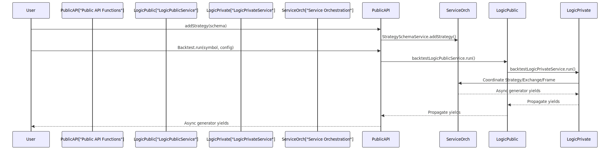
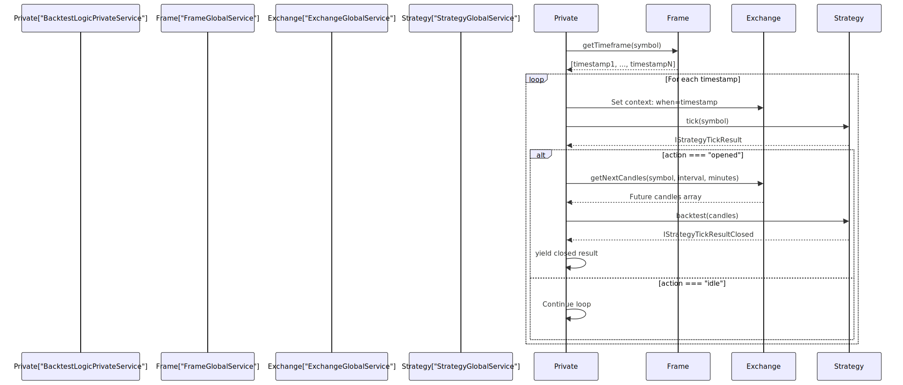

# Layer Responsibilities

This document details the responsibilities of each architectural layer in the backtest-kit framework and explains the separation of concerns between layers. The framework follows a strict four-layer architecture: Public API, Service Orchestration, Business Logic, and Cross-Cutting Concerns. Each layer has specific responsibilities and dependency rules that enforce modularity and testability.

For information about the dependency injection system that connects these layers, see [Dependency Injection System](06_Dependency_Injection_System.md). For details on context propagation mechanisms, see [Context Propagation](07_Context_Propagation.md).

---

## Four-Layer Architecture Overview

The framework is organized into four distinct layers, each with clear boundaries and responsibilities:

**Layer Architecture with Code Entities**




---

## Public API Layer

### Responsibilities

The Public API Layer provides the only user-facing interface to the framework. Its responsibilities are:

1. **Simple, ergonomic function signatures** - No dependency injection knowledge required
2. **Configuration registration** - Accept user schemas and store them
3. **Execution coordination** - Delegate to service layer for actual work
4. **Result streaming** - Return async generators for memory-efficient processing

### Key Components

| Component | Purpose | File Location |
|-----------|---------|---------------|
| `Backtest.run()` | Runs backtest in foreground, returns async generator | Public API entry point |
| `Backtest.background()` | Runs backtest in background, returns results array | Public API entry point |
| `Live.run()` | Runs live trading infinite loop | Public API entry point |
| `Live.background()` | Runs live trading in background process | Public API entry point |
| `addStrategy()` | Registers `IStrategySchema` | Configuration function |
| `addExchange()` | Registers `IExchangeSchema` | Configuration function |
| `addFrame()` | Registers `IFrameSchema` | Configuration function |
| `getCandles()` | Fetches historical candles | Utility function |
| `getAveragePrice()` | Gets current VWAP | Utility function |

### Design Principles

1. **Zero Configuration Required** - All services are pre-initialized and injected automatically
2. **No Direct Service Access** - Users never instantiate services directly
3. **Async Generator Pattern** - Enables streaming results without memory accumulation
4. **Type Safety** - Full TypeScript support with discriminated unions

**Public API to Service Layer Flow**




---

## Service Orchestration Layer

The Service Orchestration Layer is the most complex layer, responsible for dependency injection, routing, instance management, and execution coordination. It is subdivided into four categories of services.

### Schema Services

**Responsibilities:**
- Store user-registered schemas in memory maps
- Validate schema structure on registration
- Provide lookup by name for Connection services

**Components:**

| Service | Registry Type | File |
|---------|--------------|------|
| `StrategySchemaService` | `Map<StrategyName, IStrategySchema>` | Schema services |
| `ExchangeSchemaService` | `Map<ExchangeName, IExchangeSchema>` | Schema services |
| `FrameSchemaService` | `Map<FrameName, IFrameSchema>` | Schema services |

Schema services act as simple registries. They have no dependencies and are the foundation of the configuration system.


### Connection Services

**Responsibilities:**
- Retrieve schemas from Schema services
- Instantiate client implementations (`ClientStrategy`, `ClientExchange`, `ClientFrame`)
- Memoize instances by name to ensure singleton behavior per schema
- Inject runtime dependencies (logger, context services)

**Components:**

| Service | Creates | Memoization Key | File |
|---------|---------|-----------------|------|
| `StrategyConnectionService` | `ClientStrategy` | `strategyName` | Connection services |
| `ExchangeConnectionService` | `ClientExchange` | `exchangeName` | Connection services |
| `FrameConnectionService` | `ClientFrame` | `frameName` | Connection services |

Connection services bridge configuration (schemas) to execution (client instances). They use `MethodContextService` to determine which schema to activate based on the current execution context.


### Global Services

**Responsibilities:**
- Wrap Connection services with execution context injection
- Set `when` (timestamp) and `symbol` in `ExecutionContextService` before delegating
- Provide high-level methods that combine context management with business logic
- Act as context-aware facades for client implementations

**Components:**

| Service | Wraps | Context Injection | File |
|---------|-------|-------------------|------|
| `StrategyGlobalService` | `StrategyConnectionService` | `symbol`, `when`, `backtest` | Global services |
| `ExchangeGlobalService` | `ExchangeConnectionService` | `symbol`, `when`, `backtest` | Global services |
| `FrameGlobalService` | `FrameConnectionService` | `symbol`, `when`, `backtest` | Global services |
| `BacktestGlobalService` | Multiple globals | Backtest-specific context | Global services |
| `LiveGlobalService` | Multiple globals | Live-specific context | Global services |

Global services use the scoped dependency injection pattern (`di-scoped`) to implicitly propagate context through the call stack without manual parameter passing.


### Logic Services

**Responsibilities:**
- Orchestrate the execution flow for backtest and live modes
- Implement async generator patterns for streaming results
- Coordinate between Strategy, Exchange, and Frame global services
- Manage signal lifecycle state transitions

**Components:**

| Service | Mode | Layer | Responsibilities |
|---------|------|-------|------------------|
| `BacktestLogicPublicService` | Backtest | Public | Wraps private service, provides user-facing API |
| `BacktestLogicPrivateService` | Backtest | Private | Implements backtest orchestration loop |
| `LiveLogicPublicService` | Live | Public | Wraps private service, provides user-facing API |
| `LiveLogicPrivateService` | Live | Private | Implements infinite live trading loop |

Logic services are split into Public/Private pairs:
- **Public services** handle result collection, background execution, and report generation
- **Private services** contain the core orchestration logic as async generators

**Backtest Logic Orchestration**




---

## Business Logic Layer

The Business Logic Layer contains pure implementations without dependency injection. These classes are instantiated and managed by Connection services, but they contain no service layer knowledge.

### ClientStrategy

**File:** [src/client/ClientStrategy.ts:1-660]()

**Responsibilities:**
1. Generate signals via `getSignal()` with interval throttling
2. Validate signal structure (prices, TP/SL logic, timestamps)
3. Monitor active signals against VWAP for TP/SL/time expiration
4. Persist signal state atomically for crash recovery
5. Calculate PnL with fees (0.1%) and slippage (0.1%)
6. Implement fast backtest via candle array processing

**Key Methods:**

| Method | Purpose | Returns |
|--------|---------|---------|
| `waitForInit()` | Load persisted signal from disk (live mode) | `Promise<void>` |
| `setPendingSignal()` | Update and persist signal state | `Promise<void>` |
| `tick()` | Single execution tick with signal lifecycle | `Promise<IStrategyTickResult>` |
| `backtest()` | Fast-forward simulation with candle array | `Promise<IStrategyBacktestResult>` |

**Internal State:**
- `_pendingSignal: ISignalRow | null` - Currently active signal
- `_lastSignalTimestamp: number | null` - Last getSignal call timestamp for throttling

**Signal Validation Logic** ([src/client/ClientStrategy.ts:28-88]()):
```typescript
const VALIDATE_SIGNAL_FN = (signal: ISignalRow): void => {
  // Validates:
  // - All prices > 0
  // - Long: priceTakeProfit > priceOpen, priceStopLoss < priceOpen
  // - Short: priceTakeProfit < priceOpen, priceStopLoss > priceOpen
  // - minuteEstimatedTime > 0
  // - timestamp > 0
}
```


### ClientExchange

**Responsibilities:**
1. Fetch historical candle data via exchange API
2. Calculate VWAP from multiple candles
3. Format prices and quantities according to exchange rules
4. Provide execution context aware data fetching

**Key Methods:**
- `getCandles()` - Fetch historical OHLCV data
- `getAveragePrice()` - Calculate VWAP for current timestamp
- `getNextCandles()` - Fetch future candles for backtest simulation
- `formatPrice()` - Format price with exchange precision
- `formatQuantity()` - Format quantity with exchange precision


### ClientFrame

**File:** Referenced in [src/interfaces/Frame.interface.ts:1-108]()

**Responsibilities:**
1. Generate timestamp arrays for backtest periods
2. Support multiple intervals (1m, 5m, 1h, 1d, etc.)
3. Invoke callbacks on timeframe generation

**Key Methods:**

| Method | Purpose | Returns |
|--------|---------|---------|
| `getTimeframe()` | Generate Date array for backtest | `Promise<Date[]>` |

**Supported Intervals:**
- Minutes: `1m`, `3m`, `5m`, `15m`, `30m`
- Hours: `1h`, `2h`, `4h`, `6h`, `8h`, `12h`
- Days: `1d`, `3d`


---

## Cross-Cutting Concerns Layer

Cross-cutting concerns are injected throughout all layers and provide system-wide capabilities.

### LoggerService

**File:** Referenced in [src/lib/index.ts:29-31]()

**Responsibilities:**
- Provide structured logging with levels (debug, info, warn, error)
- Automatically enrich logs with execution context
- Support custom logger injection
- Enable/disable logging per service

**Injection Pattern:**
The logger is injected into nearly every service. Example from ClientStrategy:

```typescript
this.params.logger.debug("ClientStrategy tick", {
  symbol: this.params.execution.context.symbol,
  averagePrice,
  signalId: signal.id,
});
```


### ExecutionContextService

**Responsibilities:**
- Store current execution context: `symbol`, `when`, `backtest`
- Use scoped dependency injection (`di-scoped`) for implicit propagation
- Reset context between ticks

**Context Structure:**
```typescript
interface ExecutionContext {
  symbol: string;        // Trading pair (e.g., "BTCUSDT")
  when: Date;           // Current execution timestamp
  backtest: boolean;    // Backtest vs live mode
}
```


### MethodContextService

**Responsibilities:**
- Store routing context: `strategyName`, `exchangeName`, `frameName`
- Determine which schema to activate in Connection services
- Enable multi-strategy/exchange execution

**Context Structure:**
```typescript
interface MethodContext {
  strategyName: StrategyName;
  exchangeName: ExchangeName;
  frameName: FrameName;
}
```


### PersistSignalAdapter

**File:** Referenced in [src/client/ClientStrategy.ts:17]()

**Responsibilities:**
- Atomic file writes for crash-safe signal persistence
- Read persisted state on initialization
- Store by `strategyName` and `symbol`

**Methods:**
- `writeSignalData()` - Atomically write signal or null to disk
- `readSignalData()` - Load persisted signal on restart

**Usage in ClientStrategy** ([src/client/ClientStrategy.ts:228-232]()):
```typescript
await PersistSignalAdaper.writeSignalData(
  this._pendingSignal,
  this.params.strategyName,
  this.params.execution.context.symbol
);
```


### Markdown Services

**Components:**
- `BacktestMarkdownService` - Accumulates backtest results for reporting
- `LiveMarkdownService` - Accumulates live trading results for reporting

**Responsibilities:**
1. Passively observe signal events (opened, closed)
2. Calculate performance metrics (win rate, average PnL)
3. Generate markdown tables and statistics
4. Provide `getReport()` and `dump()` methods


---

## Layer Interaction Rules

The framework enforces strict dependency rules to maintain clean architecture:

### Allowed Dependencies

| From Layer | Can Depend On | Cannot Depend On |
|------------|---------------|------------------|
| Public API | Service Orchestration | Business Logic, Cross-Cutting (except via services) |
| Service Orchestration | Business Logic, Cross-Cutting | Public API |
| Business Logic | Cross-Cutting (injected) | Public API, Service Orchestration |
| Cross-Cutting | Nothing | Any other layer (passive injection only) |

### Dependency Inversion

The framework uses **Dependency Inversion Principle** throughout:

1. **Interfaces over implementations** - All layers depend on interfaces (`IStrategy`, `IExchange`, `IFrame`)
2. **Constructor injection** - Dependencies injected via constructors, not imported directly
3. **Symbol-based DI** - Services resolved by symbols ([src/lib/core/types.ts:1-57]()), not class references

**Service Aggregator Pattern** ([src/lib/index.ts:101-110]()):
```typescript
export const backtest = {
  ...baseServices,
  ...contextServices,
  ...connectionServices,
  ...schemaServices,
  ...globalServices,
  ...logicPrivateServices,
  ...logicPublicServices,
  ...markdownServices,
};
```

This aggregator object provides all services through a single import, avoiding circular dependencies.


---

## Summary Table

| Layer | Responsibilities | Key Constraint |
|-------|-----------------|----------------|
| **Public API** | User-facing functions, configuration registration | No business logic |
| **Service Orchestration** | DI, routing, instance management, orchestration | No direct business logic |
| **Business Logic** | Pure implementations, signal processing, data fetching | No DI knowledge |
| **Cross-Cutting** | Logging, context, persistence, reporting | Passive injection only |

The four-layer architecture ensures:
- **Testability**: Business logic has no service dependencies
- **Modularity**: Clear boundaries between configuration, orchestration, and execution
- **Extensibility**: New strategies/exchanges added via registration without code changes
- **Maintainability**: Each layer has a single, well-defined purpose