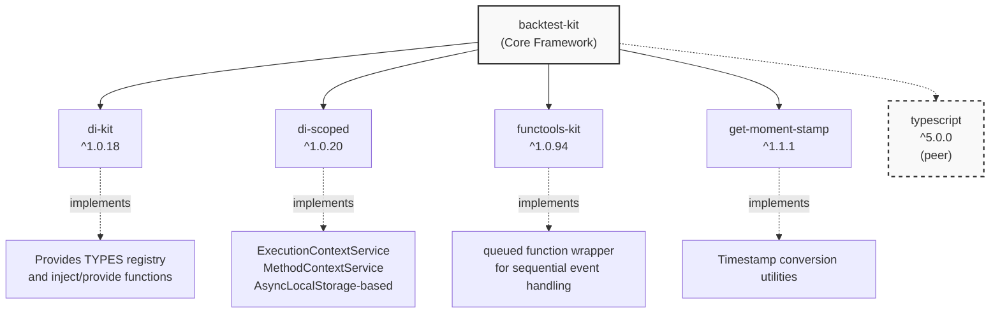
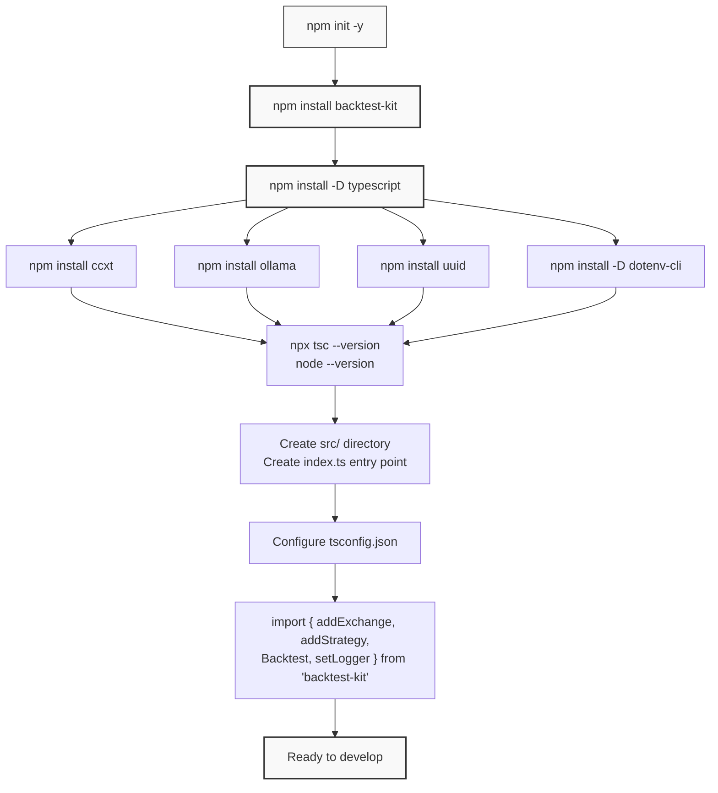

# Installation & Setup

This page covers the installation of Backtest Kit and the initial configuration required to start developing trading strategies. Topics include system requirements, package installation, peer dependencies, TypeScript configuration, and project structure setup. For a complete working example and your first backtest implementation, see [Your First Backtest](./04_getting-started.md).

---

## System Requirements

Backtest Kit requires specific versions of Node.js and TypeScript to function correctly. The framework leverages modern JavaScript features and TypeScript's type system for compile-time safety.

| Requirement | Minimum Version | Recommended | Notes |
|------------|----------------|-------------|-------|
| Node.js | 15.0.0 | 18.0.0+ | Required for `ccxt` dependency |
| TypeScript | 5.0.0 | 5.9.0+ | Peer dependency for type safety |
| npm | 7.0.0+ | Latest | Package manager |


---

## Core Package Installation

### Basic Installation

Install the framework via npm:

```bash
npm install backtest-kit
```

This installs the core framework with its runtime dependencies:

- `di-kit` (v1.0.18): Dependency injection container
- `di-scoped` (v1.0.20): Scoped context management using `AsyncLocalStorage`
- `functools-kit` (v1.0.94): Utility functions including `queued` wrapper for event handlers
- `get-moment-stamp` (v1.1.1): Timestamp utilities


### Dependency Tree



**Dependency Roles:**
- **di-kit**: Implements the TYPES symbol registry used in `src/lib/index.ts` and the `inject`/`provide` pattern
- **di-scoped**: Powers `ExecutionContextService` and `MethodContextService` for ambient context propagation without explicit parameters
- **functools-kit**: Provides the `queued` wrapper that ensures sequential execution of async callbacks in event listeners
- **get-moment-stamp**: Handles timestamp conversions between Date objects and numeric millisecond stamps


---

## Peer Dependencies

### TypeScript Installation

Backtest Kit requires TypeScript 5.0.0 or higher as a peer dependency. Install it in your project:

```bash
npm install --save-dev typescript
```

The framework exports comprehensive type definitions via `types.d.ts:1-3000+` that require TypeScript 5.0+ features including:

- Template literal types
- `satisfies` operator
- Const type parameters
- Improved type inference

### Peer Dependency Verification

The framework will issue warnings if TypeScript is not installed or is below version 5.0.0. Verify your installation:

```bash
npx tsc --version
```

Expected output: `Version 5.0.0` or higher.


---

## Optional Dependencies

### Common Use Case Packages

Most Backtest Kit implementations require additional packages for data sources, LLM integration, and utilities:

```bash
npm install ccxt ollama uuid
npm install --save-dev dotenv-cli
```

| Package | Version | Purpose | Used In |
|---------|---------|---------|---------|
| `ccxt` | 4.5.24+ | Exchange data fetching | `IExchangeSchema.getCandles` implementation |
| `ollama` | 0.6.3+ | LLM integration for AI strategies | `IStrategySchema.getSignal` with LLM calls |
| `uuid` | 13.0.0+ | Signal ID generation | Unique identifiers for signals |
| `dotenv-cli` | 11.0.0+ | Environment variable management | API keys, configuration |


### Package Installation Flow



**Installation Steps:**
1. Initialize npm project with `package.json`
2. Install core `backtest-kit` package
3. Install peer dependency `typescript`
4. Install optional packages based on use case (data sources, LLM, utilities)
5. Verify Node.js and TypeScript versions
6. Create project structure and TypeScript configuration
7. Import framework functions and begin development


---

## TypeScript Configuration

### Minimal tsconfig.json

Create a `tsconfig.json` file in your project root:

```json
{
  "compilerOptions": {
    "target": "ES2020",
    "module": "ES2020",
    "moduleResolution": "node",
    "esModuleInterop": true,
    "skipLibCheck": true,
    "strict": true,
    "resolveJsonModule": true,
    "outDir": "./dist",
    "rootDir": "./src"
  },
  "include": ["src/**/*"],
  "exclude": ["node_modules", "dist"]
}
```

### Configuration Requirements

| Option | Required Value | Reason |
|--------|---------------|--------|
| `target` | ES2020+ | Framework uses modern async/await patterns |
| `module` | ES2020 or NodeNext | ESM support for clean imports |
| `moduleResolution` | node or node16 | Resolve npm packages correctly |
| `esModuleInterop` | true | Import CommonJS modules from ESM |
| `strict` | true (recommended) | Type safety for signal validation |
| `skipLibCheck` | true | Faster compilation with large type definitions |

The framework's `types.d.ts` contains over 3000 lines of type definitions. Setting `skipLibCheck: true` reduces compilation time without sacrificing type safety for your code.


---

## Project Structure

### Recommended Directory Layout

```
my-backtest-project/
├── package.json
├── package-lock.json
├── tsconfig.json
├── .env                    # API keys, configuration
├── .gitignore              # Exclude node_modules, .env
├── src/
│   ├── index.ts           # Entry point
│   ├── strategies/        # Strategy implementations
│   │   └── my-strategy.ts
│   ├── exchanges/         # Exchange configurations
│   │   └── binance.ts
│   ├── risks/             # Risk profile definitions
│   │   └── conservative.ts
│   └── frames/            # Timeframe definitions
│       └── daily-test.ts
└── dump/                  # Generated reports (auto-created)
    ├── backtest/
    ├── live/
    └── performance/
```

### Entry Point Template

Create `src/index.ts`:

```typescript
import { setLogger, setConfig, addExchange, addStrategy } from 'backtest-kit';

// Configure logging
setLogger({
  log: console.log,
  debug: console.debug,
  info: console.info,
  warn: console.warn,
});

// Configure global parameters
setConfig({
  CC_PERCENT_SLIPPAGE: 0.1,
  CC_PERCENT_FEE: 0.1,
});

// Register components (see section 2.2)
// addExchange({ ... });
// addStrategy({ ... });
```


### Module Type Configuration

The demo projects use `"type": "module"` in `demo/backtest/package.json:4` to enable native ESM. Add this to your `package.json`:

```json
{
  "type": "module",
  "scripts": {
    "start": "node dist/index.js"
  }
}
```

For TypeScript compilation and execution:

```bash
npx tsc
node dist/index.js
```

Or use `ts-node` with ESM loader:

```bash
npm install --save-dev ts-node
node --loader ts-node/esm src/index.ts
```


---

## Initial Setup Verification

### Import Test

Verify the installation by importing core functions:

```typescript
import {
  // Configuration
  setLogger,
  setConfig,
  
  // Registration
  addExchange,
  addStrategy,
  addFrame,
  addRisk,
  
  // Execution
  Backtest,
  Live,
  
  // Event Listeners
  listenSignalBacktest,
  listenDoneBacktest,
} from 'backtest-kit';

console.log('Backtest Kit imported successfully');
```

Compile and run:

```bash
npx tsc
node dist/index.js
```

Expected output: `Backtest Kit imported successfully`

### Available Exports

The framework exports the following categories from `src/index.ts`:

**Configuration Functions:**
- `setLogger({ log, debug, info, warn })`: Configure logging output
- `setConfig({ ...GLOBAL_CONFIG })`: Set global parameters like fees and slippage

**Registration Functions:**
- `addExchange(IExchangeSchema)`: Register data sources
- `addStrategy(IStrategySchema)`: Register trading strategies
- `addFrame(IFrameSchema)`: Register timeframes for backtesting
- `addRisk(IRiskSchema)`: Register risk profiles
- `addWalker(IWalkerSchema)`: Register strategy comparison configurations
- `addSizing(ISizingSchema)`: Register position sizing calculators
- `addOptimizer(IOptimizerSchema)`: Register LLM-based optimizer configurations

**Execution Classes:**
- `Backtest`: Historical simulation execution
- `Live`: Real-time trading execution
- `Walker`: Multi-strategy comparison
- `Optimizer`: LLM-powered strategy generation

**Event Listeners:**
- `listenSignal*()`: Signal state change events
- `listenDone*()`: Completion events
- `listenPartial*()`: Profit/loss milestone events
- `listenRisk()`: Risk rejection events
- `listenPerformance()`: Timing metrics events
- `listenError()`: Recoverable error events
- `listenExit()`: Fatal error events

**Utility Functions:**
- `getCandles(symbol, interval, limit)`: Fetch historical data with temporal context
- `dumpSignal()`: Persist signal data for debugging


---

## Environment Variables

### .env File Template

Create a `.env` file for API keys and configuration:

```bash
# Exchange API Keys (for live trading)
BINANCE_API_KEY=your_api_key_here
BINANCE_API_SECRET=your_secret_here

# Ollama Configuration (for LLM strategies)
OLLAMA_HOST=http://localhost:11434
OLLAMA_MODEL=deepseek-v3.1:671b

# Backtest Configuration
LOG_LEVEL=info
```

Add `.env` to your `.gitignore`:

```bash
node_modules/
dist/
.env
dump/
```

### Using dotenv-cli

Run your application with environment variables loaded:

```bash
npx dotenv -e .env -- node dist/index.js
```

Add to `package.json` scripts:

```json
{
  "scripts": {
    "start": "dotenv -e .env -- node dist/index.js",
    "dev": "dotenv -e .env -- node --loader ts-node/esm src/index.ts"
  }
}
```


---

## Troubleshooting Common Installation Issues

### TypeScript Version Mismatch

**Error:** `error TS2307: Cannot find module 'backtest-kit'`

**Solution:** Ensure TypeScript 5.0+ is installed:
```bash
npm install --save-dev typescript@latest
```

### Module Resolution Errors

**Error:** `ERR_MODULE_NOT_FOUND` or `Cannot use import statement outside a module`

**Solution:** Add `"type": "module"` to `package.json` or use `.mjs` file extensions.

### Missing Peer Dependencies

**Error:** `WARN peer dep missing: typescript@^5.0.0`

**Solution:** Install the peer dependency:
```bash
npm install --save-dev typescript
```

### CCXT Installation Issues

**Error:** `ERR! code 1` during `ccxt` installation

**Solution:** CCXT has install scripts that require build tools:
- **Windows:** Install Visual Studio Build Tools
- **macOS/Linux:** Ensure `python3` and `make` are available


---

## Next Steps

After completing installation and setup:

1. **Follow the First Backtest Tutorial:** See [Your First Backtest](./04_getting-started.md) for a complete working example
2. **Explore Quick Start Examples:** Review [Quick Start Examples](./04_getting-started.md) for common patterns
3. **Study Core Concepts:** Understand [Signals & Signal Lifecycle](./08_core-concepts.md) and [Strategies](./08_core-concepts.md)
4. **Review API Reference:** Consult [Global Functions](./56_api-reference.md) for detailed API documentation

The framework is now installed and ready for development. The next page demonstrates creating a complete backtest with strategy registration, exchange configuration, and execution.

