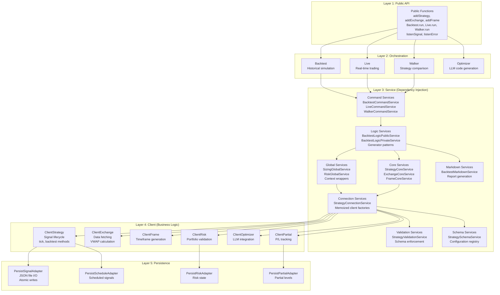
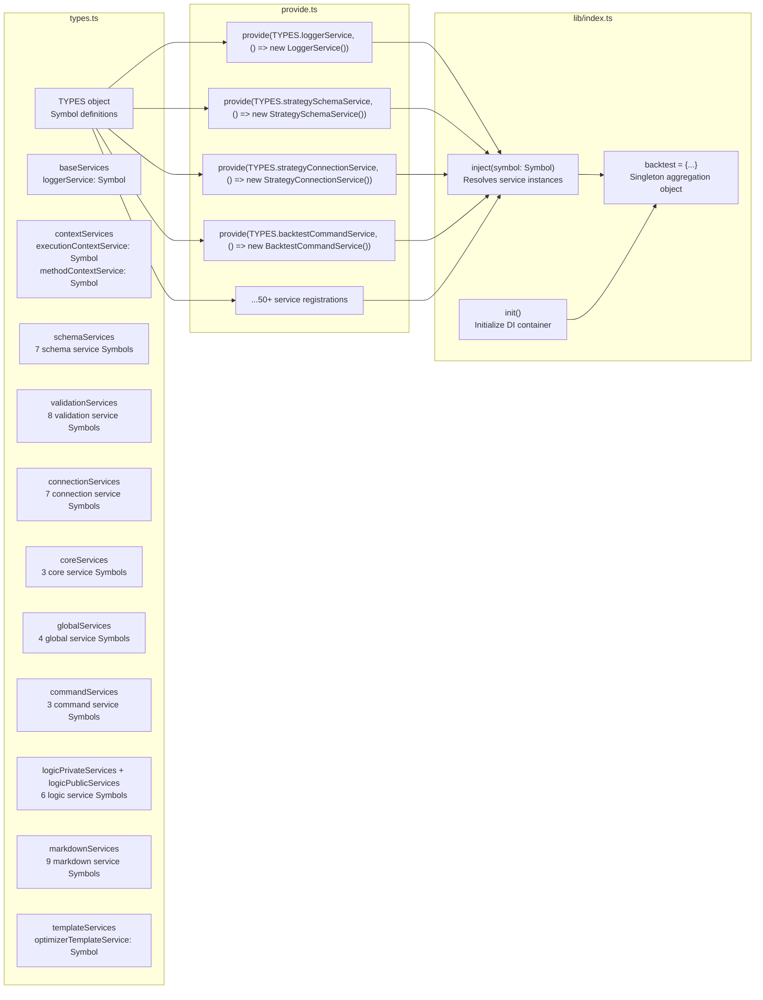
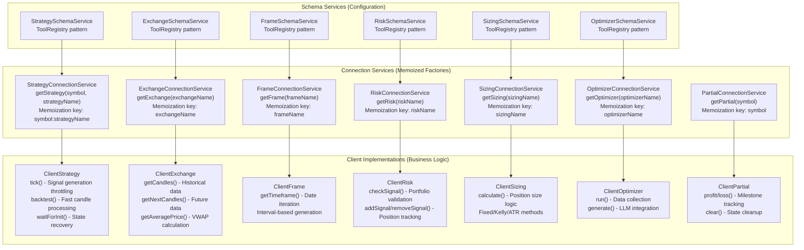
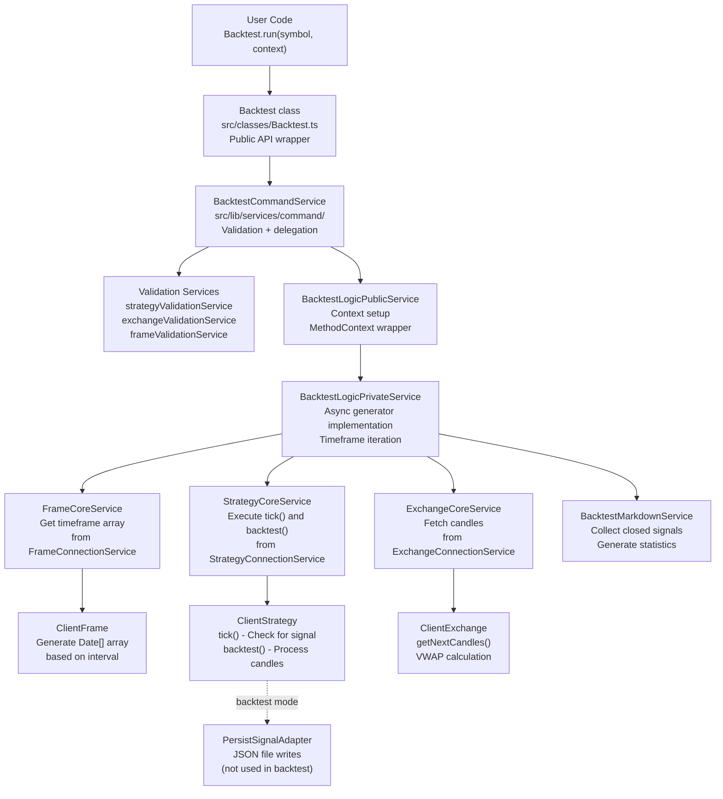

# System Architecture

This document provides an overview of the backtest-kit framework's architectural patterns, including its layered design, dependency injection system, service organization, and the central `backtest` aggregation object. This page focuses on structural patterns and component organization rather than specific features or execution flows.

For detailed information about:
- Individual layer responsibilities, see [Layered Architecture](./07-layered-architecture.md)
- The DI container implementation, see [Dependency Injection System](./08-dependency-injection-system.md)
- Service category descriptions and responsibilities, see [Service Categories](./09-service-categories.md)
- Client implementations and business logic, see [Client Layer](./10-client-layer.md)

---

## Architectural Overview

The framework follows clean architecture principles with strict separation of concerns. The architecture consists of five distinct layers that interact through well-defined interfaces, with dependency injection managing component lifecycle and dependencies.

**Overall System Layers**



---

## Layered Architecture

The framework implements a five-layer architecture where each layer has distinct responsibilities and dependencies flow in one direction (top to bottom). Higher layers depend on lower layers, but not vice versa.

| Layer | Purpose | Key Characteristics |
|-------|---------|---------------------|
| **Public API** | User-facing functions for configuration and execution | Simple function exports, validation-only logic, delegates to orchestration layer |
| **Orchestration** | Execution mode implementations (Backtest, Live, Walker, Optimizer) | Class-based, background/run methods, async generators, event emission |
| **Service** | Dependency-injected business logic organized by responsibility | 11 service categories, Symbol-based DI, singleton instances |
| **Client** | Pure business logic without DI dependencies | Prototype-based classes, memoized instances, domain logic |
| **Persistence** | Crash-safe state storage and recovery | Atomic writes, JSON serialization, extensible adapters |

The layered design ensures:
- **Testability**: Each layer can be tested in isolation
- **Maintainability**: Changes to one layer don't cascade to others
- **Scalability**: New features added at appropriate layers
- **Clarity**: Responsibilities clearly separated

For detailed layer descriptions, see [Layered Architecture](./07-layered-architecture.md).

---

## Dependency Injection System

The framework uses a custom dependency injection container built around Symbol-based keys. The DI system consists of three core components:

**Dependency Injection Components**



### Symbol-Based Keys

Each service is registered using a unique Symbol identifier defined in [src/lib/core/types.ts:1-104](). Symbols prevent naming collisions and provide type-safe service resolution:

```typescript
// From types.ts
const baseServices = {
    loggerService: Symbol('loggerService'),
};

const schemaServices = {
    strategySchemaService: Symbol('strategySchemaService'),
    exchangeSchemaService: Symbol('exchangeSchemaService'),
    // ...
};
```

### Service Registration

Services are registered via factory functions in [src/lib/core/provide.ts:1-141](). Each registration associates a Symbol key with a factory that creates the service instance:

```typescript
// From provide.ts
provide(TYPES.loggerService, () => new LoggerService());
provide(TYPES.strategySchemaService, () => new StrategySchemaService());
provide(TYPES.strategyConnectionService, () => new StrategyConnectionService());
```

### The `backtest` Aggregation Object

The [src/lib/index.ts:221-234]() exports a singleton `backtest` object that aggregates all services. This object serves as the central service locator, providing typed access to every service in the system:

```typescript
// From lib/index.ts
export const backtest = {
  ...baseServices,
  ...contextServices,
  ...connectionServices,
  ...schemaServices,
  ...coreServices,
  ...globalServices,
  ...commandServices,
  ...logicPrivateServices,
  ...logicPublicServices,
  ...markdownServices,
  ...validationServices,
  ...templateServices,
};
```

Internal services access dependencies through this object (e.g., `backtest.loggerService`, `backtest.strategyConnectionService`).

For implementation details, see [Dependency Injection System](./08-dependency-injection-system.md).

---

## Service Categories

The service layer is organized into 11 categories, each with a specific responsibility. Services are implemented as classes with prototype methods for memory efficiency.

| Category | Count | Responsibility | Example Services |
|----------|-------|----------------|------------------|
| **Base** | 1 | Core infrastructure | `LoggerService` |
| **Context** | 2 | Execution context propagation | `ExecutionContextService`, `MethodContextService` |
| **Schema** | 7 | Configuration registry (ToolRegistry pattern) | `StrategySchemaService`, `ExchangeSchemaService`, `FrameSchemaService`, `RiskSchemaService`, `SizingSchemaService`, `WalkerSchemaService`, `OptimizerSchemaService` |
| **Validation** | 8 | Runtime validation and memoization | `StrategyValidationService`, `ExchangeValidationService`, `FrameValidationService`, `RiskValidationService`, `SizingValidationService`, `WalkerValidationService`, `OptimizerValidationService`, `ConfigValidationService` |
| **Connection** | 7 | Memoized client instance factories | `StrategyConnectionService`, `ExchangeConnectionService`, `FrameConnectionService`, `RiskConnectionService`, `SizingConnectionService`, `OptimizerConnectionService`, `PartialConnectionService` |
| **Core** | 3 | Domain logic execution | `StrategyCoreService`, `ExchangeCoreService`, `FrameCoreService` |
| **Global** | 4 | Context-wrapped public API | `SizingGlobalService`, `RiskGlobalService`, `OptimizerGlobalService`, `PartialGlobalService` |
| **Command** | 3 | High-level orchestration entry points | `BacktestCommandService`, `LiveCommandService`, `WalkerCommandService` |
| **Logic** | 6 | Async generator execution flow (Public/Private splits) | `BacktestLogicPublicService`, `BacktestLogicPrivateService`, `LiveLogicPublicService`, `LiveLogicPrivateService`, `WalkerLogicPublicService`, `WalkerLogicPrivateService` |
| **Markdown** | 9 | Report generation and statistics | `BacktestMarkdownService`, `LiveMarkdownService`, `ScheduleMarkdownService`, `WalkerMarkdownService`, `PerformanceMarkdownService`, `HeatMarkdownService`, `PartialMarkdownService`, `RiskMarkdownService`, `OutlineMarkdownService` |
| **Template** | 1 | Code generation templates | `OptimizerTemplateService` |

### Service Dependency Patterns

Services follow consistent dependency patterns:

1. **Schema Services** → Store configuration using ToolRegistry pattern, no dependencies
2. **Validation Services** → Depend on Schema Services for existence checks
3. **Connection Services** → Depend on Schema Services, create memoized client instances
4. **Core Services** → Depend on Connection and Validation Services, execute domain logic
5. **Global Services** → Wrap Core Services with ExecutionContext/MethodContext
6. **Logic Services** → Depend on Core Services, implement async generators
7. **Command Services** → Depend on Logic and Validation Services, validate and execute

For detailed service descriptions, see [Service Categories](./09-service-categories.md).

---

## Client Layer

The client layer contains pure business logic implementations without DI dependencies. Clients are instantiated by Connection Services and cached using memoization.

**Client Layer Architecture**



### Client Characteristics

1. **No DI Dependencies**: Clients receive dependencies via constructor parameters, not through the DI container
2. **Prototype Methods**: Methods defined on prototype for memory efficiency (not arrow functions)
3. **Memoization**: Connection Services cache client instances by key (e.g., `symbol:strategyName`)
4. **Pure Business Logic**: Domain logic implementation without framework concerns
5. **Stateful**: Clients maintain internal state (e.g., `ClientStrategy` tracks pending signals)

**Key Client Implementations:**

- **ClientStrategy** [src/client/ClientStrategy.ts](): Signal lifecycle management, tick throttling, backtest acceleration
- **ClientExchange** [src/client/ClientExchange.ts](): Candle data fetching, VWAP calculation, retry logic
- **ClientFrame** [src/client/ClientFrame.ts](): Timeframe generation, date iteration
- **ClientRisk** [src/client/ClientRisk.ts](): Portfolio-level validation, position tracking
- **ClientOptimizer** [src/client/ClientOptimizer.ts](): LLM integration, strategy code generation
- **ClientPartial** [src/client/ClientPartial.ts](): Profit/loss milestone tracking

For detailed client implementations, see [Client Layer](./10-client-layer.md).

---

## Data Flow Through Layers

This example shows how a backtest execution flows through the architectural layers:

**Backtest Execution Flow**



### Execution Steps

1. **Public API Layer**: User calls `Backtest.run(symbol, context)` from [src/classes/Backtest.ts]()
2. **Orchestration Layer**: `Backtest` class delegates to `BacktestCommandService`
3. **Service Layer - Command**: `BacktestCommandService` validates inputs and delegates to `BacktestLogicPublicService`
4. **Service Layer - Logic (Public)**: Sets up `MethodContextService` with schema names
5. **Service Layer - Logic (Private)**: Creates async generator, iterates timeframes
6. **Service Layer - Core**: Fetches timeframe from `FrameCoreService`, executes strategy via `StrategyCoreService`
7. **Client Layer**: `ClientFrame` generates dates, `ClientStrategy` executes tick/backtest logic, `ClientExchange` fetches candles
8. **Service Layer - Markdown**: Collects signals and generates statistics
9. **Orchestration Layer**: Yields results through generator back to user

---

## Summary

The backtest-kit architecture achieves separation of concerns through:

1. **Five-Layer Design**: Clear boundaries between API, orchestration, services, clients, and persistence
2. **Dependency Injection**: Symbol-based DI with centralized `backtest` aggregation object
3. **Service Organization**: 11 service categories with specific responsibilities
4. **Client Purity**: Business logic isolated from DI and framework concerns
5. **Memoization**: Efficient resource usage through cached client instances

This architecture enables:
- **Testability**: Each layer testable in isolation
- **Maintainability**: Changes localized to appropriate layers
- **Extensibility**: New features added without modifying existing code
- **Performance**: Memoization and prototype methods minimize memory overhead

