# Execution Modes

## Purpose and Scope

This document describes the three execution modes available in backtest-kit: **Backtest** (historical simulation), **Live** (real-time trading), and **Walker** (strategy comparison). Each mode implements a distinct temporal progression model and completion semantic while sharing the same core strategy execution framework.

For information about strategy lifecycle within these modes, see [Signal Lifecycle Overview](./07_Signal_Lifecycle_Overview.md). For component registration patterns used across all modes, see [Component Registration](./08_Component_Registration.md). For detailed API documentation of each mode's methods, see sections [4.3](./17_Backtest_API.md), [4.4](./18_Live_Trading_API.md), and [4.5](./19_Walker_API.md).

---

## Mode Overview

The framework provides three orthogonal execution modes that differ in temporal progression, completion semantics, and result aggregation patterns:

| Aspect | Backtest Mode | Live Mode | Walker Mode |
|--------|---------------|-----------|-------------|
| **Purpose** | Historical simulation | Real-time trading | Strategy comparison |
| **Temporal Model** | Sequential timeframe iteration | Real-time Date.now() | Multiple sequential backtests |
| **Completion** | Finite (when timeframes exhausted) | Infinite (never completes) | Finite (when all strategies tested) |
| **Primary Service** | `BacktestLogicPrivateService` | `LiveLogicPrivateService` | `WalkerLogicPrivateService` |
| **Result Type** | `IStrategyBacktestResult` | `IStrategyTickResultOpened \| IStrategyTickResultClosed` | `WalkerContract` |
| **Data Source** | Historical via `getNextCandles()` | Current via `getCandles()` | Historical via backtest delegation |
| **Crash Recovery** | Not applicable | Yes (via persistence layer) | Not applicable |
| **Progress Tracking** | `progressBacktestEmitter` | Not applicable | `progressWalkerEmitter` |


---

## Mode Selection and Entry Points


**Service Layering Pattern**

Each mode implements a four-tier architecture separating user-facing utilities, command validation, public contracts, and private implementation:

1. **Utils Layer**: User-facing singleton exports (`Backtest`, `Live`, `Walker`) providing simplified method access with logging
2. **Command Layer**: Validation services ensuring schema registration and parameter correctness before execution
3. **Public Layer**: Context setup and AsyncGenerator type contracts for external consumption
4. **Private Layer**: Core execution logic implementing temporal progression and result streaming


---

## Backtest Mode

### Characteristics

Backtest mode performs historical simulation by iterating through predefined timeframes and evaluating strategy signals against past market data. The execution model implements an optimized skip-ahead pattern where timeframes are bypassed during active signal periods to minimize redundant tick() calls.

**Temporal Progression:**
- Iterates through `Date[]` array generated by `FrameGlobalService`
- Each timeframe represents a specific historical moment
- Progression is deterministic and repeatable
- No real-time constraints or timing dependencies

**Completion Semantics:**
- Finite execution: completes when all timeframes are processed
- AsyncGenerator yields each closed signal result
- Consumer can terminate early via `break` in for-await loop

**Data Requirements:**
- Historical candles fetched via `ClientExchange.getNextCandles()`
- Requires future data relative to signal open time
- Candle availability validated before backtest proceeds

### Execution Flow


**Skip-Ahead Optimization**

When a signal opens, the execution loop skips all timeframes until the signal closes. This optimization eliminates redundant tick() calls during the signal's active period since the strategy's state is deterministic once a position is opened.

```typescript
// Skip timeframes until closeTimestamp
while (
  i < timeframes.length &&
  timeframes[i].getTime() < backtestResult.closeTimestamp
) {
  i++;
}
```


### Key Service Classes

| Class | Responsibility | Key Methods |
|-------|---------------|-------------|
| `BacktestLogicPrivateService` | Core execution loop with timeframe iteration | `run(symbol): AsyncGenerator<IStrategyBacktestResult>` |
| `BacktestLogicPublicService` | Context setup and validation | `run(symbol, context)` |
| `BacktestCommandService` | Schema validation and delegation | `run(symbol, context)` |
| `FrameGlobalService` | Timeframe generation from frame schema | `getTimeframe(symbol, frameName): Promise<Date[]>` |
| `StrategyGlobalService` | Strategy method invocation with context injection | `tick()`, `backtest()` |
| `ExchangeGlobalService` | Data fetching with execution context | `getNextCandles()` |


---

## Live Mode

### Characteristics

Live mode performs real-time trading by continuously polling the strategy with current timestamps in an infinite loop. The execution model implements crash recovery through persistent storage, allowing processes to restart and resume active positions without data loss.

**Temporal Progression:**
- Infinite `while(true)` loop creating new `Date()` each iteration
- Each tick represents the current real-time moment
- Progression is non-deterministic and time-dependent
- Sleep interval (`TICK_TTL = 61 seconds`) controls polling frequency

**Completion Semantics:**
- Infinite execution: never completes naturally
- AsyncGenerator continues yielding results indefinitely
- Process termination via external signal (SIGTERM, SIGINT) or error

**Crash Recovery:**
- State persisted via `PersistSignalAdapter`, `PersistScheduleAdapter`, `PersistRiskAdapter`
- Strategy initialization calls `waitForInit()` to restore state
- Active positions and scheduled signals recovered from disk on restart

### Execution Flow


**Tick Throttling and Sleep Pattern**

The `TICK_TTL` constant (61 seconds) controls the polling interval between strategy evaluations. This value exceeds one minute to ensure each tick represents a new 1-minute candle boundary when fetching data.

```typescript
const TICK_TTL = 1 * 60 * 1_000 + 1; // 61 seconds
```


### Crash Recovery Architecture


**State Restoration Process**

1. On process start, `ClientStrategy` checks for persisted state via `PersistSignalAdapter.hasValue()`
2. If state exists, `readValue()` loads the serialized signal object
3. Strategy reconstructs internal state including signal, scheduled signals, and risk positions
4. Execution resumes from the restored state as if no crash occurred


### Key Service Classes

| Class | Responsibility | Key Methods |
|-------|---------------|-------------|
| `LiveLogicPrivateService` | Core execution loop with infinite polling | `run(symbol): AsyncGenerator<IStrategyTickResultOpened \| IStrategyTickResultClosed>` |
| `LiveLogicPublicService` | Context setup and validation | `run(symbol, context)` |
| `LiveCommandService` | Schema validation and delegation | `run(symbol, context)` |
| `StrategyGlobalService` | Strategy method invocation with context injection | `tick()` |
| `PersistSignalAdapter` | Signal state persistence | `readValue()`, `writeValue()`, `hasValue()`, `removeValue()` |


---

## Walker Mode

### Characteristics

Walker mode performs strategy comparison by executing multiple backtests sequentially and ranking results by a configurable performance metric. The execution model implements real-time progress tracking, allowing consumers to monitor strategy evaluation as it progresses.

**Temporal Progression:**
- Sequential iteration through strategy array
- Each iteration runs a complete backtest via `BacktestLogicPublicService`
- Progression depends on backtest execution time per strategy
- No parallel execution (strategies tested serially)

**Completion Semantics:**
- Finite execution: completes when all strategies tested
- AsyncGenerator yields `WalkerContract` after each strategy
- Final result includes best strategy and comparative statistics

**Metric Selection:**
- Default: `sharpeRatio`
- Alternatives: `winRate`, `avgPnl`, `totalPnl`, `certaintyRatio`, `annualizedSharpe`
- Higher values considered better for all metrics

### Execution Flow


**Metric Extraction and Comparison**

Walker extracts the specified metric from `BacktestMarkdownService.getData()` results, which provides comprehensive statistics including Sharpe ratio, win rate, PNL, and other performance measures. The comparison logic treats higher values as better for all metrics.

```typescript
// Extract metric value
const value = stats[metric];
const metricValue =
  value !== null &&
  value !== undefined &&
  typeof value === "number" &&
  !isNaN(value) &&
  isFinite(value)
    ? value
    : null;

// Update best strategy if needed
const isBetter =
  bestMetric === null ||
  (metricValue !== null && metricValue > bestMetric);
```


### Key Service Classes

| Class | Responsibility | Key Methods |
|-------|---------------|-------------|
| `WalkerLogicPrivateService` | Core execution loop iterating strategies | `run(symbol, strategies, metric, context): AsyncGenerator<WalkerContract>` |
| `WalkerLogicPublicService` | Context setup and validation | `run(symbol, context)` |
| `WalkerCommandService` | Schema validation and delegation | `run(symbol, context)` |
| `BacktestLogicPublicService` | Backtest execution for each strategy | `run(symbol, context)` |
| `BacktestMarkdownService` | Statistics calculation and retrieval | `getData(symbol, strategyName)` |
| `WalkerSchemaService` | Walker schema storage and retrieval | `get(walkerName)` |


---

## Mode Comparison: Shared Components

All three execution modes share the same core strategy execution framework, differing only in temporal progression and result aggregation:



**Polymorphic Design Pattern**

The framework implements a polymorphic architecture where execution mode is orthogonal to strategy logic. All three modes invoke the same `ClientStrategy.tick()` method with different temporal contexts:

- **Backtest**: Historical `Date` from timeframe array
- **Live**: Real-time `Date` from `new Date()`
- **Walker**: Historical `Date` from timeframe array (via Backtest delegation)

The `backtest` boolean parameter in execution context distinguishes between backtest simulation and live execution, enabling mode-specific behaviors like persistence and progress tracking.


---

## Data Access Patterns by Mode



**getCandles() vs getNextCandles()**

The `ClientExchange` class provides two distinct methods for candle retrieval with different temporal semantics:

| Method | Direction | Use Case | Mode |
|--------|-----------|----------|------|
| `getCandles()` | Backwards from `ExecutionContext.when` | Fetch historical data for indicator calculation | Both Backtest and Live |
| `getNextCandles()` | Forwards from `ExecutionContext.when` | Fetch future data for signal simulation | Backtest only |

The `getNextCandles()` method validates that requested data does not exceed `Date.now()`, returning empty array if future data is requested. This prevents time-travel paradoxes in live mode.


---

## Performance and Event Emission

Each mode emits distinct performance metrics and progress events through the event system:

| Event Type | Backtest | Live | Walker |
|------------|----------|------|--------|
| **Progress** | `progressBacktestEmitter` (frames processed) | Not applicable | `progressWalkerEmitter` (strategies tested) |
| **Performance** | `performanceEmitter` (timeframe duration, signal duration) | `performanceEmitter` (tick duration) | Not applicable (delegates to Backtest) |
| **Signal** | `signalBacktestEmitter` | `signalLiveEmitter` | `signalBacktestEmitter` (via delegation) |
| **Completion** | `doneBacktestSubject` | `doneLiveSubject` (never fires) | `doneWalkerSubject` |
| **Error** | `errorEmitter` (recoverable errors) | `errorEmitter` (recoverable errors) | `errorEmitter` (recoverable errors) |

**Performance Monitoring**

All modes track execution timing via `performanceEmitter` with mode-specific metric types:

- Backtest: `backtest_timeframe`, `backtest_signal`, `backtest_total`
- Live: `live_tick`
- Walker: Inherits backtest metrics for each strategy run

