# Execution Modes


## Purpose and Scope

This page describes the three execution modes available in backtest-kit: **Backtest**, **Live**, and **Walker**. Each mode orchestrates strategy execution differently to serve distinct use cases. For details on how to register strategies and exchanges, see [Component Registration](./08_Component_Registration.md). For information about signal state transitions within these modes, see [Signal Lifecycle Overview](./07_Signal_Lifecycle_Overview.md).

The framework provides three execution classes:
- `Backtest` - Historical simulation with deterministic results
- `Live` - Real-time trading with crash recovery
- `Walker` - Multi-strategy comparison for optimization

All three modes share the same strategy code but execute it in different contexts with different time progression models.

## Mode Comparison

| Feature | Backtest | Live | Walker |
|---------|----------|------|--------|
| **Execution Pattern** | Finite iteration over timeframe | Infinite loop | Sequential backtest runs |
| **Time Progression** | Historical timestamps from `Frame.getTimeframe()` | Real-time `Date.now()` | Historical per strategy |
| **Context Flag** | `backtest=true` | `backtest=false` | `backtest=true` |
| **Yielded Results** | Closed signals only | Opened, closed, cancelled | Progress updates |
| **Entry Point** | `Backtest.run()` / `Backtest.background()` | `Live.run()` / `Live.background()` | `Walker.run()` / `Walker.background()` |
| **Orchestration Service** | `BacktestLogicPrivateService` | `LiveLogicPrivateService` | `WalkerLogicPrivateService` |
| **Persistence** | None (in-memory only) | Atomic file writes via `PersistSignalAdapter` | None (per backtest run) |
| **Completion** | When timeframe exhausted | Never (infinite) | When all strategies tested |
| **Fast-Forward** | Yes via `strategy.backtest()` | No | Yes (per strategy) |
| **Primary Use Case** | Strategy validation | Production trading | Strategy optimization |

**Sources:** [README.md:1-258](), [src/classes/Backtest.ts:1-208](), [src/classes/Live.ts:1-220](), [src/classes/Walker.ts:1-274]()

## Backtest Execution Flow



**Backtest Execution Flow Diagram** - Shows how `BacktestLogicPrivateService` iterates through historical timeframes and fast-forwards through signal lifetimes using the `backtest()` method.

**Sources:** [src/lib/services/logic/private/BacktestLogicPrivateService.ts:59-300](), [src/classes/Backtest.ts:38-66]()

### Key Characteristics

**Timeframe Iteration**: Backtest mode gets a discrete array of timestamps from `Frame.getTimeframe()` and iterates through them sequentially. Each timestamp represents when `strategy.tick()` should be called.

```typescript
const timeframes = await this.frameGlobalService.getTimeframe(
  symbol,
  this.methodContextService.context.frameName
);
```

**Fast-Forward Optimization**: When a signal opens, backtest mode fetches the next N candles (where N = `minuteEstimatedTime`) and passes them to `strategy.backtest()`. This method scans through candles to detect take profit or stop loss hits without calling `tick()` for every timestamp.

```typescript
const candles = await this.exchangeGlobalService.getNextCandles(
  symbol,
  "1m",
  signal.minuteEstimatedTime,
  when,
  true
);
const backtestResult = await this.strategyGlobalService.backtest(
  symbol,
  candles,
  when,
  true
);
```

**Timeframe Skipping**: After a signal closes, backtest mode skips all intermediate timeframes until `closeTimestamp`, avoiding redundant processing:

```typescript
while (
  i < timeframes.length &&
  timeframes[i].getTime() < backtestResult.closeTimestamp
) {
  i++;
}
```

**Scheduled Signal Handling**: For scheduled signals (limit orders), backtest mode requests additional candles to monitor activation: `CC_SCHEDULE_AWAIT_MINUTES + minuteEstimatedTime + 1`. The `backtest()` method first checks if `priceOpen` is reached within the timeout window, then monitors TP/SL if activated.

**Sources:** [src/lib/services/logic/private/BacktestLogicPrivateService.ts:59-300](), [src/config/params.ts:1-100]()

### Memory Efficiency

Backtest mode uses async generators to stream results, avoiding array accumulation:

```typescript
public async *run(symbol: string) {
  // Yields results one at a time
  while (i < timeframes.length) {
    // ... process signal
    yield backtestResult;
  }
}
```

This allows processing years of data without exhausting memory. Consumers can break early for conditional termination:

```typescript
for await (const result of Backtest.run("BTCUSDT", context)) {
  if (result.pnl.pnlPercentage < -10) break; // Early exit
}
```

**Sources:** [src/lib/services/logic/private/BacktestLogicPrivateService.ts:59-300](), [src/classes/Backtest.ts:38-66]()

## Live Execution Flow



**Live Execution Flow Diagram** - Shows how `LiveLogicPrivateService` runs an infinite loop with real-time clock progression and crash-safe persistence.

**Sources:** [src/lib/services/logic/private/LiveLogicPrivateService.ts:60-113](), [src/classes/Live.ts:55-82]()

### Key Characteristics

**Infinite Loop Pattern**: Live mode never completes. It runs `while (true)` with sleep intervals between ticks:

```typescript
const TICK_TTL = 1 * 60 * 1_000 + 1; // 60 seconds + 1ms

public async *run(symbol: string) {
  while (true) {
    const when = new Date(); // Real-time progression
    const result = await this.strategyGlobalService.tick(symbol, when, false);
    
    // Yield opened/closed/cancelled, skip idle/active
    if (result.action === "opened" || result.action === "closed" || result.action === "cancelled") {
      yield result;
    }
    
    await sleep(TICK_TTL);
  }
}
```

**Crash Recovery**: On startup, `ClientStrategy.waitForInit()` reads persisted signal state from disk. If a pending signal exists, it's restored and continues monitoring:

```typescript
async waitForInit(initial: boolean): Promise<void> {
  if (await this.persistSignalAdapter.hasValue(this.entityId)) {
    this._signal = await this.persistSignalAdapter.readValue(this.entityId);
    // Signal restored, continue from last state
  }
}
```

**Atomic Persistence**: Every state transition writes to disk atomically via `PersistSignalAdapter.writeValue()`. This ensures no signal is duplicated or lost on crash. The persistence layer uses temporary files with atomic rename for crash-safety.

**Real-Time Monitoring**: Unlike backtest mode which uses historical candles for fast-forward, live mode calls `getAveragePrice()` on every tick to check if take profit or stop loss is hit. This uses VWAP from the last 5 1-minute candles.

**Sources:** [src/lib/services/logic/private/LiveLogicPrivateService.ts:60-113](), [src/lib/clients/ClientStrategy.ts:100-200]() (estimated)

### Scheduled Signal Timing

For scheduled signals in live mode, `minuteEstimatedTime` is counted from `pendingAt` (activation time), not `scheduledAt` (creation time). This ensures the signal runs for the full duration after activation:

```typescript
// Scheduled signal lifecycle
scheduledAt: 1704067200000  // Signal created
pendingAt:   1704070800000  // Activated 1 hour later
closeAt:     1704157200000  // Closes minuteEstimatedTime after pendingAt
```

This was a critical bug fix to prevent premature closure causing financial losses on fees. The test suite verifies this behavior in [test/e2e/timing.test.mjs:34-153]().

**Sources:** [test/e2e/timing.test.mjs:34-153](), [src/lib/clients/ClientStrategy.ts:1-500]() (estimated)

## Walker Execution Flow



**Walker Execution Flow Diagram** - Shows how `WalkerLogicPrivateService` orchestrates multiple backtests sequentially and selects the best strategy by comparing metrics.

**Sources:** [src/classes/Walker.ts:39-87](), [src/lib/services/global/WalkerGlobalService.ts:52-86]()

### Key Characteristics

**Sequential Backtest Execution**: Walker mode runs `Backtest.run()` for each strategy in the list, consuming all results before moving to the next:

```typescript
for (const strategyName of walkerSchema.strategies) {
  // Run full backtest for this strategy
  for await (const _ of Backtest.run(symbol, {
    strategyName,
    exchangeName: walkerSchema.exchangeName,
    frameName: walkerSchema.frameName
  })) {
    // Consume all results
  }
  
  // Get statistics after completion
  const stats = await backtestMarkdownService.getData(strategyName);
  // Compare metrics...
}
```

**Metric-Based Comparison**: The walker schema specifies which metric to use for comparison (default: `sharpeRatio`). Available metrics include:
- `sharpeRatio` - Risk-adjusted return (avgPnl / stdDev)
- `annualizedSharpeRatio` - Sharpe × √365
- `winRate` - Percentage of winning trades
- `avgPnl` - Average PNL per trade
- `totalPnl` - Cumulative PNL
- `certaintyRatio` - avgWin / |avgLoss|

**Progress Events**: Walker emits progress events after each strategy completes, enabling real-time progress tracking:

```typescript
walkerEmitter.next({
  walkerName,
  symbol,
  strategyName: currentStrategy,
  strategiesTested: i + 1,
  totalStrategies,
  progress: (i + 1) / totalStrategies,
  bestStrategy: currentBest,
  bestMetric: currentBestValue
});
```

**State Isolation**: Each backtest run in walker mode starts with cleared state for markdown services, strategy, and risk profiles. This ensures strategies don't interfere with each other.

**Sources:** [src/classes/Walker.ts:39-144](), [src/lib/services/markdown/WalkerMarkdownService.ts:1-300]() (estimated)

### Walker Result Structure

Walker returns comparison data with all tested strategies sorted by metric:

```typescript
interface IWalkerResults {
  walkerName: string;
  symbol: string;
  metric: string;
  bestStrategy: string;
  bestMetric: number;
  strategies: Array<{
    strategyName: string;
    stats: BacktestStatistics;
    metric: number;
  }>;
}
```

The markdown report includes a comparison table showing all metrics side-by-side for strategy selection.

**Sources:** [src/interfaces/Walker.interface.ts:1-50]() (estimated), [README.md:406-467]()

## Context Propagation Patterns

All three execution modes use the same context propagation architecture but with different parameters:



**Context Propagation Across Modes** - Shows how both `MethodContext` and `ExecutionContext` wrap execution in all three modes.

**Sources:** [src/lib/services/logic/public/BacktestLogicPublicService.ts:38-67](), [src/lib/services/logic/public/LiveLogicPublicService.ts:55-75](), [src/lib/services/context/MethodContextService.ts:1-200]() (estimated)

### Context Types

**MethodContext** - Identifies which components to use:
- `strategyName` - Which strategy to execute
- `exchangeName` - Which exchange to use for data
- `frameName` - Which timeframe to use (backtest only)

**ExecutionContext** - Provides runtime parameters:
- `symbol` - Trading pair being processed
- `when` - Current timestamp (historical or real-time)
- `backtest` - Boolean flag for mode identification

The key difference between modes is the value of `when` and `backtest`:

| Mode | when | backtest |
|------|------|----------|
| Backtest | `timeframes[i]` from Frame | `true` |
| Live | `new Date()` | `false` |
| Walker | `timeframes[i]` per strategy | `true` |

**Sources:** [src/lib/services/context/ExecutionContextService.ts:1-100]() (estimated), [src/lib/services/context/MethodContextService.ts:1-200]() (estimated)

## Event Emission Differences

Each mode emits events to different subjects for filtered consumption:


**Event Emission Architecture** - Shows how signals route through global and mode-specific emitters for filtered consumption.

**Sources:** [src/config/emitters.ts:1-81](), [src/function/event.ts:56-207](), [src/lib/services/markdown/BacktestMarkdownService.ts:526-529](), [src/lib/services/markdown/LiveMarkdownService.ts:730-733]()

### Subscription Patterns

Users can subscribe to all events or mode-specific events:

```typescript
// All modes
listenSignal((event) => {
  console.log(event.action, event.strategyName);
});

// Backtest only
listenSignalBacktest((event) => {
  if (event.action === "closed") {
    console.log("Backtest PNL:", event.pnl.pnlPercentage);
  }
});

// Live only
listenSignalLive((event) => {
  if (event.action === "opened") {
    console.log("Live signal opened:", event.signal.id);
  }
});
```

All listeners use queued processing to ensure sequential execution even with async callbacks, preventing race conditions.

**Sources:** [src/function/event.ts:56-207]()

## Choosing the Right Mode

| Use Case | Recommended Mode | Rationale |
|----------|------------------|-----------|
| Strategy development | Backtest | Fast iteration with deterministic results |
| Parameter optimization | Walker | Automated comparison of multiple configurations |
| Strategy validation | Backtest | Verify logic against historical data |
| Paper trading | Live | Test real-time execution without risk |
| Production trading | Live | Execute actual trades with crash recovery |
| Performance comparison | Walker | Identify best strategy from candidates |
| Backtesting multiple symbols | Backtest (sequential runs) | Run same strategy across different symbols |
| Multi-timeframe analysis | Backtest (multiple Frame schemas) | Compare performance across timeframes |

### Hybrid Workflows

Common patterns combine multiple modes:

1. **Development → Validation → Optimization**
   - Develop strategy logic
   - Run `Backtest.run()` for initial validation
   - Use `Walker.run()` to optimize parameters
   - Deploy best strategy with `Live.run()`

2. **Paper Trading → Production**
   - Run `Live.run()` with test credentials
   - Verify crash recovery by stopping/starting process
   - Monitor `Schedule.getData()` for cancellation rate
   - Switch to production credentials when validated

3. **Multi-Symbol Scanning**
   - Run `Backtest.run()` for each symbol
   - Use `Heat.getData()` to compare portfolio-wide performance
   - Select best-performing symbols for live trading

**Sources:** [README.md:233-241](), [README.md:469-550]()

## Performance Metrics

All modes emit performance events for profiling:

```typescript
performanceEmitter.next({
  timestamp: Date.now(),
  previousTimestamp: lastEventTime,
  metricType: "backtest_signal" | "backtest_timeframe" | "backtest_total" | "live_tick",
  duration: performance.now() - startTime,
  strategyName,
  exchangeName,
  symbol,
  backtest: boolean
});
```

Available metric types:
- `backtest_signal` - Time to process one signal (tick + backtest)
- `backtest_timeframe` - Time to process one timeframe iteration
- `backtest_total` - Total backtest duration
- `live_tick` - Time to process one live tick

These metrics enable bottleneck detection and optimization of strategy logic or data fetching.

**Sources:** [src/lib/services/logic/private/BacktestLogicPrivateService.ts:158-243](), [src/lib/services/logic/private/LiveLogicPrivateService.ts:79-91](), [src/contract/Performance.contract.ts:1-50]() (estimated)

---

**Page Sources:** [README.md:1-258](), [src/classes/Backtest.ts:1-208](), [src/classes/Live.ts:1-220](), [src/classes/Walker.ts:1-274](), [src/lib/services/logic/private/BacktestLogicPrivateService.ts:1-303](), [src/lib/services/logic/private/LiveLogicPrivateService.ts:1-117](), [src/config/emitters.ts:1-81](), [src/function/event.ts:1-550](), [test/e2e/timing.test.mjs:34-153]()