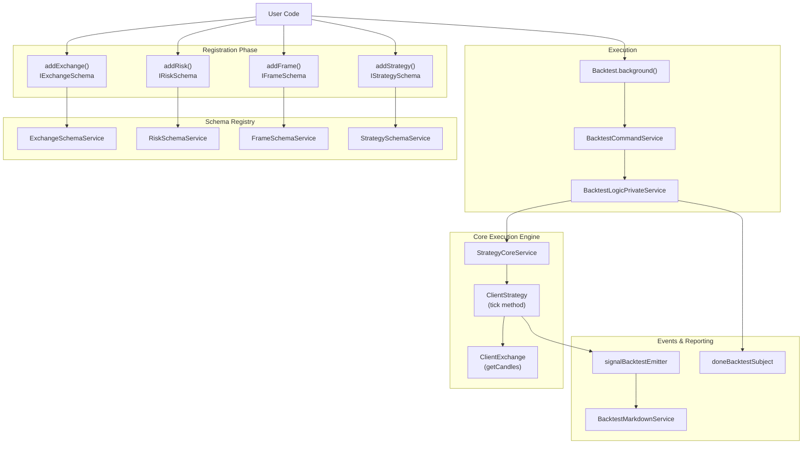
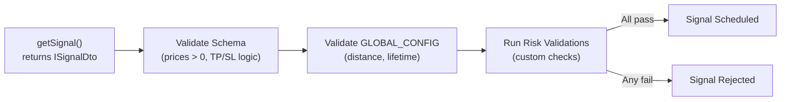
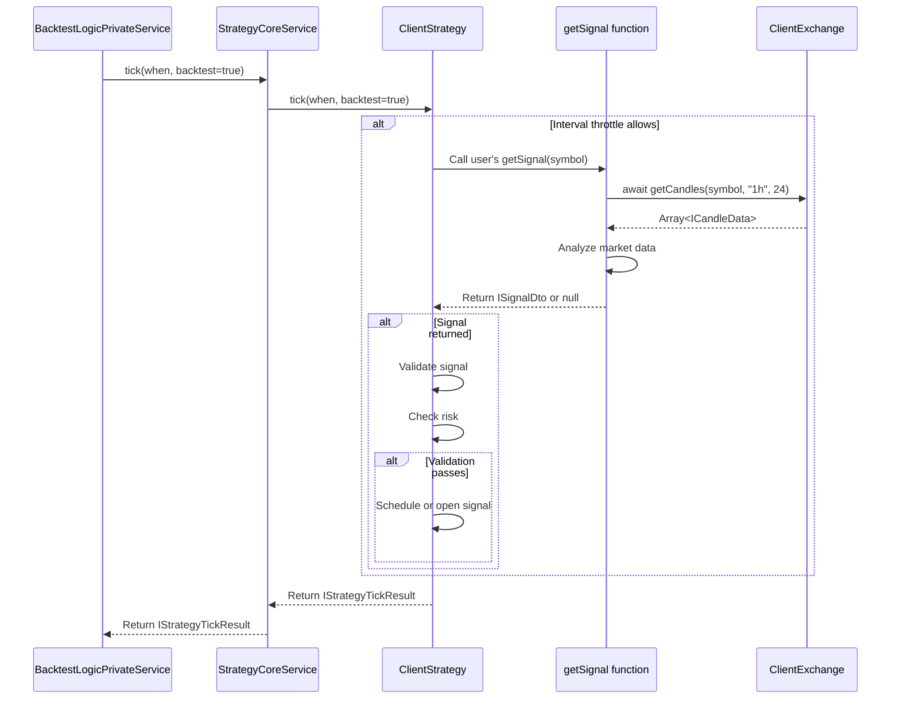
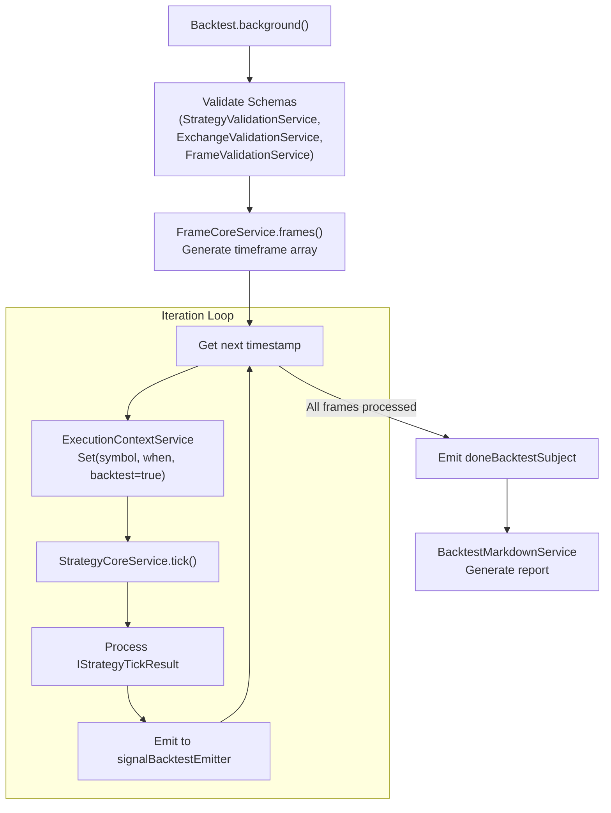

# Your First Backtest

## Purpose and Scope

This page provides a step-by-step tutorial for running your first backtest with Backtest Kit. You will configure an exchange, define a timeframe, create a simple trading strategy, and execute a backtest. By the end, you will understand the core workflow and be ready to develop your own strategies.

For installation instructions and dependencies, see [Installation & Setup](./04_getting-started.md). For additional examples demonstrating different patterns, see [Quick Start Examples](./04_getting-started.md). For detailed strategy development concepts, see [Strategy Development](./25_strategy-development.md).

---

## Prerequisites

Before proceeding, ensure you have:
- Installed `backtest-kit` and `ccxt` via npm (see [Installation & Setup](./04_getting-started.md))
- TypeScript 5.0+ configured in your project
- Basic understanding of trading concepts (long/short positions, take profit, stop loss)

---

## Overview: What We'll Build

We will create a minimal backtest that:
1. Connects to Binance historical data via CCXT
2. Tests a simple strategy on BTC/USDT
3. Runs over a 1-day timeframe (2025-12-01 to 2025-12-02)
4. Generates a markdown report with results

### Component Architecture



**Component Registration Flow**: User code registers schemas via global functions. Schemas are stored in schema services. During execution, services are retrieved and instantiated into client objects.

**Sources**: [README.md:65-159](), [src/classes/Backtest.ts:359-601]()

---

## Step 1: Configure the Exchange

The exchange provides historical market data. We use CCXT to fetch candle data from Binance.

### Exchange Schema Definition

```typescript
import ccxt from 'ccxt';
import { addExchange } from 'backtest-kit';

addExchange({
  exchangeName: 'binance',
  getCandles: async (symbol, interval, since, limit) => {
    const exchange = new ccxt.binance();
    const ohlcv = await exchange.fetchOHLCV(symbol, interval, since.getTime(), limit);
    return ohlcv.map(([timestamp, open, high, low, close, volume]) => ({
      timestamp,
      open,
      high,
      low,
      close,
      volume,
    }));
  },
  formatPrice: (symbol, price) => price.toFixed(2),
  formatQuantity: (symbol, quantity) => quantity.toFixed(8),
});
```

### IExchangeSchema Interface

| Property | Type | Description |
|----------|------|-------------|
| `exchangeName` | `string` | Unique identifier for this exchange configuration |
| `getCandles` | `function` | Async function returning candle data array |
| `formatPrice` | `function` | Formats price for exchange precision rules |
| `formatQuantity` | `function` | Formats quantity for exchange lot size rules |

The `getCandles` function receives:
- `symbol`: Trading pair (e.g., "BTC/USDT")
- `interval`: Timeframe string ("1m", "5m", "1h", etc.)
- `since`: Start date (Date object)
- `limit`: Number of candles to fetch

**Sources**: [README.md:70-80](), [src/lib/services/schema/ExchangeSchemaService.ts]()

---

## Step 2: Define Risk Profile

Risk profiles validate signals before they execute. This prevents unprofitable or dangerous trades.

### Basic Risk Validation

```typescript
import { addRisk } from 'backtest-kit';

addRisk({
  riskName: 'basic-risk',
  validations: [
    // Ensure take profit is at least 1% away
    ({ pendingSignal, currentPrice }) => {
      const { priceOpen = currentPrice, priceTakeProfit, position } = pendingSignal;
      const tpDistance = position === 'long'
        ? ((priceTakeProfit - priceOpen) / priceOpen) * 100
        : ((priceOpen - priceTakeProfit) / priceOpen) * 100;
      
      if (tpDistance < 1) {
        throw new Error(`TP too close: ${tpDistance.toFixed(2)}%`);
      }
    },
    
    // Ensure risk/reward ratio is at least 2:1
    ({ pendingSignal, currentPrice }) => {
      const { priceOpen = currentPrice, priceTakeProfit, priceStopLoss, position } = pendingSignal;
      const reward = position === 'long'
        ? priceTakeProfit - priceOpen
        : priceOpen - priceTakeProfit;
      const risk = position === 'long'
        ? priceOpen - priceStopLoss
        : priceStopLoss - priceOpen;
      
      if (reward / risk < 2) {
        throw new Error('Poor R/R ratio');
      }
    },
  ],
});
```

### Validation Execution Flow



**Validation Stages**: Signals pass through schema validation (structural checks), global config validation (distance/lifetime limits), and custom risk validations before scheduling.

**Sources**: [README.md:83-100](), [test/e2e/sanitize.test.mjs:26-122]()

---

## Step 3: Define Timeframe

The timeframe determines the backtest period and candle interval.

### Frame Schema Definition

```typescript
import { addFrame } from 'backtest-kit';

addFrame({
  frameName: '1d-test',
  interval: '1m',
  startDate: new Date('2025-12-01T00:00:00Z'),
  endDate: new Date('2025-12-02T00:00:00Z'),
});
```

### IFrameSchema Interface

| Property | Type | Description |
|----------|------|-------------|
| `frameName` | `string` | Unique identifier for this timeframe |
| `interval` | `SignalInterval` | Candle interval: "1m", "5m", "15m", "30m", "1h", "4h", "1d" |
| `startDate` | `Date` | Backtest start timestamp |
| `endDate` | `Date` | Backtest end timestamp |

**Execution Model**: The backtest engine iterates through time from `startDate` to `endDate` at `interval` increments. Each tick represents one minute of simulated time. The strategy's `interval` parameter (separate from frame interval) determines how often `getSignal()` is called.

**Sources**: [README.md:103-108](), [src/lib/services/logic/backtest/BacktestLogicPrivateService.ts]()

---

## Step 4: Create Strategy

Strategies contain the trading logic. The `getSignal` function analyzes market data and returns trading signals.

### Simple Strategy Example

```typescript
import { addStrategy, getCandles } from 'backtest-kit';

addStrategy({
  strategyName: 'simple-momentum',
  interval: '5m',
  riskName: 'basic-risk',
  getSignal: async (symbol) => {
    // Fetch recent candles for analysis
    const candles1h = await getCandles(symbol, '1h', 24);
    const candles5m = await getCandles(symbol, '5m', 60);
    
    // Calculate simple momentum
    const recentCandles = candles5m.slice(-10);
    const avgClose = recentCandles.reduce((sum, c) => sum + c.close, 0) / recentCandles.length;
    const currentPrice = candles5m[candles5m.length - 1].close;
    
    // Entry logic: price above average = bullish
    if (currentPrice > avgClose * 1.02) {
      return {
        position: 'long',
        priceOpen: currentPrice * 0.99,  // Limit order 1% below
        priceTakeProfit: currentPrice * 1.03,  // 3% profit target
        priceStopLoss: currentPrice * 0.97,  // 3% stop loss
        minuteEstimatedTime: 60,  // 1 hour max lifetime
        note: 'Momentum breakout',
      };
    }
    
    return null;  // No signal
  },
});
```

### IStrategySchema Interface

| Property | Type | Required | Description |
|----------|------|----------|-------------|
| `strategyName` | `string` | Yes | Unique identifier for this strategy |
| `interval` | `SignalInterval` | Yes | How often `getSignal()` is called |
| `getSignal` | `function` | Yes | Async function returning `ISignalDto \| null` |
| `riskName` | `string` | No | Single risk profile to use |
| `riskList` | `string[]` | No | Multiple risk profiles (all must pass) |
| `callbacks` | `IStrategyCallbacks` | No | Lifecycle event handlers |

### Signal Generation Flow



**Interval Throttling**: Even though `tick()` is called every minute, `getSignal()` only executes at `interval` frequency (e.g., every 5 minutes for `interval: '5m'`). This prevents signal spam.

**Sources**: [README.md:112-143](), [src/classes/Backtest.ts:149-178]()

---

## Step 5: Run Backtest

Execute the backtest and handle results via event listeners or async iterator.

### Event-Driven Execution (Background Mode)

```typescript
import { Backtest, listenSignalBacktest, listenDoneBacktest } from 'backtest-kit';

// Subscribe to signal events
listenSignalBacktest((event) => {
  if (event.action === 'closed') {
    console.log(`Signal closed: ${event.result} | PNL: ${event.pnl.pnlPercentage.toFixed(2)}%`);
  }
});

// Subscribe to completion event
listenDoneBacktest(async (event) => {
  console.log('Backtest complete!');
  await Backtest.dump(event.symbol, event.strategyName);
});

// Start backtest in background
Backtest.background('BTCUSDT', {
  strategyName: 'simple-momentum',
  exchangeName: 'binance',
  frameName: '1d-test',
});
```

### Pull-Based Execution (Async Iterator)

```typescript
import { Backtest } from 'backtest-kit';

for await (const event of Backtest.run('BTCUSDT', {
  strategyName: 'simple-momentum',
  exchangeName: 'binance',
  frameName: '1d-test',
})) {
  if (event.action === 'closed') {
    console.log(`PNL: ${event.pnl.pnlPercentage.toFixed(2)}%`);
  }
}

// Backtest complete, generate report
await Backtest.dump('BTCUSDT', 'simple-momentum');
```

### Execution Flow Diagram



**Two Consumption Models**: `Backtest.background()` runs asynchronously and emits events. `Backtest.run()` returns an async generator for pull-based consumption. Both use the same underlying `BacktestLogicPrivateService`.

**Sources**: [README.md:145-159](), [src/classes/Backtest.ts:200-235](), [src/classes/Backtest.ts:378-400]()

---

## Understanding the Results

After backtest completion, retrieve statistics and reports.

### Getting Statistics Programmatically

```typescript
import { Backtest } from 'backtest-kit';

const stats = await Backtest.getData('BTCUSDT', 'simple-momentum');

console.log('=== Backtest Statistics ===');
console.log(`Total Trades: ${stats.totalTrades}`);
console.log(`Win Rate: ${stats.winRate?.toFixed(2)}%`);
console.log(`Total PNL: ${stats.totalPnl?.toFixed(2)}%`);
console.log(`Sharpe Ratio: ${stats.sharpeRatio?.toFixed(2)}`);
console.log(`Max Drawdown: ${stats.maxDrawdownPercent?.toFixed(2)}%`);
```

### BacktestStatisticsModel Structure

| Field | Type | Description |
|-------|------|-------------|
| `totalTrades` | `number` | Number of closed signals |
| `winRate` | `number \| null` | Percentage of winning trades |
| `totalPnl` | `number \| null` | Cumulative PNL percentage |
| `sharpeRatio` | `number \| null` | Risk-adjusted return metric |
| `maxDrawdownPercent` | `number \| null` | Largest peak-to-trough decline |
| `avgPnl` | `number \| null` | Average PNL per trade |
| `avgHoldingTime` | `number \| null` | Average trade duration (minutes) |

### Generating Markdown Reports

```typescript
import { Backtest } from 'backtest-kit';

// Generate report to console
const markdown = await Backtest.getReport('BTCUSDT', 'simple-momentum');
console.log(markdown);

// Save report to file (default: ./dump/backtest/simple-momentum.md)
await Backtest.dump('BTCUSDT', 'simple-momentum');

// Save to custom path
await Backtest.dump('BTCUSDT', 'simple-momentum', './reports/my-backtest');
```

**Report Contents**: The markdown report includes a summary section with key statistics, a detailed table of all closed signals (with timestamps, prices, PNL, holding time), and performance metrics.

**Sources**: [src/classes/Backtest.ts:276-282](), [src/classes/Backtest.ts:299-305](), [src/classes/Backtest.ts:325-337]()

---

## Complete Example

Here is the full working example combining all steps:

```typescript
import ccxt from 'ccxt';
import { 
  addExchange, 
  addRisk, 
  addFrame, 
  addStrategy, 
  Backtest,
  listenDoneBacktest,
  getCandles,
} from 'backtest-kit';

// 1. Configure exchange
addExchange({
  exchangeName: 'binance',
  getCandles: async (symbol, interval, since, limit) => {
    const exchange = new ccxt.binance();
    const ohlcv = await exchange.fetchOHLCV(symbol, interval, since.getTime(), limit);
    return ohlcv.map(([timestamp, open, high, low, close, volume]) => ({
      timestamp, open, high, low, close, volume,
    }));
  },
  formatPrice: (symbol, price) => price.toFixed(2),
  formatQuantity: (symbol, quantity) => quantity.toFixed(8),
});

// 2. Define risk profile
addRisk({
  riskName: 'basic-risk',
  validations: [
    ({ pendingSignal, currentPrice }) => {
      const { priceOpen = currentPrice, priceTakeProfit, position } = pendingSignal;
      const tpDistance = position === 'long'
        ? ((priceTakeProfit - priceOpen) / priceOpen) * 100
        : ((priceOpen - priceTakeProfit) / priceOpen) * 100;
      if (tpDistance < 1) throw new Error(`TP too close: ${tpDistance.toFixed(2)}%`);
    },
  ],
});

// 3. Define timeframe
addFrame({
  frameName: '1d-test',
  interval: '1m',
  startDate: new Date('2025-12-01T00:00:00Z'),
  endDate: new Date('2025-12-02T00:00:00Z'),
});

// 4. Create strategy
addStrategy({
  strategyName: 'simple-momentum',
  interval: '5m',
  riskName: 'basic-risk',
  getSignal: async (symbol) => {
    const candles5m = await getCandles(symbol, '5m', 60);
    const recentCandles = candles5m.slice(-10);
    const avgClose = recentCandles.reduce((sum, c) => sum + c.close, 0) / recentCandles.length;
    const currentPrice = candles5m[candles5m.length - 1].close;
    
    if (currentPrice > avgClose * 1.02) {
      return {
        position: 'long',
        priceOpen: currentPrice * 0.99,
        priceTakeProfit: currentPrice * 1.03,
        priceStopLoss: currentPrice * 0.97,
        minuteEstimatedTime: 60,
        note: 'Momentum breakout',
      };
    }
    return null;
  },
});

// 5. Run backtest
listenDoneBacktest(async (event) => {
  await Backtest.dump(event.symbol, event.strategyName);
  console.log('Backtest complete! Report saved to ./dump/backtest/');
});

Backtest.background('BTCUSDT', {
  strategyName: 'simple-momentum',
  exchangeName: 'binance',
  frameName: '1d-test',
});
```

**Sources**: [README.md:46-159](), [demo/backtest/package.json:1-18]()

---

## Key Concepts Summary

### Component Registration Order

The order of `add*()` calls doesn't matter, but all schemas must be registered **before** calling `Backtest.run()` or `Backtest.background()`.

### Context Propagation

The `ExecutionContextService` automatically provides `(symbol, when, backtest)` context to all functions. You never pass these explicitly - they're ambient via `AsyncLocalStorage`.

### Signal Queue Behavior

Only **one active signal per symbol** is allowed at any time. New signals wait in queue until the current signal closes. This prevents position size explosions.

### Look-Ahead Bias Prevention

`getCandles()` only returns data **up to the current `when` timestamp**. It's architecturally impossible to access future data during backtesting.

**Sources**: [README.md:186-199](), [test/README.md:6-24]()

---

## Next Steps

- Explore [Quick Start Examples](./04_getting-started.md) for more patterns
- Learn about [Signal Lifecycle](./08_core-concepts.md) to understand state transitions
- Read [Strategy Development](./25_strategy-development.md) for advanced techniques
- Study [Risk Management](./31_risk-management.md) for portfolio protection
- Review [Execution Modes](./20_execution-modes.md) to understand Live and Walker modes

**Sources**: [README.md:1-254]()