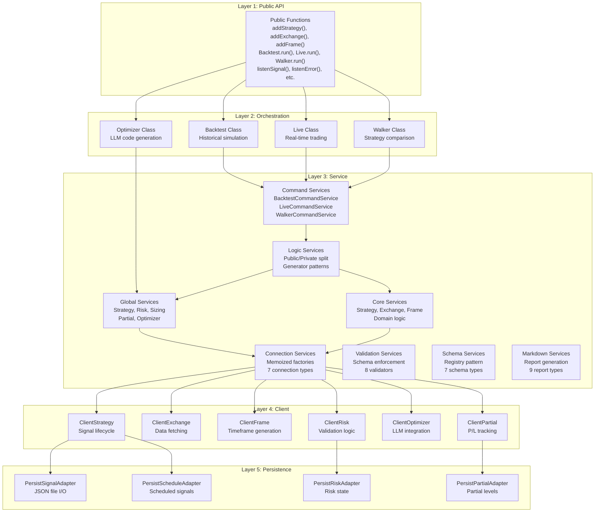
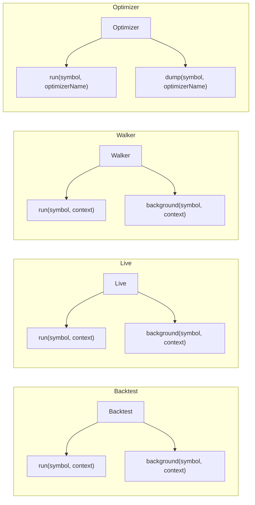
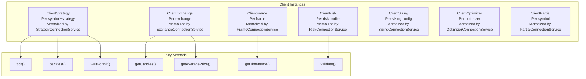
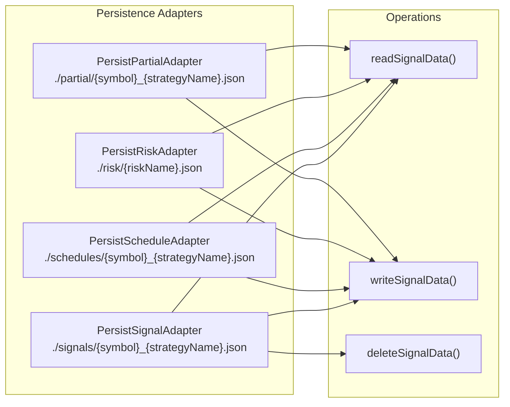
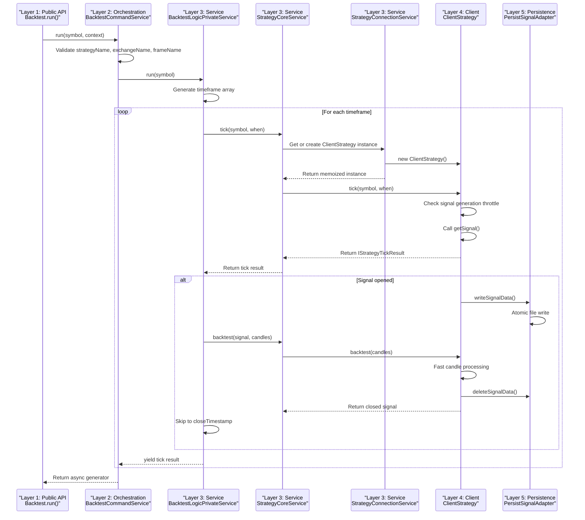
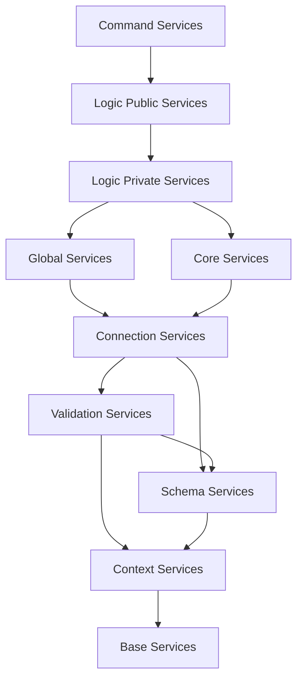

# Layered Architecture

# Layered Architecture

Relevant source files

The following files were used as context for generating this wiki page:

- [assets/uml.svg](assets/uml.svg)
- [docs/classes/WalkerCommandService.md](docs/classes/WalkerCommandService.md)
- [docs/interfaces/BacktestStatistics.md](docs/interfaces/BacktestStatistics.md)
- [docs/interfaces/IStrategyCallbacks.md](docs/interfaces/IStrategyCallbacks.md)
- [docs/interfaces/LiveStatistics.md](docs/interfaces/LiveStatistics.md)
- [docs/internals.md](docs/internals.md)
- [docs/types/IStrategyTickResult.md](docs/types/IStrategyTickResult.md)
- [docs/uml.puml](docs/uml.puml)
- [scripts/uml.mjs](scripts/uml.mjs)
- [src/function/add.ts](src/function/add.ts)
- [src/function/list.ts](src/function/list.ts)
- [src/lib/core/provide.ts](src/lib/core/provide.ts)
- [src/lib/core/types.ts](src/lib/core/types.ts)
- [src/lib/index.ts](src/lib/index.ts)

## Purpose and Scope

This document describes the five-layer architecture of backtest-kit, explaining the responsibilities and boundaries of each layer: Public API, Orchestration, Service, Client, and Persistence. Each layer has specific concerns and dependencies flow unidirectionally from top to bottom.

For information about the dependency injection system that wires these layers together, see [Dependency Injection System](./08-dependency-injection-system.md). For details on individual service categories, see [Service Categories](./09-service-categories.md). For client implementations, see [Client Layer](./10-client-layer.md).

---

## Architectural Overview

The framework implements a strict layered architecture with five distinct layers. Each layer has clear responsibilities and dependencies flow downward only—higher layers depend on lower layers, but not vice versa.

**Sources:** [docs/internals.md:28-40](), High-Level System Architecture Diagram 1

---

## Layer 1: Public API

The Public API Layer provides user-facing functions that serve as the framework's entry points. This layer has no business logic—it delegates immediately to the Orchestration Layer.

### Registration Functions

| Function | Purpose | Target Service |
|----------|---------|----------------|
| `addStrategy()` | Register trading strategy | `StrategySchemaService` |
| `addExchange()` | Register data source | `ExchangeSchemaService` |
| `addFrame()` | Register timeframe | `FrameSchemaService` |
| `addWalker()` | Register strategy walker | `WalkerSchemaService` |
| `addSizing()` | Register position sizing | `SizingSchemaService` |
| `addRisk()` | Register risk profile | `RiskSchemaService` |
| `addOptimizer()` | Register LLM optimizer | `OptimizerSchemaService` |

### Execution Functions

| Function | Purpose | Target Class |
|----------|---------|--------------|
| `Backtest.run()` | Historical simulation | `BacktestCommandService` |
| `Live.run()` | Real-time trading | `LiveCommandService` |
| `Walker.run()` | Strategy comparison | `WalkerCommandService` |
| `Optimizer.run()` | LLM code generation | `OptimizerGlobalService` |

### Event Listeners

| Function | Purpose | Event Emitter |
|----------|---------|---------------|
| `listenSignal()` | All signal events | `signalEmitter` |
| `listenSignalBacktest()` | Backtest signals only | `signalBacktestEmitter` |
| `listenSignalLive()` | Live signals only | `signalLiveEmitter` |
| `listenError()` | Recoverable errors | `errorEmitter` |
| `listenExit()` | Fatal errors | `exitEmitter` |

**Sources:** [src/function/add.ts:1-444](), [src/function/list.ts:1-261](), [docs/internals.md:133-389]()

---

## Layer 2: Orchestration

The Orchestration Layer implements the four execution modes as public classes. Each class validates inputs and delegates to Command Services.

### Execution Patterns

Each orchestration class implements two execution patterns:

1. **Synchronous Pattern** (`run()`) - Returns async generator, caller controls iteration
2. **Background Pattern** (`background()`) - Runs in background with error emitters

The background pattern wraps the generator in error handling and emits completion events via `doneBacktestSubject`, `doneLiveSubject`, or `doneWalkerSubject`.

**Sources:** [src/classes/Backtest.ts](), [src/classes/Live.ts](), [src/classes/Walker.ts](), [src/classes/Optimizer.ts](), [docs/internals.md:54-82]()

---

## Layer 3: Service Layer

The Service Layer is the most complex layer, implementing dependency injection with 11 service categories. All services are registered via [src/lib/core/provide.ts:1-141]() and aggregated into the `backtest` singleton at [src/lib/index.ts:221-234]().

### Service Aggregation Structure

```mermaid
graph TB
    BACKTEST["backtest object<br/>[src/lib/index.ts:221-234]()"]
    
    BASE["baseServices<br/>loggerService"]
    CTX["contextServices<br/>executionContextService<br/>methodContextService"]
    SCHEMA["schemaServices<br/>7 schema registries"]
    VAL["validationServices<br/>8 validators"]
    CONN["connectionServices<br/>7 memoized factories"]
    CORE["coreServices<br/>3 domain services"]
    GLOBAL["globalServices<br/>4 shared state managers"]
    CMD["commandServices<br/>3 orchestrators"]
    LOGIC["logicPublicServices<br/>logicPrivateServices<br/>6 execution services"]
    MD["markdownServices<br/>9 report generators"]
    TMPL["templateServices<br/>optimizerTemplateService"]
    
    BACKTEST --> BASE
    BACKTEST --> CTX
    BACKTEST --> SCHEMA
    BACKTEST --> VAL
    BACKTEST --> CONN
    BACKTEST --> CORE
    BACKTEST --> GLOBAL
    BACKTEST --> CMD
    BACKTEST --> LOGIC
    BACKTEST --> MD
    BACKTEST --> TMPL
```

### 3.1 Base Services

Provides foundational logging functionality used by all other services.

| Service | Symbol | Purpose |
|---------|--------|---------|
| `LoggerService` | `TYPES.loggerService` | Structured logging with context injection |

**Sources:** [src/lib/index.ts:60-62](), [src/lib/core/types.ts:1-3](), [src/lib/core/provide.ts:55-57]()

### 3.2 Context Services

Manages execution context propagation using `di-scoped` pattern.

| Service | Symbol | Purpose |
|---------|--------|---------|
| `ExecutionContextService` | `TYPES.executionContextService` | `symbol`, `when`, `backtest` flag |
| `MethodContextService` | `TYPES.methodContextService` | `strategyName`, `exchangeName`, `frameName` routing |

**Sources:** [src/lib/index.ts:64-71](), [src/lib/core/types.ts:5-8](), [src/lib/core/provide.ts:59-62]()

### 3.3 Schema Services

Implements registry pattern for configuration storage using `ToolRegistry` from `functools-kit`.

| Service | Symbol | Stores |
|---------|--------|--------|
| `StrategySchemaService` | `TYPES.strategySchemaService` | `IStrategySchema` |
| `ExchangeSchemaService` | `TYPES.exchangeSchemaService` | `IExchangeSchema` |
| `FrameSchemaService` | `TYPES.frameSchemaService` | `IFrameSchema` |
| `WalkerSchemaService` | `TYPES.walkerSchemaService` | `IWalkerSchema` |
| `SizingSchemaService` | `TYPES.sizingSchemaService` | `ISizingSchema` |
| `RiskSchemaService` | `TYPES.riskSchemaService` | `IRiskSchema` |
| `OptimizerSchemaService` | `TYPES.optimizerSchemaService` | `IOptimizerSchema` |

**Sources:** [src/lib/index.ts:97-111](), [src/lib/core/types.ts:20-28](), [src/lib/core/provide.ts:74-82]()

### 3.4 Validation Services

Enforces schema existence and structural validation with memoization for performance.

| Service | Symbol | Validates |
|---------|--------|-----------|
| `StrategyValidationService` | `TYPES.strategyValidationService` | Strategy schema structure |
| `ExchangeValidationService` | `TYPES.exchangeValidationService` | Exchange schema structure |
| `FrameValidationService` | `TYPES.frameValidationService` | Frame date ranges |
| `WalkerValidationService` | `TYPES.walkerValidationService` | Walker strategy lists |
| `SizingValidationService` | `TYPES.sizingValidationService` | Sizing parameters |
| `RiskValidationService` | `TYPES.riskValidationService` | Risk profile existence |
| `OptimizerValidationService` | `TYPES.optimizerValidationService` | Optimizer configuration |
| `ConfigValidationService` | `TYPES.configValidationService` | Global config viability |

**Sources:** [src/lib/index.ts:188-213](), [src/lib/core/types.ts:73-82](), [src/lib/core/provide.ts:127-136]()

### 3.5 Connection Services

Provides memoized client instance factories. Each service caches client instances by unique keys.

| Service | Symbol | Key Pattern | Creates |
|---------|--------|-------------|---------|
| `StrategyConnectionService` | `TYPES.strategyConnectionService` | `symbol:strategyName` | `ClientStrategy` |
| `ExchangeConnectionService` | `TYPES.exchangeConnectionService` | `exchangeName` | `ClientExchange` |
| `FrameConnectionService` | `TYPES.frameConnectionService` | `frameName` | `ClientFrame` |
| `SizingConnectionService` | `TYPES.sizingConnectionService` | `sizingName` | `ClientSizing` |
| `RiskConnectionService` | `TYPES.riskConnectionService` | `riskName` | `ClientRisk` |
| `OptimizerConnectionService` | `TYPES.optimizerConnectionService` | `optimizerName` | `ClientOptimizer` |
| `PartialConnectionService` | `TYPES.partialConnectionService` | `symbol` | `ClientPartial` |

**Sources:** [src/lib/index.ts:73-95](), [src/lib/core/types.ts:10-18](), [src/lib/core/provide.ts:64-72]()

### 3.6 Core Services

Implements domain logic for strategy execution, exchange data, and timeframe generation.

| Service | Symbol | Purpose |
|---------|--------|---------|
| `StrategyCoreService` | `TYPES.strategyCoreService` | `tick()`, `backtest()` signal lifecycle |
| `ExchangeCoreService` | `TYPES.exchangeCoreService` | `getCandles()`, VWAP calculation |
| `FrameCoreService` | `TYPES.frameCoreService` | `getTimeframe()` date iteration |

**Sources:** [src/lib/index.ts:113-117](), [src/lib/core/types.ts:30-34](), [src/lib/core/provide.ts:84-88]()

### 3.7 Global Services

Manages shared state across multiple strategy instances.

| Service | Symbol | Manages |
|---------|--------|---------|
| `SizingGlobalService` | `TYPES.sizingGlobalService` | Position size calculation |
| `RiskGlobalService` | `TYPES.riskGlobalService` | Active positions tracking |
| `OptimizerGlobalService` | `TYPES.optimizerGlobalService` | LLM orchestration |
| `PartialGlobalService` | `TYPES.partialGlobalService` | P/L milestone tracking |

**Sources:** [src/lib/index.ts:119-128](), [src/lib/core/types.ts:36-41](), [src/lib/core/provide.ts:90-95]()

### 3.8 Command Services

High-level orchestrators that validate inputs and delegate to Logic Services.

| Service | Symbol | Orchestrates |
|---------|--------|--------------|
| `BacktestCommandService` | `TYPES.backtestCommandService` | Backtest execution |
| `LiveCommandService` | `TYPES.liveCommandService` | Live execution |
| `WalkerCommandService` | `TYPES.walkerCommandService` | Walker execution |

**Sources:** [src/lib/index.ts:130-138](), [src/lib/core/types.ts:43-47](), [src/lib/core/provide.ts:97-101]()

### 3.9 Logic Services

Implements execution flow as async generators with public/private split. Public services handle context setup, private services implement generator logic.

| Service | Symbol | Pattern |
|---------|--------|---------|
| `BacktestLogicPublicService` | `TYPES.backtestLogicPublicService` | Context wrapper |
| `BacktestLogicPrivateService` | `TYPES.backtestLogicPrivateService` | Timeframe iteration |
| `LiveLogicPublicService` | `TYPES.liveLogicPublicService` | Context wrapper |
| `LiveLogicPrivateService` | `TYPES.liveLogicPrivateService` | Infinite loop |
| `WalkerLogicPublicService` | `TYPES.walkerLogicPublicService` | Context wrapper |
| `WalkerLogicPrivateService` | `TYPES.walkerLogicPrivateService` | Sequential backtests |

**Sources:** [src/lib/index.ts:140-162](), [src/lib/core/types.ts:49-59](), [src/lib/core/provide.ts:103-113]()

### 3.10 Markdown Services

Generates reports by subscribing to event emitters and accumulating data with bounded queues.

| Service | Symbol | Subscribes To | MAX_EVENTS |
|---------|--------|---------------|------------|
| `BacktestMarkdownService` | `TYPES.backtestMarkdownService` | `signalBacktestEmitter` | 250 |
| `LiveMarkdownService` | `TYPES.liveMarkdownService` | `signalLiveEmitter` | 250 |
| `ScheduleMarkdownService` | `TYPES.scheduleMarkdownService` | `signalEmitter` | 250 |
| `PerformanceMarkdownService` | `TYPES.performanceMarkdownService` | `performanceEmitter` | 10000 |
| `WalkerMarkdownService` | `TYPES.walkerMarkdownService` | `walkerEmitter` | Unbounded |
| `HeatMarkdownService` | `TYPES.heatMarkdownService` | `signalEmitter` | Unbounded |
| `PartialMarkdownService` | `TYPES.partialMarkdownService` | `partialProfitSubject`, `partialLossSubject` | 250 |
| `OutlineMarkdownService` | `TYPES.outlineMarkdownService` | N/A | N/A |
| `RiskMarkdownService` | `TYPES.riskMarkdownService` | `riskSubject` | Unbounded |

**Sources:** [src/lib/index.ts:164-186](), [src/lib/core/types.ts:61-71](), [src/lib/core/provide.ts:115-125]()

### 3.11 Template Services

Generates code templates for optimizer output.

| Service | Symbol | Purpose |
|---------|--------|---------|
| `OptimizerTemplateService` | `TYPES.optimizerTemplateService` | Default code templates |

**Sources:** [src/lib/index.ts:215-219](), [src/lib/core/types.ts:84-86](), [src/lib/core/provide.ts:138-140]()

---

## Layer 4: Client Layer

The Client Layer contains pure business logic without dependency injection. Client classes use prototype methods for memory efficiency and are instantiated by Connection Services.

### Client Responsibilities

| Client | Purpose | Key Methods |
|--------|---------|-------------|
| `ClientStrategy` | Signal lifecycle management | `tick()`, `backtest()`, `waitForInit()` |
| `ClientExchange` | Data fetching and VWAP | `getCandles()`, `getAveragePrice()`, `getNextCandles()` |
| `ClientFrame` | Timeframe generation | `getTimeframe()` |
| `ClientRisk` | Portfolio validation | `validate()`, `getActivePositions()` |
| `ClientSizing` | Position size calculation | `calculate()` |
| `ClientOptimizer` | LLM integration | `run()`, Template merging |
| `ClientPartial` | P/L milestone tracking | `check()`, Set-based deduplication |

**Sources:** [docs/internals.md:30](), High-Level System Architecture Diagram 1

---

## Layer 5: Persistence Layer

The Persistence Layer implements crash-safe state storage using atomic JSON file writes. All persistence adapters extend `PersistBase` and follow the singleshot initialization pattern.

### Persistence Patterns

1. **Atomic Writes** - Write to temporary file, then rename to target path
2. **Singleshot Init** - `waitForInit()` loads persisted state once per instance
3. **Crash Recovery** - Live mode reads persisted signals on startup
4. **Pluggable Adapters** - Extend `PersistBase` for custom storage backends

### File Locations

| Adapter | File Pattern | Purpose |
|---------|--------------|---------|
| `PersistSignalAdapter` | `./signals/{symbol}_{strategyName}.json` | Open signal state |
| `PersistScheduleAdapter` | `./schedules/{symbol}_{strategyName}.json` | Scheduled signals |
| `PersistRiskAdapter` | `./risk/{riskName}.json` | Active positions |
| `PersistPartialAdapter` | `./partial/{symbol}_{strategyName}.json` | P/L milestones |

**Sources:** [docs/internals.md:38](), [docs/internals.md:50]()

---

## Layer Interaction Flow

This diagram shows how a typical Backtest execution flows through all five layers:

**Sources:** [docs/internals.md:54-66](), High-Level System Architecture Diagram 2

---

## Dependency Flow

Dependencies flow strictly downward. This table shows which layers depend on which:

| Layer | Depends On | Does Not Depend On |
|-------|------------|--------------------|
| Public API | Orchestration | Service, Client, Persistence |
| Orchestration | Service (Command) | Client, Persistence |
| Service | Service (lower categories), Client, Persistence | Orchestration, Public API |
| Client | Persistence | Service, Orchestration, Public API |
| Persistence | None | All other layers |

### Service Category Dependencies

Within the Service Layer, dependencies flow in this order:

**Sources:** [src/lib/index.ts:221-234](), High-Level System Architecture Diagram 3

---

## Summary

The five-layer architecture ensures clear separation of concerns:

1. **Public API Layer** - User-facing functions with no business logic
2. **Orchestration Layer** - Execution mode implementations (Backtest, Live, Walker, Optimizer)
3. **Service Layer** - 11 service categories implementing dependency injection
4. **Client Layer** - Pure business logic without DI, memoized by Connection Services
5. **Persistence Layer** - Crash-safe storage with atomic writes

This architecture enables:
- **Testability** - Each layer can be tested in isolation
- **Extensibility** - New execution modes can be added without changing lower layers
- **Memory Efficiency** - Connection Services memoize client instances
- **Type Safety** - Discriminated unions and TypeScript throughout
- **Crash Recovery** - Persistence Layer enables state restoration

**Sources:** [docs/internals.md:10-52](), [src/lib/index.ts:1-242](), [src/lib/core/types.ts:1-104](), [src/lib/core/provide.ts:1-141]()