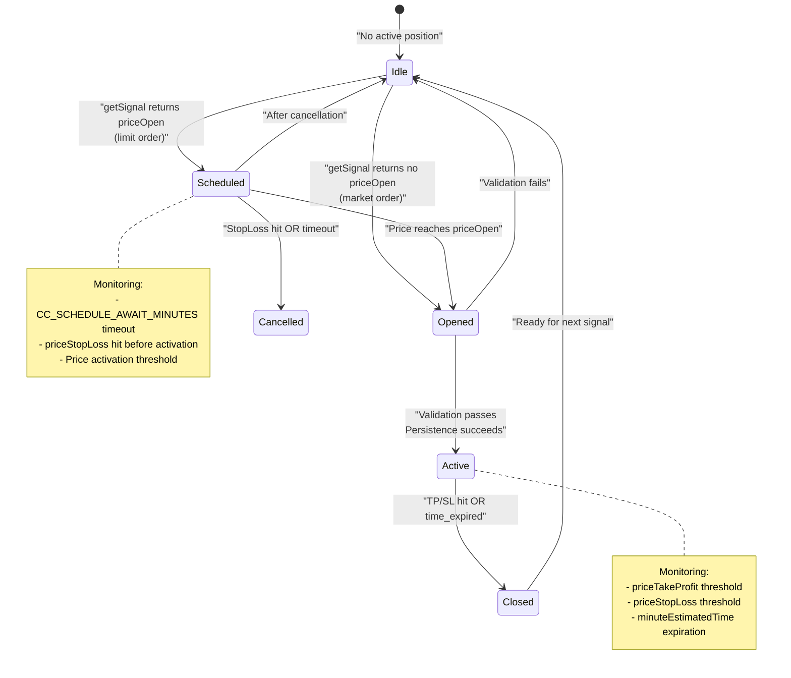
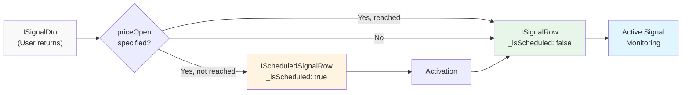
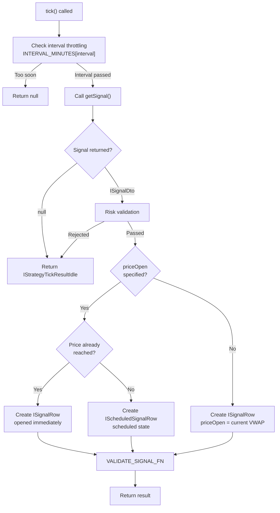
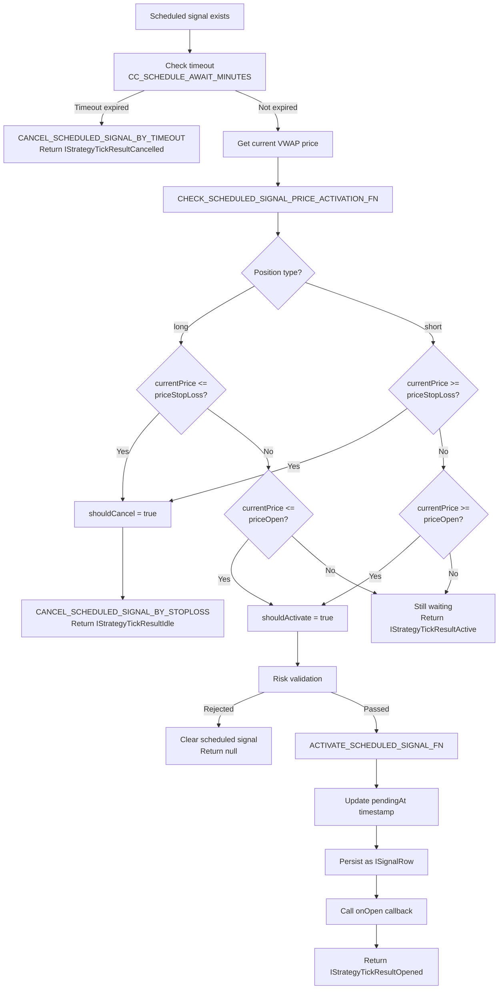
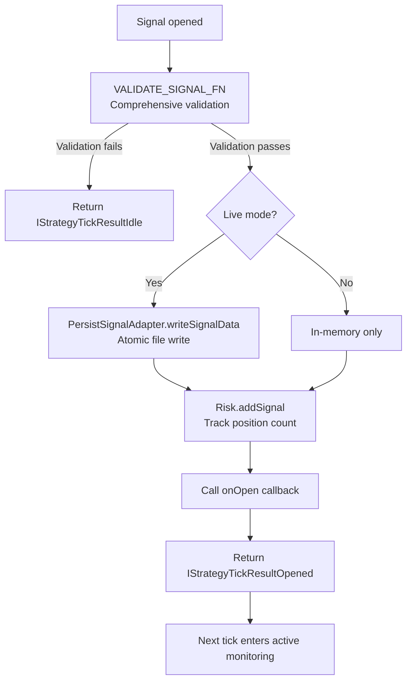
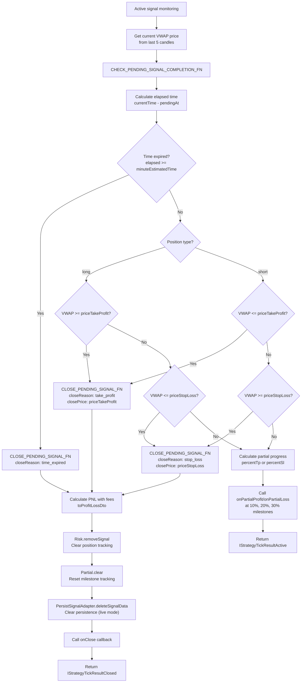

# Signal Lifecycle Overview

<details>
<summary>Relevant source files</summary>

The following files were used as context for generating this wiki page:

- [README.md](README.md)
- [src/client/ClientStrategy.ts](src/client/ClientStrategy.ts)
- [src/config/emitters.ts](src/config/emitters.ts)
- [src/function/event.ts](src/function/event.ts)
- [src/index.ts](src/index.ts)
- [src/interfaces/Strategy.interface.ts](src/interfaces/Strategy.interface.ts)
- [test/e2e/defend.test.mjs](test/e2e/defend.test.mjs)
- [test/index.mjs](test/index.mjs)
- [types.d.ts](types.d.ts)

</details>


## Purpose and Scope

This document provides a high-level overview of how trading signals progress through their lifecycle states in the backtest-kit framework. It covers the state machine model, signal types, state transitions, validation rules, and monitoring logic.

For detailed information about:
- Execution mode differences (backtest vs live), see [Execution Modes](#2.1)
- Component registration and schema definitions, see [Component Registration](#2.3)
- Deep dive into each signal state, see [Signal States](#8.1)
- Signal persistence and crash recovery, see [Signal Persistence](#8.4)

---

## Signal State Machine

The framework implements a type-safe state machine using discriminated unions. Every signal passes through well-defined states from creation to closure. The `action` field serves as the discriminator for type safety.



**Key States:**
- `idle`: No active signal, strategy waiting to generate new signal
- `scheduled`: Limit order awaiting price activation at `priceOpen`
- `opened`: Signal just created and validated, transitioning to active monitoring
- `active`: Position monitoring TP/SL conditions
- `closed`: Signal completed with PNL calculation
- `cancelled`: Scheduled signal cancelled before activation

**Sources:** [src/interfaces/Strategy.interface.ts:171-311](), [src/client/ClientStrategy.ts:1-1500]()

---

## Signal Types

The framework uses two primary signal types with a clear transformation flow:



### ISignalDto

The data transfer object returned by the strategy's `getSignal` function:

| Field | Type | Description |
|-------|------|-------------|
| `position` | `"long" \| "short"` | Trade direction |
| `priceOpen` | `number?` | Optional entry price (if specified → scheduled) |
| `priceTakeProfit` | `number` | TP target price |
| `priceStopLoss` | `number` | SL exit price |
| `minuteEstimatedTime` | `number` | Max duration in minutes |
| `note` | `string?` | Optional description |

**Sources:** [src/interfaces/Strategy.interface.ts:24-39]()

### ISignalRow

Augmented signal with auto-generated metadata:

| Field | Type | Description |
|-------|------|-------------|
| `id` | `string` | UUID v4 auto-generated |
| `priceOpen` | `number` | Entry price (current VWAP if not specified) |
| `symbol` | `string` | Trading pair (e.g., "BTCUSDT") |
| `exchangeName` | `string` | Exchange identifier |
| `strategyName` | `string` | Strategy identifier |
| `scheduledAt` | `number` | Creation timestamp (ms) |
| `pendingAt` | `number` | Activation timestamp (ms) |
| `_isScheduled` | `boolean` | Internal runtime marker |

**Sources:** [src/interfaces/Strategy.interface.ts:45-62]()

### IScheduledSignalRow

Extends `ISignalRow` for signals awaiting price activation. The `pendingAt` field is initially set to `scheduledAt` and updated upon activation.

**Sources:** [src/interfaces/Strategy.interface.ts:64-73]()

---

## State Transitions

### Idle → Scheduled/Opened

The transition from idle begins when `getSignal` returns a non-null signal. The framework performs interval throttling based on the strategy's configured `interval` field.



**Interval Throttling Logic:**

The `_lastSignalTimestamp` field tracks the last `getSignal` call. The interval check prevents signal spam:

```typescript
// From ClientStrategy.ts:340-352
const currentTime = self.params.execution.context.when.getTime();
const intervalMinutes = INTERVAL_MINUTES[self.params.interval];
const intervalMs = intervalMinutes * 60 * 1000;

if (
  self._lastSignalTimestamp !== null &&
  currentTime - self._lastSignalTimestamp < intervalMs
) {
  return null; // Skip this tick
}
self._lastSignalTimestamp = currentTime;
```

**Price Activation Check:**

For signals with `priceOpen`, immediate activation occurs if the price has already reached the entry threshold:

```typescript
// From ClientStrategy.ts:393-420
const shouldActivateImmediately =
  (signal.position === "long" && currentPrice <= signal.priceOpen) ||
  (signal.position === "short" && currentPrice >= signal.priceOpen);

if (shouldActivateImmediately) {
  // Create ISignalRow directly (skip scheduled phase)
  const signalRow: ISignalRow = {
    id: randomString(),
    priceOpen: signal.priceOpen,
    // ... other fields
    _isScheduled: false,
  };
  return signalRow;
}
```

**Sources:** [src/client/ClientStrategy.ts:332-476](), [src/interfaces/Strategy.interface.ts:12-18]()

---

### Scheduled → Opened/Cancelled

Scheduled signals monitor three conditions on each tick: price activation, StopLoss hit, and timeout expiration.



**Priority Order:**

Cancellation checks occur **before** activation checks to prevent race conditions where a price gaps through both StopLoss and activation levels on the same candle:

```typescript
// From ClientStrategy.ts:610-644
if (scheduled.position === "long") {
  // Check StopLoss FIRST (cancellation priority)
  if (currentPrice <= scheduled.priceStopLoss) {
    shouldCancel = true;
  }
  // Only check activation if NOT cancelled
  else if (currentPrice <= scheduled.priceOpen) {
    shouldActivate = true;
  }
}
```

**Timeout Calculation:**

The timeout is measured from `scheduledAt`, not `pendingAt`:

```typescript
// From ClientStrategy.ts:554-566
const currentTime = self.params.execution.context.when.getTime();
const signalTime = scheduled.scheduledAt; // Important: from scheduledAt
const maxTimeToWait = GLOBAL_CONFIG.CC_SCHEDULE_AWAIT_MINUTES * 60 * 1000;
const elapsedTime = currentTime - signalTime;

if (elapsedTime >= maxTimeToWait) {
  // Cancel due to timeout
}
```

**Sources:** [src/client/ClientStrategy.ts:554-774](), [src/config/params.ts]()

---

### Opened → Active

The opened state is transient. After signal validation, the framework persists the signal (in live mode) and transitions to active monitoring:



**Validation Rules:**

The `VALIDATE_SIGNAL_FN` performs extensive validation to prevent invalid signals:

| Validation | Long Position | Short Position |
|------------|---------------|----------------|
| Price order | `SL < Open < TP` | `TP < Open < SL` |
| Positive prices | All prices > 0 | All prices > 0 |
| Finite values | No NaN/Infinity | No NaN/Infinity |
| Min TP distance | `CC_MIN_TAKEPROFIT_DISTANCE_PERCENT` | `CC_MIN_TAKEPROFIT_DISTANCE_PERCENT` |
| Min SL distance | `CC_MIN_STOPLOSS_DISTANCE_PERCENT` | `CC_MIN_STOPLOSS_DISTANCE_PERCENT` |
| Max SL distance | `CC_MAX_STOPLOSS_DISTANCE_PERCENT` | `CC_MAX_STOPLOSS_DISTANCE_PERCENT` |
| Max lifetime | `CC_MAX_SIGNAL_LIFETIME_MINUTES` | `CC_MAX_SIGNAL_LIFETIME_MINUTES` |
| Instant closure check | `SL < current < TP` | `TP < current < SL` |

**Immediate Closure Prevention:**

For market orders (non-scheduled), the framework verifies the current price doesn't trigger immediate TP/SL:

```typescript
// From ClientStrategy.ts:125-141 (long example)
if (!isScheduled && isFinite(currentPrice)) {
  // For long: current price must be BETWEEN SL and TP
  if (currentPrice <= signal.priceStopLoss) {
    errors.push(
      `Long immediate: currentPrice (${currentPrice}) <= priceStopLoss (${signal.priceStopLoss}). ` +
      `Signal would be immediately closed by stop loss.`
    );
  }
  
  if (currentPrice >= signal.priceTakeProfit) {
    errors.push(
      `Long immediate: currentPrice (${currentPrice}) >= priceTakeProfit (${signal.priceTakeProfit}). ` +
      `Signal would be immediately closed by take profit.`
    );
  }
}
```

**Sources:** [src/client/ClientStrategy.ts:45-330](), [src/client/ClientStrategy.ts:848-899]()

---

### Active → Closed

Active signals monitor three completion conditions on each tick: TakeProfit hit, StopLoss hit, or time expiration.



**Time Calculation:**

The elapsed time is measured from `pendingAt`, not `scheduledAt`. This ensures scheduled signals only count time after activation:

```typescript
// From ClientStrategy.ts:901-919
const currentTime = self.params.execution.context.when.getTime();
const signalTime = signal.pendingAt; // CRITICAL: from pendingAt, not scheduledAt
const maxTimeToWait = signal.minuteEstimatedTime * 60 * 1000;
const elapsedTime = currentTime - signalTime;

if (elapsedTime >= maxTimeToWait) {
  return await CLOSE_PENDING_SIGNAL_FN(
    self,
    signal,
    averagePrice,
    "time_expired"
  );
}
```

**PNL Calculation:**

The framework applies realistic fees (0.1%) and slippage (0.1%) to both entry and exit prices:

| Fee Type | Long Position | Short Position |
|----------|---------------|----------------|
| Entry slippage | `priceOpen * 1.001` | `priceOpen * 0.999` |
| Entry fee | `priceOpen * 1.001` | `priceOpen * 0.999` |
| Exit slippage | `priceClose * 0.999` | `priceClose * 1.001` |
| Exit fee | `priceClose * 0.999` | `priceClose * 1.001` |

**Partial Progress Tracking:**

The framework calculates percentage progress toward TP or SL to trigger milestone callbacks:

```typescript
// From ClientStrategy.ts:1034-1053
if (signal.position === "long") {
  const currentDistance = currentPrice - signal.priceOpen;
  
  if (currentDistance > 0) {
    // Moving towards TP
    const tpDistance = signal.priceTakeProfit - signal.priceOpen;
    const progressPercent = (currentDistance / tpDistance) * 100;
    percentTp = Math.min(progressPercent, 100);
    
    await self.params.partial.profit(
      symbol,
      signal,
      currentPrice,
      percentTp,
      backtest,
      when
    );
  }
}
```

**Sources:** [src/client/ClientStrategy.ts:901-1023](), [src/helpers/toProfitLossDto.ts](), [src/client/ClientPartial.ts]()

---

## Execution Mode Differences

The lifecycle behaves differently in backtest and live modes:

| Aspect | Backtest Mode | Live Mode |
|--------|---------------|-----------|
| **Signal generation** | Per historical candle | Per tick interval (1 minute) |
| **VWAP calculation** | From candle OHLCV data | From last 5 1-minute candles |
| **TP/SL checking** | Check candle high/low | Check VWAP at intervals |
| **Fast-forward** | Skip candles after opening | No fast-forward, continuous monitoring |
| **Persistence** | In-memory only | Atomic file writes via `PersistSignalAdapter` |
| **Crash recovery** | Not applicable | Restore from disk on restart |
| **Scheduled activation** | Check exact candle timestamp | Check at polling intervals |

### Backtest Fast-Forward

After a signal opens, backtest mode calls `ClientStrategy.backtest()` which iterates through candles checking TP/SL conditions without calling `getSignal` again:

```typescript
// From BacktestLogicPrivateService (conceptual flow)
for (const timeframe of timeframes) {
  const result = await tick(symbol, strategyName);
  
  if (result.action === "opened") {
    // Fast-forward: fetch candles and run backtest
    const candles = await getCandles(...);
    const closeResult = await backtest(symbol, strategyName, candles);
    
    yield closeResult;
    
    // Skip timeframes until signal closes
    continue;
  }
}
```

### Live Continuous Monitoring

Live mode continuously polls at `TICK_TTL` intervals (default 60 seconds), checking VWAP against TP/SL on every tick:

```typescript
// From LiveLogicPrivateService (conceptual flow)
while (true) {
  const when = new Date();
  const result = await tick(symbol, strategyName);
  
  yield result;
  
  await sleep(GLOBAL_CONFIG.TICK_TTL);
}
```

**Sources:** [src/lib/services/logic/BacktestLogicPrivateService.ts](), [src/lib/services/logic/LiveLogicPrivateService.ts]()

---

## Code Entity Mapping

The following table maps high-level concepts to concrete code entities:

| Concept | Code Entity | Location |
|---------|-------------|----------|
| **Signal states** | `IStrategyTickResult` union | [src/interfaces/Strategy.interface.ts:299-305]() |
| Idle state | `IStrategyTickResultIdle` | [src/interfaces/Strategy.interface.ts:173-186]() |
| Scheduled state | `IStrategyTickResultScheduled` | [src/interfaces/Strategy.interface.ts:192-205]() |
| Opened state | `IStrategyTickResultOpened` | [src/interfaces/Strategy.interface.ts:211-224]() |
| Active state | `IStrategyTickResultActive` | [src/interfaces/Strategy.interface.ts:230-247]() |
| Closed state | `IStrategyTickResultClosed` | [src/interfaces/Strategy.interface.ts:253-272]() |
| Cancelled state | `IStrategyTickResultCancelled` | [src/interfaces/Strategy.interface.ts:278-293]() |
| **Signal types** | `ISignalDto`, `ISignalRow`, `IScheduledSignalRow` | [src/interfaces/Strategy.interface.ts:24-73]() |
| **Lifecycle orchestration** | `ClientStrategy` class | [src/client/ClientStrategy.ts:1-1500]() |
| Signal generation | `GET_SIGNAL_FN` | [src/client/ClientStrategy.ts:332-476]() |
| Signal validation | `VALIDATE_SIGNAL_FN` | [src/client/ClientStrategy.ts:45-330]() |
| Scheduled monitoring | `CHECK_SCHEDULED_SIGNAL_*` functions | [src/client/ClientStrategy.ts:554-846]() |
| Active monitoring | `CHECK_PENDING_SIGNAL_COMPLETION_FN` | [src/client/ClientStrategy.ts:901-960]() |
| Signal closure | `CLOSE_PENDING_SIGNAL_FN` | [src/client/ClientStrategy.ts:962-1023]() |
| **Persistence** | `PersistSignalAdapter` | [src/classes/Persist.ts]() |
| **Routing** | `StrategyConnectionService` | [src/lib/services/connection/StrategyConnectionService.ts:52-240]() |
| **Event emission** | `signalEmitter`, `signalBacktestEmitter`, `signalLiveEmitter` | [src/config/emitters.ts]() |
| **Callbacks** | `IStrategyCallbacks` interface | [src/interfaces/Strategy.interface.ts:100-126]() |

**Sources:** [src/client/ClientStrategy.ts:1-1500](), [src/interfaces/Strategy.interface.ts:1-392](), [src/lib/services/connection/StrategyConnectionService.ts:1-241]()

---

## Key Takeaways

1. **Type-safe state machine**: Discriminated unions (`action` field) enable exhaustive type checking at compile time.

2. **Two entry modes**: Scheduled signals (limit orders with `priceOpen`) vs immediate signals (market orders without `priceOpen`).

3. **Validation is comprehensive**: The framework prevents invalid signals before they enter active monitoring through price logic, distance checks, and instant closure detection.

4. **Time tracking distinction**: Scheduled signals use `scheduledAt` for timeout calculation, active signals use `pendingAt` for duration calculation.

5. **Cancellation priority**: StopLoss checks occur before activation checks in scheduled signals to handle price gaps correctly.

6. **Mode-specific optimizations**: Backtest uses fast-forward simulation, live uses continuous VWAP monitoring with persistence for crash recovery.

7. **Event-driven architecture**: Every state transition emits typed events via `signalEmitter`, `signalBacktestEmitter`, and `signalLiveEmitter` for external consumption.

**Sources:** [src/client/ClientStrategy.ts:1-1500](), [src/interfaces/Strategy.interface.ts:1-392](), [docs/internals.md:1-1000]()