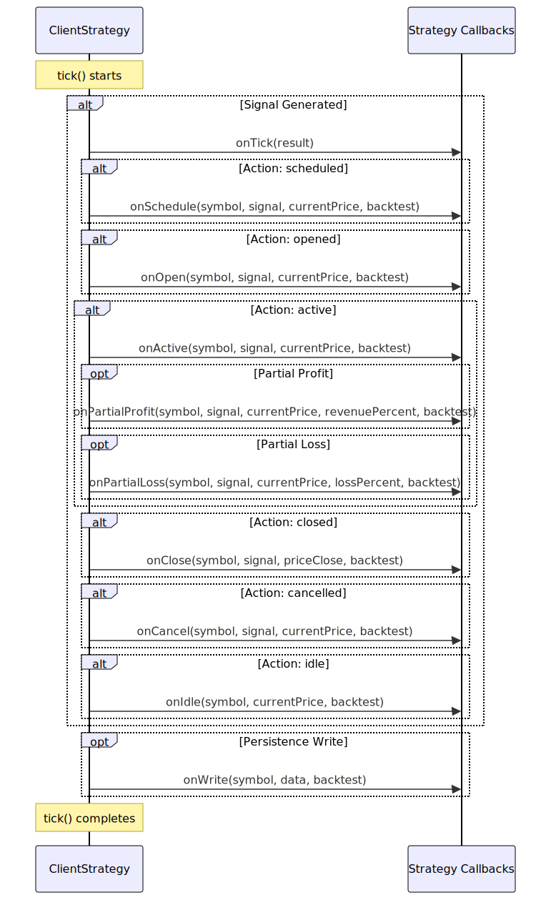

# Signal Lifecycle Overview

This page describes the complete lifecycle of trading signals within the backtest-kit framework, from generation through validation, execution, and termination. A signal represents a trading position with entry price, take-profit, stop-loss, and time expiration parameters. Understanding the signal lifecycle is essential for implementing strategies and debugging execution behavior.

For details on strategy registration and configuration, see [Component Registration](./08_Component_Registration.md). For implementation details of the `ClientStrategy` class that manages this lifecycle, see [ClientStrategy](./47_Signal_States.md). For validation rules and error handling, see [Signal Generation and Validation](./48_Signal_Generation_and_Validation.md).

---

## Signal State Machine

The signal lifecycle follows a deterministic state machine with distinct states and transition conditions. All states are represented by discriminated union types in `IStrategyTickResult`, enabling type-safe state handling in callbacks and event listeners.




---

## Signal Type Hierarchy

Signals progress through three type representations during their lifecycle, each with increasing specificity:



| Type | Purpose | When Created | Key Characteristics |
|------|---------|--------------|---------------------|
| `ISignalDto` | User-defined signal from `getSignal()` | Strategy logic returns this | Optional `priceOpen`, optional `id`, minimal fields |
| `ISignalRow` | Validated signal with auto-generated ID | After validation passes | Required `priceOpen`, UUID `id`, complete metadata |
| `IScheduledSignalRow` | Scheduled signal awaiting activation | When `priceOpen != currentPrice` | `_isScheduled: true`, waits for price to reach `priceOpen` |


---

## State Transition Details

### Idle → Scheduled/Opened

The transition from `Idle` state occurs when `getSignal()` returns a non-null signal that passes validation and risk checks:



**Key Logic:**
- **Throttling**: Enforced by `INTERVAL_MINUTES` mapping [src/client/ClientStrategy.ts:32-39]()
- **Risk Check**: Pre-validation gate via `risk.checkSignal()` [src/client/ClientStrategy.ts:289-299]()
- **Immediate Activation**: LONG activates if `currentPrice <= priceOpen`, SHORT activates if `currentPrice >= priceOpen` [src/client/ClientStrategy.ts:314-344]()
- **Validation**: 30+ rules in `VALIDATE_SIGNAL_FN` [src/client/ClientStrategy.ts:41-261]()


---

### Scheduled → Opened/Cancelled/Idle

Scheduled signals require continuous monitoring for three conditions: activation, cancellation, or timeout.



**Critical Conditions:**

| Position | Activation Condition | Cancellation Condition |
|----------|---------------------|------------------------|
| LONG | `currentPrice <= priceOpen` | `currentPrice <= priceStopLoss` |
| SHORT | `currentPrice >= priceOpen` | `currentPrice >= priceStopLoss` |

**Pre-Activation Cancellation**: Scheduled signals can be cancelled by StopLoss **before** activation when price moves against the position too far without reaching `priceOpen`. This prevents entering positions that have already deteriorated. See test cases [test/e2e/defend.test.mjs:1393-1507]() for validation.


---

### Active → Closed

Active signals are monitored on every tick for three terminal conditions:



**Terminal Conditions:**

| Condition | LONG Check | SHORT Check | CloseReason Value |
|-----------|-----------|-------------|-------------------|
| Time Expired | `elapsedTime >= maxTimeToWait` | `elapsedTime >= maxTimeToWait` | `"time_expired"` |
| Take Profit | `currentPrice >= priceTakeProfit` | `currentPrice <= priceTakeProfit` | `"take_profit"` |
| Stop Loss | `currentPrice <= priceStopLoss` | `currentPrice >= priceStopLoss` | `"stop_loss"` |


---

## Validation Pipeline

All signals pass through a comprehensive validation pipeline with 30+ rules before activation. Validation occurs twice for scheduled signals: once at creation, and again at activation.



**Key Validation Rules:**

| Category | Rule | Configuration Parameter | Purpose |
|----------|------|-------------------------|---------|
| Minimum Profit | TP distance from priceOpen | `CC_MIN_TAKEPROFIT_DISTANCE_PERCENT` (0.3%) | Ensure profit covers trading fees (2×0.1%) |
| Maximum Loss | SL distance from priceOpen | `CC_MAX_STOPLOSS_DISTANCE_PERCENT` (20%) | Prevent catastrophic single-position losses |
| Signal Lifetime | Maximum duration | `CC_MAX_SIGNAL_LIFETIME_MINUTES` (1440 min) | Prevent eternal signals blocking risk limits |
| Immediate Activation | currentPrice not past TP/SL | N/A | Prevent invalid immediate signals |


---

## Timestamp Semantics

Signals track two distinct timestamps that serve different purposes:



| Timestamp | Purpose | When Set | Used For |
|-----------|---------|----------|----------|
| `scheduledAt` | Signal creation time | When `getSignal()` returns signal | Timeout calculation for scheduled signals (120 min) |
| `pendingAt` | Position activation time | When signal becomes active (priceOpen reached or immediate) | Time expiration calculation (`minuteEstimatedTime`) |

**Critical Distinction**: For scheduled signals, `scheduledAt` tracks when the signal was created, while `pendingAt` tracks when the position actually opened. The timeout for scheduled signal activation is calculated from `scheduledAt`, but the timeout for position closure is calculated from `pendingAt`.

```typescript
// Scheduled signal timeout (activation wait)
const maxActivationWait = CC_SCHEDULE_AWAIT_MINUTES * 60 * 1000; // 120 min
const elapsedSinceSchedule = currentTime - signal.scheduledAt;
if (elapsedSinceSchedule >= maxActivationWait) {
  // Cancel scheduled signal
}

// Active signal timeout (position lifetime)
const maxPositionTime = signal.minuteEstimatedTime * 60 * 1000;
const elapsedSincePending = currentTime - signal.pendingAt;
if (elapsedSincePending >= maxPositionTime) {
  // Close position by timeout
}
```


---

## Tick Result Contract

All state transitions return a discriminated union type `IStrategyTickResult` with an `action` discriminator field:



**Type-Safe Pattern Matching:**

```typescript
const result = await strategy.tick(symbol, strategyName);

if (result.action === "closed") {
  // TypeScript knows result.pnl exists
  console.log(`PNL: ${result.pnl.pnlPercentage}%`);
  console.log(`Reason: ${result.closeReason}`);
} else if (result.action === "scheduled") {
  // TypeScript knows result.signal._isScheduled is true
  console.log(`Waiting for price: ${result.signal.priceOpen}`);
} else if (result.action === "idle") {
  // TypeScript knows result.signal is null
  console.log("No active position");
}
```


---

## Persistence and Crash Recovery

Signals are persisted to disk in live mode only, enabling crash recovery without data loss. Three adapters handle different persistence concerns:



**Persistence Adapters:**

| Adapter | File Location | Contents | Purpose |
|---------|---------------|----------|---------|
| `PersistSignalAdapter` | `.backtest/{symbol}/{strategyName}.signal.json` | Active `ISignalRow` | Restore active positions after crash |
| `PersistScheduleAdapter` | `.backtest/{symbol}/{strategyName}.schedule.json` | Scheduled `IScheduledSignalRow` | Restore scheduled signals after crash |
| `PersistRiskAdapter` | `.backtest/{symbol}/risk.{riskName}.json` | Active position count and list | Restore risk limits after crash |

**Atomic Write Pattern:**

All persistence operations are atomic to prevent corruption:

1. Write to temporary file: `{path}.tmp`
2. Call `fsSync()` to flush to disk
3. Rename to final path (atomic operation)


---

## Lifecycle Callbacks

Strategies can register callbacks for every lifecycle event, enabling custom logging, metrics collection, and state tracking:



**Callback Invocation Order:**

1. **Specialized callback** (`onSchedule`, `onOpen`, `onActive`, `onClose`, `onCancel`, `onIdle`)
2. **Generic callback** (`onTick` with `IStrategyTickResult`)
3. **Persistence callback** (`onWrite` if state changed)


---

## Integration with Execution Modes

The signal lifecycle behaves identically across all three execution modes (Backtest, Live, Walker), with minor differences in timing and persistence:

| Aspect | Backtest Mode | Live Mode | Walker Mode |
|--------|---------------|-----------|-------------|
| Time Source | Candle timestamps from frames | `new Date()` real-time | Candle timestamps (delegates to Backtest) |
| Persistence | Disabled (`backtest: true`) | Enabled via `PersistSignalAdapter` | Disabled (`backtest: true`) |
| `tick()` Frequency | Every frame timestamp | Every 61 seconds (`TICK_TTL`) | Every frame timestamp per strategy |
| Signal Activation | Immediate via `backtest()` fast-forward | Real-time monitoring via `tick()` | Immediate via `backtest()` fast-forward |
| Crash Recovery | Not needed (deterministic replay) | Full recovery via `waitForInit()` | Not needed (deterministic replay) |

