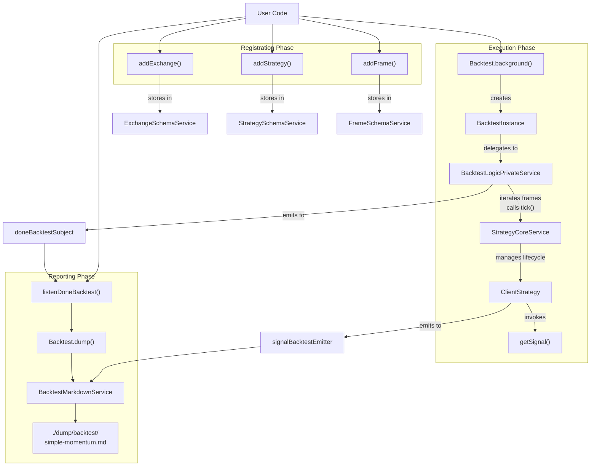
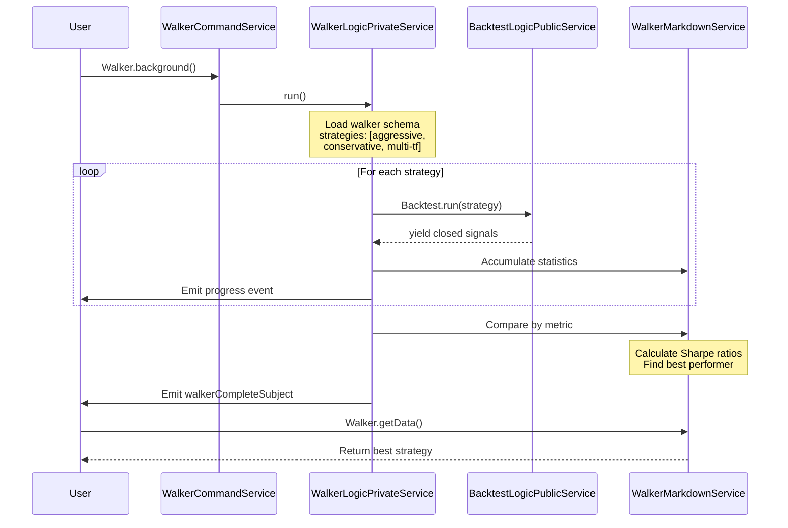
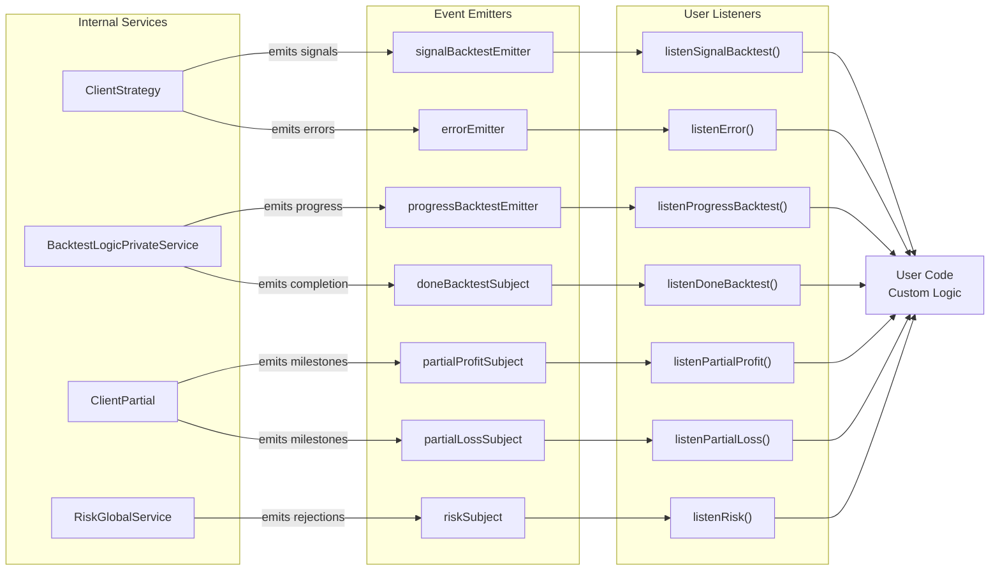
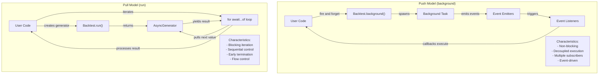
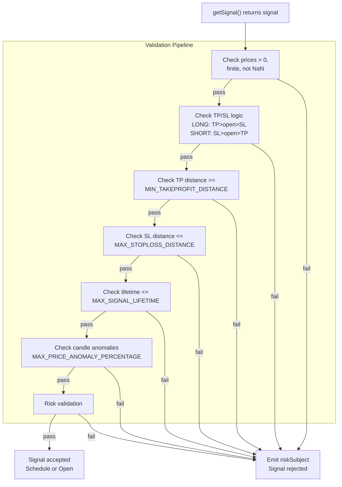

# Quick Start Examples

This page provides minimal working code examples demonstrating the three primary execution modes in Backtest Kit. Each example is self-contained and can be run immediately after installation.

For detailed explanations of the framework's core concepts, see [Core Concepts](./08_core-concepts.md). For installation instructions, see [Installation & Setup](./04_getting-started.md). For a step-by-step tutorial building your first strategy, see [Your First Backtest](./04_getting-started.md).

---

## Example 1: Basic Backtest

This example demonstrates the minimum code required to run a historical backtest with a simple strategy.

```typescript
import { 
  setLogger,
  addExchange, 
  addStrategy, 
  addFrame,
  Backtest,
  listenDoneBacktest,
  getAveragePrice 
} from 'backtest-kit';
import ccxt from 'ccxt';

// Configure logging
setLogger({
  log: console.log,
  debug: console.debug,
  info: console.info,
  warn: console.warn,
});

// Register exchange data source
addExchange({
  exchangeName: 'binance',
  getCandles: async (symbol, interval, since, limit) => {
    const exchange = new ccxt.binance();
    const ohlcv = await exchange.fetchOHLCV(symbol, interval, since.getTime(), limit);
    return ohlcv.map(([timestamp, open, high, low, close, volume]) => 
      ({ timestamp, open, high, low, close, volume })
    );
  },
  formatPrice: (symbol, price) => price.toFixed(2),
  formatQuantity: (symbol, quantity) => quantity.toFixed(8),
});

// Define trading strategy
addStrategy({
  strategyName: 'simple-momentum',
  interval: '5m',  // Check every 5 minutes
  getSignal: async (symbol) => {
    const price = await getAveragePrice(symbol);
    
    // Simple momentum: buy if price > moving average
    return {
      position: 'long',
      priceOpen: price,
      priceTakeProfit: price * 1.02,  // 2% profit target
      priceStopLoss: price * 0.99,    // 1% stop loss
      minuteEstimatedTime: 60,        // 1 hour max hold
    };
  },
});

// Define backtest timeframe
addFrame({
  frameName: '1week-test',
  interval: '1m',  // Minute-by-minute simulation
  startDate: new Date('2024-01-01'),
  endDate: new Date('2024-01-08'),
});

// Listen for completion
listenDoneBacktest(async (event) => {
  if (event.strategyName === 'simple-momentum') {
    await Backtest.dump(event.symbol, event.strategyName);
    console.log('Backtest complete. Report saved to ./dump/backtest/');
  }
});

// Run backtest
Backtest.background('BTCUSDT', {
  strategyName: 'simple-momentum',
  exchangeName: 'binance',
  frameName: '1week-test',
});
```

### Execution Flow Diagram



- `README.md:40-159`
- `src/classes/Backtest.ts:200-235`
- `src/classes/Backtest.ts:423-443`

---

## Example 2: Live Trading Mode

This example demonstrates real-time trading with crash-safe persistence.

```typescript
import { 
  addExchange,
  addStrategy,
  Live,
  listenSignalLive,
  getAveragePrice 
} from 'backtest-kit';
import ccxt from 'ccxt';

// Register exchange with API credentials
addExchange({
  exchangeName: 'binance-live',
  getCandles: async (symbol, interval, since, limit) => {
    const exchange = new ccxt.binance({
      apiKey: process.env.BINANCE_API_KEY,
      secret: process.env.BINANCE_SECRET,
    });
    const ohlcv = await exchange.fetchOHLCV(symbol, interval, since.getTime(), limit);
    return ohlcv.map(([timestamp, open, high, low, close, volume]) => 
      ({ timestamp, open, high, low, close, volume })
    );
  },
  formatPrice: (symbol, price) => price.toFixed(2),
  formatQuantity: (symbol, quantity) => quantity.toFixed(8),
});

// Define strategy (same as backtest)
addStrategy({
  strategyName: 'live-momentum',
  interval: '5m',
  getSignal: async (symbol) => {
    const price = await getAveragePrice(symbol);
    return {
      position: 'long',
      priceOpen: price,
      priceTakeProfit: price * 1.02,
      priceStopLoss: price * 0.99,
      minuteEstimatedTime: 60,
    };
  },
});

// Listen for all signal events
listenSignalLive((result) => {
  if (result.action === 'opened') {
    console.log('Signal opened:', result.signal.id);
  } else if (result.action === 'closed') {
    console.log('Signal closed:', result.signal.id);
    console.log('PNL:', result.pnl.pnlPercentage.toFixed(2) + '%');
  }
});

// Run live trading (infinite loop)
Live.background('BTCUSDT', {
  strategyName: 'live-momentum',
  exchangeName: 'binance-live',
});

console.log('Live trading started. Press Ctrl+C to stop gracefully.');
```

### Live Trading vs Backtest Comparison

| Aspect | Backtest Mode | Live Mode |
|--------|--------------|-----------|
| **Execution** | Finite generator (startDate to endDate) | Infinite generator (until stopped) |
| **Time source** | Frame timestamps (`src/lib/services/frame/FrameCoreService.ts:37-58`) | `new Date()` (`src/lib/services/live/LiveLogicPrivateService.ts:61`) |
| **Signal persistence** | In-memory only | Written to disk (`src/lib/adapters/PersistSignalAdapter.ts`) |
| **Crash recovery** | Not needed (deterministic) | Automatic state restoration on restart |
| **Completion event** | `doneBacktestSubject` | `doneLiveSubject` (only when stopped + no active signal) |
| **Use case** | Historical testing, strategy validation | Production trading, real money |

- `README.md:161-171`
- `src/classes/Live.ts:208-242`
- `src/classes/Live.ts:441-459`

---

## Example 3: Walker (Strategy Comparison)

This example demonstrates comparing multiple strategies to find the best performer.

```typescript
import { 
  addExchange,
  addStrategy,
  addFrame,
  addWalker,
  Walker,
  listenDoneWalker,
  getAveragePrice,
  getCandles
} from 'backtest-kit';
import ccxt from 'ccxt';

// Register exchange (same as previous examples)
addExchange({
  exchangeName: 'binance',
  getCandles: async (symbol, interval, since, limit) => {
    const exchange = new ccxt.binance();
    const ohlcv = await exchange.fetchOHLCV(symbol, interval, since.getTime(), limit);
    return ohlcv.map(([timestamp, open, high, low, close, volume]) => 
      ({ timestamp, open, high, low, close, volume })
    );
  },
  formatPrice: (symbol, price) => price.toFixed(2),
  formatQuantity: (symbol, quantity) => quantity.toFixed(8),
});

// Strategy 1: Aggressive (high risk/reward)
addStrategy({
  strategyName: 'aggressive',
  interval: '5m',
  getSignal: async (symbol) => {
    const price = await getAveragePrice(symbol);
    return {
      position: 'long',
      priceOpen: price,
      priceTakeProfit: price * 1.05,  // 5% profit
      priceStopLoss: price * 0.98,    // 2% loss
      minuteEstimatedTime: 30,
    };
  },
});

// Strategy 2: Conservative (low risk/reward)
addStrategy({
  strategyName: 'conservative',
  interval: '5m',
  getSignal: async (symbol) => {
    const price = await getAveragePrice(symbol);
    return {
      position: 'long',
      priceOpen: price,
      priceTakeProfit: price * 1.01,  // 1% profit
      priceStopLoss: price * 0.995,   // 0.5% loss
      minuteEstimatedTime: 120,
    };
  },
});

// Strategy 3: Multi-timeframe
addStrategy({
  strategyName: 'multi-tf',
  interval: '15m',
  getSignal: async (symbol) => {
    const candles1h = await getCandles(symbol, '1h', 24);
    const candles5m = await getCandles(symbol, '5m', 60);
    
    // Use multiple timeframes for analysis
    const price = await getAveragePrice(symbol);
    return {
      position: 'long',
      priceOpen: price,
      priceTakeProfit: price * 1.03,
      priceStopLoss: price * 0.985,
      minuteEstimatedTime: 90,
    };
  },
});

// Define backtest timeframe
addFrame({
  frameName: '1month-test',
  interval: '1m',
  startDate: new Date('2024-01-01'),
  endDate: new Date('2024-02-01'),
});

// Define walker to compare strategies
addWalker({
  walkerName: 'strategy-comparison',
  strategies: ['aggressive', 'conservative', 'multi-tf'],
  exchangeName: 'binance',
  frameName: '1month-test',
  metric: 'sharpeRatio',  // Comparison metric
});

// Listen for completion
listenDoneWalker(async (event) => {
  if (event.strategyName === 'strategy-comparison') {
    const results = await Walker.getData(event.symbol, 'strategy-comparison');
    console.log('Best strategy:', results.bestStrategy);
    console.log('Best Sharpe ratio:', results.bestMetric);
    
    await Walker.dump(event.symbol, 'strategy-comparison');
    console.log('Comparison report saved to ./dump/walker/');
  }
});

// Run comparison
Walker.background('BTCUSDT', {
  walkerName: 'strategy-comparison',
});
```

### Walker Execution Flow



### Available Comparison Metrics

| Metric | Description | Use Case |
|--------|-------------|----------|
| `sharpeRatio` | Risk-adjusted returns | Balancing profit and volatility |
| `totalPnl` | Total profit/loss percentage | Maximum absolute returns |
| `winRate` | Percentage of winning trades | Consistency of strategy |
| `maxDrawdown` | Largest peak-to-trough decline | Risk tolerance assessment |
| `avgPnlPerTrade` | Average profit per trade | Efficiency per signal |

- `src/classes/Walker.ts:145-194`
- `src/classes/Walker.ts:214-246`
- `src/lib/services/walker/WalkerLogicPrivateService.ts`

---

## Example 4: Event-Driven Architecture

This example demonstrates using event listeners for real-time monitoring and custom logic.

```typescript
import {
  addExchange,
  addStrategy,
  addFrame,
  Backtest,
  listenSignalBacktest,
  listenProgressBacktest,
  listenDoneBacktest,
  listenPartialProfit,
  listenPartialLoss,
  listenRisk,
  listenError,
  getAveragePrice
} from 'backtest-kit';
import ccxt from 'ccxt';

// Setup exchange and strategy (omitted for brevity)
// ... see Example 1 ...

// Track all signal state changes
listenSignalBacktest((result) => {
  console.log(`[${new Date().toISOString()}] Signal event:`, {
    action: result.action,
    signalId: result.signal?.id,
    position: result.signal?.position,
  });
  
  if (result.action === 'closed') {
    const pnl = result.pnl.pnlPercentage;
    const emoji = pnl > 0 ? '✅' : '❌';
    console.log(`${emoji} PNL: ${pnl.toFixed(2)}%`);
  }
});

// Monitor backtest progress
listenProgressBacktest((event) => {
  console.log(`Progress: ${event.progress}% complete`);
});

// Track unrealized profit milestones
listenPartialProfit((event) => {
  console.log(`🎯 Partial profit: ${event.level}% on signal ${event.signalId}`);
});

// Track unrealized loss milestones
listenPartialLoss((event) => {
  console.warn(`⚠️ Partial loss: ${event.level}% on signal ${event.signalId}`);
});

// Monitor risk rejections
listenRisk((event) => {
  console.error(`🚫 Risk rejection: ${event.comment}`);
  console.error(`   Active positions: ${event.activePositionCount}`);
});

// Handle errors
listenError((error) => {
  console.error('Error during execution:', error);
});

// Generate final report
listenDoneBacktest(async (event) => {
  const stats = await Backtest.getData(event.symbol, event.strategyName);
  
  console.log('\n=== Backtest Results ===');
  console.log('Total trades:', stats.totalTrades);
  console.log('Win rate:', (stats.winRate * 100).toFixed(2) + '%');
  console.log('Sharpe ratio:', stats.sharpeRatio?.toFixed(2) || 'N/A');
  console.log('Max drawdown:', stats.maxDrawdown?.toFixed(2) + '%');
  
  await Backtest.dump(event.symbol, event.strategyName);
});

// Run backtest
Backtest.background('BTCUSDT', {
  strategyName: 'simple-momentum',
  exchangeName: 'binance',
  frameName: '1week-test',
});
```

### Event System Architecture



**Event Listener Characteristics:**
- All listeners use `functools-kit` `queued` wrapper (`src/index.ts:204-210`) for sequential async execution
- Events are emitted in order but processed asynchronously
- Callbacks cannot block strategy execution
- Unsubscribe by calling returned function: `const unsub = listenSignal(...); unsub();`

- `README.md:174-176`
- `src/index.ts:200-249`
- `src/config/emitters.ts`

---

## Example 5: Pull-Based Async Iterator Pattern

This example demonstrates using async iterators instead of event listeners for more control over execution flow.

```typescript
import {
  addExchange,
  addStrategy,
  addFrame,
  Backtest,
  getAveragePrice
} from 'backtest-kit';
import ccxt from 'ccxt';

// Setup exchange, strategy, frame (omitted for brevity)
// ... see Example 1 ...

// Pull-based execution with async iterator
async function runBacktestWithControl() {
  const generator = Backtest.run('BTCUSDT', {
    strategyName: 'simple-momentum',
    exchangeName: 'binance',
    frameName: '1week-test',
  });
  
  let tradeCount = 0;
  let totalPnl = 0;
  
  for await (const result of generator) {
    if (result.action === 'closed') {
      tradeCount++;
      totalPnl += result.pnl.pnlPercentage;
      
      console.log(`Trade ${tradeCount}: ${result.pnl.pnlPercentage.toFixed(2)}%`);
      
      // Conditional early termination
      if (totalPnl < -10) {
        console.warn('Total loss exceeded -10%, stopping backtest');
        break;
      }
      
      // Conditional logic based on results
      if (tradeCount === 10) {
        console.log('First 10 trades complete, analyzing...');
        const winRate = result.pnl.pnlPercentage > 0 ? 1 : 0;
        if (winRate < 0.5) {
          console.warn('Win rate below 50%, consider strategy adjustment');
        }
      }
    }
  }
  
  console.log(`\nBacktest complete: ${tradeCount} trades, ${totalPnl.toFixed(2)}% total PNL`);
}

runBacktestWithControl();
```

### Push vs Pull Execution Models



**Use Cases:**

| Pattern | Best For |
|---------|----------|
| **Push (background)** | Production bots, monitoring dashboards, multi-strategy portfolios, fire-and-forget execution |
| **Pull (run)** | Research, testing, LLM agents, conditional logic, early termination, sequential workflows |

- `README.md:201-224`
- `src/classes/Backtest.ts:378-400`
- `src/classes/Backtest.ts:423-443`

---

## Example 6: Global Configuration

This example demonstrates configuring global parameters that affect all strategies.

```typescript
import { setConfig, setLogger } from 'backtest-kit';

// Configure global parameters
setConfig({
  // Trading costs
  CC_PERCENT_FEE: 0.1,              // 0.1% per trade
  CC_PERCENT_SLIPPAGE: 0.1,         // 0.1% slippage
  
  // Signal validation
  CC_MIN_TAKEPROFIT_DISTANCE_PERCENT: 0.3,  // TP must be >= 0.3% away (covers fees+slippage)
  CC_MAX_STOPLOSS_DISTANCE_PERCENT: 10.0,   // SL must be <= 10% away
  CC_MAX_SIGNAL_LIFETIME_MINUTES: 1440,     // Max 24 hours
  
  // VWAP pricing
  CC_AVG_PRICE_CANDLES_COUNT: 5,    // Use 5 candles for VWAP calculation
  
  // Scheduled signals
  CC_SCHEDULE_AWAIT_MINUTES: 120,   // Pending order timeout (2 hours)
  
  // Data validation
  CC_MAX_PRICE_ANOMALY_PERCENTAGE: 20.0,  // Reject candles with >20% deviation
  CC_RETRY_COUNT: 3,                      // Retry failed API calls 3 times
  CC_RETRY_DELAY_MS: 1000,               // Wait 1 second between retries
});

// Configure logging
setLogger({
  log: console.log,
  debug: (...args) => {
    if (process.env.DEBUG === 'true') {
      console.debug(...args);
    }
  },
  info: console.info,
  warn: console.warn,
});
```

### Configuration Impact on Signal Validation



**Critical Configuration Notes:**
- `CC_MIN_TAKEPROFIT_DISTANCE_PERCENT` **must** be set high enough to cover `CC_PERCENT_FEE + CC_PERCENT_SLIPPAGE`, otherwise all trades will lose money even when hitting TP
- Default value is 0.3% which covers 0.1% fee + 0.1% slippage + 0.1% buffer
- `CC_MAX_PRICE_ANOMALY_PERCENTAGE` protects against bad data causing unrealistic backtest results

- `README.md:45-63`
- `README.md:178-184`
- `src/config/params.ts:17-95`
- `src/lib/services/strategy/ClientStrategy.ts:400-511`

---

## Running the Examples

All examples require TypeScript 5.0+ and peer dependencies installed:

```bash
npm install backtest-kit ccxt ollama uuid
npm install -D typescript @types/node
```

For live trading examples, create a `.env` file:

```env
BINANCE_API_KEY=your_api_key_here
BINANCE_SECRET=your_secret_here
```

Run with:

```bash
npx tsx example.ts
# or
node --loader tsx example.ts
```

- `README.md:40-43`
- `package.json:71-79`
- `demo/backtest/package.json`
- `demo/live/package.json`