# Dependency Injection System

# Dependency Injection System

<details>
<summary>Relevant source files</summary>

The following files were used as context for generating this wiki page:

- [src/config/emitters.ts](src/config/emitters.ts)
- [src/function/add.ts](src/function/add.ts)
- [src/function/event.ts](src/function/event.ts)
- [src/function/list.ts](src/function/list.ts)
- [src/index.ts](src/index.ts)
- [src/lib/core/provide.ts](src/lib/core/provide.ts)
- [src/lib/core/types.ts](src/lib/core/types.ts)
- [src/lib/index.ts](src/lib/index.ts)
- [types.d.ts](types.d.ts)

</details>


## Purpose and Scope

The Dependency Injection (DI) system provides centralized service management for the backtest-kit framework. It uses Symbol-based keys for type-safe service registration and retrieval, aggregating all services into a single `backtest` object that serves as the framework's service locator. This page documents the DI container implementation, service registration patterns, the aggregation object structure, and the 11 service categories.

For information about how services use scoped context propagation, see [Layered Architecture](./07-layered-architecture.md). For details on individual service implementations, see [Service Categories](./09-service-categories.md).

**Sources:** [src/lib/core/types.ts](), [src/lib/core/provide.ts](), [src/lib/index.ts]()

---

## Architecture Overview

The DI system consists of three core components:

1. **Symbol Registry** - Unique Symbol keys for each service type
2. **Service Provider** - Registration mechanism using factory functions
3. **Service Aggregation** - The `backtest` singleton object exposing all services


**Sources:** [src/lib/core/types.ts:1-104](), [src/lib/core/provide.ts:1-141](), [src/lib/index.ts:1-242]()

---

## Symbol-Based Service Keys

The `TYPES` object in [src/lib/core/types.ts]() defines Symbol-based keys for type-safe service registration. Each service category is grouped into a sub-object, then merged into the exported `TYPES` constant.

### Symbol Registry Structure

| Category | Symbol Count | Examples |
|----------|--------------|----------|
| **baseServices** | 1 | `loggerService` |
| **contextServices** | 2 | `executionContextService`, `methodContextService` |
| **connectionServices** | 7 | `exchangeConnectionService`, `strategyConnectionService`, `frameConnectionService`, `sizingConnectionService`, `riskConnectionService`, `optimizerConnectionService`, `partialConnectionService` |
| **schemaServices** | 7 | `exchangeSchemaService`, `strategySchemaService`, `frameSchemaService`, `walkerSchemaService`, `sizingSchemaService`, `riskSchemaService`, `optimizerSchemaService` |
| **coreServices** | 3 | `exchangeCoreService`, `strategyCoreService`, `frameCoreService` |
| **globalServices** | 4 | `sizingGlobalService`, `riskGlobalService`, `optimizerGlobalService`, `partialGlobalService` |
| **commandServices** | 3 | `liveCommandService`, `backtestCommandService`, `walkerCommandService` |
| **logicPrivateServices** | 3 | `backtestLogicPrivateService`, `liveLogicPrivateService`, `walkerLogicPrivateService` |
| **logicPublicServices** | 3 | `backtestLogicPublicService`, `liveLogicPublicService`, `walkerLogicPublicService` |
| **markdownServices** | 9 | `backtestMarkdownService`, `liveMarkdownService`, `scheduleMarkdownService`, `performanceMarkdownService`, `walkerMarkdownService`, `heatMarkdownService`, `partialMarkdownService`, `outlineMarkdownService`, `riskMarkdownService` |
| **validationServices** | 8 | `exchangeValidationService`, `strategyValidationService`, `frameValidationService`, `walkerValidationService`, `sizingValidationService`, `riskValidationService`, `optimizerValidationService`, `configValidationService` |
| **templateServices** | 1 | `optimizerTemplateService` |

### Symbol Definition Pattern

```typescript
// src/lib/core/types.ts
const baseServices = {
    loggerService: Symbol('loggerService'),
};

const contextServices = {
    executionContextService: Symbol('executionContextService'),
    methodContextService: Symbol('methodContextService'),
};

const connectionServices = {
    exchangeConnectionService: Symbol('exchangeConnectionService'),
    strategyConnectionService: Symbol('strategyConnectionService'),
    frameConnectionService: Symbol('frameConnectionService'),
    // ... 4 more
};

// Merge all service categories
export const TYPES = {
    ...baseServices,
    ...contextServices,
    ...connectionServices,
    ...schemaServices,
    ...coreServices,
    ...globalServices,
    ...commandServices,
    ...logicPrivateServices,
    ...logicPublicServices,
    ...markdownServices,
    ...validationServices,
    ...templateServices,
}
```

Symbols guarantee uniqueness at runtime, preventing key collisions even if string names clash. Each Symbol is created with a descriptive string for debugging purposes.

**Sources:** [src/lib/core/types.ts:1-104]()

---

## Service Registration Pattern

The [src/lib/core/provide.ts]() file registers all services using the `provide()` function from the DI container. Each registration pairs a Symbol key with a factory function that instantiates the service.

### Registration Flow

```mermaid
graph LR
    IMPORT["Import service classes<br/>LoggerService, ExchangeConnectionService,<br/>StrategySchemaService, etc."]
    PROVIDE["provide(symbol, factory)<br/>Factory function returns<br/>new service instance"]
    CONTAINER["DI Container<br/>Stores symbol → factory mapping"]
    INIT["init()<br/>Called after all registrations<br/>Resolves dependencies"]
    
    IMPORT --> PROVIDE
    PROVIDE --> CONTAINER
    CONTAINER --> INIT
```



### Registration Examples by Category

**Base Services:**
```typescript
// src/lib/core/provide.ts:55-57
{
    provide(TYPES.loggerService, () => new LoggerService());
}
```

**Context Services:**
```typescript
// src/lib/core/provide.ts:59-62
{
    provide(TYPES.executionContextService, () => new ExecutionContextService());
    provide(TYPES.methodContextService, () => new MethodContextService());
}
```

**Connection Services:**
```typescript
// src/lib/core/provide.ts:64-72
{
    provide(TYPES.exchangeConnectionService, () => new ExchangeConnectionService());
    provide(TYPES.strategyConnectionService, () => new StrategyConnectionService());
    provide(TYPES.frameConnectionService, () => new FrameConnectionService());
    provide(TYPES.sizingConnectionService, () => new SizingConnectionService());
    provide(TYPES.riskConnectionService, () => new RiskConnectionService());
    provide(TYPES.optimizerConnectionService, () => new OptimizerConnectionService());
    provide(TYPES.partialConnectionService, () => new PartialConnectionService());
}
```

**Schema Services:**
```typescript
// src/lib/core/provide.ts:74-82
{
    provide(TYPES.exchangeSchemaService, () => new ExchangeSchemaService());
    provide(TYPES.strategySchemaService, () => new StrategySchemaService());
    provide(TYPES.frameSchemaService, () => new FrameSchemaService());
    provide(TYPES.walkerSchemaService, () => new WalkerSchemaService());
    provide(TYPES.sizingSchemaService, () => new SizingSchemaService());
    provide(TYPES.riskSchemaService, () => new RiskSchemaService());
    provide(TYPES.optimizerSchemaService, () => new OptimizerSchemaService());
}
```

All other service categories follow the same pattern. The factory functions are invoked lazily by the DI container when services are first injected.

**Sources:** [src/lib/core/provide.ts:55-141]()

---

## Service Aggregation Object

The [src/lib/index.ts]() file creates the `backtest` aggregation object by injecting all registered services and merging them into a single export. This serves as the framework's primary service locator.

### Aggregation Structure


### Initialization and Export

```typescript
// src/lib/index.ts:221-236
export const backtest = {
  ...baseServices,
  ...contextServices,
  ...connectionServices,
  ...schemaServices,
  ...coreServices,
  ...globalServices,
  ...commandServices,
  ...logicPrivateServices,
  ...logicPublicServices,
  ...markdownServices,
  ...validationServices,
  ...templateServices,
};

init(); // Resolves all lazy dependencies

export { ExecutionContextService };
export { MethodContextService };

export default backtest;
```

The `init()` call triggers dependency resolution for all registered services. The `backtest` object is then exported as both a named export and default export.

**Sources:** [src/lib/index.ts:60-242]()

---

## Service Categories

The DI system organizes services into 11 categories based on their architectural role. Each category has a specific responsibility in the overall system.

### Base Services

Provides foundational logging infrastructure.

| Service | Symbol Key | Class | Responsibility |
|---------|-----------|-------|----------------|
| `loggerService` | `TYPES.loggerService` | `LoggerService` | Structured logging with context injection |

**Sources:** [src/lib/core/types.ts:1-3](), [src/lib/core/provide.ts:55-57](), [src/lib/index.ts:60-62]()

---

### Context Services

Provides scoped context propagation using the `di-scoped` library pattern. See [types.d.ts:246-285]() and [types.d.ts:505-544]() for interface definitions.

| Service | Symbol Key | Class | Responsibility |
|---------|-----------|-------|----------------|
| `executionContextService` | `TYPES.executionContextService` | `ExecutionContextService` | Propagates `symbol`, `when`, and `backtest` flag through execution chain |
| `methodContextService` | `TYPES.methodContextService` | `MethodContextService` | Propagates `strategyName`, `exchangeName`, `frameName` for schema routing |

Both services extend the `di-scoped` library's scoped class pattern, enabling implicit context passing without explicit parameters.

```typescript
// Example from types.d.ts:274-280
ExecutionContextService.runInContext(
  async () => {
    // Inside this callback, context is automatically available
    return await someOperation();
  },
  { symbol: "BTCUSDT", when: new Date(), backtest: true }
);
```

**Sources:** [src/lib/core/types.ts:5-8](), [src/lib/core/provide.ts:59-62](), [src/lib/index.ts:64-71](), [types.d.ts:246-285](), [types.d.ts:505-544]()

---

### Schema Services

Store registered user configurations using the Tool Registry pattern (immutable Map-based storage).

| Service | Symbol Key | Class | Stored Schema Type |
|---------|-----------|-------|-------------------|
| `exchangeSchemaService` | `TYPES.exchangeSchemaService` | `ExchangeSchemaService` | `IExchangeSchema` |
| `strategySchemaService` | `TYPES.strategySchemaService` | `StrategySchemaService` | `IStrategySchema` |
| `frameSchemaService` | `TYPES.frameSchemaService` | `FrameSchemaService` | `IFrameSchema` |
| `walkerSchemaService` | `TYPES.walkerSchemaService` | `WalkerSchemaService` | `IWalkerSchema` |
| `sizingSchemaService` | `TYPES.sizingSchemaService` | `SizingSchemaService` | `ISizingSchema` |
| `riskSchemaService` | `TYPES.riskSchemaService` | `RiskSchemaService` | `IRiskSchema` |
| `optimizerSchemaService` | `TYPES.optimizerSchemaService` | `OptimizerSchemaService` | `IOptimizerSchema` |

Each Schema Service provides:
- `register(name: string, schema: TSchema): void` - Store schema
- `get(name: string): TSchema | null` - Retrieve schema
- `has(name: string): boolean` - Check existence

**Sources:** [src/lib/core/types.ts:20-28](), [src/lib/core/provide.ts:74-82](), [src/lib/index.ts:97-111]()

---

### Validation Services

Enforce schema structure and business rules before registration.

| Service | Symbol Key | Class | Validates |
|---------|-----------|-------|-----------|
| `exchangeValidationService` | `TYPES.exchangeValidationService` | `ExchangeValidationService` | `IExchangeSchema` structure, required fields |
| `strategyValidationService` | `TYPES.strategyValidationService` | `StrategyValidationService` | `IStrategySchema` structure, interval validity, memoization |
| `frameValidationService` | `TYPES.frameValidationService` | `FrameValidationService` | `IFrameSchema` structure, date range logic |
| `walkerValidationService` | `TYPES.walkerValidationService` | `WalkerValidationService` | `IWalkerSchema` structure, strategy list, metric |
| `sizingValidationService` | `TYPES.sizingValidationService` | `SizingValidationService` | `ISizingSchema` structure, method-specific params |
| `riskValidationService` | `TYPES.riskValidationService` | `RiskValidationService` | `IRiskSchema` structure, validation array |
| `optimizerValidationService` | `TYPES.optimizerValidationService` | `OptimizerValidationService` | `IOptimizerSchema` structure, source functions |
| `configValidationService` | `TYPES.configValidationService` | `ConfigValidationService` | Global config economic viability |

Each Validation Service provides:
- `addXXX(name: string, schema: TSchema): void` - Validate and throw on error
- `list(): Promise<TSchema[]>` - Return all registered schemas

**Sources:** [src/lib/core/types.ts:73-82](), [src/lib/core/provide.ts:127-136](), [src/lib/index.ts:188-213]()

---

### Connection Services

Factory pattern for creating memoized client instances. Each service maintains a cache keyed by identifier strings to prevent duplicate instantiation.

| Service | Symbol Key | Class | Factory Return Type | Cache Key Pattern |
|---------|-----------|-------|-------------------|------------------|
| `exchangeConnectionService` | `TYPES.exchangeConnectionService` | `ExchangeConnectionService` | `IExchange` (ClientExchange) | `exchangeName` |
| `strategyConnectionService` | `TYPES.strategyConnectionService` | `StrategyConnectionService` | `IStrategy` (ClientStrategy) | `symbol:strategyName` |
| `frameConnectionService` | `TYPES.frameConnectionService` | `FrameConnectionService` | `IFrame` (ClientFrame) | `frameName` |
| `sizingConnectionService` | `TYPES.sizingConnectionService` | `SizingConnectionService` | `ISizing` (ClientSizing) | `sizingName` |
| `riskConnectionService` | `TYPES.riskConnectionService` | `RiskConnectionService` | `IRisk` (ClientRisk) | `riskName` |
| `optimizerConnectionService` | `TYPES.optimizerConnectionService` | `OptimizerConnectionService` | `IOptimizer` (ClientOptimizer) | `optimizerName` |
| `partialConnectionService` | `TYPES.partialConnectionService` | `PartialConnectionService` | `IPartial` (ClientPartial) | `symbol` |

### Connection Service Pattern

```typescript
// Typical Connection Service structure
class ExchangeConnectionService {
  private cache = new Map<string, IExchange>();

  getExchange(exchangeName: string): IExchange {
    if (!this.cache.has(exchangeName)) {
      const schema = schemaService.get(exchangeName);
      const client = new ClientExchange(schema, dependencies);
      this.cache.set(exchangeName, client);
    }
    return this.cache.get(exchangeName)!;
  }
}
```

Memoization ensures that multiple calls with the same identifier return the same client instance, preserving internal state.

**Sources:** [src/lib/core/types.ts:10-18](), [src/lib/core/provide.ts:64-72](), [src/lib/index.ts:73-95]()

---

### Core Services

Implement domain logic for primary business entities.

| Service | Symbol Key | Class | Responsibility |
|---------|-----------|-------|----------------|
| `exchangeCoreService` | `TYPES.exchangeCoreService` | `ExchangeCoreService` | Candle fetching (`getCandles`, `getNextCandles`), VWAP calculation |
| `strategyCoreService` | `TYPES.strategyCoreService` | `StrategyCoreService` | Signal lifecycle management (`tick`, `backtest` methods) |
| `frameCoreService` | `TYPES.frameCoreService` | `FrameCoreService` | Timeframe generation, date iteration |

Core Services are invoked by Logic Services to execute domain operations. They consume Connection Services to access client instances.

**Sources:** [src/lib/core/types.ts:30-34](), [src/lib/core/provide.ts:84-88](), [src/lib/index.ts:113-117]()

---

### Global Services

Provide portfolio-level orchestration and shared state management.

| Service | Symbol Key | Class | Responsibility |
|---------|-----------|-------|----------------|
| `sizingGlobalService` | `TYPES.sizingGlobalService` | `SizingGlobalService` | Position size calculation across strategies |
| `riskGlobalService` | `TYPES.riskGlobalService` | `RiskGlobalService` | Risk state management, position tracking |
| `optimizerGlobalService` | `TYPES.optimizerGlobalService` | `OptimizerGlobalService` | Optimizer orchestration, validation wrapper |
| `partialGlobalService` | `TYPES.partialGlobalService` | `PartialGlobalService` | Partial profit/loss tracking, milestone management |

Global Services coordinate between multiple client instances and provide cross-cutting concerns like risk limits and position sizing.

**Sources:** [src/lib/core/types.ts:36-41](), [src/lib/core/provide.ts:90-95](), [src/lib/index.ts:119-128]()

---

### Command Services

High-level orchestration layer that coordinates validation, context setup, and execution.

| Service | Symbol Key | Class | Orchestrates |
|---------|-----------|-------|-------------|
| `liveCommandService` | `TYPES.liveCommandService` | `LiveCommandService` | Live trading execution workflow |
| `backtestCommandService` | `TYPES.backtestCommandService` | `BacktestCommandService` | Backtest execution workflow |
| `walkerCommandService` | `TYPES.walkerCommandService` | `WalkerCommandService` | Walker comparison workflow |

Command Services delegate to Logic Services after performing validation and context initialization.

**Sources:** [src/lib/core/types.ts:43-47](), [src/lib/core/provide.ts:97-101](), [src/lib/index.ts:130-138]()

---

### Logic Services

Implement execution flow with public/private split. Public services wrap private services with context setup.

| Service | Symbol Key | Class | Execution Pattern |
|---------|-----------|-------|------------------|
| `backtestLogicPublicService` | `TYPES.backtestLogicPublicService` | `BacktestLogicPublicService` | Sets up `MethodContextService` context |
| `backtestLogicPrivateService` | `TYPES.backtestLogicPrivateService` | `BacktestLogicPrivateService` | Generator implementation with timeframe iteration |
| `liveLogicPublicService` | `TYPES.liveLogicPublicService` | `LiveLogicPublicService` | Sets up `MethodContextService` context |
| `liveLogicPrivateService` | `TYPES.liveLogicPrivateService` | `LiveLogicPrivateService` | Generator implementation with infinite loop |
| `walkerLogicPublicService` | `TYPES.walkerLogicPublicService` | `WalkerLogicPublicService` | Sets up `MethodContextService` context |
| `walkerLogicPrivateService` | `TYPES.walkerLogicPrivateService` | `WalkerLogicPrivateService` | Generator implementation with sequential backtests |

### Public/Private Pattern

```typescript
// Public Service (context wrapper)
class BacktestLogicPublicService {
  async *run(symbol: string, options: BacktestOptions) {
    yield* MethodContextService.runAsyncIterator(
      () => this.privateService.run(symbol, options),
      { strategyName: options.strategyName, exchangeName: options.exchangeName, frameName: options.frameName }
    );
  }
}

// Private Service (generator implementation)
class BacktestLogicPrivateService {
  async *run(symbol: string, options: BacktestOptions) {
    const timeframe = await this.frameService.getTimeframe(symbol, options.frameName);
    for (const when of timeframe) {
      // Execution logic
      yield result;
    }
  }
}
```

**Sources:** [src/lib/core/types.ts:49-59](), [src/lib/core/provide.ts:103-113](), [src/lib/index.ts:140-162]()

---

### Markdown Services

Generate reports and calculate statistics from accumulated events.

| Service | Symbol Key | Class | Report Type |
|---------|-----------|-------|------------|
| `backtestMarkdownService` | `TYPES.backtestMarkdownService` | `BacktestMarkdownService` | Closed signals, PnL statistics (MAX_EVENTS: 250) |
| `liveMarkdownService` | `TYPES.liveMarkdownService` | `LiveMarkdownService` | All tick types, live monitoring (MAX_EVENTS: 250) |
| `scheduleMarkdownService` | `TYPES.scheduleMarkdownService` | `ScheduleMarkdownService` | Scheduled signals, activation tracking (MAX_EVENTS: 250) |
| `performanceMarkdownService` | `TYPES.performanceMarkdownService` | `PerformanceMarkdownService` | Execution metrics, duration tracking (MAX_EVENTS: 10000) |
| `walkerMarkdownService` | `TYPES.walkerMarkdownService` | `WalkerMarkdownService` | Comparison tables, best strategy (unbounded) |
| `heatMarkdownService` | `TYPES.heatMarkdownService` | `HeatMarkdownService` | Portfolio heatmap, symbol statistics (unbounded) |
| `partialMarkdownService` | `TYPES.partialMarkdownService` | `PartialMarkdownService` | Partial P/L, milestone events (MAX_EVENTS: 250) |
| `outlineMarkdownService` | `TYPES.outlineMarkdownService` | `OutlineMarkdownService` | System outline, configuration dump (unbounded) |
| `riskMarkdownService` | `TYPES.riskMarkdownService` | `RiskMarkdownService` | Risk rejections, validation stats (unbounded) |

Each Markdown Service subscribes to relevant event emitters and provides:
- `getData(): TData[]` - Return accumulated event data
- `getReport(): string` - Generate markdown report
- `dump(filepath: string): Promise<void>` - Write report to file

**Sources:** [src/lib/core/types.ts:61-71](), [src/lib/core/provide.ts:115-125](), [src/lib/index.ts:164-186]()

---

### Template Services

Generate code artifacts for strategy creation.

| Service | Symbol Key | Class | Responsibility |
|---------|-----------|-------|----------------|
| `optimizerTemplateService` | `TYPES.optimizerTemplateService` | `OptimizerTemplateService` | Code generation for optimizer output, default templates |

The Optimizer Template Service merges user-provided template overrides with default templates to generate complete executable `.mjs` files containing strategy implementations.

**Sources:** [src/lib/core/types.ts:84-86](), [src/lib/core/provide.ts:138-140](), [src/lib/index.ts:215-219]()

---

## Service Dependency Flow

The following diagram illustrates how services depend on each other within the DI system.


### Dependency Resolution Order

1. **Base Services** - No dependencies, instantiated first
2. **Context Services** - No dependencies, instantiated early
3. **Schema Services** - No dependencies, instantiated to store configurations
4. **Validation Services** - Depend on Schema Services for existence checks
5. **Connection Services** - Depend on Schema Services for client instantiation
6. **Core Services** - Depend on Connection Services and Context Services
7. **Global Services** - Depend on Connection Services
8. **Logic Services** - Depend on Core Services and Context Services
9. **Command Services** - Depend on Logic Services
10. **Markdown Services** - Subscribe to event emitters (no direct dependencies)
11. **Template Services** - No dependencies

**Sources:** [src/lib/index.ts:1-242](), [src/lib/core/provide.ts:1-141]()

---

## Usage Patterns

### Accessing Services Internally

Services access other services by importing the `backtest` aggregation object:

```typescript
// Example from a Core Service
import backtest from "../index";

class StrategyCoreService {
  async tick(symbol: string, when: Date) {
    // Access connection service
    const strategy = backtest.strategyConnectionService.getStrategy(symbol, "my-strategy");
    
    // Access logger
    backtest.loggerService.log("StrategyCoreService.tick", { symbol, when });
    
    // ... implementation
  }
}
```

### Accessing Services Externally

External code (public API functions, user code) imports the `backtest` object from the main library export:

```typescript
// Example from function/add.ts
import backtest from "../lib/index";

export function addStrategy(strategySchema: IStrategySchema) {
  // Use validation service
  backtest.strategyValidationService.addStrategy(
    strategySchema.strategyName,
    strategySchema
  );
  
  // Use schema service
  backtest.strategySchemaService.register(
    strategySchema.strategyName,
    strategySchema
  );
}
```

### Service Initialization

The `init()` function must be called after all `provide()` registrations but before any service usage:

```typescript
// src/lib/index.ts:236
init();
```

This resolves any circular dependencies and ensures all services are properly instantiated in the container.

**Sources:** [src/lib/index.ts:221-242](), [src/function/add.ts:52-64]()

---

## Summary

The Dependency Injection system provides:

1. **Type-Safe Service Keys** - Symbol-based keys prevent collisions and enable type inference
2. **Lazy Instantiation** - Services are created only when first requested
3. **Centralized Access** - The `backtest` aggregation object serves as the single service locator
4. **Organized Structure** - 11 service categories with clear architectural boundaries
5. **Memoization** - Connection Services cache client instances by identifier
6. **Context Propagation** - Scoped services enable implicit parameter passing

This architecture enables loose coupling, testability, and modular service composition across the 51 registered services in the framework.

**Sources:** [src/lib/core/types.ts](), [src/lib/core/provide.ts](), [src/lib/index.ts]()