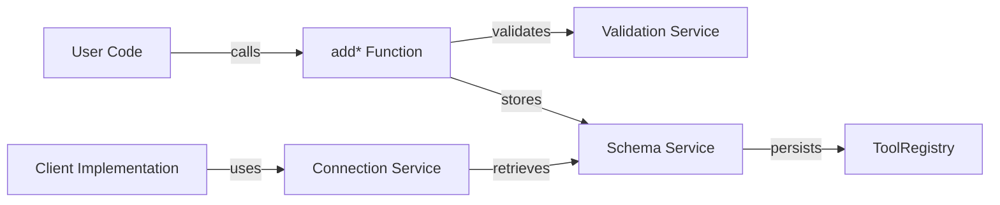
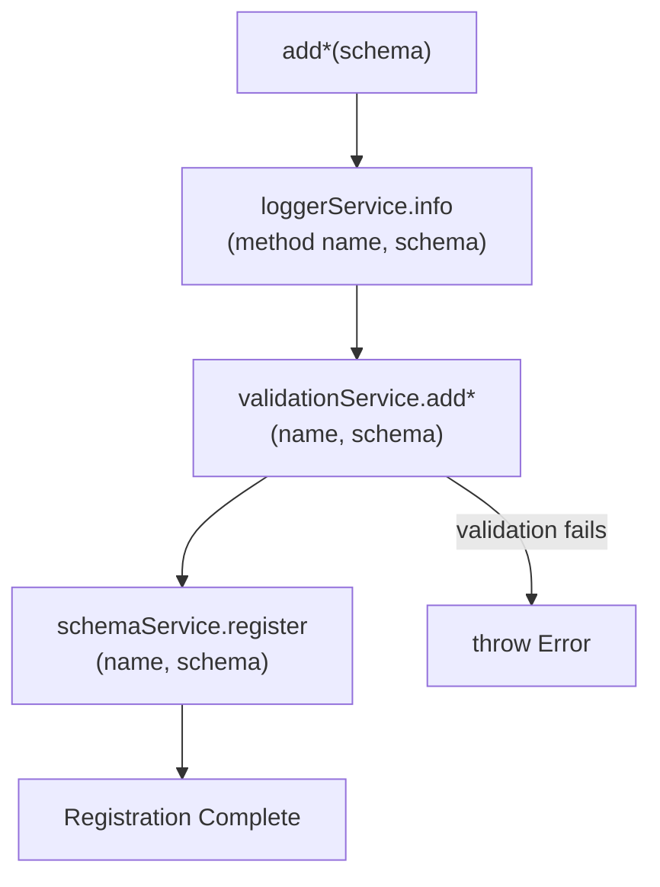
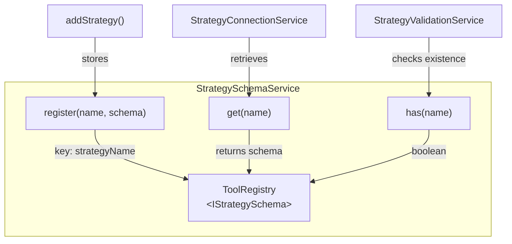
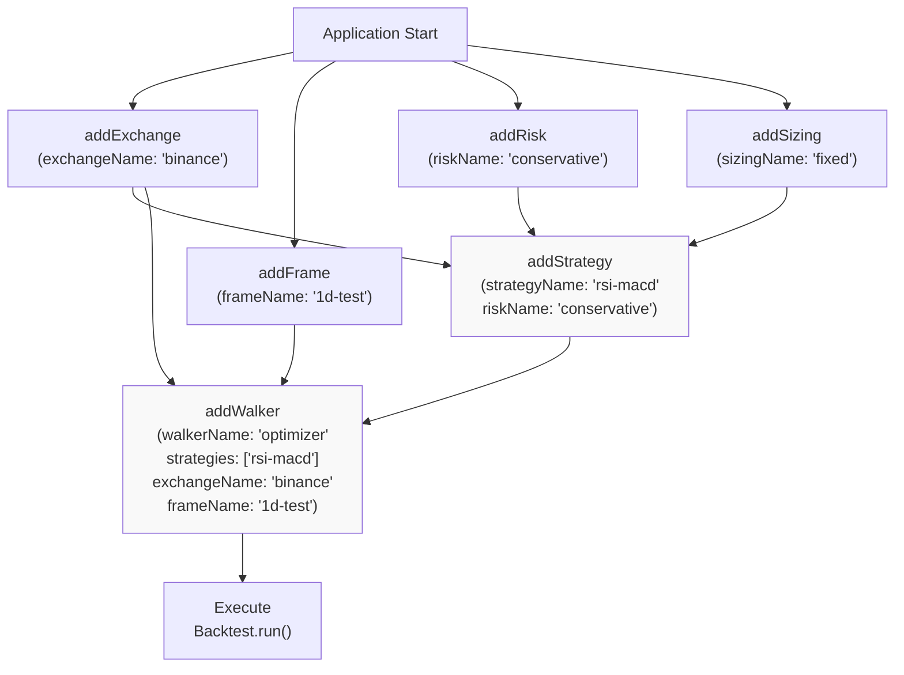
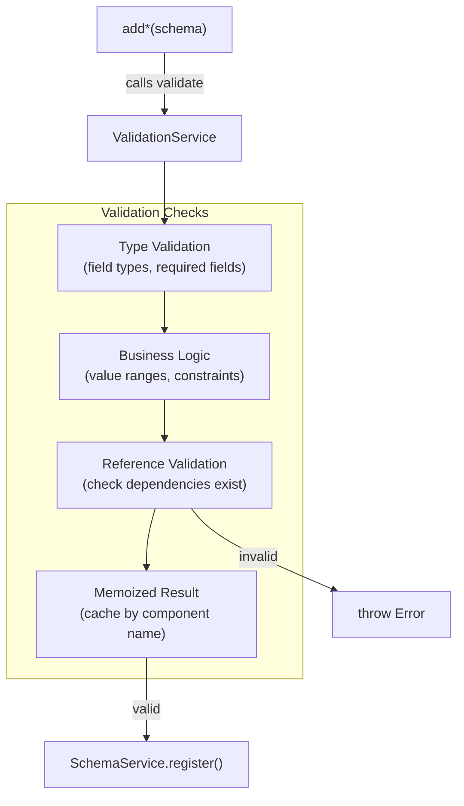
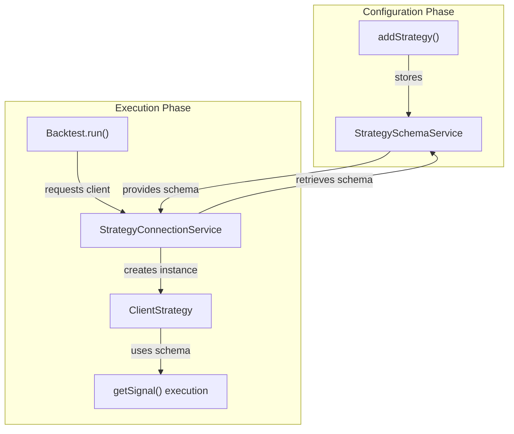
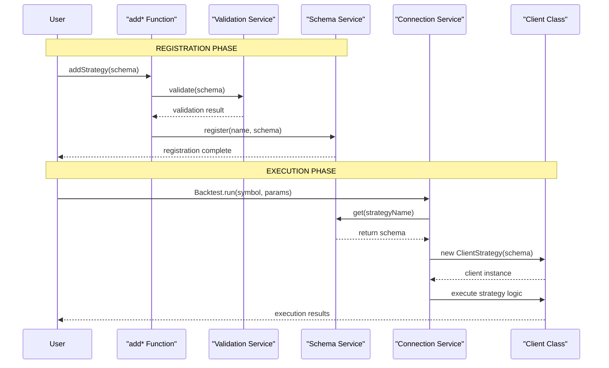

# Component Registration

<details>
<summary>Relevant source files</summary>

The following files were used as context for generating this wiki page:

- [demo/backtest/package-lock.json](demo/backtest/package-lock.json)
- [demo/backtest/package.json](demo/backtest/package.json)
- [demo/backtest/src/index.mjs](demo/backtest/src/index.mjs)
- [demo/live/package-lock.json](demo/live/package-lock.json)
- [demo/live/package.json](demo/live/package.json)
- [demo/live/src/index.mjs](demo/live/src/index.mjs)
- [demo/optimization/package-lock.json](demo/optimization/package-lock.json)
- [demo/optimization/package.json](demo/optimization/package.json)
- [package-lock.json](package-lock.json)
- [package.json](package.json)
- [src/function/add.ts](src/function/add.ts)
- [src/lib/core/provide.ts](src/lib/core/provide.ts)
- [src/lib/core/types.ts](src/lib/core/types.ts)
- [src/lib/index.ts](src/lib/index.ts)

</details>


## Purpose and Scope

Component registration is the mechanism by which users configure backtest-kit's core building blocks before executing backtests, live trading, or strategy optimization. This page explains the declarative registration pattern using `add*` functions and how registered schemas are stored in schema services for later retrieval.

For detailed API documentation of each registration function and its parameters, see [Component Registration Functions](#4.2). For schema interface definitions, see [Component Schemas](#5). For the internal implementation of schema services, see [Schema Services](#7.3).

---

## Registration Architecture

The registration system follows a consistent three-step pattern:



**Diagram: Component Registration Flow**

Each `add*` function performs validation before storage, ensuring schemas are valid at configuration time rather than runtime. Schema services use the `ToolRegistry` pattern to store configurations in memory with type-safe retrieval.

**Sources:**
- [src/function/add.ts:1-444]()
- [src/lib/services/schema/*]()
- [src/lib/services/validation/*]()

---

## Component Types

backtest-kit provides seven component types, each with a dedicated registration function:

| Component | Function | Purpose | Schema Type |
|-----------|----------|---------|-------------|
| **Strategy** | `addStrategy` | Signal generation logic | `IStrategySchema` |
| **Exchange** | `addExchange` | Market data source | `IExchangeSchema` |
| **Frame** | `addFrame` | Backtest timeframe | `IFrameSchema` |
| **Risk** | `addRisk` | Portfolio risk rules | `IRiskSchema` |
| **Sizing** | `addSizing` | Position sizing method | `ISizingSchema` |
| **Walker** | `addWalker` | Strategy comparison | `IWalkerSchema` |
| **Optimizer** | `addOptimizer` | LLM strategy generation | `IOptimizerSchema` |

All registration functions share a consistent naming pattern: `add<ComponentType>`, where the component type matches the schema name.

**Sources:**
- [src/function/add.ts:1-444]()
- [src/interfaces/*.interface.ts]()

---

## Registration Implementation

### Function Structure

Each registration function follows an identical implementation pattern:



**Diagram: Registration Function Execution Flow**

All registration functions inject three dependencies via the DI container:

1. **LoggerService**: Records registration attempts with full schema content
2. **ValidationService**: Enforces business rules (e.g., required fields, value ranges)
3. **SchemaService**: Persists validated schemas in `ToolRegistry`

**Sources:**
- [src/function/add.ts:52-64]() (Strategy example)
- [src/function/add.ts:101-113]() (Exchange example)
- [src/lib/index.ts:61-63]() (Logger service injection)
- [src/lib/index.ts:98-112]() (Schema service injection)

### Example: Strategy Registration

```typescript
export function addStrategy(strategySchema: IStrategySchema) {
  backtest.loggerService.info(ADD_STRATEGY_METHOD_NAME, {
    strategySchema,
  });
  backtest.strategyValidationService.addStrategy(
    strategySchema.strategyName,
    strategySchema
  );
  backtest.strategySchemaService.register(
    strategySchema.strategyName,
    strategySchema
  );
}
```

**Execution sequence:**

1. `loggerService.info()` logs: `"add.addStrategy"` with full schema object
2. `strategyValidationService.addStrategy()` validates:
   - `strategyName` is non-empty string
   - `interval` is valid value (`"1m"` | `"3m"` | `"5m"` | `"15m"` | `"30m"` | `"1h"`)
   - `getSignal` is an async function
   - `riskName` or `riskList` is provided (if risk management enabled)
3. `strategySchemaService.register()` stores schema in `ToolRegistry` keyed by `strategyName`

If validation fails, an error is thrown and the schema is **not** registered.

**Sources:**
- [src/function/add.ts:52-64]()
- [src/lib/services/validation/StrategyValidationService.ts]()
- [src/lib/services/schema/StrategySchemaService.ts]()

---

## Schema Service Storage

### ToolRegistry Pattern

Schema services use `ToolRegistry` from `di-kit` to store component configurations:



**Diagram: ToolRegistry Usage in Schema Services**

Each schema service extends a base pattern:

- **Storage**: In-memory `Map<string, TSchema>` via `ToolRegistry`
- **Key**: Component name (e.g., `strategyName`, `exchangeName`)
- **Value**: Full schema object (e.g., `IStrategySchema`, `IExchangeSchema`)
- **Retrieval**: Type-safe `get(name)` method
- **Validation**: `has(name)` to check existence before retrieval

**Sources:**
- [package.json:75-78]() (di-kit dependency)
- [src/lib/services/schema/*]()
- [src/lib/core/types.ts:20-28]() (Schema service symbols)

### Schema Service Instances

All schema services are registered as singletons in the DI container:

```typescript
{
    provide(TYPES.exchangeSchemaService, () => new ExchangeSchemaService());
    provide(TYPES.strategySchemaService, () => new StrategySchemaService());
    provide(TYPES.frameSchemaService, () => new FrameSchemaService());
    provide(TYPES.walkerSchemaService, () => new WalkerSchemaService());
    provide(TYPES.sizingSchemaService, () => new SizingSchemaService());
    provide(TYPES.riskSchemaService, () => new RiskSchemaService());
    provide(TYPES.optimizerSchemaService, () => new OptimizerSchemaService());
}
```

**Singleton behavior:** Each schema service is instantiated once and shared across the entire application. This ensures that all components (validation services, connection services, command services) access the same registry.

**Sources:**
- [src/lib/core/provide.ts:75-83]()
- [src/lib/core/types.ts:20-28]()

---

## Complete Registration Example

A typical backtest setup registers multiple components with dependencies between them:



**Diagram: Component Registration Dependencies**

**Registration order matters** when components reference each other by name. For example:

1. **Exchange** must be registered before **Strategy** (referenced in execution)
2. **Risk** must be registered before **Strategy** (if `riskName` is specified)
3. **Strategy** must be registered before **Walker** (referenced in `strategies` array)
4. **Frame** must be registered before **Walker** (referenced in execution)

**Note:** Validation services check for missing dependencies during registration. If a strategy references a non-existent `riskName`, `addStrategy()` throws an error.

**Sources:**
- [demo/backtest/src/index.mjs:24-107]()
- [demo/live/src/index.mjs:24-103]()

### Code Example from Demo

```javascript
// 1. Register exchange (no dependencies)
addExchange({
    exchangeName: "test_exchange",
    getCandles: async (symbol, interval, since, limit) => {
        const exchange = new ccxt.binance();
        const ohlcv = await exchange.fetchOHLCV(symbol, interval, since.getTime(), limit);
        return ohlcv.map(([timestamp, open, high, low, close, volume]) => ({
            timestamp, open, high, low, close, volume
        }));
    },
    formatPrice: async (symbol, price) => price.toFixed(2),
    formatQuantity: async (symbol, quantity) => quantity.toFixed(8),
});

// 2. Register risk (no dependencies)
addRisk({
    riskName: "demo_risk",
    validations: [
        {
            validate: ({ pendingSignal, currentPrice }) => {
                const { priceOpen = currentPrice, priceTakeProfit, position } = pendingSignal;
                const tpDistance = position === "long"
                    ? ((priceTakeProfit - priceOpen) / priceOpen) * 100
                    : ((priceOpen - priceTakeProfit) / priceOpen) * 100;
                if (tpDistance < 1) {
                    throw new Error(`TP distance ${tpDistance.toFixed(2)}% < 1%`);
                }
            },
            note: "TP distance must be at least 1%",
        },
    ],
});

// 3. Register frame (no dependencies)
addFrame({
    frameName: "test_frame",
    interval: "1m",
    startDate: new Date("2025-12-01T00:00:00.000Z"),
    endDate: new Date("2025-12-01T23:59:59.000Z"),
});

// 4. Register strategy (references risk)
addStrategy({
    strategyName: "test_strategy",
    interval: "5m",
    riskName: "demo_risk", // References registered risk
    getSignal: async (symbol) => {
        // Strategy logic
    },
});

// 5. Execute backtest (references all components)
Backtest.background("BTCUSDT", {
    strategyName: "test_strategy",
    exchangeName: "test_exchange",
    frameName: "test_frame",
});
```

**Sources:**
- [demo/backtest/src/index.mjs:24-113]()

---

## Validation During Registration

### Validation Service Architecture



**Diagram: Validation Service Processing**

**Validation layers:**

1. **Type Validation**: Ensures required fields exist and have correct types
   - Example: `strategyName` must be a non-empty string
   - Example: `getSignal` must be an async function

2. **Business Logic Validation**: Enforces domain-specific rules
   - Example: `interval` must be one of: `"1m"`, `"3m"`, `"5m"`, `"15m"`, `"30m"`, `"1h"`
   - Example: `startDate` must be before `endDate` in frames

3. **Reference Validation**: Checks that referenced components exist
   - Example: If strategy has `riskName: "demo_risk"`, the risk must be registered
   - Example: If walker has `exchangeName: "binance"`, the exchange must be registered

4. **Memoization**: Validation results are cached by component name
   - Prevents redundant validation for the same component
   - Enabled via `memoize()` from `functools-kit`

**Sources:**
- [src/lib/services/validation/*]()
- [src/function/add.ts:56-59]() (Strategy validation call)
- [package.json:74-79]() (functools-kit dependency)

### Example: Strategy Validation

```typescript
export function addStrategy(strategySchema: IStrategySchema) {
  // Validation call before registration
  backtest.strategyValidationService.addStrategy(
    strategySchema.strategyName,
    strategySchema
  );
  
  // Only reaches here if validation passes
  backtest.strategySchemaService.register(
    strategySchema.strategyName,
    strategySchema
  );
}
```

**What `StrategyValidationService.addStrategy()` checks:**

- `strategyName` is a string (non-empty)
- `interval` is one of the valid intervals
- `getSignal` is a function
- If `riskName` is provided, check `riskSchemaService.has(riskName)` returns `true`
- If `riskList` is provided, check all risk names exist in `riskSchemaService`
- Callbacks (if provided) are functions

**If validation fails:** Error is thrown immediately, preventing registration. The schema is **not** stored in the schema service.

**Sources:**
- [src/function/add.ts:56-59]()
- [src/lib/services/validation/StrategyValidationService.ts]()

---

## Component Retrieval

### Connection Service Pattern

Registered schemas are retrieved by **connection services**, which create **client instances** on demand:



**Diagram: Schema Retrieval During Execution**

**Retrieval pattern:**

1. **User calls execution function**: `Backtest.run(symbol, { strategyName, exchangeName, frameName })`
2. **Command service delegates** to connection service
3. **Connection service retrieves** schema from schema service using component name
4. **Connection service creates** client instance (e.g., `ClientStrategy`) with schema
5. **Connection service memoizes** client instance (singleton per `symbol:strategyName:mode` key)
6. **Client uses schema** during execution (e.g., calls `getSignal()` function)

**Memoization key structure:**

- **Strategy**: `${symbol}:${strategyName}:${backtest ? 'backtest' : 'live'}`
- **Exchange**: `${exchangeName}:${backtest ? 'backtest' : 'live'}`
- **Risk**: `${riskName}`
- **Sizing**: `${sizingName}`
- **Frame**: `${frameName}`

This ensures proper isolation:
- Strategies are isolated by symbol and execution mode
- Exchanges have separate instances for backtest vs. live (temporal isolation)
- Risk/Sizing/Frame use simpler keys (no mode dependency)

**Sources:**
- [src/lib/services/connection/StrategyConnectionService.ts]()
- [src/lib/services/connection/ExchangeConnectionService.ts]()
- [src/lib/services/command/*]()

### Example: Strategy Client Creation

When `Backtest.run("BTCUSDT", { strategyName: "test_strategy", ... })` executes:

1. `BacktestCommandService` calls `StrategyConnectionService.getClient("BTCUSDT", "test_strategy", true)`
2. Connection service computes memoization key: `"BTCUSDT:test_strategy:backtest"`
3. If not cached, connection service:
   - Calls `StrategySchemaService.get("test_strategy")` → returns `IStrategySchema`
   - Creates `new ClientStrategy(schema, symbol, backtest=true)`
   - Caches client under memoization key
4. Returns cached/created `ClientStrategy` instance
5. Command service calls `clientStrategy.backtest(timeframes)` to execute strategy

**Sources:**
- [src/lib/services/connection/StrategyConnectionService.ts]()
- [src/lib/services/command/BacktestCommandService.ts]()
- [src/client/ClientStrategy.ts]()

---

## Registration vs. Execution

Understanding the separation between **registration phase** and **execution phase** is critical:

| Phase | When | Purpose | Services Involved |
|-------|------|---------|-------------------|
| **Registration** | Before execution | Declare components | `add*` functions, Validation Services, Schema Services |
| **Execution** | During `run()`/`background()` | Use components | Command Services, Connection Services, Client Classes |

**Registration is declarative:** Users specify **what** to use, not **how** or **when** to use it.

**Execution is imperative:** Framework orchestrates component usage based on execution mode (backtest/live/walker).



**Diagram: Registration and Execution Sequence**

**Key benefits of separation:**

1. **Early validation**: Errors detected at configuration time, not during execution
2. **Reusability**: Same schema can be used in multiple executions (different symbols, modes)
3. **Testability**: Components can be registered once and tested multiple times
4. **Isolation**: Registration state is global, execution state is scoped to specific runs

**Sources:**
- [src/function/add.ts:1-444]() (Registration phase)
- [src/lib/services/command/*]() (Execution phase)
- [src/lib/services/connection/*]() (Bridge between phases)

---

## Summary

Component registration in backtest-kit follows a consistent, type-safe pattern:

1. **User calls `add*` function** with schema object
2. **Validation service checks** schema validity and dependencies
3. **Schema service stores** validated schema in `ToolRegistry`
4. **Connection services retrieve** schemas during execution
5. **Client instances** are created with schemas to perform work

This architecture provides:
- **Early error detection** via registration-time validation
- **Type safety** through TypeScript interfaces
- **Dependency resolution** by checking references at registration
- **Efficient execution** via memoized client instances
- **Clean separation** between configuration and execution

For detailed parameter documentation, see [Component Registration Functions](#4.2). For schema interfaces, see [Component Schemas](#5). For connection service implementation, see [Connection Services](#7.2).