# Component Registration

Component registration is the configuration phase where users define the building blocks of their trading system: strategies, exchanges, timeframes, risk rules, position sizing algorithms, strategy comparisons, and AI optimizers. All components are registered before execution begins, creating an immutable registry that the framework queries during backtest, live trading, or walker execution.

This page explains the registration pattern and architecture. For detailed API signatures and parameters, see [Component Registration Functions](./16_Component_Registration_Functions.md). For the schema interfaces that define component structure, see [Component Types](./23_Component_Types.md).

---

## Registration Functions

The framework provides seven registration functions, each accepting a schema object that defines component behavior:

| Function | Schema Type | Purpose | Validation Service | Schema Service |
|----------|-------------|---------|-------------------|----------------|
| `addStrategy` | `IStrategySchema` | Register trading signal logic | `StrategyValidationService` | `StrategySchemaService` |
| `addExchange` | `IExchangeSchema` | Register market data source | `ExchangeValidationService` | `ExchangeSchemaService` |
| `addFrame` | `IFrameSchema` | Register backtest timeframe | `FrameValidationService` | `FrameSchemaService` |
| `addRisk` | `IRiskSchema` | Register risk management rules | `RiskValidationService` | `RiskSchemaService` |
| `addSizing` | `ISizingSchema` | Register position sizing algorithm | `SizingValidationService` | `SizingSchemaService` |
| `addWalker` | `IWalkerSchema` | Register strategy comparison | `WalkerValidationService` | `WalkerSchemaService` |
| `addOptimizer` | `IOptimizerSchema` | Register AI strategy generator | `OptimizerValidationService` | `OptimizerSchemaService` |

All registration functions follow the same pattern: validate schema structure, then store in the appropriate schema service registry. The framework uses a name-based lookup system where each component type has a unique identifier (`strategyName`, `exchangeName`, etc.).

**Sources:** [src/function/add.ts:1-444](), [src/index.ts:1-10]()

---

## Registration Architecture



**Component Registration Flow**

This diagram shows the complete registration pipeline from user code to runtime execution. Each registration function performs a two-step process: validation then storage. The schema registries are immutable after registration and act as configuration databases queried by execution services.

**Sources:** [src/function/add.ts:52-444](), [src/lib/index.ts:94-108](), [src/lib/core/provide.ts:72-79]()

---

## Registration Implementation Pattern

All seven registration functions follow an identical implementation pattern:



**Registration Sequence**

Each `add*` function executes the same three-step pattern: logging, validation, and registration. Validation errors throw immediately, preventing invalid schemas from entering the registry. The registration phase is synchronous and completes before the function returns.

**Sources:** [src/function/add.ts:52-64](), [src/function/add.ts:101-113](), [src/function/add.ts:145-151]()

---

## Schema Service Architecture

Schema services implement a simple name-to-schema registry using `Map` data structures. Each service provides three core methods:



**Schema Service Class Hierarchy**

All schema services follow the same pattern but are specialized for their respective component types. The `register()` method is called by `add*` functions, while `get()` and `has()` are called by Connection and Global services during execution.

**Sources:** [src/lib/index.ts:94-108](), [src/lib/core/provide.ts:72-79]()

---

## Validation at Registration

Validation occurs synchronously during registration, ensuring only valid schemas enter the registry. Each component type has specific validation rules:

### Strategy Validation

- **Required fields:** `strategyName`, `interval`, `getSignal`
- **Interval validation:** Must be valid `SignalInterval` enum value
- **Callback validation:** Optional callbacks must be functions if provided
- **Business rules:** Enforced during signal generation, not registration

### Exchange Validation

- **Required fields:** `exchangeName`, `getCandles`, `formatPrice`, `formatQuantity`
- **Function validation:** All methods must be async functions
- **Candle structure:** Validated at runtime, not registration

### Frame Validation

- **Required fields:** `frameName`, `interval`, `startDate`, `endDate`
- **Date validation:** `startDate` must precede `endDate`
- **Interval validation:** Must be valid `FrameInterval` enum value

### Walker Validation

- **Required fields:** `walkerName`, `strategies`, `exchangeName`, `frameName`
- **Strategies array:** Must be non-empty array of strings
- **Metric validation:** Must be valid `WalkerMetric` enum value (defaults to `"sharpeRatio"`)
- **Reference validation:** `exchangeName` and `frameName` must exist in respective registries

### Risk Validation

- **Required fields:** `riskName`
- **Optional fields:** `maxConcurrentPositions`, `validations`, `callbacks`
- **Validations array:** Each validation must be function or object with `validate` function
- **Callback validation:** Callbacks must be functions if provided

### Sizing Validation

- **Required fields:** `sizingName`, `method`
- **Method validation:** Must be `"fixed-percentage"`, `"kelly-criterion"`, or `"atr-based"`
- **Discriminated union:** Fields validated based on `method` value
- **Percentage validation:** Risk/position percentages must be positive numbers

### Optimizer Validation

- **Required fields:** `optimizerName`, `rangeTrain`, `rangeTest`, `source`, `getPrompt`
- **Range validation:** Train and test ranges must have valid date pairs
- **Source validation:** Each source must have `name` and `fetch` function
- **Template validation:** Optional template overrides must be functions

**Sources:** [src/function/add.ts:52-444]()

---

## Component Lifecycle: Registration to Execution



**Component State Transitions**

Components transition from registration (configuration) to execution (runtime) through a series of services. The schema acts as an immutable blueprint that Connection services use to create memoized instances. This separation enables multiple executions with different symbols to share the same schema but maintain separate runtime state.

**Sources:** [src/lib/index.ts:212-224](), [src/function/add.ts:1-444]()

---

## Dependency Injection Integration

Component registration integrates with the dependency injection system through service instantiation at application startup:



**Service Instantiation Flow**

The `TYPES` registry defines symbol keys for all services. The `provide.ts` file instantiates all services and registers them in the DI container. The `init()` function resolves dependencies and creates the `backtest` aggregation object. Registration functions (`add*`) import this object to access validation and schema services.

**Sources:** [src/lib/core/types.ts:1-97](), [src/lib/core/provide.ts:1-132](), [src/lib/index.ts:1-232]()

---

## Registration Access Patterns

The framework provides multiple ways to interact with the component registry:

### Direct Registration

```typescript
// Primary pattern used in all examples
addStrategy({ strategyName: "rsi-strategy", ... });
addExchange({ exchangeName: "binance", ... });
addFrame({ frameName: "1d-backtest", ... });
```

### List Functions

```typescript
// Query registered components
import { listStrategies, listExchanges, listFrames } from "backtest-kit";

const strategies = listStrategies();  // string[]
const exchanges = listExchanges();    // string[]
const frames = listFrames();          // string[]
```

### Internal Service Access

```typescript
// Low-level access (advanced use cases)
import { backtest } from "backtest-kit";

const schema = backtest.strategySchemaService.get("rsi-strategy");
const exists = backtest.exchangeSchemaService.has("binance");
```

The `list*` functions are convenience wrappers that query schema services and return arrays of registered names. These are useful for validation, debugging, and dynamic configuration.

**Sources:** [src/index.ts:11-19](), [src/lib/index.ts:94-108]()

---

## Registration Timing and Order

Component registration must complete before execution begins. The framework does not enforce registration order for most components, but some have implicit dependencies:

### Required Before Execution

All execution methods (`Backtest.run`, `Live.run`, `Walker.run`) require:
- At least one strategy registered
- At least one exchange registered
- For backtest/walker: at least one frame registered

### Walker Dependencies

`addWalker` requires:
- All referenced strategies must be registered via `addStrategy`
- Referenced `exchangeName` must be registered via `addExchange`
- Referenced `frameName` must be registered via `addFrame`

Walker validation checks these references at registration time and throws if any are missing.

### Optional Components

Risk, sizing, and optimizer components are optional:
- Strategies execute without explicit risk/sizing if not specified
- Optimizer is only needed when using `Optimizer.dump()` for code generation

### Re-registration

Calling `add*` with the same name twice overwrites the previous registration. The latest schema wins. This enables dynamic reconfiguration during development but should be avoided in production.

**Sources:** [src/function/add.ts:190-202]()

---

## Registration Error Handling

Registration functions throw synchronously when validation fails:



**Error Propagation**

Validation errors propagate immediately to the caller. There is no error recovery mechanism within the registration pipeline. The user must catch errors if they want to handle invalid schemas gracefully.

Common validation errors include:
- Missing required fields
- Invalid enum values (interval, metric)
- Type mismatches (function expected, string provided)
- Invalid date ranges (endDate before startDate)
- Missing dependencies (walker references non-existent strategy)

**Sources:** [src/function/add.ts:52-444]()

---

## Cross-Component Registration Examples

### Minimal Backtest Configuration

```typescript
// Three components required: strategy, exchange, frame
addExchange({ 
  exchangeName: "binance", 
  getCandles: async (...) => [...],
  formatPrice: async (symbol, price) => price.toFixed(2),
  formatQuantity: async (symbol, qty) => qty.toFixed(8),
});

addFrame({
  frameName: "1d-backtest",
  interval: "1m",
  startDate: new Date("2024-01-01"),
  endDate: new Date("2024-01-02"),
});

addStrategy({
  strategyName: "rsi-strategy",
  interval: "5m",
  getSignal: async (symbol) => ({ ... }),
});

// Now ready for: Backtest.run("BTCUSDT", { strategyName, exchangeName, frameName })
```

### Live Trading Configuration

```typescript
// Live mode requires strategy + exchange (no frame needed)
addExchange({ exchangeName: "binance", ... });
addStrategy({ strategyName: "rsi-strategy", ... });

// Optional: add risk management
addRisk({
  riskName: "conservative",
  maxConcurrentPositions: 3,
});

// Now ready for: Live.run("BTCUSDT", { strategyName, exchangeName, riskName })
```

### Walker Configuration

```typescript
// Walker requires: strategies, exchange, frame, walker
addExchange({ exchangeName: "binance", ... });
addFrame({ frameName: "1d-backtest", ... });

addStrategy({ strategyName: "rsi-v1", ... });
addStrategy({ strategyName: "rsi-v2", ... });
addStrategy({ strategyName: "macd-v1", ... });

addWalker({
  walkerName: "compare-rsi-macd",
  strategies: ["rsi-v1", "rsi-v2", "macd-v1"],
  exchangeName: "binance",
  frameName: "1d-backtest",
  metric: "sharpeRatio",
});

// Now ready for: Walker.run("BTCUSDT", { walkerName })
```

**Sources:** [src/function/add.ts:1-444]()

---

## Registration and Memoization

Component registration creates schemas (immutable configuration), while Connection services create runtime instances (memoized by key). This separation enables:

### Schema Reuse Across Symbols

```typescript
// Register once
addStrategy({ strategyName: "rsi-strategy", ... });
addExchange({ exchangeName: "binance", ... });

// Execute multiple times with different symbols
await Backtest.run("BTCUSDT", { strategyName: "rsi-strategy", ... });
await Backtest.run("ETHUSDT", { strategyName: "rsi-strategy", ... });
await Backtest.run("ADAUSDT", { strategyName: "rsi-strategy", ... });

// Each execution creates separate ClientStrategy instances
// but shares the same IStrategySchema
```

### Instance Memoization by (Symbol, Name)

Connection services cache instances using a composite key:

```typescript
// Key: `${symbol}_${strategyName}`
const key1 = "BTCUSDT_rsi-strategy";  // First instance
const key2 = "ETHUSDT_rsi-strategy";  // Second instance
const key3 = "BTCUSDT_rsi-strategy";  // Returns first instance (cached)
```

This enables parallel execution of the same strategy across multiple symbols without state interference. Each symbol maintains independent signal state, but all share the same underlying schema and `getSignal` function.

**Sources:** [src/lib/index.ts:70-92]()

---

## Summary

Component registration is a synchronous, validate-then-store operation that populates schema registries. The seven `add*` functions provide a uniform interface for configuring strategies, exchanges, frames, walkers, risk rules, sizing algorithms, and optimizers. Validation occurs immediately at registration time, preventing invalid configurations from entering the system. The schema registries act as immutable configuration databases that Connection and Global services query during execution. This separation between configuration (registration) and instantiation (runtime) enables schema reuse across multiple executions while maintaining independent state per symbol.