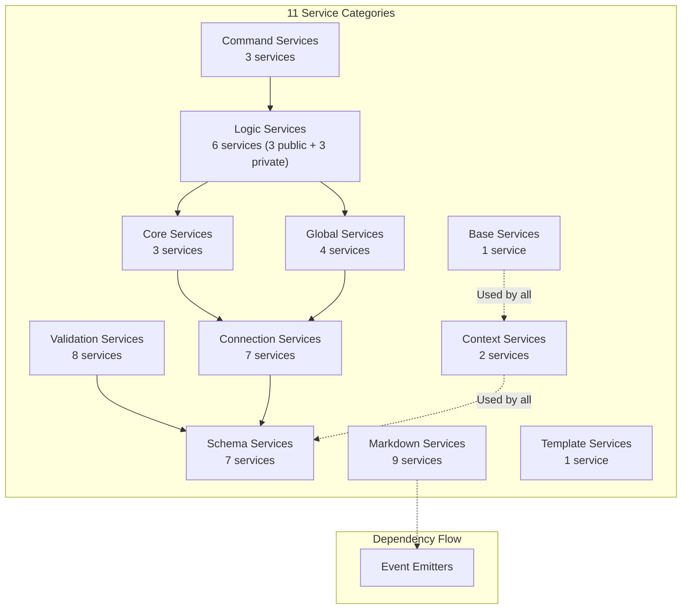
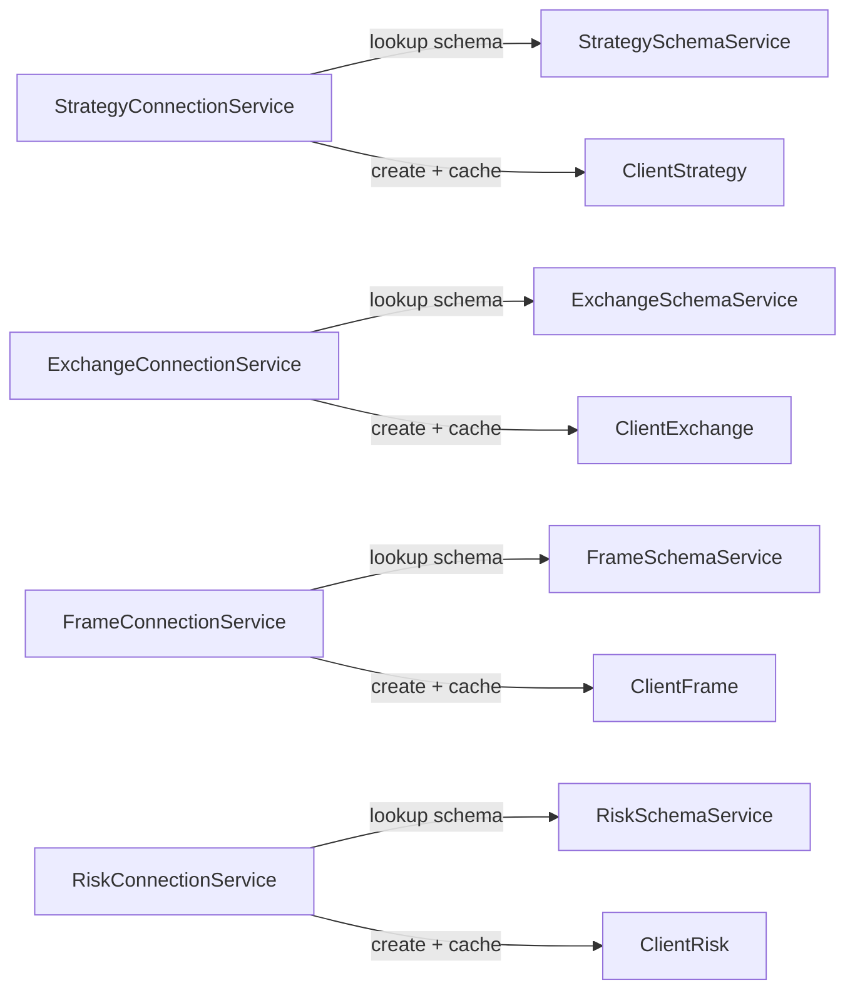
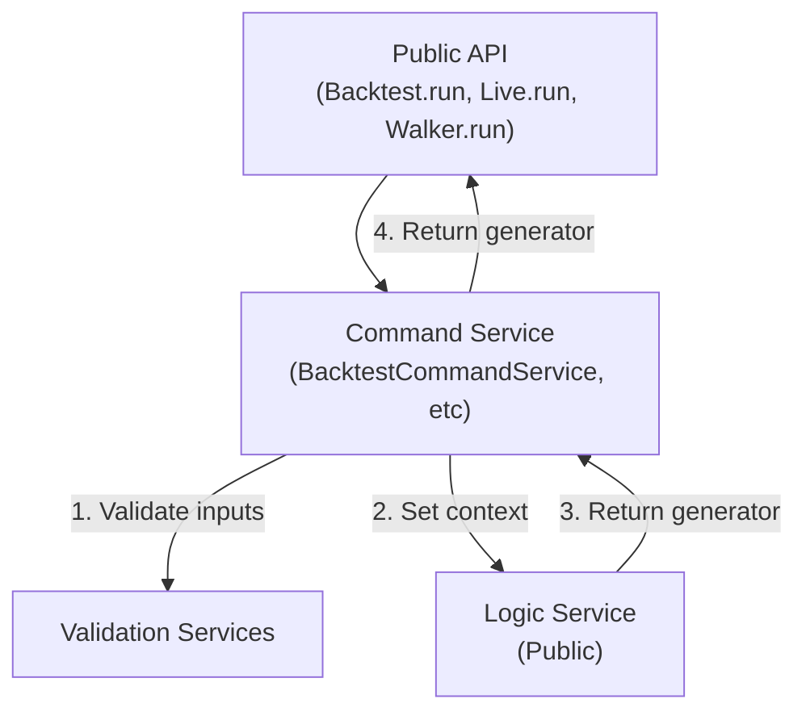
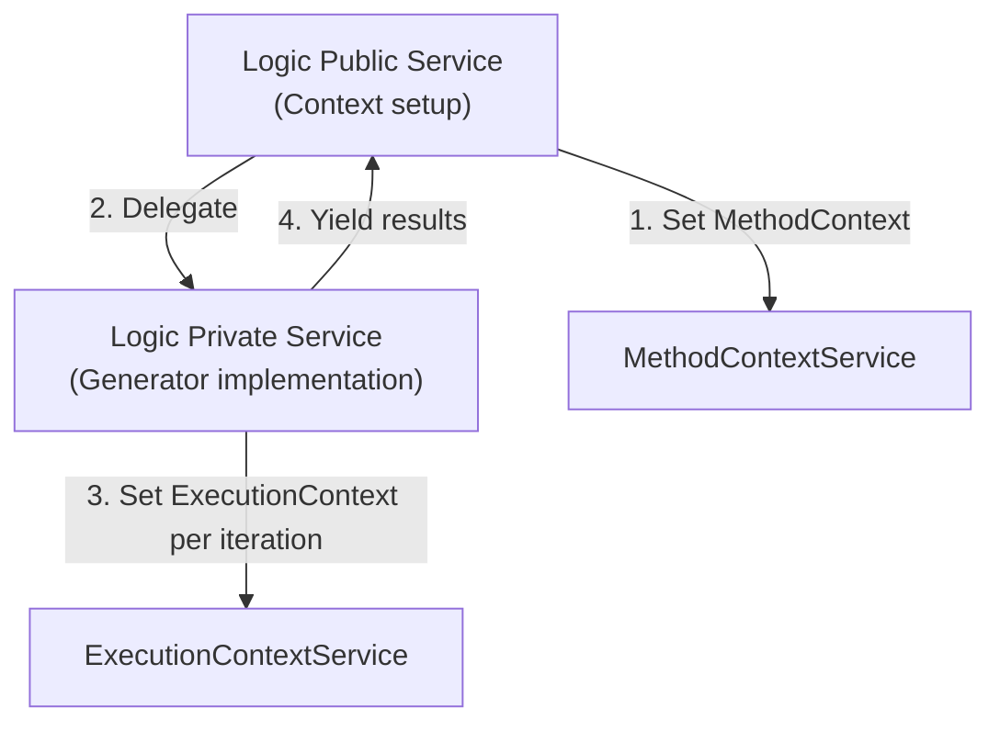
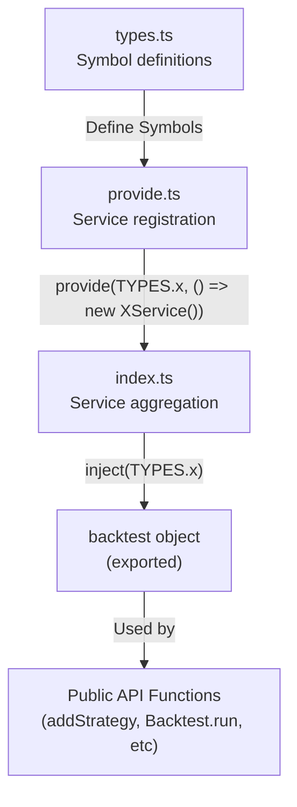

# Service Categories

This page documents the 11 service categories that comprise the Service Layer in the backtest-kit architecture. Each category serves a distinct architectural role, from configuration storage to business logic execution. For information about the overall layered architecture, see [Layered Architecture](./07-layered-architecture.md). For details on how services are registered via dependency injection, see [Dependency Injection System](./08-dependency-injection-system.md).

---

## Service Layer Organization

The Service Layer implements a dependency injection architecture where services are organized into 11 functional categories. All services are registered in the `backtest` aggregation object, which serves as the central service locator throughout the codebase. The categories follow a clear separation of concerns: **Schema** services store configuration, **Validation** services enforce rules, **Connection** services create memoized client instances, **Core** services implement domain logic, **Global** services wrap public APIs, **Command** services orchestrate execution modes, **Logic** services manage execution flow, **Markdown** services generate reports, **Template** services handle code generation, **Context** services manage execution state, and **Base** services provide foundational utilities.

---

## Service Category Diagram



---

## 1. Base Services

The Base category contains foundational services used throughout the framework.

| Service | Symbol | Purpose |
|---------|--------|---------|
| `LoggerService` | `TYPES.loggerService` | Structured logging with context injection |

### LoggerService

Provides structured logging capabilities with automatic context injection. All log messages include `methodContextService` and `executionContextService` data (strategy name, symbol, timestamp) for traceability.

**Registration:** [src/lib/core/provide.ts:55-57]()

**Key Methods:**
- `log(methodName, data)` - Standard logging
- `info(methodName, data)` - Info-level logging
- `error(methodName, error)` - Error logging

---

## 2. Context Services

Context services manage execution state that flows through service calls. They use `di-scoped` to maintain nested execution contexts.

| Service | Symbol | Purpose |
|---------|--------|---------|
| `ExecutionContextService` | `TYPES.executionContextService` | Symbol, timestamp, backtest flag |
| `MethodContextService` | `TYPES.methodContextService` | Strategy, exchange, frame names |

### ExecutionContextService

Provides scoped execution context for each tick/timeframe. The context includes:
- `symbol: string` - Trading pair (e.g., "BTCUSDT")
- `when: Date` - Current timeframe or live timestamp
- `backtest: boolean` - Execution mode flag

**Registration:** [src/lib/core/provide.ts:60]()

**Usage Pattern:**
```typescript
ExecutionContextService.runInContext(() => {
  // All services access context via ExecutionContextService.getContext()
}, { symbol, when, backtest });
```

### MethodContextService

Provides scoped method context for routing to registered schemas. The context includes:
- `strategyName: string` - Current strategy identifier
- `exchangeName: string` - Current exchange identifier
- `frameName: string` - Current frame identifier (backtest only)

**Registration:** [src/lib/core/provide.ts:61]()

**Usage Pattern:**
```typescript
MethodContextService.runInContext(() => {
  // Services use context to look up correct schema
}, { strategyName, exchangeName, frameName });
```

---

## 3. Schema Services

Schema services implement a **ToolRegistry** pattern for immutable configuration storage. Each schema service stores configurations registered via `add*()` functions.

| Service | Symbol | Domain |
|---------|--------|--------|
| `StrategySchemaService` | `TYPES.strategySchemaService` | Strategy configurations |
| `ExchangeSchemaService` | `TYPES.exchangeSchemaService` | Exchange data sources |
| `FrameSchemaService` | `TYPES.frameSchemaService` | Timeframe definitions |
| `WalkerSchemaService` | `TYPES.walkerSchemaService` | Strategy comparison configs |
| `SizingSchemaService` | `TYPES.sizingSchemaService` | Position sizing logic |
| `RiskSchemaService` | `TYPES.riskSchemaService` | Risk management rules |
| `OptimizerSchemaService` | `TYPES.optimizerSchemaService` | LLM strategy generation |

### Schema Service Pattern

All schema services follow the same interface:

```typescript
class XSchemaService {
  register(name: string, schema: IXSchema): void;
  lookup(name: string): IXSchema | undefined;
  list(): IXSchema[];
}
```

**Registration:** [src/lib/core/provide.ts:74-82]()

**Storage:** Uses `ToolRegistry` from `functools-kit` for immutable storage with shallow validation.

---

## 4. Validation Services

Validation services enforce existence checks and runtime validation. They are **memoized** to optimize repeated checks.

| Service | Symbol | Validates |
|---------|--------|-----------|
| `StrategyValidationService` | `TYPES.strategyValidationService` | Strategy schema structure, risk dependency |
| `ExchangeValidationService` | `TYPES.exchangeValidationService` | Exchange schema required fields |
| `FrameValidationService` | `TYPES.frameValidationService` | Frame date range and interval logic |
| `WalkerValidationService` | `TYPES.walkerValidationService` | Walker strategy list and metric |
| `SizingValidationService` | `TYPES.sizingValidationService` | Sizing schema parameters |
| `RiskValidationService` | `TYPES.riskValidationService` | Risk schema validation array |
| `OptimizerValidationService` | `TYPES.optimizerValidationService` | Optimizer source and prompt validation |
| `ConfigValidationService` | `TYPES.configValidationService` | Global config economic viability |

### Validation Service Pattern

```typescript
class XValidationService {
  addX(name: string, schema: IXSchema): void;  // Called by add*() functions
  validateX(name: string): void;                // Throws if invalid
  list(): IXSchema[];                           // Returns all registered
}
```

**Registration:** [src/lib/core/provide.ts:127-136]()

**Memoization:** Validation results are cached to prevent redundant checks during execution loops.

**Dependency:** Validation services read from corresponding schema services to verify existence.

---

## 5. Connection Services

Connection services are **memoized client factories** that create and cache client instances. Each connection service maintains a cache keyed by schema names or composite keys.

| Service | Symbol | Creates | Cache Key |
|---------|--------|---------|-----------|
| `StrategyConnectionService` | `TYPES.strategyConnectionService` | `ClientStrategy` | `symbol:strategyName` |
| `ExchangeConnectionService` | `TYPES.exchangeConnectionService` | `ClientExchange` | `exchangeName` |
| `FrameConnectionService` | `TYPES.frameConnectionService` | `ClientFrame` | `frameName` |
| `SizingConnectionService` | `TYPES.sizingConnectionService` | `ClientSizing` | `sizingName` |
| `RiskConnectionService` | `TYPES.riskConnectionService` | `ClientRisk` | `riskName` |
| `OptimizerConnectionService` | `TYPES.optimizerConnectionService` | `ClientOptimizer` | `optimizerName` |
| `PartialConnectionService` | `TYPES.partialConnectionService` | `ClientPartial` | `symbol` |

### Connection Service Diagram



### Memoization Pattern

Connection services use `memoizeOneArg` from `functools-kit` to cache client instances:

```typescript
class StrategyConnectionService {
  private readonly _getClient = memoizeOneArg((key: string) => {
    const schema = this.strategySchemaService.lookup(strategyName);
    return new ClientStrategy(schema, dependencies);
  });
  
  getClient(symbol: string, strategyName: string): ClientStrategy {
    return this._getClient(`${symbol}:${strategyName}`);
  }
}
```

**Registration:** [src/lib/core/provide.ts:64-72]()

**Purpose:** Prevents creating duplicate client instances during execution loops, optimizing memory usage.

---

## 6. Core Services

Core services implement **domain logic** for the three main business entities: Strategy, Exchange, and Frame.

| Service | Symbol | Responsibilities |
|---------|--------|------------------|
| `StrategyCoreService` | `TYPES.strategyCoreService` | Signal generation, lifecycle management |
| `ExchangeCoreService` | `TYPES.exchangeCoreService` | Candle fetching, VWAP calculation |
| `FrameCoreService` | `TYPES.frameCoreService` | Timeframe generation, date iteration |

### StrategyCoreService

Orchestrates signal lifecycle by delegating to `ClientStrategy`:

**Key Methods:**
- `tick(symbol: string): Promise<IStrategyTickResult>` - Generate or monitor signal for current timeframe
- Uses `StrategyConnectionService` to get cached `ClientStrategy` instance
- Delegates to `ClientStrategy.tick()` and `ClientStrategy.backtest()`

**Registration:** [src/lib/core/provide.ts:86]()

### ExchangeCoreService

Manages market data fetching and price calculations:

**Key Methods:**
- `getCandles(symbol: string, interval: string, since: number, limit: number): Promise<ICandleData[]>`
- `getNextCandles(symbol: string, interval: string, since: number, limit: number): Promise<ICandleData[]>`
- `getAveragePrice(symbol: string): Promise<number>` - VWAP from last 5 1m candles

**Registration:** [src/lib/core/provide.ts:85]()

### FrameCoreService

Generates timeframe arrays for backtest iteration:

**Key Methods:**
- `getTimeframe(frameName: string): Date[]` - Generate array of Date objects for backtest loop

**Registration:** [src/lib/core/provide.ts:87]()

---

## 7. Global Services

Global services are **context wrappers** that combine validation and core service calls for public API exports.

| Service | Symbol | Purpose |
|---------|--------|---------|
| `SizingGlobalService` | `TYPES.sizingGlobalService` | Position size calculation with validation |
| `RiskGlobalService` | `TYPES.riskGlobalService` | Risk state management and validation |
| `OptimizerGlobalService` | `TYPES.optimizerGlobalService` | LLM orchestration with validation |
| `PartialGlobalService` | `TYPES.partialGlobalService` | Partial P/L tracking wrapper |

### Global Service Pattern

Global services validate input, set context, and delegate to core/connection services:

```typescript
class SizingGlobalService {
  async calculate(params: ISizingParams): Promise<number> {
    // 1. Validate sizingName exists
    this.sizingValidationService.validateSizing(params.sizingName);
    
    // 2. Get client via connection service
    const client = this.sizingConnectionService.getClient(params.sizingName);
    
    // 3. Delegate to client
    return await client.calculate(params);
  }
}
```

**Registration:** [src/lib/core/provide.ts:90-94]()

**Purpose:** Provide validated, context-aware access to business logic for public API functions.

---

## 8. Command Services

Command services are **high-level orchestrators** for the three execution modes. They validate inputs and delegate to logic services.

| Service | Symbol | Execution Mode |
|---------|--------|----------------|
| `BacktestCommandService` | `TYPES.backtestCommandService` | Historical simulation |
| `LiveCommandService` | `TYPES.liveCommandService` | Real-time trading |
| `WalkerCommandService` | `TYPES.walkerCommandService` | Strategy comparison |

### Command Service Workflow



### BacktestCommandService

**Key Method:**
- `run(symbol: string, context: { strategyName, exchangeName, frameName }): AsyncGenerator<IStrategyTickResult>`

**Workflow:**
1. Validate `strategyName`, `exchangeName`, `frameName` exist
2. Validate risk dependencies
3. Delegate to `BacktestLogicPublicService.run()`

**Registration:** [src/lib/core/provide.ts:99]()

### LiveCommandService

**Key Method:**
- `run(symbol: string, context: { strategyName, exchangeName }): AsyncGenerator<IStrategyTickResult>`

**Workflow:**
1. Validate `strategyName`, `exchangeName` exist
2. Validate risk dependencies
3. Delegate to `LiveLogicPublicService.run()`

**Registration:** [src/lib/core/provide.ts:98]()

### WalkerCommandService

**Key Method:**
- `run(symbol: string, context: { walkerName, exchangeName, frameName }): AsyncGenerator<WalkerContract>`

**Workflow:**
1. Validate `walkerName`, `exchangeName`, `frameName` exist
2. Validate all strategies in walker exist
3. Delegate to `WalkerLogicPublicService.run()`

**Registration:** [src/lib/core/provide.ts:100]()

---

## 9. Logic Services

Logic services implement **execution flow** with a public/private split pattern. Public services handle context setup, while private services contain generator implementations.

### Service Structure

| Public Service | Private Service | Execution Mode |
|----------------|-----------------|----------------|
| `BacktestLogicPublicService` | `BacktestLogicPrivateService` | Historical simulation |
| `LiveLogicPublicService` | `LiveLogicPrivateService` | Real-time trading |
| `WalkerLogicPublicService` | `WalkerLogicPrivateService` | Strategy comparison |

### Public/Private Split Pattern



### BacktestLogicPublicService

**Registration:** [src/lib/core/provide.ts:110]()

**Key Method:**
```typescript
async *run(symbol: string, context: IMethodContext): AsyncGenerator<IStrategyTickResult> {
  yield* this.methodContextService.runInContext(() => {
    return this.backtestLogicPrivateService.run(symbol);
  }, context);
}
```

### BacktestLogicPrivateService

**Registration:** [src/lib/core/provide.ts:104]()

**Key Method:**
```typescript
async *run(symbol: string): AsyncGenerator<IStrategyTickResult> {
  const timeframe = this.frameCoreService.getTimeframe();
  
  for (const when of timeframe) {
    yield* this.executionContextService.runInContext(() => {
      return this.strategyCoreService.tick(symbol);
    }, { symbol, when, backtest: true });
  }
}
```

### LiveLogicPrivateService

**Registration:** [src/lib/core/provide.ts:105]()

**Key Pattern:**
```typescript
async *run(symbol: string): AsyncGenerator<IStrategyTickResult> {
  await this.clientStrategy.waitForInit(symbol);  // Load persisted state
  
  while (true) {
    const when = new Date();
    yield* this.executionContextService.runInContext(() => {
      return this.strategyCoreService.tick(symbol);
    }, { symbol, when, backtest: false });
    
    await sleep(TICK_TTL);
  }
}
```

### WalkerLogicPrivateService

**Registration:** [src/lib/core/provide.ts:106]()

**Key Pattern:**
```typescript
async *run(symbol: string): AsyncGenerator<WalkerContract> {
  const walker = this.walkerSchemaService.lookup(walkerName);
  let bestStrategy = null;
  let bestMetric = -Infinity;
  
  for (const strategyName of walker.strategies) {
    // Run backtest for each strategy
    const generator = this.backtestLogicPublicService.run(symbol, context);
    for await (const result of generator) { /* collect results */ }
    
    // Get statistics and compare
    const stats = this.backtestMarkdownService.getData();
    if (stats.sharpeRatio > bestMetric) {
      bestMetric = stats.sharpeRatio;
      bestStrategy = strategyName;
    }
    
    yield { strategyName, stats, bestStrategy, bestMetric };
  }
}
```

---

## 10. Markdown Services

Markdown services generate **auto-generated reports** by subscribing to event emitters and accumulating data with bounded queues.

| Service | Symbol | Tracks | MAX_EVENTS |
|---------|--------|--------|------------|
| `BacktestMarkdownService` | `TYPES.backtestMarkdownService` | Closed signals | 250 |
| `LiveMarkdownService` | `TYPES.liveMarkdownService` | All tick types | 250 |
| `ScheduleMarkdownService` | `TYPES.scheduleMarkdownService` | Scheduled signals | 250 |
| `PerformanceMarkdownService` | `TYPES.performanceMarkdownService` | Execution metrics | 10000 |
| `WalkerMarkdownService` | `TYPES.walkerMarkdownService` | Strategy comparison | Unbounded |
| `HeatMarkdownService` | `TYPES.heatMarkdownService` | Portfolio stats | Unbounded |
| `PartialMarkdownService` | `TYPES.partialMarkdownService` | Partial P/L | 250 |
| `RiskMarkdownService` | `TYPES.riskMarkdownService` | Risk rejections | Unbounded |
| `OutlineMarkdownService` | `TYPES.outlineMarkdownService` | System outline | N/A |

### Markdown Service Pattern

All markdown services follow the `ReportStorage` pattern:

```typescript
class XMarkdownService {
  constructor() {
    // Subscribe to relevant emitter
    signalEmitter.subscribe((event) => {
      this.events.push(event);
      if (this.events.length > MAX_EVENTS) {
        this.events.shift();  // Bounded queue
      }
    });
  }
  
  getData(): XStatistics;           // Return processed statistics
  getReport(): string;              // Return markdown report
  dump(filename?: string): void;    // Write report to filesystem
}
```

**Registration:** [src/lib/core/provide.ts:115-125]()

### BacktestMarkdownService

**Subscribes to:** `signalBacktestEmitter`

**Collects:** Closed signals only (`action === 'closed'`)

**Statistics:** `BacktestStatistics` - win rate, Sharpe ratio, total PNL, etc.

**MAX_EVENTS:** 250 closed signals

### LiveMarkdownService

**Subscribes to:** `signalLiveEmitter`

**Collects:** All tick types (idle, opened, active, closed)

**Statistics:** `LiveStatistics` - includes all events, not just closed

**MAX_EVENTS:** 250 events (all types)

### HeatMarkdownService

**Subscribes to:** `signalEmitter` (all signals)

**Collects:** Per-symbol statistics across all strategies

**Output:** Portfolio heatmap with per-symbol metrics

**MAX_EVENTS:** Unbounded (aggregates data)

---

## 11. Template Services

Template services handle **code generation** for the Optimizer execution mode.

| Service | Symbol | Purpose |
|---------|--------|---------|
| `OptimizerTemplateService` | `TYPES.optimizerTemplateService` | Generate .mjs files with strategy code |

### OptimizerTemplateService

Generates complete executable backtest files by merging:
- Default templates (top banner, helper functions, strategy logic)
- Custom overrides from `IOptimizerSchema.template`
- LLM-generated strategy prompts

**Registration:** [src/lib/core/provide.ts:139]()

**Output Format:**
```javascript
// Generated .mjs file
import { addExchange, addStrategy, addFrame, Walker } from 'backtest-kit';

addExchange({ /* ... */ });
addFrame({ /* ... */ });

// Multiple strategies generated from training periods
addStrategy({ strategyName: 'llm-strategy-1', /* ... */ });
addStrategy({ strategyName: 'llm-strategy-2', /* ... */ });
addStrategy({ strategyName: 'llm-strategy-3', /* ... */ });

Walker.background('BTCUSDT', {
  walkerName: 'compare',
  strategies: ['llm-strategy-1', 'llm-strategy-2', 'llm-strategy-3'],
  metric: 'sharpeRatio',
});
```

**Key Method:**
```typescript
generate(symbol: string, strategyData: IOptimizerStrategyData[]): string;
```

---

## Service Registration Flow

The following diagram shows how services are registered via the DI system:



### Registration Pattern

**Step 1:** Define Symbol in [src/lib/core/types.ts]()
```typescript
const schemaServices = {
  strategySchemaService: Symbol('strategySchemaService'),
  // ...
};
```

**Step 2:** Register factory in [src/lib/core/provide.ts]()
```typescript
provide(TYPES.strategySchemaService, () => new StrategySchemaService());
```

**Step 3:** Inject into aggregation in [src/lib/index.ts]()
```typescript
const schemaServices = {
  strategySchemaService: inject<StrategySchemaService>(TYPES.strategySchemaService),
  // ...
};

export const backtest = {
  ...schemaServices,
  // ...other categories
};
```

**Step 4:** Use in public API
```typescript
export function addStrategy(schema: IStrategySchema) {
  backtest.strategyValidationService.addStrategy(schema.strategyName, schema);
  backtest.strategySchemaService.register(schema.strategyName, schema);
}
```

---

## Service Category Summary Table

| Category | Count | Key Responsibilities | Registration Lines |
|----------|-------|---------------------|-------------------|
| Base | 1 | Logging infrastructure | [src/lib/core/provide.ts:55-57]() |
| Context | 2 | Execution state management | [src/lib/core/provide.ts:59-62]() |
| Schema | 7 | Configuration storage (ToolRegistry) | [src/lib/core/provide.ts:74-82]() |
| Validation | 8 | Runtime existence checks (memoized) | [src/lib/core/provide.ts:127-136]() |
| Connection | 7 | Memoized client factories | [src/lib/core/provide.ts:64-72]() |
| Core | 3 | Domain logic implementation | [src/lib/core/provide.ts:84-88]() |
| Global | 4 | Context wrappers for public API | [src/lib/core/provide.ts:90-94]() |
| Command | 3 | High-level orchestration | [src/lib/core/provide.ts:97-101]() |
| Logic | 6 | Execution flow (public/private) | [src/lib/core/provide.ts:103-113]() |
| Markdown | 9 | Report generation (bounded queues) | [src/lib/core/provide.ts:115-125]() |
| Template | 1 | Code generation for Optimizer | [src/lib/core/provide.ts:138-140]() |

