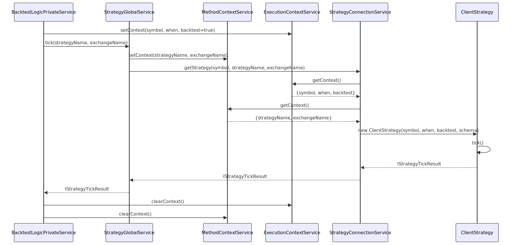

# Architecture

## Purpose and Scope

This document provides a comprehensive overview of backtest-kit's system architecture, focusing on its layered design, dependency injection infrastructure, and cross-cutting concerns. The architecture implements a modular service-oriented design where approximately 60 services are organized into 10 functional categories and wired together through constructor injection.

This page covers the high-level architectural patterns and structural organization. For detailed information about specific subsystems:
- Component registration patterns: see [Component Registration](./08_Component_Registration.md)
- Execution mode implementations: see [Execution Modes](./06_Execution_Modes.md)
- Service layer details: see [Service Layer](./38_Service_Layer.md)
- Event system implementation: see [Event System](./13_Event_System.md)

---

## Layered Architecture Overview

The system implements a seven-layer architecture where each layer has distinct responsibilities and clear boundaries. Layers communicate through well-defined interfaces and dependency injection, preventing tight coupling between implementation details.

### System Layers Diagram



**Layer 1: Public API** provides user-facing functions exported from [src/index.ts:1-184](). The `add.ts` functions register components ([src/function/add.ts:1-445]()), while `event.ts` functions subscribe to system events ([src/function/event.ts:1-892]()). Utility classes like `Backtest`, `Live`, and `Walker` provide high-level execution control.

**Layer 2: Command Services** implement validation and delegation for execution modes. They validate parameters, set up execution context, and delegate to Logic Services.

**Layer 3: Logic Services** come in two variants: Private services implement core execution logic with AsyncGenerator streaming, while Public services wrap Private services with external-facing contracts.

**Layer 4: Global Services** inject execution context (symbol, timestamp, backtest flag) into lower-layer services, enabling implicit parameter passing without polluting method signatures.

**Layer 5: Connection Services** manage lifecycle and memoization of Client class instances. They create instances on-demand and cache them by unique keys (symbol, strategyName, exchangeName combinations).

**Layer 6: Business Logic** contains the core trading logic implemented in Client classes like `ClientStrategy`, `ClientExchange`, `ClientRisk`. These classes are framework-agnostic and focus purely on trading domain logic.

**Layer 7: Schema & Validation** stores registered component configurations and validates them against framework rules. Schema Services provide name-based lookup, while Validation Services enforce 30+ validation rules per component type.


---

## Service Organization and Categories

Services are organized into 10 functional categories following a matrix pattern where most component types (Strategy, Exchange, Frame, Risk, Sizing) have corresponding Connection, Schema, Global, and Validation services.

### Service Category Matrix


### Service Category Responsibilities

| Category | Responsibility | Example Services |
|----------|---------------|------------------|
| **Base Services** | Cross-cutting infrastructure like logging | `LoggerService` |
| **Context Services** | Store execution context (symbol, timestamp, mode) for implicit parameter passing | `ExecutionContextService`, `MethodContextService` |
| **Connection Services** | Create and memoize Client class instances by unique keys | `StrategyConnectionService`, `ExchangeConnectionService` |
| **Schema Services** | Store and retrieve registered component configurations | `StrategySchemaService`, `ExchangeSchemaService` |
| **Global Services** | Inject context into Connection Services and orchestrate component interactions | `StrategyGlobalService`, `ExchangeGlobalService` |
| **Command Services** | Validate parameters and delegate to Logic Services for execution modes | `BacktestCommandService`, `LiveCommandService` |
| **Logic Services** | Implement core execution logic with Private/Public separation | `BacktestLogicPrivateService`, `LiveLogicPrivateService` |
| **Markdown Services** | Accumulate events and generate reports with statistical calculations | `BacktestMarkdownService`, `LiveMarkdownService` |
| **Validation Services** | Enforce 30+ validation rules per component type during registration | `StrategyValidationService`, `ExchangeValidationService` |
| **Template Services** | Generate code templates for AI-powered optimizer | `OptimizerTemplateService` |

The matrix pattern creates consistency across component types: if a new component type is added (e.g., `Filter`), it follows the same pattern with `FilterConnectionService`, `FilterSchemaService`, `FilterGlobalService`, and `FilterValidationService`.


---

## Dependency Injection System

The system implements a lightweight dependency injection container that wires approximately 60 services together at startup. The DI system uses three core primitives: `TYPES` symbol registry, `provide()` registration, and `inject()` retrieval.

### DI System Flow Diagram



### Service Registration Example

The registration flow in [src/lib/core/provide.ts:52-131]() follows a consistent pattern:

```typescript
// Base services
provide(TYPES.loggerService, () => new LoggerService());

// Context services
provide(TYPES.executionContextService, () => new ExecutionContextService());
provide(TYPES.methodContextService, () => new MethodContextService());

// Connection services (7 total)
provide(TYPES.strategyConnectionService, () => new StrategyConnectionService());
provide(TYPES.exchangeConnectionService, () => new ExchangeConnectionService());
// ... 5 more

// Schema services (7 total)
provide(TYPES.strategySchemaService, () => new StrategySchemaService());
provide(TYPES.exchangeSchemaService, () => new ExchangeSchemaService());
// ... 5 more
```

Each service's constructor declares its dependencies, which are automatically resolved by the DI container. For example, `StrategyConnectionService` receives `LoggerService`, `ExecutionContextService`, and `StrategySchemaService` through constructor injection.

### The Backtest Aggregation Object

All services are aggregated into a single `backtest` object in [src/lib/index.ts:212-224]() for discoverability:

```typescript
export const backtest = {
  ...baseServices,           // loggerService
  ...contextServices,        // executionContextService, methodContextService
  ...connectionServices,     // 7 Connection Services
  ...schemaServices,         // 7 Schema Services
  ...globalServices,         // 7 Global Services
  ...commandServices,        // 3 Command Services
  ...logicPrivateServices,   // 3 Logic Private Services
  ...logicPublicServices,    // 3 Logic Public Services
  ...markdownServices,       // 7 Markdown Services
  ...validationServices,     // 7 Validation Services
  ...templateServices,       // 1 Template Service
};
```

This flattened structure enables easy access: `backtest.strategyConnectionService.getStrategy(...)` instead of navigating nested categories. The object is exported as `lib` in [src/index.ts:183]() for external use.


---

## Context Propagation Architecture

The system uses two context services to propagate execution state through service layers without explicit parameter passing. This pattern reduces method signature pollution and enables consistent context access across the service graph.

### Context Services

**ExecutionContextService** ([src/lib/services/context/ExecutionContextService.ts]()) stores three execution-level parameters:

| Property | Type | Purpose |
|----------|------|---------|
| `symbol` | `string` | Trading symbol (e.g., "BTCUSDT") for current execution |
| `when` | `Date` | Current timestamp (backtest: historical, live: real-time) |
| `backtest` | `boolean` | Execution mode flag (true: backtest, false: live) |

**MethodContextService** ([src/lib/services/context/MethodContextService.ts]()) stores component-level parameters:

| Property | Type | Purpose |
|----------|------|---------|
| `strategyName` | `string` | Active strategy identifier |
| `exchangeName` | `string` | Active exchange identifier |
| `frameName` | `string` | Active frame identifier (backtest only) |

### Context Injection Flow



**Flow Description:**

1. **Context Initialization**: Logic Services set execution context before each operation
2. **Context Propagation**: Global Services read context and pass to Connection Services
3. **Instance Creation**: Connection Services inject context into Client class constructors
4. **Context Cleanup**: Logic Services clear context after operation completes

This pattern ensures that methods like `getStrategy(symbol, strategyName, exchangeName)` don't need to pass `when` and `backtest` parameters explicitly - they're available through context services.

### Context Scoping

Context follows a request-scoped lifecycle:

1. Set at operation start in Logic Services
2. Accessed during service chain execution
3. Cleared at operation end to prevent leakage

The system is single-threaded (Node.js event loop), so context state is safe without synchronization primitives.


---

## Event System Architecture

The event system implements a comprehensive publish-subscribe pattern with 16 distinct event channels. Events are emitted by Logic Services and Client classes during execution, enabling observability without coupling core logic to monitoring concerns.

### Event Emitter Registry

All event emitters are defined in [src/config/emitters.ts:1-122]() using the `Subject` pattern from `functools-kit`:


### Event Emitter Types and Purposes

| Emitter | Type | Purpose | Emitted By |
|---------|------|---------|------------|
| `signalEmitter` | Universal | All signal lifecycle events (idle, opened, active, closed, cancelled) | `ClientStrategy` |
| `signalLiveEmitter` | Live-only | Signal events during live trading | `LiveLogicPrivateService` |
| `signalBacktestEmitter` | Backtest-only | Signal events during backtesting | `BacktestLogicPrivateService` |
| `progressBacktestEmitter` | Progress | Frame processing progress (frames/total) | `BacktestLogicPrivateService` |
| `progressWalkerEmitter` | Progress | Strategy testing progress (strategies/total) | `WalkerLogicPrivateService` |
| `progressOptimizerEmitter` | Progress | Data source processing progress (sources/total) | `ClientOptimizer` |
| `doneLiveSubject` | Completion | Live execution finished | `LiveLogicPrivateService` |
| `doneBacktestSubject` | Completion | Backtest execution finished | `BacktestLogicPrivateService` |
| `doneWalkerSubject` | Completion | Walker execution finished | `WalkerLogicPrivateService` |
| `walkerCompleteSubject` | Completion | Walker results with best strategy | `WalkerLogicPrivateService` |
| `performanceEmitter` | Monitoring | Operation timing metrics for profiling | All Logic Services |
| `errorEmitter` | Monitoring | Recoverable errors (execution continues) | All Logic Services |
| `exitEmitter` | Monitoring | Fatal errors (execution terminates) | Background execution methods |
| `walkerEmitter` | Analysis | Current best strategy during walker | `WalkerLogicPrivateService` |
| `partialProfitSubject` | Analysis | Profit milestone reached (10%, 20%, 30%) | `ClientStrategy` |
| `partialLossSubject` | Analysis | Loss milestone reached (10%, 20%, 30%) | `ClientStrategy` |

### Listener API Pattern

Event consumers use listener functions from [src/function/event.ts:1-892]() that implement a consistent API pattern:



### Queued Callback Processing

All listener functions use the `queued()` wrapper from `functools-kit` ([src/function/event.ts:69]()) to ensure sequential processing of async callbacks:

```typescript
export function listenSignal(fn: (event: IStrategyTickResult) => void) {
  backtest.loggerService.log(LISTEN_SIGNAL_METHOD_NAME);
  return signalEmitter.subscribe(queued(async (event) => fn(event)));
}
```

The `queued()` wrapper guarantees:
1. Callbacks execute in order of event emission
2. Each callback completes before the next starts
3. Async callbacks are awaited properly
4. No concurrent execution of the same callback

This prevents race conditions when callbacks have side effects (e.g., writing to database, updating UI state).

### Event Emission Example

Logic Services emit events at key lifecycle points:

```typescript
// In BacktestLogicPrivateService
const result = await this.strategyGlobalService.tick(
  strategyName,
  exchangeName
);

// Emit to all three signal channels
signalEmitter.next(result);
signalBacktestEmitter.next(result);

if (result.action === "opened") {
  // Also emit to markdown service for report accumulation
  this.backtestMarkdownService.addSignal(result);
}
```


---

## Module Boundaries and Interactions

The system maintains clear module boundaries with well-defined interaction patterns. Modules communicate through interfaces and abstractions rather than concrete implementations.

### Primary Module Boundaries



### Interaction Patterns by Layer

**API Layer → Service Layer**:
- Validates user input through Validation Services
- Registers configurations through Schema Services
- Delegates execution through Command Services
- Never directly instantiates service classes (uses DI)

**Service Layer → Business Logic Layer**:
- Global Services orchestrate Connection Services
- Connection Services create and cache Client instances
- Services inject context and dependencies via constructors
- No direct instantiation - uses factory pattern

**Business Logic Layer → Infrastructure Layer**:
- Client classes emit events to Subject instances
- Client classes write state to Persistence Adapters
- Client classes read context from Context Services
- No infrastructure knowledge in business logic

**Cross-Layer Communication**:
- All layers use event emitters for loose coupling
- Context services provide implicit parameter passing
- DI container resolves all dependencies at startup
- No circular dependencies between modules


---

## Testing and Extensibility Patterns

The architecture supports testing and customization through strategic injection points.

### Persistence Adapter Customization

The system provides four persistence adapters that can be replaced with custom implementations ([test/config/setup.mjs:6-64]()):

```typescript
PersistSignalAdapter.usePersistSignalAdapter(class {
  async waitForInit() { /* Initialize connection */ }
  async readValue(id) { /* Read from Redis/MongoDB */ }
  async hasValue(id) { /* Check existence */ }
  async writeValue(id, value) { /* Atomic write */ }
});

PersistRiskAdapter.usePersistRiskAdapter(class { /* ... */ });
PersistScheduleAdapter.usePersistScheduleAdapter(class { /* ... */ });
PersistPartialAdapter.usePersistPartialAdapter(class { /* ... */ });
```

This enables testing with mock adapters (as shown in test setup) or production deployment with Redis/PostgreSQL backends without modifying core logic.

### Logger Customization

The `setLogger()` function ([src/function/setup.ts]()) replaces the default logger with custom implementations:

```typescript
setLogger({
  log: (message, ...args) => { /* Custom logging */ },
  info: (message, ...args) => { /* Custom info */ },
  warn: (message, ...args) => { /* Custom warnings */ },
  error: (message, ...args) => { /* Custom errors */ },
});
```

### Configuration Override

The `setConfig()` function ([test/config/setup.mjs:66-73]()) modifies validation parameters and execution settings:

```typescript
setConfig({
  CC_MIN_TAKEPROFIT_DISTANCE_PERCENT: 0.5,
  CC_MAX_STOPLOSS_DISTANCE_PERCENT: 15,
  CC_MAX_SIGNAL_LIFETIME_MINUTES: 1440,
  CC_GET_CANDLES_RETRY_COUNT: 3,
  CC_GET_CANDLES_RETRY_DELAY_MS: 1000,
});
```

These injection points enable customization without forking the codebase or modifying core services.

