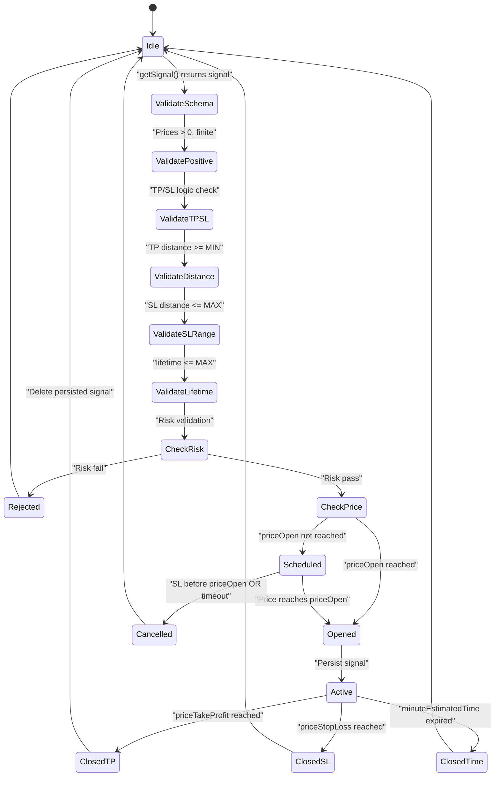
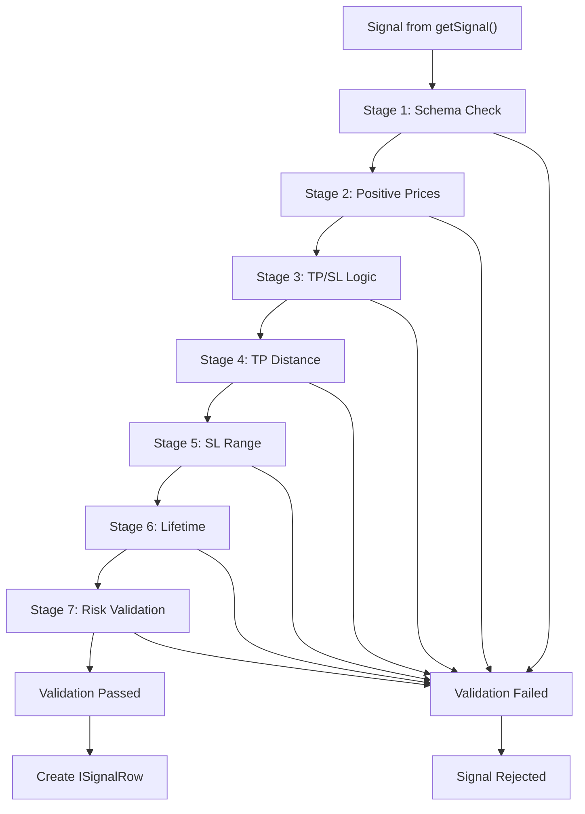
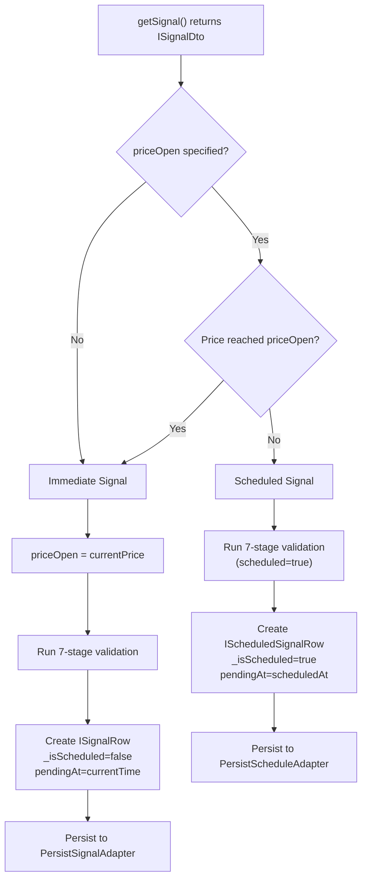
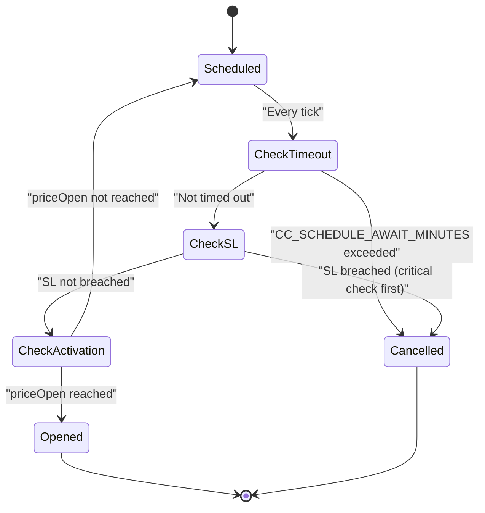
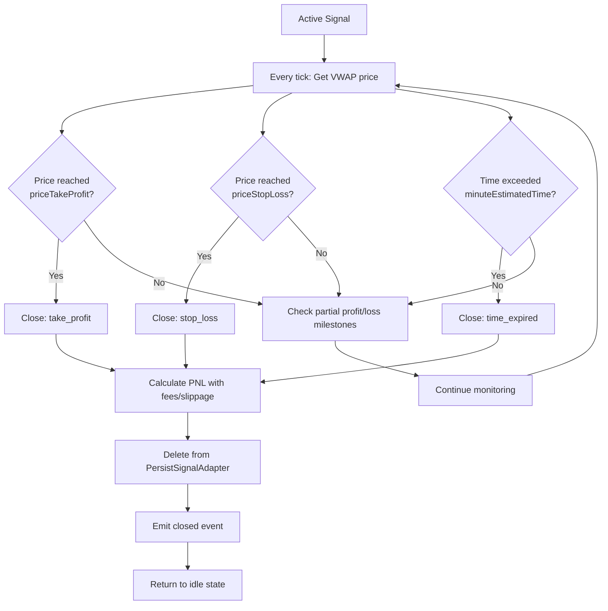
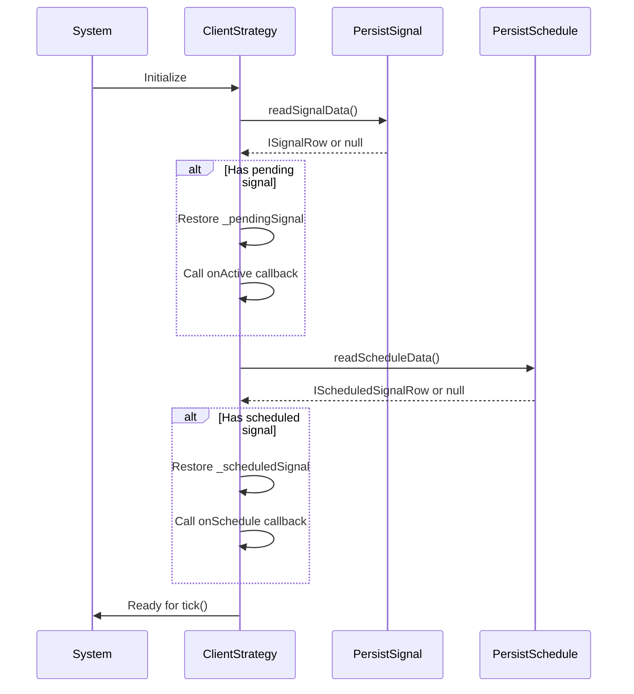

# Signals & Signal Lifecycle

## Purpose and Scope

This document explains the signal system in Backtest Kit: what signals are, how they progress through their lifecycle, validation rules, and persistence mechanisms. Signals are the fundamental unit of trading action in the framework, representing entry/exit positions with take profit (TP), stop loss (SL), and time-based expiration.

For information about how strategies generate signals, see [Strategies](./08_core-concepts.md). For execution context propagation, see [Execution Contexts](./08_core-concepts.md). For the time execution engine that processes signals, see [Time Execution Engine](./08_core-concepts.md).

---

## Core Signal Types

The framework defines three distinct signal types that represent different stages of signal maturity:

| Type | Interface | Description | When Created |
|------|-----------|-------------|--------------|
| **Signal DTO** | `ISignalDto` | User-provided signal from `getSignal()` | Strategy generates signal |
| **Signal Row** | `ISignalRow` | Validated signal with auto-generated ID | After validation passes |
| **Scheduled Signal** | `IScheduledSignalRow` | Signal waiting for price activation | When `priceOpen` not yet reached |

### ISignalDto Structure

```typescript
interface ISignalDto {
  id?: string;                    // Optional (auto-generated if omitted)
  position: "long" | "short";     // Trade direction
  note?: string;                  // Human-readable reason
  priceOpen?: number;             // Entry price (creates scheduled signal if specified)
  priceTakeProfit: number;        // Target exit price
  priceStopLoss: number;          // Risk exit price
  minuteEstimatedTime: number;    // Max lifetime before time_expired
}
```

**Sources:** [types.d.ts:649-665](), [src/interfaces/Strategy.interface.ts:24-39]()

### ISignalRow Structure

After validation, signals are augmented with runtime metadata:

```typescript
interface ISignalRow extends ISignalDto {
  id: string;                     // UUID v4 (required)
  priceOpen: number;              // Entry price (required)
  exchangeName: ExchangeName;     // Exchange identifier
  strategyName: StrategyName;     // Strategy identifier
  scheduledAt: number;            // Creation timestamp (milliseconds)
  pendingAt: number;              // Activation timestamp (milliseconds)
  symbol: string;                 // Trading pair (e.g., "BTCUSDT")
  _isScheduled: boolean;          // Internal flag for delayed entry
}
```

**Scheduled vs Opened Timing:**
- `scheduledAt`: Always set when signal is created
- `pendingAt`: Set to `scheduledAt` initially, updated to actual activation time when scheduled signal activates

**Sources:** [types.d.ts:670-687](), [src/interfaces/Strategy.interface.ts:45-62]()

---

## Signal Lifecycle State Machine

### State Overview



**Sources:** [types.d.ts:301-308](), [src/client/ClientStrategy.ts:45-476](), High-level Diagram 3

### State Descriptions

| State | Action | Signal Value | Persisted | Description |
|-------|--------|--------------|-----------|-------------|
| `idle` | `"idle"` | `null` | No | No active signal exists |
| `scheduled` | `"scheduled"` | `IScheduledSignalRow` | Yes (Schedule) | Waiting for `priceOpen` |
| `opened` | `"opened"` | `ISignalRow` | Yes (Signal) | Just activated |
| `active` | `"active"` | `ISignalRow` | Yes (Signal) | Monitoring TP/SL |
| `closed` | `"closed"` | `ISignalRow` | No | Completed with PNL |
| `cancelled` | `"cancelled"` | `IScheduledSignalRow` | No | Scheduled signal expired |

**Critical Constraint:** Only ONE active signal per symbol at any time. New signals wait until current signal closes.

**Sources:** [types.d.ts:768-883](), [src/client/ClientStrategy.ts:554-1500]()

---

## Validation Pipeline

### Seven-Stage Validation

All signals pass through comprehensive validation before activation:



**Sources:** [src/client/ClientStrategy.ts:45-330](), [src/config/params.ts:1-110]()

### Stage Details

#### Stage 1: Schema Validation

Checks all required fields exist and have correct types:
- `id`, `position`, `priceOpen`, `priceTakeProfit`, `priceStopLoss`
- `exchangeName`, `strategyName`, `symbol`, `scheduledAt`, `pendingAt`
- `minuteEstimatedTime`, `_isScheduled`

```typescript
// Example failure
if (signal.position !== "long" && signal.position !== "short") {
  throw new Error(`position must be "long" or "short", got "${signal.position}"`);
}
```

**Sources:** [src/client/ClientStrategy.ts:48-69]()

#### Stage 2: Positive Price Check

Ensures all prices are finite, positive numbers (prevents NaN/Infinity):

```typescript
if (!isFinite(currentPrice) || currentPrice <= 0) {
  errors.push(`currentPrice must be positive, got ${currentPrice}`);
}
```

**Sources:** [src/client/ClientStrategy.ts:72-109]()

#### Stage 3: TP/SL Logic Validation

Validates take profit and stop loss relative to position direction:

**LONG Position:**
- `priceTakeProfit > priceOpen > priceStopLoss`
- Current price must be between SL and TP (prevents immediate closure)

**SHORT Position:**
- `priceStopLoss > priceOpen > priceTakeProfit`
- Current price must be between TP and SL (prevents immediate closure)

```typescript
// LONG validation
if (signal.position === "long") {
  if (signal.priceTakeProfit <= signal.priceOpen) {
    errors.push(`Long: priceTakeProfit (${signal.priceTakeProfit}) must be > priceOpen (${signal.priceOpen})`);
  }
  if (currentPrice <= signal.priceStopLoss) {
    errors.push(`Long immediate: currentPrice (${currentPrice}) <= priceStopLoss. Signal would be immediately closed.`);
  }
}
```

**Sources:** [src/client/ClientStrategy.ts:111-250]()

#### Stage 4: Minimum TP Distance

Enforces `CC_MIN_TAKEPROFIT_DISTANCE_PERCENT` (default 0.5%) to ensure profits cover fees and slippage:

**Cost Breakdown:**
- Entry slippage: 0.1%
- Entry fee: 0.1%
- Exit slippage: 0.1%
- Exit fee: 0.1%
- **Total costs: 0.4%**
- Minimum buffer: 0.1%
- **Required TP distance: 0.5%**

```typescript
const tpDistancePercent = ((signal.priceTakeProfit - signal.priceOpen) / signal.priceOpen) * 100;
if (tpDistancePercent < GLOBAL_CONFIG.CC_MIN_TAKEPROFIT_DISTANCE_PERCENT) {
  errors.push(`Long: TakeProfit too close (${tpDistancePercent.toFixed(3)}%). Minimum: ${GLOBAL_CONFIG.CC_MIN_TAKEPROFIT_DISTANCE_PERCENT}%`);
}
```

**Sources:** [src/client/ClientStrategy.ts:163-173](), [src/config/params.ts:27-36]()

#### Stage 5: SL Range Validation

Enforces both minimum and maximum SL distances:

**Minimum SL Distance** (`CC_MIN_STOPLOSS_DISTANCE_PERCENT`, default 0.5%):
- Prevents instant stop-out from normal market volatility

**Maximum SL Distance** (`CC_MAX_STOPLOSS_DISTANCE_PERCENT`, default 20%):
- Prevents catastrophic losses from extreme SL values

```typescript
const slDistancePercent = ((signal.priceOpen - signal.priceStopLoss) / signal.priceOpen) * 100;
if (slDistancePercent < GLOBAL_CONFIG.CC_MIN_STOPLOSS_DISTANCE_PERCENT) {
  errors.push(`Long: StopLoss too close (${slDistancePercent.toFixed(3)}%)`);
}
if (slDistancePercent > GLOBAL_CONFIG.CC_MAX_STOPLOSS_DISTANCE_PERCENT) {
  errors.push(`Long: StopLoss too far (${slDistancePercent.toFixed(3)}%)`);
}
```

**Sources:** [src/client/ClientStrategy.ts:176-199](), [src/config/params.ts:38-49]()

#### Stage 6: Lifetime Limit

Enforces `CC_MAX_SIGNAL_LIFETIME_MINUTES` (default 1440 minutes = 1 day):

Prevents "eternal signals" that block risk limits indefinitely:

```typescript
if (signal.minuteEstimatedTime > GLOBAL_CONFIG.CC_MAX_SIGNAL_LIFETIME_MINUTES) {
  const days = (signal.minuteEstimatedTime / 60 / 24).toFixed(1);
  const maxDays = (GLOBAL_CONFIG.CC_MAX_SIGNAL_LIFETIME_MINUTES / 60 / 24).toFixed(0);
  errors.push(`minuteEstimatedTime too large (${signal.minuteEstimatedTime} minutes = ${days} days). Maximum: ${maxDays} days`);
}
```

**Sources:** [src/client/ClientStrategy.ts:306-315](), [src/config/params.ts:51-55]()

#### Stage 7: Risk Validation

Calls `IRisk.checkSignal()` with portfolio context:

```typescript
const riskPassed = await self.params.risk.checkSignal({
  pendingSignal: signal,
  symbol: self.params.execution.context.symbol,
  strategyName: self.params.method.context.strategyName,
  exchangeName: self.params.method.context.exchangeName,
  currentPrice,
  timestamp: currentTime,
});
if (!riskPassed) {
  return null; // Signal rejected
}
```

**Sources:** [src/client/ClientStrategy.ts:374-386](), [types.d.ts:339-397]()

---

## State Transitions in Detail

### Immediate vs Scheduled Signals

When `getSignal()` returns a signal, the framework determines activation path:



**LONG Position Activation Logic:**
```typescript
// LONG = buy lower, wait for price to drop TO priceOpen
if (signal.position === "long" && currentPrice <= signal.priceOpen) {
  shouldActivateImmediately = true;
}
```

**SHORT Position Activation Logic:**
```typescript
// SHORT = sell higher, wait for price to rise TO priceOpen
if (signal.position === "short" && currentPrice >= signal.priceOpen) {
  shouldActivateImmediately = true;
}
```

**Sources:** [src/client/ClientStrategy.ts:389-461](), [src/lib/services/connection/StrategyConnectionService.ts:120-151]()

### Scheduled Signal Monitoring

Scheduled signals are monitored every tick for three conditions:



**Critical Order:** SL check BEFORE activation check prevents "open-and-immediately-stop" scenarios.

**LONG Scheduled Monitoring:**
```typescript
// Priority 1: Check StopLoss (CANCELLATION)
if (currentPrice <= scheduled.priceStopLoss) {
  shouldCancel = true;
}
// Priority 2: Check Activation (only if SL not breached)
else if (currentPrice <= scheduled.priceOpen) {
  shouldActivate = true;
}
```

**SHORT Scheduled Monitoring:**
```typescript
// Priority 1: Check StopLoss (CANCELLATION)
if (currentPrice >= scheduled.priceStopLoss) {
  shouldCancel = true;
}
// Priority 2: Check Activation (only if SL not breached)
else if (currentPrice >= scheduled.priceOpen) {
  shouldActivate = true;
}
```

**Sources:** [src/client/ClientStrategy.ts:610-644](), [src/client/ClientStrategy.ts:554-608]()

### Active Signal Monitoring

Once opened, signals are monitored for three exit conditions:



**Partial Profit/Loss Tracking:**

During active monitoring, the framework tracks milestones:
- Profit: 10%, 20%, 30%, ..., 100%
- Loss: -10%, -20%, -30%, ..., -100%

Each level emitted once per signal via `ClientPartial` deduplication.

**Sources:** [src/client/ClientStrategy.ts:813-1130](), [types.d.ts:548-638]()

---

## Persistence & Crash Recovery

### Persistence Strategy

The framework uses two separate persistence adapters:

| Adapter | Stores | When | Purpose |
|---------|--------|------|---------|
| `PersistScheduleAdapter` | `IScheduledSignalRow` | Scheduled signals | Restore pending limit orders |
| `PersistSignalAdapter` | `ISignalRow` | Opened/active signals | Restore active positions |

**Critical:** Scheduled signals NOT persisted to `PersistSignalAdapter` until activation.

**Sources:** [src/classes/Persist.ts](), [src/client/ClientStrategy.ts:491-552]()

### Crash Recovery Flow



**Implementation:**

The `waitForInit()` method (called before first tick) restores state:

```typescript
async waitForInit() {
  if (backtest) return; // Only for live mode
  
  // Restore pending signal
  const pendingSignal = await PersistSignalAdapter.readSignalData(symbol, strategyName);
  if (pendingSignal) {
    this._pendingSignal = pendingSignal;
    if (callbacks?.onActive) {
      const currentPrice = await exchange.getAveragePrice(symbol);
      callbacks.onActive(symbol, pendingSignal, currentPrice, false);
    }
  }
  
  // Restore scheduled signal
  const scheduledSignal = await PersistScheduleAdapter.readScheduleData(symbol, strategyName);
  if (scheduledSignal) {
    this._scheduledSignal = scheduledSignal;
    if (callbacks?.onSchedule) {
      const currentPrice = await exchange.getAveragePrice(symbol);
      callbacks.onSchedule(symbol, scheduledSignal, currentPrice, false);
    }
  }
}
```

**Atomic Write Operations:**

All persistence operations are atomic (write-delete patterns):

1. **Signal Opens:** Write to `PersistSignalAdapter`
2. **Signal Closes:** Delete from `PersistSignalAdapter`
3. **Scheduled Created:** Write to `PersistScheduleAdapter`
4. **Scheduled Activates:** Delete from `PersistScheduleAdapter` → Write to `PersistSignalAdapter`
5. **Scheduled Cancels:** Delete from `PersistScheduleAdapter`

**Sources:** [src/client/ClientStrategy.ts:491-552](), [src/classes/Persist.ts]()

---

## Practical Examples

### Example 1: Immediate LONG Signal

```typescript
// User's getSignal() returns:
{
  position: "long",
  priceTakeProfit: 51000,  // 2% profit target
  priceStopLoss: 49000,    // 2% risk
  minuteEstimatedTime: 120 // 2 hours max
  // priceOpen omitted → immediate entry
}

// System behavior:
// 1. Current price: 50000 (VWAP)
// 2. Set priceOpen = 50000
// 3. Validate:
//    - TP distance: (51000-50000)/50000 = 2% ✓ (>0.5% minimum)
//    - SL distance: (50000-49000)/50000 = 2% ✓ (between 0.5%-20%)
// 4. Create ISignalRow with _isScheduled=false
// 5. Persist to PersistSignalAdapter
// 6. Emit "opened" event
// 7. Monitor for TP/SL/time_expired
```

**Sources:** [src/client/ClientStrategy.ts:445-461](), [test/e2e/sequence.test.mjs:29-150]()

### Example 2: Scheduled SHORT Signal

```typescript
// User's getSignal() returns:
{
  position: "short",
  priceOpen: 51000,        // Wait for price to rise to 51000
  priceTakeProfit: 49000,  // Exit at 49000 (profit)
  priceStopLoss: 52000,    // Exit at 52000 (loss)
  minuteEstimatedTime: 60
}

// Current price: 50000 (below priceOpen)

// System behavior:
// 1. Price 50000 < priceOpen 51000 → Create scheduled signal
// 2. Validate with scheduled=true
// 3. Create IScheduledSignalRow with _isScheduled=true
// 4. Persist to PersistScheduleAdapter
// 5. Emit "scheduled" event
// 6. Monitor every tick:
//    - If price >= 52000 (SL) → Cancel
//    - If price >= 51000 (priceOpen) → Activate
// 7. On activation:
//    - Delete from PersistScheduleAdapter
//    - Create ISignalRow
//    - Persist to PersistSignalAdapter
//    - Emit "opened" event
```

**Sources:** [src/client/ClientStrategy.ts:389-442](), [test/e2e/scheduled.test.mjs]()

### Example 3: Scheduled Signal Cancellation

```typescript
// Scheduled LONG signal:
{
  position: "long",
  priceOpen: 49000,        // Wait for price drop
  priceTakeProfit: 51000,
  priceStopLoss: 48000,    // Cancel if price drops too far
  minuteEstimatedTime: 30
}

// Current price: 50000 (above priceOpen)

// Cancellation scenarios:

// Scenario A: Price drops PAST stop loss
// Tick 1: price=50000 → scheduled (waiting)
// Tick 2: price=49500 → scheduled (waiting)
// Tick 3: price=47500 → CANCELLED (SL=48000 breached before priceOpen reached)

// Scenario B: Timeout
// Price stays above 49000 for 120 minutes (CC_SCHEDULE_AWAIT_MINUTES)
// → CANCELLED (exceeded wait time)
```

**Sources:** [src/client/ClientStrategy.ts:554-608](), [test/e2e/edge.test.mjs:24-100]()

### Example 4: Validation Failure - Micro-Profit

```typescript
// User returns signal with tiny profit margin:
{
  position: "long",
  priceOpen: 42000,
  priceTakeProfit: 42010,  // Only 0.024% profit!
  priceStopLoss: 41000,
  minuteEstimatedTime: 60
}

// Validation fails at Stage 4:
// TP distance: (42010-42000)/42000 = 0.024%
// Minimum required: 0.5% (to cover 0.4% fees/slippage + 0.1% buffer)
// Error: "Long: TakeProfit too close to priceOpen (0.024%). Minimum distance: 0.5%"
// Signal rejected, no position opened
```

**Sources:** [src/client/ClientStrategy.ts:163-173](), [test/e2e/sanitize.test.mjs:27-150]()

---

## Signal Sequencing Constraint

**Critical Design Principle:** Only ONE active signal per symbol at any time.

### Queue Behavior

```mermaid
graph TB
    subgraph "Time T1"
        S1_Gen["Signal #1 generated"]
        S1_Gen --> S1_Open["Signal #1 opens"]
    end
    
    subgraph "Time T2 (while Signal #1 active)"
        S2_Gen["getSignal() called"]
        S2_Gen --> S2_Block["Signal #2 NOT processed"]
        S2_Block --> S2_Wait["Waits for Signal #1 to close"]
    end
    
    subgraph "Time T3"
        S1_Close["Signal #1 closes (TP/SL/time)"]
        S1_Close --> S1_Idle["Returns to idle state"]
    end
    
    subgraph "Time T4"
        S2_Gen2["getSignal() called again"]
        S2_Gen2 --> S2_Process["Signal #2 now processed"]
    end
```



**Rationale:**
- Prevents position size explosions
- Maintains predictable risk exposure
- Simplifies state management
- Enables reliable crash recovery

**Implementation:** The `tick()` method checks for active signal before calling `getSignal()`:

```typescript
async tick() {
  // Check for existing active signal
  if (this._pendingSignal) {
    return monitorActiveSignal();
  }
  if (this._scheduledSignal) {
    return monitorScheduledSignal();
  }
  
  // Only call getSignal() when idle
  const newSignal = await GET_SIGNAL_FN(this);
  if (!newSignal) {
    return idleResult();
  }
  
  return processNewSignal(newSignal);
}
```

**Sources:** [src/client/ClientStrategy.ts:813-1130](), [test/README.md:19-23]()