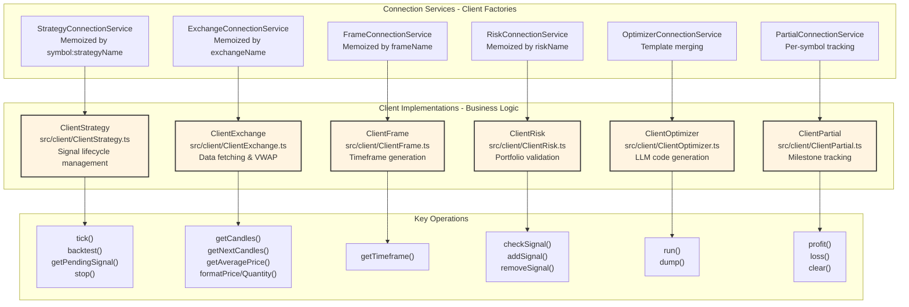
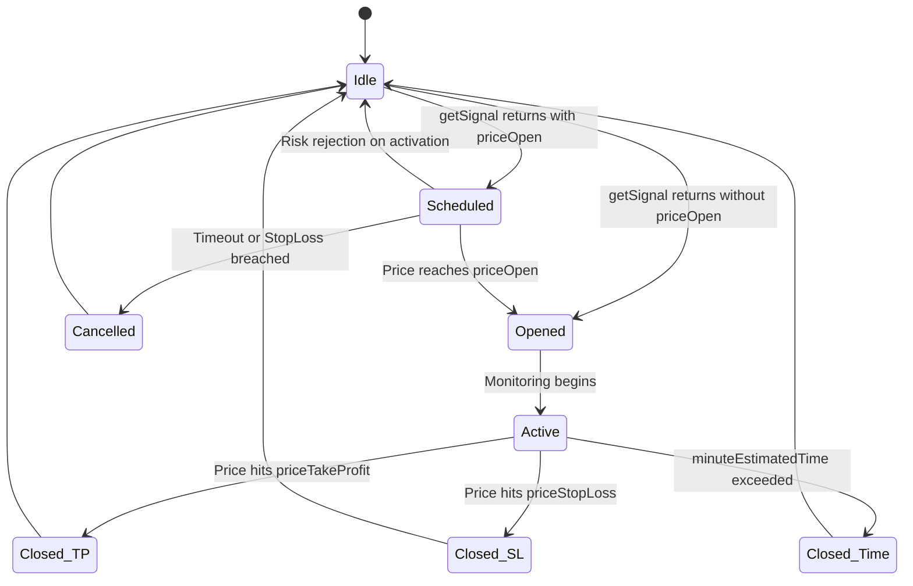
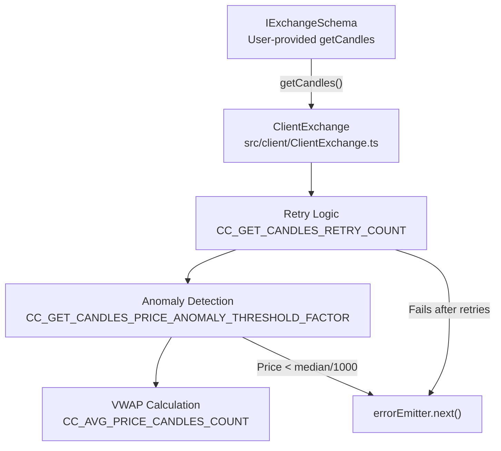
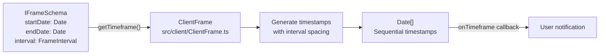
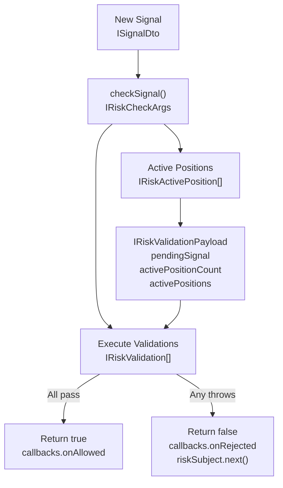
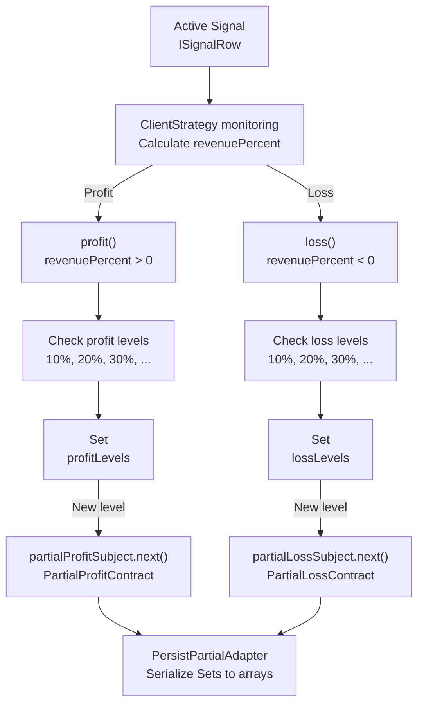
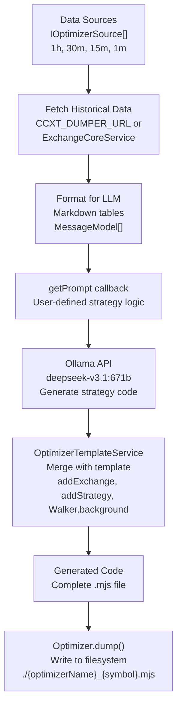
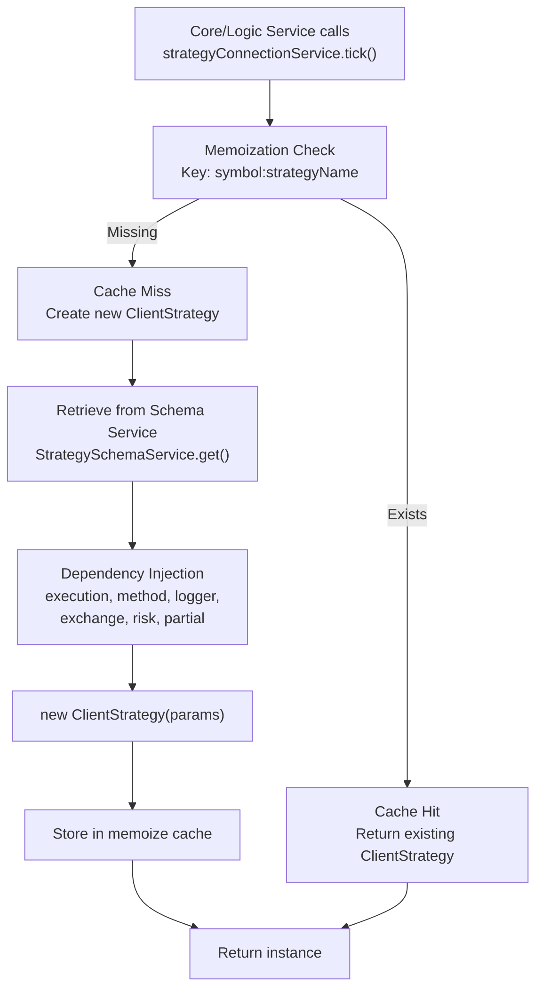

# Client Layer

## Purpose and Scope

The Client Layer contains the six core business logic implementations that execute domain operations. These clients are instantiated and managed by ConnectionServices in the Service Layer (see [Service Categories](./09-service-categories.md)) and consume configuration from Schema services. Each client encapsulates a specific domain responsibility: strategy execution, exchange data access, timeframe generation, risk validation, optimizer orchestration, and partial profit/loss tracking.

For information about how these clients are orchestrated in different execution modes, see [Execution Modes Overview](./04-execution-modes-overview.md). For details on the service architecture that manages client instantiation, see [Dependency Injection System](./08-dependency-injection-system.md).

---

## Architecture Overview

The Client Layer implements the business logic for six distinct domains. Each client is instantiated by its corresponding ConnectionService, which applies memoization for performance optimization. Clients receive dependencies through constructor injection and access execution context via scoped services.

### Client Layer Structure



### Memoization Pattern

All ConnectionServices use `memoize` from `functools-kit` to cache client instances. The cache keys are constructed from schema names (e.g., `symbol:strategyName` for ClientStrategy, `exchangeName` for ClientExchange). This pattern optimizes resource usage by ensuring only one client instance exists per unique configuration.

| ConnectionService | Cache Key Pattern | Instantiated Class |
|-------------------|-------------------|-------------------|
| StrategyConnectionService | `${symbol}:${strategyName}` | ClientStrategy |
| ExchangeConnectionService | `${exchangeName}` | ClientExchange |
| FrameConnectionService | `${frameName}` | ClientFrame |
| RiskConnectionService | `${riskName}` | ClientRisk |
| OptimizerConnectionService | `${optimizerName}` | ClientOptimizer |
| PartialConnectionService | `${symbol}` | ClientPartial |

---

## ClientStrategy

ClientStrategy implements the `IStrategy` interface and manages the complete signal lifecycle from generation through monitoring to closure. It handles both immediate and scheduled signals, integrates with risk management, and supports both live trading (via `tick()`) and fast backtesting (via `backtest()`).

### Signal Lifecycle State Machine



### Key Methods

#### tick()

Executes a single strategy iteration with VWAP monitoring. This method:

1. Checks for scheduled signal timeout ([src/client/ClientStrategy.ts:554-608]())
2. Checks for scheduled signal activation ([src/client/ClientStrategy.ts:610-644]())
3. Monitors active signal TP/SL/time expiration
4. Calls `getSignal()` with interval throttling ([src/client/ClientStrategy.ts:332-476]())
5. Validates signals via `VALIDATE_SIGNAL_FN` ([src/client/ClientStrategy.ts:45-330]())
6. Persists state changes via `PersistSignalAdapter` and `PersistScheduleAdapter`

Returns discriminated union `IStrategyTickResult` with action: `"idle" | "scheduled" | "opened" | "active" | "closed" | "cancelled"`.

#### backtest()

Performs fast historical simulation by iterating through candle data. For each candle:

1. Calculates VWAP using `GET_AVG_PRICE_FN` ([src/client/ClientStrategy.ts:478-489]())
2. For scheduled signals: checks activation/cancellation conditions
3. For active signals: checks if TP/SL/time conditions met
4. Returns immediately upon closure (optimization: skips remaining candles)

Returns `IStrategyBacktestResult` (always `"closed"` or `"cancelled"`), never `"idle"` or `"active"`.

### Scheduled Signal Handling

ClientStrategy supports delayed entry signals where `priceOpen` is specified in `ISignalDto`. The signal enters `"scheduled"` state and waits for price to reach entry point:

- **Long positions**: Activates when `currentPrice <= priceOpen`
- **Short positions**: Activates when `currentPrice >= priceOpen`
- **Cancellation**: Occurs if price breaches `priceStopLoss` before activation or timeout exceeds `CC_SCHEDULE_AWAIT_MINUTES`

Timeout logic is implemented in `CHECK_SCHEDULED_SIGNAL_TIMEOUT_FN` ([src/client/ClientStrategy.ts:554-608]()), activation logic in `CHECK_SCHEDULED_SIGNAL_PRICE_ACTIVATION_FN` ([src/client/ClientStrategy.ts:610-644]()).

### Signal Validation

All signals pass through `VALIDATE_SIGNAL_FN` which enforces:

- Price sanity checks (finite, positive values)
- Long position rules: `priceStopLoss < priceOpen < priceTakeProfit`
- Short position rules: `priceTakeProfit < priceOpen < priceStopLoss`
- Minimum TP distance: `>= CC_MIN_TAKEPROFIT_DISTANCE_PERCENT` ([src/client/ClientStrategy.ts:163-173]())
- Minimum SL distance: `>= CC_MIN_STOPLOSS_DISTANCE_PERCENT` ([src/client/ClientStrategy.ts:176-186]())
- Maximum SL distance: `<= CC_MAX_STOPLOSS_DISTANCE_PERCENT` ([src/client/ClientStrategy.ts:189-199]())
- Maximum lifetime: `<= CC_MAX_SIGNAL_LIFETIME_MINUTES` ([src/client/ClientStrategy.ts:306-316]())
- Immediate closure prevention: validates `currentPrice` is between SL and TP bounds

### Integration Points

ClientStrategy receives dependencies via `IStrategyParams`:

| Dependency | Type | Purpose |
|------------|------|---------|
| `exchange` | `IExchange` | VWAP calculation, candle fetching |
| `risk` | `IRisk` | Signal validation via `checkSignal()` |
| `partial` | `IPartial` | Milestone tracking for profit/loss levels |
| `execution` | `TExecutionContextService` | Symbol, when (timestamp), backtest flag |
| `method` | `TMethodContextService` | strategyName, exchangeName, frameName |

Risk integration occurs at two points:
1. Before signal creation in `GET_SIGNAL_FN` ([src/client/ClientStrategy.ts:374-387]())
2. Before scheduled signal activation in `ACTIVATE_SCHEDULED_SIGNAL_FN` ([src/client/ClientStrategy.ts:711-729]())

---

## ClientExchange

ClientExchange implements the `IExchange` interface and provides market data access with retry logic, anomaly detection, and VWAP calculation. It wraps the user-provided `getCandles` implementation from `IExchangeSchema` with production-grade error handling.

### Data Flow



### Key Methods

#### getCandles()

Fetches historical candles **backwards** from execution context time (`execution.context.when`). Implements:

- Retry logic with exponential backoff (`CC_GET_CANDLES_RETRY_COUNT`, `CC_GET_CANDLES_RETRY_DELAY_MS`)
- Price anomaly detection to filter incomplete candles ([types.d.ts:84-91]())
- Median-based validation: rejects candles where `price < median / CC_GET_CANDLES_PRICE_ANOMALY_THRESHOLD_FACTOR`
- Callback invocation: `callbacks.onCandleData` if provided

#### getNextCandles()

Fetches future candles **forward** from execution context time (backtest mode only). Used by `ClientStrategy.backtest()` to simulate forward-looking price action. Same retry/anomaly logic as `getCandles()`.

#### getAveragePrice()

Calculates VWAP from last `CC_AVG_PRICE_CANDLES_COUNT` candles (default: 5) using 1-minute interval:

```
Typical Price = (High + Low + Close) / 3
VWAP = Σ(Typical Price × Volume) / Σ(Volume)
```

Falls back to simple average if total volume is zero.

#### formatPrice() and formatQuantity()

Delegate to user-provided formatting functions in `IExchangeSchema`. These enforce exchange-specific precision rules (e.g., Binance requires 8 decimal places for BTC prices).

### Anomaly Detection Rationale

The anomaly detection system addresses a known issue with incomplete candles from exchange APIs. When the API returns incomplete data, prices can be near zero (e.g., `$0.01` for BTC instead of `$50,000`). The threshold factor of 1000 catches these anomalies:

- BTC at `$50,000` median → threshold `$50` → rejects `$0.01` candles
- Factor 1000 is chosen as a balance: strict enough to catch incomplete data, permissive enough for normal volatility

---

## ClientFrame

ClientFrame implements the `IFrame` interface and generates arrays of timestamps for backtest iteration. It converts date ranges and intervals from `IFrameSchema` into concrete `Date[]` arrays.

### Timeframe Generation



### Interval Mapping

ClientFrame converts `FrameInterval` strings into millisecond offsets:

| FrameInterval | Milliseconds | Example Usage |
|---------------|--------------|---------------|
| `"1m"` | 60,000 | High-frequency scalping backtests |
| `"5m"` | 300,000 | Short-term swing strategies |
| `"15m"` | 900,000 | Intraday trend following |
| `"1h"` | 3,600,000 | Multi-hour position strategies |
| `"4h"` | 14,400,000 | Daily swing trading |
| `"1d"` | 86,400,000 | Long-term position strategies |

### Callbacks

If `IFrameSchema.callbacks.onTimeframe` is provided, ClientFrame invokes it after generating the timeframe array. This allows inspection of generated timestamps for validation or logging purposes.

---

## ClientRisk

ClientRisk implements the `IRisk` interface and enforces portfolio-level risk controls via custom validation functions. It maintains in-memory tracking of active positions across all strategies and validates new signals against user-defined rules.

### Risk Validation Flow



### Validation System

Risk validations are defined as an array in `IRiskSchema.validations`. Each validation can be:

1. Function directly: `(payload: IRiskValidationPayload) => void`
2. Object with function + note: `{ validate: Function, note: string }`

The `note` field is included in rejection events emitted to `riskSubject`, allowing identification of which rule failed.

### Position Tracking

ClientRisk maintains three parallel data structures:

| Method | Purpose | Timing |
|--------|---------|--------|
| `checkSignal()` | Pre-creation validation | Before signal opens |
| `addSignal()` | Register opened position | After signal opens |
| `removeSignal()` | Unregister closed position | After signal closes |

The active position count and list are passed to validation functions via `IRiskValidationPayload`, enabling rules like "max 3 concurrent positions" or "no more than 1 position per symbol".

### Integration with Persistence

In live mode, ClientRisk state is persisted via `PersistRiskAdapter` for crash recovery. The `_states` Map is serialized to JSON and restored on initialization via `waitForInit()`.

---

## ClientPartial

ClientPartial implements the `IPartial` interface and tracks profit/loss milestones (10%, 20%, 30%, ..., 100%) for active signals. It uses Set-based deduplication to ensure each level is emitted exactly once per signal.

### Milestone Tracking Architecture



### Deduplication Logic

ClientPartial maintains per-signal state:

```typescript
interface IPartialState {
  profitLevels: Set<PartialLevel>; // 10, 20, 30, ..., 100
  lossLevels: Set<PartialLevel>;   // 10, 20, 30, ..., 100
}
```

When `profit()` is called with `revenuePercent = 22.5`:
1. Calculates which levels are reached: 10, 20
2. Checks `profitLevels` Set: 10 already exists, 20 is new
3. Emits event only for 20%
4. Adds 20 to `profitLevels` Set

This ensures each milestone is reported exactly once even if price oscillates around threshold.

### Persistence

For live mode crash recovery, ClientPartial serializes state via `PersistPartialAdapter`:

- In-memory: `Map<signalId, IPartialState>` (Sets)
- On disk: `Record<signalId, IPartialData>` (arrays)

Conversion happens in `waitForInit()` (deserialize) and on each emit (serialize).

### Clear Operation

When a signal closes, `clear()` removes the signal's state from memory and disk. This prevents unbounded growth of the state map and ensures milestone tracking is reset for future signals.

---

## ClientOptimizer

ClientOptimizer implements the `IOptimizer` interface and orchestrates LLM-based strategy code generation. It fetches multi-timeframe historical data, formats it for LLM consumption, sends prompts to Ollama API, and generates executable `.mjs` files.

### Optimization Pipeline



### Data Source Iteration

ClientOptimizer iterates through `IOptimizerSource[]` defined in `IOptimizerSchema.sources`. Each source specifies:

| Field | Type | Purpose |
|-------|------|---------|
| `interval` | `CandleInterval` | Candle timeframe (e.g., "1h", "15m") |
| `range` | `IOptimizerRange` | Date range for data fetching |
| `filter` | `(args: IOptimizerFilterArgs) => boolean` | Post-fetch filtering predicate |

For each source, optimizer fetches candles and formats them as markdown tables for LLM context window.

### LLM Prompt Construction

The user provides `getPrompt` callback which receives formatted data and returns `MessageModel[]`. This allows complete control over LLM instruction:

```typescript
getPrompt: (data: IOptimizerData[]) => Promise<MessageModel[]>
```

`IOptimizerData` contains:
- `interval`: Source timeframe
- `candles`: Formatted markdown table
- `range`: Date range metadata

### Template System

ClientOptimizer uses `OptimizerTemplateService` to merge LLM-generated strategy code with boilerplate:

1. Default template includes `addExchange`, `addStrategy`, `Walker.background` calls
2. User can override via `IOptimizerSchema.template.code`
3. Template receives strategy code as `{{strategy}}` placeholder
4. Result is executable Node.js module

### Code Export

Generated code is returned as string from `run()` method. To write to disk:

```typescript
const code = await Optimizer.run("BTCUSDT", { optimizerName: "my-optimizer" });
await Optimizer.dump("my-optimizer", "BTCUSDT", code);
// Writes to ./my-optimizer_BTCUSDT.mjs
```

---

## Instantiation and Lifecycle

All client instances are created and managed by their respective ConnectionServices, which implement consistent patterns for instantiation, dependency injection, and lifecycle management.

### Factory Pattern

ConnectionServices act as factories with memoization:



### Dependency Injection Pattern

All clients receive dependencies via constructor parameters. Example from ClientStrategy:

```typescript
new ClientStrategy({
  symbol: string,
  interval: SignalInterval,
  execution: TExecutionContextService,    // Scoped: symbol, when, backtest
  method: TMethodContextService,          // Scoped: strategyName, exchangeName, frameName
  logger: ILogger,                        // Global: LoggerService
  partial: IPartial,                      // Memoized: PartialConnectionService
  exchange: IExchange,                    // Memoized: ExchangeConnectionService
  risk: IRisk,                            // Memoized: RiskConnectionService or NOOP_RISK
  riskName: RiskName,
  strategyName: StrategyName,
  getSignal: Function,                    // From StrategySchemaService
  callbacks: IStrategyCallbacks           // From StrategySchemaService
})
```

This pattern ensures:
- Clients are decoupled from service locator
- Dependencies are explicit and type-safe
- Easy to mock for testing

### Initialization: waitForInit()

Clients that require crash recovery implement `waitForInit()` method:

| Client | Persistence Adapter | Recovery Action |
|--------|---------------------|-----------------|
| ClientStrategy | PersistSignalAdapter, PersistScheduleAdapter | Restore pending/scheduled signals |
| ClientRisk | PersistRiskAdapter | Restore active position tracking |
| ClientPartial | PersistPartialAdapter | Restore profit/loss milestone state |

In live mode, ConnectionServices call `await strategy.waitForInit()` before first operation. In backtest mode, `waitForInit()` returns immediately (no persistence).

### Cache Management

ConnectionServices provide `clear()` method to invalidate memoization cache:

```typescript
// Clear specific instance
await strategyConnectionService.clear({ 
  symbol: "BTCUSDT", 
  strategyName: "my-strategy" 
});

// Clear all instances
await strategyConnectionService.clear();
```

This is useful for:
- Releasing resources after execution completes
- Resetting state between test runs
- Force-reloading strategy after schema changes

### Risk Composition

StrategyConnectionService implements special logic for risk composition. If `IStrategySchema` defines both `riskName` and `riskList`, they are merged:

```typescript
const GET_RISK_FN = (dto, self) => {
  if (!dto.riskName && !dto.riskList?.length) {
    return NOOP_RISK;
  }
  if (dto.riskName && dto.riskList?.length) {
    return new MergeRisk([
      self.riskConnectionService.getRisk(dto.riskName),
      ...dto.riskList.map(name => self.riskConnectionService.getRisk(name))
    ]);
  }
  // ... single risk cases
};
```

`MergeRisk` class combines multiple risk profiles by executing all validations sequentially.

---

## Summary Table

| Client | Interface | File Path | Primary Methods | Memoization Key |
|--------|-----------|-----------|-----------------|-----------------|
| ClientStrategy | `IStrategy` | [src/client/ClientStrategy.ts:1-1000]() | `tick()`, `backtest()`, `getPendingSignal()`, `stop()` | `${symbol}:${strategyName}` |
| ClientExchange | `IExchange` | [src/client/ClientExchange.ts:1-300]() | `getCandles()`, `getNextCandles()`, `getAveragePrice()`, `formatPrice()`, `formatQuantity()` | `${exchangeName}` |
| ClientFrame | `IFrame` | [src/client/ClientFrame.ts:1-200]() | `getTimeframe()` | `${frameName}` |
| ClientRisk | `IRisk` | [src/client/ClientRisk.ts:1-300]() | `checkSignal()`, `addSignal()`, `removeSignal()` | `${riskName}` |
| ClientPartial | `IPartial` | [src/client/ClientPartial.ts:1-300]() | `profit()`, `loss()`, `clear()` | `${symbol}` |
| ClientOptimizer | `IOptimizer` | [src/client/ClientOptimizer.ts:1-500]() | `run()`, `dump()` | `${optimizerName}` |

