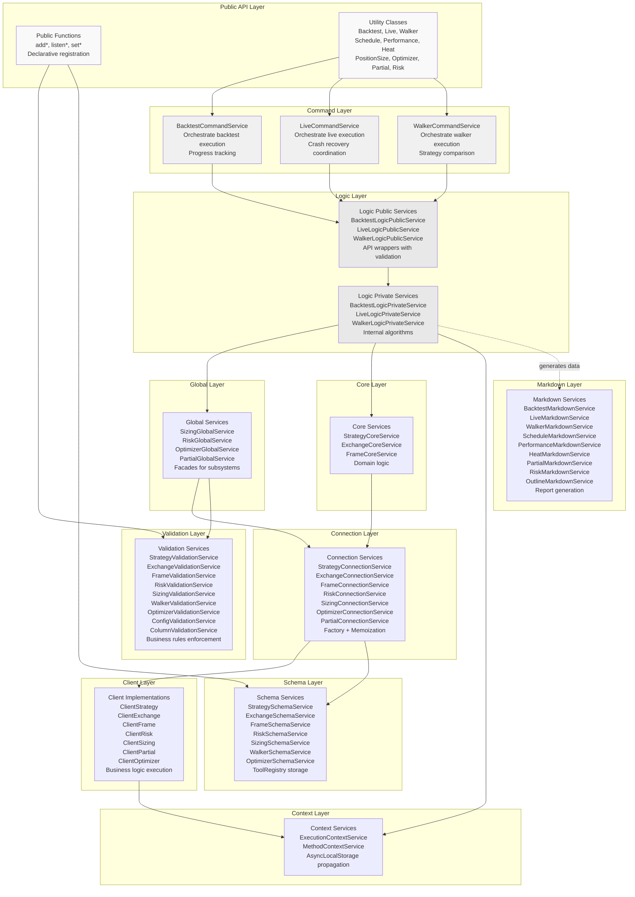
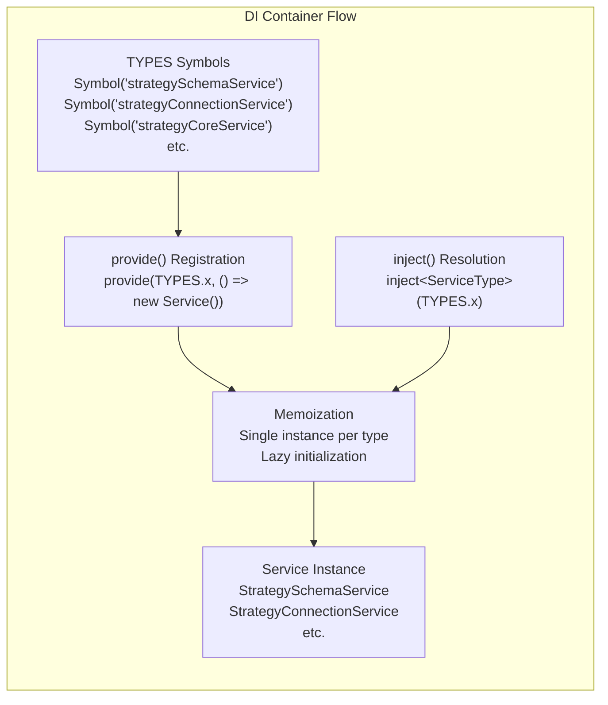
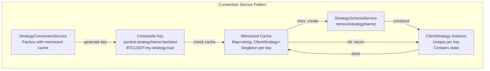
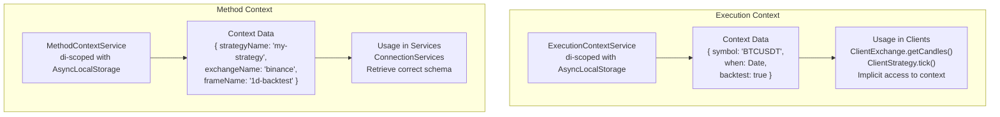
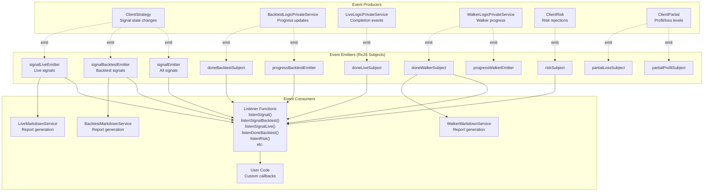
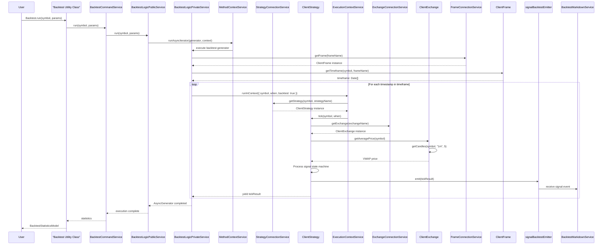
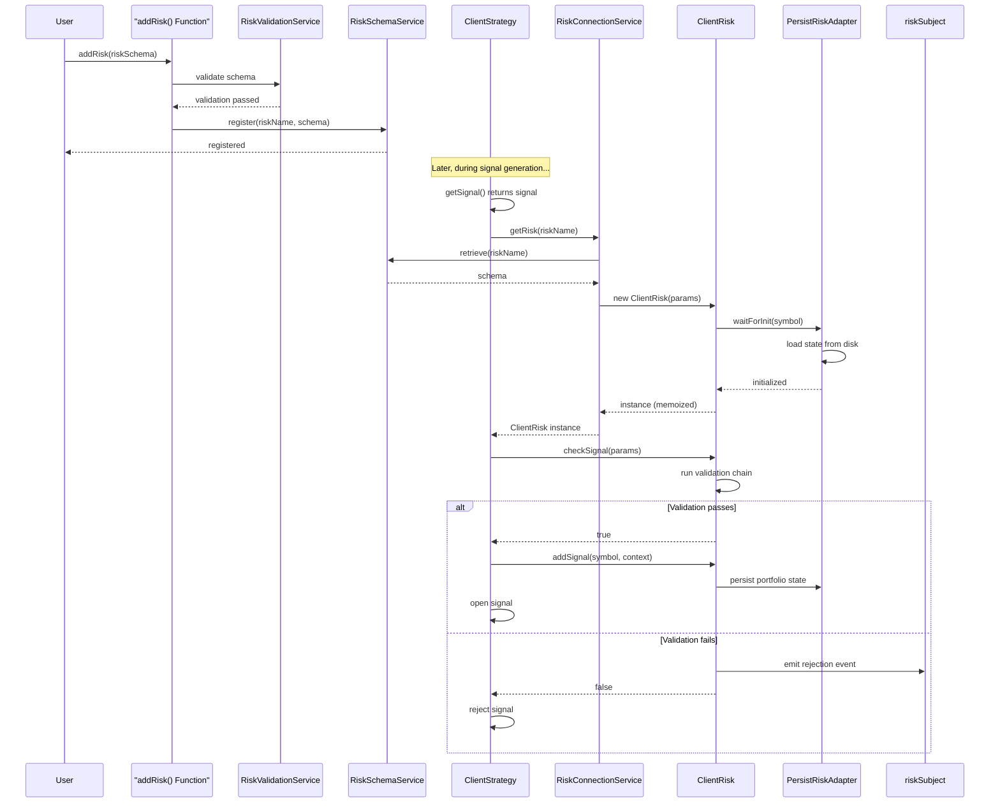

# Architecture

<details>
<summary>Relevant source files</summary>

The following files were used as context for generating this wiki page:

- [src/config/emitters.ts](src/config/emitters.ts)
- [src/function/add.ts](src/function/add.ts)
- [src/function/event.ts](src/function/event.ts)
- [src/index.ts](src/index.ts)
- [src/lib/core/provide.ts](src/lib/core/provide.ts)
- [src/lib/core/types.ts](src/lib/core/types.ts)
- [src/lib/index.ts](src/lib/index.ts)
- [types.d.ts](types.d.ts)

</details>


This document describes the overall architecture of backtest-kit, including its layered design, dependency injection system, context propagation mechanisms, and event-driven patterns. The architecture is designed to support three execution modes (Backtest, Live, Walker) while maintaining temporal isolation, crash recovery, and clean separation of concerns.

For detailed information about specific architectural components:
- Layer-specific responsibilities and interactions, see [Layer Responsibilities](#3.1)
- Dependency injection container implementation, see [Dependency Injection System](#3.2)
- Context propagation with AsyncLocalStorage, see [Context Propagation](#3.3)
- Event emitters and listener functions, see [Event System](#3.4)

## System Overview

backtest-kit implements a **layered service architecture** with dependency injection and context propagation. The system consists of approximately 50+ services organized into distinct layers, each with specific responsibilities. Services are instantiated lazily via a custom DI container and communicate through well-defined interfaces.

The architecture supports three primary execution modes:
- **Backtest**: Historical simulation with temporal isolation (prevents look-ahead bias)
- **Live**: Real-time trading with crash-safe persistence (atomic file writes)
- **Walker**: Strategy comparison with metric-based ranking

### Architectural Layers



**Sources:** [src/lib/index.ts:1-246](), [src/lib/core/types.ts:1-105](), [src/lib/core/provide.ts:1-143]()

### Service Registration and Resolution

The system uses a custom dependency injection container that maps TYPES symbols to service factory functions. All services are registered at module load time and instantiated lazily on first access.



**Example Registration:**
```typescript
// In provide.ts
provide(TYPES.strategySchemaService, () => new StrategySchemaService());
provide(TYPES.strategyConnectionService, () => new StrategyConnectionService());

// In index.ts
const strategySchemaService = inject<StrategySchemaService>(TYPES.strategySchemaService);
const strategyConnectionService = inject<StrategyConnectionService>(TYPES.strategyConnectionService);
```

**Sources:** [src/lib/core/provide.ts:1-143](), [src/lib/core/types.ts:1-105](), [src/lib/index.ts:1-246]()

## Architectural Patterns

### 1. Layered Service Architecture

Each layer has specific responsibilities and communicates only with adjacent layers. This enforces separation of concerns and makes the system easier to test and maintain.

| Layer | Responsibility | Examples | Communication |
|-------|---------------|----------|---------------|
| **Public API** | User-facing functions | `addStrategy()`, `listenSignal()` | Calls Validation + Schema |
| **Utility Classes** | Execution control | `Backtest`, `Live`, `Walker` | Calls Command Services |
| **Command** | Workflow orchestration | `BacktestCommandService` | Calls Logic Public |
| **Logic Public** | API wrappers with validation | `BacktestLogicPublicService` | Calls Logic Private |
| **Logic Private** | Internal algorithms | `BacktestLogicPrivateService` | Calls Global + Core + Context |
| **Global** | Subsystem facades | `RiskGlobalService` | Calls Connection + Validation |
| **Core** | Domain logic | `StrategyCoreService` | Calls Connection |
| **Connection** | Factory + Memoization | `StrategyConnectionService` | Creates Clients |
| **Schema** | Configuration storage | `StrategySchemaService` | ToolRegistry pattern |
| **Validation** | Business rules | `StrategyValidationService` | Enforces constraints |
| **Markdown** | Report generation | `BacktestMarkdownService` | Subscribes to events |
| **Client** | Business logic execution | `ClientStrategy` | Uses Context |
| **Context** | Implicit parameters | `ExecutionContextService` | AsyncLocalStorage |

**Sources:** [src/lib/index.ts:61-238](), [types.d.ts:1-50]()

### 2. Factory Pattern with Memoization

Connection services use factory pattern to create client instances. Memoization ensures proper instance isolation based on composite keys.



**Key Construction Examples:**
- Backtest strategy: `"BTCUSDT:my-strategy:true"`
- Live strategy: `"BTCUSDT:my-strategy:false"`
- Different symbols: `"ETHUSDT:my-strategy:true"` (separate instance)

This ensures that:
- Backtest and live modes use separate instances (prevent state contamination)
- Each symbol gets its own instance (parallel execution support)
- Multiple strategies can share risk/sizing instances (portfolio-level analysis)

**Sources:** [src/lib/services/connection/StrategyConnectionService.ts](), [src/lib/services/connection/ExchangeConnectionService.ts]()

### 3. Context Propagation with AsyncLocalStorage

Two scoped services provide implicit parameter passing without manual threading:



**ExecutionContextService** provides runtime parameters:
- `symbol`: Trading pair (e.g., "BTCUSDT")
- `when`: Current timestamp for operations
- `backtest`: Boolean flag for mode detection

**MethodContextService** provides schema selection:
- `strategyName`: Which strategy to use
- `exchangeName`: Which exchange to use
- `frameName`: Which frame to use (empty for live)

This pattern eliminates the need to pass these parameters explicitly through every function call.

**Sources:** [types.d.ts:6-50](), [src/lib/services/context/ExecutionContextService.ts](), [src/lib/services/context/MethodContextService.ts]()

### 4. Event-Driven Architecture with RxJS

The system uses RxJS Subjects as a central event bus for decoupled communication between components.



**Event Hierarchy:**
- `signalEmitter`: Broadcasts ALL signals (backtest + live)
- `signalBacktestEmitter`: Backtest-only signals
- `signalLiveEmitter`: Live-only signals

This allows subscribers to listen at different granularities without tight coupling to execution logic.

**Queued Processing:**
All listener callbacks are wrapped with `queued()` from functools-kit, ensuring sequential execution even for async handlers. This prevents race conditions in event processing.

**Sources:** [src/config/emitters.ts:1-133](), [src/function/event.ts:1-969]()

## Data Flow: Backtest Execution

The following diagram shows how data flows through the system during a backtest execution:



**Key Observations:**
1. **MethodContextService** wraps the generator to provide schema context
2. **ExecutionContextService** wraps each tick to provide runtime context
3. **Connection Services** provide memoized client instances
4. **ClientStrategy** orchestrates signal logic and emits events
5. **Event emitters** enable parallel data collection (markdown, user callbacks)

**Sources:** [src/classes/Backtest.ts](), [src/lib/services/command/BacktestCommandService.ts](), [src/lib/services/logic/public/BacktestLogicPublicService.ts](), [src/lib/services/logic/private/BacktestLogicPrivateService.ts](), [src/client/ClientStrategy.ts]()

## Design Principles

### Temporal Isolation

**ExecutionContextService** enforces temporal isolation by controlling which timestamp is "current" for all operations. During backtesting, `when` is set to the candle timestamp being processed. During live trading, `when` is set to `Date.now()`.

**ClientExchange.getCandles()** uses the context's `when` value to fetch historical candles:
- In backtest mode: Fetches candles BEFORE the context timestamp (prevents look-ahead bias)
- In live mode: Fetches most recent candles up to `Date.now()`

This ensures strategies cannot access "future" data during backtesting, making backtest results realistic.

**Sources:** [types.d.ts:6-18](), [src/client/ClientExchange.ts](), [src/lib/services/context/ExecutionContextService.ts]()

### Crash-Safe Persistence

**PersistBase** abstract class provides atomic file writes using the temp-rename pattern:
1. Write data to temporary file: `signal.json.tmp`
2. Call `fsync()` to ensure disk write
3. Rename temp file to final: `signal.json`
4. OS guarantees rename is atomic

Multiple persistence adapters extend `PersistBase`:
- **PersistSignalAdapter**: Active signals per symbol/strategy
- **PersistRiskAdapter**: Portfolio state per risk profile
- **PersistScheduleAdapter**: Scheduled signals per symbol/strategy
- **PersistPartialAdapter**: Profit/loss milestone tracking per symbol/strategy

Each adapter has separate file paths to prevent cross-contamination. On restart, `waitForInit()` loads state from disk files.

**Sources:** [src/classes/Persist.ts](), [src/client/ClientStrategy.ts](), [types.d.ts:165-180]()

### Type-Safe Discriminated Unions

Signal state machine uses TypeScript discriminated unions for type-safe state handling:

```typescript
type IStrategyTickResult = 
  | IStrategyTickResultIdle       // action: "idle"
  | IStrategyTickResultScheduled  // action: "scheduled"
  | IStrategyTickResultOpened     // action: "opened"
  | IStrategyTickResultActive     // action: "active"
  | IStrategyTickResultClosed     // action: "closed"
  | IStrategyTickResultCancelled  // action: "cancelled"
```

Each state has distinct properties. TypeScript narrows the type based on the `action` discriminator:

```typescript
if (result.action === "closed") {
  // TypeScript knows result is IStrategyTickResultClosed
  console.log(result.pnl.pnlPercentage);  // OK
  console.log(result.closeReason);         // OK
}
```

This prevents accessing properties that don't exist in the current state, catching bugs at compile time.

**Sources:** [types.d.ts:769-895](), [src/interfaces/Strategy.interface.ts]()

### Memoized Service Instantiation

Connection services use memoization to ensure singleton behavior per composite key:

```typescript
// StrategyConnectionService.getStrategy() pseudo-code
getStrategy(symbol: string, strategyName: string, backtest: boolean) {
  const key = `${symbol}:${strategyName}:${backtest}`;
  
  if (!this.cache.has(key)) {
    const schema = this.schemaService.retrieve(strategyName);
    const instance = new ClientStrategy({
      ...schema,
      logger: this.logger,
      execution: this.executionContextService,
      // ... other dependencies
    });
    this.cache.set(key, instance);
  }
  
  return this.cache.get(key);
}
```

This pattern:
- Prevents duplicate instantiation (performance)
- Maintains state per key (correctness)
- Supports parallel execution (isolation)

**Sources:** [src/lib/services/connection/StrategyConnectionService.ts](), [src/lib/services/connection/ExchangeConnectionService.ts](), [src/lib/services/connection/PartialConnectionService.ts]()

## Component Interaction Example: Risk Management

The following diagram shows how risk management integrates across layers:



**Key Interactions:**
1. **Registration**: User calls `addRisk()` → validates → stores in SchemaService
2. **Instantiation**: ClientStrategy requests ClientRisk → ConnectionService checks cache → creates if needed
3. **State Loading**: ClientRisk calls `waitForInit()` → PersistRiskAdapter loads from disk
4. **Validation**: ClientRisk runs validation chain → emits event on rejection
5. **State Update**: On signal open/close → ClientRisk updates portfolio state → persists to disk

**Sources:** [src/function/add.ts:270-343](), [src/lib/services/connection/RiskConnectionService.ts](), [src/client/ClientRisk.ts](), [src/classes/Persist.ts](), [src/config/emitters.ts:127-132]()

## Summary

The backtest-kit architecture is characterized by:

1. **Layered Services**: Clear separation of concerns across 9+ service layers
2. **Dependency Injection**: Custom DI container with lazy instantiation and memoization
3. **Context Propagation**: AsyncLocalStorage-based implicit parameter passing
4. **Event-Driven**: RxJS Subjects for decoupled communication with queued processing
5. **Factory Pattern**: Connection services with composite key-based memoization
6. **Temporal Isolation**: Context-aware data access prevents look-ahead bias
7. **Crash Recovery**: Atomic file writes enable graceful recovery from failures
8. **Type Safety**: Discriminated unions for compile-time correctness

This architecture enables the framework to support complex trading workflows while maintaining testability, extensibility, and reliability. The layered design ensures that changes to one component (e.g., persistence implementation) do not cascade to unrelated components (e.g., signal generation logic).

**Sources:** [src/lib/index.ts:1-246](), [src/lib/core/types.ts:1-105](), [src/lib/core/provide.ts:1-143](), [types.d.ts:1-1190](), [src/index.ts:1-199]()