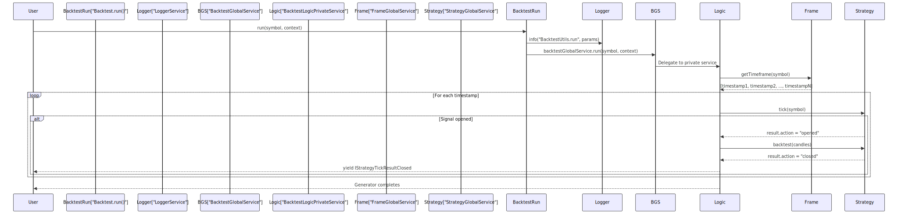

# Backtest API

This document covers the public API for running backtests through the `Backtest` utility class. The Backtest API provides methods for streaming historical strategy execution, running backtests in the background, and generating performance reports.

For registering strategies, exchanges, and frames before running backtests, see [Configuration Functions](09_Configuration_Functions.md). For live trading operations, see [Live Trading API](11_Live_Trading_API.md). For detailed execution orchestration, see [Backtest Execution Flow](29_Backtest_Execution_Flow.md).

---

## Overview

The `Backtest` class is a singleton utility that provides a simplified interface to the backtest execution engine. It wraps the underlying `BacktestGlobalService` with logging and context propagation, exposing four primary methods for backtest operations.

The class is defined in [src/classes/Backtest.ts:29-148]() and exported as a singleton instance at [src/classes/Backtest.ts:168]().

**Key characteristics:**
- Memory-efficient async generator execution (streaming results)
- Early termination support via `break` or cancellation functions
- Automatic context propagation (strategyName, exchangeName, frameName)
- Integration with markdown reporting services


---

## Method Overview



**Method Overview**

| Method | Return Type | Purpose | Use Case |
|--------|-------------|---------|----------|
| `run()` | `AsyncIterableIterator<IStrategyTickResultClosed>` | Stream backtest results as they complete | Interactive analysis, early termination |
| `background()` | `Promise<() => void>` | Run backtest without yielding results | Fire-and-forget execution, event listeners |
| `getReport()` | `Promise<string>` | Generate markdown report | View performance statistics |
| `dump()` | `Promise<void>` | Save report to disk | Persist results for later analysis |


---

## Backtest.run()

Executes a backtest for the specified symbol and returns an async generator that yields closed signal results. This is the primary method for interactive backtest execution with full control over iteration.

### Method Signature

```typescript
run(
  symbol: string,
  context: {
    strategyName: string;
    exchangeName: string;
    frameName: string;
  }
): AsyncIterableIterator<IStrategyTickResultClosed>
```

**Parameters:**
- `symbol` - Trading pair symbol (e.g., "BTCUSDT")
- `context.strategyName` - Name of registered strategy (via `addStrategy()`)
- `context.exchangeName` - Name of registered exchange (via `addExchange()`)
- `context.frameName` - Name of registered timeframe (via `addFrame()`)

**Returns:**
Async generator yielding `IStrategyTickResultClosed` objects containing:
- `action: "closed"` - Discriminator indicating signal completion
- `signal: ISignalRow` - Complete signal data with ID, prices, position
- `currentPrice: number` - Final VWAP price at signal close
- `closeReason: StrategyCloseReason` - One of "take_profit", "stop_loss", "time_expired"
- `closeTimestamp: number` - Unix timestamp (ms) when signal closed
- `pnl: IStrategyPnL` - Profit/loss calculation with fees and slippage
- `strategyName: string` - Strategy identifier
- `exchangeName: string` - Exchange identifier


### Execution Flow




### Usage Example

```typescript
import { Backtest } from "backtest-kit";

for await (const result of Backtest.run("BTCUSDT", {
  strategyName: "my-strategy",
  exchangeName: "binance",
  frameName: "1d-backtest"
})) {
  console.log({
    signalId: result.signal.id,
    closeReason: result.closeReason,     // "take_profit" | "stop_loss" | "time_expired"
    pnl: result.pnl.pnlPercentage,       // e.g., +1.98%
    priceOpen: result.pnl.priceOpen,     // Adjusted with fees/slippage
    priceClose: result.pnl.priceClose,   // Adjusted with fees/slippage
    closeTime: new Date(result.closeTimestamp)
  });

  // Early termination
  if (result.pnl.pnlPercentage < -5) {
    console.log("Stopping backtest - loss threshold exceeded");
    break; // Generator stops immediately
  }
}
```

**Memory efficiency:** Results are streamed one at a time. The generator does not accumulate all results in memory, making it suitable for long historical periods.


---

## Backtest.background()

Executes a backtest without yielding results to the caller. This method consumes the async generator internally, making it useful for fire-and-forget execution where results are handled via event listeners (see [Event Listeners](13_Event_Listeners.md)).

### Method Signature

```typescript
background(
  symbol: string,
  context: {
    strategyName: string;
    exchangeName: string;
    frameName: string;
  }
): Promise<() => void>
```

**Parameters:** Same as `run()`

**Returns:**
Promise resolving to a cancellation function `() => void`. Invoking this function stops the background execution after the current signal completes.


### Implementation Details

The `background()` method creates an internal task that consumes the `run()` generator:



Key behaviors:
- The task runs asynchronously without blocking the caller
- Cancellation via returned function sets `isStopped = true`
- Loop exits on next iteration after cancellation
- Generator cleanup occurs when loop breaks


### Usage Example

```typescript
import { Backtest, listenSignalBacktest } from "backtest-kit";

// Start backtest in background
const stopBacktest = await Backtest.background("BTCUSDT", {
  strategyName: "my-strategy",
  exchangeName: "binance",
  frameName: "1d-backtest"
});

// Listen to results via event listener
listenSignalBacktest((event) => {
  if (event.action === "closed") {
    console.log("Signal closed:", event.pnl.pnlPercentage);
  }
});

// Stop after 5 seconds
setTimeout(() => {
  console.log("Stopping backtest...");
  stopBacktest(); // Graceful shutdown
}, 5000);
```

**Use cases:**
- Running multiple backtests in parallel
- Combining with event listeners for reactive processing
- Non-blocking execution in UI applications
- Conditional termination based on external events


---

## Backtest.getReport()

Generates a markdown-formatted performance report for a specific strategy. The report aggregates all closed signals that have been yielded during backtest execution.

### Method Signature

```typescript
getReport(strategyName: string): Promise<string>
```

**Parameters:**
- `strategyName` - Strategy name to generate report for (must match name used in `addStrategy()`)

**Returns:**
Promise resolving to markdown-formatted report string containing:
- Total closed signals count
- Table with signal details (timestamp, action, symbol, signal ID, position, prices, PNL, close reason)


### Report Integration



The `BacktestMarkdownService` passively accumulates closed signals as they are yielded during execution. It does not intercept or modify the backtest flow.


### Usage Example

```typescript
import { Backtest } from "backtest-kit";

// Run backtest (or background)
for await (const result of Backtest.run("BTCUSDT", {
  strategyName: "my-strategy",
  exchangeName: "binance",
  frameName: "1d-backtest"
})) {
  // Results are automatically accumulated for reporting
}

// Generate report
const markdown = await Backtest.getReport("my-strategy");
console.log(markdown);

// Output example:
// # Backtest Report: my-strategy
// 
// Total closed signals: 15
//
// | Timestamp | Action | Symbol | Signal ID | Position | ... | PNL (net) | Close Reason |
// |-----------|--------|--------|-----------|----------|-----|-----------|--------------|
// | ...       | CLOSED | BTCUSD | abc-123   | LONG     | ... | +2.45%    | take_profit  |
```


---

## Backtest.dump()

Saves the markdown report to disk at a specified path. Default location is `./logs/backtest/{strategyName}.md`.

### Method Signature

```typescript
dump(strategyName: string, path?: string): Promise<void>
```

**Parameters:**
- `strategyName` - Strategy name to save report for
- `path` - Optional directory path (default: `"./logs/backtest"`)

**File location:**
- Default: `./logs/backtest/{strategyName}.md`
- Custom: `{path}/{strategyName}.md`


### Usage Example

```typescript
import { Backtest } from "backtest-kit";

// Run backtest
await Backtest.background("BTCUSDT", {
  strategyName: "my-strategy",
  exchangeName: "binance",
  frameName: "1d-backtest"
});

// Save to default path: ./logs/backtest/my-strategy.md
await Backtest.dump("my-strategy");

// Save to custom path: ./custom/reports/my-strategy.md
await Backtest.dump("my-strategy", "./custom/reports");
```

**File system behavior:**
- Directories are created automatically if they don't exist
- Existing files are overwritten
- Atomic write operations ensure no corruption


---

## Context Propagation

All Backtest methods use `MethodContextService` for implicit context propagation. This eliminates the need to manually thread strategy/exchange/frame names through the service layer.

### Context Flow Diagram



The context object passed to `run()` or `background()` is automatically injected into the scoped execution environment, allowing downstream services to retrieve the correct strategy/exchange/frame instances without explicit parameter passing.


---

## Common Usage Patterns

### Pattern 1: Interactive Analysis

```typescript
import { Backtest } from "backtest-kit";

let totalPnl = 0;
let winCount = 0;
let lossCount = 0;

for await (const result of Backtest.run("BTCUSDT", {
  strategyName: "my-strategy",
  exchangeName: "binance",
  frameName: "1d-backtest"
})) {
  totalPnl += result.pnl.pnlPercentage;
  
  if (result.pnl.pnlPercentage > 0) {
    winCount++;
  } else {
    lossCount++;
  }
  
  console.log(`Running PNL: ${totalPnl.toFixed(2)}%`);
  console.log(`Win rate: ${(winCount / (winCount + lossCount) * 100).toFixed(2)}%`);
}

// Save final report
await Backtest.dump("my-strategy");
```

### Pattern 2: Conditional Termination

```typescript
import { Backtest } from "backtest-kit";

let consecutiveLosses = 0;

for await (const result of Backtest.run("BTCUSDT", {
  strategyName: "my-strategy",
  exchangeName: "binance",
  frameName: "1d-backtest"
})) {
  if (result.pnl.pnlPercentage < 0) {
    consecutiveLosses++;
  } else {
    consecutiveLosses = 0;
  }
  
  // Stop after 3 consecutive losses
  if (consecutiveLosses >= 3) {
    console.log("Stopping: 3 consecutive losses detected");
    await Backtest.dump("my-strategy");
    break; // Exit generator early
  }
}
```

### Pattern 3: Event-Driven Background Execution

```typescript
import { Backtest, listenSignalBacktest } from "backtest-kit";

// Start background execution
const stop = await Backtest.background("BTCUSDT", {
  strategyName: "my-strategy",
  exchangeName: "binance",
  frameName: "1d-backtest"
});

// React to events
let totalPnl = 0;
listenSignalBacktest((event) => {
  if (event.action === "closed") {
    totalPnl += event.pnl.pnlPercentage;
    
    // Stop if total PNL drops below -10%
    if (totalPnl < -10) {
      console.log("Stopping: total PNL below threshold");
      stop();
    }
  }
});
```

### Pattern 4: Multi-Symbol Parallel Backtesting

```typescript
import { Backtest } from "backtest-kit";

const symbols = ["BTCUSDT", "ETHUSDT", "SOLUSDT"];

await Promise.all(
  symbols.map(async (symbol) => {
    for await (const result of Backtest.run(symbol, {
      strategyName: "my-strategy",
      exchangeName: "binance",
      frameName: "1d-backtest"
    })) {
      console.log(`[${symbol}] PNL: ${result.pnl.pnlPercentage}%`);
    }
    
    // Save report for each symbol
    await Backtest.dump(`my-strategy-${symbol}`);
  })
);
```


---

## Integration with Service Layer

The `Backtest` class is a thin wrapper around the service orchestration layer. Understanding the underlying services helps debug issues and optimize performance.

### Service Dependency Graph



**Key service roles:**
- `BacktestGlobalService` - Entry point for backtest execution, wraps `BacktestLogicPrivateService`
- `BacktestLogicPrivateService` - Orchestrates async generator loop through timeframes
- `StrategyGlobalService` - Wraps `ClientStrategy` with execution context injection
- `ExchangeGlobalService` - Wraps `ClientExchange` with execution context injection
- `FrameGlobalService` - Wraps `ClientFrame` for timeframe generation
- `BacktestMarkdownService` - Passively accumulates closed signals for reporting


---

## Error Handling

The Backtest API propagates errors from the underlying services. Common error scenarios:

### Configuration Errors

```typescript
// Error: Strategy not registered
for await (const result of Backtest.run("BTCUSDT", {
  strategyName: "non-existent-strategy",
  exchangeName: "binance",
  frameName: "1d-backtest"
})) {
  // throws Error: Strategy "non-existent-strategy" not registered
}
```

**Solution:** Ensure `addStrategy()` is called before running backtest.

### Validation Errors

```typescript
// Error: Invalid signal from getSignal()
addStrategy({
  strategyName: "invalid-strategy",
  interval: "5m",
  getSignal: async () => ({
    position: "long",
    priceOpen: 50000,
    priceTakeProfit: 49000,  // Invalid: TP must be > priceOpen for long
    priceStopLoss: 51000,    // Invalid: SL must be < priceOpen for long
    minuteEstimatedTime: 60,
  })
});

// Backtest will throw validation error when signal is generated
```

**Solution:** Ensure signal validation rules are followed (see [Signal Generation and Validation](25_Signal_Generation_and_Validation.md)).

### Exchange Errors

```typescript
// Error: Exchange getCandles() throws
addExchange({
  exchangeName: "broken-exchange",
  getCandles: async () => {
    throw new Error("Network timeout");
  },
  formatPrice: async (_, p) => p.toFixed(2),
  formatQuantity: async (_, q) => q.toFixed(8),
});

// Backtest will propagate the error
```

**Solution:** Implement retry logic in exchange `getCandles()` implementation.


---

## Performance Considerations

### Memory Efficiency

The async generator pattern ensures constant memory usage regardless of backtest duration:

```typescript
// Memory usage: O(1) - only one result in memory at a time
for await (const result of Backtest.run("BTCUSDT", {
  strategyName: "my-strategy",
  exchangeName: "binance",
  frameName: "year-backtest" // Even for 365 days
})) {
  // Process result immediately
  // Previous results are garbage collected
}
```

**Accumulation note:** The `BacktestMarkdownService` does accumulate closed signals in memory for reporting. For very long backtests with many signals, consider periodically calling `dump()` and clearing the service.

### Early Termination

Breaking out of the generator loop immediately stops execution:

```typescript
for await (const result of Backtest.run(...)) {
  if (someCondition) {
    break; // Backtest stops immediately, no more signals generated
  }
}
```

This allows interactive exploration without processing the entire historical period.

### Parallel Execution

Multiple backtests can run in parallel safely due to context isolation:

```typescript
await Promise.all([
  Backtest.background("BTCUSDT", {...}),
  Backtest.background("ETHUSDT", {...}),
  Backtest.background("SOLUSDT", {...}),
]);
```

Each backtest has its own execution context and does not interfere with others.

