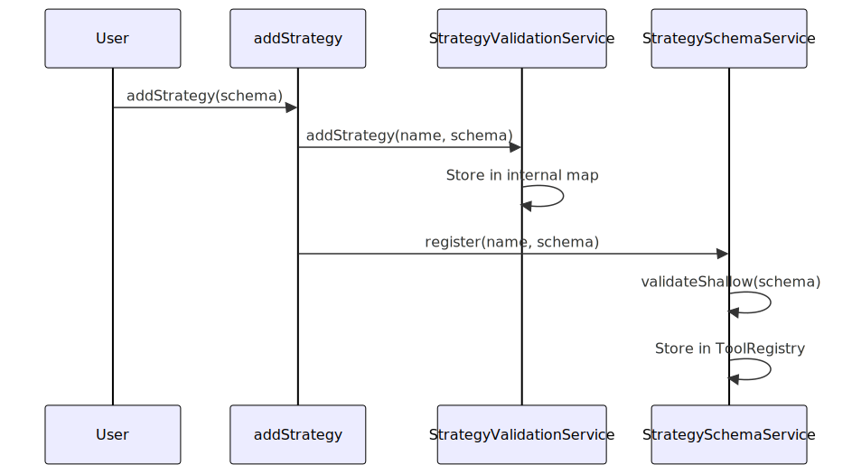
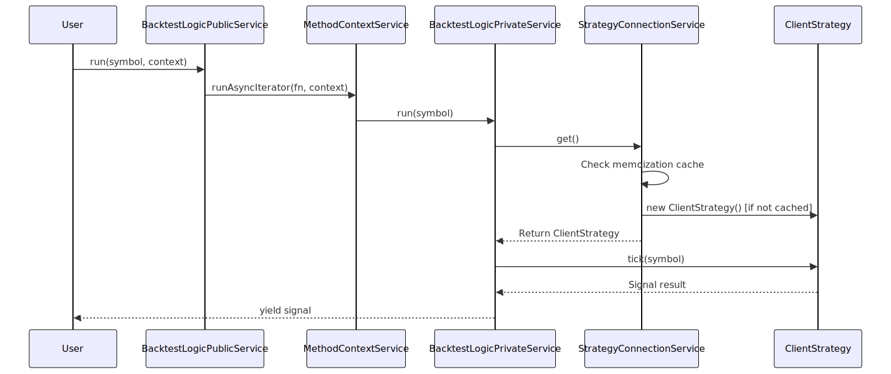

# Layer Responsibilities

This document describes the service architecture of backtest-kit and the responsibilities of each layer. The framework follows a clean architecture pattern with strict separation of concerns, dependency injection, and unidirectional data flow from public API down to business logic.

For information about how dependency injection works across these layers, see [Dependency Injection System](./11_Dependency_Injection_System.md). For details on how context flows through the layers, see [Context Propagation](./12_Context_Propagation.md).

---

## Architecture Overview

The backtest-kit framework organizes services into distinct functional layers. Services are bound via dependency injection using Symbol-based tokens defined in [src/lib/core/types.ts:1-81]().

**Complete Layer Architecture**



</thinking>

## Layer 1: API Layer

The API Layer provides user-facing classes and functions that serve as entry points to the framework. This layer has no business logic and delegates immediately to Command Services.

### Execution Classes

Execution classes in [src/classes/Backtest.ts](), [src/classes/Live.ts](), and [src/classes/Walker.ts]() provide the primary user interface:

| Class | Key Methods | Delegates To |
|-------|-------------|--------------|
| `Backtest` | `run()`, `background()`, `getData()`, `getReport()`, `dump()` | `BacktestCommandService` |
| `Live` | `run()`, `background()`, `getData()`, `getReport()`, `dump()` | `LiveCommandService` |
| `Walker` | `run()`, `background()`, `getData()`, `getReport()`, `dump()` | `WalkerCommandService` |

**API Layer Delegation Pattern**


Each execution class:
1. Logs the operation via `backtest.loggerService`
2. Clears relevant markdown services and strategy caches
3. Delegates to the corresponding Command Service


### Registration Functions

Component registration functions in [src/function/add.ts]() provide schema registration:

| Function | Purpose | Delegates To |
|----------|---------|--------------|
| `addStrategy()` | Register strategy schema | `StrategyValidationService`, `StrategySchemaService` |
| `addExchange()` | Register exchange schema | `ExchangeValidationService`, `ExchangeSchemaService` |
| `addFrame()` | Register frame schema | `FrameValidationService`, `FrameSchemaService` |
| `addRisk()` | Register risk profile | `RiskValidationService`, `RiskSchemaService` |
| `addSizing()` | Register sizing method | `SizingValidationService`, `SizingSchemaService` |
| `addWalker()` | Register walker comparison | `WalkerValidationService`, `WalkerSchemaService` |
| `addOptimizer()` | Register optimizer configuration | `OptimizerValidationService`, `OptimizerSchemaService` |


---

## Layer 2: Command Services

Command Services validate component configurations and delegate to Logic Services. They act as validation gateways before execution.

### Command Service Responsibilities

**Command Service Architecture**



| Service | Validates | Delegates To |
|---------|-----------|--------------|
| `BacktestCommandService` | strategyName, exchangeName, frameName, riskName | `BacktestLogicPublicService` |
| `LiveCommandService` | strategyName, exchangeName, riskName | `LiveLogicPublicService` |
| `WalkerCommandService` | walkerName, exchangeName, frameName, all strategy names | `WalkerLogicPublicService` |

### Command Service Pattern

Each Command Service follows a consistent pattern:

1. **Log operation** - Record method call with parameters
2. **Validate components** - Check that all referenced components are registered
3. **Validate dependencies** - If strategy has `riskName`, validate risk profile exists
4. **Delegate execution** - Pass validated parameters to Logic Service

**Example from BacktestCommandService**:

The service validates all components before delegating:

```
run(symbol, context) {
  // Validate strategy exists
  strategyValidationService.validate(context.strategyName)
  
  // Validate exchange exists  
  exchangeValidationService.validate(context.exchangeName)
  
  // Validate frame exists
  frameValidationService.validate(context.frameName)
  
  // Get strategy schema and validate risk if present
  const schema = strategySchemaService.get(context.strategyName)
  if (schema.riskName) {
    riskValidationService.validate(schema.riskName)
  }
  
  // Delegate to logic service
  return backtestLogicPublicService.run(symbol, context)
}
```


---

## Layer 3: Logic Services

Logic Services orchestrate execution flow. They are split into Public and Private services to separate context management from execution logic.

### Public Logic Services

Public Logic Services wrap Private Logic Services with `MethodContextService` to inject component names into execution context:

**Logic Service Context Injection**


Each Public Logic Service:

1. Receives context parameters (strategyName, exchangeName, frameName)
2. Wraps Private Logic Service call with `MethodContextService.runAsyncIterator()`
3. Returns AsyncGenerator from Private Logic Service

The `MethodContextService` uses scoped dependency injection to make context available to downstream services without explicit parameter passing.


### Private Logic Services

Private Logic Services implement the core execution algorithms:

| Service | Responsibility | Key Operations |
|---------|---------------|----------------|
| `BacktestLogicPrivateService` | Sequential timeframe iteration | Load frames, iterate dates, call `strategyGlobalService.tick()`, fetch future candles, call `strategyGlobalService.backtest()`, skip timeframes, emit to `signalBacktestEmitter` |
| `LiveLogicPrivateService` | Infinite real-time loop | Enter `while(true)` loop, call `strategyGlobalService.tick()` with `new Date()`, sleep for `TICK_TTL` (61s), emit to `signalLiveEmitter` |
| `WalkerLogicPrivateService` | Strategy comparison | Iterate walker strategies, run `BacktestLogicPublicService` for each, collect statistics, compare metrics, track best strategy, emit to `walkerEmitter` |

**BacktestLogicPrivateService Execution Flow**


**LiveLogicPrivateService Execution Flow**




---

## Layer 4: Global Services

Global Services wrap Connection Services with `ExecutionContextService` to inject runtime parameters (symbol, when, backtest flag) into execution scope.

### Global Service Pattern

**Global Service Wrapper Architecture**


| Service | Wraps | Injects Context For |
|---------|-------|---------------------|
| `StrategyGlobalService` | `StrategyConnectionService` | Strategy operations |
| `ExchangeGlobalService` | `ExchangeConnectionService` | Market data fetching |
| `FrameGlobalService` | `FrameConnectionService` | Timeframe generation |
| `RiskGlobalService` | `RiskConnectionService` | Risk validation |
| `SizingGlobalService` | `SizingConnectionService` | Position sizing |

Each Global Service:

1. **Validates component** - Memoized validation check
2. **Wraps in ExecutionContext** - Calls `ExecutionContextService.runInContext()`
3. **Delegates to Connection Service** - Passes call to underlying connection service

The `ExecutionContextService` makes `symbol`, `when`, and `backtest` flag available to Client Classes without parameter drilling.


---

## Layer 5: Connection Services

Connection Services manage memoized client instances, ensuring a single instance exists per component-symbol pair.

---

## Layer 1: Public API

The Public API layer provides the user-facing functions for component registration and execution. These functions have no business logic and immediately delegate to Global Services.

### Registration Functions

Component registration functions are exposed in [src/function/add.ts:1-342]():

| Function | Purpose | Delegates To |
|----------|---------|--------------|
| `addStrategy()` | Register strategy schema | `StrategyValidationService.addStrategy()`<br/>`StrategySchemaService.register()` |
| `addExchange()` | Register exchange schema | `ExchangeValidationService.addExchange()`<br/>`ExchangeSchemaService.register()` |
| `addFrame()` | Register timeframe schema | `FrameValidationService.addFrame()`<br/>`FrameSchemaService.register()` |
| `addRisk()` | Register risk profile | `RiskValidationService.addRisk()`<br/>`RiskSchemaService.register()` |
| `addSizing()` | Register sizing method | `SizingValidationService.addSizing()`<br/>`SizingSchemaService.register()` |
| `addWalker()` | Register strategy comparison | `WalkerValidationService.addWalker()`<br/>`WalkerSchemaService.register()` |

### Query Functions

Component listing functions are exposed in [src/function/list.ts:1-218]():

| Function | Purpose | Delegates To |
|----------|---------|--------------|
| `listStrategies()` | Get all strategy schemas | `StrategyValidationService.list()` |
| `listExchanges()` | Get all exchange schemas | `ExchangeValidationService.list()` |
| `listFrames()` | Get all frame schemas | `FrameValidationService.list()` |
| `listRisks()` | Get all risk schemas | `RiskValidationService.list()` |
| `listSizings()` | Get all sizing schemas | `SizingValidationService.list()` |
| `listWalkers()` | Get all walker schemas | `WalkerValidationService.list()` |

### Execution Classes

Execution entry points provide static methods for running backtests and live trading:

- `Backtest.run()` / `Backtest.background()` - Historical simulation
- `Live.run()` / `Live.background()` - Real-time trading
- `Walker.run()` / `Walker.background()` - Multi-strategy comparison

These delegate to corresponding Global Services which wrap Logic Services with validation.


---

## Layer 2: Logic Services

Logic Services orchestrate the core execution flow. They are split into Public and Private services to separate context management from core logic.

### Public Logic Services

Public logic services wrap execution in context and provide the public interface:

**Logic Service Responsibilities**



Each public service:

1. Accepts context parameters (strategyName, exchangeName, frameName)
2. Wraps private service call with `MethodContextService.runAsyncIterator()`
3. Returns async generator from private service

**Example from BacktestLogicPublicService**:

The public service receives context and wraps the private service:

```
run(symbol, { strategyName, exchangeName, frameName }) {
  return methodContextService.runAsyncIterator(
    () => backtestLogicPrivateService.run(symbol),
    { strategyName, exchangeName, frameName }
  )
}
```

### Private Logic Services

Private logic services contain the core execution orchestration:

| Service | Responsibility | Key Methods |
|---------|---------------|-------------|
| `BacktestLogicPrivateService` | Iterate timeframes, call strategy.tick(), yield signals | `run()`, emits to `signalBacktestEmitter` |
| `LiveLogicPrivateService` | Infinite loop, Date.now() progression, persistence | `run()`, emits to `signalLiveEmitter` |
| `WalkerLogicPrivateService` | Run multiple strategies, compare metrics | `run()`, emits to `walkerEmitter` |

These services have dependencies on:
- `StrategyGlobalService` - Strategy operations
- `ExchangeGlobalService` - Market data (backtest only)
- `FrameGlobalService` - Timeframe generation (backtest only)
- Markdown services - Report generation


---

## Layer 3: Connection Services

Connection Services manage memoized client instances. Each service creates and caches client instances by component name, ensuring only one instance exists per registered component.

### Service Registry

Connection services are defined in [src/lib/core/types.ts:10-16]():

| Service | Manages Instances Of | Cache Key |
|---------|---------------------|-----------|
| `StrategyConnectionService` | `ClientStrategy` | `${symbol}:${strategyName}` |
| `ExchangeConnectionService` | `ClientExchange` | `${symbol}:${exchangeName}` |
| `RiskConnectionService` | `ClientRisk` | `${riskName}` |
| `FrameConnectionService` | `ClientFrame` | `${symbol}:${exchangeName}:${frameName}` |
| `SizingConnectionService` | `ClientSizing` | `${sizingName}` |

### Memoization Pattern

**StrategyConnectionService Architecture**



The `getStrategy` method in [src/lib/services/connection/StrategyConnectionService.ts:78-98]() uses `memoize` from `functools-kit` to cache instances:

```
private getStrategy = memoize(
  ([symbol, strategyName]) => `${symbol}:${strategyName}`,
  (symbol, strategyName) => {
    const { riskName, getSignal, interval, callbacks } = 
      this.strategySchemaService.get(strategyName);
    return new ClientStrategy({
      symbol,
      interval,
      execution: this.executionContextService,
      method: this.methodContextService,
      logger: this.loggerService,
      partial: this.partialConnectionService,
      exchange: this.exchangeConnectionService,
      risk: riskName ? this.riskConnectionService.getRisk(riskName) : NOOP_RISK,
      riskName,
      strategyName,
      getSignal,
      callbacks,
    });
  }
);
```

### Connection Service Operations

Each Connection Service provides operation methods that delegate to cached client instances:

**StrategyConnectionService Operations**

| Method | Purpose | Delegates To |
|--------|---------|--------------|
| `tick(symbol, strategyName)` | Execute live trading tick | `ClientStrategy.tick()` |
| `backtest(symbol, strategyName, candles)` | Execute fast backtest | `ClientStrategy.backtest()` |
| `getPendingSignal(symbol, strategyName)` | Retrieve active signal | `ClientStrategy.getPendingSignal()` |
| `stop({symbol, strategyName})` | Stop signal generation | `ClientStrategy.stop()` |
| `clear(ctx?)` | Clear memoized instances | Memoization cache |

Connection Services also emit to appropriate event emitters after operations complete. For example, [src/lib/services/connection/StrategyConnectionService.ts:129-147]() emits signals to three channels:

```
const tick = await strategy.tick(symbol, strategyName);
{
  if (this.executionContextService.context.backtest) {
    await signalBacktestEmitter.next(tick);
  }
  if (!this.executionContextService.context.backtest) {
    await signalLiveEmitter.next(tick);
  }
  await signalEmitter.next(tick);
}
```


---

## Layer 6: Client Classes

Client Classes contain pure business logic without dependency injection. They receive dependencies via constructor parameters and implement core algorithms.

### Client Responsibilities

| Client Class | Primary Responsibility | Key Methods |
|--------------|----------------------|-------------|
| `ClientStrategy` | Signal lifecycle management | `tick()`, `backtest()`, `stop()`, `getPendingSignal()`, `waitForInit()` |
| `ClientExchange` | Market data and VWAP calculation | `getCandles()`, `getNextCandles()`, `getAveragePrice()`, `formatPrice()` |
| `ClientRisk` | Position tracking and validation | `checkSignal()`, `addSignal()`, `removeSignal()` |
| `ClientFrame` | Timeframe generation | `getTimeframe()` |
| `ClientSizing` | Position size calculation | `calculateQuantity()` |

**ClientStrategy State Management**


Client Classes have no knowledge of:
- Dependency injection framework
- Service layer architecture
- Memoization caching
- Event emission (handled by Connection Services)

They receive all dependencies as constructor parameters and expose simple method interfaces.


---

## Layer 7: Schema Services

Schema Services store component configurations using the `ToolRegistry` pattern and provide runtime schema retrieval.

---

## Layer 4: Client Classes

Client Classes contain pure business logic without dependency injection dependencies. They implement the core algorithms and state management.

### Client Responsibilities

**Client Class Hierarchy**



| Client Class | Primary Responsibility | Key State |
|--------------|----------------------|-----------|
| `ClientStrategy` | Signal lifecycle management, tick/backtest execution | `_pendingSignal`, `_lastSignalTimestamp` |
| `ClientExchange` | Market data fetching, VWAP calculation, formatting | Stateless (delegates to schema functions) |
| `ClientRisk` | Position tracking, custom validation execution | `_activePositions` Map |
| `ClientFrame` | Timeframe generation for backtesting | Stateless |
| `ClientSizing` | Position size calculation | Stateless |

### Pure Business Logic

Client classes have NO direct dependency injection. Instead:

1. **Constructor parameters** are simple values or functions from schemas
2. **Service dependencies** are passed via Connection Service injection
3. **Prototype methods** are used for memory efficiency (not arrow functions)

Example: `ClientStrategy` receives schema functions and other clients as constructor parameters, not DI symbols.


---

## Layer 5: Schema & Validation Services

Schema and Validation Services manage component registration and runtime validation. They use a parallel service structure with distinct responsibilities.

### Schema Services

Schema Services store component configurations using the `ToolRegistry` pattern:

**Schema Service Pattern**


Each Schema Service provides:

| Method | Purpose |
|--------|---------|
| `register(name, schema)` | Store component configuration |
| `get(name)` | Retrieve configuration by name |
| `validateShallow(schema)` | Check schema structure and types |
| `override(name, partial)` | Update existing schema |

Schema services are defined in [src/lib/core/types.ts:18-25]():

```typescript
const schemaServices = {
    exchangeSchemaService: Symbol('exchangeSchemaService'),
    strategySchemaService: Symbol('strategySchemaService'),
    frameSchemaService: Symbol('frameSchemaService'),
    walkerSchemaService: Symbol('walkerSchemaService'),
    sizingSchemaService: Symbol('sizingSchemaService'),
    riskSchemaService: Symbol('riskSchemaService'),
}
```

### Validation Services

Validation Services perform runtime existence checks with memoization:

**Validation Service Pattern**


Each Validation Service provides:

| Method | Purpose |
|--------|---------|
| `addStrategy(name, schema)` | Register component for validation |
| `validate(name)` | Check existence and dependencies |
| `list()` | Return all registered schemas |

Validation services are defined in [src/lib/core/types.ts:59-66]():

```typescript
const validationServices = {
    exchangeValidationService: Symbol('exchangeValidationService'),
    strategyValidationService: Symbol('strategyValidationService'),
    frameValidationService: Symbol('frameValidationService'),
    walkerValidationService: Symbol('walkerValidationService'),
    sizingValidationService: Symbol('sizingValidationService'),
    riskValidationService: Symbol('riskValidationService'),
}
```

**Example Validation Flow**:

When `BacktestLogicPublicService` starts execution:
1. Calls `StrategyValidationService.validate(strategyName)`
2. Calls `ExchangeValidationService.validate(exchangeName)`
3. Calls `FrameValidationService.validate(frameName)`
4. If strategy has `riskName`, validates via `RiskValidationService.validate(riskName)`


---

## Layer 6: Markdown Services

Markdown Services subscribe to event emitters and accumulate data for report generation. Each execution mode has a dedicated markdown service.

### Service Registry

Markdown services are defined in [src/lib/core/types.ts:50-57]():

```typescript
const markdownServices = {
    backtestMarkdownService: Symbol('backtestMarkdownService'),
    liveMarkdownService: Symbol('liveMarkdownService'),
    scheduleMarkdownService: Symbol('scheduleMarkdownService'),
    performanceMarkdownService: Symbol('performanceMarkdownService'),
    walkerMarkdownService: Symbol('walkerMarkdownService'),
    heatMarkdownService: Symbol('heatMarkdownService'),
}
```

### Event Subscription Pattern

**Markdown Service Data Flow**


Each Markdown Service:

1. **Subscribes to emitter** during initialization
2. **Accumulates events** in memoized storage by strategy/walker name
3. **Limits event queue** (e.g., `LiveMarkdownService` max 250 events)
4. **Calculates statistics** on demand via `getData()`
5. **Formats markdown** via `getReport()`
6. **Writes to disk** via `dump()`

### Report Storage

Storage is memoized per component:
- `BacktestMarkdownService` - One storage per (strategyName, exchangeName, frameName)
- `LiveMarkdownService` - One storage per (strategyName, exchangeName)
- `WalkerMarkdownService` - One storage per walkerName


---

## Cross-Cutting Services

Three services span all layers and provide infrastructure concerns.

### LoggerService

The `LoggerService` provides logging infrastructure with automatic context injection:



Injected into nearly every service via [src/lib/core/types.ts:1-3]():

```typescript
const baseServices = {
    loggerService: Symbol('loggerService'),
}
```

### ExecutionContextService

The `ExecutionContextService` manages execution-time parameters using `di-scoped`:

| Property | Purpose |
|----------|---------|
| `symbol` | Trading pair (e.g., "BTCUSDT") |
| `when` | Current timestamp (Date for live, historical for backtest) |
| `backtest` | Boolean flag indicating execution mode |

Used by client classes to access current execution context without explicit parameter passing.

### MethodContextService

The `MethodContextService` manages component selection using `di-scoped`:

| Property | Purpose |
|----------|---------|
| `strategyName` | Active strategy identifier |
| `exchangeName` | Active exchange identifier |
| `frameName` | Active frame identifier (backtest only) |

Used by Connection Services to resolve which component instance to return.


---

## Layer Interaction Patterns

### Registration Flow

**Component Registration Pattern**



1. Public API function receives schema
2. Validation Service stores for runtime checks
3. Schema Service validates structure and stores in registry

### Execution Flow

**Backtest Execution Pattern**



1. Public service wraps with MethodContext
2. Private service gets client from Connection Service
3. Connection Service returns memoized instance
4. Private service calls client methods
5. Results yielded to user

### Data Flow Direction

All data flows unidirectionally down the layers:

```
Layer 1 (Public API)
    ↓ Delegates
Layer 2 (Logic Services)
    ↓ Requests Instances
Layer 3 (Connection Services)
    ↓ Creates/Returns
Layer 4 (Client Classes)
    ↓ Uses
Layer 5 (Schemas)
```

Events flow horizontally to Layer 6 (Markdown Services) for reporting.


---

## Service Binding

All services are bound in [src/lib/core/provide.ts:1-111]() using the `provide()` function from the DI container. Services are organized in blocks matching their layer:

```typescript
// Base Services (Cross-cutting)
provide(TYPES.loggerService, () => new LoggerService());

// Context Services (Cross-cutting)
provide(TYPES.executionContextService, () => new ExecutionContextService());
provide(TYPES.methodContextService, () => new MethodContextService());

// Connection Services (Layer 3)
provide(TYPES.strategyConnectionService, () => new StrategyConnectionService());
provide(TYPES.exchangeConnectionService, () => new ExchangeConnectionService());

// Schema Services (Layer 5)
provide(TYPES.strategySchemaService, () => new StrategySchemaService());

// Global Services (Layer 2 wrappers)
provide(TYPES.strategyGlobalService, () => new StrategyGlobalService());

// Logic Services (Layer 2)
provide(TYPES.backtestLogicPrivateService, () => new BacktestLogicPrivateService());
provide(TYPES.backtestLogicPublicService, () => new BacktestLogicPublicService());

// Markdown Services (Layer 6)
provide(TYPES.backtestMarkdownService, () => new BacktestMarkdownService());

// Validation Services (Layer 5)
provide(TYPES.strategyValidationService, () => new StrategyValidationService());
```

All services are then exported as a single object in [src/lib/index.ts:152-162]():

```typescript
export const backtest = {
  ...baseServices,
  ...contextServices,
  ...connectionServices,
  ...schemaServices,
  ...globalServices,
  ...logicPrivateServices,
  ...logicPublicServices,
  ...markdownServices,
  ...validationServices,
};
```

