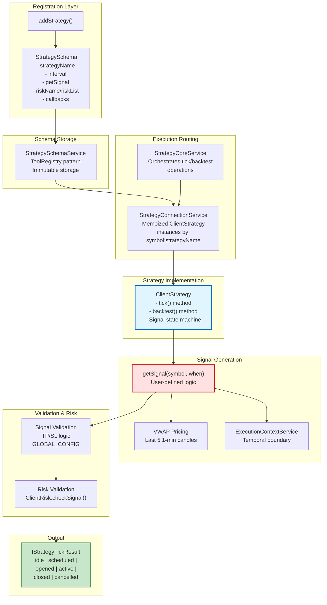
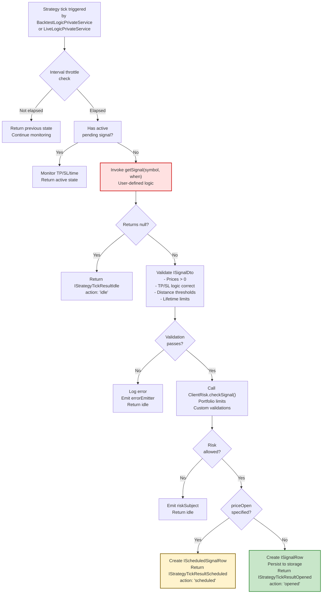
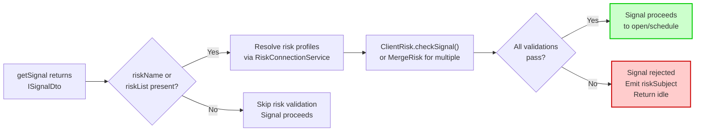
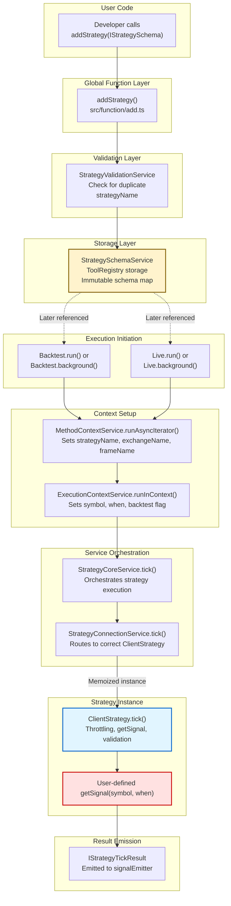

# Strategies

## Purpose and Scope

This document explains what strategies are in Backtest Kit, how they generate trading signals through the `getSignal` function, the `IStrategySchema` interface contract, and how strategies integrate with the execution engine. For implementation details about writing strategies, see [Strategy Development](./25_strategy-development.md). For information about the signals themselves and their lifecycle states, see [Signals & Signal Lifecycle](./08_core-concepts.md). For the execution context that strategies operate within, see [Execution Contexts](./08_core-concepts.md).

---

## What is a Strategy?

A **strategy** is a registered algorithm that evaluates market conditions at regular intervals and produces trading signals. Each strategy is uniquely identified by a `strategyName` and implements a `getSignal` function that returns either a signal to execute or `null` if no trading opportunity exists.

Strategies are stateless algorithms—they do not maintain position tracking or manage signal lifecycle. Instead, they focus solely on signal generation logic. The framework handles signal validation, persistence, risk management, and lifecycle transitions automatically.

**Key Characteristics:**

| Characteristic | Description |
|---------------|-------------|
| **Stateless** | No internal position tracking; each `getSignal` call is independent |
| **Throttled** | `getSignal` is rate-limited by the `interval` parameter (e.g., 5m, 1h) |
| **Single Signal** | Only one active signal per symbol-strategy pair at a time |
| **Mode-Agnostic** | Same code executes in backtest and live modes via temporal context |
| **Risk-Aware** | Optional `riskName` or `riskList` for portfolio-level validation |

Sources: [types.d.ts:728-747]()

---

## IStrategySchema Interface

Strategies are registered using the `addStrategy()` global function with an `IStrategySchema` object. This interface defines the strategy's identity, signal generation logic, and optional configuration.

### Core Fields

```typescript
interface IStrategySchema {
    strategyName: StrategyName;        // Unique identifier
    interval: SignalInterval;          // Throttling interval
    getSignal: (symbol: string, when: Date) => Promise<ISignalDto | null>;
    note?: string;                     // Optional description
    callbacks?: Partial<IStrategyCallbacks>;
    riskName?: RiskName;               // Single risk profile
    riskList?: RiskName[];             // Multiple risk profiles
}
```

### Field Descriptions

| Field | Type | Required | Description |
|-------|------|----------|-------------|
| `strategyName` | `string` | Yes | Unique identifier used throughout the system for routing and reporting |
| `interval` | `SignalInterval` | Yes | Minimum time between `getSignal` calls: `1m`, `3m`, `5m`, `15m`, `30m`, `1h` |
| `getSignal` | `Function` | Yes | Core signal generation function; returns `ISignalDto` or `null` |
| `note` | `string` | No | Human-readable description for documentation purposes |
| `callbacks` | `IStrategyCallbacks` | No | Lifecycle event hooks (see section below) |
| `riskName` | `RiskName` | No | Single risk profile for validation (mutually exclusive with `riskList`) |
| `riskList` | `RiskName[]` | No | Multiple risk profiles; all must pass validation |

Sources: [types.d.ts:728-747](), [src/index.ts:79-88]()

---

## The getSignal Function Contract

The `getSignal` function is the heart of every strategy. It receives execution context implicitly through `ExecutionContextService` and must return either a valid signal DTO or `null`.

### Function Signature

```typescript
getSignal: (symbol: string, when: Date) => Promise<ISignalDto | null>
```

### Parameters

- **`symbol`**: Trading pair (e.g., `"BTCUSDT"`) passed explicitly
- **`when`**: Current timestamp in backtest mode or real-time in live mode; determines the temporal boundary for data access

### Return Value: ISignalDto

When a trading opportunity exists, `getSignal` returns an `ISignalDto` object:

```typescript
interface ISignalDto {
    id?: string;                    // Auto-generated UUID if omitted
    position: "long" | "short";     // Trade direction
    note?: string;                  // Human-readable reason
    priceOpen?: number;             // Entry price (optional for scheduled signals)
    priceTakeProfit: number;        // TP target (required)
    priceStopLoss: number;          // SL exit (required)
    minuteEstimatedTime: number;    // Expected duration before time_expired
}
```

**Signal Types:**

| Condition | Signal Type | Behavior |
|-----------|------------|----------|
| `priceOpen` omitted | **Immediate Signal** | Opens at current VWAP; enters "opened" state immediately |
| `priceOpen` specified | **Scheduled Signal** | Waits for price to reach `priceOpen`; enters "scheduled" state |

### Null Return

When no trading opportunity exists, `getSignal` returns `null`. This is the normal case when market conditions don't meet strategy criteria. The framework handles this gracefully by transitioning to "idle" state and emitting an `IStrategyTickResultIdle` event.

Sources: [types.d.ts:649-665](), [types.d.ts:728-747]()

---

## Strategy Architecture Diagram

This diagram shows the relationship between strategy components from registration to execution:



**Execution Flow:**

1. Developer calls `addStrategy()` with `IStrategySchema`
2. `StrategySchemaService` stores schema in immutable registry
3. On execution, `StrategyConnectionService` routes to cached `ClientStrategy` instance
4. `ClientStrategy.tick()` or `ClientStrategy.backtest()` invokes `getSignal`
5. `getSignal` accesses candles via `getCandles()` (respects temporal context)
6. Returned `ISignalDto` passes through validation pipeline
7. Risk validation checks portfolio constraints
8. Final `IStrategyTickResult` emits to event system

Sources: [types.d.ts:728-747](), [docs/classes/StrategyConnectionService.md:1-145](), [src/function/add.ts]()

---

## Signal Generation Flow

This diagram details the `getSignal` execution process and decision points:



**Key Decision Points:**

1. **Throttle Check**: Prevents `getSignal` from executing more frequently than `interval` allows
2. **Active Signal Check**: Only generates new signals when no active position exists
3. **Null Return**: Normal case when no trading opportunity; returns to idle
4. **Validation**: Multi-stage checks enforced by `GLOBAL_CONFIG` parameters
5. **Risk Validation**: Portfolio-level constraints from `ClientRisk`
6. **priceOpen Logic**: Determines immediate vs. scheduled signal behavior

Sources: [types.d.ts:728-747](), [types.d.ts:649-665]()

---

## Strategy Lifecycle Callbacks

The optional `callbacks` field in `IStrategySchema` provides hooks into signal lifecycle events. All callbacks are optional; the framework emits events to global emitters regardless.

### IStrategyCallbacks Interface

```typescript
interface IStrategyCallbacks {
    onTick: (symbol: string, result: IStrategyTickResult, backtest: boolean) => void;
    onOpen: (symbol: string, data: ISignalRow, currentPrice: number, backtest: boolean) => void;
    onActive: (symbol: string, data: ISignalRow, currentPrice: number, backtest: boolean) => void;
    onIdle: (symbol: string, currentPrice: number, backtest: boolean) => void;
    onClose: (symbol: string, data: ISignalRow, priceClose: number, backtest: boolean) => void;
    onSchedule: (symbol: string, data: IScheduledSignalRow, currentPrice: number, backtest: boolean) => void;
    onCancel: (symbol: string, data: IScheduledSignalRow, currentPrice: number, backtest: boolean) => void;
    onWrite: (symbol: string, data: ISignalRow | null, backtest: boolean) => void;
    onPartialProfit: (symbol: string, data: ISignalRow, currentPrice: number, revenuePercent: number, backtest: boolean) => void;
    onPartialLoss: (symbol: string, data: ISignalRow, currentPrice: number, lossPercent: number, backtest: boolean) => void;
}
```

### Callback Descriptions

| Callback | Trigger | Use Case |
|----------|---------|----------|
| `onTick` | Every tick execution | Generic monitoring of all strategy states |
| `onOpen` | Signal opens at `priceOpen` | Position entry confirmation, logging |
| `onActive` | Signal monitoring (TP/SL tracking) | Real-time P&L tracking, alerts |
| `onIdle` | No active signal | Strategy dormancy monitoring |
| `onClose` | Signal closes (TP/SL/time) | Position exit analysis, statistics |
| `onSchedule` | Scheduled signal created | Pending order notifications |
| `onCancel` | Scheduled signal cancelled | Alert when limit orders don't activate |
| `onWrite` | Signal persisted to storage | Testing persistence layer |
| `onPartialProfit` | Profit milestone (10%, 20%...) | Trail stop adjustments, partial exits |
| `onPartialLoss` | Loss milestone (-10%, -20%...) | Risk management alerts |

**Important Notes:**

- Callbacks execute **in addition to** global event emitters (e.g., `signalEmitter`, `partialProfitSubject`)
- All callbacks receive `backtest` boolean to distinguish execution mode
- Callbacks are synchronous; avoid blocking operations

Sources: [types.d.ts:699-723]()

---

## Interval Throttling

The `interval` field prevents `getSignal` from executing too frequently, reducing computational overhead and preventing signal spam.

### Available Intervals

```typescript
type SignalInterval = "1m" | "3m" | "5m" | "15m" | "30m" | "1h";
```

### Throttling Behavior

| Interval | Backtest Behavior | Live Behavior |
|----------|------------------|---------------|
| `1m` | Evaluates every backtest frame (typically 1-minute) | Evaluates every live tick (~1 minute) |
| `5m` | Evaluates every 5th frame; skips intermediate frames | Evaluates every 5 minutes |
| `1h` | Evaluates every 60th frame | Evaluates hourly |

**Implementation:**

Throttling is enforced in `ClientStrategy.tick()` by comparing current timestamp against last `getSignal` execution time. If insufficient time has elapsed, the strategy returns its current state without invoking `getSignal`.

**Choosing an Interval:**

- **Lower intervals (1m, 5m)**: Higher responsiveness, more computation
- **Higher intervals (30m, 1h)**: Suitable for swing strategies, reduces noise
- **Recommendation**: Match interval to strategy timeframe; a strategy analyzing hourly candles should use `1h` interval

Sources: [types.d.ts:643-645](), [types.d.ts:728-747]()

---

## Risk Integration

Strategies can integrate with the risk management system by specifying `riskName` (single risk profile) or `riskList` (multiple profiles). These fields are mutually exclusive.

### Single Risk Profile

```typescript
addStrategy({
    strategyName: "momentum-strategy",
    riskName: "conservative",  // References addRisk({ riskName: "conservative", ... })
    // ... other fields
});
```

The specified risk profile validates signals before they activate. If validation fails, the signal is rejected and `riskSubject` emits an event.

### Multiple Risk Profiles

```typescript
addStrategy({
    strategyName: "high-risk-strategy",
    riskList: ["max-position-limit", "correlation-check", "volatility-filter"],
    // ... other fields
});
```

All risk profiles in `riskList` must pass validation. If any validation fails, the signal is rejected.

### Risk Validation Flow



**Risk Validation Context:**

The `IRiskCheckArgs` passed to risk validations includes:

- `symbol`: Trading pair
- `pendingSignal`: The signal being validated
- `strategyName`: Strategy attempting to open position
- `exchangeName`: Exchange for execution
- `currentPrice`: Current VWAP
- `timestamp`: Current time

Risk profiles access additional portfolio state via `IRiskValidationPayload`:

- `activePositionCount`: Total open positions across all strategies
- `activePositions`: List of active signals with metadata

Sources: [types.d.ts:728-747](), [types.d.ts:413-426](), [types.d.ts:339-356]()

---

## Strategy Execution Model

Strategies execute differently depending on the mode (backtest vs. live) but use the same `getSignal` logic.

### Backtest Mode Execution

**Flow:**

1. `BacktestLogicPrivateService` generates timeframe array from `IFrameSchema`
2. For each timestamp, `StrategyCoreService` invokes `ClientStrategy.tick()`
3. `ClientStrategy.tick()` checks throttling, calls `getSignal` if allowed
4. If signal opens, `ClientStrategy.backtest()` is called with future candles
5. `backtest()` iterates through candles, checking TP/SL on each candle
6. Once signal closes, iteration continues to next timeframe

**Optimization:**

The "fast backtest" optimization skips timeframes while a signal is active, jumping directly to candles for TP/SL monitoring. This dramatically reduces iterations for long-duration signals.

### Live Mode Execution

**Flow:**

1. `LiveLogicPrivateService` enters infinite loop with `sleep(TICK_TTL)`
2. Every ~1 minute, `StrategyCoreService` invokes `ClientStrategy.tick()`
3. `ClientStrategy.tick()` checks throttling, calls `getSignal` if allowed
4. If signal opens, it persists to storage for crash recovery
5. On subsequent ticks, TP/SL monitoring continues until closure
6. On closure, persisted signal is deleted

**Persistence:**

Only "opened" signals persist to storage (via `PersistSignalAdapter`). Scheduled signals remain ephemeral until activation. This enables crash recovery without data bloat.

Sources: High-level system diagrams provided, [types.d.ts:728-747]()

---

## Registration and Routing Flow

This diagram traces the path from `addStrategy()` to strategy execution in both modes:



**Key Components:**

- **addStrategy()**: Entry point, delegates to `StrategySchemaService`
- **StrategySchemaService**: Stores schemas in `ToolRegistry` (immutable map)
- **StrategyValidationService**: Checks for duplicate names using memoization
- **MethodContextService**: Propagates schema names (strategyName, exchangeName, frameName) through call stack
- **ExecutionContextService**: Propagates runtime state (symbol, when, backtest flag)
- **StrategyCoreService**: Top-level orchestrator, delegates to ConnectionService
- **StrategyConnectionService**: Routes to memoized `ClientStrategy` instances by `symbol:strategyName` key
- **ClientStrategy**: Implements `IStrategy` interface, executes `getSignal` and manages signal state machine

Sources: [src/function/add.ts](), [types.d.ts:728-747](), [docs/classes/StrategyConnectionService.md:1-145]()

---

## Code Entity Reference

This table maps conceptual strategy components to concrete code entities:

| Concept | Code Entity | Location | Description |
|---------|-------------|----------|-------------|
| Strategy Schema | `IStrategySchema` | [types.d.ts:728-747]() | Registration interface |
| Signal DTO | `ISignalDto` | [types.d.ts:649-665]() | Return type of `getSignal` |
| Signal Row | `ISignalRow` | [types.d.ts:669-687]() | Augmented signal with metadata |
| Scheduled Signal | `IScheduledSignalRow` | [types.d.ts:694-697]() | Signal awaiting price activation |
| Tick Result | `IStrategyTickResult` | [types.d.ts:888]() | Discriminated union of all states |
| Interval Type | `SignalInterval` | [types.d.ts:645]() | Throttling intervals |
| Callbacks | `IStrategyCallbacks` | [types.d.ts:699-723]() | Lifecycle event hooks |
| Registration | `addStrategy()` | [src/function/add.ts]() | Global registration function |
| Schema Storage | `StrategySchemaService` | [docs/classes/StrategySchemaService.md]() | Immutable registry |
| Routing | `StrategyConnectionService` | [docs/classes/StrategyConnectionService.md]() | Memoized instance routing |
| Orchestration | `StrategyCoreService` | [docs/classes/StrategyCoreService.md]() | Top-level execution coordinator |
| Implementation | `ClientStrategy` | [docs/classes/ClientExchange.md]() | Strategy instance with tick/backtest methods |
| Risk Integration | `ClientRisk` | [docs/classes/ClientRisk.md]() | Signal validation |

Sources: [types.d.ts:728-747](), [docs/classes/StrategyConnectionService.md:1-145]()

---

## Summary

Strategies in Backtest Kit are:

1. **Registered** via `addStrategy()` with an `IStrategySchema` object
2. **Identified** by unique `strategyName` for routing and reporting
3. **Throttled** by `interval` to control `getSignal` execution frequency
4. **Stateless** algorithms that generate `ISignalDto` or return `null`
5. **Validated** through multi-stage checks (TP/SL logic, GLOBAL_CONFIG, risk profiles)
6. **Mode-agnostic** via temporal context provided by `ExecutionContextService`
7. **Event-driven** with optional lifecycle callbacks and global emitters
8. **Single-signal** constrained—one active signal per symbol-strategy pair

The `getSignal` function is the core contract: it receives temporal context implicitly, accesses market data via `getCandles()`, and returns trading signals that the framework validates, persists, and monitors through completion.

For practical implementation guidance, see [Strategy Development](./25_strategy-development.md). For detailed `getSignal` patterns, see [Signal Generation (getSignal)](./25_strategy-development.md).

Sources: [types.d.ts:728-747](), [types.d.ts:649-665](), [README.md:1-255]()